# Using Fidus with Claude Code

This guide explains how to work effectively with the Fidus codebase using Claude Code (formerly Claude Dev).

## Table of Contents

- [Overview](#overview)
- [Getting Started](#getting-started)
- [Project Context](#project-context)
- [Common Tasks](#common-tasks)
- [Best Practices](#best-practices)
- [Architecture Guidance](#architecture-guidance)
- [Troubleshooting](#troubleshooting)

## Overview

Fidus is a **monorepo** with multiple packages built using:
- **Domain-Driven Design (DDD)** - Clear bounded contexts
- **Multi-Agent Architecture** - LangGraph-based supervisors
- **Fair-Code License** - Sustainable Use License (see [LICENSE.md](LICENSE.md))

### Project Context

Fidus is currently a **two-person project** (Sebastian + Claude Code), with potential for open community involvement later. Keep this in mind when:
- ❌ **DON'T** use team-oriented language ("the team will...", "frontend team", "backend team")
- ❌ **DON'T** provide time estimates or sprint planning ("Week 1-2", "Phase 1 takes 3 weeks")
- ❌ **DON'T** reference imaginary stakeholders ("discuss with team", "get approval from product owner")
- ✅ **DO** focus on technical decisions and implementation details
- ✅ **DO** provide options and trade-offs for Sebastian to decide
- ✅ **DO** write code and documentation that's ready to use

### Key Principles

When working with Fidus, keep these principles in mind:

1. **Privacy-First** - All features must respect user privacy
2. **Domain Boundaries** - Respect bounded context boundaries
3. **Type Safety** - Use TypeScript/Python type hints extensively
4. **Test Coverage** - Maintain > 80% test coverage
5. **Documentation** - Keep docs in sync with code
6. **Language** - **All code, documentation, and comments must be in English**
   - Code: Variable names, function names, class names in English
   - Documentation: All .md files in English (except dedicated translations)
   - Comments: Inline and block comments in English
   - Commit messages: In English
   - Exception: Brand identity documents may have German originals with English translations
7. **Pull Request Workflow** - **All changes to main branch must go through Pull Requests**
   - NEVER push directly to main branch
   - Always create a feature branch for your work
   - Create a PR and merge it (even if you're working alone)
   - This ensures code review history and CI checks run
   - Exception: Emergency hotfixes (document reason in PR)
8. **AI-Driven UI Paradigm** - **Fidus UI is NOT traditional - it's context-adaptive**
   - Read [docs/ux-ui-design/00-ai-driven-ui-paradigm.md](docs/ux-ui-design/00-ai-driven-ui-paradigm.md) BEFORE implementing UI
   - NO fixed screens (Dashboard Screen, Calendar Screen) - use contextual rendering
   - LLM decides UI form (chat vs form vs widget) at runtime based on context
   - Dashboard is Opportunity Surface with dynamic cards (NOT static widgets)
   - User controls dismissal (swipe/X button) - NO auto-hide timers
   - Show EXAMPLES not RULES in documentation ("might show" not "always shows")

## AI-Driven UI Paradigm (CRITICAL for Frontend Work!)

**READ THIS BEFORE WORKING ON ANY UI/UX CODE:**

Fidus uses an **AI-Driven UI Paradigm** that is fundamentally different from traditional application UI. Understanding this paradigm is **mandatory** before implementing any frontend features.

### Core Concept

The UI is **NOT predetermined**. Instead:
- The **LLM analyzes user context** (time, location, history, intent)
- The **LLM decides which UI form** to render (chat, form, widget, wizard)
- The **same user query** can produce **different UIs** in different contexts

### What This Means for Development

**❌ WRONG Approach (Traditional UI):**
```typescript
// ❌ BAD: Hardcoded screen routing
if (route === '/calendar') {
  return <CalendarScreen />
}

// ❌ BAD: Fixed widget on dashboard
<Dashboard>
  <WeatherWidget /> {/* Always visible */}
  <CalendarWidget /> {/* Always visible */}
</Dashboard>

// ❌ BAD: Predetermined form
function createBudget() {
  return <BudgetForm /> // Always shows form
}
```

**✅ CORRECT Approach (AI-Driven UI):**
```typescript
// ✅ GOOD: LLM decides what to render
async function renderResponse(userQuery: string, context: Context) {
  const decision = await llm.decideUIForm(userQuery, context)

  switch (decision.uiForm) {
    case 'text':
      return <ChatResponse text={decision.text} />
    case 'widget':
      return <DynamicWidget type={decision.widgetType} data={decision.data} />
    case 'form':
      return <DynamicForm fields={decision.formFields} />
    case 'wizard':
      return <MultiStepWizard steps={decision.steps} />
  }
}

// ✅ GOOD: Dashboard renders opportunity cards dynamically
function Dashboard() {
  const opportunities = useOpportunities() // LLM decides relevance

  return (
    <OpportunitySurface>
      {opportunities.map(opp => (
        <OpportunityCard
          key={opp.id}
          onDismiss={() => dismissCard(opp.id)} // User controls
        />
      ))}
    </OpportunitySurface>
  )
}

// ✅ GOOD: LLM decides form vs wizard vs chat
async function handleBudgetCreation(intent: string, userLevel: UserLevel) {
  if (userLevel === 'expert' && hasAllParameters(intent)) {
    return <QuickBudgetForm prefilled={extractParams(intent)} />
  } else if (userLevel === 'beginner') {
    return <BudgetCreationWizard />
  } else {
    return <ConversationalBudgetCreation />
  }
}
```

### Key Rules for Frontend Development

1. **NO Fixed Screens**
   - Don't create `CalendarScreen.tsx`, `FinanceScreen.tsx`
   - Create `CalendarWidget.tsx`, `FinanceWidget.tsx` that can appear **anywhere**

2. **Dashboard = Opportunity Surface**
   - Dashboard doesn't have fixed widgets
   - It renders `OpportunityCard` components dynamically
   - Cards are decided by LLM based on relevance

3. **User Controls Dismissal**
   - Every card/widget has swipe gesture or X button
   - **NEVER** use `setTimeout()` to auto-hide
   - Cards stay until user explicitly dismisses

4. **Context-Driven Rendering**
   - Pass context to LLM: `{ time, location, userHistory, currentActivity }`
   - LLM returns UI decision: `{ uiForm: 'widget', widgetType: 'calendar' }`
   - Render based on LLM decision, not hardcoded logic

5. **Examples, Not Rules**
   - Don't hardcode "morning = weather widget"
   - Let LLM decide if weather is relevant NOW
   - Use language: "might show", "could render", "based on context"

### Required Reading

**MUST READ before UI work:**
1. [docs/ux-ui-design/00-ai-driven-ui-paradigm.md](docs/ux-ui-design/00-ai-driven-ui-paradigm.md) - THE FOUNDATION
2. [docs/ux-ui-design/04-interaction-patterns.md](docs/ux-ui-design/04-interaction-patterns.md) - 4 core patterns
3. [docs/ux-ui-design/06-contextual-ui-patterns.md](docs/ux-ui-design/06-contextual-ui-patterns.md) - Domain examples

**For specific features:**
- Components: [docs/ux-ui-design/05-design-system-components.md](docs/ux-ui-design/05-design-system-components.md)
- Responsive: [docs/ux-ui-design/07-responsive-pwa.md](docs/ux-ui-design/07-responsive-pwa.md)
- Privacy UI: [docs/ux-ui-design/08-privacy-trust-ux.md](docs/ux-ui-design/08-privacy-trust-ux.md)
- AI UX: [docs/ux-ui-design/09-ai-llm-ux.md](docs/ux-ui-design/09-ai-llm-ux.md)

### Anti-Patterns to Avoid

**❌ Don't do this:**
- Fixed navigation bars with "Calendar", "Finance", "Travel" tabs
- Static dashboard with permanent widgets
- Route-based rendering (`/calendar` → `CalendarScreen`)
- Auto-hiding notifications after X seconds
- Predetermined "if user does X, show Y" logic
- Hardcoded morning/evening layouts

**✅ Do this instead:**
- Minimal navigation (only Dashboard access + Settings)
- Dynamic opportunity cards that LLM decides to show
- Context-based rendering (LLM chooses UI form)
- User-dismissed cards (swipe/X button)
- LLM-driven "based on context, render Y" logic
- Time-aware opportunity scoring (LLM decides relevance)

### Testing UI Components

When testing, test **context variations**:

```typescript
describe('BudgetCreation', () => {
  it('should render form for expert user with complete intent', async () => {
    const context = { userLevel: 'expert', intent: 'Create food budget 500 EUR monthly' }
    const ui = await renderBudgetUI(context)
    expect(ui).toBeInstanceOf(QuickBudgetForm)
  })

  it('should render wizard for beginner user', async () => {
    const context = { userLevel: 'beginner', intent: 'Budget' }
    const ui = await renderBudgetUI(context)
    expect(ui).toBeInstanceOf(BudgetWizard)
  })

  it('should render chat for ambiguous intent', async () => {
    const context = { userLevel: 'intermediate', intent: 'Money stuff' }
    const ui = await renderBudgetUI(context)
    expect(ui).toBeInstanceOf(ConversationalFlow)
  })
})
```

### Questions About This Paradigm?

- Read: [docs/ux-ui-design/00-ai-driven-ui-paradigm.md](docs/ux-ui-design/00-ai-driven-ui-paradigm.md)
- Ask in: [GitHub Discussions - Design category](https://github.com/y-core-engineering/fidus/discussions)
- Discord: #design channel

---

## Essential Commands

### Building

Use `pnpm build` to build all packages. **ALWAYS redirect the output to a file:**

```bash
pnpm build > build.log 2>&1
```

You can inspect the last few lines of the build log to check for errors:
```bash
tail -n 20 build.log
```

### Testing

- `pnpm test` - Run all tests across all packages
- `pnpm --filter @fidus/api test` - Run API tests (Python/pytest)
- `pnpm --filter @fidus/web test` - Run web tests (Vitest)
- `pnpm --filter @fidus/cli test` - Run CLI tests

**Important:** When running tests for a specific package, always work from within that package directory:

```bash
# Use pushd/popd for navigation
pushd packages/api
poetry run pytest tests/domain/test_calendar.py -v
popd  # Returns to previous directory

# Check current directory if unsure
pwd
```

### Code Quality

- `pnpm lint` - Lint all packages
- `pnpm typecheck` - Run type checks across TypeScript packages
- `pnpm format` - Format code with Prettier

**Always run lint and typecheck before committing code.** Execute these commands from within the specific package directory you're working on (e.g., `cd packages/web && pnpm lint`). When your changes affect shared types or cross-package dependencies, build the system first before running typecheck:

```bash
pnpm build > build.log 2>&1
pnpm typecheck
```

## Getting Started

### Initial Setup

When starting a new Claude Code session:

```
I'm working on the Fidus codebase. This is a privacy-first AI personal assistant
built as a monorepo with:
- packages/api: FastAPI backend with LangGraph agents (Python)
- packages/web: Next.js frontend (TypeScript)
- packages/cli: Command-line interface (TypeScript)
- packages/shared: Shared types and utilities (TypeScript)

The architecture follows Domain-Driven Design with bounded contexts for
Calendar, Finance, Travel, Communication, Health, Home, Shopping, and Learning.

Please review the architecture documentation at docs/architecture/README.md
before making significant changes.
```

### Key Files to Reference

**Architecture:**
- [docs/architecture/README.md](docs/architecture/README.md) - System architecture
- [docs/domain-model/README.md](docs/domain-model/README.md) - DDD overview

**Domain Models:**
- [docs/domain-model/03-orchestration-domain.md](docs/domain-model/03-orchestration-domain.md) - Intent detection & routing
- [docs/domain-model/04-calendar-domain.md](docs/domain-model/04-calendar-domain.md) - Calendar management
- [docs/domain-model/05-finance-domain.md](docs/domain-model/05-finance-domain.md) - Financial tracking
- [docs/domain-model/09-proactivity-domain.md](docs/domain-model/09-proactivity-domain.md) - Proactive suggestions

**Licensing:**
- [LICENSE.md](LICENSE.md) - Sustainable Use License
- [docs/licensing/FAQ.md](docs/licensing/FAQ.md) - Licensing FAQ

## Project Context

### Monorepo Structure

```
packages/
├── api/           # Backend (Python + FastAPI + LangGraph)
│   ├── fidus/
│   │   ├── api/          # REST API routes
│   │   ├── domain/       # Domain logic (DDD)
│   │   └── infrastructure/  # External services
│   └── tests/
├── web/           # Frontend (Next.js + React)
│   └── src/
│       ├── app/          # Next.js App Router pages
│       ├── components/   # React components
│       └── lib/          # Utilities
├── cli/           # CLI (Node.js + TypeScript)
│   └── src/
│       ├── commands/     # CLI commands
│       └── utils/        # CLI utilities
└── shared/        # Shared code (TypeScript)
    └── src/
        ├── types/        # Shared types
        ├── schemas/      # Zod schemas
        └── utils/        # Utilities
```

### Domain-Driven Design

Fidus uses **DDD with 8 bounded contexts:**

**Core Domains:**
- **Orchestration** - Intent detection and routing
- **Proactivity** - Opportunity detection and suggestions

**Supporting Domains:**
- **Calendar** - Appointment and event management
- **Finance** - Transaction and budget tracking
- **Travel** - Trip planning and coordination
- **Communication** - Email and message management
- **Health** - Medical and wellness tracking
- **Home** - Smart home and maintenance
- **Shopping** - Shopping list and price tracking
- **Learning** - Course and study management

**Generic Domains:**
- **Identity & Access** - Authentication and authorization
- **Profile** - User profiles and preferences
- **Plugin** - External integrations
- **Audit & Compliance** - Logging and compliance

### Key Terminology

| Architecture Term | DDD Term | Explanation |
|------------------|----------|-------------|
| **Supervisor** | **Bounded Context** | A Supervisor is the LangGraph implementation of a Bounded Context |
| **Data Signals** | - | Pull-based state queries via MCP (e.g., `calendar.free_slots`) |
| **Domain Events** | **Domain Events** | Push-based state changes (e.g., `AppointmentCreated`) |
| **Proactive Triggers** | - | Derived opportunities (e.g., `DOUBLE_BOOKING`) |

See [docs/architecture/README.md](docs/architecture/README.md) for details.

## Common Tasks

### Task 1: Adding a New Feature to a Domain

**Example:** Add recurring event support to Calendar domain

**Steps:**

1. **Review Domain Model**
   ```
   Please read docs/domain-model/04-calendar-domain.md to understand
   the Calendar bounded context architecture.
   ```

2. **Update Domain Model Documentation**
   ```
   Add RecurrencePattern value object to the Calendar domain model.
   Include: frequency, interval, end date, exceptions.
   ```

3. **Implement Backend (Python)**
   ```
   In packages/api/fidus/domain/calendar/:
   1. Add RecurrencePattern value object
   2. Update Appointment aggregate to include recurrence
   3. Add domain event: RecurringAppointmentCreated
   4. Update CalendarSupervisor to handle recurring events
   5. Add tests
   ```

4. **Update Shared Types (TypeScript)**
   ```
   In packages/shared/src/types/calendar.ts:
   - Add RecurrencePattern interface
   - Add RecurrenceSchema (Zod)
   ```

5. **Implement Frontend (React)**
   ```
   In packages/web/src/components/calendar/:
   - Add RecurrenceInput component
   - Update AppointmentForm to include recurrence
   - Add tests
   ```

### Task 2: Adding a New Bounded Context

**Example:** Add a "Pets" domain for pet care management

**Steps:**

1. **Create Domain Model Documentation**
   ```
   Create docs/domain-model/15-pets-domain.md following the template
   from existing domain models. Include:
   - Aggregates: Pet, VetAppointment, VaccinationRecord
   - Value Objects: PetBreed, VaccinationSchedule
   - Domain Events: PetRegistered, VaccinationDue
   - Domain Services: VetAppointmentScheduler
   - Proactive Triggers: VACCINATION_DUE, VET_CHECKUP_OVERDUE
   ```

2. **Implement Backend Supervisor**
   ```
   In packages/api/fidus/domain/pets/:
   1. Create pets/ directory
   2. Implement aggregates (pet.py, vet_appointment.py)
   3. Implement PetsSupervisor (LangGraph state machine)
   4. Add repository (pets_repository.py)
   5. Add database models (SQLAlchemy)
   6. Create migration: alembic revision -m "add pets domain"
   7. Add comprehensive tests
   ```

3. **Register with Orchestration**
   ```
   Update packages/api/fidus/domain/orchestration/orchestration_supervisor.py:
   - Add PetsSupervisor to available supervisors
   - Update intent detection to recognize pet-related intents
   ```

4. **Add Frontend Components**
   ```
   In packages/web/src/components/pets/:
   - Create PetList, PetDetails, VetAppointmentCard components
   - Add to navigation
   ```

5. **Add CLI Commands**
   ```
   In packages/cli/src/commands/:
   - Add pets.ts with commands: list, add, vet schedule
   ```

### Task 3: Fixing a Bug

**Example:** Calendar double-booking detection not working

**Steps:**

1. **Understand the Issue**
   ```
   Please review:
   1. docs/domain-model/04-calendar-domain.md - Calendar domain rules
   2. packages/api/fidus/domain/calendar/appointment.py - Appointment aggregate
   3. packages/api/tests/domain/test_calendar.py - Existing tests

   Then explain the likely cause of the double-booking detection failure.
   ```

2. **Write Failing Test**
   ```
   Add a test in packages/api/tests/domain/test_calendar.py that
   reproduces the double-booking issue.
   ```

3. **Fix the Bug**
   ```
   Fix the overlap detection logic in
   packages/api/fidus/domain/calendar/appointment.py
   ```

4. **Verify Fix**
   ```
   Run: cd packages/api && poetry run pytest tests/domain/test_calendar.py -v
   ```

### Task 4: Refactoring

**Example:** Extract common date utilities

**Steps:**

1. **Identify Code Duplication**
   ```
   Search for duplicate date calculation logic across:
   - packages/api/fidus/domain/calendar/
   - packages/api/fidus/domain/travel/
   ```

2. **Create Shared Utilities**
   ```
   In packages/shared/src/utils/date.ts:
   - Create calculateDuration()
   - Create isOverlapping()
   - Create formatTimeRange()
   - Add comprehensive tests
   ```

3. **Update Python Side**
   ```
   In packages/api/fidus/infrastructure/utils/date.py:
   - Mirror the same utilities for Python
   - Ensure consistent behavior
   ```

4. **Replace Usages**
   ```
   Update all instances to use the shared utilities.
   Verify tests still pass.
   ```

## Best Practices

### TypeScript Best Practices (Critical!)

**Type Safety:**
- ⚠️ **NEVER use `any` type** - Use proper types or `unknown`
- ⚠️ **Avoid type casting with `as`** - Use type guards or type predicates instead
- ✅ **Define shared interfaces in `@fidus/shared` package** for cross-package communication
- ✅ **Use Zod schemas** for runtime validation alongside TypeScript types

**Examples:**

```typescript
// ❌ BAD: Using 'any'
function processData(data: any) {
  return data.value;
}

// ✅ GOOD: Using proper types
function processData(data: { value: string }): string {
  return data.value;
}

// ❌ BAD: Type casting with 'as'
const value = response as Budget;

// ✅ GOOD: Type guard
function isBudget(value: unknown): value is Budget {
  return (
    typeof value === 'object' &&
    value !== null &&
    'amount' in value &&
    'category' in value
  );
}

if (isBudget(response)) {
  // TypeScript knows response is Budget here
  console.log(response.amount);
}
```

### Python Best Practices

**Type Hints:**
- ✅ **Always use type hints** for function parameters and return values
- ✅ **Use `from __future__ import annotations`** for forward references
- ✅ **Run mypy in strict mode** to catch type issues

**Error Handling:**
- ✅ Use specific error classes for different failure modes
- ✅ Include context information in error messages
- ✅ Log errors with structured logging

```python
# ✅ GOOD: Specific error with context
class BudgetExceededError(Exception):
    """Raised when budget limit is exceeded."""

    def __init__(self, budget_id: str, limit: Decimal, spent: Decimal):
        self.budget_id = budget_id
        self.limit = limit
        self.spent = spent
        super().__init__(
            f"Budget {budget_id} exceeded: spent {spent} > limit {limit}"
        )
```

### Frontend Development (Web Package)

**CSS Guidelines:**
- ✅ **Use CSS variables directly** from design system
- ❌ **Never hardcode spacing as px values**
- ✅ Use design tokens: `var(--spacing-md)`, `var(--color-primary)`
- ✅ `data-test-id` must be a single value (no spaces or multiple values)

**Example:**
```tsx
// ❌ BAD: Hardcoded spacing
<div style={{ padding: '16px', margin: '8px' }}>

// ✅ GOOD: CSS variables
<div style={{
  padding: 'var(--spacing-md)',
  margin: 'var(--spacing-sm)'
}}>

// ✅ GOOD: Test ID (single value)
<button data-test-id="submit-budget-button">

// ❌ BAD: Test ID (multiple values)
<button data-test-id="submit budget button">
```

**Internationalization:**
- ✅ **All UI text must use i18n** - No hardcoded strings
- ✅ Add translations to appropriate locale files
- ✅ Use descriptive translation keys

### Documentation

**Use Mermaid Diagrams:**
When you need to visualize architecture, flows, or relationships, use Mermaid diagrams in markdown files.

**IMPORTANT: Check Mermaid Diagrams Before Committing:**
- ✅ **Always run the Mermaid checker** before committing documentation changes
- ✅ **Quote labels with special chars** - Use `["Text | or (parens)"]` for PIPE or parentheses
- ✅ **Avoid PIPE in unquoted labels** - Better: `[Text or alternatives]` or `[Text, list, items]`
- ✅ **No nested brackets** in node labels - use `•` or `→` for buttons/actions
- ✅ **Explicit text colors** on dark backgrounds for contrast

```bash
# Check all Mermaid diagrams
node scripts/check-mermaid.js docs/**/*.md

# This check runs automatically in:
# 1. Pre-push hook (local)
# 2. GitHub Actions CI (on every PR)
```

**Mermaid Best Practices:**

```markdown
## Calendar Workflow

```mermaid
graph TD
    A[User Request] --> B{Parse Intent}
    B -->|Calendar| C[Calendar Supervisor]
    C --> D{Check Conflicts}
    D -->|No Conflicts| E[Create Appointment]
    D -->|Conflict Found| F[Suggest Alternatives]
    E --> G[Emit AppointmentCreated Event]
    F --> H[Return to User]

    %% ✅ GOOD: Actions separated with 'or' or ','
    Actions[View Details or Adjust Budget]
    Filters[Date, Merchant, Amount]

    %% ❌ BAD: Don't use PIPE in unquoted node labels
    %% BadActions[View Details | Adjust Budget]  ← Parse error!

    %% ✅ ALTERNATIVE: Quote labels with special characters
    QuotedActions["View Details | Adjust Budget"]
    Privacy["Privacy: High (Compliance)"]

    %% ✅ GOOD: Use bullets for button lists
    Card[Budget Alert<br/>• Set Alarm • Dismiss]

    %% ❌ BAD: Nested brackets
    %% BadCard[Alert<br/>[Button1] [Button2]]  ← Parse error!

    %% ✅ GOOD: Explicit text color on dark backgrounds
    style E fill:#000000,color:#ffffff
```


```

### When Adding Features

**DO:**
- ✅ Read relevant domain model documentation first
- ✅ Respect bounded context boundaries
- ✅ Add comprehensive tests (> 80% coverage)
- ✅ Update documentation with Mermaid diagrams where helpful
- ✅ Use type hints (Python) and strict TypeScript types
- ✅ Follow existing code style
- ✅ Consider privacy implications
- ✅ Use pushd/popd for directory navigation
- ✅ Redirect build output to log files

**DON'T:**
- ❌ Skip reading architecture docs
- ❌ Mix concerns across bounded contexts
- ❌ Add features without tests
- ❌ Leave documentation outdated
- ❌ Use `any` types in TypeScript
- ❌ Use type casting with `as`
- ❌ Hardcode CSS spacing values
- ❌ Add telemetry or tracking (privacy-first!)
- ❌ Use multiple values in data-test-id attributes

### Code Style

**Python (API):**
```python
# Use type hints
def calculate_budget_utilization(
    budget: Budget,
    transactions: List[Transaction]
) -> float:
    """Calculate percentage of budget utilized."""
    # Implementation

# Use domain events
class Budget:
    def exceed_limit(self) -> BudgetExceeded:
        """Mark budget as exceeded and emit event."""
        self.status = BudgetStatus.EXCEEDED
        return BudgetExceeded(
            budget_id=self.id,
            limit=self.amount,
            spent=self.total_spent
        )
```

**TypeScript (Web/CLI/Shared):**
```typescript
// Use strict types
interface Budget {
  id: string;
  amount: Money;
  category: BudgetCategory;
  spent: Money;
}

// Use Zod for validation
const BudgetSchema = z.object({
  id: z.string().uuid(),
  amount: MoneySchema,
  category: z.enum(['FOOD', 'TRANSPORT', 'ENTERTAINMENT']),
  spent: MoneySchema,
});

// Use functional components
export function BudgetCard({ budget }: { budget: Budget }) {
  const utilization = useMemo(
    () => (budget.spent.amount / budget.amount.amount) * 100,
    [budget]
  );

  return <Card>{/* Implementation */}</Card>;
}
```

### Testing Guidelines

**Test Execution:**
- ✅ **Always work from within the package directory** when running tests
- ✅ **Use pushd/popd** for navigation to avoid getting lost
- ✅ **Mock all external dependencies** in unit tests
- ✅ **Confirm test cases with user** before writing extensive unit tests

**Testing Stack:**
- **Backend (Python):** pytest for unit tests, examples in `packages/api/tests/`
- **Frontend (TypeScript):** Vitest for component tests
- **E2E:** Playwright for end-to-end tests
- **Mocking:** Use appropriate mocking libraries (pytest fixtures, vitest mocks)

**Python Testing:**
```python
# Arrange-Act-Assert pattern
def test_budget_exceed_detection():
    """Should detect when budget is exceeded."""
    # Arrange
    budget = Budget(amount=Money(1000, 'EUR'), category='FOOD')
    transactions = [
        Transaction(amount=Money(600, 'EUR')),
        Transaction(amount=Money(500, 'EUR')),
    ]

    # Act
    result = budget.check_limit(transactions)

    # Assert
    assert result.is_exceeded
    assert result.overage == Money(100, 'EUR')
```

**TypeScript Testing:**
```typescript
describe('BudgetCard', () => {
  it('should display budget utilization percentage', () => {
    const budget: Budget = {
      id: '123',
      amount: { value: 1000, currency: 'EUR' },
      category: 'FOOD',
      spent: { value: 750, currency: 'EUR' },
    };

    render(<BudgetCard budget={budget} />);

    expect(screen.getByText('75%')).toBeInTheDocument();
  });
});
```

**Running Tests:**
```bash
# Navigate to package
pushd packages/api

# Run specific test file
poetry run pytest tests/domain/test_finance.py -v

# Run with coverage
poetry run pytest --cov=fidus --cov-report=html

# Return to root
popd

# Run frontend tests
pushd packages/web
pnpm test
popd
```

## Architecture Guidance

### Multi-Agent System (LangGraph)

Each bounded context is implemented as a **LangGraph Supervisor**:

```python
from langgraph.graph import StateGraph
from fidus.domain.calendar.state import CalendarState


class CalendarSupervisor:
    """Supervisor for Calendar bounded context."""

    def __init__(self):
        self.graph = StateGraph(CalendarState)
        self._build_graph()

    def _build_graph(self):
        """Build the state machine graph."""
        self.graph.add_node("parse_request", self.parse_request)
        self.graph.add_node("check_conflicts", self.check_conflicts)
        self.graph.add_node("create_appointment", self.create_appointment)

        self.graph.add_edge("parse_request", "check_conflicts")
        self.graph.add_conditional_edges(
            "check_conflicts",
            self.should_proceed,
            {
                "proceed": "create_appointment",
                "abort": END,
            }
        )
```

### Event-Driven Communication

Bounded contexts communicate via **Domain Events** (Redis Pub/Sub):

```python
# Publishing event
event = AppointmentCreated(
    appointment_id="123",
    tenant_id="tenant-1",
    start_time=datetime(...),
    end_time=datetime(...),
)
await event_bus.publish("calendar.appointment.created", event)

# Subscribing to event (in Travel supervisor)
@event_bus.subscribe("calendar.appointment.created")
async def on_appointment_created(event: AppointmentCreated):
    """Check if travel booking needed."""
    # Implementation
```

### Proactive Triggers

Domains emit **Proactive Triggers** for the Proactivity supervisor:

```python
# In Finance domain
trigger = ProactiveTrigger(
    trigger_type='BUDGET_EXCEEDED',
    opportunity_type=OpportunityType.URGENT,
    budget_id="budget-123",
    confidence=1.0,
    context={
        'category': 'FOOD',
        'limit': 1000,
        'spent': 1250,
        'overage': 250,
    }
)
await trigger_bus.emit(trigger)
```

### Multi-Tenancy

All data is tenant-isolated:

```python
class Appointment:
    """Calendar appointment aggregate."""

    def __init__(self, tenant_id: str, **kwargs):
        self.tenant_id = tenant_id  # Required for all aggregates
        # Other fields

    def _ensure_same_tenant(self, other: 'Appointment'):
        """Ensure operations are within same tenant."""
        if self.tenant_id != other.tenant_id:
            raise TenantMismatchError()
```

## Troubleshooting

### Common Issues

**Issue:** Tests failing after domain model changes

**Solution:**
```bash
# 1. Update domain model documentation first
# 2. Update tests to match new expected behavior
# 3. Implement changes
# 4. Verify all tests pass

pushd packages/api
poetry run pytest tests/domain/ -v
popd
```

**Issue:** TypeScript type errors in shared package

**Solution:**
```bash
# When types are failing across packages, rebuild shared first
pushd packages/shared
pnpm build
popd

# Then check types in dependent package
pushd packages/web
pnpm typecheck
popd
```

**Issue:** Build failures with cryptic errors

**Solution:**
```bash
# Always redirect build output to log file for inspection
pnpm build > build.log 2>&1

# Inspect the last 50 lines for actual errors
tail -n 50 build.log

# Check for specific package errors
grep -i "error" build.log
```

**Issue:** API can't find domain module

**Solution:**
```bash
pushd packages/api
poetry install  # Reinstall dependencies
poetry run python -c "import fidus; print(fidus.__file__)"  # Verify import
popd
```

**Issue:** LangGraph supervisor not routing correctly

**Solution:**
```bash
# 1. Review docs/domain-model/03-orchestration-domain.md
# 2. Check intent detection logic in OrchestrationSupervisor
# 3. Add logging to see routing decisions
# 4. Verify supervisor is registered

pushd packages/api
# Run with debug logging
LOG_LEVEL=DEBUG poetry run uvicorn fidus.main:app --reload
popd
```

**Issue:** Lost in directory navigation

**Solution:**
```bash
# Always use pushd/popd for navigation
pwd  # Check current directory

# If lost, return to root
cd /path/to/fidus

# Or use popd multiple times
popd
popd
```

### Getting Help

When asking Claude Code for help:

**Good prompts:**
```
"I need to add recurring event support to the Calendar domain.
Please review docs/domain-model/04-calendar-domain.md and suggest
an implementation approach that follows DDD principles."

"The budget alert proactive trigger isn't firing. Please review:
1. docs/domain-model/05-finance-domain.md (business rules)
2. packages/api/fidus/domain/finance/budget.py (implementation)
3. packages/api/tests/domain/test_finance.py (tests)
And help me debug the issue."
```

**Less effective prompts:**
```
"Add recurring events"  # Too vague
"Fix the calendar"  # No context
```

## GitHub & Pull Request Guidelines

### Git Workflow

**IMPORTANT: The main branch is protected. All changes MUST go through Pull Requests.**

#### Standard Workflow

1. **Create a feature branch:**
```bash
# For new features
git checkout -b feature/your-feature-name

# For bug fixes
git checkout -b fix/bug-description

# For documentation
git checkout -b docs/what-you-document
```

2. **Make your changes and commit:**
```bash
git add .
git commit -m "feat(domain): your change description"
```

3. **Push to remote:**
```bash
git push -u origin feature/your-feature-name
```

4. **Create Pull Request:**
```bash
# Create and view PR in browser
gh pr create --web

# Or create with CLI
gh pr create --title "feat(domain): your change" --body "Description..."
```

5. **Wait for human approval:**
```
⚠️ IMPORTANT: Claude Code creates PRs but does NOT merge them!
- PR must be reviewed and approved by a human
- CI checks must pass
- Human developer merges via GitHub UI
```

6. **After human merges the PR, update local main branch:**
```bash
git checkout main
git pull
```

**NEVER use `git push` directly when on main branch!** This violates the PR workflow.

**NEVER merge PRs automatically!** Always wait for human approval.

### Creating Pull Requests

When creating a PR, follow these conventions:

**Use GitHub CLI:**
```bash
# Create a draft PR
gh pr create --draft

# Create a regular PR
gh pr create
```

**PR Title Conventions:**
Follow the conventions in [.github/pull_request_title_conventions.md](.github/pull_request_title_conventions.md):

```
feat(calendar): add recurring event support
fix(finance): correct budget calculation for multi-currency
docs(api): update authentication examples
refactor(orchestration): simplify intent detection logic
test(proactivity): add tests for opportunity validation
```

**PR Description:**
- Reference related issues (e.g., `Fixes #123`)
- Include clear description of changes
- Add testing instructions
- Include screenshots for UI changes
- List breaking changes (if any)

**Example PR Description:**
```markdown
## Summary
Adds support for recurring events in the Calendar domain.

## Changes
- Added RecurrencePattern value object
- Updated Appointment aggregate
- Added RecurringAppointmentCreated domain event
- Updated CalendarSupervisor state machine

## Testing
```bash
pushd packages/api
poetry run pytest tests/domain/test_calendar.py::test_recurring_events -v
popd
```

## Breaking Changes
None

## Related Issues
Fixes #42
```

### Branch Naming

Follow this pattern:
- `feature/` - New features (e.g., `feature/recurring-events`)
- `fix/` - Bug fixes (e.g., `fix/calendar-overlap-detection`)
- `docs/` - Documentation (e.g., `docs/update-domain-model`)
- `refactor/` - Code refactoring (e.g., `refactor/simplify-supervisor`)
- `test/` - Test improvements (e.g., `test/add-finance-coverage`)

### Before Submitting PR

**Checklist:**
```bash
# 1. Run tests
pnpm test

# 2. Run linters
pnpm lint

# 3. Type check
pnpm typecheck

# 4. Build (redirect output!)
pnpm build > build.log 2>&1
tail -n 30 build.log

# 5. Check for uncommitted changes
git status

# 6. Review your changes
git diff main...HEAD
```

## Additional Resources

- [Architecture Documentation](docs/architecture/README.md)
- [Domain Models](docs/domain-model/README.md)
- [Contributing Guide](CONTRIBUTING.md)
- [Licensing FAQ](docs/licensing/FAQ.md)
- [Pull Request Template](.github/pull_request_template.md)
- [Pull Request Title Conventions](.github/pull_request_title_conventions.md)

## Questions?

For questions about using Claude Code with Fidus:
- **GitHub Discussions:** https://github.com/y-core-engineering/fidus/discussions
- **Discord:** https://discord.gg/fidus
- **Email:** dev@fidus.ai

---

**Happy coding with Claude!** 🤖💙

*Remember: Build output to files, pushd/popd for navigation, no `any` types, CSS variables only!*
