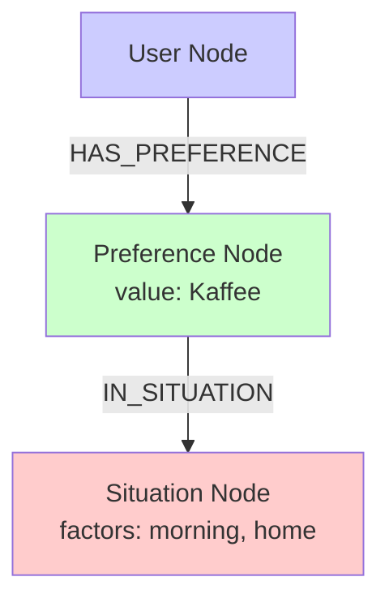
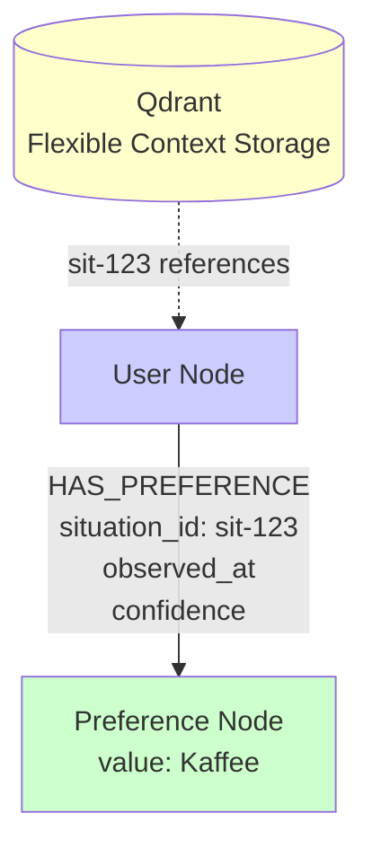

# ADR-0001: Situational Context as Relationship Qualifier

**Status:** Proposed
**Date:** 2025-11-19
**Deciders:** Sebastian Herden, Claude Code
**Tags:** architecture, memory, neo4j, context, graph-design

---

## Context

### Problem Statement

Im aktuellen Fidus Memory System wird **situativer Kontext** als eigenständiger Node-Typ (`Situation`) in Neo4j modelliert:

```cypher
(:User)-[:HAS_PREFERENCE]->(:Preference {value: "Kaffee"})
(:Preference)-[:IN_SITUATION]->(:Situation {
  factors: '{"time_of_day": "morning", "location": "home"}'
})
```

**Probleme mit diesem Design:**

1. **Konzeptuelle Inkonsistenz**
   - `Situation` ist **kein Domain-Entitätstyp** (wie Person, Organization, Goal)
   - `Situation` ist eine **Metadaten-Annotation** über kontextuelle Bedingungen
   - Die Behandlung von Situation als "Entität" ist semantisch irreführend

2. **Graph-Performance**
   - Queries benötigen **2 Hops** (User → Preference → Situation)
   - Zusätzliche Indirektion verlangsamt häufige Abfragen
   - Beispiel: "Zeige Preferences morgens" erfordert Pattern: `(p)-[:IN_SITUATION]->(s) WHERE s.factors CONTAINS 'morning'`

3. **Semantische Unklarheit**
   - "Preference ist **in** Situation" klingt falsch
   - Besser: "Preference **gilt unter** bestimmten kontextuellen Bedingungen"
   - Die Relationship `IN_SITUATION` suggeriert eine Container-Beziehung, die nicht existiert

4. **Datenredundanz**
   - Situation-Node enthält nur Kontext-Faktoren (keine eigenständigen Eigenschaften)
   - Diese Faktoren könnten direkt auf der Relationship gespeichert werden
   - Zusätzliche Nodes ohne semantischen Mehrwert

5. **Unklare Entitätshierarchie**
   - In der Dokumentation wurde Situation als "Entitätstyp" neben Preference, Person, Goal aufgelistet
   - Das führt zu falschen Erwartungen (z.B. "Zeige alle meine Situationen" ergibt keinen Sinn)
   - Situationen sind keine "Dinge, über die man spricht", sondern Metadaten

### Aktuelle Architektur



**Speicherung:**
- **Neo4j**: 3 Nodes (User, Preference, Situation) + 2 Relationships
- **Qdrant**: Embeddings mit Referenz auf Situation-Node-ID

**Beispiel-Query:**
```cypher
// Zeige Preferences morgens
MATCH (u:User {id: $user_id})-[:HAS_PREFERENCE]->(p:Preference)
      -[:IN_SITUATION]->(s:Situation)
WHERE s.factors CONTAINS 'morning'
RETURN p
```

---

## Decision

Wir entscheiden uns für folgende Architektur:

### **Kontext als Qualifier auf Relationships, gespeichert NUR in Qdrant**

**Wichtig:** Das Konzept des situativen Kontexts bleibt vollständig erhalten, aber die technische Repräsentation ändert sich:
- **Vorher:** Kontext als Situation-Node in Neo4j
- **Nachher:** Kontext als Qualifier auf der Relationship zwischen User und Entität, **vollständig gespeichert in Qdrant**

### **Kern-Entscheidung: Neo4j = Entity-Graph, Qdrant = Kontext-Storage**

**Aufgabenteilung:**
- **Neo4j**: Speichert Entity-Graph + `situation_id`-Referenz (keine Kontext-Details)
- **Qdrant**: Speichert vollständigen Kontext + Embeddings (flexibel, schema-los)
- **Workflow**: Similarity Search in Qdrant → Graph-Traversierung in Neo4j

**Begründung:**
1. **KI-Flexibilität hat Priorität**: Keine Schema-Constraints für Kontext-Faktoren
2. **Similarity Search ist Hauptanwendung**: Qdrant optimal für Vektor-Suche
3. **Schema-Freiheit**: KI kann beliebige neue Faktoren hinzufügen, ohne Neo4j zu ändern
4. **Klare Trennung**: Entity-Struktur (Neo4j) vs. Metadaten (Qdrant)

### Flexible, KI-gesteuerte Kontext-Extraktion

**Kritische Anforderung:** Die KI muss weiterhin **dynamisch und flexibel** Kontext-Faktoren bestimmen können, ohne an ein starres Schema gebunden zu sein.

**Design-Prinzip:**
```
KI extrahiert Kontext → Beliebige Faktoren → Speicherung ohne Schema-Constraint
```

**Beispiele für KI-generierte Faktoren:**
```python
# Nachricht 1: "Ich brauche Kaffee vor meinem 9-Uhr-Meeting"
context = {
  "time_of_day": "morning",           # Standard-Faktor
  "activity": "preparing_for_meeting", # Standard-Faktor
  "urgency": "high",                   # Dynamisch generiert
  "first_coffee": "true"               # Dynamisch generiert
}

# Nachricht 2: "Nach dem Workout brauche ich Protein"
context = {
  "activity": "post_workout",          # Standard-Faktor
  "physical_state": "exhausted",       # Dynamisch generiert
  "workout_type": "strength_training", # Dynamisch generiert
  "recovery_mode": "active"            # Dynamisch generiert
}
```

**Die KI ist NICHT limitiert auf vordefinierte Faktoren!**

### Neue Architektur



**Speicherung:**
- **Neo4j**: 2 Nodes (User, Preference) + 1 Relationship mit `situation_id`-Referenz
- **Qdrant**: Embeddings + vollständiger flexibler Kontext (alle KI-generierten Faktoren)

**Beispiel-Query (Similarity-basiert):**
```cypher
// 1. Qdrant: Finde ähnliche Situationen (Hauptanwendung)
similar_situations = qdrant.search(
    query_vector=embed("Ich brauche Kaffee"),
    filter={"user_id": "user-123"},
    limit=5
)
// Returns: ["sit-123", "sit-456", "sit-789"]

// 2. Neo4j: Hole Preferences mit diesen situation_ids
MATCH (u:User {id: $user_id})-[r:HAS_PREFERENCE]->(p:Preference)
WHERE r.situation_id IN $similar_situation_ids
RETURN p, r.confidence, r.observed_at
ORDER BY r.confidence DESC
```

### Prinzipien

1. **Situativer Kontext ist ein Qualifier, keine Entität**
   - Kontext qualifiziert Beziehungen zwischen Entitäten
   - Kontext hat keine eigenständige Identität außerhalb der Beziehung
   - **Kontext bleibt konzeptionell erhalten**, nur die technische Repräsentation ändert sich

2. **KI-gesteuerte, flexible Kontext-Extraktion**
   - **Die KI bestimmt die Kontext-Faktoren** (keine starren Schemas)
   - Neue Faktoren können jederzeit hinzugefügt werden
   - Faktoren sind **dynamisch und situationsabhängig**
   - Beispiel: `"coffee_count_today"`, `"deadline_pressure"`, `"post_workout"` werden bei Bedarf generiert

3. **Qdrant als Primary Storage für Kontext**
   - **Qdrant**: Speichert vollständigen Kontext + Embeddings (optimiert für flexible Metadaten)
   - **Neo4j**: Speichert Entity-Graph + `situation_id`-Referenz (optimiert für Relationships)
   - **Workflow**: Similarity Search in Qdrant → Graph-Traversierung in Neo4j

4. **Trennung von Entitäten und Metadaten**
   - **Entitäten** (Nodes): User, Preference, Person, Organization, Goal, Habit, Event
   - **Kontext** (Qdrant Payload): Flexible, KI-generierte Faktoren (beliebige Struktur)
   - **Referenz** (Relationship Property): `situation_id` verbindet Entity-Graph mit Kontext
   - **Infrastruktur** (Qdrant): Embeddings + Metadaten für Similarity Search

---

## Konsequenzen

### Vorteile

#### 1. **Semantische Klarheit**
✅ Kontext ist eindeutig eine **Annotation auf Beziehungen**, keine Entität
✅ "User hat Preference **unter diesen Bedingungen**" ist semantisch korrekt
✅ Keine Verwirrung über "Was ist eine Situation?"

#### 2. **Performance-Verbesserung**
✅ **1-Hop-Query** statt 2-Hop: `(User)-[r:HAS_PREFERENCE]->(Preference) WHERE r.context_time_of_day = "morning"`
✅ Schnellere Abfragen (kein JOIN über Situation-Node)
✅ Weniger Nodes im Graph (reduzierte Speichernutzung)

#### 3. **Flexibilität**
✅ Jede Relationship kann **unterschiedliche Kontext-Properties** haben
✅ Neue Kontext-Faktoren können **ohne Schema-Änderung** hinzugefügt werden
✅ Mehrere Relationships zwischen denselben Nodes mit unterschiedlichem Kontext

**Beispiel:**
```cypher
// Anna als Freundin (privater Kontext)
(User)-[:KNOWS {
  relationship_type: "friend",
  context_type: "private",
  context_location: "home",
  situation_id: "sit-private-anna"
}]->(Person {name: "Anna"})

// Anna als Kollegin (beruflicher Kontext)
(User)-[:KNOWS {
  relationship_type: "colleague",
  context_type: "work",
  context_location: "office",
  situation_id: "sit-work-anna"
}]->(Person {name: "Anna"})
```

#### 4. **Erweiterbarkeit für neue Entitäten**
✅ Alle zukünftigen Entitäten (Person, Goal, Habit) nutzen **dasselbe Kontext-Modell**
✅ Konsistentes Pattern über alle Entity-Typen hinweg

```cypher
// Preference mit Kontext
(User)-[:HAS_PREFERENCE {context_..., situation_id}]->(Preference)

// Person mit Kontext
(User)-[:KNOWS {context_..., situation_id}]->(Person)

// Goal mit Kontext
(User)-[:PURSUES {context_..., situation_id}]->(Goal)

// Habit mit Kontext
(User)-[:HAS_HABIT {context_..., situation_id}]->(Habit)
```

#### 5. **Klarere Datenmodellierung**

✅ **Neo4j-Schema** (Entity-Graph):
```
Nodes: User, Preference, Person, Organization, Goal, Habit, Event
Relationships: HAS_PREFERENCE, KNOWS, WORKS_AT, PURSUES, HAS_HABIT, ATTENDS
Properties auf Relationships:
  - situation_id (Referenz zu Qdrant)
  - relationship_instance_id (UUID)
  - confidence (0.0-1.0)
  - observed_at (timestamp)

KEINE context_* Properties in Neo4j (Kontext lebt in Qdrant)
```

✅ **Qdrant-Schema** (Flexible Context Storage):
```python
{
  "id": "sit-123",
  "vector": [0.1, 0.2, ...],  # Embedding des Kontexts
  "payload": {
    "entity_type": "preference",
    "entity_id": "pref-123",
    "user_id": "user-123",
    "tenant_id": "tenant-1",
    "relationship_type": "HAS_PREFERENCE",
    "relationship_instance_id": "rel-456",

    # FLEXIBLE, KI-GENERIERTE KONTEXT-FAKTOREN
    # Die Struktur ist NICHT vordefiniert!
    "context": {
      # Standard-Faktoren (häufig)
      "time_of_day": "morning",
      "location": "home",
      "mood": "energetic",

      # Dynamisch generierte Faktoren (KI-bestimmt)
      "coffee_count_today": 3,
      "deadline_pressure": "high",
      "post_workout": true,
      "first_task_of_day": true,
      "weather_outside": "rainy",

      # Beliebige neue Faktoren können hinzugefügt werden
      # ohne Schema-Änderung!
    }
  }
}
```

**Kritisch:** Das `context`-Objekt hat **KEIN festes Schema**. Die KI kann beliebige neue Faktoren hinzufügen.

### Nachteile

#### 1. **Neo4j kann nicht direkt nach Kontext filtern**
❌ Neo4j hat keine `context_*` Properties mehr (Kontext lebt in Qdrant)
❌ Query "Zeige Preferences morgens" erfordert Qdrant-Lookup zuerst

**Mitigierung:**
- **Hauptanwendung ist Similarity Search** (primär Qdrant)
- Für direkte Kontext-Queries: Qdrant → situation_ids → Neo4j
- Für häufige Queries: Redis-Cache
- Performance-Einbuße akzeptabel, da Flexibilität wichtiger ist

#### 2. **Qdrant-Neo4j-Sync komplexer**
❌ Situation-ID referenziert jetzt **Relationship statt Node**
❌ Neo4j-Relationships haben keine natürliche ID (müssen generiert werden)

**Mitigierung:**
- Generiere UUID für jede Relationship-Instanz: `relationship_instance_id`
- Qdrant-Payload enthält: `entity_id`, `relationship_type`, `relationship_instance_id`
- Bei Similarity-Search: Hole Relationships mit `WHERE r.situation_id IN [...]`

#### 3. **Visualisierung im Neo4j Browser**
❌ Kontext-Properties sind auf Relationships, nicht direkt sichtbar im Graph-View
❌ User muss Relationship-Details anklicken, um Kontext zu sehen

**Mitigierung:**
- Custom Visualization mit Neo4j Bloom oder d3.js
- Relationship-Labels mit Kontext anreichern (z.B. `HAS_PREFERENCE (morning, home)`)

---

## Alternativen

Die folgenden Alternativen wurden **erwogen und abgelehnt**. Die finale Entscheidung ist: **Kontext NUR in Qdrant** (siehe "Decision" oben).

### Alternative 1: Kontext als Properties direkt in Neo4j

**Idee:** Kontext-Faktoren als direkte Properties auf Relationships:

```cypher
(User)-[:HAS_PREFERENCE {
  context_time_of_day: "morning",     // Property für schnelle Queries
  context_location: "home",
  context_mood: "energetic",
  situation_id: "sit-123"             // Zusätzlich Qdrant-Referenz
}]->(Preference)
```

**Pro:**
- ✅ Schnelle direkte Queries in Neo4j: `WHERE r.context_time_of_day = 'morning'`
- ✅ Keine Qdrant-Dependency für einfache Kontext-Queries
- ✅ Neo4j-Indexierung auf häufige Faktoren möglich

**Contra:**
- ❌ **KI-Flexibilität limitiert**: Neo4j braucht feste Property-Namen
- ❌ **Schema-Updates nötig**: Neue Faktoren erfordern Schema-Änderung
- ❌ **Keine dynamische Faktor-Generierung**: KI kann nicht beliebige neue Keys hinzufügen
- ❌ **Widerspruch zur Anforderung**: "KI bestimmt Faktoren flexibel" nicht erfüllt

**Entscheidung:** ❌ **Abgelehnt**, weil KI-Flexibilität Priorität hat über Query-Performance.

### Alternative 2: Hybrid-Modell (Häufige Properties + JSON-Fallback)

**Idee:** Häufige Faktoren als Properties, seltene als JSON:

```cypher
(User)-[:HAS_PREFERENCE {
  // Häufige Faktoren als Properties
  context_time_of_day: "morning",
  context_location: "home",

  // Seltene/neue Faktoren als JSON
  context_additional: '{
    "coffee_count_today": 3,
    "deadline_pressure": "high"
  }',

  situation_id: "sit-123"
}]->(Preference)
```

**Pro:**
- ✅ Häufige Faktoren schnell abfragbar
- ✅ Neue Faktoren können hinzugefügt werden (im JSON)

**Contra:**
- ❌ **Wer entscheidet "häufig"?** Subjektiv, muss manuell gepflegt werden
- ❌ **Doppelte Datenhaltung**: Properties + JSON + Qdrant (3 Stellen!)
- ❌ **Sync-Komplexität**: Properties und JSON müssen konsistent mit Qdrant bleiben
- ❌ **Manuelle Promotion**: JSON-Faktoren müssen manuell zu Properties "befördert" werden
- ❌ **Immer noch Schema-Updates**: Neue "häufige" Faktoren erfordern Neo4j-Migration

**Entscheidung:** ❌ **Abgelehnt**, weil Komplexität > Nutzen und Flexibilität immer noch eingeschränkt.

### Alternative 3: Beibehalten des aktuellen Designs (Situation als Node)

**Idee:** Situation-Nodes behalten, keine Architektur-Änderung:

```cypher
(User)-[:HAS_PREFERENCE]->(Preference)
(Preference)-[:IN_SITUATION]->(Situation {factors: ...})
```

**Pro:**
- ✅ Keine Migration nötig
- ✅ Relationship-ID-Problem existiert nicht
- ✅ Situation-Nodes sind im Graph sichtbar

**Contra:**
- ❌ **Semantische Inkonsistenz bleibt**: Situation ist keine Entität
- ❌ **Performance-Nachteil**: 2-Hop-Queries statt 1-Hop
- ❌ **Konzeptionelle Verwirrung**: "Was ist eine Situation?" bleibt unklar
- ❌ **Löst das Kernproblem nicht**: Situation fühlt sich wie Entität an, ist aber keine

**Entscheidung:** ❌ **Abgelehnt**, weil konzeptionelle Klarheit wichtiger ist als Migrationsaufwand.

---

## Implementation Plan

### Phase 1: Neue Architektur implementieren (parallel zum alten System)

**Ziel:** Neue Kontext-Modellierung ohne Breaking Changes

**Design-Entscheidung: Kontext NUR in Qdrant**

**Begründung:**
1. **Flexibilität** > Performance bei direkten Kontext-Queries
2. **KI-Freiheit** bei Faktor-Generierung wichtiger als Neo4j-Indexierung
3. **Similarity Search** ist Hauptanwendung (Qdrant optimal dafür)
4. **Schema-Freiheit** in Qdrant, keine Neo4j-Schema-Updates nötig

**Schritte:**
1. Neue Relationship-Properties definieren (minimal):
   - `situation_id` (Referenz zu Qdrant) ← **WICHTIG**
   - `relationship_instance_id` (UUID für die Relationship)
   - `observed_at`, `confidence`
   - **KEINE `context_*` Properties** (Kontext lebt in Qdrant)

2. Context Storage Service erweitern:
   ```python
   async def store_preference_with_context(
       user_id: str,
       preference_id: str,
       context: ContextFactors,  # KI-generiert, flexible Struktur!
       embedding: list[float],
       tenant_id: str
   ):
       # 1. Speichere Embedding + VOLLSTÄNDIGEN Kontext in Qdrant
       situation_id = str(uuid4())
       relationship_instance_id = str(uuid4())

       await qdrant.upsert(
           collection_name="situations",
           points=[{
               "id": situation_id,
               "vector": embedding,
               "payload": {
                   "entity_type": "preference",
                   "entity_id": preference_id,
                   "relationship_type": "HAS_PREFERENCE",
                   "relationship_instance_id": relationship_instance_id,
                   "user_id": user_id,
                   "tenant_id": tenant_id,

                   # VOLLSTÄNDIGER, FLEXIBLER KONTEXT
                   # Die KI bestimmt die Struktur!
                   "context": context.factors  # Beliebige Key-Value-Paare
               }
           }]
       )

       # 2. Speichere Relationship mit MINIMALEN Properties in Neo4j
       # WICHTIG: Keine context_* Properties hier!
       await neo4j.run("""
           MATCH (u:User {id: $user_id, tenant_id: $tenant_id})
           MATCH (p:Preference {id: $pref_id, tenant_id: $tenant_id})
           CREATE (u)-[r:HAS_PREFERENCE {
               relationship_instance_id: $rel_id,
               situation_id: $sit_id,         # Referenz zu Qdrant
               observed_at: datetime(),
               confidence: $conf
           }]->(p)
       """,
           user_id=user_id,
           pref_id=preference_id,
           tenant_id=tenant_id,
           rel_id=relationship_instance_id,
           sit_id=situation_id,
           conf=0.8
       )
   ```

   **Kritisch:** `context.factors` ist ein **dict mit beliebiger Struktur**. Die KI kann jederzeit neue Keys hinzufügen!

3. Retrieval Service anpassen:
   ```python
   async def get_preferences_in_similar_situations(
       user_id: str,
       current_context: ContextFactors,
       tenant_id: str
   ) -> list[Preference]:
       # 1. Generiere Embedding für aktuellen Kontext
       embedding = await embedding_service.generate(current_context)

       # 2. Qdrant: Finde ähnliche Situationen
       results = qdrant.search(
           collection_name="situations",
           query_vector=embedding,
           query_filter={
               "must": [
                   {"key": "user_id", "match": {"value": user_id}},
                   {"key": "tenant_id", "match": {"value": tenant_id}},
                   {"key": "entity_type", "match": {"value": "preference"}}
               ]
           },
           limit=5
       )

       # 3. Neo4j: Hole Preferences mit diesen situation_ids
       situation_ids = [r.id for r in results]

       prefs = await neo4j.run("""
           MATCH (u:User {id: $user_id, tenant_id: $tenant_id})
                 -[r:HAS_PREFERENCE]->(p:Preference)
           WHERE r.situation_id IN $sit_ids
           RETURN p, r.confidence, r.context_time_of_day, r.context_location
           ORDER BY r.confidence DESC
       """,
           user_id=user_id,
           tenant_id=tenant_id,
           sit_ids=situation_ids
       )

       return prefs
   ```

### Phase 2: Migration existierender Daten

**Migrations-Script:**

```python
async def migrate_situations_to_relationship_properties():
    """Migriere Situation-Nodes zu Relationship-Properties."""

    # 1. Finde alle IN_SITUATION-Relationships
    results = await neo4j.run("""
        MATCH (u:User)-[:HAS_PREFERENCE]->(p:Preference)
              -[:IN_SITUATION]->(s:Situation)
        RETURN u.id AS user_id, u.tenant_id AS tenant_id,
               p.id AS pref_id,
               s.id AS situation_id, s.factors AS factors
    """)

    for record in results:
        user_id = record["user_id"]
        tenant_id = record["tenant_id"]
        pref_id = record["pref_id"]
        situation_id = record["situation_id"]
        factors = json.loads(record["factors"])

        # 2. Erstelle neue Relationship mit Properties
        rel_id = str(uuid4())

        await neo4j.run("""
            MATCH (u:User {id: $user_id, tenant_id: $tenant_id})
            MATCH (p:Preference {id: $pref_id, tenant_id: $tenant_id})
            CREATE (u)-[r:HAS_PREFERENCE {
                relationship_instance_id: $rel_id,
                situation_id: $sit_id,
                context_time_of_day: $time,
                context_location: $loc,
                context_mood: $mood,
                observed_at: datetime(),
                confidence: 0.8
            }]->(p)
        """,
            user_id=user_id,
            tenant_id=tenant_id,
            pref_id=pref_id,
            rel_id=rel_id,
            sit_id=situation_id,
            time=factors.get("time_of_day"),
            loc=factors.get("location"),
            mood=factors.get("mood")
        )

        # 3. Update Qdrant Payload
        points = qdrant.retrieve(
            collection_name="situations",
            ids=[situation_id]
        )

        if points:
            payload = points[0].payload
            payload["relationship_type"] = "HAS_PREFERENCE"
            payload["relationship_instance_id"] = rel_id
            payload["entity_id"] = pref_id
            payload["entity_type"] = "preference"

            qdrant.set_payload(
                collection_name="situations",
                points=[situation_id],
                payload=payload
            )

    # 4. Lösche alte Struktur
    await neo4j.run("""
        MATCH (p:Preference)-[r:IN_SITUATION]->(s:Situation)
        DELETE r
    """)

    await neo4j.run("""
        MATCH (s:Situation)
        DELETE s
    """)

    print("✅ Migration complete")
```

### Phase 3: Deprecate alte Situation-Nodes

1. Mark `IN_SITUATION` relationship as deprecated in docs
2. Update all queries to use new pattern
3. Remove old code paths after 1 release cycle
4. Delete Situation-Nodes from Neo4j

---

## Implications for Future Entities

Dieses Muster wird auf **alle zukünftigen Entitäten** angewendet:

### Person-Beziehungen mit Kontext

```cypher
(User)-[:KNOWS {
  relationship_type: "friend" | "colleague" | "family",
  context_type: "private" | "work" | "social",
  context_location: "home" | "office" | "public",
  emotional_tone: "close" | "professional" | "neutral",
  situation_id: "sit-person-123",
  relationship_instance_id: "rel-456",
  observed_at: datetime()
}]->(Person {name: "Anna"})
```

### Goal-Verfolgung mit Kontext

```cypher
(User)-[:PURSUES {
  priority: "high" | "medium" | "low",
  status: "active" | "paused" | "completed",
  context_time_of_day: ["morning", "evening"],
  context_activity: "meal_planning",
  situation_id: "sit-goal-789",
  relationship_instance_id: "rel-101",
  started_at: datetime(),
  target_date: date()
}]->(Goal {description: "Abnehmen", type: "health"})
```

### Habit-Tracking mit Kontext

```cypher
(User)-[:HAS_HABIT {
  frequency: "daily" | "weekly" | "monthly",
  consistency: 0.85,  // 85% consistency
  context_day_of_week: ["monday", "wednesday", "friday"],
  context_time_of_day: "morning",
  situation_id: "sit-habit-202",
  relationship_instance_id: "rel-303",
  last_performed: datetime()
}]->(Habit {description: "Joggen", type: "exercise"})
```

---

## Acceptance Criteria

Diese Entscheidung gilt als **implementiert**, wenn:

- [ ] `ContextStorageService` implementiert mit Qdrant-first + Neo4j-Rollback Pattern
- [ ] Relationship-Properties implementiert: `situation_id`, `relationship_instance_id`, `observed_at`, `confidence`
- [ ] Qdrant-Schema aktualisiert: Flexible `context`-Struktur, verschachtelte Strukturen unterstützt
- [ ] Alle Queries nutzen neues Pattern: Qdrant Similarity Search → Neo4j Graph Traversal
- [ ] Performance-Monitoring implementiert: Qdrant-Latency-Metrics (P50, P95, P99)
- [ ] SLO definiert: P95 < 100ms für Similarity Search
- [ ] Dokumentation aktualisiert: `architecture-overview.md`, `context/README.md`
- [ ] Tests implementiert: Unit-Tests für Rollback-Logik, Integration-Tests für Qdrant-Neo4j-Sync
- [ ] Extractor-Prompt aktualisiert: Dokumentiert verschachtelte Strukturen als Option
- [ ] Code-Beispiele für neue Entitäten: Pattern für Person, Goal, Habit dokumentiert

---

## References

- **Neo4j Relationship Properties**: [Neo4j Docs - Relationships](https://neo4j.com/docs/cypher-manual/current/syntax/relationships/)
- **Graph Design Best Practices**: [Neo4j Graph Data Modeling](https://neo4j.com/developer/guide-data-modeling/)
- **Qdrant Payload Filtering**: [Qdrant Docs - Payload](https://qdrant.tech/documentation/concepts/payload/)
- **Current Implementation**: `packages/api/fidus/memory/context/storage.py`
- **Context Models**: `packages/api/fidus/memory/context/models.py`

---

## Changelog

- **2025-11-19**: Initial proposal (Sebastian Herden, Claude Code)

---

## Notes

### Diskussion: Warum nicht Kontext-Properties in Neo4j?

**Frage:** Warum nicht häufige Kontext-Faktoren als Properties in Neo4j für schnelle Queries?

**Antwort:**
- **KI-Flexibilität hat Priorität**: Wir wollen KEINE starren Schema-Constraints
- **Similarity Search ist Hauptanwendung**: Direkte Kontext-Queries sind selten
- **Performance-Trade-off akzeptabel**: Redis-Cache kann häufige Patterns beschleunigen
- **Wartbarkeit**: Ein Kontext-Storage-Ort (Qdrant) statt zwei (Neo4j + Qdrant)
- **Zukunftssicher**: Neue Faktoren erfordern KEINE Neo4j-Migration

**Wenn Performance kritisch wird:**
- Redis-Cache für häufige Kontext-Query-Patterns
- Materialized Views in Qdrant
- Batch-Lookups statt einzelne Queries

### Diskussion: Was ist mit komplexen Kontexten?

**Frage:** Was wenn Kontext sehr komplex wird (z.B. 20+ Faktoren)?

**Antwort:**
- **Kein Problem!** Qdrant kann beliebig viele Faktoren im Payload speichern
- Qdrant ist für flexible, verschachtelte Metadaten optimiert
- Keine Schema-Änderung nötig, egal wie viele Faktoren die KI hinzufügt

**Beispiel (20+ Faktoren, kein Problem):**
```python
# Qdrant Payload (flexibel)
{
  "id": "sit-123",
  "vector": [...],
  "payload": {
    "context": {
      # Beliebig viele Faktoren
      "time_of_day": "morning",
      "location": "home",
      "weather": "rainy",
      "temperature": "cold",
      "noise_level": "quiet",
      "coffee_count_today": 3,
      "deadline_pressure": "high",
      "post_workout": true,
      "first_task_of_day": true,
      "energy_level": "medium",
      "stress_level": "low",
      "social_interaction": "none",
      "music_playing": "classical",
      "ambient_light": "natural",
      "sitting_posture": "comfortable",
      "screen_time_today": "2h",
      "hydration_level": "good",
      "last_meal": "breakfast",
      "room_temperature": "21C",
      "background_noise": "minimal",
      # ... und beliebig viele weitere!
    }
  }
}
```

**Vorteil:** Die KI ist **niemals limitiert** in den Faktoren, die sie extrahieren kann.

### Implementation Details

Die folgenden technischen Entscheidungen wurden getroffen und sind Teil der Implementation:

#### 1. Relationship-IDs in Neo4j

**Entscheidung:** ✅ **UUID als `relationship_instance_id`-Property**

**Begründung:**
- Einfach und eindeutig
- Keine Kollisionen möglich
- Standard-Pattern in verteilten Systemen
- Akzeptabler Overhead (zusätzliche Property pro Relationship)

**Implementation:**
```python
relationship_instance_id = str(uuid4())

await neo4j.run("""
    CREATE (u)-[r:HAS_PREFERENCE {
        relationship_instance_id: $rel_id,  # Stabile UUID
        situation_id: $sit_id,
        observed_at: datetime(),
        confidence: $conf
    }]->(p)
""", rel_id=relationship_instance_id, ...)
```

---

#### 2. Konsistenz zwischen Qdrant und Neo4j

**Entscheidung:** ✅ **Qdrant-first mit Neo4j-Rollback**

**Begründung:**
- Qdrant ist primärer Kontext-Speicher (wichtiger)
- Neo4j-Rollback einfacher (DELETE Relationship)
- Qdrant-Rollback komplexer (Vector-DB nicht transaktional)
- Idempotente Retries möglich

**Implementation:**
```python
async def store_preference_with_context(...):
    situation_id = str(uuid4())
    relationship_instance_id = str(uuid4())

    try:
        # 1. Qdrant-Insert (primär)
        await qdrant.upsert(
            collection_name="situations",
            points=[{
                "id": situation_id,
                "vector": embedding,
                "payload": {
                    "entity_type": "preference",
                    "entity_id": preference_id,
                    "relationship_instance_id": relationship_instance_id,
                    "context": context.factors
                }
            }]
        )

        # 2. Neo4j-Insert (sekundär)
        await neo4j.run("""
            MATCH (u:User {id: $user_id, tenant_id: $tenant_id})
            MATCH (p:Preference {id: $pref_id, tenant_id: $tenant_id})
            CREATE (u)-[r:HAS_PREFERENCE {
                relationship_instance_id: $rel_id,
                situation_id: $sit_id,
                observed_at: datetime(),
                confidence: $conf
            }]->(p)
        """, rel_id=relationship_instance_id, sit_id=situation_id, ...)

    except Neo4jException as e:
        # Rollback: Lösche aus Qdrant
        logger.error(f"Neo4j insert failed, rolling back Qdrant: {e}")
        await qdrant.delete(
            collection_name="situations",
            points_selector=[situation_id]
        )
        raise
```

---

#### 3. Performance-Monitoring und Query-Optimierung

**Entscheidung:** ✅ **Start mit Monitoring, Redis-Cache bei Bedarf**

**Strategie:**
1. **Phase 1:** Akzeptiere Qdrant-Lookup-Overhead (KI-Flexibilität > Performance)
2. **Phase 2:** Implementiere Performance-Monitoring
3. **Phase 3:** Bei P95 > 200ms → Redis-Cache für häufige Patterns

**Metrics:**
- Qdrant-Search-Latency (P50, P95, P99)
- Kontext-Query-Häufigkeit (welche Faktoren werden oft gesucht?)
- Cache-Hit-Rate (wenn Redis eingeführt wird)

**SLO:** P95 < 100ms für Similarity Search

**Implementation (Monitoring):**
```python
import time
from prometheus_client import Histogram

qdrant_query_duration = Histogram(
    'qdrant_query_duration_seconds',
    'Qdrant query duration',
    ['operation', 'collection']
)

async def search_similar_situations(query_vector, user_id):
    start = time.time()

    results = qdrant.search(
        collection_name="situations",
        query_vector=query_vector,
        query_filter={"user_id": user_id},
        limit=5
    )

    duration = time.time() - start
    qdrant_query_duration.labels(
        operation='similarity_search',
        collection='situations'
    ).observe(duration)

    return results
```

**Implementation (Redis-Cache, falls nötig):**
```python
async def get_preferences_by_context(user_id, context_factors):
    # Cache-Key: Hash von häufigen Faktoren
    cache_key = f"prefs:{user_id}:{hash_context(context_factors)}"

    # Try cache first
    cached = await redis.get(cache_key)
    if cached:
        return json.loads(cached)

    # Cache miss: Query Qdrant + Neo4j
    results = await query_qdrant_neo4j(user_id, context_factors)

    # Cache for 5 minutes
    await redis.setex(cache_key, 300, json.dumps(results))

    return results
```

---

#### 4. Verschachtelte Kontext-Strukturen

**Entscheidung:** ✅ **Native Support (Qdrant unterstützt verschachtelte JSON)**

**Begründung:**
- Qdrant unterstützt verschachtelte JSON-Strukturen im Payload
- Keine Datenverluste durch Flattening
- Queries können auf Nested-Fields filtern
- KI hat maximale Freiheit bei Struktur-Definition

**Constraint:** Extractor-Prompt sollte KI anhalten, sinnvolle Strukturierung zu wählen (max. 2-3 Ebenen Verschachtelung).

**Implementation:**

```python
# ContextFactors erlaubt verschachtelte Strukturen
class ContextFactors(BaseModel):
    factors: dict[str, Any]  # Any erlaubt verschachtelte Dicts/Lists

# Beispiel: Verschachtelte Struktur
context = ContextFactors(factors={
    "time_of_day": "morning",
    "location": {
        "type": "office",
        "floor": 3,
        "room": "meeting_room_a"
    },
    "participants": ["Anna", "Bob", "Charlie"]
})

# Qdrant-Storage (nativ unterstützt)
await qdrant.upsert(
    collection_name="situations",
    points=[{
        "id": situation_id,
        "vector": embedding,
        "payload": {
            "context": context.factors  # Verschachtelte Struktur direkt
        }
    }]
)

# Qdrant-Query auf verschachtelte Felder
results = qdrant.search(
    collection_name="situations",
    query_vector=embedding,
    query_filter={
        "must": [
            {"key": "context.location.type", "match": {"value": "office"}},
            {"key": "context.participants", "match": {"any": ["Anna"]}}
        ]
    }
)
```

**Extractor-Prompt-Update:**
```python
SYSTEM_PROMPT = """...
Context factors can be flat or nested (max 2-3 levels):

Good examples:
- Flat: {"time_of_day": "morning", "location": "office"}
- Nested: {"location": {"type": "office", "floor": 3}}
- List: {"participants": ["Anna", "Bob"]}

Avoid deeply nested structures (>3 levels).
..."""
```

---

**Review Status:** Approved (2025-11-19)
**Implementation Status:** Ready for Phase 1
**Next Steps:** Implement new architecture (no migration needed - no production data yet)
