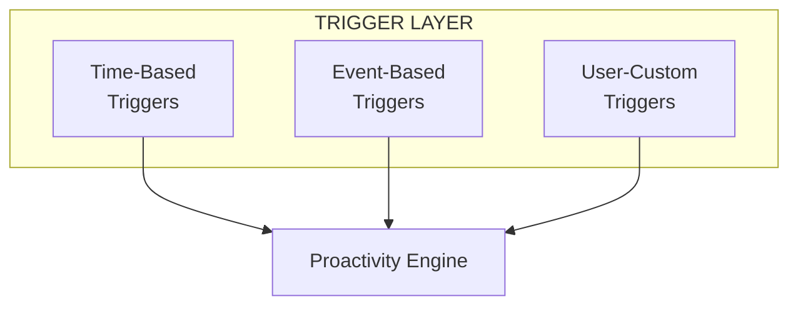
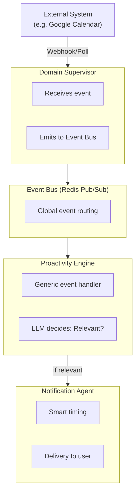
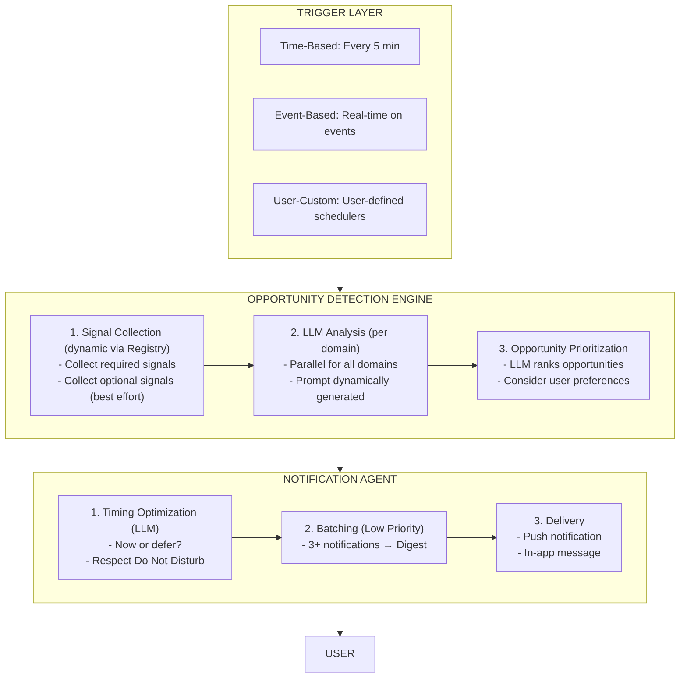

# Signals, Events & Proactivity

**Version:** 2.0
**Date:** 2025-10-27

> **Navigation:** [← Orchestrator](03-orchestrator-architecture.md) | [Next: Registry System →](05-registry-system.md)

---

## 1. Signals vs. Events: The Difference

### 1.1 Definition

| Aspect | **Signals** | **Events** |
|--------|------------|-----------|
| **What?** | State data ("What is?") | State changes ("What happens?") |
| **How?** | Pull-based (we actively query) | Push-based (we get notified) |
| **When?** | Periodic (every 5-10 min) | Real-time (immediately upon change) |
| **Example** | "Currently 2 of 4 workouts this week" | "Meeting was just cancelled" |
| **Use** | Opportunity Detection | Immediate reaction |

### 1.2 Code Example

```typescript
// ═══════════════════════════════════════
// SIGNAL: State data (Pull)
// ═══════════════════════════════════════

interface WorkoutProgressSignal {
  weeklyGoal: number;      // 4
  currentWorkouts: number; // 2
  streak: number;          // 6
}

// Collected every 5-10 min
const signal = await healthSupervisor.collectSignal('workout_progress');

// ═══════════════════════════════════════
// EVENT: State change (Push)
// ═══════════════════════════════════════

interface MeetingCancelledEvent {
  type: 'calendar.meeting_cancelled';
  timestamp: string;           // "2025-10-27T14:00:00Z"
  data: {
    meetingId: string;        // "abc123"
    timeSlot: string;         // "14:00-15:00"
    attendees: string[];      // ["maria@example.com"]
  }
}

// Published immediately when meeting is cancelled
await eventBus.publish({
  type: 'calendar.meeting_cancelled',
  data: { ... }
});
```

---

## 2. Proactivity Trigger Layer

### 2.1 Overview



### 2.2 Time-Based Triggers (Scheduler)

**Concept:** Periodic background jobs.

#### System Scheduler (Built-in)

```typescript
class ProactivityScheduler {
  async initialize() {
    // Opportunity Detection: Every 5 min
    cron.schedule('*/5 * * * *', async () => {
      await opportunityDetectionEngine.run();
    });

    // Morning Brief: Every day at 8:00
    cron.schedule('0 8 * * *', async () => {
      await opportunityDetectionEngine.runDomain('morning_brief');
    });

    // Evening Summary: Every day at 20:00
    cron.schedule('0 20 * * *', async () => {
      await opportunityDetectionEngine.runDomain('evening_summary');
    });
  }
}
```

#### User-Custom Triggers

**Concept:** User can create their own schedulers with prompts!

```typescript
interface UserSchedule {
  id: string;
  name: string;
  trigger: {
    type: 'cron' | 'interval' | 'specific';
    schedule: string;  // "0 9 * * *" or "every 30min"
  };
  prompt: string;  // User-defined!
  targetAgent?: string;  // Optional: Specific supervisor
  enabled: boolean;
}

// Example: User creates via chat
// User: "Create a job at 9 AM that analyzes my appointments
//        and names my top 3 focus areas"

const schedule: UserSchedule = {
  id: "user_focus_check_001",
  name: "Daily Focus Check",
  trigger: {
    type: 'cron',
    schedule: '0 9 * * *'
  },
  prompt: `
    Analyze my appointments and tasks for today.
    Identify my 3 most important focus areas for today.
    Create a 2-minute overview.
  `,
  targetAgent: 'productivity_supervisor',  // Optional
  enabled: true
};

// Scheduler executes
cron.schedule(schedule.trigger.schedule, async () => {
  if (!schedule.enabled) return;

  const result = await orchestrator.handleUserRequest(schedule.prompt, userId);

  await notificationAgent.deliver({
    message: result,
    priority: 'medium',
    source: `schedule:${schedule.name}`
  });
});
```

### 2.3 Event-Based Triggers (Push)

**Concept:** Real-time reaction to events.

#### Event Flow



#### LLM-Based Event Filtering

**Problem:** Not every event is relevant for the user!

**Solution:** LLM decides relevance based on user context.

```typescript
class ProactivityEngine {
  async handleEvent(event: Event) {
    const eventSpec = eventRegistry.getEventType(event.type);
    const userContext = await this.getUserContext(event.userId);

    // LLM decides: Relevant?
    const decision = await llm.complete(`
Event occurred: ${event.type}
Description: ${eventSpec.description}
Data: ${JSON.stringify(event.data)}

User Context:
- Current activity: ${userContext.currentActivity}
- Location: ${userContext.location}
- Do Not Disturb: ${userContext.doNotDisturb}
- Upcoming events: ${userContext.upcomingEvents}

Question: Should Fidus react to this event?
If yes, how?

JSON: {
  shouldReact: boolean,
  priority: "urgent" | "high" | "medium" | "low",
  suggestedAction: string,
  reasoning: string
}
`);

    if (decision.shouldReact) {
      await notificationAgent.deliver({
        message: decision.suggestedAction,
        priority: decision.priority
      });
    }
  }
}
```

**Example:**

```typescript
// Event: calendar.meeting_cancelled
{
  type: 'calendar.meeting_cancelled',
  data: { meetingId: 'abc', timeSlot: '14:00-15:00' }
}

// LLM Decision
{
  shouldReact: true,
  priority: 'medium',
  suggestedAction: `
    Your meeting at 2 PM was cancelled. You now have 2-3 PM free!

    Suggestion: Workout? (You've completed 2/4 workouts this week)
  `,
  reasoning: 'User has fitness goal 4x/week, currently only 2x. Free time is an opportunity.'
}
```

---

## 3. Signal Collection (Dynamic)

### 3.1 Signal Registry

**Problem:** Hard-coded signal interfaces are not extensible.

**Solution:** Supervisors register their signals dynamically.

```typescript
// ═══════════════════════════════════════
// SUPERVISOR REGISTERS SIGNALS
// ═══════════════════════════════════════

class HealthSupervisor {
  async initialize() {
    await signalRegistry.registerProvider('health', [
      {
        name: 'workout_progress',
        description: 'Weekly workout progress',
        dataSchema: {
          weeklyGoal: 'number',
          currentWorkouts: 'number',
          streak: 'number'
        },
        collector: async () => {
          const workouts = await this.getWorkoutsThisWeek();
          return {
            weeklyGoal: this.userSettings.weeklyGoal,
            currentWorkouts: workouts.length,
            streak: await this.calculateStreak()
          };
        }
      },
      {
        name: 'sleep_quality',
        description: 'Sleep quality last night',
        dataSchema: {
          hours: 'number',
          quality: 'string',
          deepSleep: 'number'
        },
        collector: async () => await this.getSleepData()
      }
    ]);
  }
}
```

### 3.2 Opportunity Domains

**Concept:** Domains declare which signals they need.

```typescript
interface OpportunityDomain {
  name: string;
  description: string;
  requiredSignals: string[];   // Must be present
  optionalSignals: string[];   // Nice-to-have
  enabled: boolean;
  llmPromptTemplate: string;   // Prompt for LLM
}

// Example: Fitness Opportunities
const fitnessOpportunities: OpportunityDomain = {
  name: 'fitness_opportunities',
  description: 'Fitness and workout suggestions',
  requiredSignals: [
    'health.workout_progress',   // Supervisor health, Signal workout_progress
    'calendar.free_slots'         // Supervisor calendar, Signal free_slots
  ],
  optionalSignals: [
    'weather.forecast',
    'location.current',
    'health.sleep_quality'
  ],
  enabled: true,
  llmPromptTemplate: `
Analyze fitness opportunities based on:

{{#each signals}}
### {{this.name}}
{{this.description}}
Data: {{json this.value}}
{{/each}}

Generate 0-2 relevant suggestions.

JSON: {
  opportunities: [{
    type: "workout_suggestion",
    title: string,
    description: string,
    actionable: boolean,
    priority: "high" | "medium" | "low"
  }]
}
`
};
```

### 3.3 Dynamic Signal Collection

```typescript
class OpportunityDetectionEngine {
  async run() {
    for (const domain of opportunityDomains.filter(d => d.enabled)) {
      // 1. Collect signals (dynamic!)
      const signals = await this.collectSignals(
        domain.requiredSignals,
        domain.optionalSignals
      );

      // 2. LLM analyzes
      const opportunities = await this.detectViaLLM(domain, signals);

      // 3. Delivery
      await this.deliverOpportunities(opportunities);
    }
  }

  private async collectSignals(required: string[], optional: string[]) {
    const signals: Record<string, any> = {};

    // Required Signals (MUST be present)
    for (const signalPath of required) {
      const provider = signalRegistry.getProvider(signalPath);
      signals[signalPath] = await provider.collector();  // ← Calls Supervisor method!
    }

    // Optional Signals (best effort)
    for (const signalPath of optional) {
      try {
        const provider = signalRegistry.getProvider(signalPath);
        signals[signalPath] = await provider.collector();
      } catch (error) {
        logger.debug(`Optional signal ${signalPath} not available`);
      }
    }

    return signals;
  }
}
```

**Flow:**

```
Scheduler (every 5 min)
         │
         ▼
Opportunity Detection Engine
         │
         ├─ Domain: fitness_opportunities
         │  ├─ Collect: health.workout_progress  → Calls HealthSupervisor.collector()
         │  ├─ Collect: calendar.free_slots      → Calls CalendarSupervisor.collector()
         │  ├─ Collect: weather.forecast         → Calls WeatherSupervisor.collector()
         │  │
         │  └─ LLM Analysis
         │     → "User has 2/4 workouts, tomorrow 2-4 PM free, weather good"
         │     → Opportunity: "Outdoor workout tomorrow at 2 PM?"
         │
         └─ Domain: budget_alerts
            ├─ Collect: finance.spending_this_month
            └─ LLM Analysis
               → "Restaurant +30%, send alert"
```

---

## 4. Smart Notification Delivery

### 4.1 LLM-Optimized Timing

**Problem:** Notifications at the wrong time are annoying.

**Solution:** LLM decides optimal delivery time.

```typescript
class NotificationAgent {
  async deliver(notification: Notification) {
    const userContext = await this.getUserContext(notification.userId);

    // LLM decides: Now or later?
    const timing = await llm.complete(`
Notification: "${notification.message}"
Priority: ${notification.priority}

User Context:
- Current activity: ${userContext.currentActivity}  // "In Meeting"
- Do Not Disturb: ${userContext.doNotDisturb}        // false
- Next free time: ${userContext.nextFreeTime}        // "15:30"
- Notification preferences: ${userContext.notificationPrefs}

Question: When should the notification be delivered?

JSON: {
  timing: "now" | "defer",
  deferUntil?: string,  // ISO timestamp
  reasoning: string
}
`);

    if (timing.timing === 'now') {
      await this.send(notification);
    } else {
      await this.schedule(notification, timing.deferUntil);
    }
  }
}
```

### 4.2 Batching

**Concept:** Batch multiple low-priority notifications together.

```typescript
class NotificationAgent {
  private batchQueue: Notification[] = [];

  async deliver(notification: Notification) {
    if (notification.priority === 'low' || notification.priority === 'medium') {
      // Add to batch queue
      this.batchQueue.push(notification);

      // Send batch when queue is full or timeout
      if (this.batchQueue.length >= 3 || this.timeSinceLastBatch > 60 * 60 * 1000) {
        await this.sendBatch();
      }
    } else {
      // High/Urgent: Send immediately
      await this.send(notification);
    }
  }

  private async sendBatch() {
    if (this.batchQueue.length === 0) return;

    // LLM combines notifications into digest
    const digest = await llm.complete(`
Create a compact digest from the following notifications:

${this.batchQueue.map((n, i) => `${i + 1}. ${n.message}`).join('\n')}

Format: Brief, actionable, prioritized.
`);

    await this.send({
      message: digest,
      priority: 'medium',
      source: 'batch'
    });

    this.batchQueue = [];
  }
}
```

---

## 5. Summary

### 5.1 Proactivity Flow (Complete)



### 5.2 Key Features

| Feature | Description |
|---------|--------------|
| **Signals vs Events** | Clear separation: Pull (periodic) vs Push (real-time) |
| **Dynamic Registry** | Supervisors register signals/events, no hard-coded interfaces |
| **LLM-Orchestrated** | LLM decides relevance, timing, batching |
| **User-Custom Triggers** | User can create own schedulers with prompts |
| **Smart Notifications** | Timing optimization, Do Not Disturb, batching |

---

## 6. Proactivity Metrics & Measurement

### 6.1 Business Requirement

**Core Promise:**
- **>50% proactive interactions** (without user request)
- **70% acceptance rate** for proactive suggestions (target)

### 6.2 Metric Definitions

```typescript
// Proactivity Analytics Service
interface ProactivityMetrics {
  // Metric 1: % proactive interactions
  proactiveRatio: {
    total_interactions: number;         // All interactions
    proactive_interactions: number;     // Without user request (system-initiated)
    reactive_interactions: number;      // With user request (user-initiated)
    ratio: number;                      // proactive / total (Target: >0.5)
  };

  // Metric 2: Acceptance Rate
  acceptanceRate: {
    proactive_suggestions: number;      // All proactive suggestions
    accepted: number;                   // User accepted
    rejected: number;                   // User rejected
    ignored: number;                    // User ignored
    acceptance_rate: number;            // accepted / proactive_suggestions (Target: >0.7)
  };

  // Metric 3: Per-Domain Breakdown
  perDomain: Record<string, {
    suggestions: number;
    accepted: number;
    acceptance_rate: number;
  }>;

  // Metric 4: Time-to-Value
  timeToValue: {
    avg_time_to_acceptance: number;     // Average in seconds
    median_time_to_acceptance: number;
  };
}
```

### 6.3 Tracking Implementation

#### 6.3.1 Proactive Suggestion Tracking

```typescript
class NotificationAgent {
  async deliver(notification: Notification, userContext: UserContext) {
    // Track: Proactive Suggestion created
    const trackingId = await analytics.track('proactive_suggestion', {
      userId: userContext.userId,
      domain: notification.domain,           // 'fitness', 'calendar', 'finance', etc.
      type: notification.type,               // 'workout_suggestion', 'meeting_opportunity', etc.
      priority: notification.priority,
      timestamp: new Date(),
      message: notification.message,
      source: notification.source            // 'opportunity_detection', 'event_reaction', etc.
    });

    notification.trackingId = trackingId;

    // Deliver to user
    await this.send(notification);

    // Start timeout timer (ignored after 24h)
    this.scheduleIgnoreTracking(trackingId, 24 * 60 * 60 * 1000);
  }

  async recordUserResponse(
    trackingId: string,
    response: 'accepted' | 'rejected' | 'ignored',
    responseTime?: number
  ) {
    // Track: User Response
    await analytics.track('user_response', {
      trackingId,
      response,
      responseTime,  // Time between suggestion and response (in seconds)
      timestamp: new Date()
    });

    // Update Metrics
    await this.updateMetrics(trackingId, response);
  }

  private async updateMetrics(trackingId: string, response: string) {
    const suggestion = await db.suggestions.findByTrackingId(trackingId);

    // Update Domain Metrics
    await metricsDB.increment(`domain:${suggestion.domain}:${response}`, 1);

    // Update Global Metrics
    await metricsDB.increment(`global:${response}`, 1);
  }
}
```

#### 6.3.2 Interaction Classification

```typescript
class Orchestrator {
  async handleUserRequest(message: string, userContext: UserContext): Promise<string> {
    // Track: Reactive Interaction (user-initiated)
    await analytics.track('reactive_interaction', {
      userId: userContext.userId,
      message,
      timestamp: new Date()
    });

    // Process request
    const response = await this.route(message, userContext);

    return response;
  }
}

class OpportunityDetectionEngine {
  async run() {
    for (const domain of opportunityDomains.filter(d => d.enabled)) {
      const opportunities = await this.detect(domain);

      for (const opportunity of opportunities) {
        // Track: Proactive Interaction (system-initiated)
        await notificationAgent.deliver({
          domain: domain.name,
          message: opportunity.message,
          priority: opportunity.priority,
          type: 'proactive',
          source: 'opportunity_detection'
        }, userContext);
      }
    }
  }
}
```

### 6.4 Metrics Aggregation Service

```typescript
class ProactivityAnalyticsService {
  // Calculate current metrics
  async getCurrentMetrics(userId: string, timeRange: TimeRange): Promise<ProactivityMetrics> {
    const interactions = await db.interactions.find({
      userId,
      timestamp: { $gte: timeRange.start, $lte: timeRange.end }
    });

    const proactive = interactions.filter(i => i.type === 'proactive');
    const reactive = interactions.filter(i => i.type === 'reactive');

    const accepted = proactive.filter(i => i.response === 'accepted');
    const rejected = proactive.filter(i => i.response === 'rejected');
    const ignored = proactive.filter(i => i.response === 'ignored');

    return {
      proactiveRatio: {
        total_interactions: interactions.length,
        proactive_interactions: proactive.length,
        reactive_interactions: reactive.length,
        ratio: proactive.length / interactions.length
      },
      acceptanceRate: {
        proactive_suggestions: proactive.length,
        accepted: accepted.length,
        rejected: rejected.length,
        ignored: ignored.length,
        acceptance_rate: accepted.length / proactive.length
      },
      perDomain: this.calculatePerDomain(proactive),
      timeToValue: this.calculateTimeToValue(accepted)
    };
  }

  private calculatePerDomain(proactive: Interaction[]): Record<string, any> {
    const domains = new Set(proactive.map(i => i.domain));
    const result: Record<string, any> = {};

    for (const domain of domains) {
      const domainSuggestions = proactive.filter(i => i.domain === domain);
      const domainAccepted = domainSuggestions.filter(i => i.response === 'accepted');

      result[domain] = {
        suggestions: domainSuggestions.length,
        accepted: domainAccepted.length,
        acceptance_rate: domainAccepted.length / domainSuggestions.length
      };
    }

    return result;
  }

  private calculateTimeToValue(accepted: Interaction[]): any {
    const responseTimes = accepted
      .filter(i => i.responseTime)
      .map(i => i.responseTime);

    return {
      avg_time_to_acceptance: responseTimes.reduce((a, b) => a + b, 0) / responseTimes.length,
      median_time_to_acceptance: this.median(responseTimes)
    };
  }
}
```

### 6.5 Dashboard & Monitoring

```typescript
// Real-time Metrics Dashboard
class ProactivityDashboard {
  async getOverview(userId: string): Promise<DashboardData> {
    const metrics = await analyticsService.getCurrentMetrics(userId, {
      start: new Date(Date.now() - 30 * 24 * 60 * 60 * 1000), // Last 30 days
      end: new Date()
    });

    return {
      // Overall Score
      proactivityScore: this.calculateScore(metrics),

      // Key Metrics
      proactiveRatio: metrics.proactiveRatio.ratio,
      acceptanceRate: metrics.acceptanceRate.acceptance_rate,

      // Goal Progress
      goals: {
        proactive_ratio: {
          current: metrics.proactiveRatio.ratio,
          target: 0.5,
          status: metrics.proactiveRatio.ratio >= 0.5 ? 'achieved' : 'in_progress'
        },
        acceptance_rate: {
          current: metrics.acceptanceRate.acceptance_rate,
          target: 0.7,
          status: metrics.acceptanceRate.acceptance_rate >= 0.7 ? 'achieved' : 'in_progress'
        }
      },

      // Per-Domain Performance
      domains: metrics.perDomain,

      // Trends (last 7 days)
      trends: await this.calculateTrends(userId)
    };
  }

  private calculateScore(metrics: ProactivityMetrics): number {
    // Score: 0-100
    const ratioScore = Math.min(metrics.proactiveRatio.ratio / 0.5, 1) * 50;
    const acceptanceScore = Math.min(metrics.acceptanceRate.acceptance_rate / 0.7, 1) * 50;
    return ratioScore + acceptanceScore;
  }
}
```

### 6.6 Adaptive Learning

**Concept:** System learns from acceptance rate and adapts domains.

```typescript
class AdaptiveProactivityEngine {
  async optimizeDomains() {
    const metrics = await analyticsService.getCurrentMetrics(userId, last30Days);

    // Domains with low acceptance rate → reduce
    for (const [domain, stats] of Object.entries(metrics.perDomain)) {
      if (stats.acceptance_rate < 0.3) {
        logger.warn(`Domain ${domain} has low acceptance rate: ${stats.acceptance_rate}`);

        // Reduce frequency
        await opportunityDomains.updateFrequency(domain, 'reduce');

        // Or: Temporarily disable domain
        if (stats.acceptance_rate < 0.1) {
          await opportunityDomains.disable(domain, '7 days');
        }
      }

      // Domains with high acceptance rate → increase
      if (stats.acceptance_rate > 0.8) {
        await opportunityDomains.updateFrequency(domain, 'increase');
      }
    }
  }
}
```

### 6.7 A/B Testing Infrastructure

```typescript
// Test different prompt variants
class ProactivityExperiments {
  async runExperiment(experimentId: string, variants: Variant[]) {
    // User segmentation
    const segment = await this.assignUserToVariant(userId, experimentId);

    // Deliver with variant
    const notification = await notificationAgent.deliver({
      ...baseNotification,
      promptVariant: variants[segment].prompt,
      experimentId,
      variantId: variants[segment].id
    });

    // Track with experiment context
    await analytics.track('proactive_suggestion', {
      ...trackingData,
      experimentId,
      variantId: variants[segment].id
    });
  }

  // Analysis: Which variant has highest acceptance rate?
  async analyzeExperiment(experimentId: string): Promise<ExperimentResults> {
    const results = await db.interactions.aggregate([
      { $match: { experimentId } },
      { $group: {
        _id: '$variantId',
        suggestions: { $sum: 1 },
        accepted: { $sum: { $cond: [{ $eq: ['$response', 'accepted'] }, 1, 0] } }
      }}
    ]);

    return results.map(r => ({
      variantId: r._id,
      acceptance_rate: r.accepted / r.suggestions,
      sample_size: r.suggestions
    }));
  }
}
```

---

**Next Document:** [Registry System →](05-registry-system.md)

**Version History:**
- v2.1 (2025-10-27): Added Proactivity Metrics & Measurement (Section 6)
- v2.0 (2025-10-27): Revised with chat insights (Signals vs Events, Dynamic Registry, User-Custom Triggers)
- v1.0 (2025-10-26): Initial draft
