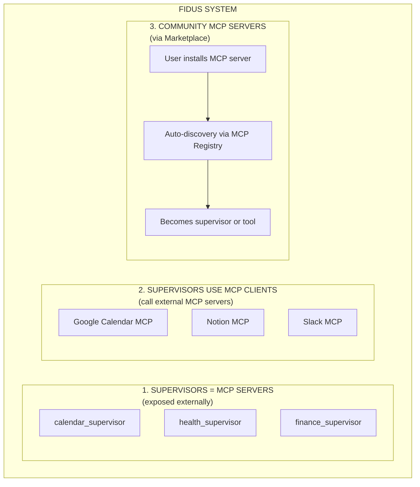
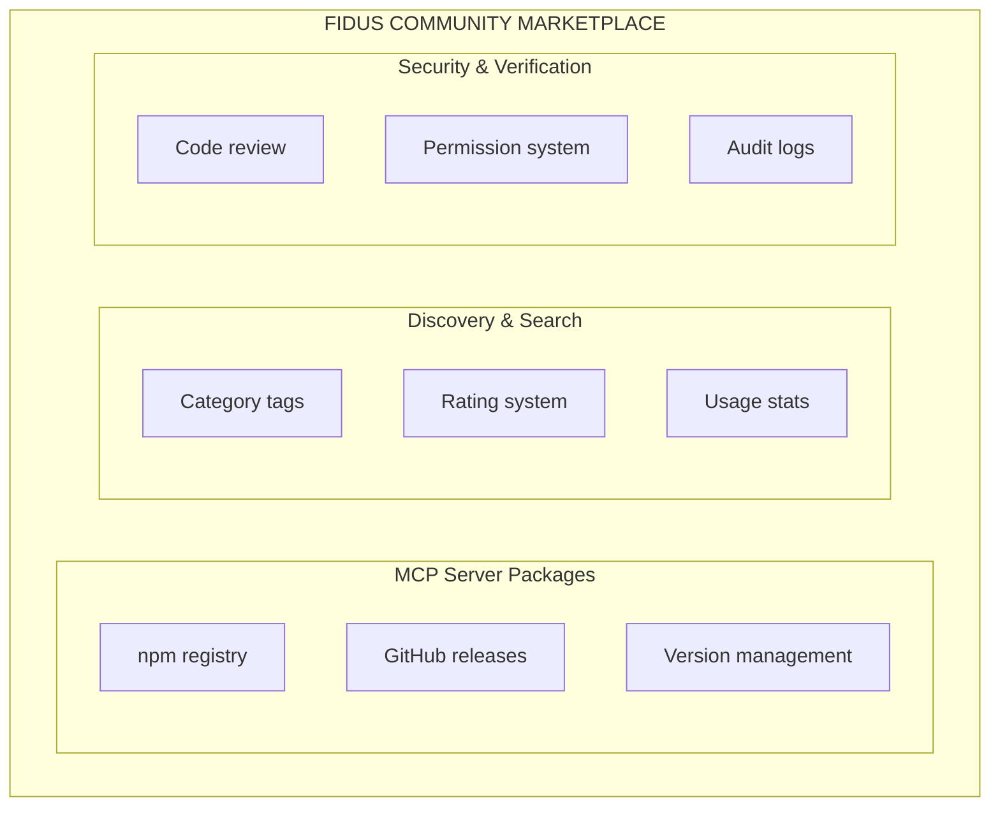

# MCP Integration & Community Marketplace

**Version:** 2.0
**Date:** 2025-10-27

> **Navigation:** [← Registry System](05-registry-system.md) | [Back to README →](README.md)

---

## 1. What is MCP?

**Model Context Protocol (MCP)** is an open standard from Anthropic for integrating AI agents with external tools and data sources.

### 1.1 MCP Components

| Component | Description | Example |
|------------|--------------|----------|
| **Tools** | Callable functions | `create_event`, `search_files` |
| **Resources** | Accessible data | `calendar://events/today` |
| **Prompts** | LLM prompt templates | `morning_brief` |

### 1.2 Why MCP for Fidus?

- ✅ **Open Standard:** Anthropic-backed, growing ecosystem
- ✅ **Community:** Marketplace with 100+ MCP servers
- ✅ **Transport-Agnostic:** stdio, HTTP, SSE
- ✅ **Language Support:** TypeScript, Python SDKs
- ✅ **Extensibility:** Anyone can develop MCP servers

---

## 2. MCP in the Fidus System

### 2.1 Three Uses of MCP



---

## 3. Supervisors as MCP Servers

### 3.1 MCP Server Interface

Each supervisor implements the MCP server interface:

```typescript
class CalendarSupervisor implements MCPServer {
  // MCP Metadata
  name = "calendar_supervisor";
  version = "1.0.0";
  description = "Manages calendars, appointments, meetings";

  // MCP Standard: Tools
  tools: MCPTool[] = [
    {
      name: "create_event",
      description: "Creates a new calendar entry",
      inputSchema: {
        type: "object",
        properties: {
          title: { type: "string", description: "Event title" },
          start: { type: "string", format: "date-time" },
          duration: { type: "number", description: "Duration in minutes" },
          attendees: { type: "array", items: { type: "string" } }
        },
        required: ["title", "start", "duration"]
      }
    },
    {
      name: "find_free_slots",
      description: "Finds free time slots",
      inputSchema: {
        type: "object",
        properties: {
          duration: { type: "number" },
          timeRange: {
            type: "object",
            properties: {
              start: { type: "string", format: "date-time" },
              end: { type: "string", format: "date-time" }
            }
          }
        },
        required: ["duration"]
      }
    }
  ];

  // MCP Standard: Resources (optional)
  resources: MCPResource[] = [
    {
      uri: "calendar://events/today",
      name: "Today's Appointments",
      description: "All events for today",
      mimeType: "application/json"
    },
    {
      uri: "calendar://events/week",
      name: "This Week",
      description: "All events this week",
      mimeType: "application/json"
    }
  ];

  // MCP Standard: Prompts (optional)
  prompts: MCPPrompt[] = [
    {
      name: "morning_brief",
      description: "Generate morning brief with today's appointments",
      arguments: []
    }
  ];

  // MCP Standard: Tool Call Handler
  async callTool(name: string, parameters: any): Promise<any> {
    switch (name) {
      case "create_event":
        return await this.createEvent(parameters);
      case "find_free_slots":
        return await this.findFreeSlots(parameters);
      default:
        throw new Error(`Unknown tool: ${name}`);
    }
  }

  // MCP Standard: Resource Handler
  async readResource(uri: string): Promise<any> {
    if (uri === "calendar://events/today") {
      return await this.getTodaysEvents();
    }
    // ...
  }

  // MCP Standard: Prompt Handler
  async getPrompt(name: string): Promise<string> {
    if (name === "morning_brief") {
      return this.generateMorningBriefPrompt();
    }
    // ...
  }
}
```

### 3.2 Transport Layer

Supervisors can be exposed via different transports:

```typescript
// 1. HTTP Transport (for remote access)
const httpServer = new MCPHTTPServer(calendarSupervisor);
httpServer.listen(3001);

// 2. stdio Transport (for CLI/Local)
const stdioServer = new MCPStdioServer(calendarSupervisor);
stdioServer.start();

// 3. SSE Transport (for web apps)
const sseServer = new MCPSSEServer(calendarSupervisor);
app.use('/mcp', sseServer.router);
```

---

## 4. Supervisors Use MCP Clients

### 4.1 External MCP Server Integration

Supervisors call external MCP servers (e.g., Google Calendar MCP):

```typescript
class CalendarSupervisor {
  private googleCalendarMCP: MCPClient;

  async initialize() {
    // 1. Connect to external Google Calendar MCP server
    this.googleCalendarMCP = await MCPClient.connect({
      transport: 'http',
      serverUrl: 'http://localhost:4000/mcp'
    });

    // 2. List available tools
    const tools = await this.googleCalendarMCP.listTools();
    logger.info(`Google Calendar MCP: ${tools.length} tools available`);

    // 3. Register in MCP Registry
    await mcpRegistry.registerServer({
      name: 'google_calendar',
      description: 'Google Calendar API via MCP',
      transport: 'http',
      serverUrl: 'http://localhost:4000/mcp',
      client: this.googleCalendarMCP,
      tools
    });
  }

  // Tool delegates to external MCP server
  async createEvent(params: CreateEventParams) {
    // Call Google Calendar MCP
    const result = await this.googleCalendarMCP.callTool('create_event', {
      calendarId: params.calendarId,
      event: {
        summary: params.title,
        start: { dateTime: params.start },
        end: { dateTime: addMinutes(params.start, params.duration) },
        attendees: params.attendees.map(email => ({ email }))
      }
    });

    // Fidus-specific post-processing
    await this.updateLocalState(result);
    await eventBus.publish({
      type: 'calendar.event_created',
      data: { event: result }
    });

    return result;
  }
}
```

---

## 5. Community Marketplace Integration

### 5.1 MCP Server Discovery

**Concept:** User installs MCP server from community marketplace → Fidus recognizes & integrates automatically.

```typescript
class MCPMarketplace {
  async install(packageName: string) {
    // 1. Download from npm or GitHub
    const mcpPackage = await npm.install(packageName);

    // 2. Read MCP server config
    const config = await this.readMCPConfig(mcpPackage);

    // 3. Start server
    const server = await this.startMCPServer(config);

    // 4. Register in MCP Registry
    await mcpRegistry.registerServer({
      name: config.name,
      description: config.description,
      transport: config.transport,
      serverUrl: config.serverUrl,
      client: await MCPClient.connect({ ... }),
      tools: await server.listTools()
    });

    // 5. Regenerate orchestrator prompt
    // → New MCP server is automatically available!

    logger.info(`MCP Server installed: ${config.name}`);
  }
}
```

### 5.2 Example: User Installs Notion MCP

```typescript
// User via CLI or UI
await marketplace.install('@modelcontextprotocol/server-notion');

// System Flow
// ┌──────────────────────────────────────┐
// │ 1. npm install                       │
// └──────────────┬───────────────────────┘
//                │
//                ▼
// ┌──────────────────────────────────────┐
// │ 2. Read package.json (MCP Config)    │
// │    - transport: "stdio"              │
// │    - command: "node dist/index.js"   │
// └──────────────┬───────────────────────┘
//                │
//                ▼
// ┌──────────────────────────────────────┐
// │ 3. Start MCP Server                  │
// │    - Spawn process                   │
// │    - Connect MCP Client              │
// └──────────────┬───────────────────────┘
//                │
//                ▼
// ┌──────────────────────────────────────┐
// │ 4. Register in MCP Registry          │
// │    - tools: search_pages, get_page   │
// └──────────────┬───────────────────────┘
//                │
//                ▼
// ┌──────────────────────────────────────┐
// │ 5. Orchestrator Prompt Update        │
// │    → "notion" tools now available    │
// └──────────────────────────────────────┘

// User can immediately use
"Search Notion for meeting notes from last week"

// Orchestrator calls
notion.search_pages({ query: "Meeting Notes", created_after: lastWeek })
```

---

## 6. MCP Server Development (Custom Agents)

### 6.1 Create Custom MCP Server

Community/Enterprise users can develop their own MCP servers:

```typescript
// custom-crm-mcp-server.ts

import { MCPServer } from '@modelcontextprotocol/sdk';

class CustomCRMServer implements MCPServer {
  name = "custom_crm";
  version = "1.0.0";
  description = "Access to internal CRM system";

  tools = [
    {
      name: "search_customers",
      description: "Searches customers in CRM",
      inputSchema: {
        type: "object",
        properties: {
          query: { type: "string" },
          limit: { type: "number", default: 10 }
        }
      }
    },
    {
      name: "get_customer_history",
      description: "Gets customer contact history",
      inputSchema: {
        type: "object",
        properties: {
          customerId: { type: "string" }
        }
      }
    }
  ];

  async callTool(name: string, params: any) {
    if (name === "search_customers") {
      return await this.searchCustomers(params);
    }
    if (name === "get_customer_history") {
      return await this.getCustomerHistory(params);
    }
  }

  private async searchCustomers(params: { query: string; limit: number }) {
    // Integration with internal CRM API
    const response = await fetch(`https://crm.company.com/api/customers/search`, {
      method: 'POST',
      headers: { 'Authorization': `Bearer ${process.env.CRM_API_KEY}` },
      body: JSON.stringify({ query: params.query, limit: params.limit })
    });

    return await response.json();
  }

  private async getCustomerHistory(params: { customerId: string }) {
    // ...
  }
}

// Start server
const server = new MCPHTTPServer(new CustomCRMServer());
server.listen(4002);

console.log('Custom CRM MCP Server running on port 4002');
```

### 6.2 Integration in Fidus

```typescript
// Fidus Config (fidus.config.json)
{
  "mcpServers": [
    {
      "name": "custom_crm",
      "transport": "http",
      "serverUrl": "http://localhost:4002/mcp",
      "enabled": true
    }
  ]
}

// Fidus starts and connects automatically
// → custom_crm tools are immediately available

// User can use:
"Search customers named 'Schmidt' in our CRM"

// Orchestrator calls:
custom_crm.search_customers({ query: "Schmidt" })
```

---

## 7. MCP Transport Layers

### 7.1 stdio (Process-Based)

**Use Case:** Local MCP servers, CLI tools

```typescript
// Server
const server = new MCPStdioServer(calendarSupervisor);
server.start();

// Client
const client = await MCPClient.connect({
  transport: 'stdio',
  command: 'node',
  args: ['./calendar-mcp-server.js']
});
```

### 7.2 HTTP (REST-Based)

**Use Case:** Remote MCP servers, microservices

```typescript
// Server
const httpServer = new MCPHTTPServer(calendarSupervisor);
httpServer.listen(3001);

// Client
const client = await MCPClient.connect({
  transport: 'http',
  serverUrl: 'http://localhost:3001/mcp'
});
```

### 7.3 SSE (Server-Sent Events)

**Use Case:** Web apps, real-time updates

```typescript
// Server
const sseServer = new MCPSSEServer(calendarSupervisor);
app.use('/mcp', sseServer.router);

// Client (Browser)
const client = await MCPClient.connect({
  transport: 'sse',
  serverUrl: 'http://localhost:3000/mcp'
});
```

---

## 8. Marketplace Architecture

### 8.1 Community Marketplace



### 8.2 Installation Flow

```typescript
// User: "Install Slack MCP Server"

// 1. Marketplace search
const results = await marketplace.search('slack');

// 2. User selection
const package = results[0]; // "@modelcontextprotocol/server-slack"

// 3. Permission check
await marketplace.checkPermissions(package);
// → Permissions: "Read Slack messages", "Send Slack messages"

// 4. User approval
const approved = await ui.askUserPermission(package.permissions);

// 5. Installation
await marketplace.install(package.name);

// 6. Auto-discovery
// → MCP Registry detects new server
// → Orchestrator prompt updated
// → User can immediately use
```

---

## 9. MCP Server Versioning & Updates

### 9.1 Problem

**Question:** What happens when community MCP server is updated with breaking changes?

**Challenges:**
- MCP server APIs can change
- Breaking changes in tool signatures
- User should not suddenly have broken functionality
- Orchestrator must continue to function

### 9.2 Versioning Strategy

```typescript
// Semantic Versioning for MCP Servers
interface MCPServerEntry {
  name: string;
  version: string;              // "2.1.3"
  compatibleWith: string[];     // ["2.x", "1.5.x"] - Backward Compatibility
  tools: MCPTool[];
  changelog: ChangelogEntry[];
  deprecations: Deprecation[];
}

interface Deprecation {
  toolName: string;
  deprecatedSince: string;      // "2.0.0"
  removedIn: string;            // "3.0.0"
  replacement: string;          // "new_tool_name"
  migrationGuide: string;
}
```

### 9.3 Update Strategies

#### 9.3.1 Non-Breaking Changes (Patch/Minor)

**Example:** `1.2.0` → `1.3.0` (new features, no breaking changes)

```typescript
class MCPUpdateManager {
  async updateMCPServer(name: string, newVersion: string): Promise<void> {
    const current = mcpRegistry.get(name);

    // Check: Is update compatible?
    if (this.isCompatible(current.version, newVersion)) {
      logger.info(`Compatible update detected: ${name} ${current.version} → ${newVersion}`);

      // Rolling update (no downtime)
      await this.rollingUpdate(name, newVersion);
    } else {
      // Breaking change → special strategy (see below)
      await this.handleBreakingChange(name, current.version, newVersion);
    }
  }

  private async rollingUpdate(name: string, newVersion: string): Promise<void> {
    // 1. Download new version
    await npm.install(`${name}@${newVersion}`);

    // 2. Start new version (parallel to old version)
    const newServer = await mcpClient.connect(`${name}@${newVersion}`);

    // 3. Update registry (atomic swap)
    await mcpRegistry.updateServer(name, newServer);

    // 4. Stop old version
    await oldServer.stop();

    logger.info(`Rolling update completed: ${name}@${newVersion}`);
  }
}
```

#### 9.3.2 Breaking Changes (Major)

**Example:** `1.5.0` → `2.0.0` (Breaking changes in API)

**Strategy: Blue-Green Deployment + Gradual Migration**

```typescript
class MCPUpdateManager {
  private async handleBreakingChange(
    name: string,
    currentVersion: string,
    newVersion: string
  ): Promise<void> {
    logger.warn(`Breaking change detected: ${name} ${currentVersion} → ${newVersion}`);

    // 1. Blue-Green Deployment
    // → Both versions run in parallel
    const oldServer = mcpRegistry.get(name);
    const newServer = await mcpClient.connect(`${name}@${newVersion}`);

    // 2. Register both versions
    await mcpRegistry.register(`${name}_v${getMajorVersion(currentVersion)}`, oldServer);
    await mcpRegistry.register(`${name}_v${getMajorVersion(newVersion)}`, newServer);

    // 3. Gradual migration (10% → 50% → 100%)
    await this.gradualMigration(name, oldServer, newServer);

    // 4. Deprecation warnings
    await this.showDeprecationWarnings(oldServer);

    // 5. Final cutover (after 30 days)
    await this.scheduleCutover(name, oldServer, newServer, 30);
  }

  private async gradualMigration(
    name: string,
    oldServer: MCPServer,
    newServer: MCPServer
  ): Promise<void> {
    // Phase 1: 10% traffic to new version
    await this.routeTraffic(name, { old: 0.9, new: 0.1 });
    await sleep(7 * 24 * 60 * 60 * 1000); // 7 days

    // Monitor: Errors, latency, user feedback
    const metrics = await this.getMetrics(newServer);
    if (metrics.errorRate > 0.05) {
      logger.error(`High error rate in new version, rolling back`);
      await this.rollback(name, oldServer);
      return;
    }

    // Phase 2: 50% traffic
    await this.routeTraffic(name, { old: 0.5, new: 0.5 });
    await sleep(7 * 24 * 60 * 60 * 1000); // 7 days

    // Phase 3: 100% traffic
    await this.routeTraffic(name, { old: 0, new: 1.0 });
    await sleep(7 * 24 * 60 * 60 * 1000); // 7 days

    // Phase 4: Deprecate old version
    await this.deprecateServer(oldServer);
  }

  private async routeTraffic(
    name: string,
    split: { old: number; new: number }
  ): Promise<void> {
    // Load balancer strategy
    mcpLoadBalancer.setTrafficSplit(name, split);
  }
}
```

### 9.4 Deprecation Warnings

```typescript
class MCPClient {
  async callTool(serverName: string, toolName: string, params: any): Promise<any> {
    const server = mcpRegistry.get(serverName);

    // Check: Is tool deprecated?
    const deprecation = server.deprecations.find(d => d.toolName === toolName);
    if (deprecation) {
      logger.warn(`Tool "${toolName}" is deprecated since ${deprecation.deprecatedSince}`);
      logger.warn(`Will be removed in ${deprecation.removedIn}`);
      logger.warn(`Use "${deprecation.replacement}" instead`);

      // User notification (once per session)
      if (!this.hasShownDeprecationWarning(serverName, toolName)) {
        await notificationAgent.notify(userId, {
          message: `FYI: ${serverName}.${toolName} is deprecated. Migration recommended.`,
          priority: 'low',
          action: {
            label: 'Migration Guide',
            url: deprecation.migrationGuide
          }
        });

        this.markDeprecationWarningShown(serverName, toolName);
      }
    }

    // Execute tool
    return await server.callTool(toolName, params);
  }
}
```

### 9.5 Auto-Migration Tool

```typescript
// Automatic migration of tool calls
class MCPMigrationService {
  async migrateToolCalls(oldServer: MCPServer, newServer: MCPServer): Promise<void> {
    // Analyze deprecations
    for (const deprecation of oldServer.deprecations) {
      // Find all usages of old tool
      const usages = await this.findToolUsages(deprecation.toolName);

      for (const usage of usages) {
        // Migrate automatically (if possible)
        if (this.canAutoMigrate(deprecation)) {
          await this.autoMigrate(usage, deprecation);
          logger.info(`Auto-migrated ${usage.location} to ${deprecation.replacement}`);
        } else {
          // Manual migration required
          logger.warn(`Manual migration required for ${usage.location}`);
          await this.createMigrationTask(usage, deprecation);
        }
      }
    }
  }

  private canAutoMigrate(deprecation: Deprecation): boolean {
    // Heuristic: Can tool call be automatically migrated?
    return (
      deprecation.replacement !== null &&
      deprecation.parameterMapping !== undefined
    );
  }

  private async autoMigrate(usage: ToolUsage, deprecation: Deprecation): Promise<void> {
    // Example: Old tool call
    // await mcpClient.callTool('old_tool', { param1: 'value' })

    // Becomes:
    // await mcpClient.callTool('new_tool', { newParam1: 'value' })

    // Code transformation
    const newParams = this.mapParameters(usage.params, deprecation.parameterMapping);
    await codeModService.replaceToolCall(usage.location, {
      toolName: deprecation.replacement,
      params: newParams
    });
  }
}
```

### 9.6 Version Pinning (Enterprise)

**Use Case:** Enterprise wants stable version, no auto-updates.

```typescript
// Enterprise Configuration
interface MCPServerConfig {
  name: string;
  version: string;            // "1.5.3" - exact version
  autoUpdate: boolean;        // false - no auto-updates
  allowedVersionRange?: string;  // "1.5.x" - only patch updates
}

class EnterpriseMCPManager {
  async loadServers(config: MCPServerConfig[]): Promise<void> {
    for (const serverConfig of config) {
      if (serverConfig.autoUpdate) {
        // Auto-update enabled → rolling updates
        await this.installLatest(serverConfig.name, serverConfig.allowedVersionRange);
      } else {
        // Pinned version → no updates
        await this.installSpecific(serverConfig.name, serverConfig.version);
      }
    }
  }
}
```

### 9.7 Monitoring & Alerting

```typescript
// Monitor MCP Server Health
class MCPMonitoringService {
  async monitorServerHealth(serverName: string): Promise<HealthStatus> {
    const server = mcpRegistry.get(serverName);

    // Metrics
    const metrics = {
      uptime: await server.getUptime(),
      errorRate: await this.getErrorRate(serverName),
      latency: await this.getLatency(serverName),
      toolCallCount: await this.getToolCallCount(serverName)
    };

    // Alert: High error rate
    if (metrics.errorRate > 0.05) {
      await alertingService.send({
        severity: 'high',
        message: `MCP Server ${serverName} has high error rate: ${metrics.errorRate}`,
        action: 'Consider rollback or investigation'
      });
    }

    // Alert: High latency
    if (metrics.latency > 5000) {
      await alertingService.send({
        severity: 'medium',
        message: `MCP Server ${serverName} has high latency: ${metrics.latency}ms`
      });
    }

    return {
      status: metrics.errorRate < 0.01 ? 'healthy' : 'degraded',
      metrics
    };
  }
}
```

---

## 10. Summary

### 10.1 MCP in the Fidus Ecosystem

| Role | Description | Example |
|-------|--------------|----------|
| **Supervisors = MCP Servers** | Expose Fidus functionality via MCP | `calendar_supervisor` |
| **Supervisors use MCP Clients** | Call external MCP servers | Google Calendar MCP |
| **Community Marketplace** | User installs MCP server | Notion, Slack, GitHub |
| **Custom Development** | Enterprise develops own MCP servers | Internal CRM, ERP |

### 10.2 Key Benefits

- ✅ **Open Standard:** No vendor lock-in
- ✅ **Community:** Growing ecosystem (100+ MCP servers)
- ✅ **Extensibility:** Anyone can develop MCP servers
- ✅ **Dynamic:** Hot-reload, auto-discovery
- ✅ **Multi-Transport:** stdio, HTTP, SSE

### 10.3 Flow: Community MCP → Fidus

```
Community develops MCP server
           │
           ▼
User installs via marketplace
           │
           ▼
MCP Registry detects server
           │
           ▼
Orchestrator prompt regenerates
           │
           ▼
User can immediately use
```

---

**Navigation:** [← Registry System](05-registry-system.md) | [Back to README →](README.md)

**Version History:**
- v2.1 (2025-10-27): Added Section 9 (MCP Server Versioning & Updates)
- v2.0 (2025-10-27): Comprehensive MCP integration documentation
- v1.0 (2025-10-26): Initial draft
