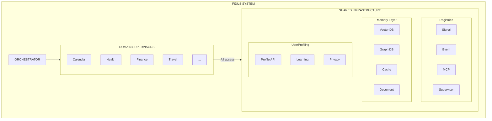
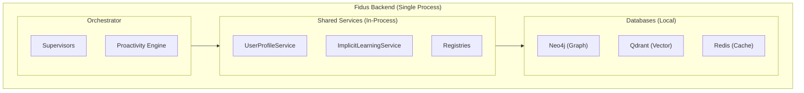
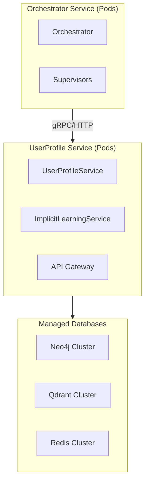
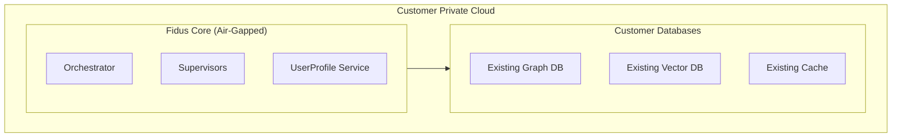

# User Profiling & Preferences

**Version:** 1.0
**Date:** 2025-10-27

> **Navigation:** [← MCP Integration](06-mcp-integration.md) | [Back to README →](README.md)

---

## 1. Overview

User profiling is the foundation for personalized, context-aware agents. Fidus uses a **schema-less, dynamic preference system** that:

- ✅ Has **no fixed data structures** (fully extensible)
- ✅ Combines **explicit + implicit** preferences (user says + system learns)
- ✅ Enables **cross-domain learning** (Health learns from Travel)
- ✅ Is **community-extensible** (MCP servers define their own preferences)

---

## 2. Deployment & Access

### 2.1 Central Shared Service

UserProfiling is a **central shared infrastructure component** similar to registries.



### 2.2 Access Patterns

#### 2.2.1 Plugin Architecture (True Modularity)

**Architecture Principle:** All components (Supervisors, Services, Databases) are **independent plugins** with auto-discovery.

```typescript
// ════════════════════════════════════════════════════════
// PLUGIN INTERFACE
// ════════════════════════════════════════════════════════

interface Plugin {
  name: string;
  version: string;
  type: 'supervisor' | 'service' | 'database' | 'integration';

  // Plugin registers OWN services
  getServices(): ServiceProvider[];

  // Plugin has OWN dependencies (optional)
  dependencies?: string[];  // Names of other plugins

  // Lifecycle
  initialize(): Promise<void>;
  shutdown?(): Promise<void>;
}

interface ServiceProvider {
  name: string;
  initialize(): Promise<any>;
  dependencies?: string[];
}

// ════════════════════════════════════════════════════════
// PLUGIN MANAGER (Discovery + Loading)
// ════════════════════════════════════════════════════════

class PluginManager {
  private plugins: Map<string, Plugin> = new Map();
  private serviceRegistry: ServiceRegistry = new ServiceRegistry();

  // Auto-Discovery: Plugins find themselves
  async discoverPlugins(): Promise<void> {
    // 1. File-based discovery (Core Plugins)
    const pluginFiles = await glob('plugins/**/*.plugin.ts');

    // 2. NPM package discovery (Community Plugins)
    const npmPlugins = await this.discoverNpmPlugins();

    // 3. Load plugins
    for (const file of pluginFiles) {
      const PluginClass = await import(file);
      await this.loadPlugin(new PluginClass.default());
    }

    for (const pkg of npmPlugins) {
      const PluginClass = await import(pkg.name);
      await this.loadPlugin(new PluginClass.default());
    }
  }

  async loadPlugin(plugin: Plugin): Promise<void> {
    // 1. Check dependencies
    if (plugin.dependencies) {
      for (const dep of plugin.dependencies) {
        if (!this.plugins.has(dep)) {
          throw new Error(`Plugin "${plugin.name}" requires "${dep}"`);
        }
      }
    }

    // 2. Register plugin
    this.plugins.set(plugin.name, plugin);

    // 3. Register plugin's services
    for (const service of plugin.getServices()) {
      this.serviceRegistry.registerProvider(service);
    }

    // 4. Initialize plugin
    await plugin.initialize();

    console.log(`✅ Plugin loaded: ${plugin.name}@${plugin.version}`);
  }

  getService(name: string): any {
    return this.serviceRegistry.get(name);
  }

  getLoadedPlugins(): string[] {
    return Array.from(this.plugins.keys());
  }

  private async discoverNpmPlugins(): Promise<PackageInfo[]> {
    // Search for packages with keyword "fidus-plugin"
    const packageJson = await fs.readJson('./package.json');
    const dependencies = { ...packageJson.dependencies, ...packageJson.devDependencies };

    const plugins: PackageInfo[] = [];
    for (const [name, version] of Object.entries(dependencies)) {
      if (name.startsWith('@fidus-community/') || name.startsWith('fidus-plugin-')) {
        plugins.push({ name, version });
      }
    }

    return plugins;
  }
}

// ════════════════════════════════════════════════════════
// EXAMPLE: UserProfile Plugin
// ════════════════════════════════════════════════════════

// File: plugins/user-profiling/user-profiling.plugin.ts
export default class UserProfilingPlugin implements Plugin {
  name = 'user-profiling';
  version = '1.0.0';
  type = 'service';
  dependencies = ['neo4j', 'qdrant', 'redis'];  // Database Plugins

  getServices(): ServiceProvider[] {
    return [
      {
        name: 'userProfile',
        dependencies: ['neo4j.graphDB', 'qdrant.vectorDB', 'redis.cache'],
        initialize: async () => {
          const graphDB = await serviceRegistry.get('neo4j.graphDB');
          const vectorDB = await serviceRegistry.get('qdrant.vectorDB');
          const cache = await serviceRegistry.get('redis.cache');

          return new UserProfileService(graphDB, vectorDB, cache);
        }
      },
      {
        name: 'implicitLearning',
        dependencies: ['userProfile'],
        initialize: async () => {
          const userProfile = await serviceRegistry.get('userProfile');
          return new ImplicitLearningService(userProfile);
        }
      }
    ];
  }

  async initialize(): Promise<void> {
    console.log('UserProfiling Plugin initialized');
  }
}

// ════════════════════════════════════════════════════════
// EXAMPLE: Database Plugins (independent)
// ════════════════════════════════════════════════════════

// File: plugins/neo4j/neo4j.plugin.ts
export default class Neo4jPlugin implements Plugin {
  name = 'neo4j';
  version = '1.0.0';
  type = 'database';

  getServices(): ServiceProvider[] {
    return [{
      name: 'neo4j.graphDB',
      initialize: async () => {
        return new Neo4jGraphDatabase({
          url: process.env.NEO4J_URL || 'bolt://localhost:7687'
        });
      }
    }];
  }

  async initialize(): Promise<void> {
    console.log('Neo4j Plugin initialized');
  }

  async shutdown(): Promise<void> {
    // Cleanup: Close connections
    const graphDB = await serviceRegistry.get('neo4j.graphDB');
    await graphDB.close();
  }
}

// File: plugins/qdrant/qdrant.plugin.ts
export default class QdrantPlugin implements Plugin {
  name = 'qdrant';
  version = '1.0.0';
  type = 'database';

  getServices(): ServiceProvider[] {
    return [{
      name: 'qdrant.vectorDB',
      initialize: async () => {
        return new QdrantVectorDatabase({
          url: process.env.QDRANT_URL || 'http://localhost:6333'
        });
      }
    }];
  }

  async initialize(): Promise<void> {
    console.log('Qdrant Plugin initialized');
  }
}

// File: plugins/redis/redis.plugin.ts
export default class RedisPlugin implements Plugin {
  name = 'redis';
  version = '1.0.0';
  type = 'database';

  getServices(): ServiceProvider[] {
    return [{
      name: 'redis.cache',
      initialize: async () => {
        return new RedisCache({
          url: process.env.REDIS_URL || 'redis://localhost:6379'
        });
      }
    }];
  }

  async initialize(): Promise<void> {
    console.log('Redis Plugin initialized');
  }
}

// ════════════════════════════════════════════════════════
// EXAMPLE: Supervisor Plugin
// ════════════════════════════════════════════════════════

// File: plugins/health-supervisor/health-supervisor.plugin.ts
export default class HealthSupervisorPlugin implements Plugin {
  name = 'health-supervisor';
  version = '1.0.0';
  type = 'supervisor';
  dependencies = ['user-profiling'];  // Needs UserProfile Plugin

  getServices(): ServiceProvider[] {
    return [{
      name: 'supervisor.health',
      dependencies: ['userProfile'],
      initialize: async () => {
        const userProfile = await serviceRegistry.get('userProfile');
        return new HealthSupervisor(userProfile);
      }
    }];
  }

  async initialize(): Promise<void> {
    // Register signals
    await signalRegistry.registerProvider('health', [
      {
        name: 'workout_progress',
        description: 'Weekly workout progress',
        collector: async () => { /* ... */ }
      }
    ]);

    // Register events
    await eventRegistry.registerEventTypes('health', [
      {
        type: 'health.workout_completed',
        description: 'User completed a workout'
      }
    ]);

    console.log('Health Supervisor Plugin initialized');
  }
}

// ════════════════════════════════════════════════════════
// BOOTSTRAP: System Start
// ════════════════════════════════════════════════════════

async function bootstrap() {
  const pluginManager = new PluginManager();

  // 1. Auto-Discovery & Loading
  await pluginManager.discoverPlugins();

  // Plugins are automatically loaded in dependency order:
  // 1. neo4j.plugin.ts
  // 2. qdrant.plugin.ts
  // 3. redis.plugin.ts
  // 4. user-profiling.plugin.ts (depends on: neo4j, qdrant, redis)
  // 5. health-supervisor.plugin.ts (depends on: user-profiling)
  // 6. travel-supervisor.plugin.ts
  // ... all other plugins

  // 2. Start orchestrator
  const orchestrator = new Orchestrator(pluginManager);
  await orchestrator.initialize();

  console.log('🚀 Fidus started with plugins:', pluginManager.getLoadedPlugins());
  // → ['neo4j', 'qdrant', 'redis', 'user-profiling', 'health-supervisor', ...]
}

bootstrap().catch(console.error);
```

**Plugin Architecture Advantages:**

1. **True Modularity** ✅
   - Each plugin is independent (own dependencies, own services)
   - Clear plugin boundaries
   - Plugins can be developed & deployed independently

2. **Community-Extensible** ✅
   ```bash
   # User installs community plugin via NPM
   npm install @fidus-community/spotify-plugin

   # Plugin is automatically discovered at startup
   # No code change needed!
   ```

3. **Hot-Reload possible** ✅
   ```typescript
   // Add plugin at runtime (optional)
   await pluginManager.loadPlugin(new SpotifyPlugin());
   ```

4. **Testing** ✅
   ```typescript
   // Unit test: Load only needed plugins
   const pluginManager = new PluginManager();
   await pluginManager.loadPlugin(new MockNeo4jPlugin());
   await pluginManager.loadPlugin(new UserProfilingPlugin());

   const userProfile = pluginManager.getService('userProfile');
   // Test...
   ```

5. **Deployment Flexibility** ✅
   ```yaml
   # Community Edition: All plugins in one process
   plugins:
     - neo4j
     - qdrant
     - redis
     - user-profiling
     - health-supervisor

   # Cloud Edition: Same code, plugins as separate services
   services:
     - name: user-profiling-service
       plugins: [neo4j, qdrant, redis, user-profiling]
     - name: orchestrator-service
       plugins: [health-supervisor, travel-supervisor]
       remote-services:
         - userProfile: http://user-profiling-service:8080
   ```

#### 2.2.2 Remote Access (Distributed Deployment)

**Use Case:** Enterprise deployment with separate services.

```typescript
// gRPC Service Definition
service UserProfileService {
  rpc GetPreference(GetPreferenceRequest) returns (PreferenceResponse);
  rpc SetPreference(SetPreferenceRequest) returns (Empty);
  rpc ListByDomain(ListByDomainRequest) returns (PreferenceListResponse);
}

// Client-Side (Supervisor)
class RemoteUserProfileService implements UserProfileService {
  private client: UserProfileServiceClient;

  constructor(serverUrl: string) {
    this.client = new UserProfileServiceClient(serverUrl);
  }

  async get(userId: string, path: string): Promise<PreferenceWithConfidence | null> {
    const request = { userId, path };
    const response = await this.client.getPreference(request);
    return response.preference;
  }

  async set(userId: string, path: string, value: any, metadata?: any): Promise<void> {
    const request = { userId, path, value: JSON.stringify(value), metadata };
    await this.client.setPreference(request);
  }
}

// Supervisor uses remote service
class HealthSupervisor {
  private userProfile: UserProfileService;

  constructor() {
    // Decision: Local or remote?
    if (process.env.USER_PROFILE_SERVICE_URL) {
      this.userProfile = new RemoteUserProfileService(process.env.USER_PROFILE_SERVICE_URL);
    } else {
      this.userProfile = ServiceContainer.getInstance().get('userProfile');
    }
  }
}
```

### 2.3 Deployment Scenarios

#### 2.3.1 Community Edition (Monolith)



**Access:** In-process via dependency injection

#### 2.3.2 Cloud Edition (Distributed)



**Access:** Remote via gRPC or HTTP/REST

**Advantages:**
- ✅ Independent scaling (UserProfile Service can scale separately)
- ✅ Resilience (Service can crash without affecting Orchestrator)
- ✅ Multi-tenancy (Dedicated UserProfile Service per tenant possible)

#### 2.3.3 Enterprise Edition (Hybrid)



**Access:** In-process or remote (depending on customer requirements)

### 2.4 Performance Optimization

#### 2.4.1 Caching Strategy

```typescript
class CachedUserProfileService implements UserProfileService {
  private cache: CacheDatabase;
  private backend: UserProfileService;

  async get(userId: string, path: string): Promise<PreferenceWithConfidence | null> {
    // 1. Check L1 Cache (In-Memory)
    const l1Key = `profile:${userId}:${path}`;
    if (this.l1Cache.has(l1Key)) {
      return this.l1Cache.get(l1Key);
    }

    // 2. Check L2 Cache (Redis)
    const l2Key = `profile:${userId}:${path}`;
    const cached = await this.cache.get(l2Key);
    if (cached) {
      const pref = JSON.parse(cached);
      this.l1Cache.set(l1Key, pref);  // Warm L1
      return pref;
    }

    // 3. Backend query
    const pref = await this.backend.get(userId, path);
    if (pref) {
      // Cache result
      await this.cache.set(l2Key, JSON.stringify(pref), 3600);  // 1h TTL
      this.l1Cache.set(l1Key, pref);
    }

    return pref;
  }

  async set(userId: string, path: string, value: any, metadata?: any): Promise<void> {
    // Write-through: Update backend + invalidate cache
    await this.backend.set(userId, path, value, metadata);

    // Invalidate cache
    const key = `profile:${userId}:${path}`;
    this.l1Cache.delete(key);
    await this.cache.delete(key);
  }
}
```

#### 2.4.2 Batch Loading

```typescript
class BatchedUserProfileService implements UserProfileService {
  private batchQueue: Map<string, Promise<any>> = new Map();

  async get(userId: string, path: string): Promise<PreferenceWithConfidence | null> {
    const key = `${userId}:${path}`;

    // Check: Is request already in queue?
    if (this.batchQueue.has(key)) {
      return await this.batchQueue.get(key);
    }

    // Add to batch queue
    const promise = this.scheduleBatch(userId, path);
    this.batchQueue.set(key, promise);

    return await promise;
  }

  private async scheduleBatch(userId: string, path: string): Promise<any> {
    // Wait for batch window (10ms)
    await sleep(10);

    // Collect all requests in batch
    const batch = Array.from(this.batchQueue.keys());

    // Single query for all preferences
    const results = await this.backend.batchGet(batch);

    // Resolve all promises
    for (const [key, promise] of this.batchQueue.entries()) {
      const result = results.get(key);
      // ... resolve promise
    }

    // Clear queue
    this.batchQueue.clear();
  }
}
```

---

## 3. Architecture Principle: Schema-less

### 3.1 Problem with Fixed Schemas

```typescript
// ❌ WRONG: Fixed schema definition
interface UserPreferences {
  workoutGoal: number;
  seatPreference: 'window' | 'aisle' | 'middle';
  dietaryPreference: 'vegetarian' | 'vegan' | 'low-carb';
  // ... what if new supervisor comes?
  // ... what if user defines own preference?
  // ... what if community MCP server needs own preferences?
}
```

**Problems:**
- ❌ Not extensible when new supervisor is added
- ❌ User cannot define custom preferences
- ❌ Community MCP servers cannot add their own preferences
- ❌ Compile-time dependency (tight coupling)
- ❌ Breaking changes on schema updates

### 3.2 Solution: Dynamic Property Graph

```typescript
// ✅ CORRECT: Schema-less, fully dynamic

// Every supervisor can store ANY preference
await userProfile.set(userId, 'health.workout_goal', 4);
await userProfile.set(userId, 'travel.seat_preference', 'window');
await userProfile.set(userId, 'spotify.favorite_genre', 'jazz');  // Community MCP!
await userProfile.set(userId, 'custom.my_own_setting', { foo: 'bar' });  // User-defined!
```

**Advantages:**
- ✅ **Zero-Schema:** No fixed property definitions
- ✅ **Dynamic Discovery:** Supervisors register at runtime
- ✅ **Type-Agnostic:** number, string, object, array - everything possible
- ✅ **Namespace-Based:** Domain isolation via prefix (health.*, travel.*)
- ✅ **Versionable:** Old preferences remain

---

## 3. Graph Database Structure

### 3.1 Property Graph Model

```cypher
// User Node
(:User {userId: 'user123'})

// Preference as Edge (NOT as Node Property!)
(:User)-[:PREFERENCE {
  domain: 'health',           // Namespace
  key: 'workout_goal',        // Preference Name
  value: '4',                 // Serialized Value (JSON)
  type: 'number',             // Type hint for deserialization
  source: 'explicit',         // explicit | learned | inferred
  confidence: 1.0,            // 0.0 - 1.0
  updatedAt: datetime(),
  metadata: '{...}'           // Optional extra data
}]->(:PreferenceValue)

// Example: Learned preference
(:User)-[:PREFERENCE {
  domain: 'travel',
  key: 'seat_type',
  value: '"window"',          // JSON String
  type: 'string',
  source: 'learned',          // Implicitly learned!
  confidence: 0.85,           // 85% confident
  confirmedCount: 12,         // 12x observed
  rejectedCount: 2,           // 2x rejected
  firstSeen: datetime('2025-01-15'),
  lastConfirmed: datetime('2025-10-27')
}]->(:PreferenceValue)
```

**Why Edge instead of Node Property?**
- ✅ Unlimited number of preferences (no fixed properties)
- ✅ Metadata per preference (confidence, source, timestamps)
- ✅ Query performance (filter on edge properties)
- ✅ History tracking possible (multiple edges for history)

### 3.2 Relations to Entities

```cypher
// User Context Graph
(:User {userId: 'user123'})
  -[:KNOWS]->(:Person {name: 'Maria', email: 'maria@example.com'})
  -[:WORKS_ON]->(:Project {name: 'Fidus', id: 'proj1'})
  -[:ATTENDED]->(:Event {title: 'Team Meeting', date: date()})

// Cross-domain queries possible:
// "People in my meetings who I also email with"
MATCH (u:User)-[:ATTENDED]->(e:Event)<-[:ATTENDED]-(p:Person)
WHERE (u)-[:SENT_EMAIL_TO]->(p)
RETURN DISTINCT p.name, COUNT(e) as meetingCount
ORDER BY meetingCount DESC
```

---

## 4. User Profile Service API

### 4.1 Core API (Schema-less)

```typescript
class UserProfileService {
  constructor(
    private graphDB: GraphDatabase,
    private vectorDB: VectorDatabase,  // For Situation Similarity
    private cache: CacheDatabase       // Performance Layer
  ) {}

  // ════════════════════════════════════════════════════════
  // WRITE: Set Preference (ANY type, ANY domain)
  // ════════════════════════════════════════════════════════

  async set(
    userId: string,
    path: string,        // "domain.key" e.g. "health.workout_goal"
    value: any,          // ANY type: number, string, object, array
    metadata?: {
      source?: 'explicit' | 'learned' | 'inferred';
      confidence?: number;
      confirmedCount?: number;
    }
  ): Promise<void> {
    const [domain, key] = path.split('.');

    await this.graphDB.execute(`
      MERGE (u:User {userId: $userId})
      MERGE (u)-[r:PREFERENCE]->(p:PreferenceValue)
      WHERE r.domain = $domain AND r.key = $key
      SET r.value = $value,
          r.type = $type,
          r.source = $source,
          r.confidence = $confidence,
          r.confirmedCount = $confirmedCount,
          r.updatedAt = datetime()
    `, {
      userId,
      domain,
      key,
      value: JSON.stringify(value),  // Serialize ANY type
      type: this.getType(value),
      source: metadata?.source || 'explicit',
      confidence: metadata?.confidence || 1.0,
      confirmedCount: metadata?.confirmedCount || 1
    });

    // Invalidate cache
    await this.cache.delete(`profile:${userId}:${domain}:${key}`);
  }

  // ════════════════════════════════════════════════════════
  // READ: Get Preference with Confidence
  // ════════════════════════════════════════════════════════

  async get(
    userId: string,
    path: string,
    options?: {
      minConfidence?: number;    // Default: 0.0 (all)
      currentSituation?: string; // For Situational Inference
    }
  ): Promise<PreferenceWithConfidence | null> {
    const [domain, key] = path.split('.');

    // 1. Check cache
    const cached = await this.cache.get(`profile:${userId}:${domain}:${key}`);
    if (cached) {
      return JSON.parse(cached);
    }

    // 2. Query graph
    const result = await this.graphDB.execute(`
      MATCH (u:User {userId: $userId})-[r:PREFERENCE]->()
      WHERE r.domain = $domain AND r.key = $key
      RETURN r.value as value,
             r.type as type,
             r.source as source,
             r.confidence as confidence,
             r.confirmedCount as confirmedCount,
             r.updatedAt as updatedAt
    `, { userId, domain, key });

    if (result.length === 0) {
      // 3. Fallback: Situational Inference (optional)
      if (options?.currentSituation) {
        return await this.inferFromSituation(userId, domain, key, options.currentSituation);
      }
      return null;
    }

    // 4. Deserialize
    const pref = result[0];
    const preference: PreferenceWithConfidence = {
      value: JSON.parse(pref.value),
      confidence: pref.confidence,
      source: pref.source,
      confirmedCount: pref.confirmedCount,
      updatedAt: pref.updatedAt
    };

    // 5. Confidence filter
    if (options?.minConfidence && preference.confidence < options.minConfidence) {
      return null;
    }

    // 6. Cache result
    await this.cache.set(
      `profile:${userId}:${domain}:${key}`,
      JSON.stringify(preference),
      3600  // 1h TTL
    );

    return preference;
  }

  // ════════════════════════════════════════════════════════
  // DISCOVERY: List Preferences
  // ════════════════════════════════════════════════════════

  async listByDomain(
    userId: string,
    domain: string
  ): Promise<Record<string, PreferenceWithConfidence>> {
    const results = await this.graphDB.execute(`
      MATCH (u:User {userId: $userId})-[r:PREFERENCE]->()
      WHERE r.domain = $domain
      RETURN r.key as key,
             r.value as value,
             r.confidence as confidence,
             r.source as source
    `, { userId, domain });

    const preferences: Record<string, PreferenceWithConfidence> = {};
    for (const row of results) {
      preferences[row.key] = {
        value: JSON.parse(row.value),
        confidence: row.confidence,
        source: row.source
      };
    }
    return preferences;
  }

  async listDomains(userId: string): Promise<string[]> {
    const results = await this.graphDB.execute(`
      MATCH (u:User {userId: $userId})-[r:PREFERENCE]->()
      RETURN DISTINCT r.domain as domain
    `, { userId });

    return results.map(r => r.domain);
  }

  // ════════════════════════════════════════════════════════
  // UTILITY: Type Detection
  // ════════════════════════════════════════════════════════

  private getType(value: any): string {
    if (Array.isArray(value)) return 'array';
    if (value === null) return 'null';
    return typeof value;  // 'number', 'string', 'boolean', 'object'
  }
}

// ════════════════════════════════════════════════════════
// TYPES
// ════════════════════════════════════════════════════════

interface PreferenceWithConfidence {
  value: any;
  confidence: number;      // 0.0 - 1.0
  source: 'explicit' | 'learned' | 'inferred';
  confirmedCount?: number;
  updatedAt?: Date;
}
```

---

## 5. Implicit Learning

### 5.1 Learning from Interactions

```typescript
class ImplicitLearningService {
  async recordInteraction(
    userId: string,
    interaction: Interaction
  ): Promise<void> {
    // User accepted suggestion → Learn preference
    if (interaction.accepted) {
      await this.reinforcePreference(userId, interaction);
      await this.storeContextEmbedding(userId, interaction);
    }

    // User rejected → Negative signal
    if (interaction.rejected) {
      await this.weakenPreference(userId, interaction);
    }
  }

  private async reinforcePreference(
    userId: string,
    interaction: Interaction
  ): Promise<void> {
    // Extract preference from interaction
    const preferences = this.extractPreferences(interaction);

    for (const pref of preferences) {
      // Increase confidence for this preference
      await this.graphDB.execute(`
        MERGE (u:User {userId: $userId})
        MERGE (u)-[r:PREFERENCE]->(p:PreferenceValue)
        WHERE r.domain = $domain AND r.key = $key AND r.value = $value
        ON CREATE SET
          r.source = 'learned',
          r.confidence = 0.3,
          r.confirmedCount = 1,
          r.rejectedCount = 0,
          r.firstSeen = datetime()
        ON MATCH SET
          r.confidence = CASE
            WHEN r.confidence < 0.95 THEN r.confidence + 0.1
            ELSE 0.95
          END,
          r.confirmedCount = r.confirmedCount + 1,
          r.lastConfirmed = datetime()
      `, {
        userId,
        domain: pref.domain,
        key: pref.key,
        value: JSON.stringify(pref.value)
      });
    }
  }

  private async weakenPreference(
    userId: string,
    interaction: Interaction
  ): Promise<void> {
    const preferences = this.extractPreferences(interaction);

    for (const pref of preferences) {
      // Reduce confidence
      await this.graphDB.execute(`
        MATCH (u:User {userId: $userId})-[r:PREFERENCE]->()
        WHERE r.domain = $domain AND r.key = $key AND r.value = $value
        SET r.confidence = CASE
          WHEN r.confidence > 0.1 THEN r.confidence - 0.15
          ELSE 0.0
        END,
        r.rejectedCount = r.rejectedCount + 1,
        r.lastRejected = datetime()
      `, {
        userId,
        domain: pref.domain,
        key: pref.key,
        value: JSON.stringify(pref.value)
      });
    }
  }

  private extractPreferences(interaction: Interaction): Preference[] {
    // Example: Flight booking interaction
    if (interaction.type === 'flight_booking' && interaction.data.seatType) {
      return [{
        domain: 'travel',
        key: 'seat_type',
        value: interaction.data.seatType
      }];
    }

    // Example: Meal suggestion
    if (interaction.type === 'meal_suggestion' && interaction.data.mealType) {
      return [{
        domain: 'health',
        key: 'meal_preference',
        value: interaction.data.mealType
      }];
    }

    // Generic: Extract from interaction metadata
    return interaction.preferences || [];
  }
}
```

### 5.2 Situational Context Learning

**Problem:** Preferences are often situation-dependent.

**Example:** User chooses "Window" for **business flights**, "Aisle" for **personal flights**.

**Solution:** Vector database for situation similarity

```typescript
class SituationalLearningService {
  async storeContextEmbedding(
    userId: string,
    interaction: Interaction
  ): Promise<void> {
    // 1. Describe situation
    const situationDescription = this.describeSituation(interaction);
    // → "Flight booking to Berlin, business trip, morning, 2 hours"

    // 2. Generate embedding
    const embedding = await embeddings.embed(situationDescription);

    // 3. Store in vector DB
    await this.vectorDB.upsert('user_situations', [{
      id: interaction.id,
      vector: embedding,
      payload: {
        userId,
        context: interaction.context,
        situation: situationDescription,
        decision: interaction.data,
        accepted: interaction.accepted,
        preferences: this.extractPreferences(interaction),
        timestamp: new Date()
      }
    }]);
  }

  async inferFromSituation(
    userId: string,
    domain: string,
    key: string,
    currentSituation: string
  ): Promise<PreferenceWithConfidence | null> {
    // 1. Embed current situation
    const embedding = await embeddings.embed(currentSituation);

    // 2. Find similar past situations
    const similarSituations = await this.vectorDB.search('user_situations', embedding, {
      filter: { userId, accepted: true },
      topK: 10
    });

    if (similarSituations.length === 0) return null;

    // 3. Aggregate preferences from similar situations
    const preferenceVotes: Record<string, number> = {};

    for (const situation of similarSituations) {
      const prefs = situation.payload.preferences.filter(
        p => p.domain === domain && p.key === key
      );

      for (const pref of prefs) {
        const valueKey = JSON.stringify(pref.value);
        preferenceVotes[valueKey] = (preferenceVotes[valueKey] || 0) + 1;
      }
    }

    // 4. Find most common preference
    const entries = Object.entries(preferenceVotes);
    if (entries.length === 0) return null;

    const [mostCommonValue, count] = entries.sort((a, b) => b[1] - a[1])[0];
    const confidence = count / similarSituations.length;

    // 5. Threshold: Only if >50% of situations have same preference
    if (confidence < 0.5) return null;

    return {
      value: JSON.parse(mostCommonValue),
      confidence,
      source: 'inferred'
    };
  }

  private describeSituation(interaction: Interaction): string {
    // Generate natural language description
    const parts: string[] = [];

    parts.push(interaction.context);  // "flight_booking"

    if (interaction.data.destination) {
      parts.push(`to ${interaction.data.destination}`);
    }

    if (interaction.data.tripType) {
      parts.push(`${interaction.data.tripType} trip`);  // "business trip"
    }

    if (interaction.data.timeOfDay) {
      parts.push(interaction.data.timeOfDay);  // "morning"
    }

    if (interaction.data.duration) {
      parts.push(`${interaction.data.duration} hours`);
    }

    return parts.join(', ');
  }
}
```

---

## 6. Supervisor Integration

### 6.1 Preference Schema Registration (Optional)

**Purpose:** UI discovery (NOT validation!)

```typescript
class HealthSupervisor {
  async initialize() {
    // Register preference schema (for UI, NOT for enforcement!)
    await preferenceRegistry.registerSchema('health', {
      description: 'Health & Fitness Preferences',
      preferences: [
        {
          key: 'workout_goal',
          type: 'number',
          description: 'Workouts per week',
          defaultValue: 3,
          uiHint: {
            type: 'slider',
            min: 0,
            max: 7,
            step: 1
          }
        },
        {
          key: 'sleep_goal',
          type: 'number',
          description: 'Sleep hours per night',
          defaultValue: 8,
          uiHint: {
            type: 'slider',
            min: 4,
            max: 12,
            step: 0.5
          }
        },
        {
          key: 'dietary_preference',
          type: 'enum',
          description: 'Dietary preference',
          options: [
            { value: 'none', label: 'No restriction' },
            { value: 'vegetarian', label: 'Vegetarian' },
            { value: 'vegan', label: 'Vegan' },
            { value: 'low_carb', label: 'Low Carb' }
          ],
          defaultValue: 'none',
          uiHint: { type: 'dropdown' }
        }
      ]
    });
  }

  async execute(userMessage: string, userContext: UserContext) {
    // Read preferences (with defaults)
    const workoutGoal = (await userProfile.get(userContext.userId, 'health.workout_goal'))?.value || 3;
    const dietPref = (await userProfile.get(userContext.userId, 'health.dietary_preference'))?.value || 'none';

    // ... use preferences
  }
}
```

### 6.2 Learning Opportunities

```typescript
class TravelSupervisor {
  async bookFlight(
    userMessage: string,
    userContext: UserContext
  ): Promise<string> {
    // 1. Get current preference (if exists)
    const seatPref = await userProfile.get(userContext.userId, 'travel.seat_type');

    // 2. Suggest based on preference
    let suggestion = `Here are flights to Berlin:
      - Flight LH123: 299€, window seat available`;

    if (seatPref && seatPref.confidence > 0.7) {
      suggestion += `\n\n💡 Based on your previous bookings I recommend ${seatPref.value}.`;
    }

    // 3. User selects
    const userSelection = await this.getUserSelection();

    // 4. Record interaction for learning
    await implicitLearning.recordInteraction(userContext.userId, {
      type: 'flight_booking',
      context: 'travel',
      data: {
        destination: 'Berlin',
        tripType: 'business',
        seatType: userSelection.seatType,
        timeOfDay: 'morning'
      },
      accepted: true,
      preferences: [
        { domain: 'travel', key: 'seat_type', value: userSelection.seatType }
      ],
      timestamp: new Date()
    });

    return `Flight booked! ${userSelection.seatType} seat.`;
  }
}
```

---

## 7. Community Extension

### 7.1 Custom MCP Server Preferences

```typescript
// Community MCP Server: Spotify Integration
class SpotifyMCPServer implements MCPServer {
  async initialize() {
    // Register OWN preferences (no dependency on Fidus Core!)
    await preferenceRegistry.registerSchema('spotify', {
      description: 'Spotify Music Preferences',
      preferences: [
        {
          key: 'favorite_genre',
          type: 'string',
          description: 'Favorite genre',
          defaultValue: 'pop',
          uiHint: { type: 'text' }
        },
        {
          key: 'morning_playlist',
          type: 'string',
          description: 'Playlist for morning',
          defaultValue: null,
          uiHint: { type: 'playlist-picker' }
        },
        {
          key: 'workout_energy_level',
          type: 'enum',
          description: 'Energy level for workout music',
          options: [
            { value: 'chill', label: 'Relaxed' },
            { value: 'medium', label: 'Medium' },
            { value: 'high_energy', label: 'High Energy' }
          ],
          defaultValue: 'medium',
          uiHint: { type: 'radio' }
        }
      ]
    });
  }

  async suggestPlaylist(userContext: UserContext): Promise<string> {
    // Reads OWN preferences
    const genre = (await userProfile.get(userContext.userId, 'spotify.favorite_genre'))?.value || 'pop';
    const energyLevel = (await userProfile.get(userContext.userId, 'spotify.workout_energy_level'))?.value || 'medium';

    // Suggest playlist
    return `Recommendation: ${genre} playlist with ${energyLevel} energy`;
  }
}
```

### 7.2 Cross-Domain Learning

```typescript
// Health Supervisor can learn from Spotify preferences
class HealthSupervisor {
  async suggestWorkout(userContext: UserContext): Promise<string> {
    // Read health preferences
    const workoutGoal = (await userProfile.get(userContext.userId, 'health.workout_goal'))?.value || 3;

    // Cross-domain: Spotify energy preference
    const musicEnergy = (await userProfile.get(userContext.userId, 'spotify.workout_energy_level'))?.value;

    let suggestion = `You have ${workoutGoal}x/week as goal.`;

    // Personalization based on music preference
    if (musicEnergy === 'high_energy') {
      suggestion += `\n\n🎵 You like high-energy music → Recommendation: HIIT workout (30 min)`;
    } else if (musicEnergy === 'chill') {
      suggestion += `\n\n🎵 You like relaxed music → Recommendation: Yoga or stretching (45 min)`;
    }

    return suggestion;
  }
}
```

---

## 8. UI Generation (Dynamic)

### 8.1 Settings Page (Auto-Generated)

```typescript
class SettingsPageGenerator {
  async generateSettingsPage(userId: string): Promise<SettingsPage> {
    // 1. Discovery: Which domains does this user have?
    const domains = await userProfile.listDomains(userId);

    // 2. For each domain: Get preference schema
    const sections: SettingsSection[] = [];

    for (const domain of domains) {
      const schema = await preferenceRegistry.getSchema(domain);
      if (!schema) continue;

      // 3. Get current values
      const currentPreferences = await userProfile.listByDomain(userId, domain);

      // 4. Generate UI section
      const fields: SettingsField[] = schema.preferences.map(pref => ({
        key: pref.key,
        label: pref.description,
        type: pref.type,
        currentValue: currentPreferences[pref.key]?.value || pref.defaultValue,
        confidence: currentPreferences[pref.key]?.confidence,
        source: currentPreferences[pref.key]?.source,
        uiHint: pref.uiHint
      }));

      sections.push({
        domain,
        title: schema.description,
        fields
      });
    }

    return { sections };
  }
}

// UI Rendering (React Example)
function SettingsPage({ userId }: { userId: string }) {
  const [settings, setSettings] = useState<SettingsPage | null>(null);

  useEffect(() => {
    settingsGenerator.generateSettingsPage(userId).then(setSettings);
  }, [userId]);

  return (
    <div>
      {settings?.sections.map(section => (
        <div key={section.domain}>
          <h2>{section.title}</h2>
          {section.fields.map(field => (
            <div key={field.key}>
              <label>{field.label}</label>
              {field.uiHint.type === 'slider' && (
                <Slider
                  value={field.currentValue}
                  min={field.uiHint.min}
                  max={field.uiHint.max}
                  step={field.uiHint.step}
                  onChange={(val) => userProfile.set(userId, `${section.domain}.${field.key}`, val)}
                />
              )}
              {field.uiHint.type === 'dropdown' && (
                <Select
                  value={field.currentValue}
                  options={field.options}
                  onChange={(val) => userProfile.set(userId, `${section.domain}.${field.key}`, val)}
                />
              )}
              {field.source === 'learned' && (
                <span className="badge">
                  🤖 Learned (Confidence: {Math.round(field.confidence * 100)}%)
                </span>
              )}
            </div>
          ))}
        </div>
      ))}
    </div>
  );
}
```

---

## 9. Preference Confidence & Conflict Resolution

### 9.1 Confidence Levels

| Confidence | Source | Interpretation |
|-----------|--------|----------------|
| **1.0** | explicit | User explicitly set (highest priority) |
| **0.8 - 0.95** | learned | Often confirmed (>10x), very confident |
| **0.5 - 0.8** | learned | Multiple confirmations (3-10x), quite confident |
| **0.3 - 0.5** | learned | Few confirmations (1-3x), tentative |
| **< 0.3** | inferred | Situational inference, low confidence |

### 9.2 Conflict Resolution

**Problem:** Explicit vs. learned preference different.

**Example:**
- Explicit: `travel.seat_type = "aisle"` (Confidence: 1.0, set 6 months ago)
- Learned: `travel.seat_type = "window"` (Confidence: 0.85, last 12 bookings)

**Strategy:**

```typescript
class PreferenceResolver {
  async resolve(
    userId: string,
    domain: string,
    key: string
  ): Promise<PreferenceWithConfidence> {
    // 1. Get ALL preferences for this key
    const allPrefs = await this.graphDB.execute(`
      MATCH (u:User {userId: $userId})-[r:PREFERENCE]->()
      WHERE r.domain = $domain AND r.key = $key
      RETURN r.value as value,
             r.source as source,
             r.confidence as confidence,
             r.updatedAt as updatedAt
      ORDER BY r.confidence DESC
    `, { userId, domain, key });

    if (allPrefs.length === 0) return null;

    // 2. Explicit preference ALWAYS wins (if recent)
    const explicitPref = allPrefs.find(p => p.source === 'explicit');
    if (explicitPref) {
      const age = Date.now() - new Date(explicitPref.updatedAt).getTime();
      const ageInMonths = age / (1000 * 60 * 60 * 24 * 30);

      // Explicit preference < 3 months old → use it
      if (ageInMonths < 3) {
        return {
          value: JSON.parse(explicitPref.value),
          confidence: 1.0,
          source: 'explicit'
        };
      }

      // Explicit preference > 3 months old + high confidence learned → suggest update
      const learnedPref = allPrefs.find(p => p.source === 'learned' && p.confidence > 0.8);
      if (learnedPref && learnedPref.value !== explicitPref.value) {
        await this.suggestPreferenceUpdate(userId, domain, key, explicitPref, learnedPref);
      }
    }

    // 3. Highest confidence wins
    return {
      value: JSON.parse(allPrefs[0].value),
      confidence: allPrefs[0].confidence,
      source: allPrefs[0].source
    };
  }

  private async suggestPreferenceUpdate(
    userId: string,
    domain: string,
    key: string,
    oldPref: any,
    newPref: any
  ): Promise<void> {
    await notificationAgent.notify(userId, {
      message: `Hey! Your preference for ${key} was "${oldPref.value}", but I've noticed you've been preferring "${newPref.value}" recently. Would you like to update it?`,
      priority: 'low',
      actions: [
        {
          label: 'Yes, update',
          action: async () => {
            await userProfile.set(userId, `${domain}.${key}`, JSON.parse(newPref.value), {
              source: 'explicit'
            });
          }
        },
        {
          label: 'No, keep',
          action: async () => {
            // Keep explicit preference, reduce learned confidence
            await this.graphDB.execute(`
              MATCH (u:User {userId: $userId})-[r:PREFERENCE]->()
              WHERE r.domain = $domain AND r.key = $key AND r.source = 'learned'
              SET r.confidence = 0.3
            `, { userId, domain, key });
          }
        }
      ]
    });
  }
}
```

---

## 10. Privacy & Data Ownership

### 10.1 User Control

**Principle:** User has COMPLETE control over preferences.

```typescript
class PreferencePrivacyService {
  // User can delete ANY preference
  async deletePreference(userId: string, path: string): Promise<void> {
    const [domain, key] = path.split('.');

    await this.graphDB.execute(`
      MATCH (u:User {userId: $userId})-[r:PREFERENCE]->()
      WHERE r.domain = $domain AND r.key = $key
      DELETE r
    `, { userId, domain, key });

    await this.cache.delete(`profile:${userId}:${domain}:${key}`);
  }

  // User can delete ALL learned preferences
  async deleteAllLearned(userId: string): Promise<void> {
    await this.graphDB.execute(`
      MATCH (u:User {userId: $userId})-[r:PREFERENCE]->()
      WHERE r.source = 'learned'
      DELETE r
    `, { userId });
  }

  // Export: User can export all preferences as JSON
  async export(userId: string): Promise<PreferenceExport> {
    const allPrefs = await this.graphDB.execute(`
      MATCH (u:User {userId: $userId})-[r:PREFERENCE]->()
      RETURN r.domain as domain,
             r.key as key,
             r.value as value,
             r.source as source,
             r.confidence as confidence,
             r.updatedAt as updatedAt
    `, { userId });

    return {
      userId,
      exportedAt: new Date(),
      preferences: allPrefs.map(p => ({
        path: `${p.domain}.${p.key}`,
        value: JSON.parse(p.value),
        source: p.source,
        confidence: p.confidence,
        updatedAt: p.updatedAt
      }))
    };
  }

  // Import: User can import preferences (e.g. after migration)
  async import(userId: string, data: PreferenceExport): Promise<void> {
    for (const pref of data.preferences) {
      await userProfile.set(userId, pref.path, pref.value, {
        source: pref.source,
        confidence: pref.confidence
      });
    }
  }
}
```

### 10.2 Encryption (Cloud Edition)

```typescript
// Cloud: Preferences are stored encrypted
class EncryptedUserProfileService extends UserProfileService {
  async set(userId: string, path: string, value: any, metadata?: any): Promise<void> {
    // Encrypt value before storage
    const encrypted = await encryptionService.encrypt(value, userId);

    await super.set(userId, path, encrypted, metadata);
  }

  async get(userId: string, path: string, options?: any): Promise<PreferenceWithConfidence | null> {
    const result = await super.get(userId, path, options);
    if (!result) return null;

    // Decrypt value after retrieval
    result.value = await encryptionService.decrypt(result.value, userId);

    return result;
  }
}
```

---

## 11. Summary

### 11.1 Key Principles

| Principle | Description |
|-----------|-------------|
| **Schema-less** | No fixed data structures, fully dynamic |
| **Namespace-based** | Domain isolation via prefix (health.*, travel.*) |
| **Confidence-driven** | All preferences have confidence score (0.0 - 1.0) |
| **Multi-source** | Explicit (user) + Learned (system) + Inferred (situation) |
| **Community-extensible** | MCP servers define their own preferences |
| **Privacy-first** | User has complete control + encryption |

### 11.2 Technology Stack

| Component | Technology Type | Use Case |
|-----------|----------------|----------|
| **Preference Storage** | Graph Database | Preferences as edges, flexible structure |
| **Situation Similarity** | Vector Database | Semantic search for similar contexts |
| **Cache Layer** | Cache Database | Performance optimization |
| **Settings Storage** | Document Database | Raw config, JSON settings |

### 11.3 Benefits

✅ **Zero-Schema:** Every supervisor/MCP server can add arbitrary preferences
✅ **Dynamic Discovery:** UI generates itself automatically from registered schemas
✅ **Cross-Domain Learning:** Health can learn from Travel, Spotify, etc.
✅ **Situational Inference:** Vector search for context-aware preferences
✅ **User Control:** Export, import, delete - full data sovereignty

---

**Next Document:** [Back to README →](README.md)

**Version History:**
- v1.0 (2025-10-27): Initial User Profiling & Preferences documentation
