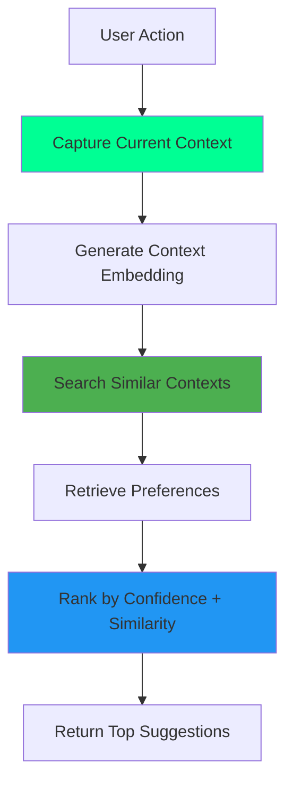

# Situational Context Architecture

**Version:** 1.0
**Date:** 2025-11-03
**Status:** Draft
**Part of:** Fidus System Architecture

---

## Overview

**Situational Context** is a core concept in the Fidus system that recognizes user preferences are not absolute but **context-dependent**. The same user may have different preferences based on time, location, activity, social setting, cognitive state, and other situational factors.

**Key Principle:** Preferences are not stored as single values, but as **context-preference pairs**.

---

## Problem Statement

### Traditional Preference Systems

Traditional systems store preferences as static key-value pairs:

```
user.coffee_preference = "cappuccino"
user.music_genre = "jazz"
```

**Limitations:**
- ❌ No context awareness
- ❌ Cannot handle situational variations
- ❌ User forced to choose one "default" preference
- ❌ Poor personalization quality

### Real-World Preference Behavior

In reality, preferences are highly contextual:

| Situation | Coffee Preference | Music Preference |
|-----------|------------------|------------------|
| Monday morning, office, before meetings | Strong espresso | No music (focus) |
| Saturday afternoon, home, relaxing | Cappuccino | Jazz |
| After dinner, with friends | Decaf | No preference |
| Sunday morning, café, reading | Latte | Classical |

**Observation:** The same person has different preferences in different situations.

---

## Core Concepts

### 1. Situational Factors

**Definition:** Situational factors are any attributes of the current situation that may influence user preferences.

**Categories (Examples, not exhaustive):**

| Category | Examples |
|----------|----------|
| **Temporal** | time_of_day, day_of_week, season, is_weekend, is_holiday |
| **Spatial** | location_type (home, office, café), is_familiar_place, indoors |
| **Social** | alone, with_family, with_colleagues, group_size |
| **Activity** | working, exercising, relaxing, commuting, cooking |
| **Cognitive** | energy_level, stress_level, focus_required, mood |
| **Physical** | weather, temperature, noise_level |
| **Schedule** | busy, free_time, deadline_pressure, first_activity_of_day |

**Important:** This list is **not fixed**. New situational factors can emerge organically based on user behavior.

### 2. Context-Preference Pairing

**Definition:** A preference is always stored together with the situational context in which it applies.

```
Preference: "cappuccino"
Context: {
  time_of_day: "morning",
  location: "home",
  day_of_week: "Saturday",
  alone: true
}
```

**Key Property:** The same preference can exist multiple times with different contexts and different confidence scores.

### 3. Dynamic Context Schema

**Principle:** The system does NOT enforce a fixed schema for situational factors.

**Why?**
- ✅ Different domains may require different factors
- ✅ New factors can be discovered over time
- ✅ User-specific factors can emerge (e.g., "first_coffee_of_day", "post_workout")
- ✅ Prevents over-engineering

**Implementation:** Context is stored as flexible key-value structure (JSON, graph properties).

### 4. Context Similarity

**Definition:** Two contexts are similar if they share relevant situational factors.

**Example:**
```
Context A: {time_of_day: "morning", location: "office", day: "Monday"}
Context B: {time_of_day: "morning", location: "office", day: "Tuesday"}

Similarity: High (only day differs, but morning + office are same)
```

**Measurement:** Similarity is computed using semantic embeddings (see Solution Architecture).

### 5. Context Relevance

**Definition:** Not all situational factors are equally relevant for every preference.

**Example:**
For `coffee.morning_drink`:
- ✅ `time_of_day`: **Highly relevant** (morning vs afternoon matters)
- ✅ `alone` vs `with_colleagues`: **Somewhat relevant** (social pressure)
- ❌ `weather`: **Barely relevant** (doesn't affect coffee choice much)

For `music.work_genre`:
- ✅ `activity`: **Highly relevant** (working vs exercising matters)
- ✅ `noise_level`: **Relevant** (noisy environment → different music)
- ❌ `day_of_week`: **Barely relevant**

**Learning:** The system learns which factors are relevant for which preferences over time.

---

## Architectural Principles

### 1. Schema-less Context

**Principle:** Do NOT define a fixed context schema upfront.

**Rationale:**
- Impossible to predict all relevant factors
- Different users may have different relevant factors
- System should discover factors organically

**Implementation:** Store context as flexible key-value structure.

### 2. LLM-Driven Context Extraction

**Principle:** Use LLM to extract situational factors from natural conversation.

**Rationale:**
- Users naturally mention context: "I'm at the office, Monday morning, stressed..."
- LLM can infer implicit context: "I'm exhausted" → `energy_level: low`
- LLM can discover new factors: "I already had 3 coffees" → `coffees_today: 3`

### 3. Embedding-Based Matching

**Principle:** Use semantic embeddings to find similar contexts.

**Rationale:**
- Cannot rely on exact key matches (contexts rarely identical)
- Need fuzzy matching: "Monday morning office" ≈ "Tuesday morning office"
- Embeddings capture semantic similarity

### 4. Context Evolution

**Principle:** The system learns which factors are relevant over time.

**Rationale:**
- Not all factors matter equally
- Relevance depends on preference type
- Should adapt to user behavior

**Example:**
```
Initial: All factors weighted equally
After 20 coffee interactions:
→ time_of_day: 0.9 (very relevant)
→ location: 0.3 (somewhat relevant)
→ weather: 0.1 (barely relevant)
```

---

## Context Lifecycle

### 1. Context Capture

**When:** During every user interaction

**Sources:**
- **Explicit:** User states context ("I'm at home", "It's Monday")
- **Implicit:** LLM infers context ("I'm tired" → `energy_level: low`)
- **System:** Always available (timestamp, day of week)
- **External:** Optional (calendar, location services, weather API)

**Output:** Context object with key-value pairs

### 2. Context Storage

**When:** When a preference is learned or reinforced

**Structure:**
```
Preference ←→ Context ←→ Embedding
```

**Multiple Contexts:** Same preference can have multiple associated contexts

### 3. Context Retrieval

**When:** User requests suggestion or system proactively suggests

**Process:**
1. Capture current context
2. Generate embedding of current context
3. Find similar contexts (embedding search)
4. Retrieve preferences associated with similar contexts
5. Rank by confidence + context similarity

### 4. Context Evolution

**When:** Continuously, in background

**Process:**
1. Analyze all contexts for a preference
2. Identify which factors are consistent (→ relevant)
3. Identify which factors vary (→ less relevant)
4. Adjust weighting for future retrieval

---

## Context-Aware Preference Retrieval

### Basic Flow



### Ranking Formula

```
Score(preference, context) =
    confidence × context_similarity × relevance_weight

Where:
- confidence: 0.0 - 1.0 (learned confidence score)
- context_similarity: 0.0 - 1.0 (embedding cosine similarity)
- relevance_weight: 0.0 - 1.0 (learned factor importance)
```

### Example

```
Current Context: {time_of_day: "morning", location: "office", day: "Monday"}

Stored Preferences:
1. Preference: "espresso"
   Context: {time_of_day: "morning", location: "office", day: "Tuesday"}
   Confidence: 0.9
   Similarity: 0.95 (very similar!)
   → Score: 0.9 × 0.95 = 0.855

2. Preference: "cappuccino"
   Context: {time_of_day: "afternoon", location: "home"}
   Confidence: 0.8
   Similarity: 0.4 (not similar)
   → Score: 0.8 × 0.4 = 0.32

Result: Suggest "espresso" (higher score)
```

---

## Context in Multi-Domain System

### Domain-Specific Context

Different domains care about different context factors:

| Domain | Relevant Context Factors |
|--------|-------------------------|
| **Calendar** | time_of_day, day_of_week, location, with_people, meeting_type |
| **Finance** | end_of_month, payday, budget_status, location (shopping context) |
| **Travel** | season, weather, alone vs group, travel_purpose (business vs leisure) |
| **Communication** | time_of_day, with_whom, urgency, formality_required |
| **Health** | time_of_day, before/after meal, energy_level, activity_level |

**Architecture Decision:** Each domain supervisor can query User Profile Service with its own context dimensions.

### Cross-Domain Context Sharing

**Scenario:** Finance domain learns "User prefers cheap restaurants when traveling for work"

**Context:**
```
{
  domain: "finance",
  preference: "restaurant.price_range = low",
  context: {
    activity: "business_travel",  # ← This could come from Travel domain!
    location_type: "unfamiliar"
  }
}
```

**Implication:** Context from one domain (Travel) can influence preferences in another domain (Finance).

**Solution:** Shared Context Service accessible by all domain supervisors.

---

## Privacy Considerations

### Context Sensitivity

**Risk:** Context data can be highly personal and revealing.

**Examples:**
- Location patterns reveal home/work addresses
- Activity patterns reveal habits and routines
- Social context reveals relationships
- Cognitive/emotional state is sensitive data

### Privacy Protection

**Principles:**
1. **Local Storage:** Context embeddings stored locally (not sent to cloud)
2. **Encryption:** Context data encrypted at rest
3. **Retention Policy:** Context data subject to same deletion as preferences
4. **User Control:** "Delete All Memories" also deletes all context data
5. **Anonymization:** Raw text conversations deleted after context extraction

**GDPR Compliance:**
- Context factors are personal data → Right to erasure applies
- Context-based profiling → User must consent
- Context retention limited to necessary duration

---

## Evolution Strategy

### Phase 1: Basic Temporal Context (Prototype)
- System time (hour, day of week)
- LLM-extracted activity
- Simple embedding-based matching

### Phase 2: Multi-Dimensional Context
- Add spatial, social, cognitive dimensions
- Context relevance learning
- Weighted retrieval

### Phase 3: External Context Integration
- Calendar integration (planned activities)
- Weather API
- Location services (with permission)
- Smart home sensors (with permission)

### Phase 4: Predictive Context
- Predict future context based on patterns
- Proactive suggestions based on predicted context
- "You usually prefer X when Y is about to happen"

---

## Open Questions

1. **Context Granularity:** How fine-grained should context factors be?
   - "morning" vs "8:15am"?
   - "office" vs "office_desk_A"?

2. **Context Drift:** How to handle changing patterns?
   - User moves to new office
   - User changes work hours
   - Seasonal preference shifts

3. **Context Conflicts:** What if stored contexts are contradictory?
   - User says "I love cappuccino" on Monday
   - User says "I hate cappuccino" on Tuesday (same context)

4. **Context Privacy Trade-offs:** How much context to capture vs privacy?
   - More context → Better personalization
   - More context → Higher privacy risk

---

## Related Documents

- [User Profiling Architecture](07-user-profiling.md) - How preferences are stored
- [Proactivity Architecture](04-signals-events-proactivity.md) - How context triggers proactive actions
- [Security Architecture](09-security-architecture.md) - Privacy protection
- [Solution Architecture: Situational Context](../solution-architecture/14-situational-context.md) - Technical implementation

---

**Maintained by:** Core Architecture Team
**Last Updated:** 2025-11-03
**Next Review:** After Fidus Memory prototype completion

---

**End of Document**
