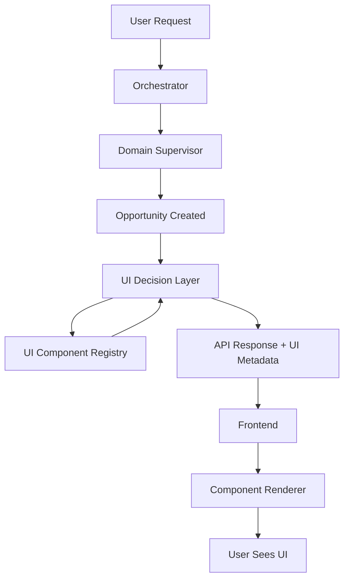

# UI Decision Layer & API Response Schema

**Version:** 1.0
**Date:** 2025-01-28
**Status:** ✅ Complete

> **Navigation:** [← Security](09-security-architecture.md) | [Next: Compliance →](11-compliance-architecture.md)

---

## Table of Contents

1. [Overview](#overview)
2. [Problem Statement](#problem-statement)
3. [UI Decision Layer Architecture](#ui-decision-layer-architecture)
4. [API Response Schema](#api-response-schema)
5. [Opportunity Surface Service](#opportunity-surface-service)
6. [Implementation Guide](#implementation-guide)
7. [Examples](#examples)

---

## 1. Overview

The **UI Decision Layer** is the critical bridge between Fidus's backend AI (Orchestrator + Supervisors) and the frontend UI. It enables the **AI-Driven UI paradigm** where the backend decides **what** UI to show based on context.

### Key Concepts

| Component | Purpose | Layer |
|-----------|---------|-------|
| **UI Decision Layer (Backend)** | LLM selects which UI component to render | Orchestrator |
| **UI Component Registry** | Catalog of available UI components | Frontend |
| **UI Metadata** | Instructions for frontend rendering (in API responses) | API |
| **Opportunity Surface Service** | Manages dynamic dashboard opportunities | Backend |

### Architecture Diagram



---

## 2. Problem Statement

### The Gap (Before UI Decision Layer)

**Backend (Excellent):**
- ✅ LangGraph supervisors detect opportunities
- ✅ Intent detection and routing
- ✅ Domain events and proactive triggers
- ✅ Context-aware reasoning

**Frontend (Needed Guidance):**
- ❓ How should the frontend know which UI to show?
- ❓ Should it be a card, modal, chat, or form?
- ❓ What buttons/actions should be available?
- ❓ How does the LLM communicate UI decisions?

**❌ The Missing Bridge:**
```
Backend: "User has double-booking conflict"
         ↓ ???
Frontend: Should I show a toast, card, modal, or chat?
```

### The Solution (UI Decision Layer)

```
Backend: "User has double-booking conflict"
         ↓
UI Decision Layer (LLM): "Show OpportunityCard with urgency=urgent,
                          actions=[Reschedule, Dismiss]"
         ↓
API Response: {
  ui_metadata: {
    component_id: "opportunity-card",
    props: {...}
  }
}
         ↓
Frontend: Renders OpportunityCard component
```

---

## 3. UI Decision Layer Architecture

### Backend Implementation

The UI Decision Layer sits in the **Orchestrator** and uses an LLM to decide which UI component to render.

**Location:** `packages/api/fidus/domain/orchestration/ui_decision_layer.py`

```python
# packages/api/fidus/domain/orchestration/ui_decision_layer.py

from typing import Dict, Any, Optional, List
from fidus.infrastructure.llm import LLMService
from fidus.domain.orchestration.ui_component_registry import UI_COMPONENT_REGISTRY

class UIDecisionLayer:
    """
    Uses LLM to decide which UI component to render for an opportunity.

    Responsibilities:
    - Select best UI component from registry
    - Generate component props based on opportunity data
    - Provide fallback component if primary fails
    - Consider user context (device, screen, preferences)
    """

    def __init__(self, llm_service: LLMService):
        self.llm = llm_service
        self.registry = UI_COMPONENT_REGISTRY

    async def decide_ui(
        self,
        opportunity: Dict[str, Any],
        user_context: Dict[str, Any],
    ) -> Dict[str, Any]:
        """
        Decide which UI component to render.

        Args:
            opportunity: Opportunity data (title, urgency, domain, actions)
            user_context: User context (device, screen, preferences)

        Returns:
            UI metadata with component_id, props, and fallback
        """
        # Build LLM prompt with registry and opportunity
        prompt = self._build_ui_decision_prompt(opportunity, user_context)

        # Ask LLM to select component
        response = await self.llm.complete(
            prompt=prompt,
            response_format="json",
            max_tokens=500,
        )

        ui_decision = self._parse_llm_response(response)

        # Validate component exists
        if ui_decision['component_id'] not in self.registry:
            ui_decision = self._get_default_component(opportunity)

        # Add fallback component
        ui_decision['fallback'] = self._get_fallback_component(opportunity)

        return ui_decision

    def _build_ui_decision_prompt(
        self,
        opportunity: Dict[str, Any],
        user_context: Dict[str, Any],
    ) -> str:
        """Build LLM prompt for UI decision."""
        components_desc = self._format_registry()

        return f"""
You are the UI Decision Layer for Fidus, a privacy-first AI personal assistant.

Your job: Select the BEST UI component to show this opportunity.

## Available Components

{components_desc}

## Opportunity

- Title: {opportunity.get('title')}
- Description: {opportunity.get('description')}
- Urgency: {opportunity.get('urgency')} (urgent/medium/low)
- Domain: {opportunity.get('domain')} (calendar/finance/travel/etc.)
- Actions: {opportunity.get('actions', [])}

## User Context

- Device: {user_context.get('device', 'desktop')} (mobile/tablet/desktop)
- Current Screen: {user_context.get('screen', 'dashboard')}
- Time: {user_context.get('time_of_day', 'unknown')}

## Selection Criteria

1. **Urgency Match:**
   - urgent → quick-action-toast or opportunity-card
   - medium → opportunity-card
   - low → detail-panel

2. **Device Consideration:**
   - mobile → prefer simpler components (cards over modals)
   - desktop → can use more complex components

3. **Context:**
   - If user is on mobile during commute → toast for urgent
   - If user is at desk → card or modal

4. **Domain Compatibility:**
   - Ensure component supports the opportunity's domain

## Response Format (JSON)

{{
  "component_id": "opportunity-card",
  "props": {{
    "title": "Double booking detected",
    "description": "You have two meetings at 2pm today",
    "urgency": "urgent",
    "domain": "calendar",
    "actions": [
      {{
        "id": "reschedule",
        "label": "Reschedule Team Sync",
        "type": "primary",
        "endpoint": "/api/calendar/appointments/456/reschedule"
      }},
      {{
        "id": "dismiss",
        "label": "Dismiss",
        "type": "secondary"
      }}
    ]
  }},
  "reasoning": "OpportunityCard is best because urgency is high and user is on desktop."
}}
"""

    def _format_registry(self) -> str:
        """Format UI Component Registry for LLM prompt."""
        lines = []
        for comp_id, comp in self.registry.items():
            lines.append(f"### {comp['name']} (`{comp_id}`)")
            lines.append(f"- **Category:** {comp['category']}")
            lines.append(f"- **Description:** {comp['description']}")
            lines.append(f"- **Supports Urgency:** {', '.join(comp['supports']['urgencyLevels'])}")
            lines.append(f"- **Supports Domains:** {', '.join(comp['supports']['domains'])}")
            lines.append(f"- **Props:** {', '.join(comp['props'].keys())}")
            lines.append("")

        return "\n".join(lines)

    def _get_default_component(
        self,
        opportunity: Dict[str, Any]
    ) -> Dict[str, Any]:
        """Get default component if LLM selection fails."""
        urgency = opportunity.get('urgency', 'medium')

        # Default based on urgency
        if urgency == 'urgent':
            component_id = 'quick-action-toast'
        elif urgency == 'medium':
            component_id = 'opportunity-card'
        else:
            component_id = 'detail-panel'

        return {
            'component_id': component_id,
            'props': {
                'title': opportunity.get('title', 'Untitled'),
                'description': opportunity.get('description', ''),
                'urgency': urgency,
                'actions': opportunity.get('actions', []),
            },
        }

    def _get_fallback_component(
        self,
        opportunity: Dict[str, Any]
    ) -> Dict[str, Any]:
        """Get fallback component for error cases."""
        return {
            'component_id': 'simple-card',
            'props': {
                'title': opportunity.get('title', 'Opportunity'),
                'message': 'View details in your domain.',
            },
        }
```

### UI Component Registry (Backend)

The backend maintains a **registry** of all available frontend components.

**Location:** `packages/api/fidus/domain/orchestration/ui_component_registry.py`

```python
# packages/api/fidus/domain/orchestration/ui_component_registry.py

UI_COMPONENT_REGISTRY = {
    'opportunity-card': {
        'id': 'opportunity-card',
        'name': 'OpportunityCard',
        'category': 'card',
        'description': 'Standard opportunity card for dashboard',
        'props': {
            'title': {'type': 'string', 'required': True},
            'description': {'type': 'string', 'required': True},
            'urgency': {'type': 'UrgencyLevel', 'required': True},
            'actions': {'type': 'Action[]', 'required': True},
            'domain': {'type': 'DomainType', 'required': True},
        },
        'supports': {
            'urgencyLevels': ['urgent', 'medium', 'low'],
            'domains': ['calendar', 'finance', 'travel', 'communication'],
            'actions': ['reschedule', 'dismiss', 'snooze', 'view_details'],
        },
    },

    'form-modal': {
        'id': 'form-modal',
        'name': 'FormModal',
        'category': 'modal',
        'description': 'Modal dialog with form for data entry',
        'props': {
            'title': {'type': 'string', 'required': True},
            'fields': {'type': 'FormField[]', 'required': True},
            'submitLabel': {'type': 'string', 'required': False},
        },
        'supports': {
            'urgencyLevels': ['medium', 'low'],
            'domains': ['all'],
            'actions': ['create', 'update', 'delete'],
        },
    },

    'quick-action-toast': {
        'id': 'quick-action-toast',
        'name': 'QuickActionToast',
        'category': 'widget',
        'description': 'Temporary notification with quick actions',
        'props': {
            'message': {'type': 'string', 'required': True},
            'actions': {'type': 'Action[]', 'required': True},
            'duration': {'type': 'number', 'required': False},
        },
        'supports': {
            'urgencyLevels': ['urgent'],
            'domains': ['all'],
            'actions': ['quick_action'],
        },
    },

    'chat-interface': {
        'id': 'chat-interface',
        'name': 'ChatInterface',
        'category': 'chat',
        'description': 'Conversational UI for complex interactions',
        'props': {
            'initialMessage': {'type': 'string', 'required': True},
            'context': {'type': 'ConversationContext', 'required': True},
        },
        'supports': {
            'urgencyLevels': ['medium', 'low'],
            'domains': ['all'],
            'actions': ['conversational'],
        },
    },

    'detail-panel': {
        'id': 'detail-panel',
        'name': 'DetailPanel',
        'category': 'widget',
        'description': 'Side panel for detailed information',
        'props': {
            'title': {'type': 'string', 'required': True},
            'content': {'type': 'ReactNode', 'required': True},
        },
        'supports': {
            'urgencyLevels': ['low'],
            'domains': ['all'],
            'actions': ['view_details', 'edit', 'delete'],
        },
    },
}
```

---

## 4. API Response Schema

### Standard Response Structure

All API responses include **UI Metadata** alongside data.

**Type Definition:**

```typescript
// packages/shared/src/types/api.ts

export interface APIResponse<T = unknown> {
  // Core data
  data: T;

  // UI Metadata (NEW!)
  ui_metadata?: UIComponentMetadata;

  // Pagination (if applicable)
  pagination?: {
    page: number;
    page_size: number;
    total: number;
  };

  // Errors
  errors?: APIError[];

  // Metadata
  meta?: {
    timestamp: string;
    request_id: string;
  };
}

export interface UIComponentMetadata {
  // Component to render
  component_id: string;

  // Props for component
  props: Record<string, unknown>;

  // Fallback component (if primary fails to render)
  fallback?: {
    component_id: string;
    props: Record<string, unknown>;
  };

  // UI hints for rendering
  hints?: {
    auto_focus?: boolean;
    auto_dismiss_ms?: number | null;  // null = never auto-dismiss
    position?: 'top' | 'center' | 'bottom';
    priority?: 'urgent' | 'medium' | 'low';
  };
}

export interface APIError {
  code: string;
  message: string;
  field?: string;
  details?: Record<string, unknown>;
}
```

### Example Response

**Endpoint:** `GET /api/opportunity-surface`

```json
{
  "data": {
    "opportunities": [
      {
        "opportunity_id": "opp-123",
        "created_at": "2025-01-28T14:00:00Z",
        "domain": "calendar",
        "trigger_type": "DOUBLE_BOOKING",

        "ui_metadata": {
          "component_id": "opportunity-card",
          "props": {
            "title": "Double booking detected",
            "description": "You have two meetings at 2pm today:\n• Team Sync with Sarah\n• Client Call with Acme Corp",
            "urgency": "urgent",
            "domain": "calendar",
            "icon": "calendar-alert",
            "actions": [
              {
                "id": "reschedule-team-sync",
                "label": "Reschedule Team Sync",
                "type": "primary",
                "endpoint": "/api/calendar/appointments/456/reschedule",
                "method": "POST"
              },
              {
                "id": "cancel-client-call",
                "label": "Cancel Client Call",
                "type": "secondary",
                "endpoint": "/api/calendar/appointments/457/cancel",
                "method": "DELETE"
              },
              {
                "id": "dismiss",
                "label": "Dismiss",
                "type": "tertiary"
              }
            ]
          },
          "fallback": {
            "component_id": "simple-card",
            "props": {
              "title": "Double booking detected",
              "message": "View your calendar for details."
            }
          },
          "hints": {
            "auto_focus": true,
            "auto_dismiss_ms": null,
            "position": "top",
            "priority": "urgent"
          }
        },

        "data": {
          "appointments": [
            {
              "id": "456",
              "title": "Team Sync",
              "start": "2025-01-28T14:00:00Z",
              "end": "2025-01-28T15:00:00Z",
              "attendees": ["sarah@company.com"]
            },
            {
              "id": "457",
              "title": "Client Call",
              "start": "2025-01-28T14:00:00Z",
              "end": "2025-01-28T15:00:00Z",
              "attendees": ["john@acme.com"]
            }
          ]
        }
      }
    ]
  },
  "meta": {
    "timestamp": "2025-01-28T14:00:00Z",
    "request_id": "req-789"
  }
}
```

---

## 5. Opportunity Surface Service

The **Opportunity Surface Service** manages the dynamic dashboard.

**Location:** `packages/api/fidus/domain/proactivity/opportunity_surface_service.py`

```python
# packages/api/fidus/domain/proactivity/opportunity_surface_service.py

from typing import List, Dict, Any, Optional
from datetime import datetime
from fidus.domain.proactivity.opportunity_repository import OpportunityRepository
from fidus.domain.orchestration.ui_decision_layer import UIDecisionLayer

class OpportunitySurfaceService:
    """
    Manages the Opportunity Surface (dashboard).

    Responsibilities:
    - Fetch opportunities for tenant
    - Rank by urgency and relevance
    - Deduplicate similar opportunities
    - Decide UI component for each (via UI Decision Layer)
    - Apply user filters and limits
    """

    def __init__(
        self,
        opportunity_repo: OpportunityRepository,
        ui_decision_layer: UIDecisionLayer,
    ):
        self.repo = opportunity_repo
        self.ui_decision = ui_decision_layer

    async def get_surface(
        self,
        tenant_id: str,
        user_context: Dict[str, Any],
        filters: Optional[Dict[str, Any]] = None,
    ) -> List[Dict[str, Any]]:
        """
        Get opportunities for Opportunity Surface.

        Args:
            tenant_id: Tenant ID
            user_context: User context (device, screen, preferences)
            filters: Optional filters (domains, urgency levels)

        Returns:
            List of opportunities with UI metadata
        """
        # 1. Fetch all active opportunities
        opportunities = await self.repo.get_active_opportunities(tenant_id)

        # 2. Apply filters
        if filters:
            opportunities = self._apply_filters(opportunities, filters)

        # 3. Rank by urgency and relevance
        ranked = self._rank_opportunities(opportunities, user_context)

        # 4. Deduplicate similar opportunities
        deduplicated = self._deduplicate(ranked)

        # 5. Apply user limits (max cards on dashboard)
        max_cards = user_context.get('max_cards', 20)
        limited = deduplicated[:max_cards]

        # 6. Decide UI component for each opportunity
        surface = []
        for opp in limited:
            ui_metadata = await self.ui_decision.decide_ui(opp, user_context)
            surface.append({
                'opportunity_id': opp['id'],
                'created_at': opp['created_at'],
                'domain': opp['domain'],
                'trigger_type': opp['trigger_type'],
                'ui_metadata': ui_metadata,
                'data': opp.get('data', {}),
            })

        return surface

    def _rank_opportunities(
        self,
        opportunities: List[Dict[str, Any]],
        user_context: Dict[str, Any],
    ) -> List[Dict[str, Any]]:
        """Rank opportunities by urgency and relevance."""
        urgency_score = {'urgent': 3, 'medium': 2, 'low': 1}

        def score(opp):
            # Base score from urgency
            score = urgency_score.get(opp['urgency'], 0)

            # Boost for preferred domains
            preferred_domains = user_context.get('preferred_domains', [])
            if opp['domain'] in preferred_domains:
                score += 1

            # Boost for recent opportunities
            age_hours = (datetime.utcnow() - opp['created_at']).total_seconds() / 3600
            if age_hours < 1:
                score += 0.5

            # Boost for specific trigger types
            if opp['trigger_type'] in ['DOUBLE_BOOKING', 'BUDGET_EXCEEDED']:
                score += 0.5

            return score

        return sorted(opportunities, key=score, reverse=True)

    def _deduplicate(
        self,
        opportunities: List[Dict[str, Any]],
    ) -> List[Dict[str, Any]]:
        """Deduplicate similar opportunities."""
        seen = set()
        unique = []

        for opp in opportunities:
            # Create fingerprint
            fingerprint = (
                opp['title'],
                opp['domain'],
                opp['trigger_type'],
            )

            if fingerprint not in seen:
                seen.add(fingerprint)
                unique.append(opp)

        return unique

    def _apply_filters(
        self,
        opportunities: List[Dict[str, Any]],
        filters: Dict[str, Any],
    ) -> List[Dict[str, Any]]:
        """Apply user-specified filters."""
        result = opportunities

        # Filter by domains
        if 'domains' in filters and filters['domains']:
            result = [
                opp for opp in result
                if opp['domain'] in filters['domains']
            ]

        # Filter by urgency levels
        if 'urgency_levels' in filters and filters['urgency_levels']:
            result = [
                opp for opp in result
                if opp['urgency'] in filters['urgency_levels']
            ]

        # Filter by date range
        if 'date_range' in filters and filters['date_range']:
            start = filters['date_range'].get('start')
            end = filters['date_range'].get('end')
            if start:
                result = [opp for opp in result if opp['created_at'] >= start]
            if end:
                result = [opp for opp in result if opp['created_at'] <= end]

        return result
```

---

## 6. Implementation Guide

### Step 1: Set Up UI Component Registry

**Backend:**
1. Create `packages/api/fidus/domain/orchestration/ui_component_registry.py`
2. Define all available UI components
3. Keep in sync with frontend components

**Frontend:**
1. Create `packages/web/src/registry/ui-component-registry.ts`
2. Mirror the backend registry
3. Map `component_id` strings to React components

### Step 2: Implement UI Decision Layer

1. Create `packages/api/fidus/domain/orchestration/ui_decision_layer.py`
2. Implement `decide_ui()` method with LLM prompting
3. Add to Orchestrator initialization
4. Use in Opportunity Surface Service

### Step 3: Update API Response Schema

1. Add `ui_metadata` field to all API responses
2. Update `APIResponse` type in `packages/shared/src/types/api.ts`
3. Ensure all endpoints return UI metadata

### Step 4: Implement Opportunity Surface Service

1. Create `packages/api/fidus/domain/proactivity/opportunity_surface_service.py`
2. Implement ranking, deduplication, filtering
3. Integrate UI Decision Layer
4. Create API endpoint: `GET /api/opportunity-surface`

### Step 5: Frontend Integration

1. Create `UIDecisionLayer` component in `packages/web/src/services/ui-decision-layer.tsx`
2. Map `component_id` to React components
3. Render components with props from `ui_metadata`
4. Handle fallback components

---

## 7. Examples

### Example 1: Budget Alert

**Opportunity Data:**
```python
opportunity = {
    'id': 'opp-456',
    'title': 'Budget Alert: Food spending at 95%',
    'description': 'You've spent $475 of your $500 food budget.',
    'urgency': 'medium',
    'domain': 'finance',
    'trigger_type': 'BUDGET_THRESHOLD',
    'actions': [
        {'id': 'view_transactions', 'label': 'View Transactions'},
        {'id': 'adjust_budget', 'label': 'Adjust Budget'},
        {'id': 'dismiss', 'label': 'Dismiss'},
    ],
}
```

**UI Decision Layer Output:**
```json
{
  "component_id": "opportunity-card",
  "props": {
    "title": "Budget Alert: Food spending at 95%",
    "description": "You've spent $475 of your $500 food budget.",
    "urgency": "medium",
    "domain": "finance",
    "actions": [
      {
        "id": "view_transactions",
        "label": "View Transactions",
        "type": "primary",
        "endpoint": "/api/finance/transactions?category=food"
      },
      {
        "id": "adjust_budget",
        "label": "Adjust Budget",
        "type": "secondary",
        "endpoint": "/api/finance/budgets/123/edit"
      },
      {
        "id": "dismiss",
        "label": "Dismiss",
        "type": "tertiary"
      }
    ]
  },
  "fallback": {
    "component_id": "simple-card",
    "props": {
      "title": "Budget Alert",
      "message": "Check your Finance dashboard for details."
    }
  }
}
```

### Example 2: Meeting Prep Suggestion

**Opportunity Data:**
```python
opportunity = {
    'id': 'opp-789',
    'title': 'Prepare for Q4 Strategy Review',
    'description': 'Meeting tomorrow at 10am with Acme Corp.',
    'urgency': 'low',
    'domain': 'calendar',
    'trigger_type': 'MEETING_PREP',
    'actions': [
        {'id': 'schedule_prep', 'label': 'Schedule Prep Time'},
        {'id': 'view_agenda', 'label': 'View Agenda'},
        {'id': 'dismiss', 'label': 'Dismiss'},
    ],
}
```

**UI Decision Layer Output (Desktop):**
```json
{
  "component_id": "detail-panel",
  "props": {
    "title": "Prepare for Q4 Strategy Review",
    "content": {
      "meeting_time": "Tomorrow at 10:00 AM",
      "attendees": ["John Doe (Acme Corp)", "Jane Smith"],
      "suggested_prep": [
        "Review Q3 performance (15 min)",
        "Draft Q4 proposal outline (30 min)",
        "Email agenda to attendees"
      ]
    },
    "actions": [
      {
        "id": "schedule_prep",
        "label": "Schedule Prep Time",
        "type": "primary"
      }
    ]
  }
}
```

**UI Decision Layer Output (Mobile):**
```json
{
  "component_id": "opportunity-card",
  "props": {
    "title": "Prepare for Q4 Strategy Review",
    "description": "Meeting tomorrow at 10am. Suggested prep: Review Q3 performance, draft proposal.",
    "urgency": "low",
    "domain": "calendar",
    "actions": [
      {
        "id": "schedule_prep",
        "label": "Schedule Prep",
        "type": "primary"
      },
      {
        "id": "dismiss",
        "label": "Later",
        "type": "secondary"
      }
    ]
  }
}
```

---

## Related Documentation

- [00-ai-driven-ui-paradigm.md](../ux-ui-design/00-ai-driven-ui-paradigm.md) - AI-Driven UI philosophy
- [13-frontend-architecture.md](../ux-ui-design/13-frontend-architecture.md) - Frontend implementation details
- [03-orchestrator-architecture.md](03-orchestrator-architecture.md) - Orchestrator design
- [04-signals-events-proactivity.md](04-signals-events-proactivity.md) - Opportunity creation

---

**Document Status:** ✅ Complete
**Last Review:** 2025-01-28
**Next Review:** 2025-02-28 (quarterly review)
