# Entity-Relationship Model & Situational Context

**Version:** 1.0
**Date:** 2025-11-19
**Status:** Draft
**Part of:** Fidus System Architecture

> **Navigation:** [← Situational Context Architecture](08-situational-context-architecture.md) | [Back to README →](README.md)

---

## Overview

This document defines the **logical entity model** for the Fidus Memory system. It describes:

1. **Entities** - Domain objects that exist independently (Neo4j Nodes)
2. **Relationships** - How entities connect (Neo4j Relationships)
3. **Situational Context** - Dynamic, AI-driven metadata qualifying relationships (Qdrant)
4. **User Attributes** - Properties directly on the User node

**Core Principle:** Maximize AI flexibility. The system uses **minimal fixed schemas** and allows the AI to dynamically determine structure where possible.

---

## Conceptual Separation

The Fidus Memory system separates three distinct layers:

```mermaid
graph TB
    subgraph Layer1["Layer 1: Domain Entities (Neo4j Nodes)"]
        E1["Person, Organization, Goal, Habit, Event, Location, Object"]
        E1_DESC["Eigenständige Dinge mit Identität<br/>Existieren unabhängig vom User"]
    end

    subgraph Layer2["Layer 2: Relationships (Neo4j Relationships)"]
        R1["KNOWS, WORKS_AT, PURSUES, HAS_HABIT, ATTENDS, etc."]
        R2["Properties: role, relationship_type, situation_id"]
        R2_DESC["Verbindungen zwischen Entitäten<br/>Stabile Properties (nicht situativ)"]
    end

    subgraph Layer3["Layer 3: Situational Context (Qdrant)"]
        C1["Flexible, KI-generierte Kontext-Faktoren"]
        C2["time_of_day, emotion, activity, mood, etc."]
        C2_DESC["Metadaten die Relationships qualifizieren<br/>Hochgradig situativ, KEIN festes Schema"]
    end

    Layer1 --> Layer2
    Layer2 --> Layer3

    style Layer1 fill:#ccffcc
    style Layer2 fill:#ccccff
    style Layer3 fill:#ffffcc
```



**Critical Distinction:**

- **Entities** (Layer 1): "Anna", "ACME Corp", "Abnehmen" - things that exist
- **Relationships** (Layer 2): "User KNOWS Anna", "User WORKS_AT ACME" - stable connections with **role**
- **Context** (Layer 3): "mornings when stressed" - situational metadata (emotion, time, etc.)

---

## 1. Entities (Neo4j Nodes)

**Definition:** An entity is a **domain object with independent identity** that exists regardless of the user's relationship to it.

**Test:** "Does this exist as a 'thing' I can point to?" → Yes = Entity

### 1.1 Entity Types

| Priority | Entity | Description | Examples |
|----------|--------|-------------|----------|
| 🔴 **High** | **Person** | Human beings the user knows | "Anna", "Mein Chef", "Dr. Schmidt" |
| 🔴 **High** | **Organization** | Companies, institutions, groups | "ACME Corp", "Fitnessstudio XY", "Kindergarten" |
| 🔴 **High** | **Goal** | Objectives the user pursues | "Abnehmen", "Beförderung", "Spanisch lernen" |
| 🟡 **Medium** | **Habit** | Recurring behaviors/routines | "Joggen montags", "Morgens Kaffee" |
| 🟡 **Medium** | **Event** | Scheduled occurrences | "Q4 Review Meeting", "Urlaub Mallorca" |
| 🟡 **Medium** | **Object** | Physical things the user owns/uses | "MacBook Pro", "Tesla Model 3", "Kaffeemaschine" |
| 🟡 **Medium** | **Location** | Places with significance | "Café Central", "Home Office", "Stammkneipe" |
| ✅ **Implemented** | **Preference** | User's likes/dislikes | "Kaffee morgens", "Jazz" |

### 1.2 Entity Schema Design

**Principle:** **Minimal fixed schema, AI-driven property discovery**

Each entity has:
- **Required properties**: `id`, `tenant_id`, `created_at`, `updated_at`
- **Type-specific core properties**: Minimal set (e.g., `name` for Person)
- **AI-discovered properties**: Flexible additional properties determined by AI

**Example: Person Entity**

```cypher
// Minimal fixed schema
(:Person {
  id: "person-uuid",
  tenant_id: "tenant-1",
  name: "Anna Schmidt",           // Core property
  created_at: "2025-11-19T10:00:00Z",
  updated_at: "2025-11-19T10:00:00Z",

  // AI-discovered properties (examples, not exhaustive!)
  profession: "Software Engineer", // AI extracted from conversation
  topics: ["tech", "hiking"],      // AI discovered shared interests
  communication_style: "direct"    // AI learned preference
})
```

**Important:** The AI can add new properties during conversations without schema migration!

**Example: Goal Entity**

```cypher
(:Goal {
  id: "goal-uuid",
  tenant_id: "tenant-1",
  description: "Abnehmen auf 75kg",  // Core property
  type: "health",                     // AI-categorized
  created_at: "2025-11-19T10:00:00Z",

  // AI-discovered properties
  target_value: "75kg",
  current_value: "82kg",
  deadline: "2026-06-01",
  motivation: "Gesundheit verbessern",
  obstacles: ["Zeit", "Süßigkeiten"],
  strategies: ["Joggen", "Kalorienzählen"]
})
```

**Schema Evolution:**
- AI extracts new properties from conversation: "Mein Chef ist sehr detailorientiert" → `detail_oriented: true`
- No database migration needed (Neo4j schema-less for properties)
- Properties emerge organically based on user mentions

### 1.3 Entity Lifecycle

**Creation:** AI detects entity mention in conversation

```
User: "Ich habe heute mit Anna, meiner Kollegin, über das Projekt gesprochen"

AI extracts:
→ Person: "Anna"
→ Relationship: KNOWS {role: "colleague", relationship_type: "professional"}
→ Context: {time_of_day: "today", topic: "work_project"}
```

**Update:** AI enriches entity properties over time

```
User (later): "Anna ist übrigens super in Python"

AI updates:
→ Person {name: "Anna", skills: ["python"], ...}
```

**Deletion:** User-requested or automatic (GDPR right to erasure)

---

## 2. Relationships (Neo4j Relationships)

**Definition:** A relationship connects two entities and describes **how they relate** in a **stable way** (not situational).

**Test:** "Is this stable or does it change with the situation?" → Stable = Relationship Property, Situational = Context (Qdrant)

### 2.1 Relationship Types

| Relationship | Connects | Description | Example |
|--------------|----------|-------------|---------|
| `KNOWS` | User → Person | User knows a person | User KNOWS "Anna" |
| `WORKS_AT` | User → Organization | User is employed by | User WORKS_AT "ACME Corp" |
| `MEMBER_OF` | User → Organization | User is member of | User MEMBER_OF "Fitnessstudio" |
| `PURSUES` | User → Goal | User works towards goal | User PURSUES "Abnehmen" |
| `HAS_HABIT` | User → Habit | User practices habit | User HAS_HABIT "Joggen montags" |
| `ATTENDS` | User → Event | User participates in event | User ATTENDS "Q4 Review" |
| `OWNS` | User → Object | User possesses object | User OWNS "MacBook Pro" |
| `FREQUENTS` | User → Location | User visits location | User FREQUENTS "Café Central" |
| `HAS_PREFERENCE` | User → Preference | User has preference | User HAS_PREFERENCE "Kaffee" |

**Extensibility:** AI can **suggest new relationship types** when existing types don't fit.

```
User: "Ich bewundere Elon Musk für seine Vision"

AI suggests:
→ New relationship type: ADMIRES (User → Person)
→ Properties: {aspect: "vision", intensity: "high"}
```

### 2.2 Relationship Properties

**Principle:** Properties on relationships describe **stable aspects** of the connection, NOT situational context.

**Standard Properties (all relationships):**

```cypher
[relationship {
  relationship_instance_id: "uuid",  // Unique ID for this relationship instance
  situation_id: "sit-uuid",          // Reference to Qdrant context
  observed_at: datetime(),           // When was this relationship observed
  confidence: 0.85,                  // AI confidence (0.0 - 1.0)
  source: "explicit" | "implicit"    // How was this learned
}]
```

**Type-Specific Properties (stable, not situational!):**

#### Example: KNOWS Relationship

```cypher
(User)-[:KNOWS {
  // Standard properties
  relationship_instance_id: "rel-uuid",
  situation_id: "sit-123",
  observed_at: datetime(),
  confidence: 0.9,

  // Stable properties (NICHT situativ!)
  role: "colleague",                      // Stable: Anna ist immer Kollegin
  relationship_type: "professional",      // Stable: Art der Beziehung
  communication_frequency: "daily",       // AI-learned pattern
  topics: ["work", "tech", "hiking"],     // Shared interests (stable)

  // FALSCH (gehört in Qdrant!):
  // emotion: "friendly" ← NEIN! Das ist situativ
  // time_of_day: "morning" ← NEIN! Das ist Kontext
}]->(Person {name: "Anna"})
```

#### Example: WORKS_AT Relationship

```cypher
(User)-[:WORKS_AT {
  relationship_instance_id: "rel-uuid",
  situation_id: "sit-456",

  // Stable properties
  role: "Senior Engineer",          // Stabile Rolle im Unternehmen
  department: "Product Development",
  started_at: "2023-01-15",
  employment_type: "full_time",

  // AI-discovered stable properties
  satisfaction_level: "high",       // Overall (nicht tagesabhängig)
  career_goals: ["tech_lead", "architect"]
}]->(Organization {name: "ACME Corp"})
```

#### Example: PURSUES Relationship (Goal)

```cypher
(User)-[:PURSUES {
  relationship_instance_id: "rel-uuid",
  situation_id: "sit-789",

  // Stable properties
  priority: "high",                 // Overall priority
  status: "active" | "paused" | "completed",
  started_at: "2025-11-01",
  target_date: "2026-06-01",

  // AI-discovered
  commitment_level: "strong",
  main_obstacle: "time_management"
}]->(Goal {description: "Abnehmen"})
```

### 2.3 Role as Relationship Property (NOT Context!)

**Critical:** `role` is a **stable property of the relationship**, NOT situational context!

**Examples:**

```cypher
// Role: "father" - stable, nicht situativ
(User)-[:KNOWS {
  role: "father",
  relationship_type: "family"
}]->(Person {name: "Emma", relation: "daughter"})

// Role: "engineer" - stable position
(User)-[:WORKS_AT {
  role: "Senior Engineer",
  department: "Product"
}]->(Organization {name: "ACME"})

// Role: "hobby_photographer" - stable identity
(User)-[:IDENTIFIES_AS {
  role: "hobby_photographer",
  skill_level: "intermediate"
}]->(Role {name: "Photographer"})  // Optional: Role as entity
```

**Why not in Qdrant?**
- Role doesn't change with time of day, mood, or location
- Role is core to the relationship structure
- Queries like "Show my work contacts" need direct Neo4j access: `MATCH (u)-[:KNOWS {relationship_type: "professional"}]->(p)`

**Contrast to Situational Context:**

| Aspect | Relationship Property (Neo4j) | Situational Context (Qdrant) |
|--------|-------------------------------|------------------------------|
| **Role** | "colleague", "friend", "father" | ❌ NOT in context |
| **Emotion** | ❌ NOT stable | "friendly", "tense", "stressed" ✅ |
| **Time** | ❌ NOT stable | "morning", "evening", "weekend" ✅ |
| **Activity** | ❌ NOT stable | "working", "relaxing", "exercising" ✅ |

**Combined Example:**

```cypher
// Neo4j: Stable relationship
(User)-[:KNOWS {
  role: "colleague",                     // Stable
  relationship_type: "professional",     // Stable
  situation_id: "sit-work-anna-123"      // Reference to context
}]->(Person {name: "Anna"})
```

```python
# Qdrant: Situational context
{
  "id": "sit-work-anna-123",
  "vector": [...],
  "payload": {
    "relationship_instance_id": "rel-anna-uuid",
    "context": {
      "time_of_day": "morning",          # Situativ
      "location": "office",              # Situativ
      "activity": "project_discussion",  # Situativ
      "mood": "focused",                 # Situativ
      "topic": "sprint_planning"         # Situativ
    }
  }
}
```

**Result:** "User knows Anna as colleague (stable) in the morning at the office discussing projects (situational)"

---

## 3. Situational Context (Qdrant)

**Definition:** Situational context consists of **flexible, AI-generated metadata** that qualifies relationships based on **temporal, spatial, emotional, or activity-based conditions**.

**Critical Principle:** **NO FIXED SCHEMA!** The AI determines context factors dynamically.

### 3.1 Context Architecture

**Storage:**
- **Neo4j:** Stores `situation_id` reference on relationships (minimal footprint)
- **Qdrant:** Stores **full context + embeddings** (flexible, schema-less)

**Workflow:**


### 3.2 Context Schema (Intentionally Flexible!)

**Data Structure:**

```python
{
  "id": "sit-uuid",
  "vector": [0.1, 0.2, ...],  # 768-dim embedding for similarity search
  "payload": {
    # Fixed metadata (for filtering)
    "tenant_id": "tenant-1",
    "user_id": "user-123",
    "entity_type": "person" | "goal" | "preference" | ...,
    "entity_id": "person-uuid",
    "relationship_type": "KNOWS" | "PURSUES" | ...,
    "relationship_instance_id": "rel-uuid",
    "created_at": "2025-11-19T10:00:00Z",

    # FLEXIBLE CONTEXT (KI-bestimmt, KEIN festes Schema!)
    "context": {
      # Common factors (examples, NOT required!)
      "time_of_day": "morning" | "afternoon" | "evening" | "night",
      "day_of_week": "monday" | "tuesday" | ...,
      "location": "home" | "office" | "cafe" | ...,
      "activity": "working" | "relaxing" | "exercising" | ...,
      "mood": "energetic" | "tired" | "stressed" | "calm" | ...,
      "emotion": "happy" | "frustrated" | "anxious" | "excited" | ...,

      # AI-discovered factors (beliebig!)
      "coffee_count_today": 3,
      "deadline_pressure": "high",
      "post_workout": true,
      "first_task_of_day": true,
      "weather": "rainy",
      "noise_level": "quiet",
      "energy_level": "medium",
      "social_interaction": "group",

      # Nested structures (optional, max 2-3 levels)
      "location_details": {
        "type": "office",
        "floor": 3,
        "room": "meeting_room_a"
      },
      "participants": ["Anna", "Bob", "Charlie"],

      # ... BELIEBIGE weitere Faktoren!
      # Die KI kann JEDERZEIT neue Faktoren hinzufügen!
    }
  }
}
```

**Key Points:**
- ✅ **No required fields in `context`** (AI decides what's relevant)
- ✅ **Flat or nested structures** (max 2-3 levels recommended)
- ✅ **String, number, boolean, array values** (Qdrant supports all)
- ✅ **New factors can emerge** without system changes
- ✅ **Domain-specific factors** (e.g., `heart_rate_bpm` for health domain)

### 3.3 AI-Driven Context Extraction

**Principle:** The AI **discovers** context factors from natural conversation, not from predefined schemas.

**Example Extraction:**

```
User: "Ich bin gerade mega gestresst vor der Präsentation und brauche dringend Kaffee"

AI extracts:
{
  "context": {
    "emotion": "stressed",              # Explicit mention
    "urgency": "high",                  # Inferred from "dringend"
    "event_proximity": "before_presentation",  # Inferred context
    "time_of_day": "afternoon",         # System context
    "caffeine_need": "high",            # Inferred from urgency + "dringend"
    "cognitive_load": "high"            # Inferred from stress + presentation
  }
}
```

**Extraction Process (LLM-based):**

```python
SYSTEM_PROMPT = """
Extract situational context factors from the user message.

IMPORTANT RULES:
1. You can discover NEW factor types - you are NOT limited to examples
2. Factor names must be in snake_case format
3. Keep values simple (strings, numbers, booleans)
4. Capture both EXPLICIT (user states) and IMPLICIT (you infer) context
5. Avoid deeply nested structures (max 2-3 levels)

Common factor categories (examples, not exhaustive):
- Temporal: time_of_day, day_of_week, season, is_weekend
- Spatial: location, location_type, is_familiar_place
- Emotional: emotion, mood, stress_level, energy_level
- Social: alone, with_family, with_colleagues, group_size
- Activity: activity, task_type, before_event, after_event
- Physical: weather, temperature, noise_level, lighting
- Cognitive: focus_level, mental_energy, deadline_pressure

You can invent NEW factors beyond these examples!

Examples:
User: "Ich bin müde nach dem Training"
→ {
  "energy_level": "low",
  "activity": "post_workout",
  "time_of_day": "evening",  # Infer if not stated
  "physical_state": "exhausted"
}

User: "Montag früh im Büro, noch kein Kaffee"
→ {
  "time_of_day": "morning",
  "day_of_week": "monday",
  "location": "office",
  "caffeine_level": "zero",
  "first_coffee": true
}

Extract context from the following message:
"""
```

**Result:** AI has **complete freedom** to discover new context factors based on conversation.

### 3.4 Context Similarity Search

**Use Case:** Find preferences/relationships that apply in similar situations.

**Example Query:**

```python
# Current situation
current_context = {
  "time_of_day": "morning",
  "location": "office",
  "emotion": "stressed",
  "deadline_pressure": "high"
}

# Generate embedding
embedding = embedding_service.embed(current_context)

# Search Qdrant for similar situations
results = qdrant.search(
  collection_name="situations",
  query_vector=embedding,
  query_filter={
    "must": [
      {"key": "user_id", "match": {"value": "user-123"}},
      {"key": "tenant_id", "match": {"value": "tenant-1"}},
      {"key": "entity_type", "match": {"value": "preference"}}
    ]
  },
  limit=5
)

# Returns situations with high similarity (e.g., 0.92 cosine similarity)
# → "morning, office, stressed" matches "morning, office, anxious" (similar emotions)
```

**Similarity Metrics:**
- **Cosine Similarity** on embeddings: 0.0 (unrelated) to 1.0 (identical)
- **Threshold:** Typically 0.7+ for "similar enough"
- **Ranking:** `score = confidence × similarity`

### 3.5 Context vs. Emotion (Critical!)

**Emotion is ALWAYS situational context, NEVER an entity or relationship property!**

```python
# ✅ CORRECT: Emotion in Qdrant context
{
  "context": {
    "emotion": "stressed",
    "mood": "anxious",
    "stress_level": "high"
  }
}

# ❌ WRONG: Emotion as entity
(:Emotion {type: "stressed"})  # NEVER do this!

# ❌ WRONG: Emotion as relationship property
[:KNOWS {emotion: "friendly"}]  # NEVER! Emotions are situational!
```

**Rationale:**
- Emotions are **highly situational** (stressed before meeting, relaxed on weekend)
- Emotions **qualify relationships** ("I prefer Anna's company when I'm stressed")
- Emotions have **no independent identity** (we don't track "Stress #47")

### 3.6 Context Evolution

**Principle:** The AI learns which context factors are **relevant** for specific preferences/relationships over time.

**Example Learning:**

```python
# After observing 20 coffee preferences:
factor_relevance = {
  "time_of_day": 0.92,        # Highly relevant (morning vs evening matters)
  "location": 0.45,           # Somewhat relevant (home vs office)
  "weather": 0.12,            # Barely relevant (doesn't affect coffee much)
  "deadline_pressure": 0.78   # Relevant (stress → strong coffee)
}

# Use for weighted retrieval
score = confidence × context_similarity × factor_relevance
```

**Implementation:** Background job analyzes context patterns periodically.

---

## 4. User Attributes (User Node Properties)

**Definition:** Properties **directly on the User node** for data that doesn't fit entities/relationships.

**Principle:** Use sparingly - most user data should be in relationships or context.

### 4.1 Standard User Properties

```cypher
(:User {
  // Identity (required)
  id: "user-uuid",
  tenant_id: "tenant-1",
  created_at: "2025-11-19T10:00:00Z",
  updated_at: "2025-11-19T10:00:00Z",

  // Authentication (managed by auth system)
  email: "user@example.com",
  auth_provider: "google" | "email",

  // Profile (optional, AI-discovered)
  name: "Max Mustermann",
  preferred_language: "de",
  timezone: "Europe/Berlin",

  // Skills (vorerst als Liste, Priority 🟢 Low)
  skills: ["python", "typescript", "spanish_a2"],

  // Preferences (system-level, nicht domänenspezifisch)
  notification_preferences: {
    "email": true,
    "push": false,
    "frequency": "daily"
  }
})
```

### 4.2 Skills: Attribute vs. Entity

**Current Decision (Priority 🟢 Low):** Store as **User attribute** (simple list)

```cypher
(:User {skills: ["python", "typescript", "spanish_a2"]})
```

**Future Option (if tracking needed):** Upgrade to **Skill entity**

```cypher
(User)-[:HAS_SKILL {
  proficiency: "advanced",
  acquired_at: "2020-01",
  situation_id: "sit-skill-py"
}]->(Skill {
  name: "Python",
  category: "programming",
  subcategory: "backend"
})
```

**Trigger for upgrade:** If skills need:
- Progress tracking (beginner → advanced)
- Situational context ("I use Python at work, TypeScript for hobbies")
- Certifications, courses, practice logs

---

## 5. Complete Architecture Diagram


---

## 6. Design Principles Summary

### 6.1 What Goes Where?

| Data Type | Storage | Flexibility | Example |
|-----------|---------|-------------|---------|
| **Entities** | Neo4j Nodes | Minimal core schema + AI-discovered properties | `Person {name, profession: AI-added}` |
| **Relationships** | Neo4j Relationships | Fixed type + minimal stable properties | `KNOWS {role: "colleague"}` |
| **Situational Context** | Qdrant Payload | **NO SCHEMA** - fully AI-driven | `{emotion: "stressed", coffee_count_today: 3}` |
| **User Attributes** | User Node Properties | Minimal (only non-relational data) | `skills: ["python"]` |

### 6.2 Key Decision Rules

**Is it an Entity?**
- ✅ Has independent identity ("Anna", "ACME Corp", "Abnehmen")
- ✅ Exists as a "thing" you can point to
- ✅ Can have properties independent of relationships
- → Store as **Neo4j Node**

**Is it a Relationship Property?**
- ✅ Describes **stable aspect** of the connection (role, relationship_type)
- ✅ Doesn't change with time/mood/location
- ✅ Needed for direct Neo4j queries ("Show work contacts")
- → Store as **property on Neo4j Relationship**

**Is it Situational Context?**
- ✅ Changes based on time/mood/activity/location
- ✅ Qualifies when/how a relationship applies
- ✅ Highly variable, no fixed schema
- → Store in **Qdrant context payload**

**Is it a User Attribute?**
- ✅ Direct property of the user (not a relationship)
- ✅ Doesn't fit entity model (e.g., skills list)
- ✅ System-level data (auth, preferences)
- → Store as **User Node property**

### 6.3 Anti-Patterns to Avoid

❌ **Role as Entity**
```cypher
// WRONG
(User)-[:HAS_ROLE]->(:Role {name: "father"})

// CORRECT
(User)-[:KNOWS {role: "father"}]->(Person {name: "Emma"})
```

❌ **Emotion as Entity**
```cypher
// WRONG
(User)-[:FEELS]->(:Emotion {type: "stressed"})

// CORRECT (in Qdrant)
{context: {emotion: "stressed"}}
```

❌ **Context Properties in Neo4j**
```cypher
// WRONG
[:KNOWS {
  role: "colleague",
  emotion: "friendly",      // ← Situational! Gehört in Qdrant
  time_of_day: "morning"    // ← Situational! Gehört in Qdrant
}]

// CORRECT
[:KNOWS {
  role: "colleague",        // Stable
  situation_id: "sit-123"   // Reference to Qdrant
}]
```

❌ **Fixed Context Schema**
```python
# WRONG - hardcoded schema
class Context(BaseModel):
  time_of_day: Literal["morning", "afternoon", "evening"]
  location: Literal["home", "office"]
  emotion: Literal["happy", "sad", "stressed"]

# CORRECT - flexible AI-driven
class ContextFactors(BaseModel):
  factors: dict[str, Any]  # AI decides structure!
```

---

## 7. Implementation Guidelines

### 7.1 Entity Creation (AI-Driven)

```python
# AI detects entity mention
user_message = "Ich habe heute mit Anna über das Projekt gesprochen"

# AI extracts
entity_extraction = {
  "entity_type": "person",
  "name": "Anna",
  "properties": {
    # AI-discovered from conversation
    "profession": "colleague",  # Inferred
    "topics": ["work_projects"]  # Observed
  }
}

# Create Neo4j node (minimal schema)
await neo4j.run("""
  MERGE (p:Person {name: $name, tenant_id: $tenant_id})
  ON CREATE SET
    p.id = randomUUID(),
    p.created_at = datetime(),
    p.profession = $profession,
    p.topics = $topics
  ON MATCH SET
    p.updated_at = datetime(),
    p.topics = p.topics + $topics  # Append new topics
""", name="Anna", profession="colleague", topics=["work_projects"])
```

### 7.2 Relationship Creation with Context

```python
# AI extracts relationship + context
relationship_extraction = {
  "relationship_type": "KNOWS",
  "from_entity": "user-123",
  "to_entity": "person-anna",

  # Stable properties (Neo4j)
  "properties": {
    "role": "colleague",
    "relationship_type": "professional"
  },

  # Situational context (Qdrant)
  "context": {
    "time_of_day": "afternoon",
    "activity": "project_discussion",
    "topic": "sprint_planning",
    "mood": "focused",
    # AI can add arbitrary factors!
    "deadline_pressure": "medium",
    "coffee_consumed": 2
  }
}

# 1. Store context in Qdrant
situation_id = str(uuid4())
relationship_instance_id = str(uuid4())
embedding = await embedding_service.embed(context)

await qdrant.upsert(
  collection_name="situations",
  points=[{
    "id": situation_id,
    "vector": embedding,
    "payload": {
      "entity_type": "person",
      "entity_id": "person-anna",
      "relationship_type": "KNOWS",
      "relationship_instance_id": relationship_instance_id,
      "user_id": "user-123",
      "tenant_id": "tenant-1",
      "context": context  # Full flexible context!
    }
  }]
)

# 2. Create relationship in Neo4j (minimal properties)
await neo4j.run("""
  MATCH (u:User {id: $user_id, tenant_id: $tenant_id})
  MATCH (p:Person {id: $person_id, tenant_id: $tenant_id})
  CREATE (u)-[r:KNOWS {
    relationship_instance_id: $rel_id,
    situation_id: $sit_id,
    role: $role,
    relationship_type: $rel_type,
    observed_at: datetime(),
    confidence: 0.85
  }]->(p)
""",
  user_id="user-123",
  person_id="person-anna",
  tenant_id="tenant-1",
  rel_id=relationship_instance_id,
  sit_id=situation_id,
  role="colleague",
  rel_type="professional"
)
```

### 7.3 Context-Aware Retrieval

```python
# User asks: "Wen sollte ich für das Projekt kontaktieren?"
# Current context: stressed, deadline approaching

# 1. Extract current context
current_context = {
  "activity": "project_work",
  "emotion": "stressed",
  "deadline_pressure": "high",
  "time_of_day": "afternoon"
}

# 2. Generate embedding
embedding = await embedding_service.embed(current_context)

# 3. Find similar situations in Qdrant
results = await qdrant.search(
  collection_name="situations",
  query_vector=embedding,
  query_filter={
    "must": [
      {"key": "user_id", "match": {"value": "user-123"}},
      {"key": "entity_type", "match": {"value": "person"}},
      {"key": "relationship_type", "match": {"value": "KNOWS"}}
    ]
  },
  limit=5
)

# 4. Get person entities from Neo4j
situation_ids = [r.id for r in results]

persons = await neo4j.run("""
  MATCH (u:User {id: $user_id})-[r:KNOWS]->(p:Person)
  WHERE r.situation_id IN $sit_ids
  RETURN p.name, r.role, r.confidence
  ORDER BY r.confidence DESC
""", user_id="user-123", sit_ids=situation_ids)

# Result: "Anna (colleague, 0.92 similarity) - she helps with projects under deadline"
```

---

## 8. Evolution Strategy

### Phase 1: Core Entities (Current)
- ✅ Preference (implemented)
- 🔴 Person, Organization, Goal (priority high)
- Minimal properties, AI-driven enrichment

### Phase 2: Extended Entities
- 🟡 Habit, Event, Object, Location (priority medium)
- Relationship types expanded
- Context factor learning

### Phase 3: Advanced Features
- Context relevance weighting
- Cross-domain context sharing
- Predictive context (anticipate situations)
- Skill entity upgrade (if tracking needed)

### Phase 4: Community Extensibility
- MCP servers can define custom entities
- AI suggests new relationship types
- Domain-specific context factors

---

## 9. Related Documents

- [ADR-0001: Situational Context as Relationship Qualifier](../adr/ADR-0001-situational-context-as-relationship-qualifier.md) - Technical decision
- [Situational Context Architecture](08-situational-context-architecture.md) - Context principles
- [User Profiling Architecture](07-user-profiling.md) - Preference learning
- [Memory Architecture Overview](../prototypes/fidus-memory/architecture-overview.md) - System overview

---

## 10. Open Questions

1. **Entity Deduplication:** How to merge "Anna" and "Anna Schmidt" if AI discovers they're the same?
   - Fuzzy matching on name + context
   - User confirmation before merge

2. **Relationship Conflict Resolution:** What if user says "Anna ist Kollegin" one day, "Anna ist Freundin" later?
   - Allow **multiple relationships** with different contexts
   - `(User)-[:KNOWS {role: "colleague", situation_id: "work"}]->(Anna)`
   - `(User)-[:KNOWS {role: "friend", situation_id: "private"}]->(Anna)`

3. **Context Factor Explosion:** What if AI generates 100+ unique factors?
   - Background job consolidates similar factors ("stressed" vs "anxious" → "stress_level")
   - Relevance learning discards low-impact factors

4. **Cross-Tenant Entity Sharing:** Can "ACME Corp" be shared across tenants?
   - No (privacy) - each tenant has own entity graph
   - Future: Public entity registry for well-known entities (companies, places)

---

**Maintained by:** Core Architecture Team
**Last Updated:** 2025-11-19
**Next Review:** After implementing Person, Organization, Goal entities

---

**End of Document**
