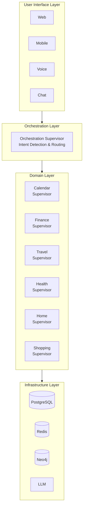
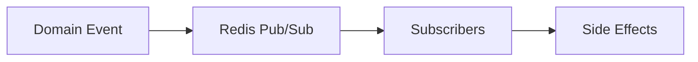
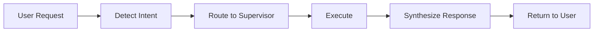
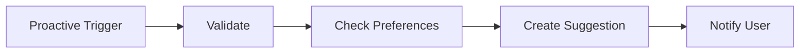
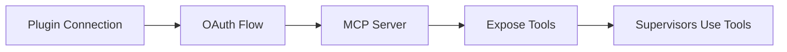
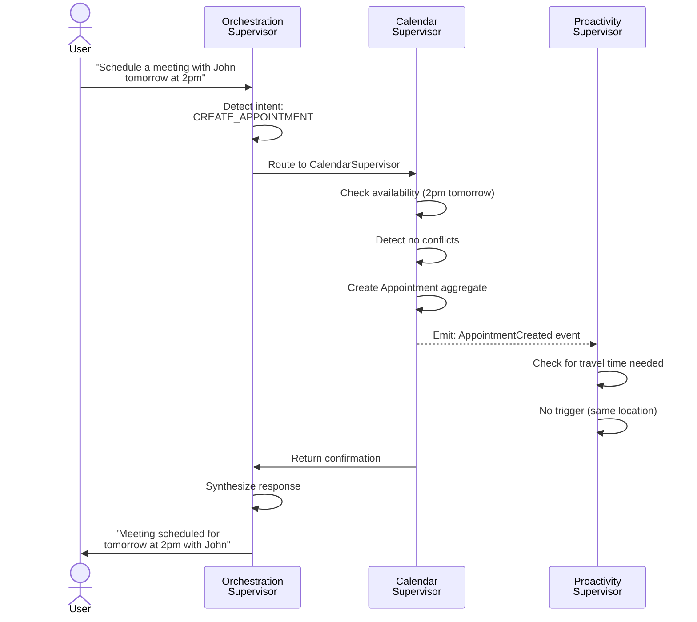
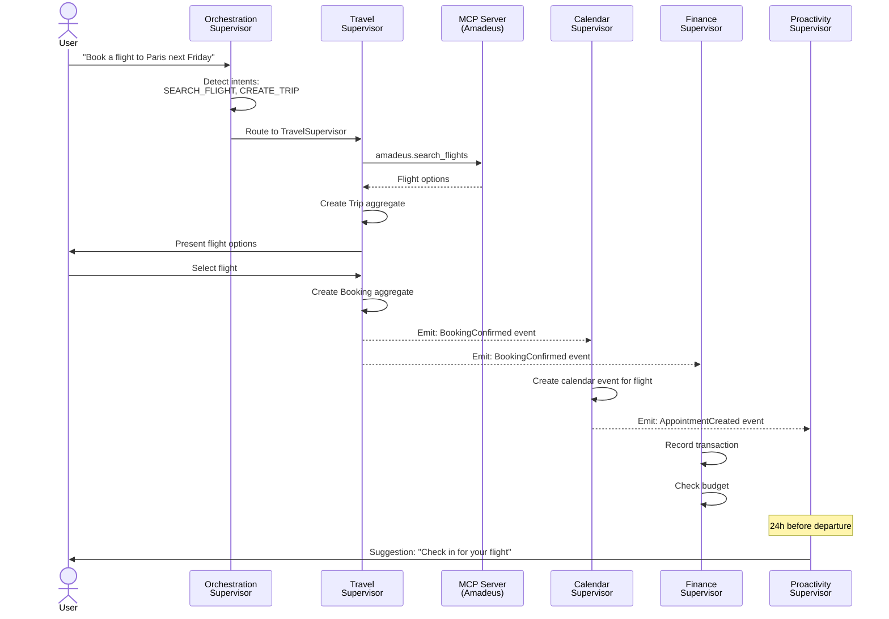

# Fidus Architecture Documentation

**Version:** 1.0
**Date:** 2025-10-27
**Edition:** Community Edition

## Overview

Fidus is a privacy-first AI personal assistant built on a modular, event-driven architecture. This document provides a comprehensive overview of the system architecture, focusing on the open-source Community Edition.

## Table of Contents

1. [System Architecture](#system-architecture)
2. [Core Concepts](#core-concepts)
3. [Technology Stack](#technology-stack)
4. [Architecture Patterns](#architecture-patterns)
5. [Domain-Driven Design](#domain-driven-design)
6. [Component Overview](#component-overview)
7. [Data Flow](#data-flow)
8. [Security & Privacy](#security--privacy)

---

## System Architecture

### High-Level Architecture

Fidus follows a **multi-agent architecture** where specialized agents (Supervisors) handle specific domains of user life. The system is built on three foundational layers:



### Key Architectural Principles

1. **Privacy-First Design**
   - Local-first data storage
   - End-to-end encryption for sensitive data
   - User owns and controls all data
   - Optional cloud sync (Cloud Edition)

2. **Modular & Extensible**
   - Plugin-based architecture
   - Each domain is independent
   - Easy to add new capabilities

3. **Event-Driven Communication**
   - Supervisors communicate via events
   - Loose coupling between components
   - Enables proactive behavior

4. **Agentic AI**
   - LangGraph-powered state machines
   - Each Supervisor is an autonomous agent
   - Tool use via Model Context Protocol (MCP)

---

## Core Concepts

### Terminology

| **Architecture Term** | **DDD Term** | **Explanation** |
|----------------------|--------------|-----------------|
| **Supervisor** | **Bounded Context** | A Supervisor is the **technical implementation** of a Bounded Context. It's a LangGraph agent that implements domain logic, business rules, and integrations. |
| **Domain Supervisor** | **Domain Context** | A Supervisor that implements a specific life domain (Calendar, Finance, Health, etc.). |
| **MCP Tool** | **External Integration** | Model Context Protocol tool that provides access to external services or data sources. |

### Three Types of Communication

Fidus uses three distinct concepts for system communication:

1. **Data Signals** (Pull-based)
   - State data exposed via MCP tools
   - Supervisors query when needed
   - Example: `calendar.free_slots`, `finance.account_balance`

2. **Domain Events** (Push-based)
   - State changes within a domain
   - Published to event bus (Redis)
   - Example: `AppointmentCreated`, `TransactionRecorded`

3. **Proactive Triggers** (Derived)
   - Opportunities detected from data analysis
   - Sent to Proactivity Supervisor
   - Example: `DOUBLE_BOOKING`, `BUDGET_EXCEEDED`

---

## Technology Stack

### Community Edition Stack

| **Component** | **Technology** | **Purpose** |
|--------------|----------------|-------------|
| **Backend** | Python 3.11+ | Core application logic |
| **Agent Framework** | LangGraph | State machine for Supervisors |
| **LLM Integration** | LangChain | LLM abstraction layer |
| **Database** | PostgreSQL 15+ | Primary data store |
| **Graph Database** | Neo4j (optional) | Relationship graphs |
| **Cache/Events** | Redis 7+ | Pub/Sub and caching |
| **API Protocol** | MCP (Model Context Protocol) | Tool integration |
| **API Framework** | FastAPI | REST API endpoints |
| **Authentication** | JWT | Token-based auth |

### Development Stack

| **Component** | **Technology** |
|--------------|----------------|
| **Package Manager** | Poetry |
| **Testing** | pytest, pytest-cov |
| **Code Quality** | ruff, black, mypy |
| **Documentation** | MkDocs |
| **CI/CD** | GitHub Actions |

---

## Architecture Patterns

### 1. Supervisor Pattern

Each Supervisor is implemented as a **LangGraph state machine** with:

**State Definition:**
```python
from typing import TypedDict
from langgraph.graph import StateGraph

class SupervisorState(TypedDict):
    messages: list[dict]
    context: dict
    current_step: str
    result: dict | None
```

**Graph Structure:**
```python
graph = StateGraph(SupervisorState)

# Add nodes
graph.add_node("analyze_request", analyze_request_node)
graph.add_node("execute_action", execute_action_node)
graph.add_node("respond", respond_node)

# Add edges
graph.add_edge("analyze_request", "execute_action")
graph.add_edge("execute_action", "respond")

# Set entry point
graph.set_entry_point("analyze_request")
```

### 2. Event-Driven Architecture

**Event Flow:**


**Event Structure:**
```typescript
interface DomainEvent {
  eventId: string;
  eventType: string;
  aggregateId: string;
  aggregateType: string;
  tenantId: string;
  userId: string;
  timestamp: Date;
  payload: Record<string, any>;
  metadata: {
    causationId: string;
    correlationId: string;
    userId: string;
  };
}
```

### 3. CQRS (Command Query Responsibility Segregation)

- **Commands:** Modify state (via Aggregates)
- **Queries:** Read state (via Read Models)
- Separate write and read concerns
- Optimized for different access patterns

### 4. Repository Pattern

**Interface:**
```python
from abc import ABC, abstractmethod
from typing import Generic, TypeVar, Optional

T = TypeVar('T')

class Repository(ABC, Generic[T]):
    @abstractmethod
    async def save(self, entity: T) -> None:
        """Persist entity"""
        pass

    @abstractmethod
    async def find_by_id(self, id: str) -> Optional[T]:
        """Retrieve entity by ID"""
        pass

    @abstractmethod
    async def delete(self, id: str) -> None:
        """Remove entity"""
        pass
```

---

## Domain-Driven Design

### Bounded Contexts

Fidus organizes functionality into distinct Bounded Contexts:

**Core Domains:**
1. **Orchestration** - Intent detection and multi-domain coordination
2. **Proactivity** - Opportunity detection and suggestion generation

**Domain Contexts:**
1. **Calendar** - Scheduling, appointments, availability
2. **Finance** - Transactions, budgets, accounts
3. **Travel** - Trips, bookings, itineraries
4. **Communication** - Email, messaging, drafts
5. **Health** - Medical appointments, medications, fitness
6. **Home** - Smart home, maintenance, utilities
7. **Shopping** - Lists, price tracking, purchases
8. **Learning** - Courses, progress tracking, study plans

**Supporting Domains:**
1. **Identity & Access** - Authentication, authorization, multi-tenancy
2. **Profile** - User preferences, habits, relationships
3. **Plugin** - External integrations, OAuth, sync
4. **Audit & Compliance** - Logging, GDPR, data retention

### Aggregates

Each domain defines **Aggregates** as consistency boundaries:

**Example: Calendar Domain**
- `Appointment` (Aggregate Root)
- `Availability` (Aggregate Root)

**Example: Finance Domain**
- `Transaction` (Aggregate Root)
- `Budget` (Aggregate Root)
- `Account` (Aggregate Root)

### Value Objects

Shared, immutable value objects ensure consistency:

- `Email`, `PhoneNumber`, `Address`
- `Money`, `Currency`
- `TimeRange`, `Duration`, `RecurrencePattern`
- `Coordinates`, `Timezone`

---

## Component Overview

### Core Components

#### 1. Orchestration Supervisor

**Responsibility:** Route user requests to appropriate domain(s)

**Key Features:**
- Intent detection using LLM
- Multi-domain coordination
- Parallel vs. sequential execution
- Response synthesis

**State Machine:**


#### 2. Domain Supervisors

Each domain has a dedicated Supervisor:

**Calendar Supervisor:**
- Manage appointments
- Find available time slots
- Detect scheduling conflicts
- Sync with external calendars (Google, Outlook)

**Finance Supervisor:**
- Track transactions
- Monitor budgets
- Sync bank accounts (via Plaid/FinAPI)
- Detect unusual spending

#### 3. Proactivity Supervisor

**Responsibility:** Detect opportunities and generate suggestions

**Flow:**


**Example Opportunities:**
- `DOUBLE_BOOKING` - Two overlapping appointments
- `BUDGET_EXCEEDED` - Spending exceeded limit
- `DEPARTURE_SOON` - Flight within 24 hours

#### 4. Plugin System

**MCP Server Integration:**


**Supported Integrations:**
- Google (Calendar, Gmail, Drive)
- Microsoft (Outlook, OneDrive)
- Apple (iCloud Calendar, Health)
- Banking (Plaid, FinAPI)
- Travel (Amadeus, Skyscanner)

---

## Data Flow

### Request Flow Example: "Schedule a meeting"



### Multi-Domain Flow Example: "Book a flight to Paris"



---

## Security & Privacy

### Privacy Principles

1. **Local-First**
   - All data stored locally by default
   - No cloud dependency (Community Edition)
   - User owns and controls data

2. **Encryption**
   - Data at rest: AES-256-GCM
   - Data in transit: TLS 1.3
   - Credentials: bcrypt password hashing (cost 12)

3. **Zero-Knowledge Architecture**
   - Server never sees unencrypted personal data
   - E2E encryption for cloud sync (Cloud Edition)

4. **Minimal Data Collection**
   - No telemetry in Community Edition
   - Opt-in analytics (Cloud Edition)
   - GDPR compliant

### Authentication & Authorization

**Authentication:**
- JWT tokens (access: 15 min, refresh: 7 days)
- bcrypt password hashing
- Optional SSO (Enterprise Edition)

**Authorization:**
- Role-Based Access Control (RBAC)
- Permission inheritance
- Tenant isolation

### Multi-Tenancy

**Tenant Types:**
- INDIVIDUAL - Single user
- FAMILY - Family members
- TEAM - Small teams (Cloud Edition)
- COMPANY - Enterprise (Enterprise Edition)

**Isolation:**
- All data scoped to `tenantId`
- Database-level isolation
- No cross-tenant queries

---

## Architecture Deep Dives

For detailed information on specific architectural topics:

### Core Architecture
1. [Core Principles](00-core-principles.md) - Foundational principles and design philosophy
2. [System Overview](01-overview.md) - High-level architecture and component interaction
3. [Supervisor Architecture](02-supervisor-architecture.md) - LangGraph-based agent implementation
4. [Orchestrator Architecture](03-orchestrator-architecture.md) - Intent detection and routing

### Memory & Context
5. [User Profiling](07-user-profiling.md) - Preference learning and storage
6. [Situational Context](08-situational-context-architecture.md) - Context-aware personalization
7. **[Entity-Relationship Model](10-entity-relationship-model.md) - Entities, relationships, and AI-driven context** ⭐ NEW

### Events & Proactivity
8. [Signals, Events & Proactivity](04-signals-events-proactivity.md) - Event-driven architecture
9. [Registry System](05-registry-system.md) - Service discovery and registration

### Integration & UI
10. [MCP Integration](06-mcp-integration.md) - Model Context Protocol integration
11. [UI Decision Layer](08-ui-decision-layer.md) - User interface architecture

### Security & Compliance
12. [Security Architecture](09-security-architecture.md) - Authentication, encryption, privacy
13. [Compliance Architecture](11-compliance-architecture.md) - GDPR, data retention, audit

### Additional Resources
- [Domain Models](../domain-model/README.md) - Complete DDD documentation
- [API Documentation](../api/README.md) - REST API reference
- [Setup Guide](../guides/setup.md) - Installation instructions
- [Contributing](../../CONTRIBUTING.md) - How to contribute

---

## Community Edition vs. Paid Editions

| **Feature** | **Community** | **Cloud** | **Enterprise** |
|------------|---------------|-----------|----------------|
| **Core Supervisors** | ✅ All | ✅ All | ✅ All |
| **Local Deployment** | ✅ Yes | ✅ Yes | ✅ Yes |
| **Cloud Sync** | ❌ No | ✅ Yes | ✅ Yes |
| **Multi-User** | ❌ No | ✅ Family (5) | ✅ Unlimited |
| **External Integrations** | ⚠️  Limited (3) | ✅ Extended (10) | ✅ Unlimited |
| **Support** | 📖 Community | 💬 Email | 📞 Priority |
| **SSO** | ❌ No | ❌ No | ✅ Yes |
| **SLA** | ❌ No | ⚠️  99% | ✅ 99.9% |
| **Price** | 🆓 Free | 💰 €29/month | 💼 Custom |

---

**Version:** 1.1
**Last Updated:** 2025-11-19
**License:** AGPL-3.0 (See [LICENSE](../../LICENSE))

**Changelog:**
- 2025-11-19: Added Entity-Relationship Model documentation (10-entity-relationship-model.md)
- 2025-10-27: Initial version
