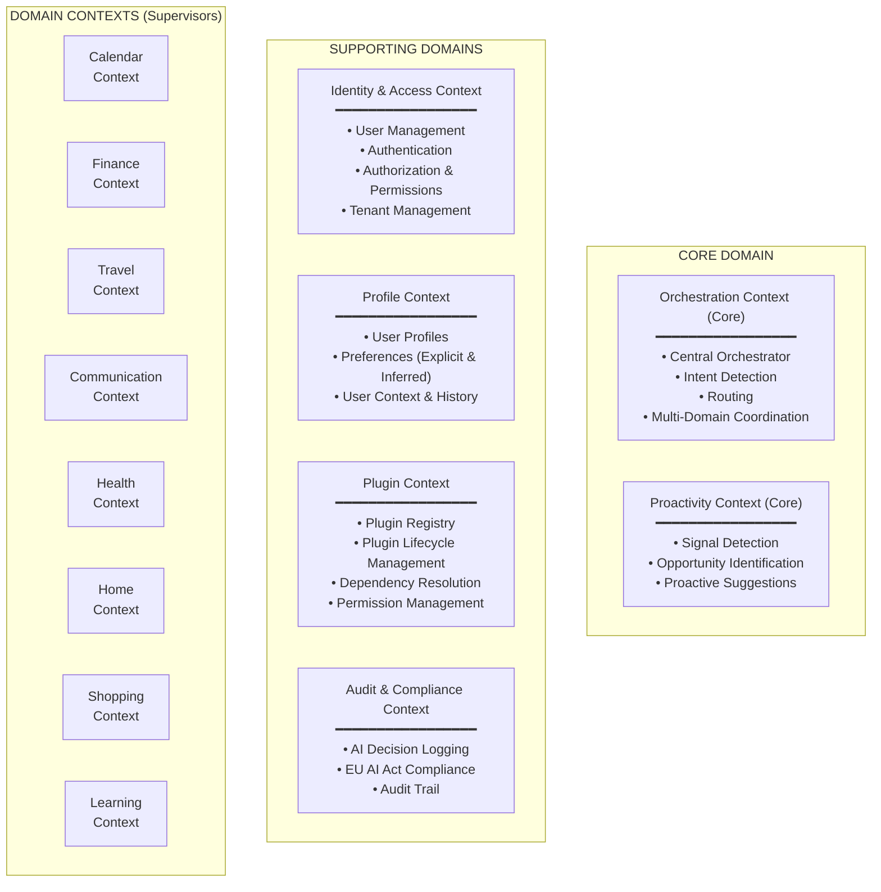
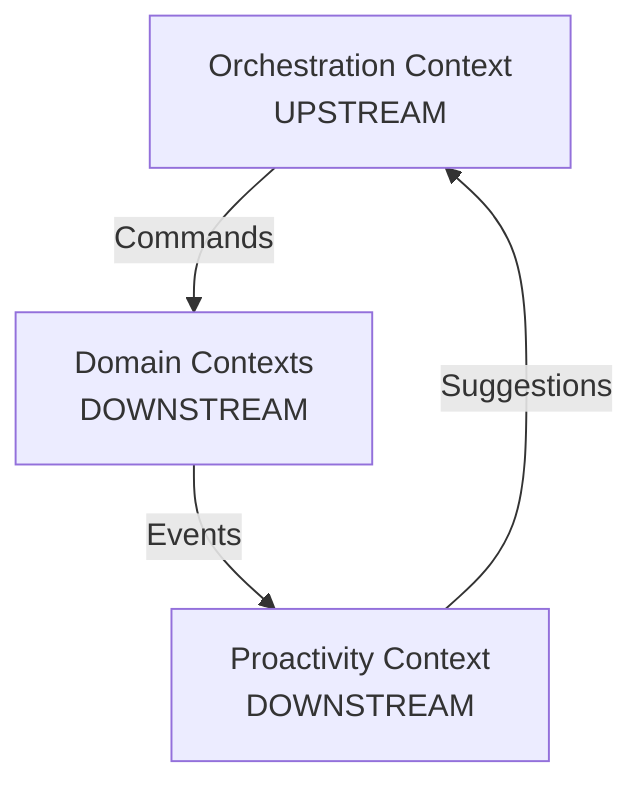
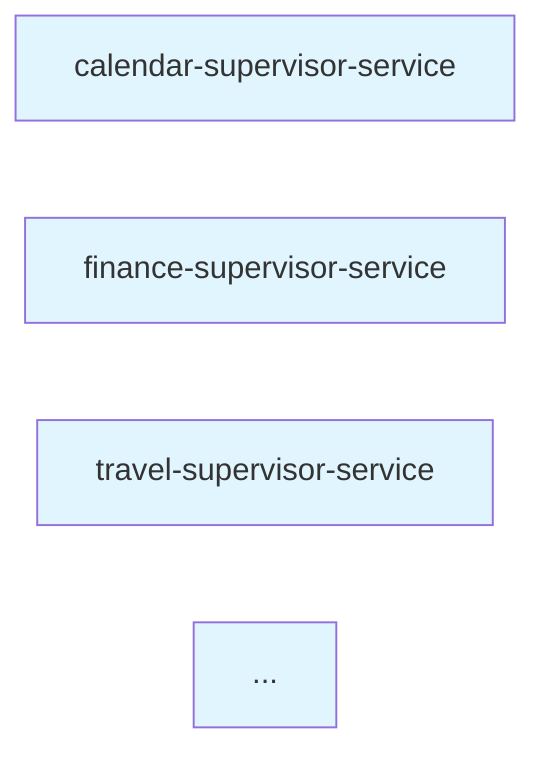

# Bounded Contexts

**Version:** 1.0
**Date:** 2025-10-27
**Status:** Draft

## Overview

This document defines the **Bounded Contexts** for Fidus using Domain-Driven Design principles. A Bounded Context is an explicit boundary within which a domain model is defined and applicable. Each context has its own Ubiquitous Language and can be developed, deployed, and scaled independently.

## Principles

1. **Explicit Boundaries**: Clear boundaries between contexts
2. **Single Responsibility**: Each context solves one specific problem domain
3. **Independent Evolution**: Contexts can evolve independently
4. **Autonomous Teams**: Each context can be owned by a separate team
5. **Communication via Events**: Contexts communicate through Domain Events, not shared databases

---

## Context Overview

Fidus is organized into the following Bounded Contexts:



---

## Core Domain

### 1. Orchestration Context

**Responsibility:** Central coordination of all User interactions and Supervisor routing.

**Key Concepts:**
- Orchestrator
- Intent
- Context
- Routing Decision

**Aggregates:**
- `Orchestration Session`: Represents a single User interaction session

**Domain Events:**
- `IntentDetected`
- `SupervisorRouted`
- `MultiDomainCoordinationStarted`
- `OrchestrationCompleted`

**Boundaries:**
- Owns Intent Detection logic
- Owns Routing logic
- Does NOT own domain-specific logic (that's in Domain Contexts)

**Technology:**
- LangGraph State Machine
- LLM for Intent Detection

**Team Ownership:** Core Team (highest priority)

---

### 2. Proactivity Context

**Responsibility:** Detect opportunities for proactive suggestions based on Signals from other contexts.

**Key Concepts:**
- Signal
- Proactive Suggestion
- Confidence Score
- Opportunity

**Aggregates:**
- `Opportunity`: Represents a detected opportunity for proactive action
- `Suggestion`: A concrete suggestion made to the User

**Domain Events:**
- `SignalDetected`
- `OpportunityIdentified`
- `SuggestionPresented`
- `SuggestionAccepted`
- `SuggestionDismissed`

**Boundaries:**
- Subscribes to Domain Events from all Domain Contexts
- Evaluates Signals based on User Profile
- Does NOT execute actions (suggests to User, who then triggers via Orchestrator)

**Signals Consumed (Examples):**
- `AppointmentCreated` (Calendar) → Check for travel needs
- `BudgetExceeded` (Finance) → Warn User
- `TripBooked` (Travel) → Suggest packing list

**Technology:**
- Background Job Queue (BullMQ)
- LLM for relevance evaluation

**Team Ownership:** Core Team

---

## Supporting Domains

### 3. Identity & Access Context

**Responsibility:** User authentication, authorization, and tenant management.

**Key Concepts:**
- User
- Tenant
- Role
- Permission
- Authentication Token

**Aggregates:**
- `User`: Identity with credentials
- `Tenant`: Organizational unit
- `Permission`: Access rights

**Domain Events:**
- `UserRegistered`
- `UserAuthenticated`
- `UserLoggedOut`
- `TenantCreated`
- `PermissionGranted`
- `PermissionRevoked`

**Boundaries:**
- Owns User authentication (JWT tokens)
- Owns Authorization (permission checks)
- Does NOT own User Preferences (that's Profile Context)

**Technology:**
- PostgreSQL (users, tenants, permissions tables)
- Passport.js + JWT
- Prisma ORM

**Team Ownership:** Platform Team

---

### 4. Profile Context

**Responsibility:** Manage User Profiles, preferences, and contextual information.

**Key Concepts:**
- Profile
- Preference (Explicit & Inferred)
- User Context
- Interaction History

**Aggregates:**
- `UserProfile`: Contains all profile data and preferences

**Domain Events:**
- `ProfileCreated`
- `PreferenceUpdated`
- `PreferenceInferred`
- `ContextChanged` (e.g., location changed)

**Boundaries:**
- Owns User Preferences (both explicit and inferred)
- Owns User Context (current location, time, situation)
- Does NOT own authentication (that's Identity Context)

**Technology:**
- Neo4j (graph for preference relationships)
- Qdrant (vector embeddings for semantic search)
- PostgreSQL (structured profile data)

**Team Ownership:** Platform Team

---

### 5. Plugin Context

**Responsibility:** Manage the Plugin ecosystem - discovery, installation, lifecycle.

**Key Concepts:**
- Plugin
- Plugin Registry
- Dependency
- Plugin Lifecycle (Discovered, Installed, Activated, Deactivated)

**Aggregates:**
- `Plugin`: Represents a Plugin with its manifest and dependencies
- `PluginInstallation`: Represents an installed Plugin for a Tenant

**Domain Events:**
- `PluginDiscovered`
- `PluginInstalled`
- `PluginActivated`
- `PluginDeactivated`
- `PluginUpdated`
- `DependencyResolved`

**Boundaries:**
- Owns Plugin Registry
- Owns Plugin Lifecycle
- Does NOT own the actual Supervisor/Tool logic (that's in Domain Contexts)

**Technology:**
- PostgreSQL (plugin metadata)
- File Storage (plugin packages)
- Prisma ORM

**Team Ownership:** Platform Team

---

### 6. Audit & Compliance Context

**Responsibility:** Log all AI decisions for EU AI Act compliance and debugging.

**Key Concepts:**
- Audit Log
- AI Decision Log
- Reasoning
- Compliance Record

**Aggregates:**
- `AIDecisionLog`: Immutable record of an AI decision

**Domain Events:**
- `DecisionLogged`
- `AuditRequested`
- `ComplianceReportGenerated`

**Boundaries:**
- Subscribes to ALL Domain Events
- Logs all AI decisions with reasoning
- Does NOT make decisions (only records them)

**Technology:**
- PostgreSQL (append-only audit log table)
- Retention: Minimum 6 months (EU AI Act)
- Prisma ORM

**Team Ownership:** Platform Team

---

## Domain Contexts (Supervisors)

Each Domain Context has a Supervisor that handles domain-specific logic.

### 7. Calendar Context

**Responsibility:** Manage appointments, availability, and scheduling.

**Key Concepts:**
- Appointment
- Availability
- Reminder
- Calendar
- Time Slot

**Aggregates:**
- `Appointment`: A scheduled event with participants, location, time

**Domain Events:**
- `AppointmentCreated`
- `AppointmentUpdated`
- `AppointmentCancelled`
- `AppointmentStartsSoon` (15 min before)
- `ConflictDetected`

**Signals Emitted:**
- Early morning appointment + no alarm → `MISSING_ALARM`
- Appointment in different city → `TRAVEL_NEEDED`

**MCP Tools:**
- `createAppointment`
- `updateAppointment`
- `cancelAppointment`
- `checkAvailability`
- `findTimeSlot`

**Technology:**
- PostgreSQL (appointments table)
- Prisma ORM

**Team Ownership:** Domain Team A

---

### 8. Finance Context

**Responsibility:** Manage transactions, budgets, and financial tracking.

**Key Concepts:**
- Transaction
- Budget
- Category
- Account
- Money (Value Object)

**Aggregates:**
- `Transaction`: A money movement
- `Budget`: Spending limit for a category

**Domain Events:**
- `TransactionRecorded`
- `TransactionCategorized`
- `BudgetCreated`
- `BudgetExceeded`
- `BudgetNearlyExceeded` (80% threshold)

**Signals Emitted:**
- Budget exceeded → `BUDGET_WARNING`
- Unusual spending pattern → `ANOMALY_DETECTED`
- Recurring payment due + low balance → `INSUFFICIENT_FUNDS_WARNING`

**MCP Tools:**
- `recordTransaction`
- `categorizeTransaction`
- `createBudget`
- `getSpendingReport`

**Technology:**
- PostgreSQL (transactions, budgets tables)
- Prisma ORM

**Team Ownership:** Domain Team A

---

### 9. Travel Context

**Responsibility:** Plan and manage trips, bookings, and itineraries.

**Key Concepts:**
- Trip
- Booking (Flight, Hotel, Car)
- Itinerary
- Destination

**Aggregates:**
- `Trip`: A complete travel plan with all bookings

**Domain Events:**
- `TripPlanned`
- `TripBooked`
- `BookingConfirmed`
- `TripStarted`
- `TripCompleted`

**Signals Emitted:**
- Flight booked + no hotel → `MISSING_ACCOMMODATION`
- Trip starting soon + no packing list → `PACKING_REMINDER`

**MCP Tools:**
- `createTrip`
- `addBooking`
- `generateItinerary`
- `findFlights`
- `findHotels`

**Technology:**
- PostgreSQL (trips, bookings tables)
- Prisma ORM

**Team Ownership:** Domain Team B

---

### 10. Communication Context

**Responsibility:** Manage messages, contacts, and conversations.

**Key Concepts:**
- Message
- Contact
- Conversation
- Channel (Email, SMS, Chat)

**Aggregates:**
- `Message`: A single message
- `Conversation`: Thread of related messages
- `Contact`: Person or organization

**Domain Events:**
- `MessageSent`
- `MessageReceived`
- `MessageRead`
- `ContactAdded`
- `ConversationStarted`

**Signals Emitted:**
- Unread important message → `URGENT_MESSAGE`
- Follow-up needed → `FOLLOW_UP_REMINDER`

**MCP Tools:**
- `sendMessage`
- `readMessages`
- `addContact`
- `searchContacts`

**Technology:**
- PostgreSQL (messages, contacts tables)
- Prisma ORM

**Team Ownership:** Domain Team B

---

### 11. Health Context

**Responsibility:** Track health activities and vitals.

**Key Concepts:**
- Activity (Physical Exercise)
- Vital (Health Measurement)
- Goal
- Workout

**Aggregates:**
- `HealthActivity`: A recorded exercise
- `Vital`: A health measurement

**Domain Events:**
- `ActivityRecorded`
- `VitalRecorded`
- `GoalAchieved`
- `GoalMissed`

**Signals Emitted:**
- No activity for 7 days → `INACTIVE_WARNING`
- Goal progress → `GOAL_PROGRESS`

**MCP Tools:**
- `recordActivity`
- `recordVital`
- `setGoal`
- `getHealthSummary`

**Technology:**
- PostgreSQL (activities, vitals tables)
- Prisma ORM

**Team Ownership:** Domain Team C

---

### 12. Home Context

**Responsibility:** Control smart home devices and automations.

**Key Concepts:**
- Device (Smart Device)
- Automation (Rule)
- Room
- Scene

**Aggregates:**
- `Device`: A smart home device
- `Automation`: A rule-based automation

**Domain Events:**
- `DeviceStateChanged`
- `AutomationTriggered`
- `SceneActivated`

**Signals Emitted:**
- Leaving home + lights on → `LIGHTS_ON_WARNING`
- Arriving home → `WELCOME_HOME`

**MCP Tools:**
- `controlDevice`
- `createAutomation`
- `activateScene`
- `getDeviceStatus`

**Technology:**
- PostgreSQL (devices, automations tables)
- Prisma ORM

**Team Ownership:** Domain Team C

---

### 13. Shopping Context

**Responsibility:** Manage shopping lists and product recommendations.

**Key Concepts:**
- Shopping List
- Product
- Purchase
- Recommendation

**Aggregates:**
- `ShoppingList`: A list of items to buy

**Domain Events:**
- `ListCreated`
- `ItemAdded`
- `ItemPurchased`
- `ListCompleted`

**Signals Emitted:**
- Low stock item → `RESTOCK_REMINDER`
- Good deal on wishlist item → `DEAL_ALERT`

**MCP Tools:**
- `createList`
- `addItem`
- `markPurchased`
- `findProducts`

**Technology:**
- PostgreSQL (lists, items tables)
- Prisma ORM

**Team Ownership:** Domain Team C

---

### 14. Learning Context

**Responsibility:** Track courses, learning goals, and progress.

**Key Concepts:**
- Course
- Learning Goal
- Progress
- Skill

**Aggregates:**
- `Course`: Educational content
- `LearningGoal`: A skill to learn

**Domain Events:**
- `CourseStarted`
- `CourseCompleted`
- `GoalSet`
- `ProgressMade`

**Signals Emitted:**
- Course deadline approaching → `DEADLINE_REMINDER`
- No progress for 14 days → `LEARNING_STALLED`

**MCP Tools:**
- `startCourse`
- `trackProgress`
- `setGoal`
- `recommendCourse`

**Technology:**
- PostgreSQL (courses, goals tables)
- Prisma ORM

**Team Ownership:** Domain Team C

---

## Context Relationships

### Upstream/Downstream Relationships



### Anti-Corruption Layers (ACL)

**External MCP Servers:**
- Domain Contexts integrate external MCP Servers via ACL
- ACL translates external models to domain models
- Protects domain from external changes

**Example:**
```typescript
// ACL for Google Calendar MCP Server
class GoogleCalendarACL {
  // Translate Google Calendar Event → Appointment
  toAppointment(googleEvent: GoogleCalendarEvent): Appointment {
    return new Appointment({
      title: googleEvent.summary,
      startTime: googleEvent.start.dateTime,
      endTime: googleEvent.end.dateTime,
      // ... map fields
    });
  }

  // Translate Appointment → Google Calendar Event
  toGoogleEvent(appointment: Appointment): GoogleCalendarEvent {
    return {
      summary: appointment.title,
      start: { dateTime: appointment.startTime },
      end: { dateTime: appointment.endTime },
      // ... map fields
    };
  }
}
```

---

## Context Independence

### Separate Databases (Logical)

Each Bounded Context has its own logical database schema, even if physically stored in the same PostgreSQL instance.

**Schema Naming Convention:**
- `calendar_*` tables (Calendar Context)
- `finance_*` tables (Finance Context)
- `travel_*` tables (Travel Context)
- etc.

**Data Isolation:**
- No foreign keys across contexts
- Communication only via Domain Events

### Separate Deployment Units

Each Domain Context can be deployed independently:



**Benefits:**
- Independent scaling
- Independent updates
- Fault isolation

---

## Evolution Strategy

### Adding New Contexts

**Process:**
1. Identify new domain need (e.g., "Fitness Context")
2. Define Ubiquitous Language for new context
3. Define Aggregates, Domain Events
4. Implement Supervisor Plugin
5. Integrate with Orchestrator
6. Subscribe to relevant events in Proactivity Context

**Example: Fitness Context (Future)**
- Responsibility: Workout plans, nutrition tracking
- Aggregates: `Workout`, `Meal`, `NutritionGoal`
- Events: `WorkoutCompleted`, `MealLogged`

### Splitting Contexts

If a context becomes too large, split it:

**Example: Split Communication Context**
- Before: `Communication Context` (Email + Chat + SMS)
- After:
  - `Email Context`
  - `Messaging Context` (Chat + SMS)

**Migration:**
1. Create new contexts
2. Migrate data
3. Update event subscriptions
4. Decommission old context

### Merging Contexts

If contexts are too small or tightly coupled, merge them:

**Criteria for merging:**
- Heavy coupling (many events between contexts)
- Shared Aggregates
- Always deployed together

---

## Context Map Summary

| Context | Type | Upstream/Downstream | Dependencies |
|---------|------|---------------------|--------------|
| Orchestration | Core | Upstream | None (coordinates all) |
| Proactivity | Core | Downstream | Subscribes to all Domain Contexts |
| Identity & Access | Supporting | Upstream | None (provides auth to all) |
| Profile | Supporting | Upstream | Identity Context |
| Plugin | Supporting | Upstream | None (provides plugins to all) |
| Audit & Compliance | Supporting | Downstream | Subscribes to all contexts |
| Calendar | Domain | Downstream | Identity, Profile |
| Finance | Domain | Downstream | Identity, Profile |
| Travel | Domain | Downstream | Identity, Profile, Calendar |
| Communication | Domain | Downstream | Identity, Profile |
| Health | Domain | Downstream | Identity, Profile |
| Home | Domain | Downstream | Identity, Profile |
| Shopping | Domain | Downstream | Identity, Profile |
| Learning | Domain | Downstream | Identity, Profile |

---

**End of Document**
