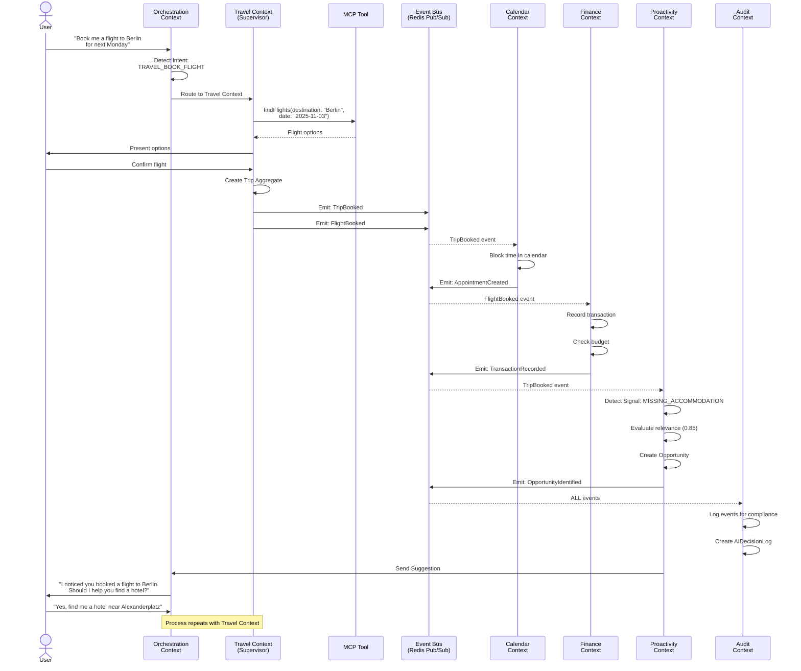

# Context Map

**Version:** 1.0
**Date:** 2025-10-27
**Status:** Draft

## Overview

This document provides the **Context Map** for Fidus - a visual and textual representation of the relationships between Bounded Contexts. The Context Map shows how contexts interact, their integration patterns, and team responsibilities.

## Strategic Design Patterns

We use the following DDD patterns to describe context relationships:

- **Partnership (P):** Two contexts work together, mutual dependency
- **Shared Kernel (SK):** Shared code/model between contexts (use sparingly!)
- **Customer/Supplier (C/S):** Downstream depends on upstream
- **Conformist (CF):** Downstream conforms to upstream's model
- **Anti-Corruption Layer (ACL):** Downstream protects itself from upstream changes
- **Open Host Service (OHS):** Upstream provides well-defined protocol (e.g., REST API)
- **Published Language (PL):** Standardized communication format (e.g., Domain Events)

---

## High-Level Context Map

```mermaid
graph TB
    subgraph FidusSystem["FIDUS SYSTEM"]
        Orch["Orchestration Context (CORE)<br/>[OHS + PL]"]

        subgraph DomainLayer["Domain Layer"]
            Calendar["Calendar Context<br/>[C/S]"]
            Finance["Finance Context<br/>[C/S]"]
            Travel["Travel Context<br/>[C/S]"]
        end

        Proact["Proactivity Context (CORE)<br/>[CF]<br/>(Subscribes to all)"]

        subgraph SupportingContexts["SUPPORTING CONTEXTS"]
            Identity["Identity & Access<br/>Context [OHS]"]
            Profile["Profile Context<br/>[OHS]"]
            Plugin["Plugin Context<br/>[OHS]"]
            Audit["Audit & Compliance<br/>Context [CF]<br/>(Subscribes to all)"]
        end

        Orch -->|Commands (Sync)| DomainLayer
        DomainLayer -->|Events (PL) (Async)| Proact

        Identity -.->|Used by all<br/>Customer/Supplier| DomainLayer
        Profile -.->|Used by all<br/>Customer/Supplier| DomainLayer
        Plugin -.->|Used by all<br/>Customer/Supplier| DomainLayer

        DomainLayer -.->|Events| Audit
    end

    subgraph ExternalSystems["EXTERNAL SYSTEMS"]
        Google["Google Calendar<br/>[ACL]"]
        Outlook["Outlook Calendar<br/>[ACL]"]
        Stripe["Stripe Payment<br/>[ACL]"]

        Google -->|Via MCP Protocol| Calendar
        Outlook -->|Via MCP Protocol| Calendar
        Stripe -->|Via MCP Protocol| Finance
    end
```

---

## Detailed Context Relationships

### 1. Orchestration Context (CORE)

**Pattern:** Open Host Service (OHS) + Published Language (PL)

**Upstream for:**
- All Domain Contexts (Calendar, Finance, Travel, etc.)

**Integration:**
- **Inbound:** HTTP/WebSocket requests from User
- **Outbound:** Commands to Domain Contexts (synchronous)
- **Inbound:** Domain Events from Domain Contexts (asynchronous)

**Published Interface:**
```typescript
interface OrchestrationAPI {
  // Inbound: User request
  processUserRequest(request: UserRequest): Promise<AgentResponse>;

  // Outbound: Command to Supervisor
  executeCommand(supervisorId: string, command: Command): Promise<Result>;

  // Inbound: Event subscription
  onDomainEvent(event: DomainEvent): void;
}
```

**Relationship Type:**
- → Domain Contexts: **Customer/Supplier** (Orchestration is Supplier)
- ← Proactivity Context: **Supplier** (provides suggestions back)

**Team:** Core Team

---

### 2. Proactivity Context (CORE)

**Pattern:** Conformist (CF)

**Downstream for:**
- All Domain Contexts (subscribes to all events)

**Integration:**
- **Inbound:** Domain Events from all contexts (asynchronous)
- **Outbound:** Proactive Suggestions to Orchestration Context

**Event Subscriptions:**
```typescript
// Subscribes to events like:
- AppointmentCreated (Calendar Context)
- BudgetExceeded (Finance Context)
- TripBooked (Travel Context)
- MessageReceived (Communication Context)
// ... etc
```

**Relationship Type:**
- ← Domain Contexts: **Conformist** (accepts events as-is)
- → Orchestration Context: **Supplier** (provides suggestions)

**Team:** Core Team

---

### 3. Identity & Access Context (SUPPORTING)

**Pattern:** Open Host Service (OHS)

**Upstream for:**
- All contexts (provides authentication/authorization)

**Integration:**
- **API:** REST API for authentication
- **JWT Tokens:** Stateless authentication

**Published Interface:**
```typescript
interface IdentityAPI {
  authenticate(credentials: Credentials): Promise<AuthToken>;
  validateToken(token: string): Promise<User>;
  checkPermission(userId: string, permission: string): Promise<boolean>;
  getTenant(tenantId: string): Promise<Tenant>;
}
```

**Relationship Type:**
- → All Contexts: **Customer/Supplier** (Identity is Supplier)

**Team:** Platform Team

---

### 4. Profile Context (SUPPORTING)

**Pattern:** Open Host Service (OHS)

**Upstream for:**
- All Domain Contexts (provides user context)

**Integration:**
- **API:** REST API + GraphQL (for complex queries)

**Published Interface:**
```typescript
interface ProfileAPI {
  getProfile(userId: string): Promise<UserProfile>;
  getPreferences(userId: string, category: string): Promise<Preference[]>;
  updatePreference(userId: string, preference: Preference): Promise<void>;
  inferPreference(userId: string, interaction: Interaction): Promise<void>;

  // Context retrieval
  getUserContext(userId: string): Promise<Context>;
}
```

**Relationship Type:**
- → All Domain Contexts: **Customer/Supplier** (Profile is Supplier)
- ← Domain Contexts: **Partnership** (Domain Contexts update inferred preferences)

**Team:** Platform Team

---

### 5. Plugin Context (SUPPORTING)

**Pattern:** Open Host Service (OHS)

**Upstream for:**
- Domain Contexts (provides plugin lifecycle)

**Integration:**
- **API:** REST API for plugin management

**Published Interface:**
```typescript
interface PluginAPI {
  discoverPlugins(): Promise<Plugin[]>;
  installPlugin(pluginId: string, tenantId: string): Promise<InstallationResult>;
  activatePlugin(pluginId: string, tenantId: string): Promise<void>;
  deactivatePlugin(pluginId: string, tenantId: string): Promise<void>;

  // For Supervisors to register themselves
  registerSupervisor(supervisorManifest: SupervisorManifest): Promise<void>;
}
```

**Relationship Type:**
- → Domain Contexts: **Customer/Supplier** (Plugin is Supplier)

**Team:** Platform Team

---

### 6. Audit & Compliance Context (SUPPORTING)

**Pattern:** Conformist (CF)

**Downstream for:**
- All contexts (subscribes to all events for audit trail)

**Integration:**
- **Inbound:** Domain Events from all contexts (asynchronous)
- **Outbound:** Read-only API for audit queries

**Event Subscriptions:**
```typescript
// Subscribes to ALL events for audit trail
- IntentDetected
- AppointmentCreated
- TransactionRecorded
- etc.
```

**Published Interface (Read-Only):**
```typescript
interface AuditAPI {
  getAuditLogs(filters: AuditFilters): Promise<AuditLog[]>;
  getDecisionLog(decisionId: string): Promise<AIDecisionLog>;
  generateComplianceReport(timeRange: TimeRange): Promise<Report>;
}
```

**Relationship Type:**
- ← All Contexts: **Conformist** (accepts all events)

**Team:** Platform Team

---

## Domain Context Relationships

### 7. Calendar Context → Travel Context

**Pattern:** Published Language (Domain Events)

**Integration:**
```typescript
// Calendar Context emits:
AppointmentCreated {
  appointmentId: string;
  location: string; // "Berlin"
  startTime: Date;
}

// Travel Context subscribes:
// If location != user's home city → Signal: TRAVEL_NEEDED
```

**Relationship Type:** **Loose Coupling** via Events

---

### 8. Finance Context → Shopping Context

**Pattern:** Published Language (Domain Events)

**Integration:**
```typescript
// Finance Context emits:
TransactionRecorded {
  transactionId: string;
  category: 'groceries';
  merchant: 'Whole Foods';
}

// Shopping Context subscribes:
// Learns shopping patterns for recommendations
```

**Relationship Type:** **Loose Coupling** via Events

---

### 9. Travel Context → Calendar Context

**Pattern:** Published Language (Domain Events)

**Integration:**
```typescript
// Travel Context emits:
TripBooked {
  tripId: string;
  outboundFlight: { departureTime: Date };
  inboundFlight: { arrivalTime: Date };
}

// Calendar Context subscribes:
// Blocks time in calendar for trip
```

**Relationship Type:** **Loose Coupling** via Events

---

### 10. All Domain Contexts → Profile Context

**Pattern:** Partnership (P)

**Integration:**
```typescript
// Domain Contexts send interaction data to Profile Context
// for preference inference

await profileAPI.inferPreference(userId, {
  type: 'restaurant',
  value: 'Italian',
  confidence: 0.8,
  source: 'calendar_appointment_location'
});
```

**Relationship Type:** **Partnership** (bidirectional collaboration)

---

## External System Integration

### Pattern: Anti-Corruption Layer (ACL)

All external systems are integrated via **Anti-Corruption Layers** to protect our domain model from external changes.

### Example: Google Calendar Integration

```typescript
// External MCP Server provides Google Calendar API
// ACL translates between Google's model and our domain model

class GoogleCalendarACL {
  constructor(
    private mcpClient: MCPClient,
    private calendarRepository: CalendarRepository
  ) {}

  // Translate Google Event → Appointment (our domain)
  async importEvent(googleEventId: string): Promise<Appointment> {
    const googleEvent = await this.mcpClient.callTool('getEvent', {
      eventId: googleEventId
    });

    // Translation layer - protects our domain from Google's model
    return new Appointment({
      id: generateId(), // Our own ID
      title: googleEvent.summary,
      startTime: new Date(googleEvent.start.dateTime),
      endTime: new Date(googleEvent.end.dateTime),
      participants: googleEvent.attendees?.map(a => a.email) || [],
      location: googleEvent.location,
      externalId: googleEventId, // For sync
      externalProvider: 'google'
    });
  }

  // Translate Appointment → Google Event
  async exportEvent(appointment: Appointment): Promise<void> {
    const googleEvent = {
      summary: appointment.title,
      start: { dateTime: appointment.startTime.toISOString() },
      end: { dateTime: appointment.endTime.toISOString() },
      attendees: appointment.participants.map(email => ({ email })),
      location: appointment.location
    };

    await this.mcpClient.callTool('createEvent', googleEvent);
  }
}
```

**Benefits of ACL:**
- **Protection:** Our domain model doesn't depend on Google's model
- **Flexibility:** Can switch to Outlook Calendar without changing domain logic
- **Stability:** External API changes don't break our core domain

---

## Integration Patterns Summary

| From Context | To Context | Pattern | Communication | Team Coordination |
|--------------|------------|---------|---------------|-------------------|
| User | Orchestration | - | HTTP/WebSocket | - |
| Orchestration | Domain Contexts | C/S | Commands (Sync) | Core → Domain Teams |
| Domain Contexts | Orchestration | S/C | Events (Async) | Domain Teams → Core |
| Domain Contexts | Proactivity | PL | Events (Async) | Domain Teams → Core |
| Proactivity | Orchestration | S/C | Suggestions | Core Team |
| Identity | All Contexts | OHS | REST API | Platform → All |
| Profile | All Contexts | OHS + P | REST/GraphQL | Platform ↔ All |
| Plugin | Domain Contexts | OHS | REST API | Platform → Domain Teams |
| All Contexts | Audit | PL | Events (Async) | All → Platform |
| Calendar | Travel | PL | Events | Team A ↔ Team B |
| Travel | Calendar | PL | Events | Team B ↔ Team A |
| Finance | Shopping | PL | Events | Team A ↔ Team C |
| External (Google) | Calendar | ACL | MCP Protocol | External → Team A |
| External (Stripe) | Finance | ACL | MCP Protocol | External → Team A |

---

## Event Flow Example

**Scenario:** User books a flight for a business trip



---

## Team Ownership & Conway's Law

> "Organizations which design systems are constrained to produce designs
> which are copies of the communication structures of these organizations."
> — Conway's Law

**Our Context Ownership Structure:**

As an open-source project with contributions from the community, context ownership is fluid and collaborative. Contributors can work on any context based on their interests and expertise.

### Core Contexts
- **Orchestration Context** - Request routing and coordination
- **Proactivity Context** - Opportunity detection and notifications

### Platform Contexts
- **Identity & Access** - Authentication and authorization
- **Profile** - User preferences and implicit learning
- **Plugin** - Extension system and marketplace
- **Audit & Compliance** - Logging and GDPR compliance

### Domain Contexts - Life Management
- **Calendar** - Appointments and scheduling
- **Finance** - Budget tracking and transactions

### Domain Contexts - Travel & Communication
- **Travel** - Trip planning and coordination
- **Communication** - Email and message management

### Domain Contexts - Lifestyle
- **Health** - Wellness and medical tracking
- **Home** - Smart home and maintenance
- **Shopping** - Shopping lists and price tracking
- **Learning** - Courses and study management

**Collaboration Model:**
- All contexts are independently deployable
- Communication happens via domain events (async)
- Contributors can work across multiple contexts
- AI-assisted development accelerates contribution velocity

---

## Evolution & Migration

### Adding New Context

**Example: Add "Fitness Context"**

1. **Define Bounded Context** (new team or extend existing)
2. **Define Ubiquitous Language** (Workout, Exercise, NutritionPlan)
3. **Register with Orchestration Context** (add routing for fitness intents)
4. **Subscribe to relevant events** (e.g., HealthActivity from Health Context)
5. **Emit domain events** (e.g., WorkoutCompleted)
6. **Deploy independently**

**No changes required in other contexts!** (Loose coupling via events)

---

### Removing Context

**Example: Deprecate "Shopping Context"**

1. **Identify dependencies** (which contexts subscribe to Shopping events?)
2. **Notify dependent teams**
3. **Migration period** (6 months)
4. **Stop emitting events**
5. **Archive data**
6. **Decommission service**

---

## Anti-Patterns to Avoid

### ❌ Shared Database

**Don't:**
```typescript
// Calendar Context directly queries Finance database
const transactions = await financeDb.query(
  'SELECT * FROM finance_transactions WHERE user_id = ?'
);
```

**Do:**
```typescript
// Calendar Context subscribes to Finance events
eventBus.subscribe('TransactionRecorded', (event) => {
  // React to finance events if needed
});

// Or call Finance API
const transactions = await financeAPI.getTransactions(userId);
```

---

### ❌ Bypassing Context Boundaries

**Don't:**
```typescript
// Orchestrator directly modifying Calendar aggregate
calendar.appointments.push(newAppointment);
await db.save(calendar);
```

**Do:**
```typescript
// Orchestrator sends command to Calendar Context
await calendarAPI.createAppointment({
  userId,
  title,
  startTime,
  endTime
});
```

---

### ❌ Tight Coupling via Shared Code

**Don't:**
```typescript
// Shared domain model across contexts
import { Appointment } from '@shared/models';

// Now all contexts depend on same Appointment model!
```

**Do:**
```typescript
// Each context has its own model
// Calendar Context
class Appointment { ... }

// Travel Context
class TripAppointment { ... } // Different model!

// Translation happens at boundary (ACL)
```

---

## Conclusion

This Context Map provides a clear understanding of:
1. **Boundaries:** Where each context starts/ends
2. **Relationships:** How contexts interact
3. **Patterns:** Which integration patterns we use
4. **Teams:** Who owns what
5. **Evolution:** How to grow/change the system

**Key Principles:**
- ✅ Loose coupling via Domain Events
- ✅ High cohesion within contexts
- ✅ Clear boundaries
- ✅ Independent deployment
- ✅ Team autonomy

---

**End of Document**
