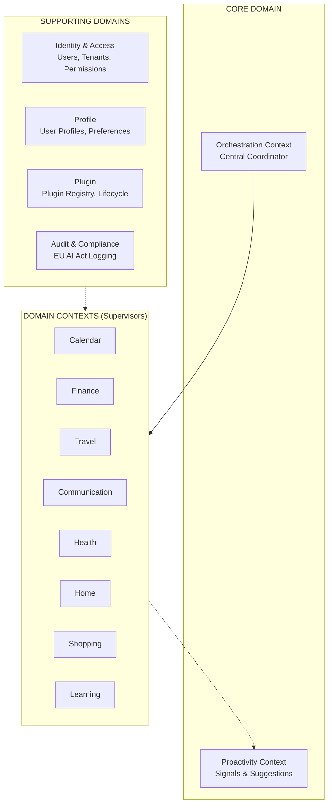
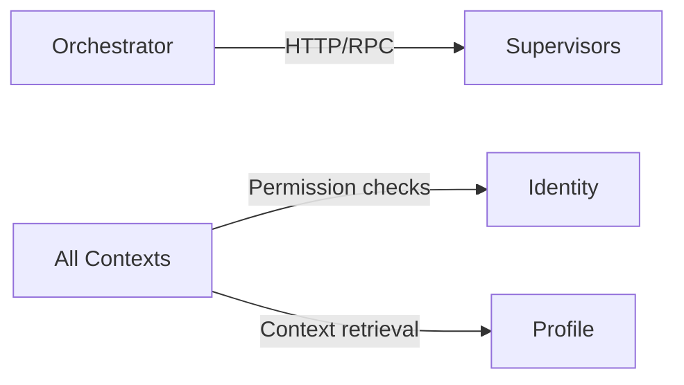
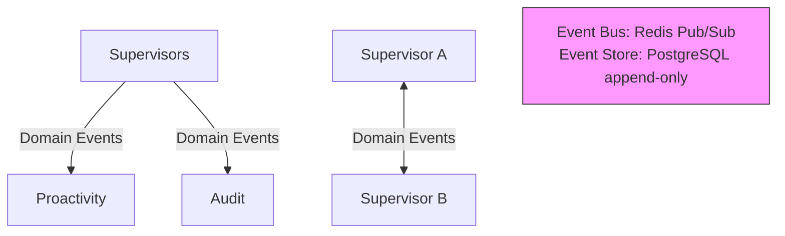

# Domain Model (DDD)

**Version:** 1.0
**Date:** 2025-10-27
**Status:** Draft

## Overview

This directory contains the **Domain-Driven Design (DDD)** documentation for Fidus. It defines the domain model that bridges business requirements and technical implementation.

## Key DDD Concepts

### Bounded Context vs Supervisor

This documentation uses Domain-Driven Design terminology that maps to architectural components:

| **DDD Term** | **Architecture Term** | **Explanation** |
|--------------|----------------------|-----------------|
| **Bounded Context** | **Supervisor** | A Bounded Context is a **domain boundary** with its own model and language. In Fidus, each Bounded Context is implemented as a **Supervisor** (LangGraph agent). |
| **Domain Context** | **Domain Supervisor** | A Bounded Context for a specific life domain (Calendar, Finance, Health, etc.). |
| **Core Domain** | **Core Supervisor** | A Bounded Context implementing core business logic (Orchestration, Proactivity). |
| **Supporting Domain** | **Supporting Supervisor** | A Bounded Context for infrastructure concerns (Identity, Profile, Plugin, Audit). |

**Example Mapping:**
- **"Calendar Context"** (DDD concept) → **"CalendarSupervisor"** (implementation)
- **"Proactivity Context"** (DDD concept) → **"ProactivityEngine"** (implementation)

**Why This Matters:**
- **This documentation** defines **WHAT** the system does (domain logic, business rules, events)
- **Architecture docs** (`/docs/03-architecture/`) define **HOW** it's implemented (LangGraph, MCP, databases)

**Cross-References:**
- For implementation details → see `/docs/03-architecture/`
- For domain design → continue reading this domain model documentation

---

## Purpose

The domain model serves as:
1. **Shared Understanding:** Common language between business and technical teams
2. **Design Blueprint:** Foundation for solution architecture
3. **Evolution Guide:** How to grow and change the system
4. **Communication Tool:** Clear boundaries and relationships

## Document Structure

### Core DDD Concepts

1. **[01-ubiquitous-language.md](01-ubiquitous-language.md)**
   - Defines the shared vocabulary used throughout the system
   - Every term in code must match a term here
   - Includes domain-specific terminology for all contexts
   - **Read this first!**

2. **[02-bounded-contexts.md](02-bounded-contexts.md)**
   - Defines the boundaries of each domain
   - 14 Bounded Contexts (3 Core, 4 Supporting, 8 Domain)
   - Responsibilities and ownership for each context

3. **[03-context-map.md](03-context-map.md)**
   - Relationships between contexts
   - Integration patterns (Customer/Supplier, Published Language, etc.)
   - Team ownership and communication patterns

### Implementation Details

4. **[10-domain-events.md](10-domain-events.md)**
   - All domain events across all contexts
   - Event structure and versioning
   - Event sourcing patterns
   - Pub/Sub communication between contexts

5. **[11-aggregates-entities.md](11-aggregates-entities.md)**
   - Aggregate roots for each bounded context
   - Entities and Value Objects
   - Invariants and business rules
   - Example implementations in TypeScript

### Domain-Specific Documents

6. **[04-calendar-domain.md](04-calendar-domain.md)**
   - Detailed domain model for Calendar Context
   - Aggregates: Appointment, Availability
   - Value Objects: TimeSlot, Location, Participant, RecurrenceRule, Reminder
   - Signals: MISSING_ALARM, TRAVEL_NEEDED, DOUBLE_BOOKING, PREP_TIME_NEEDED

7. **[05-finance-domain.md](05-finance-domain.md)**
   - Detailed domain model for Finance Context
   - Aggregates: Transaction, Budget, Account
   - Value Objects: Money, Currency, BudgetPeriod, Merchant
   - Signals: BUDGET_EXCEEDED, UNUSUAL_SPENDING, RECURRING_PAYMENT_DUE, SAVING_OPPORTUNITY, LOW_BALANCE

8. **[06-travel-domain.md](06-travel-domain.md)**
   - Detailed domain model for Travel Context
   - Aggregates: Trip, Booking
   - Value Objects: Destination, Location, Traveler, TravelDocument, FlightDetails, AccommodationDetails
   - Signals: DEPARTURE_SOON, CHECK_IN_AVAILABLE, DOCUMENT_EXPIRING, VISA_REQUIRED, TRIP_BUDGET_EXCEEDED, WEATHER_ALERT

9. **[07-communication-domain.md](07-communication-domain.md)**
   - Detailed domain model for Communication Context
   - Aggregates: Message, Thread
   - Value Objects: Participant, EmailAddress, PhoneNumber, Attachment, Sentiment, ActionItem
   - Signals: URGENT_MESSAGE, ACTION_REQUIRED, RESPONSE_OVERDUE, MEETING_REQUEST, NEGATIVE_SENTIMENT

10. **[08-health-home-shopping-learning.md](08-health-home-shopping-learning.md)**
    - Domain models for Health, Home, Shopping, and Learning Contexts
    - Health: HealthAppointment, Medication, HealthMetric
    - Home: Device, MaintenanceTask, Automation
    - Shopping: ShoppingList, Product
    - Learning: Course, LearningGoal, StudySession
    - Combined signals and integration patterns

## Quick Start

### For Developers

1. **Start here:** [01-ubiquitous-language.md](01-ubiquitous-language.md)
   - Learn the terminology
   - Understand core concepts (Agent, Supervisor, Signal, etc.)

2. **Then read:** [02-bounded-contexts.md](02-bounded-contexts.md)
   - Understand which context you're working in
   - See responsibilities and boundaries

3. **Understand relationships:** [03-context-map.md](03-context-map.md)
   - How does your context interact with others?
   - What events do you publish/subscribe to?

4. **Implementation guide:** [11-aggregates-entities.md](11-aggregates-entities.md)
   - See concrete examples of aggregates
   - Understand invariants and business rules

### For Product Owners

1. **Start here:** [01-ubiquitous-language.md](01-ubiquitous-language.md)
   - Ensure business terms are correctly captured

2. **Then read:** [02-bounded-contexts.md](02-bounded-contexts.md)
   - Understand domain boundaries
   - Verify responsibilities match business needs

3. **Validate events:** [10-domain-events.md](10-domain-events.md)
   - Check that important business events are captured

### For Architects

Read all documents in order:
1. Ubiquitous Language → 2. Bounded Contexts → 3. Context Map → 4. Domain Events → 5. Aggregates & Entities

## Key Principles

### DDD Strategic Design

1. **Bounded Contexts:** Clear boundaries between domains
2. **Ubiquitous Language:** Shared vocabulary
3. **Context Mapping:** Explicit relationships
4. **Core Domain:** Focus on what makes Fidus unique (Orchestration, Proactivity)

### DDD Tactical Design

1. **Aggregates:** Consistency boundaries
2. **Entities:** Objects with identity
3. **Value Objects:** Immutable objects without identity
4. **Domain Events:** Facts that have occurred
5. **Repositories:** Persistence abstraction

## Architecture Overview



## Communication Between Contexts

### Synchronous (Commands)



### Asynchronous (Events)



## Team Ownership

| Team | Contexts | Size |
|------|----------|------|
| **Core Team** | Orchestration, Proactivity | 3-4 devs |
| **Platform Team** | Identity, Profile, Plugin, Audit | 4-5 devs |
| **Domain Team A** | Calendar, Finance | 2-3 devs |
| **Domain Team B** | Travel, Communication | 2-3 devs |
| **Domain Team C** | Health, Home, Shopping, Learning | 2-3 devs |

**Total:** ~16-20 developers

## Evolution Strategy

### Adding New Features

**Within Existing Context:**
1. Add new commands to aggregate
2. Add new domain events
3. Update ubiquitous language if needed

**New Context:**
1. Define new bounded context
2. Create ubiquitous language for context
3. Define aggregates and events
4. Implement as plugin (Supervisor Plugin)
5. Register with Orchestration Context

### Modifying Existing Features

1. **Change Ubiquitous Language** → Update all occurrences in code
2. **Change Events** → Version events, maintain backward compatibility
3. **Change Aggregates** → Ensure invariants still protected
4. **Change Context Boundaries** → May require context split/merge

## Common Patterns

### 1. Command → Event → Reaction

```typescript
// 1. Command: User creates appointment
const appointment = new Appointment(...);
const event = appointment.create();

// 2. Event: AppointmentCreated emitted
await eventBus.publish(event);

// 3. Reactions:
// - Travel Context: Check if travel needed
// - Proactivity Context: Check for missing alarm
// - Audit Context: Log decision
```

### 2. Saga (Multi-Step Process)

```typescript
// Long-running process across contexts
class TripBookingSaga {
  async handle(event: DomainEvent) {
    switch (event.eventType) {
      case 'TripPlanned':
        await this.bookFlight();
        break;
      case 'FlightBooked':
        await this.bookHotel();
        break;
      case 'HotelBooked':
        await this.recordTransaction();
        break;
    }
  }
}
```

### 3. Anti-Corruption Layer (ACL)

```typescript
// Protect domain from external systems
class GoogleCalendarACL {
  toAppointment(googleEvent: GoogleEvent): Appointment {
    // Translate Google's model to our domain model
    return new Appointment({
      title: googleEvent.summary,
      startTime: new Date(googleEvent.start.dateTime),
      // ...
    });
  }
}
```

## Design Decisions

### Why DDD?

1. **Complexity Management:** Fidus has 8+ domain areas (Calendar, Finance, Travel, etc.)
2. **Team Scaling:** Multiple teams can work independently on different contexts
3. **Business Alignment:** Domain model matches business concepts
4. **Flexibility:** Easy to add new domains (via plugins)

### Why Event-Driven?

1. **Loose Coupling:** Contexts don't directly depend on each other
2. **Proactivity:** Events enable Signal detection
3. **Audit Trail:** All events logged for EU AI Act compliance
4. **Scalability:** Async processing, independent scaling

### Why Bounded Contexts?

1. **Clear Ownership:** Each team owns specific contexts
2. **Independent Deployment:** Contexts can be deployed separately
3. **Technology Diversity:** Different contexts can use different tech if needed
4. **Failure Isolation:** Failure in one context doesn't affect others

## Migration from Architecture to Solution

This domain model serves as the foundation for:

1. **Solution Architecture (docs/05-solution-architecture/)**
   - Concrete technology choices
   - Database schemas (Prisma models)
   - API specifications
   - Deployment architecture

2. **Implementation (code/)**
   - TypeScript implementation
   - Prisma schemas
   - LangGraph state machines
   - Event bus implementation

## References

### DDD Resources
- **Book:** "Domain-Driven Design" by Eric Evans
- **Book:** "Implementing Domain-Driven Design" by Vaughn Vernon
- **Pattern:** Aggregate Pattern
- **Pattern:** Repository Pattern
- **Pattern:** Domain Events

### Fidus-Specific
- [Architecture Documentation](../03-architecture/)
- [Business Documentation](../01-business/)
- [Solution Architecture](../05-solution-architecture/) _(To be created)_

## FAQ

### Q: What's the difference between a Domain Context and a Bounded Context?

A: In Fidus, they're the same thing. We use "Domain Context" to emphasize that each context represents a business domain (Calendar, Finance, etc.).

### Q: Why are some aggregates so small?

A: Small aggregates improve performance and concurrency. Large aggregates cause lock contention and slow updates.

### Q: Can I share code between contexts?

A: Only infrastructure code (e.g., base event class). Domain code should NOT be shared - each context has its own model.

### Q: How do I add a new domain event?

A:
1. Define event in [10-domain-events.md](10-domain-events.md)
2. Emit from aggregate
3. Subscribe in relevant contexts
4. Document in Context Map

### Q: What if two contexts need to share data?

A: They don't share data directly - one context owns the data, others subscribe to events or call APIs.

### Q: How do I handle transactions across contexts?

A: You don't - use eventual consistency via events. If absolute consistency needed, rethink context boundaries.

## Next Steps

1. ✅ **Read:** Ubiquitous Language
2. ✅ **Read:** Bounded Contexts
3. ✅ **Read:** Context Map
4. ✅ **Read:** Domain Events
5. ✅ **Read:** Aggregates & Entities
6. ✅ **Create:** Domain-specific documents (04-08)
7. ⏳ **Create:** Solution Architecture (docs/05-solution-architecture/)

---

**Maintained by:** Core Team
**Last Updated:** 2025-10-27
**Status:** Draft (under active development)

---

**End of Document**
