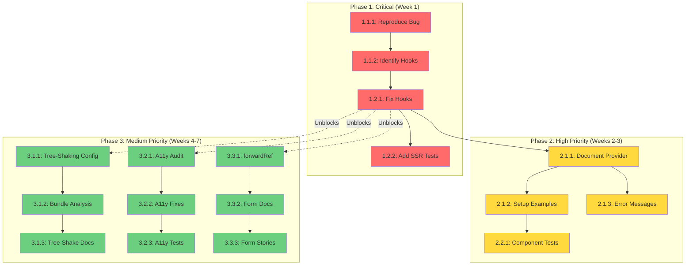

# Milestone: @fidus/ui v2.0 - Production-Ready SSR & DX Improvements

**Status:** 🟡 Planning
**Owner:** Frontend Team
**Related Issues:** [#57](https://github.com/y-core-engineering/fidus/issues/57), [#59](https://github.com/y-core-engineering/fidus/issues/59), [#60](https://github.com/y-core-engineering/fidus/issues/60), [#61](https://github.com/y-core-engineering/fidus/issues/61), [#62](https://github.com/y-core-engineering/fidus/issues/62), [#63](https://github.com/y-core-engineering/fidus/issues/63)

---

## Executive Summary

This milestone delivers **production-ready Next.js 14 App Router compatibility** for @fidus/ui by fixing a critical SSR bug ([#57](https://github.com/y-core-engineering/fidus/issues/57)) and implementing essential features for modern React applications. The work is organized into three phases: **Critical Bug Fix**, **High Priority Features**, and **Medium Priority Enhancements**.

**Why this matters:**
- **Blocks production deployment** - Users cannot use @fidus/ui in Next.js 14 App Router without `'use client'` workaround
- **Degrades SEO & performance** - Forces client-side rendering, increasing bundle size and reducing Core Web Vitals scores
- **Poor developer experience** - Missing documentation, large bundles, no form validation integration

---

## Goals

### Primary Goals (Must-Have)
- 🎯 **Fix critical SSR bug** ([#57](https://github.com/y-core-engineering/fidus/issues/57)) - Components fail during `next build` with `useContext` errors
- 🎯 **Full SSR/SSG support** ([#59](https://github.com/y-core-engineering/fidus/issues/59)) - All components render during server-side rendering
- 🎯 **Clear documentation** ([#60](https://github.com/y-core-engineering/fidus/issues/60)) - Setup guide, Provider usage, SSR examples

### Secondary Goals (Should-Have)
- 🎯 **Tree-shaking** ([#61](https://github.com/y-core-engineering/fidus/issues/61)) - Reduce bundle size by ≥50%
- 🎯 **Accessibility compliance** ([#62](https://github.com/y-core-engineering/fidus/issues/62)) - WCAG 2.1 AA standards
- 🎯 **Form validation integration** ([#63](https://github.com/y-core-engineering/fidus/issues/63)) - React Hook Form + Zod support

---

## Success Metrics

### Technical Metrics
- [ ] **SSR Compatibility:** All components render during `next build` without errors
- [ ] **Bundle Size:** Single component import ≤ 20KB gzipped (current: ~370KB)
- [ ] **Accessibility:** 100% axe DevTools pass rate (0 violations)
- [ ] **Test Coverage:** ≥80% coverage with SSR tests in CI/CD

### User Impact Metrics
- [ ] **Zero `'use client'` workarounds** required for basic component usage
- [ ] **Documentation completeness:** Setup guide, Provider API, 10+ examples
- [ ] **Form DX:** React Hook Form integration with `forwardRef` support

---

## Work Breakdown Structure (WBS)

### Phase 1: Critical Bug Fix 🔴

**Goal:** Resolve SSR `useContext` error ([#57](https://github.com/y-core-engineering/fidus/issues/57)) to unblock production

#### 1.1 Root Cause Analysis

##### Task 1.1.1: Reproduce Bug in Isolated Test Setup
- **Owner:** Frontend Developer
- **Dependencies:** None
- **Blocks:** 1.1.2
- **Description:**
  - Create minimal Next.js 14 App Router reproduction in `test-apps/ssr-repro/`
  - Add affected components: `Button`, `Stack`, `Alert`, `DetailCard`
  - Run `next build` and capture full error stack trace
  - Document reproduction steps in `bug-reports/SSR_REPRO_LOG.md`
- **Definition of Done:**
  - [ ] `test-apps/ssr-repro/` created with package.json, tsconfig, next.config
  - [ ] Error reproduces consistently (100% failure rate)
  - [ ] Stack trace captured with line numbers and file paths
  - [ ] Confirmed error matches [#57](https://github.com/y-core-engineering/fidus/issues/57) description
- **Testing:** Manual (`npm run build` in test app)
- **Risk:** Medium - May need to test multiple Next.js/React versions

---

##### Task 1.1.2: Identify Faulty Context Hooks
- **Owner:** Frontend Developer
- **Dependencies:** Blocked by 1.1.1
- **Blocks:** 1.2.1
- **Description:**
  - Analyze stack trace from 1.1.1 to locate failing hooks
  - Search `packages/ui/src/` for all `useContext` calls:
    ```bash
    rg -n "useContext" packages/ui/src/ --type ts --type tsx
    ```
  - Identify hooks without SSR-safe null checks
  - Document affected hooks and their dependencies
- **Definition of Done:**
  - [ ] List of affected hooks in `docs/milestones/AFFECTED_HOOKS.md`
  - [ ] Root cause explanation documented (e.g., "useTheme() assumes ThemeContext exists but no Provider in SSR")
  - [ ] Proposed fix pattern documented with code examples
  - [ ] Code review completed by 2+ team members
- **Testing:** Code review, static analysis
- **Risk:** Low - Well-defined search task

---

#### 1.2 SSR Compatibility Fix

##### Task 1.2.1: Implement SSR-Safe Context Hooks
- **Owner:** Frontend Developer
- **Dependencies:** Blocked by 1.1.2
- **Blocks:** 1.2.2, 2.1.1
- **Description:**
  - Apply SSR-safe pattern to all affected context hooks:
    ```typescript
    export function useTheme() {
      const context = useContext(ThemeContext);

      // SSR fallback
      if (context === null && typeof window === 'undefined') {
        return DEFAULT_THEME; // Provide sensible defaults
      }

      // Client-side error if Provider missing
      if (context === null) {
        throw new Error('useTheme must be used within ThemeProvider');
      }

      return context;
    }
    ```
  - Update all affected hooks: `useTheme`, `useConfig`, `useToast`, etc.
  - Ensure no direct `window`/`document` access without guards
  - Add JSDoc comments explaining SSR behavior
- **Definition of Done:**
  - [ ] All context hooks have SSR-safe fallbacks
  - [ ] Unit tests pass (existing + new SSR tests added)
  - [ ] `next build` succeeds in `test-apps/ssr-repro/` from 1.1.1
  - [ ] No hydration mismatches in browser console
  - [ ] Code review approved by lead developer
- **Testing:**
  - Unit: `renderToString()` tests for each hook
  - Integration: `next build` in `test-apps/ssr-repro/`
  - E2E: Visual regression (no FOUC - Flash of Unstyled Content)
  - Manual: Test in Safari, Chrome, Firefox
- **Risk:** High - May introduce breaking changes if Provider becomes required

---

##### Task 1.2.2: Add SSR Tests to CI/CD
- **Owner:** DevOps / Frontend Developer
- **Dependencies:** Blocked by 1.2.1
- **Blocks:** None
- **Description:**
  - Add SSR test suite to `.github/workflows/test.yml`
  - Use `react-dom/server` to render all components:
    ```typescript
    import { renderToString } from 'react-dom/server';

    describe('SSR Compatibility', () => {
      it('Button renders without errors', () => {
        const html = renderToString(<Button>Click me</Button>);
        expect(html).toContain('Click me');
      });
    });
    ```
  - Test all components listed in [#59](https://github.com/y-core-engineering/fidus/issues/59)
  - Fail CI if any component throws during SSR
- **Definition of Done:**
  - [ ] GitHub Actions job `test-ssr` added to workflow
  - [ ] All components pass SSR rendering tests
  - [ ] CI fails with clear error message if SSR tests fail
  - [ ] Test execution time < 2 minutes
- **Testing:** CI/CD pipeline execution, verify on PR
- **Risk:** Low - Standard testing pattern

---

### Phase 2: High Priority Features 🔴

**Goal:** Full SSR support + comprehensive documentation ([#59](https://github.com/y-core-engineering/fidus/issues/59), [#60](https://github.com/y-core-engineering/fidus/issues/60))

#### 2.1 SSR/SSG Support & Provider Documentation

##### Task 2.1.1: Document Provider Requirements
- **Owner:** Tech Writer / Frontend Developer
- **Dependencies:** Blocked by 1.2.1
- **Blocks:** 2.1.2
- **Description:**
  - Clarify if `FidusUIProvider` is required or optional
  - Document behavior without Provider (graceful degradation vs. error)
  - Add setup examples for:
    - Next.js 14 App Router (`app/layout.tsx`)
    - Next.js Pages Router (`pages/_app.tsx`)
    - Vite (`main.tsx`)
  - Document all Provider props with TypeScript types
- **Definition of Done:**
  - [ ] `packages/ui/README.md` has "Setup" section with examples
  - [ ] Provider props documented with JSDoc comments
  - [ ] TypeScript types exported: `FidusUIProviderProps`
  - [ ] Migration guide if Provider is newly required
  - [ ] Peer review by product team
- **Testing:** Manual (docs review), link validation
- **Risk:** Low - Documentation task

---

##### Task 2.1.2: Create Interactive Setup Examples
- **Owner:** Frontend Developer
- **Dependencies:** Blocked by 2.1.1
- **Blocks:** 2.2.1
- **Description:**
  - Create example projects in `examples/` directory:
    - `examples/nextjs-app-router/` - Next.js 14 with SSR
    - `examples/nextjs-pages-router/` - Next.js 13 Pages Router
    - `examples/vite-react/` - Vite + React 18
  - Each example should include:
    - Basic setup with Provider
    - Common components (Button, Form, Modal)
    - Error handling example
  - Add `README.md` to each example with setup instructions
- **Definition of Done:**
  - [ ] 3 working example projects in `examples/` directory
  - [ ] Each example has README with setup/run instructions
  - [ ] Examples linked from main README.md
  - [ ] All examples build and run without errors
  - [ ] CodeSandbox templates created and linked
- **Testing:** Manual (run each example), automated (CI build test)
- **Risk:** Low - Reference implementation

---

##### Task 2.1.3: Improve Error Messages
- **Owner:** Frontend Developer
- **Dependencies:** Blocked by 2.1.1
- **Blocks:** None
- **Description:**
  - Replace cryptic `useContext` errors with actionable messages:
    ```typescript
    if (context === null) {
      throw new Error(
        `FidusUI Error: <${componentName}> requires <FidusUIProvider>.\n\n` +
        `Add the provider to your root layout:\n\n` +
        `  import { FidusUIProvider } from '@fidus/ui';\n\n` +
        `  export default function RootLayout({ children }) {\n` +
        `    return <FidusUIProvider>{children}</FidusUIProvider>;\n` +
        `  }\n\n` +
        `See docs: https://github.com/y-core-engineering/fidus/tree/main/packages/ui#setup`
      );
    }
    ```
  - Add component name to error messages
  - Link to setup documentation
- **Definition of Done:**
  - [ ] All context hooks have improved error messages
  - [ ] Error messages tested in browser console
  - [ ] Docs link validated
  - [ ] Error messages include component name
- **Testing:** Manual (trigger errors, verify messages)
- **Risk:** Low - String formatting task

---

#### 2.2 SSR Test Coverage

##### Task 2.2.1: Add SSR Tests for All Components
- **Owner:** Frontend Developer / QA Engineer
- **Dependencies:** Blocked by 2.1.2
- **Blocks:** None
- **Description:**
  - Write SSR tests for all component categories:
    - **Interactive:** Button, Modal, Dropdown, Tabs
    - **Forms:** TextInput, Select, Checkbox, Radio
    - **Layout:** Stack, Grid, Container
    - **Feedback:** Alert, Toast, Spinner
  - Test SSR + hydration (no mismatches)
  - Test with and without Provider
- **Definition of Done:**
  - [ ] SSR tests for 20+ components (see [#59](https://github.com/y-core-engineering/fidus/issues/59) checklist)
  - [ ] Tests verify no hydration warnings
  - [ ] Tests pass in CI/CD
  - [ ] Coverage report shows ≥80% SSR path coverage
- **Testing:** Jest + `react-dom/server`, CI/CD
- **Risk:** Medium - Time-consuming, may reveal edge cases

---

### Phase 3: Medium Priority Enhancements 🟡

**Goal:** Performance, accessibility, and developer experience improvements

#### 3.1 Tree-Shaking Support ([#61](https://github.com/y-core-engineering/fidus/issues/61))

##### Task 3.1.1: Configure Subpath Exports
- **Owner:** Frontend Developer
- **Dependencies:** None
- **Blocks:** 3.1.2
- **Description:**
  - Update `packages/ui/package.json` with subpath exports:
    ```json
    {
      "exports": {
        ".": {
          "import": "./dist/index.mjs",
          "require": "./dist/index.js",
          "types": "./dist/index.d.ts"
        },
        "./button": {
          "import": "./dist/button/index.mjs",
          "require": "./dist/button/index.js",
          "types": "./dist/button/index.d.ts"
        }
      },
      "sideEffects": false
    }
    ```
  - Configure tsup to generate per-component bundles
  - Ensure ESM format with proper `import`/`export`
- **Definition of Done:**
  - [ ] `package.json` exports configured for all components
  - [ ] `sideEffects: false` in package.json
  - [ ] Build generates separate bundles per component
  - [ ] TypeScript types resolve correctly for subpath imports
  - [ ] Backward compatibility maintained (barrel imports still work)
- **Testing:** Import tests, bundle analysis
- **Risk:** Medium - May break existing imports if not careful

---

##### Task 3.1.2: Verify Tree-Shaking with Bundle Analyzer
- **Owner:** Frontend Developer
- **Dependencies:** Blocked by 3.1.1
- **Blocks:** 3.1.3
- **Description:**
  - Use `@next/bundle-analyzer` to verify tree-shaking:
    ```typescript
    // Test: Import only Button
    import { Button } from '@fidus/ui/button';
    ```
  - Verify bundle includes ONLY Button component (+ shared utils)
  - Measure bundle size before/after
- **Definition of Done:**
  - [ ] Single component import ≤ 20KB gzipped
  - [ ] Bundle analysis report generated
  - [ ] Before/after comparison documented
  - [ ] No unexpected dependencies in bundle
- **Testing:** `@next/bundle-analyzer`, Webpack Bundle Analyzer
- **Risk:** Low - Verification task

---

##### Task 3.1.3: Document Tree-Shaking Best Practices
- **Owner:** Tech Writer
- **Dependencies:** Blocked by 3.1.2
- **Blocks:** None
- **Description:**
  - Add "Optimizing Bundle Size" section to README
  - Document subpath imports vs barrel imports
  - Show bundle size impact (before/after comparison)
- **Definition of Done:**
  - [ ] README has bundle optimization section
  - [ ] Code examples for both import patterns
  - [ ] Bundle size comparison table
  - [ ] Link to bundle analysis report
- **Testing:** Docs review
- **Risk:** Low - Documentation task

---

#### 3.2 Accessibility Compliance ([#62](https://github.com/y-core-engineering/fidus/issues/62))

##### Task 3.2.1: Accessibility Audit with axe DevTools
- **Owner:** Frontend Developer / Accessibility Specialist
- **Dependencies:** None
- **Blocks:** 3.2.2
- **Description:**
  - Run axe DevTools on all interactive components
  - Document violations by component and severity
  - Prioritize fixes: Critical → Serious → Moderate
  - Test keyboard navigation for all interactive components
- **Definition of Done:**
  - [ ] Audit report with violations per component
  - [ ] Prioritized fix list (Critical, Serious, Moderate)
  - [ ] Keyboard navigation tested for 10+ components
  - [ ] Screen reader testing completed (NVDA or VoiceOver)
- **Testing:** axe DevTools, manual keyboard/screen reader testing
- **Risk:** Medium - May reveal many violations requiring fixes

---

##### Task 3.2.2: Implement Accessibility Fixes
- **Owner:** Frontend Developer
- **Dependencies:** Blocked by 3.2.1
- **Blocks:** 3.2.3
- **Description:**
  - Fix all critical and serious violations from audit
  - Add missing ARIA attributes:
    - `role`, `aria-label`, `aria-describedby`, `aria-invalid`
  - Implement keyboard navigation:
    - Modal: focus trap, ESC to close
    - Dropdown: Arrow keys, Enter, ESC
    - Tabs: Arrow keys, Home/End
  - Ensure 4.5:1 contrast ratio for text
  - Add visible focus indicators (3:1 contrast)
- **Definition of Done:**
  - [ ] All critical violations fixed
  - [ ] All serious violations fixed
  - [ ] axe DevTools shows 0 violations
  - [ ] Keyboard navigation works for all interactive components
  - [ ] Focus indicators visible and meet contrast requirements
- **Testing:** axe DevTools, keyboard navigation, screen readers
- **Risk:** High - Large scope, may require design changes

---

##### Task 3.2.3: Add Accessibility Tests to CI/CD
- **Owner:** Frontend Developer
- **Dependencies:** Blocked by 3.2.2
- **Blocks:** None
- **Description:**
  - Add `jest-axe` to test suite:
    ```typescript
    import { axe, toHaveNoViolations } from 'jest-axe';
    expect.extend(toHaveNoViolations);

    test('Button is accessible', async () => {
      const { container } = render(<Button>Click</Button>);
      expect(await axe(container)).toHaveNoViolations();
    });
    ```
  - Test all interactive components
  - Fail CI if violations found
- **Definition of Done:**
  - [ ] `jest-axe` tests for 10+ components
  - [ ] CI fails on accessibility violations
  - [ ] Tests run in < 3 minutes
  - [ ] Coverage report includes accessibility metrics
- **Testing:** CI/CD pipeline
- **Risk:** Low - Standard testing pattern

---

#### 3.3 Form Validation Integration ([#63](https://github.com/y-core-engineering/fidus/issues/63))

##### Task 3.3.1: Add `forwardRef` to Form Components
- **Owner:** Frontend Developer
- **Dependencies:** None
- **Blocks:** 3.3.2
- **Description:**
  - Wrap all form components with `forwardRef`:
    ```typescript
    export const TextInput = forwardRef<HTMLInputElement, TextInputProps>(
      ({ label, error, ...props }, ref) => {
        return (
          <div>
            <label>{label}</label>
            <input ref={ref} aria-invalid={!!error} {...props} />
            {error && <span role="alert">{error}</span>}
          </div>
        );
      }
    );
    TextInput.displayName = 'TextInput';
    ```
  - Add `error` prop for validation messages
  - Ensure compatibility with React Hook Form's `register()`
- **Definition of Done:**
  - [ ] All form components use `forwardRef`
  - [ ] Components work with `{...register('field')}`
  - [ ] `error` prop displays validation messages
  - [ ] TypeScript types updated
  - [ ] Backward compatibility maintained
- **Testing:** Unit tests with React Hook Form
- **Risk:** Low - Standard React pattern

---

##### Task 3.3.2: Document React Hook Form Integration
- **Owner:** Tech Writer
- **Dependencies:** Blocked by 3.3.1
- **Blocks:** 3.3.3
- **Description:**
  - Add "Form Validation" section to README
  - Document React Hook Form + Zod integration
  - Provide complete working examples (login form, profile form)
  - Show TypeScript types with Zod schemas
- **Definition of Done:**
  - [ ] README has form validation section
  - [ ] Example with React Hook Form + Zod
  - [ ] Example shows error handling
  - [ ] TypeScript types documented
  - [ ] CodeSandbox example linked
- **Testing:** Docs review, example validation
- **Risk:** Low - Documentation task

---

##### Task 3.3.3: Create Storybook Form Examples
- **Owner:** Frontend Developer
- **Dependencies:** Blocked by 3.3.2
- **Blocks:** None
- **Description:**
  - Create interactive Storybook stories for forms:
    - Basic form with validation
    - Multi-step form
    - Dynamic field arrays
    - Error states and loading states
  - Add controls for triggering validation errors
  - Document form patterns and best practices
- **Definition of Done:**
  - [ ] 4+ Storybook stories for forms
  - [ ] Interactive controls for all props
  - [ ] Validation examples with error states
  - [ ] Published to Storybook deployment
- **Testing:** Manual (Storybook), visual regression
- **Risk:** Low - Reference implementation

---

## Dependency Graph



**Legend:**
- 🔴 Red: Phase 1 (Critical)
- 🟡 Yellow: Phase 2 (High Priority)
- 🟢 Green: Phase 3 (Medium Priority)
- Solid arrows: Hard dependencies (must complete before)
- Dotted arrows: Soft dependencies (can start in parallel)

---

## Risk Assessment

| Risk | Impact | Probability | Mitigation |
|------|--------|-------------|------------|
| Provider redesign breaks backward compatibility | **High** | Medium | Start with minimal changes, provide migration guide, deprecation warnings |
| SSR tests require complex Next.js setup | Medium | High | Use existing `test-apps/`, reuse Next.js config from reproduction |
| Tree-shaking breaks existing imports | **High** | Low | Extensive testing, maintain barrel exports, add deprecation notices |
| A11y fixes introduce visual regressions | Medium | Medium | Visual regression tests (Percy/Chromatic), QA review |
| Timeline slips due to scope creep | Medium | High | **Strict phase gates** - no Phase 3 work until Phase 1 complete |
| Insufficient testing coverage | **High** | Medium | CI/CD gates: ≥80% coverage, SSR tests, a11y tests all required |

---

## Release Plan

### v2.0.0-alpha.1 (Phase 1 Complete)
**Focus:** SSR bug fix ([#57](https://github.com/y-core-engineering/fidus/issues/57))

**Changes:**
- ✅ SSR bug fixed - all components render during `next build`
- ✅ SSR tests added to CI/CD
- ⚠️ **Breaking:** May require Provider (TBD based on implementation)

**Changelog:**
```markdown
### 🔴 BREAKING CHANGES
- Components may now require `<FidusUIProvider>` wrapper (see migration guide)

### 🐛 Bug Fixes
- Fix SSR `useContext` error in Next.js 14 App Router (#57)
- Add SSR-safe fallbacks to all context hooks

### ✅ Tests
- Add SSR compatibility tests for all components
```

**Migration Guide:**
```typescript
// Before (v1.x)
import { Button } from '@fidus/ui';

// After (v2.x) - may need Provider
import { FidusUIProvider, Button } from '@fidus/ui';

function App() {
  return (
    <FidusUIProvider>
      <Button>Click me</Button>
    </FidusUIProvider>
  );
}
```

---

### v2.0.0-beta.1 (Phase 2 Complete)
**Focus:** Full SSR support + documentation ([#59](https://github.com/y-core-engineering/fidus/issues/59), [#60](https://github.com/y-core-engineering/fidus/issues/60))

**Changes:**
- ✅ Full SSR/SSG support documented
- ✅ Setup guide with Next.js, Vite examples
- ✅ Improved error messages
- ✅ Provider API documented

**Changelog:**
```markdown
### 📚 Documentation
- Add comprehensive setup guide (#60)
- Document Provider configuration options
- Add example projects (Next.js, Vite)
- Improve error messages with setup instructions

### ✨ Features
- Full Next.js 14 App Router SSR support (#59)
- SSR tests for all components
```

---

### v2.0.0 (Phase 3 Complete)
**Focus:** Performance, accessibility, forms ([#61](https://github.com/y-core-engineering/fidus/issues/61), [#62](https://github.com/y-core-engineering/fidus/issues/62), [#63](https://github.com/y-core-engineering/fidus/issues/63))

**Changes:**
- ✅ Tree-shaking support (≥50% bundle size reduction)
- ✅ WCAG 2.1 AA compliance (0 axe violations)
- ✅ React Hook Form integration

**Changelog:**
```markdown
### ⚡ Performance
- Add tree-shaking support with subpath exports (#61)
- Reduce single component bundle to ~20KB (was ~370KB)
- Add bundle size regression tests to CI

### ♿ Accessibility
- Achieve WCAG 2.1 AA compliance (#62)
- Add keyboard navigation to all interactive components
- Improve focus indicators and ARIA attributes
- Add accessibility tests to CI

### 🎨 Developer Experience
- Add React Hook Form integration (#63)
- Support forwardRef on all form components
- Document Zod schema validation
- Add Storybook form examples
```

---

## Communication Plan

### Stakeholders
- **Internal:** Frontend Team, Product Team, QA Team
- **External:** @fidus/ui users (via GitHub Releases, npm, Discord)

### Status Updates
- **Regular Updates:** Update this document with task progress (✅ Done, 🚧 In Progress, ⏸️ Blocked)
- **Phase Milestones:** GitHub Release with changelog, migration guide
- **Blockers:** Immediate notification to team lead

### Issue Updates
Each issue will receive a milestone assignment comment linking to this WBS:
```markdown
📋 **Milestone Assignment**

This issue is part of **Milestone: @fidus/ui v2.0** ([WBS](https://github.com/y-core-engineering/fidus/blob/main/docs/milestones/MILESTONE_FIDUS_UI_V2.md))

**Phase:** [Phase 1/2/3]
**WBS Tasks:** [Task IDs]

See full breakdown in [MILESTONE_FIDUS_UI_V2.md](https://github.com/y-core-engineering/fidus/blob/main/docs/milestones/MILESTONE_FIDUS_UI_V2.md)
```

---

## Appendix

### References
- **Bug Report:** [bug-reports/GITHUB_ISSUE_BUG_SSR.md](../../bug-reports/GITHUB_ISSUE_BUG_SSR.md)
- **Feature Requests:** [bug-reports/GITHUB_ISSUE_FEATURE_REQUESTS.md](../../bug-reports/GITHUB_ISSUE_FEATURE_REQUESTS.md)
- **GitHub Issues:** [#57](https://github.com/y-core-engineering/fidus/issues/57), [#59](https://github.com/y-core-engineering/fidus/issues/59), [#60](https://github.com/y-core-engineering/fidus/issues/60), [#61](https://github.com/y-core-engineering/fidus/issues/61), [#62](https://github.com/y-core-engineering/fidus/issues/62), [#63](https://github.com/y-core-engineering/fidus/issues/63)
- **Next.js SSR Docs:** https://nextjs.org/docs/app/building-your-application/rendering/server-components
- **React SSR Docs:** https://react.dev/reference/react-dom/server
- **WCAG 2.1 Quick Reference:** https://www.w3.org/WAI/WCAG21/quickref/

---

**Document Version:** 1.0
**Last Updated:** 2025-01-10
