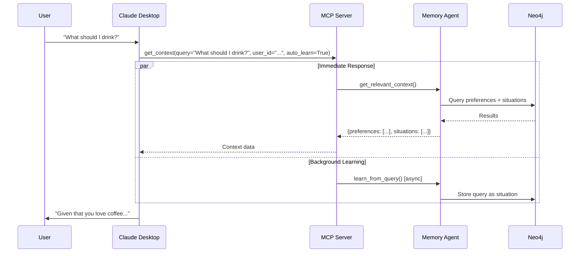

# Claude Desktop Setup for Fidus Memory

This guide explains how to connect Claude Desktop to the Fidus Memory MCP server for testing the personalized memory learning feature.

## Prerequisites

1. **Fidus Memory Services Running:**
   ```bash
   docker-compose up -d
   ```
   Verify the MCP server is running:
   ```bash
   curl -I http://localhost:8001/sse
   # Should return: HTTP/1.1 200 OK
   ```

2. **Web UI Running:**
   Open http://localhost:3001 to initialize your user session

3. **Claude Desktop Installed:**
   Download from: https://claude.ai/download

## Quick Setup (Automated)

### Step 1: Get Your User ID from Web UI

1. Open the Web UI at http://localhost:3001
2. Open browser DevTools Console (F12 or Cmd+Option+I on Mac)
3. Run this command in the console:
   ```javascript
   localStorage.getItem('fidus_user_id')
   ```
4. Copy the UUID that appears (e.g., `"d3f72106-1fe0-48a8-9d75-ac5f1bb3ddab"`)

### Step 2: Run the Sync Script

```bash
# Interactive mode (will prompt you to paste user_id)
node scripts/sync-user-id.js

# Or provide user_id directly
node scripts/sync-user-id.js d3f72106-1fe0-48a8-9d75-ac5f1bb3ddab
```

The script will:
- ✅ Update your Claude Desktop config with the Fidus Memory MCP server
- ✅ Set the X-USER-ID to match your Web UI session
- ✅ Add global instructions for automatic memory usage
- ✅ Update the project template config for reference

### Step 3: Restart Claude Desktop

Close and reopen Claude Desktop for the configuration to take effect.

### Step 4: Verify Connection

In Claude Desktop, try asking:
```
Do you have access to my memory?
```

Claude should respond confirming it can access Fidus Memory via the `get_context` tool.

## Manual Setup

If you prefer to configure manually:

### Step 1: Locate Claude Desktop Config

The config file location varies by OS:

- **macOS:** `~/Library/Application Support/Claude/claude_desktop_config.json`
- **Windows:** `%APPDATA%/Claude/config.json`
- **Linux:** `~/.config/Claude/claude_desktop_config.json`

### Step 2: Get Your User ID

1. Open http://localhost:3001 in your browser
2. Open DevTools Console (F12 or Cmd+Option+I)
3. Run: `localStorage.getItem('fidus_user_id')`
4. Copy the UUID (without quotes)

### Step 3: Update Config File

Open the Claude Desktop config file in a text editor and add/merge this configuration:

```json
{
  "mcpServers": {
    "fidus-memory": {
      "command": "node",
      "args": [],
      "env": {
        "X_USER_ID": "YOUR_USER_ID_HERE"
      },
      "disabled": false,
      "alwaysAllow": [],
      "timeout": 60000,
      "initializationOptions": {
        "serverUrl": "http://localhost:8001/sse"
      }
    }
  },
  "globalCustomInstructions": "# Fidus Memory Integration\n\nYou have access to Fidus Memory via MCP.\n\n## CRITICAL: Memory Usage Protocol\n\nBEFORE responding to ANY user message:\n1. ALWAYS call `get_context(user_message)` to retrieve relevant preferences and past context\n2. Use the returned memory to personalize your response\n3. Learning happens automatically in the background\n\n## Example Flow:\n\nUser: \"What should I drink?\"\n1. [Call get_context('What should I drink?')]\n2. [Receive: {preferences: [\"coffee: loves it\"], situations: [\"I need coffee before 9am\" (87% similar)]}]\n3. [Respond using this context]: \"Given that you love coffee and typically drink it in the morning, how about a nice cup of coffee?\"\n\n## Available Tools:\n\n- **get_context(query, user_id, auto_learn=True)**: Retrieves preferences + situations. Automatically learns from query in background.\n  - Returns: {preferences: [...], situations: [...], summary: \"...\", learned: true}\n  - Use this for EVERY user message to personalize responses\n\nNEVER skip calling get_context()!"
}
```

**Important:** Replace `YOUR_USER_ID_HERE` with the actual user_id from Step 2.

### Step 4: Restart Claude Desktop

Close and reopen Claude Desktop.

## Testing the Integration

### Test 1: Verify MCP Connection

In Claude Desktop:
```
Do you have access to my memory? What tools are available?
```

Expected: Claude should list the `get_context` tool.

### Test 2: Learn a Preference (via Web UI)

1. Open Web UI at http://localhost:3001
2. Type: "I love coffee"
3. Wait for response

### Test 3: Retrieve Memory (via Claude Desktop)

In Claude Desktop:
```
What do I like to drink?
```

Expected: Claude should call `get_context()` automatically and respond based on your coffee preference.

### Test 4: Cross-Platform Learning

1. In Web UI: "I prefer working in the mornings"
2. In Claude Desktop: "When should I schedule a meeting?"

Expected: Claude should retrieve the morning preference and suggest morning times.

## How It Works

### Passive Learning Flow



### User ID Synchronization

Both the Web UI and Claude Desktop use the same `X-USER-ID` header to ensure memory is shared:

1. **Web UI:** Stores user_id in LocalStorage (`fidus_user_id`)
2. **Claude Desktop:** Reads user_id from config env variable (`X_USER_ID`)
3. **MCP Server:** Uses user_id from header to query the same tenant's memory

## Troubleshooting

### Issue: Claude doesn't call get_context()

**Cause:** Global instructions not applied correctly

**Fix:**
1. Check that `globalCustomInstructions` is in your Claude Desktop config
2. Restart Claude Desktop
3. Start a new conversation (old conversations don't get new instructions)

### Issue: MCP Server Connection Failed

**Cause:** MCP server not running or wrong URL

**Fix:**
```bash
# Check if MCP server is running
curl -I http://localhost:8001/sse

# Restart the service
docker-compose restart memory-mcp

# Check logs
docker-compose logs -f memory-mcp
```

### Issue: Memory Not Shared Between Web UI and Claude Desktop

**Cause:** Different user_id values

**Fix:**
1. Get user_id from Web UI: `localStorage.getItem('fidus_user_id')`
2. Re-run sync script: `node scripts/sync-user-id.js <user_id>`
3. Restart Claude Desktop

### Issue: Permission Denied When Running Sync Script

**Cause:** Script not executable

**Fix:**
```bash
chmod +x scripts/sync-user-id.js
node scripts/sync-user-id.js
```

### Issue: "Invalid user_id format" Error

**Cause:** Copied user_id with quotes or whitespace

**Fix:** Ensure you copy ONLY the UUID, without quotes:
```
❌ Wrong: "d3f72106-1fe0-48a8-9d75-ac5f1bb3ddab"
✅ Right: d3f72106-1fe0-48a8-9d75-ac5f1bb3ddab
```

## Configuration Reference

### Environment Variables (MCP Server)

| Variable | Description | Example |
|----------|-------------|---------|
| `X_USER_ID` | User identifier for memory isolation | `d3f72106-1fe0-48a8-9d75-ac5f1bb3ddab` |

### MCP Server Endpoints

- **SSE Transport:** `http://localhost:8001/sse`
- **Health Check:** `http://localhost:8001/.well-known/mcp`

### Available MCP Tools

#### get_context

Retrieves relevant preferences and situational context for a user query.

**Parameters:**
- `query` (string, required): The user's message or question
- `user_id` (string, optional): User identifier (can be set via X-USER-ID env var)
- `auto_learn` (boolean, optional, default: true): Whether to learn from this query in the background

**Returns:**
```json
{
  "preferences": [
    {
      "subject": "coffee",
      "description": "loves it",
      "confidence": 1.0
    }
  ],
  "situations": [
    {
      "description": "I need coffee before 9am",
      "similarity": 0.87,
      "context": "morning routine"
    }
  ],
  "summary": "User loves coffee, especially in the mornings before 9am",
  "learned": true
}
```

## VS Code Extension Support

For using Fidus Memory with VS Code extensions like Cline or Continue:

### Cline Extension

Add to Cline MCP settings:
```json
{
  "mcpServers": {
    "fidus-memory": {
      "url": "http://localhost:8001/sse",
      "headers": {
        "X-User-ID": "YOUR_USER_ID_HERE"
      }
    }
  }
}
```

### Continue Extension

Add to Continue config:
```json
{
  "mcpServers": [
    {
      "name": "fidus-memory",
      "url": "http://localhost:8001/sse",
      "headers": {
        "X-User-ID": "YOUR_USER_ID_HERE"
      }
    }
  ]
}
```

**Note:** Replace `YOUR_USER_ID_HERE` with your actual user_id from the Web UI.

## Security Considerations

### Local Development Only

This configuration is designed for **local development and testing only**:

- ✅ MCP server runs on localhost (127.0.0.1)
- ✅ No authentication required (not exposed to network)
- ✅ User isolation via user_id

### Production Deployment

For production use, additional security measures are required:

- 🔒 **Authentication:** Implement proper authentication for MCP endpoints
- 🔒 **TLS/HTTPS:** Use encrypted connections
- 🔒 **Network Isolation:** Restrict MCP server access to authorized clients
- 🔒 **Rate Limiting:** Implement rate limits to prevent abuse

## Next Steps

1. **Test Memory Learning:** Try various queries in both Web UI and Claude Desktop
2. **Check Neo4j Graph:** View the learned preferences at http://localhost:7474
3. **Monitor Learning:** Check MCP server logs: `docker-compose logs -f memory-mcp`
4. **Experiment with Queries:** Test different types of preferences and situational context

## Resources

- [MCP Server Implementation](../../packages/api/fidus/memory/mcp_server.py)
- [Passive Learning Agent](../../packages/api/fidus/memory/passive_agent.py)
- [Web UI User Session](../../packages/web/app/lib/userSession.ts)
- [Architecture Overview](./architecture-overview.md)

## Support

For issues or questions:
- GitHub Issues: https://github.com/y-core-engineering/fidus/issues
- Discord: #fidus-memory channel
