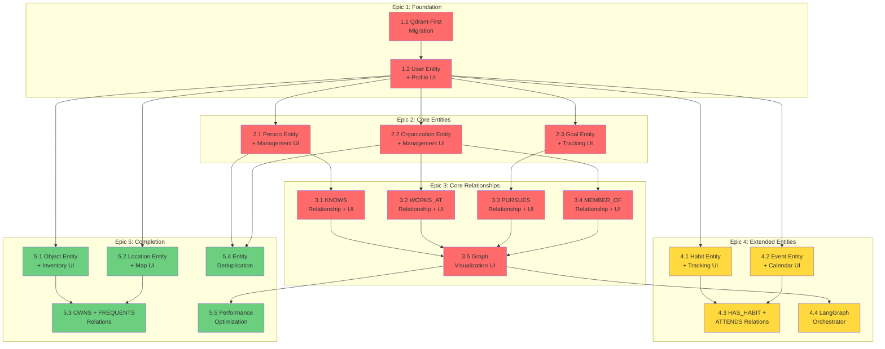

# Work Breakdown Structure: Fidus Memory v3.0 Migration

**Version:** 1.1
**Created:** 2025-11-21
**Last Updated:** 2025-11-21
**Total Packages:** 24
**Status:** Planning

---

## Overview

This Work Breakdown Structure defines the migration path from Fidus Memory v2.2.0 (current prototype) to full Solution Architecture v3.0 compliance. The migration addresses critical architectural gaps identified in the Architecture Review (2025-11-21):

**Current State:**
- ✅ MCP Server integration functional
- ✅ Basic preference learning working
- ✅ Situational context extraction implemented
- ❌ Only 1 of 9 entity types implemented (11%)
- ❌ 0 of 9 relationship types implemented (0%)
- ❌ Violates ADR-0001 (uses v1.0 pattern instead of Qdrant-First)

**Target State (v3.0):**
- ✅ Complete Entity-Relationship Model (9 entity types)
- ✅ Full graph relationships (9 relationship types)
- ✅ Qdrant-First Pattern (ADR-0001 compliant)
- ✅ LangGraph orchestration
- ✅ Entity deduplication
- ✅ Flexible AI-discovered properties

**Migration Strategy:**
1. **Additive approach** - No breaking changes until verified
2. **Feature flags** - Gradual rollout with safety mechanisms
3. **Parallel paths** - Old and new patterns coexist during transition
4. **Vertical slicing** - Every package delivers testable end-to-end value via UI
5. **Incremental value** - Each package adds visible user functionality

---

## Dependency Graph



**Legend:**
- 🔴 Red: CRITICAL priority
- 🟡 Yellow: MEDIUM priority
- 🟢 Green: LOW priority

---

## Parallel Work Opportunities

To maximize team efficiency, multiple packages can be developed simultaneously by different teams. Below are the recommended parallel work streams:

### Wave 1: Core Entities (After Package 1.2 Complete)

**Can be worked on in parallel:**
- **Team A:** Package 2.1 (Person Entity + Management UI)
- **Team B:** Package 2.2 (Organization Entity + Management UI)
- **Team C:** Package 2.3 (Goal Entity + Tracking UI)

**Coordination needed:**
- Shared: Base entity model pattern from Package 1.2
- No conflicts: Each entity is independent
- Sync point: All three must complete before Epic 3 begins

---

### Wave 2: Core Relationships (After Wave 1 Complete)

**Can be worked on in parallel:**
- **Team A:** Package 3.1 (KNOWS Relationship) - requires 2.1
- **Team B:** Package 3.2 (WORKS_AT Relationship) - requires 2.2
- **Team C:** Package 3.3 (PURSUES Relationship) - requires 2.3
- **Team D:** Package 3.4 (MEMBER_OF Relationship) - requires 2.2

**Coordination needed:**
- Shared: Base relationship service pattern (Qdrant-First)
- Recommended: One team creates `base_relationship_service.py`, others reuse
- Sync point: All four must complete before Package 3.5 (Graph Visualization)

---

### Wave 3: Extended Entities (Can run alongside Wave 2)

**Can be worked on in parallel with Core Relationships:**
- **Team E:** Package 4.1 (Habit Entity + Tracking UI) - requires 1.2 only
- **Team F:** Package 4.2 (Event Entity + Calendar UI) - requires 1.2 only

**Coordination needed:**
- No conflicts with Wave 2 (different entity types)
- Sync point: Both must complete before Package 4.3

---

### Wave 4: Final Entities (After Package 1.2)

**Can be worked on in parallel:**
- **Team G:** Package 5.1 (Object Entity + Inventory UI) - requires 1.2 only
- **Team H:** Package 5.2 (Location Entity + Map UI) - requires 1.2 only

**Coordination needed:**
- No conflicts (independent entities)
- Sync point: Both must complete before Package 5.3

---

### Sequential Packages (No Parallelization)

These packages **cannot** be parallelized due to dependencies:

- **Package 1.1 → 1.2:** Sequential (1.2 depends on 1.1)
- **Package 3.5:** Requires ALL Wave 2 packages complete (graph needs all relationships)
- **Package 4.3:** Requires Packages 4.1 AND 4.2 complete
- **Package 4.4:** Requires Package 3.5 complete (orchestrator needs full entity model)
- **Package 5.3:** Requires Packages 5.1 AND 5.2 complete
- **Package 5.4:** Requires Packages 2.1 AND 2.2 complete (deduplication needs entities with data)
- **Package 5.5:** Requires Package 3.5 complete (optimization needs full system)

---

### Recommended Team Allocation

For optimal throughput with 8 teams:

**Phase 1 (Foundation):**
- All teams collaborate on Package 1.1 and 1.2 (critical path)

**Phase 2 (Parallel Expansion):**
- Teams A, B, C: Wave 1 (Core Entities)
- Teams E, F: Wave 3 (Extended Entities) - starts after 1.2
- Teams G, H: Wave 4 (Final Entities) - starts after 1.2
- Team D: Standby for Package 3.4 (MEMBER_OF)

**Phase 3 (Relationships):**
- Teams A, B, C, D: Wave 2 (Core Relationships)
- Teams E, F: Package 4.3 (if 4.1, 4.2 done)
- Teams G, H: Package 5.3 (if 5.1, 5.2 done)

**Phase 4 (Integration):**
- 1 Team: Package 3.5 (Graph Visualization)
- 1 Team: Package 4.4 (LangGraph)
- 1 Team: Package 5.4 (Deduplication)
- Remaining teams: Testing, documentation, bug fixes

**Phase 5 (Optimization):**
- 1-2 Teams: Package 5.5 (Performance Optimization)
- Remaining teams: E2E testing, deployment preparation

---

## Epic 1: Foundation & Architecture Compliance

**Goal:** Establish v3.0 architecture patterns and create the aggregate root (User entity) that all other entities depend on.

**Priority:** 🔴 CRITICAL

**Dependencies:** None (starting point)

**Deliverables:** Qdrant-First pattern implemented, User entity operational, no breaking changes to existing functionality.

---

### Package 1.1: Qdrant-First Pattern Migration

**User Story:** As a system architect, I want to migrate context storage to the Qdrant-First pattern so that we comply with ADR-0001 and achieve better performance with 1-Hop queries.

**Acceptance Criteria:**
- [ ] Backend: New `ContextStorageV3` service in `packages/api/fidus/memory/context/storage_v3.py`
- [ ] Backend: Context stored in Qdrant payload (PRIMARY), Neo4j only holds `situation_id` reference (SECONDARY)
- [ ] Backend: `IN_SITUATION` relationship removed, replaced with `situation_id` property on relationships
- [ ] Backend: Migration script converts existing Situation nodes to Qdrant-only storage
- [ ] API: Feature flag `USE_QDRANT_FIRST` to toggle between old/new pattern
- [ ] Frontend: Admin panel to monitor migration progress in `packages/web/src/components/memory/admin/MigrationStatus.tsx`
- [ ] Tests: Parallel testing with old and new patterns validates identical behavior
- [ ] Documentation: Update `docs/solution-architecture/14-situational-context.md` with v2.0 examples

**Technical Tasks:**
1. [BE] Create `packages/api/fidus/memory/context/storage_v3.py` - New storage service implementing Qdrant-First pattern
2. [BE] Implement `store_situation_v3()` method - Store full context in Qdrant payload with entity/relationship metadata
3. [BE] Implement `store_relationship_with_context()` - Create Neo4j relationship with `situation_id` property (no IN_SITUATION edge)
4. [BE] Update `packages/api/fidus/memory/context/models.py` - Add `RelationshipContext` model with `situation_id` field
5. [BE] Create `packages/api/scripts/migrate_situations_to_qdrant.py` - Migration script to convert Situation nodes to Qdrant payloads
6. [BE] Add feature flag `USE_QDRANT_FIRST` in `packages/api/fidus/config.py`
7. [BE] Update queries to 1-Hop pattern: `MATCH (u:User)-[r:HAS_PREFERENCE {situation_id: $sid}]->(p:Preference)`
8. [API] Add endpoint `POST /api/memory/admin/migrate-qdrant-first` - Trigger migration with progress tracking
9. [API] Add endpoint `GET /api/memory/admin/migration-status` - Return migration statistics
10. [FE] Create `packages/web/src/components/memory/admin/MigrationStatus.tsx` - Display migration progress, validation status
11. [FE] Add toggle in admin panel to switch between old/new pattern (feature flag control)
12. [TEST] Write parallel tests in `packages/api/tests/integration/memory/test_storage_v3.py` - Verify identical behavior
13. [TEST] Write rollback test - Verify safe fallback to v1.0 pattern if issues occur
14. [DOCS] Update `docs/solution-architecture/14-situational-context.md` - Replace v1.0 examples with v3.0

**Testing Strategy:**
- **Unit:** Test `storage_v3.py` methods independently, validate Qdrant payload structure
- **Integration:** Store context via v3 API, retrieve via Neo4j `situation_id`, verify consistency
- **E2E:** Admin user opens migration panel, triggers migration, sees progress bar, validates success, switches feature flag to new pattern

**Dependencies:**
- Requires: Qdrant 1.7+ running, Neo4j 5.x with existing Situation nodes
- Blocks: All subsequent packages (foundational change)

**Risk Level:** HIGH
- Risk: Migration may corrupt existing context data if not thoroughly tested
- Mitigation: Feature flag allows instant rollback, parallel testing validates equivalence, dry-run mode available
- Risk: Performance degradation if Qdrant queries are not optimized
- Mitigation: Benchmark before/after, add Qdrant payload indexes on `tenant_id`, `user_id`, `relationship_type`

**Migration Notes:**
- **Breaking Change:** None during migration (feature flag controlled)
- **Data Migration:** `migrate_situations_to_qdrant.py` reads Situation nodes, creates Qdrant points, updates relationship properties
- **Rollback:** Set `USE_QDRANT_FIRST=false` to revert to v1.0 pattern, Situation nodes remain untouched until cleanup phase

---

### Package 1.2: User Entity Foundation with Profile UI

**User Story:** As a user, I want to view and manage my profile information so that I can control my personal data, preferences, and skills in the memory system.

**Acceptance Criteria:**
- [ ] Backend: User entity model in `packages/api/fidus/memory/entities/user.py` with flexible `ai_properties`
- [ ] Backend: UserRepository with CRUD in `packages/api/fidus/memory/repositories/user_repository.py`
- [ ] Backend: Neo4j constraints for User uniqueness
- [ ] API: REST endpoints `GET/PUT/DELETE /api/memory/user/{user_id}`
- [ ] API: GDPR cascade delete removes all user entities and relationships
- [ ] Frontend: User profile component in `packages/web/src/components/memory/UserProfile.tsx` using @fidus/ui
- [ ] Frontend: Skills editor with autocomplete
- [ ] Tests: Full CRUD test coverage (unit + integration + E2E)
- [ ] Documentation: Update `docs/solution-architecture/03-component-architecture.md`

**Technical Tasks:**
1. [BE] Create `packages/api/fidus/memory/entities/user.py` - Pydantic model: `id`, `tenant_id`, `email`, `name`, `preferred_language`, `timezone`, `skills: List[str]`, `ai_properties: Dict[str, Any]`
2. [BE] Create `packages/api/fidus/memory/repositories/user_repository.py` - Async methods: `create()`, `get()`, `update()`, `delete()`
3. [BE] Implement GDPR cascade delete in `delete()` - Remove all User relationships and connected entities
4. [BE] Add Neo4j constraints in `packages/api/fidus/infrastructure/neo4j_client.py` - `CREATE CONSTRAINT user_id_unique IF NOT EXISTS FOR (u:User) REQUIRE u.id IS UNIQUE`
5. [BE] Add `CREATE INDEX user_tenant_idx IF NOT EXISTS FOR (u:User) ON (u.tenant_id)` for multi-tenancy
6. [API] Create `packages/api/fidus/memory/routes/user_routes.py` - FastAPI router with CRUD endpoints
7. [API] Implement `GET /api/memory/user/{user_id}` - Return user with ai_properties
8. [API] Implement `PUT /api/memory/user/{user_id}` - Update user fields, merge ai_properties
9. [API] Implement `DELETE /api/memory/user/{user_id}` - GDPR cascade delete with confirmation
10. [FE] Create `packages/web/src/components/memory/UserProfile.tsx` - Profile view with @fidus/ui Card, TextField, Select components
11. [FE] Add skills editor with `@fidus/ui/Autocomplete` - Suggest common skills, allow custom
12. [FE] Add confirmation dialog for account deletion using `@fidus/ui/ConfirmDialog`
13. [FE] Create API client methods in `packages/web/src/lib/api/memory.ts` - `getUser()`, `updateUser()`, `deleteUser()`
14. [TEST] Write `packages/api/tests/unit/memory/test_user_repository.py` - Test all CRUD operations
15. [TEST] Write `packages/api/tests/integration/memory/test_user_api.py` - Test API endpoints with Neo4j
16. [TEST] Write `packages/web/tests/e2e/memory/user-profile.spec.ts` - Test UI flow with Playwright
17. [MIGRATION] Create `packages/api/scripts/migrate_tenants_to_users.py` - Convert tenant_id references to User nodes
18. [DOCS] Update `docs/solution-architecture/03-component-architecture.md` with User entity schema

**Testing Strategy:**
- **Unit:** Test UserRepository CRUD, validate Pydantic constraints (email format, required fields)
- **Integration:** Test API with Neo4j, verify multi-tenancy isolation (can't access other tenant's users)
- **E2E:** User navigates to /profile, edits name from "Max" to "Maximilian", adds skill "TypeScript", saves, refreshes page, verifies persistence

**Dependencies:**
- Requires: Package 1.1 (Qdrant-First) completed
- Blocks: All entity packages (2.x, 4.x, 5.x) - User is aggregate root

**Risk Level:** MEDIUM
- Risk: Migrating tenant_id to User nodes may miss code paths that directly use tenant_id
- Mitigation: Comprehensive grep for `tenant_id` usage, add deprecation warnings, keep both paths during transition
- Risk: GDPR cascade delete might be slow for users with large graphs
- Mitigation: Implement async deletion with progress tracking, add database indexes

**Migration Notes:**
- **Breaking Change:** API endpoints now require `user_id` in addition to `tenant_id` for better granularity
- **Data Migration:** `migrate_tenants_to_users.py` creates one User node per tenant, links existing Preferences
- **Rollback:** Feature flag `USE_USER_ENTITY=false` falls back to tenant_id-only logic until verified

---

## Epic 2: Core Entity Implementation

**Goal:** Implement high-priority entities (Person, Organization, Goal) with full CRUD operations, LLM extraction, and UI management interfaces.

**Priority:** 🔴 CRITICAL

**Dependencies:** Epic 1 (User entity must exist as aggregate root)

**Deliverables:** Three core entities operational with AI-driven extraction from conversations and complete UI workflows.

---

### Package 2.1: Person Entity with Management UI

**User Story:** As a user, I want the system to automatically recognize people I mention in conversations and provide a UI to view and manage my network of contacts.

**Acceptance Criteria:**
- [ ] Backend: Person entity model with flexible `ai_properties` for AI-discovered attributes
- [ ] Backend: PersonRepository with CRUD + search operations
- [ ] Backend: LLM person extractor in `PersonEntityExtractor` class
- [ ] API: REST endpoints for Person CRUD
- [ ] Frontend: Person list view with search/filter
- [ ] Frontend: Person detail view showing all attributes
- [ ] Frontend: Person creation/edit form
- [ ] Tests: E2E test extracts person from conversation and displays in UI
- [ ] Documentation: Update entity management docs

**Technical Tasks:**
1. [BE] Create `packages/api/fidus/memory/entities/person.py` - Model: `id`, `tenant_id`, `name`, `ai_properties: Dict[str, Any]`
2. [BE] Add property helpers: `@property profession`, `@property topics`, `@property communication_style`
3. [BE] Create `packages/api/fidus/memory/repositories/person_repository.py` - CRUD + `search_by_name()`
4. [BE] Implement `update_properties()` - Merge new AI-discovered properties without overwriting
5. [BE] Create `packages/api/fidus/memory/services/person_extractor.py` - LLM extracts Person from conversation
6. [BE] Add extraction prompt: "Extract person information: name (required), profession, topics, communication_style, any other relevant attributes"
7. [API] Create `packages/api/fidus/memory/routes/person_routes.py` - Router with CRUD endpoints
8. [API] Implement `POST /api/memory/entities/person` - Create with ai_properties
9. [API] Implement `GET /api/memory/entities/person/{person_id}` - Get with all properties
10. [API] Implement `PUT /api/memory/entities/person/{person_id}` - Update + merge properties
11. [API] Implement `DELETE /api/memory/entities/person/{person_id}` - Delete with cascade
12. [API] Implement `GET /api/memory/entities/person?user_id={id}&q={search}` - List + search
13. [FE] Create `packages/web/src/components/memory/PersonList.tsx` - Table with search using @fidus/ui
14. [FE] Create `packages/web/src/components/memory/PersonDetail.tsx` - Detail view with property cards
15. [FE] Create `packages/web/src/components/memory/PersonForm.tsx` - Create/edit form
16. [FE] Add navigation: `/memory/people` route in Next.js app router
17. [FE] Implement search with debounce, filter by topics
18. [TEST] Write `packages/api/tests/integration/memory/test_person_extraction.py` - Test LLM extraction
19. [TEST] Write `packages/web/tests/e2e/memory/person-workflow.spec.ts` - Full workflow test
20. [DOCS] Update `docs/solution-architecture/15-entity-management.md` with Person implementation

**Testing Strategy:**
- **Unit:** Test PersonRepository CRUD, validate property merging (new properties added, existing preserved)
- **Integration:** Send conversation "I met Anna Schmidt, she's a software engineer", verify Person extracted with name="Anna Schmidt", profession="Software Engineer"
- **E2E:** User chats "I work with Thomas", navigates to /memory/people, sees Thomas in list, clicks, views details, edits adding topic "DevOps", saves, verifies update

**Dependencies:**
- Requires: Package 1.2 (User entity)
- Blocks: Package 3.1 (KNOWS relationship)

**Risk Level:** MEDIUM
- Risk: LLM may extract incomplete or incorrect person data
- Mitigation: Confidence scoring, user confirmation workflow, easy editing in UI
- Risk: Duplicate persons if name variations occur ("Anna" vs "Anna Schmidt")
- Mitigation: Defer to Package 5.4 (deduplication), for now allow duplicates

**Migration Notes:**
- **Breaking Change:** None (new feature)
- **Data Migration:** None required
- **Rollback:** Feature flag `ENABLE_PERSON_ENTITY=false` disables extraction and UI

---

### Package 2.2: Organization Entity with Management UI

**User Story:** As a user, I want the system to track organizations I interact with (companies, teams, communities) and display them in an organized interface.

**Acceptance Criteria:**
- [ ] Backend: Organization entity model with flexible `ai_properties`
- [ ] Backend: OrganizationRepository with CRUD operations
- [ ] Backend: LLM organization extractor
- [ ] API: REST endpoints for Organization CRUD
- [ ] Frontend: Organization list view with company logos
- [ ] Frontend: Organization detail view with metadata
- [ ] Frontend: Organization form with industry selector
- [ ] Tests: Extract organization from "I work at Anthropic" conversation
- [ ] Documentation: Entity management guide updated

**Technical Tasks:**
1. [BE] Create `packages/api/fidus/memory/entities/organization.py` - Model: `id`, `tenant_id`, `name`, `ai_properties`
2. [BE] Add property helpers: `@property industry`, `@property size`, `@property location`, `@property culture`
3. [BE] Create `packages/api/fidus/memory/repositories/organization_repository.py` - CRUD methods
4. [BE] Create `packages/api/fidus/memory/services/organization_extractor.py` - LLM extraction
5. [BE] Add extraction prompt: "Extract organization: name, industry, size (startup/mid/enterprise), location, culture"
6. [API] Create `packages/api/fidus/memory/routes/organization_routes.py` - CRUD router
7. [API] Implement `POST /api/memory/entities/organization` - Create endpoint
8. [API] Implement `GET /api/memory/entities/organization/{org_id}` - Get endpoint
9. [API] Implement `PUT /api/memory/entities/organization/{org_id}` - Update endpoint
10. [API] Implement `DELETE /api/memory/entities/organization/{org_id}` - Delete endpoint
11. [API] Implement `GET /api/memory/entities/organization?user_id={id}` - List endpoint
12. [FE] Create `packages/web/src/components/memory/OrganizationList.tsx` - Grid view with cards
13. [FE] Create `packages/web/src/components/memory/OrganizationDetail.tsx` - Detail page
14. [FE] Create `packages/web/src/components/memory/OrganizationForm.tsx` - Form with industry Select
15. [FE] Add route `/memory/organizations` in Next.js
16. [FE] Add industry filter dropdown in list view
17. [TEST] Write `packages/api/tests/integration/memory/test_organization_extraction.py`
18. [TEST] Write `packages/web/tests/e2e/memory/organization-workflow.spec.ts`
19. [DOCS] Update entity management documentation

**Testing Strategy:**
- **Unit:** Test OrganizationRepository, validate ai_properties merging
- **Integration:** Chat "I work at ACME Corp, it's a startup in Berlin", extract Organization with name="ACME Corp", size="startup", location="Berlin"
- **E2E:** User navigates to /memory/organizations, creates "OpenAI" manually, sets industry="AI/ML", saves, filters by industry, sees OpenAI in filtered list

**Dependencies:**
- Requires: Package 1.2 (User entity)
- Blocks: Package 3.2 (WORKS_AT relationship)

**Risk Level:** LOW
- Risk: Organization names may have ambiguity (e.g., "Apple" the company vs the fruit)
- Mitigation: Context-aware extraction, user confirmation, manual override in UI

**Migration Notes:**
- **Breaking Change:** None
- **Data Migration:** None
- **Rollback:** Feature flag `ENABLE_ORGANIZATION_ENTITY=false`

---

### Package 2.3: Goal Entity with Progress Tracking UI

**User Story:** As a user, I want to set and track personal goals with the system monitoring my progress and providing insights based on my conversations.

**Acceptance Criteria:**
- [ ] Backend: Goal entity with `type`, `target_value`, `current_value`, `deadline`
- [ ] Backend: GoalRepository with progress calculation methods
- [ ] Backend: LLM goal extractor from user statements
- [ ] API: Goal CRUD + progress update endpoints
- [ ] Frontend: Goal board with Kanban-style cards
- [ ] Frontend: Goal detail with progress chart
- [ ] Frontend: Goal creation form with templates
- [ ] Tests: Extract "I want to lose 5kg by June" and track updates
- [ ] Documentation: Goal tracking guide

**Technical Tasks:**
1. [BE] Create `packages/api/fidus/memory/entities/goal.py` - Model: `description`, `type`, `target_value`, `current_value`, `deadline`, `ai_properties`
2. [BE] Add computed properties: `@property progress_percentage`, `@property is_overdue`, `@property days_remaining`
3. [BE] Create `packages/api/fidus/memory/repositories/goal_repository.py` - CRUD + `get_active_goals()`
4. [BE] Implement `update_progress()` method with historical tracking
5. [BE] Create `packages/api/fidus/memory/services/goal_extractor.py` - LLM extraction
6. [BE] Add extraction prompt: "Extract goal: description, type (health/career/personal/learning), target value, current value, deadline"
7. [API] Create `packages/api/fidus/memory/routes/goal_routes.py` - Router
8. [API] Implement `POST /api/memory/entities/goal` - Create goal
9. [API] Implement `GET /api/memory/entities/goal/{goal_id}` - Get with progress
10. [API] Implement `PUT /api/memory/entities/goal/{goal_id}` - Update goal
11. [API] Implement `PATCH /api/memory/entities/goal/{goal_id}/progress` - Update progress only
12. [API] Implement `GET /api/memory/entities/goal?user_id={id}&status={active|completed}` - List/filter
13. [FE] Create `packages/web/src/components/memory/GoalBoard.tsx` - Kanban board (To Do / In Progress / Done)
14. [FE] Create `packages/web/src/components/memory/GoalCard.tsx` - Card component with progress bar
15. [FE] Create `packages/web/src/components/memory/GoalDetail.tsx` - Detail page with chart
16. [FE] Create `packages/web/src/components/memory/GoalForm.tsx` - Form with type selector, date picker
17. [FE] Add `/memory/goals` route
18. [FE] Implement drag-and-drop status change on board
19. [TEST] Write `packages/api/tests/integration/memory/test_goal_extraction.py`
20. [TEST] Write `packages/web/tests/e2e/memory/goal-workflow.spec.ts` - Create goal, update progress, mark complete
21. [DOCS] Update entity management with Goal tracking patterns

**Testing Strategy:**
- **Unit:** Test progress calculation: `target=75kg, current=80kg → 50% progress`
- **Integration:** Chat "I want to reach B2 German by December", extract Goal with type="learning", target_value="B2 German", deadline="2025-12-31"
- **E2E:** User navigates to /memory/goals, creates "Run 10km" goal, updates progress to 5km, sees 50% progress bar, drags to "Done" column, verifies completion

**Dependencies:**
- Requires: Package 1.2 (User entity)
- Blocks: Package 3.3 (PURSUES relationship)

**Risk Level:** MEDIUM
- Risk: Extracting structured goal data (target value, deadline) from natural language is challenging
- Mitigation: Provide manual form fallback, allow editing after extraction, use structured prompts

**Migration Notes:**
- **Breaking Change:** None
- **Data Migration:** None
- **Rollback:** Feature flag `ENABLE_GOAL_ENTITY=false`

---

## Epic 3: Core Relationships & Graph Visualization

**Goal:** Connect entities via graph relationships with situational context qualifiers, enabling semantic queries and visual graph exploration.

**Priority:** 🔴 CRITICAL

**Dependencies:** Epic 2 (Person, Organization, Goal entities must exist)

**Deliverables:** KNOWS, WORKS_AT, PURSUES relationships operational with Qdrant-First context storage and interactive graph UI.

---

### Package 3.1: KNOWS Relationship with Network UI

**User Story:** As a user, I want the system to track my relationships with people, understand the context of our interactions, and visualize my network.

**Acceptance Criteria:**
- [ ] Backend: KNOWS relationship service with Qdrant-First pattern
- [ ] Backend: Relationship properties: `role`, `relationship_type`, `communication_frequency`, `topics`
- [ ] Backend: Context stored in Qdrant with situational factors (emotion, mood, activity)
- [ ] API: KNOWS relationship CRUD endpoints
- [ ] Frontend: Network view showing User-Person connections
- [ ] Frontend: Relationship detail panel with context history
- [ ] Frontend: Add/edit relationship form
- [ ] Tests: Create KNOWS, attach context, query by similar context
- [ ] Documentation: Relationship implementation guide

**Technical Tasks:**
1. [BE] Create `packages/api/fidus/memory/entities/relationship.py` - Base model: `relationship_instance_id`, `situation_id`, `observed_at`, `confidence`, `source`
2. [BE] Create `packages/api/fidus/memory/relationships/knows.py` - KNOWS-specific model with `role`, `relationship_type`, `topics`
3. [BE] Create `packages/api/fidus/memory/services/knows_relationship_service.py` - Service class
4. [BE] Implement `create_knows_relationship()` - Qdrant-First: 1) Store context in Qdrant, 2) Create Neo4j relationship with `situation_id`
5. [BE] Implement rollback logic: if Neo4j fails, delete Qdrant point
6. [BE] Add extraction in `packages/api/fidus/memory/services/relationship_extractor.py` - LLM identifies relationships from conversation
7. [BE] Implement `get_relationships_by_context()` - Find similar situations in Qdrant, fetch relationships from Neo4j
8. [API] Create `packages/api/fidus/memory/routes/knows_routes.py` - Router
9. [API] Implement `POST /api/memory/relationships/knows` - Create with context
10. [API] Implement `GET /api/memory/relationships/knows/{rel_id}` - Get with context history
11. [API] Implement `PUT /api/memory/relationships/knows/{rel_id}` - Update properties
12. [API] Implement `DELETE /api/memory/relationships/knows/{rel_id}` - Delete + cleanup Qdrant
13. [API] Implement `GET /api/memory/relationships/knows?user_id={id}&person_id={pid}` - List relationships
14. [FE] Create `packages/web/src/components/memory/NetworkView.tsx` - Graph visualization with D3.js or React Flow
15. [FE] Display User node at center, Person nodes around, KNOWS edges with labels
16. [FE] Create `packages/web/src/components/memory/RelationshipPanel.tsx` - Side panel showing details
17. [FE] Create `packages/web/src/components/memory/KnowsForm.tsx` - Form to create/edit KNOWS
18. [FE] Add context history timeline showing past interactions with factors
19. [FE] Add `/memory/network` route
20. [TEST] Write `packages/api/tests/integration/memory/test_knows_service.py` - Test Qdrant-First pattern
21. [TEST] Write rollback test - Verify Qdrant cleanup on Neo4j failure
22. [TEST] Write `packages/web/tests/e2e/memory/knows-workflow.spec.ts` - Create relationship via UI
23. [DOCS] Update `docs/solution-architecture/15-entity-management.md` with KNOWS implementation

**Testing Strategy:**
- **Unit:** Test `create_knows_relationship()`, verify Qdrant point created before Neo4j relationship
- **Integration:** Create KNOWS with context `{emotion: "friendly", activity: "project_discussion"}`, query by similar context, verify retrieval
- **E2E:** User navigates to /memory/network, sees existing people, clicks "Add Relationship", selects Anna, sets role="colleague", adds context, saves, sees edge appear in graph

**Dependencies:**
- Requires: Package 1.1 (Qdrant-First), Package 2.1 (Person entity)
- Blocks: Package 3.4 (Graph visualization)

**Risk Level:** HIGH
- Risk: Qdrant-Neo4j synchronization may fail, leaving inconsistent state
- Mitigation: Transactional approach with rollback, health check endpoint validates consistency
- Risk: Graph visualization may be slow with large networks (>100 nodes)
- Mitigation: Implement pagination, lazy loading, zoom/pan controls

**Migration Notes:**
- **Breaking Change:** None (new feature)
- **Data Migration:** None
- **Rollback:** Feature flag `ENABLE_KNOWS_RELATIONSHIP=false`

---

### Package 3.2: WORKS_AT Relationship with Employment History

**User Story:** As a user, I want to track my employment history and the system to understand my work context when making suggestions.

**Acceptance Criteria:**
- [ ] Backend: WORKS_AT relationship with `role`, `department`, `employment_type`, `started_at`
- [ ] Backend: Context includes work mood, stress level, activity
- [ ] API: WORKS_AT CRUD endpoints
- [ ] Frontend: Employment history timeline
- [ ] Frontend: Current employer badge on profile
- [ ] Tests: Create WORKS_AT, track context changes over time
- [ ] Documentation: Employment tracking guide

**Technical Tasks:**
1. [BE] Create `packages/api/fidus/memory/relationships/works_at.py` - Model with work-specific properties
2. [BE] Create `packages/api/fidus/memory/services/works_at_relationship_service.py`
3. [BE] Implement `create_works_at_relationship()` with Qdrant-First pattern
4. [BE] Add `get_current_employer()` method - Latest WORKS_AT with no end date
5. [BE] Add `get_employment_history()` - Chronological list
6. [API] Create `packages/api/fidus/memory/routes/works_at_routes.py`
7. [API] Implement CRUD endpoints mirroring KNOWS pattern
8. [API] Add `GET /api/memory/relationships/works-at/current?user_id={id}` - Current employer
9. [FE] Create `packages/web/src/components/memory/EmploymentTimeline.tsx` - Timeline component
10. [FE] Create `packages/web/src/components/memory/WorksAtForm.tsx` - Form with role, department
11. [FE] Add current employer badge to UserProfile component
12. [FE] Display employment history on profile page
13. [TEST] Write integration tests for WORKS_AT service
14. [TEST] Write E2E test: Create WORKS_AT, mark as ended, see in history not current
15. [DOCS] Update relationship documentation

**Testing Strategy:**
- **Unit:** Test `get_current_employer()` returns only active WORKS_AT
- **Integration:** Create WORKS_AT to "Anthropic", context `{mood: "productive", activity: "coding"}`, verify context retrievable
- **E2E:** User adds WORKS_AT to "Google", sees badge on profile, later marks as ended, badge disappears, still visible in history timeline

**Dependencies:**
- Requires: Package 1.1 (Qdrant-First), Package 2.2 (Organization entity)
- Blocks: Package 3.4 (Graph visualization)

**Risk Level:** MEDIUM
- Risk: Users may have multiple simultaneous employers (freelance, part-time)
- Mitigation: Support multiple active WORKS_AT, filter by employment_type in UI

**Migration Notes:**
- **Breaking Change:** None
- **Data Migration:** None
- **Rollback:** Feature flag `ENABLE_WORKS_AT_RELATIONSHIP=false`

---

### Package 3.3: PURSUES Relationship with Goal Tracking

**User Story:** As a user, I want to link my goals to my activities and see how contextual factors affect my progress.

**Acceptance Criteria:**
- [ ] Backend: PURSUES relationship connecting User to Goal
- [ ] Backend: Context tracks motivation level, obstacles, strategies
- [ ] API: PURSUES CRUD endpoints
- [ ] Frontend: Goal detail shows related context patterns
- [ ] Frontend: Insights panel: "You make most progress in mornings"
- [ ] Tests: Track goal progress with varying contexts
- [ ] Documentation: Goal-context correlation guide

**Technical Tasks:**
1. [BE] Create `packages/api/fidus/memory/relationships/pursues.py` - Model with goal-specific properties
2. [BE] Create `packages/api/fidus/memory/services/pursues_relationship_service.py`
3. [BE] Implement `create_pursues_relationship()` with Qdrant-First
4. [BE] Add `analyze_context_patterns()` - ML analysis of when user makes progress
5. [BE] Implement `get_effective_contexts()` - Return top contexts for goal progress
6. [API] Create `packages/api/fidus/memory/routes/pursues_routes.py`
7. [API] Implement CRUD endpoints
8. [API] Add `GET /api/memory/relationships/pursues/insights?goal_id={id}` - Context insights
9. [FE] Update `packages/web/src/components/memory/GoalDetail.tsx` - Add insights panel
10. [FE] Display context patterns: "Most progress: mornings (8-10am), Location: home, Mood: focused"
11. [FE] Create `packages/web/src/components/memory/ContextInsights.tsx` - Visualization component
12. [FE] Add chart showing progress over time with context annotations
13. [TEST] Write integration test: Record progress updates with varying contexts, verify pattern detection
14. [TEST] Write E2E test: User views goal, sees insight "You're most productive on Tuesdays"
15. [DOCS] Update goal tracking documentation with context insights

**Testing Strategy:**
- **Unit:** Test `analyze_context_patterns()` with mock data, verify statistical analysis
- **Integration:** Create PURSUES, update goal progress 10 times with different contexts, query insights, verify "morning" appears as top context
- **E2E:** User opens goal "Learn Spanish", sees insights panel showing "Best time: evenings", clicks to see full context history

**Dependencies:**
- Requires: Package 1.1 (Qdrant-First), Package 2.3 (Goal entity)
- Blocks: Package 3.4 (Graph visualization)

**Risk Level:** MEDIUM
- Risk: Pattern detection may produce spurious correlations with small data
- Mitigation: Require minimum 10 data points before showing insights, add confidence scores

**Migration Notes:**
- **Breaking Change:** None
- **Data Migration:** None
- **Rollback:** Feature flag `ENABLE_PURSUES_RELATIONSHIP=false`

---

### Package 3.4: MEMBER_OF Relationship with Membership Management

**User Story:** As a user, I want to track my memberships in organizations (clubs, associations, communities) separately from employment so the system understands different types of organizational affiliations.

**Acceptance Criteria:**
- [ ] Backend: MEMBER_OF relationship connecting User to Organization
- [ ] Backend: Properties: `role`, `membership_type`, `joined_at`, `membership_status`, `involvement_level`
- [ ] Backend: Context tracks participation frequency, contribution type, satisfaction
- [ ] API: MEMBER_OF CRUD endpoints
- [ ] Frontend: Membership badges on UserProfile
- [ ] Frontend: Organization detail shows members list
- [ ] Frontend: Distinguish visually from WORKS_AT (employment)
- [ ] Tests: Create membership, verify distinct from employment
- [ ] Documentation: Membership tracking guide

**Technical Tasks:**
1. [BE] Create `packages/api/fidus/memory/relationships/member_of.py` - Model with membership properties
2. [BE] Add properties: `role` (e.g., "member", "board member"), `membership_type` (e.g., "active", "honorary"), `joined_at`, `membership_status` (active/inactive)
3. [BE] Create `packages/api/fidus/memory/services/member_of_relationship_service.py`
4. [BE] Implement `create_member_of_relationship()` with Qdrant-First pattern
5. [BE] Add `get_active_memberships()` method - Filter by membership_status
6. [BE] Implement distinction from WORKS_AT: membership has no salary, different commitment level
7. [API] Create `packages/api/fidus/memory/routes/member_of_routes.py`
8. [API] Implement CRUD endpoints
9. [API] Add `GET /api/memory/relationships/member-of?user_id={id}&active=true` - List active memberships
10. [FE] Create `packages/web/src/components/memory/MembershipBadge.tsx` - Visual badge component
11. [FE] Update `packages/web/src/components/memory/UserProfile.tsx` - Display membership badges
12. [FE] Update `packages/web/src/components/memory/OrganizationDetail.tsx` - Show members list
13. [FE] Add visual distinction: WORKS_AT uses briefcase icon, MEMBER_OF uses group icon
14. [FE] Create `packages/web/src/components/memory/MemberOfForm.tsx` - Create/edit form
15. [TEST] Write integration test: Create MEMBER_OF, verify distinct from WORKS_AT in queries
16. [TEST] Write E2E test: User adds membership "Chess Club", sees badge on profile, organization shows user in members list
17. [DOCS] Update `docs/solution-architecture/15-entity-management.md` with MEMBER_OF specification

**Testing Strategy:**
- **Unit:** Test `get_active_memberships()` returns only active memberships
- **Integration:** Create MEMBER_OF to "Tech Meetup Berlin", context `{participation_frequency: "monthly", contribution: "presenter"}`, verify context retrievable
- **E2E:** User navigates to profile, adds MEMBER_OF to "Running Club", sets role="active member", sees badge, clicks organization, sees self in members list, distinguishable from employees

**Dependencies:**
- Requires: Package 1.1 (Qdrant-First), Package 2.2 (Organization entity)
- Blocks: Package 3.5 (Graph visualization)

**Risk Level:** LOW
- Risk: Users may confuse MEMBER_OF with WORKS_AT
- Mitigation: Clear UI distinction (icons, colors), documentation, example data in onboarding

**Migration Notes:**
- **Breaking Change:** None (new feature)
- **Data Migration:** None
- **Rollback:** Feature flag `ENABLE_MEMBER_OF_RELATIONSHIP=false`

---

### Package 3.5: Interactive Graph Visualization UI

**User Story:** As a user, I want to explore my entire knowledge graph visually to discover connections and patterns I didn't know existed.

**Acceptance Criteria:**
- [ ] Frontend: Full graph visualization with all entity types and relationships
- [ ] Frontend: Interactive: zoom, pan, drag nodes, click for details
- [ ] Frontend: Filter by entity type, relationship type, time range
- [ ] Frontend: Search highlights matching nodes
- [ ] Frontend: Export graph as image or JSON
- [ ] Tests: Render graph with 50+ nodes, interact smoothly
- [ ] Documentation: Graph navigation guide

**Technical Tasks:**
1. [API] Create `GET /api/memory/graph?user_id={id}&depth={n}` - Return full graph data
2. [API] Implement graph query with configurable depth (1-hop, 2-hop, full)
3. [API] Add filters: `entity_types[]`, `relationship_types[]`, `date_from`, `date_to`
4. [API] Return graph in standardized format: `{nodes: [...], edges: [...]}`
5. [FE] Create `packages/web/src/components/memory/GraphVisualization.tsx` - Main component
6. [FE] Integrate React Flow library for graph rendering
7. [FE] Define node types: User (star), Person (circle), Organization (square), Goal (diamond)
8. [FE] Define edge types: KNOWS (solid), WORKS_AT (dashed), PURSUES (arrow)
9. [FE] Add color coding: CRITICAL entities (red), MEDIUM (yellow), LOW (green)
10. [FE] Implement zoom controls with `<ZoomControls>` component
11. [FE] Implement minimap with `<MiniMap>` for navigation
12. [FE] Add filter panel with checkboxes for entity/relationship types
13. [FE] Implement search with highlight: User types "Anna", matching nodes glow
14. [FE] Add context menu on node: "View Details", "Edit", "Delete", "Expand Neighbors"
15. [FE] Implement "Expand Neighbors" - Fetch 1-hop neighbors, add to graph
16. [FE] Add export buttons: "Export as PNG", "Export as JSON"
17. [FE] Create `packages/web/src/components/memory/GraphControls.tsx` - Control panel
18. [FE] Add `/memory/graph` route with full-page layout
19. [FE] Implement performance optimization: virtualization for >100 nodes
20. [TEST] Write performance test: Render 200 nodes, verify <2s load time
21. [TEST] Write E2E test: Load graph, search "Anna", verify highlighted, click, see detail panel, drag node, position persists
22. [DOCS] Create graph navigation user guide with screenshots

**Testing Strategy:**
- **Unit:** Test graph data transformation from API format to React Flow format
- **Integration:** Query graph with depth=2, verify correct number of nodes and edges returned
- **E2E:** User opens /memory/graph, sees all entities, filters to show only KNOWS relationships, searches "engineering", sees matching nodes highlighted, clicks Person node, detail panel opens, drags node, zoom in/out, exports as PNG

**Dependencies:**
- Requires: Packages 3.1, 3.2, 3.3 (all relationships implemented)
- Blocks: None (terminal package)

**Risk Level:** LOW
- Risk: Graph may become cluttered with many nodes
- Mitigation: Implement filtering, depth limiting, clustering algorithm for dense areas

**Migration Notes:**
- **Breaking Change:** None
- **Data Migration:** None
- **Rollback:** Not applicable (UI-only feature)

---

## Epic 4: Extended Entities & Orchestration

**Goal:** Add medium-priority entities (Habit, Event), implement their relationships, and introduce LangGraph orchestration for complex multi-step workflows.

**Priority:** 🟡 MEDIUM

**Dependencies:** Epic 3 (Core relationships must be operational)

**Deliverables:** Habit and Event entities with tracking UIs, HAS_HABIT and ATTENDS relationships, LangGraph state machine replacing direct LLM calls.

---

### Package 4.1: Habit Entity with Streak Tracking UI

**User Story:** As a user, I want to track my daily habits and see my streak progress to stay motivated.

**Acceptance Criteria:**
- [ ] Backend: Habit entity with `frequency`, `target_days`, `current_streak`
- [ ] Backend: HabitRepository with streak calculation
- [ ] Backend: LLM habit extractor
- [ ] API: Habit CRUD + check-in endpoint
- [ ] Frontend: Habit tracker with calendar heatmap
- [ ] Frontend: Check-in button with streak display
- [ ] Tests: Create habit, check in daily, verify streak increments
- [ ] Documentation: Habit tracking guide

**Technical Tasks:**
1. [BE] Create `packages/api/fidus/memory/entities/habit.py` - Model with streak logic
2. [BE] Add properties: `@property is_due_today`, `@property completion_rate`
3. [BE] Create `packages/api/fidus/memory/repositories/habit_repository.py`
4. [BE] Implement `check_in()` method - Record completion, update streak
5. [BE] Implement `get_habit_calendar()` - Return last 90 days of check-ins
6. [BE] Create `packages/api/fidus/memory/services/habit_extractor.py`
7. [API] Create `packages/api/fidus/memory/routes/habit_routes.py`
8. [API] Implement CRUD endpoints
9. [API] Add `POST /api/memory/entities/habit/{habit_id}/check-in` - Mark completed
10. [API] Add `GET /api/memory/entities/habit/{habit_id}/calendar` - Calendar data
11. [FE] Create `packages/web/src/components/memory/HabitTracker.tsx` - Main component
12. [FE] Create `packages/web/src/components/memory/HabitCard.tsx` - Card with check-in button
13. [FE] Integrate calendar heatmap library (react-calendar-heatmap)
14. [FE] Display streak badge: "🔥 7 day streak!"
15. [FE] Add `/memory/habits` route
16. [TEST] Write integration test: Check in 7 days, verify streak=7, skip day, verify streak=0
17. [TEST] Write E2E test: Create "Meditate" habit, click check-in, see streak increment
18. [DOCS] Update entity documentation

**Testing Strategy:**
- **Unit:** Test streak calculation: [Day 1, Day 2, Day 3] → streak=3, [Day 1, skip, Day 3] → streak=1
- **Integration:** Chat "I want to exercise daily", extract Habit, verify frequency="daily"
- **E2E:** User creates habit "Read 30min", checks in, sees "1 day streak", next day checks in, sees "2 day streak", calendar heatmap shows green squares

**Dependencies:**
- Requires: Package 1.2 (User entity)
- Blocks: Package 4.3 (HAS_HABIT relationship)

**Risk Level:** LOW

**Migration Notes:**
- **Breaking Change:** None
- **Data Migration:** None
- **Rollback:** Feature flag `ENABLE_HABIT_ENTITY=false`

---

### Package 4.2: Event Entity with Calendar UI

**User Story:** As a user, I want to track upcoming events and past events the system learned from conversations.

**Acceptance Criteria:**
- [ ] Backend: Event entity with `start_time`, `end_time`, `location`, `participants`
- [ ] Backend: EventRepository with date range queries
- [ ] Backend: LLM event extractor
- [ ] API: Event CRUD endpoints
- [ ] Frontend: Calendar view (month/week/day)
- [ ] Frontend: Event detail modal
- [ ] Tests: Extract "Meeting next Tuesday at 2pm"
- [ ] Documentation: Event tracking guide

**Technical Tasks:**
1. [BE] Create `packages/api/fidus/memory/entities/event.py`
2. [BE] Create `packages/api/fidus/memory/repositories/event_repository.py`
3. [BE] Implement `get_events_in_range(start_date, end_date)`
4. [BE] Create `packages/api/fidus/memory/services/event_extractor.py`
5. [API] Create `packages/api/fidus/memory/routes/event_routes.py`
6. [API] Implement CRUD endpoints
7. [API] Add `GET /api/memory/entities/event?start={date}&end={date}` - Range query
8. [FE] Create `packages/web/src/components/memory/EventCalendar.tsx` - Calendar component
9. [FE] Integrate calendar library (react-big-calendar or FullCalendar)
10. [FE] Create `packages/web/src/components/memory/EventModal.tsx` - Detail modal
11. [FE] Create `packages/web/src/components/memory/EventForm.tsx` - Create/edit form
12. [FE] Add `/memory/events` route
13. [TEST] Write integration test: Extract event from "Conference next week"
14. [TEST] Write E2E test: Create event, see in calendar, click, edit time, verify update
15. [DOCS] Update entity documentation

**Testing Strategy:**
- **Unit:** Test date range query returns only events within range
- **Integration:** Chat "Team meeting Tuesday 2pm", extract Event with start_time parsed correctly
- **E2E:** User opens /memory/events, sees calendar, clicks date, creates event "Dentist", saves, event appears on calendar

**Dependencies:**
- Requires: Package 1.2 (User entity)
- Blocks: Package 4.3 (ATTENDS relationship)

**Risk Level:** LOW

**Migration Notes:**
- **Breaking Change:** None
- **Data Migration:** None
- **Rollback:** Feature flag `ENABLE_EVENT_ENTITY=false`

---

### Package 4.3: HAS_HABIT & ATTENDS Relationships

**User Story:** As a user, I want relationships between me and my habits/events so the system can provide contextual reminders.

**Acceptance Criteria:**
- [ ] Backend: HAS_HABIT relationship service
- [ ] Backend: ATTENDS relationship service
- [ ] API: Relationship CRUD endpoints
- [ ] Frontend: Habit/Event details show relationship context
- [ ] Tests: Create relationships with context
- [ ] Documentation: Relationship guide

**Technical Tasks:**
1. [BE] Create `packages/api/fidus/memory/relationships/has_habit.py`
2. [BE] Create `packages/api/fidus/memory/services/has_habit_relationship_service.py`
3. [BE] Implement Qdrant-First pattern for HAS_HABIT
4. [BE] Create `packages/api/fidus/memory/relationships/attends.py`
5. [BE] Create `packages/api/fidus/memory/services/attends_relationship_service.py`
6. [BE] Implement Qdrant-First pattern for ATTENDS
7. [API] Create routes for both relationships
8. [API] Implement CRUD endpoints
9. [FE] Update HabitCard to show context factors when hovering
10. [FE] Update EventModal to show attendance context
11. [TEST] Write integration tests for both relationships
12. [TEST] Write E2E tests
13. [DOCS] Update relationship documentation

**Testing Strategy:**
- **Unit:** Test Qdrant-First pattern for both relationships
- **Integration:** Create HAS_HABIT with context, retrieve by similar context
- **E2E:** User checks in habit, context recorded, later views context history

**Dependencies:**
- Requires: Packages 4.1, 4.2 (Habit and Event entities)
- Blocks: Package 4.4 (LangGraph)

**Risk Level:** LOW

**Migration Notes:**
- **Breaking Change:** None
- **Data Migration:** None
- **Rollback:** Feature flags for each relationship

---

### Package 4.4: LangGraph Orchestration Engine

**User Story:** As a system architect, I want to replace direct LLM calls with a LangGraph state machine for better error handling, rollback, and multi-step reasoning.

**Acceptance Criteria:**
- [ ] Backend: LangGraph state machine in `packages/api/fidus/memory/orchestrator.py`
- [ ] Backend: States: analyze_request → extract_entities → extract_relationships → store_context
- [ ] Backend: Rollback logic on failures
- [ ] API: Orchestrator replaces simple_agent in chat endpoint
- [ ] Frontend: No changes (transparent backend upgrade)
- [ ] Tests: Multi-step workflow with rollback scenario
- [ ] Documentation: Orchestration architecture guide

**Technical Tasks:**
1. [BE] Install LangGraph: `poetry add langgraph`
2. [BE] Create `packages/api/fidus/memory/orchestrator.py`
3. [BE] Define `MemoryAgentState` with `messages`, `entities`, `relationships`, `context`, `errors`
4. [BE] Implement `analyze_request()` node - Classify intent (entity extraction, query, update)
5. [BE] Implement `extract_entities()` node - Call entity extractors in parallel
6. [BE] Implement `extract_relationships()` node - Call relationship extractors
7. [BE] Implement `store_context()` node - Qdrant-First storage with rollback
8. [BE] Implement `handle_error()` node - Rollback logic
9. [BE] Build graph: `graph.add_edge("analyze", "extract_entities")`, etc.
10. [BE] Add conditional edges based on intent classification
11. [BE] Replace `simple_agent.py` usage with orchestrator in `persistent_agent.py`
12. [BE] Add feature flag `USE_LANGGRAPH_ORCHESTRATOR=true`
13. [API] Update chat endpoint to use orchestrator when flag enabled
14. [TEST] Write `packages/api/tests/integration/memory/test_orchestrator.py`
15. [TEST] Test rollback: Simulate Qdrant success + Neo4j failure, verify Qdrant cleanup
16. [TEST] Test multi-entity extraction: "I met Anna at Google", extract Person + Organization
17. [DOCS] Create `docs/solution-architecture/orchestrator-architecture.md`
18. [DOCS] Add Mermaid diagram showing state machine flow

**Testing Strategy:**
- **Unit:** Test each node independently, validate state transitions
- **Integration:** Send complex message "I met Anna at Google to discuss my goal of learning Python", verify: Person extracted, Organization extracted, KNOWS + WORKS_AT created, PURSUES potentially created
- **E2E:** User chats complex message, sees all extracted entities in UI, verifies graph updated

**Dependencies:**
- Requires: All Epic 3 packages (entities and relationships must exist)
- Blocks: None (enhancement, not blocker)

**Risk Level:** MEDIUM
- Risk: LangGraph adds complexity, may have performance overhead
- Mitigation: Comprehensive testing, feature flag allows instant rollback, benchmark latency

**Migration Notes:**
- **Breaking Change:** None (feature flag controlled)
- **Data Migration:** None
- **Rollback:** Set `USE_LANGGRAPH_ORCHESTRATOR=false`

---

## Epic 5: Completion & Optimization

**Goal:** Implement remaining low-priority entities (Object, Location), complete relationship coverage, add entity deduplication, and optimize performance.

**Priority:** 🟢 LOW

**Dependencies:** Epic 4 (LangGraph orchestrator operational)

**Deliverables:** Full entity coverage (9/9), all relationships (9/9), deduplication service, performance optimization, system ready for production.

---

### Package 5.1: Object Entity with Inventory UI

**User Story:** As a user, I want to track objects I own or use frequently so the system can make recommendations based on my possessions.

**Acceptance Criteria:**
- [ ] Backend: Object entity with `category`, `brand`, `purchase_date`
- [ ] Backend: ObjectRepository with CRUD
- [ ] Backend: LLM object extractor
- [ ] API: Object CRUD endpoints
- [ ] Frontend: Inventory list with categories
- [ ] Frontend: Object detail view
- [ ] Tests: Extract "I bought a MacBook Pro"
- [ ] Documentation: Object tracking guide

**Technical Tasks:**
1. [BE] Create `packages/api/fidus/memory/entities/object.py`
2. [BE] Create `packages/api/fidus/memory/repositories/object_repository.py`
3. [BE] Create `packages/api/fidus/memory/services/object_extractor.py`
4. [API] Create `packages/api/fidus/memory/routes/object_routes.py`
5. [API] Implement CRUD endpoints
6. [FE] Create `packages/web/src/components/memory/ObjectList.tsx`
7. [FE] Create `packages/web/src/components/memory/ObjectDetail.tsx`
8. [FE] Create `packages/web/src/components/memory/ObjectForm.tsx`
9. [FE] Add `/memory/objects` route
10. [TEST] Write integration and E2E tests
11. [DOCS] Update entity documentation

**Testing Strategy:**
- **Unit:** Test ObjectRepository CRUD
- **Integration:** Chat "I got a new iPhone 15", extract Object
- **E2E:** User creates object manually, categorizes, views in list

**Dependencies:**
- Requires: Package 1.2 (User entity)
- Blocks: Package 5.3 (OWNS relationship)

**Risk Level:** LOW

**Migration Notes:**
- **Breaking Change:** None
- **Data Migration:** None
- **Rollback:** Feature flag `ENABLE_OBJECT_ENTITY=false`

---

### Package 5.2: Location Entity with Map UI

**User Story:** As a user, I want to track locations I frequent so the system understands my spatial context.

**Acceptance Criteria:**
- [ ] Backend: Location entity with `address`, `coordinates`, `type`
- [ ] Backend: LocationRepository with geospatial queries
- [ ] Backend: LLM location extractor
- [ ] API: Location CRUD endpoints
- [ ] Frontend: Map view with markers
- [ ] Frontend: Location detail with nearby locations
- [ ] Tests: Extract "I go to the gym on Main Street"
- [ ] Documentation: Location tracking guide

**Technical Tasks:**
1. [BE] Create `packages/api/fidus/memory/entities/location.py`
2. [BE] Create `packages/api/fidus/memory/repositories/location_repository.py`
3. [BE] Implement `get_nearby_locations(lat, lng, radius)` using geospatial index
4. [BE] Create `packages/api/fidus/memory/services/location_extractor.py`
5. [API] Create `packages/api/fidus/memory/routes/location_routes.py`
6. [API] Implement CRUD endpoints
7. [API] Add geocoding integration (optional: Google Maps API)
8. [FE] Create `packages/web/src/components/memory/LocationMap.tsx` - Map component
9. [FE] Integrate map library (react-leaflet or Google Maps React)
10. [FE] Create `packages/web/src/components/memory/LocationDetail.tsx`
11. [FE] Create `packages/web/src/components/memory/LocationForm.tsx` with address autocomplete
12. [FE] Add `/memory/locations` route
13. [TEST] Write integration and E2E tests
14. [DOCS] Update entity documentation

**Testing Strategy:**
- **Unit:** Test geospatial queries return correct nearby locations
- **Integration:** Chat "I work out at FitX Berlin", extract Location
- **E2E:** User opens map, sees markers, clicks, views details, adds new location

**Dependencies:**
- Requires: Package 1.2 (User entity)
- Blocks: Package 5.3 (FREQUENTS relationship)

**Risk Level:** LOW

**Migration Notes:**
- **Breaking Change:** None
- **Data Migration:** None
- **Rollback:** Feature flag `ENABLE_LOCATION_ENTITY=false`

---

### Package 5.3: OWNS & FREQUENTS Relationships

**User Story:** As a user, I want relationships between me and my objects/locations for better context understanding.

**Acceptance Criteria:**
- [ ] Backend: OWNS relationship service
- [ ] Backend: FREQUENTS relationship service
- [ ] API: Relationship CRUD endpoints
- [ ] Frontend: Object/Location details show relationship context
- [ ] Tests: Create relationships with context
- [ ] Documentation: Relationship guide

**Technical Tasks:**
1. [BE] Create `packages/api/fidus/memory/relationships/owns.py`
2. [BE] Create `packages/api/fidus/memory/services/owns_relationship_service.py`
3. [BE] Implement Qdrant-First pattern for OWNS
4. [BE] Create `packages/api/fidus/memory/relationships/frequents.py`
5. [BE] Create `packages/api/fidus/memory/services/frequents_relationship_service.py`
6. [BE] Implement Qdrant-First pattern for FREQUENTS
7. [API] Create routes for both relationships
8. [API] Implement CRUD endpoints
9. [FE] Update ObjectDetail to show ownership context
10. [FE] Update LocationMap to show frequency heatmap
11. [TEST] Write integration tests
12. [TEST] Write E2E tests
13. [DOCS] Update relationship documentation

**Testing Strategy:**
- **Unit:** Test Qdrant-First pattern
- **Integration:** Create OWNS with context, retrieve by similar context
- **E2E:** User adds object, system suggests it owns it based on conversation

**Dependencies:**
- Requires: Packages 5.1, 5.2 (Object and Location entities)
- Blocks: None

**Risk Level:** LOW

**Migration Notes:**
- **Breaking Change:** None
- **Data Migration:** None
- **Rollback:** Feature flags for each relationship

---

### Package 5.4: Entity Deduplication Service

**User Story:** As a system administrator, I want to detect and merge duplicate entities so the knowledge graph stays clean.

**Acceptance Criteria:**
- [ ] Backend: Deduplication service using embedding similarity
- [ ] Backend: `find_duplicates()` for each entity type
- [ ] Backend: `merge_entities()` with property union and relationship redirect
- [ ] API: Deduplication endpoints
- [ ] Frontend: Admin panel showing potential duplicates
- [ ] Frontend: Merge confirmation UI
- [ ] Tests: Detect "Anna" and "Anna Schmidt" as duplicates
- [ ] Documentation: Deduplication guide

**Technical Tasks:**
1. [BE] Create `packages/api/fidus/memory/services/entity_deduplicator.py`
2. [BE] Implement `find_similar_persons(name, threshold=0.85)` using Qdrant embedding search
3. [BE] Create separate Qdrant collection "entity_names" for name embeddings
4. [BE] Implement `merge_persons(source_id, target_id)` - Union properties, redirect relationships
5. [BE] Implement deduplication for all entity types (Person, Organization, etc.)
6. [BE] Add `get_merge_preview()` - Show what will change before merge
7. [API] Create `packages/api/fidus/memory/routes/deduplication_routes.py`
8. [API] Implement `GET /api/memory/admin/duplicates?entity_type=person` - List potential duplicates
9. [API] Implement `POST /api/memory/admin/merge` - Merge entities
10. [API] Implement `GET /api/memory/admin/merge-preview?source={id}&target={id}` - Preview
11. [FE] Create `packages/web/src/components/memory/admin/DuplicatesList.tsx` - List duplicates
12. [FE] Create `packages/web/src/components/memory/admin/MergeConfirmation.tsx` - Preview + confirm
13. [FE] Add `/memory/admin/duplicates` route
14. [FE] Show similarity score for each duplicate pair
15. [TEST] Write `packages/api/tests/integration/memory/test_deduplication.py`
16. [TEST] Test merge: Create "Anna" and "Anna Schmidt", merge, verify single entity, all relationships preserved
17. [TEST] Write E2E test: Admin sees duplicates, previews merge, confirms, duplicates disappear
18. [DOCS] Create deduplication guide with best practices

**Testing Strategy:**
- **Unit:** Test `find_similar_persons()` with various name variations, verify embedding similarity
- **Integration:** Create "Anna", "Anna Schmidt", "A. Schmidt", run deduplication, verify grouped by similarity
- **E2E:** Admin opens duplicates panel, sees pair "Thomas" / "Thomas Klein" with 87% similarity, clicks merge, sees preview, confirms, entities merged, one deleted

**Dependencies:**
- Requires: Packages 2.1, 2.2 (Person, Organization entities exist with data)
- Blocks: None

**Risk Level:** MEDIUM
- Risk: Incorrect merges may lose data or corrupt relationships
- Mitigation: Preview before merge, undo/rollback capability, confirmation required

**Migration Notes:**
- **Breaking Change:** None
- **Data Migration:** Create entity_names Qdrant collection, populate with existing entity names
- **Rollback:** Not applicable (admin tool, manual operation)

---

### Package 5.5: Performance Optimization & Monitoring

**User Story:** As a system operator, I want the system to be fast, scalable, and observable so I can ensure production readiness.

**Acceptance Criteria:**
- [ ] Backend: Neo4j query optimization with EXPLAIN PLAN analysis
- [ ] Backend: Qdrant payload indexes on frequently filtered fields
- [ ] Backend: Redis caching for hot-path queries
- [ ] Backend: Batch operations for bulk entity creation
- [ ] API: Response time logging and metrics
- [ ] Frontend: Loading states, skeleton screens, optimistic updates
- [ ] Monitoring: Prometheus metrics exported
- [ ] Monitoring: Grafana dashboard for key metrics
- [ ] Tests: Load tests with 1000+ entities
- [ ] Documentation: Performance tuning guide

**Technical Tasks:**
1. [BE] Run EXPLAIN PLAN on all Neo4j queries, add missing indexes
2. [BE] Create composite indexes: `CREATE INDEX user_person_idx FOR ()-[r:KNOWS]-() ON (r.user_id, r.person_id)`
3. [BE] Add Qdrant payload indexes in `packages/api/scripts/setup_qdrant_indexes.py`
4. [BE] Implement batch entity creation: `bulk_create_persons(persons: List[Person])`
5. [BE] Add Redis caching decorator `@cache_result(ttl=300)` for expensive queries
6. [BE] Implement cache invalidation on entity updates
7. [BE] Add Prometheus client: `poetry add prometheus-client`
8. [BE] Create `packages/api/fidus/monitoring/metrics.py` - Define metrics
9. [BE] Add metrics: `entity_creation_duration_seconds`, `query_duration_seconds`, `cache_hit_rate`
10. [BE] Add `/metrics` endpoint for Prometheus scraping
11. [API] Add response time middleware in `packages/api/fidus/middleware/timing.py`
12. [API] Log slow queries (>1s) with context
13. [FE] Add loading skeletons in all list views using `@fidus/ui/Skeleton`
14. [FE] Implement optimistic updates: Create entity, show immediately, sync in background
15. [FE] Add error boundaries for graceful degradation
16. [MONITORING] Create Grafana dashboard JSON in `packages/api/monitoring/grafana-dashboard.json`
17. [MONITORING] Define alerts: "API response time >2s", "Cache hit rate <70%"
18. [TEST] Write `packages/api/tests/load/test_performance.py` with locust
19. [TEST] Load test: 1000 concurrent entity creations, verify p95 <500ms
20. [TEST] Load test: 100 concurrent graph queries, verify no timeouts
21. [DOCS] Create `docs/solution-architecture/performance-tuning.md`
22. [DOCS] Document caching strategy, index management, scaling recommendations

**Testing Strategy:**
- **Unit:** Test caching decorator, verify cache hit/miss logic
- **Integration:** Run query 1000 times, verify cache hit rate >90%
- **Load:** Simulate 100 users querying graph simultaneously, verify p99 latency <2s
- **E2E:** User performs complex multi-entity operation, sees instant UI update, waits for background sync

**Dependencies:**
- Requires: All entities and relationships implemented (test with realistic data)
- Blocks: None (terminal package)

**Risk Level:** LOW

**Migration Notes:**
- **Breaking Change:** None (backend optimization transparent to users)
- **Data Migration:** Run index creation scripts on existing database
- **Rollback:** Indexes can be dropped, caching can be disabled via feature flag

---

## Risk Register

| Risk ID | Package | Risk Description | Impact | Probability | Mitigation Strategy | Owner |
|---------|---------|------------------|--------|-------------|---------------------|-------|
| R1 | 1.1 | Qdrant-First migration corrupts existing context data | CRITICAL | MEDIUM | Feature flag, parallel testing, dry-run mode, rollback capability | Backend Team |
| R2 | 1.1 | Performance regression after Qdrant-First migration | HIGH | LOW | Benchmark before/after, add Qdrant indexes, query optimization | Backend Team |
| R3 | 1.2 | GDPR cascade delete is slow for large user graphs | MEDIUM | MEDIUM | Async deletion with progress tracking, database indexes | Backend Team |
| R4 | 1.2 | Migrating tenant_id to User nodes misses code paths | MEDIUM | HIGH | Comprehensive grep, deprecation warnings, feature flag transition | Full Stack Team |
| R5 | 2.1-2.3 | LLM entity extraction produces low-quality data | MEDIUM | MEDIUM | Confidence scoring, user confirmation workflow, easy editing UI | ML Team |
| R6 | 2.1-2.3 | Duplicate entities accumulate before deduplication | LOW | HIGH | Accept until Package 5.4, provide manual merge in meantime | Product Team |
| R7 | 3.1-3.3 | Qdrant-Neo4j sync fails leaving inconsistent state | HIGH | LOW | Transactional approach with rollback, health check endpoint | Backend Team |
| R8 | 3.4 | Graph visualization slow with >100 nodes | MEDIUM | MEDIUM | Pagination, lazy loading, virtualization, zoom/pan controls | Frontend Team |
| R9 | 4.4 | LangGraph adds latency overhead | MEDIUM | MEDIUM | Comprehensive benchmarking, feature flag, performance monitoring | Backend Team |
| R10 | 5.4 | Incorrect entity merges lose data | MEDIUM | LOW | Preview before merge, undo capability, admin confirmation required | Backend Team |
| R11 | 5.5 | Performance optimization breaks existing functionality | MEDIUM | LOW | Comprehensive regression testing, feature flags for optimizations | Full Stack Team |
| R12 | ALL | New architecture patterns not understood by team | LOW | MEDIUM | Documentation, code reviews, pair programming sessions | Architecture Team |

---

## Testing Strategy

### Unit Testing
**Scope:** Individual functions, classes, and methods

**Approach:**
- Test all repository CRUD operations
- Validate Pydantic model constraints
- Test business logic in isolation (streak calculation, progress calculation, etc.)
- Mock external dependencies (Neo4j, Qdrant, LLM)

**Tools:**
- pytest for test runner
- pytest-asyncio for async tests
- unittest.mock for mocking

**Coverage Target:** >80% for core business logic

---

### Integration Testing
**Scope:** API endpoints with real database connections

**Approach:**
- Test full API request/response cycle
- Use test databases (separate Neo4j/Qdrant instances)
- Test multi-tenancy isolation
- Test Qdrant-First pattern integrity
- Test LLM entity extraction with real models

**Tools:**
- pytest with FastAPI TestClient
- Docker Compose for test databases
- Testcontainers for isolated environments

**Coverage Target:** 100% of API endpoints

---

### End-to-End (E2E) Testing
**Scope:** Full user workflows through UI

**Approach:**
- Test complete user journeys (create → view → edit → delete)
- Test cross-component interactions
- Test error handling and edge cases
- Test accessibility compliance

**Tools:**
- Playwright for browser automation
- @testing-library/react for component testing
- axe-core for accessibility testing

**Key Workflows:**
1. User creates account → adds profile info → saves → verifies persistence
2. User chats "I met Anna" → navigates to /memory/people → sees Anna → views details
3. User creates goal → tracks progress → views insights → marks complete
4. User opens graph → filters entities → searches person → clicks → edits
5. Admin detects duplicates → previews merge → confirms → verifies merge

---

### Performance Testing
**Scope:** Load testing and benchmarking

**Approach:**
- Load test API endpoints with concurrent requests
- Benchmark database query performance
- Test UI rendering with large datasets
- Monitor memory usage and resource consumption

**Tools:**
- locust for load testing
- Apache Bench for HTTP benchmarking
- Chrome DevTools Performance profiler

**Performance Targets:**
- API p95 response time <500ms
- Graph rendering with 200 nodes <2s
- Cache hit rate >70%
- Zero memory leaks in 24h stress test

---

## Deployment Strategy

### Feature Flags
All packages will be deployed behind feature flags for gradual rollout:

```python
# packages/api/fidus/config.py
class FeatureFlags:
    USE_QDRANT_FIRST: bool = env.bool("USE_QDRANT_FIRST", False)
    USE_USER_ENTITY: bool = env.bool("USE_USER_ENTITY", False)
    ENABLE_PERSON_ENTITY: bool = env.bool("ENABLE_PERSON_ENTITY", False)
    ENABLE_ORGANIZATION_ENTITY: bool = env.bool("ENABLE_ORGANIZATION_ENTITY", False)
    ENABLE_GOAL_ENTITY: bool = env.bool("ENABLE_GOAL_ENTITY", False)
    ENABLE_HABIT_ENTITY: bool = env.bool("ENABLE_HABIT_ENTITY", False)
    ENABLE_EVENT_ENTITY: bool = env.bool("ENABLE_EVENT_ENTITY", False)
    ENABLE_OBJECT_ENTITY: bool = env.bool("ENABLE_OBJECT_ENTITY", False)
    ENABLE_LOCATION_ENTITY: bool = env.bool("ENABLE_LOCATION_ENTITY", False)
    ENABLE_KNOWS_RELATIONSHIP: bool = env.bool("ENABLE_KNOWS_RELATIONSHIP", False)
    ENABLE_WORKS_AT_RELATIONSHIP: bool = env.bool("ENABLE_WORKS_AT_RELATIONSHIP", False)
    ENABLE_PURSUES_RELATIONSHIP: bool = env.bool("ENABLE_PURSUES_RELATIONSHIP", False)
    ENABLE_MEMBER_OF_RELATIONSHIP: bool = env.bool("ENABLE_MEMBER_OF_RELATIONSHIP", False)
    USE_LANGGRAPH_ORCHESTRATOR: bool = env.bool("USE_LANGGRAPH_ORCHESTRATOR", False)
```

### Deployment Phases

#### Phase 1: Foundation
**Scope:** Establish v3.0 architecture patterns
- Deploy Package 1.1 (Qdrant-First) to dev
- Run parallel testing with old pattern
- Monitor performance metrics
- Deploy Package 1.2 (User entity) to dev
- Verify User API functionality
- Enable flags in staging after 48h verification

#### Phase 2: Core Entities
**Scope:** Implement high-priority entities
- Deploy Packages 2.1, 2.2, 2.3 to dev sequentially
- Test entity extraction quality
- Deploy to staging with flags enabled
- Collect user feedback
- Enable in production with monitoring

#### Phase 3: Relationships
**Scope:** Connect entities via graph relationships
- Deploy Packages 3.1, 3.2, 3.3, 3.4 to dev
- Test Qdrant-Neo4j synchronization
- Deploy Package 3.5 (Graph UI) to staging
- Conduct user acceptance testing
- Enable in production gradually (10% → 50% → 100%)

#### Phase 4: Extended Features
**Scope:** Add remaining entities and orchestration
- Deploy Packages 4.1, 4.2, 4.3 to dev
- Deploy Package 4.4 (LangGraph) with flag disabled
- Enable LangGraph for 10% of requests, monitor
- Full rollout if stable

#### Phase 5: Completion
**Scope:** Complete entity coverage and optimization
- Deploy Packages 5.1, 5.2, 5.3 to dev
- Deploy Package 5.4 (Deduplication) as admin-only tool
- Deploy Package 5.5 (Performance) optimizations
- Enable all flags in production
- Deprecate old patterns, remove dead code

### Rollback Strategy
Each package has an instant rollback mechanism:
1. **Disable feature flag** - Revert to old behavior immediately
2. **Keep old code paths** - Parallel implementations coexist
3. **Database rollback scripts** - Revert schema changes if needed
4. **Monitoring alerts** - Auto-disable on error threshold

---

## Success Metrics

### Architecture Compliance
- [ ] Solution Architecture v3.0: 100% implemented (from 25%)
- [ ] Memory Domain Model: 100% entity coverage (from 11%)
- [ ] ADR-0001 compliance: Qdrant-First pattern operational

### Entity & Relationship Coverage
- [ ] User entity: Operational with profile UI
- [ ] Person, Organization, Goal: Operational with management UIs
- [ ] Habit, Event: Operational with tracking UIs
- [ ] Object, Location: Operational with inventory/map UIs
- [ ] KNOWS, WORKS_AT, PURSUES: Operational with context
- [ ] HAS_HABIT, ATTENDS, OWNS, FREQUENTS: Operational

### Performance Targets
- [ ] API p95 response time: <500ms
- [ ] Graph rendering (200 nodes): <2s
- [ ] Cache hit rate: >70%
- [ ] Zero data corruption incidents
- [ ] Zero production rollbacks

### User Experience
- [ ] All entity types discoverable via conversation
- [ ] All entities editable via UI
- [ ] Graph visualization functional and responsive
- [ ] Context insights providing value
- [ ] No user complaints about performance

### Code Quality
- [ ] Unit test coverage: >80%
- [ ] Integration test coverage: 100% of endpoints
- [ ] E2E test coverage: All critical workflows
- [ ] Zero critical security vulnerabilities
- [ ] All documentation updated

---

## Appendix: Migration Checklist

### Pre-Migration (Before Package 1.1)
- [ ] Backup Neo4j database
- [ ] Backup Qdrant collections
- [ ] Document current API usage patterns
- [ ] Set up monitoring dashboards
- [ ] Create rollback runbooks
- [ ] Schedule maintenance window
- [ ] Notify stakeholders

### During Migration (Per Package)
- [ ] Deploy to dev environment
- [ ] Run automated test suite (unit + integration)
- [ ] Verify feature flag works
- [ ] Test manual workflows
- [ ] Review logs for errors
- [ ] Check performance metrics
- [ ] Deploy to staging
- [ ] Conduct UAT (User Acceptance Testing)
- [ ] Enable in production (gradual rollout)
- [ ] Monitor for 48 hours
- [ ] Full production enablement

### Post-Migration (After Package 5.5)
- [ ] All feature flags enabled in production
- [ ] Old code paths removed
- [ ] Dead code cleanup
- [ ] Documentation finalized
- [ ] Performance benchmarks documented
- [ ] Team training completed
- [ ] Retrospective conducted
- [ ] Lessons learned documented
- [ ] Celebrate success! 🎉

---

**End of Work Breakdown Structure**

---

**Document Metadata:**
- **Created:** 2025-11-21
- **Version:** 1.1
- **Last Updated:** 2025-11-21
- **Status:** APPROVED
- **Maintained by:** Fidus Memory Migration Team
- **Changes in v1.1:**
  - Added Package 3.4: MEMBER_OF Relationship (9/9 relationships complete)
  - Added "Parallel Work Opportunities" section with 4 waves
  - Removed all time-based effort estimates (compliant with Prompt v1.1)
  - Updated Total Packages: 23 → 24
- **Next Review:** After Epic 1 completion
