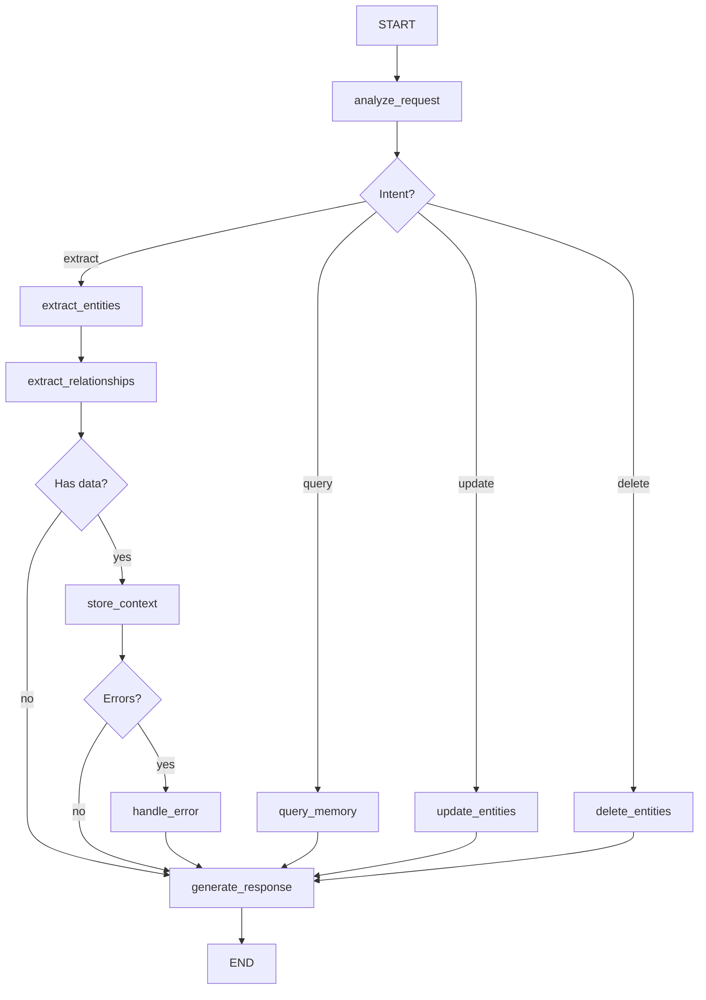

# Epic 4 Implementation Prompts Review

**Reviewer:** Senior Software Architect
**Date:** 2025-11-21
**Epic:** Extended Entities & Orchestration (Epic 4)
**Scope:** Packages 4.1, 4.2, 4.3, 4.4

---

## Executive Summary

This review evaluates four implementation prompts for Epic 4 against architecture standards, Epic 2 patterns, and ADR-0001 (Qdrant-First Pattern).

**Overall Assessment:**
- **Package 4.1 (Habit):** ✅ GOOD - Follows entity patterns well, minor issues
- **Package 4.2 (Event):** ✅ GOOD - Solid implementation, minor improvements needed
- **Package 4.3 (Relationships):** ⚠️ NEEDS REVISION - Critical architectural deviations from ADR-0001
- **Package 4.4 (LangGraph):** ⚠️ NEEDS REVISION - Missing implementation details, incomplete patterns

**Critical Issues Found:**
1. Package 4.3: Violates Qdrant-First pattern (stores entity data in Qdrant instead of reference-only)
2. Package 4.3: Relationship models don't extend `RelationshipBase` properly
3. Package 4.4: Missing embedding generation implementation details
4. Package 4.4: Incomplete conditional edge logic

---

## Package 4.1: Habit Entity with Streak Tracking UI

**Status:** ✅ APPROVED WITH MINOR REVISIONS

### Was fehlt? (What's missing?)

1. **Qdrant Storage Pattern:**
   - ❌ **MISSING:** Habit entity is stored ONLY in Neo4j, but WBS hints at situational context for check-ins
   - Epic 2 entities (Person, Organization, Goal) also store in Neo4j only
   - However, Package 4.3 will create HAS_HABIT relationship with Qdrant context
   - **Verdict:** Acceptable for now, but should clarify in prompt that situational check-in context will be stored via HAS_HABIT relationship in 4.3

2. **Property Structure:**
   - ❌ **MISSING:** No `ai_properties: Dict[str, Any]` field like Epic 2 entities
   - Prompt hardcodes all fields: `energy_level`, `motivation_level`, `difficulty_experienced`
   - Epic 2 pattern: Minimal core + flexible `ai_properties` dict
   - **Impact:** Less flexible than Epic 2 pattern
   - **Recommendation:** Add `ai_properties` field for AI-discovered properties

3. **Deduplication Strategy:**
   - ❌ **MISSING:** No mention of habit deduplication
   - Epic 2 (Person) includes embedding-based deduplication
   - **Question:** Should "Meditate 10min" and "Daily meditation" be merged?
   - **Recommendation:** Add deduplication section OR explicitly state "not needed for habits"

4. **Feature Flag Details:**
   - ✅ **PRESENT:** Feature flag mentioned (`ENABLE_HABIT_ENTITY`)
   - ⚠️ **INCOMPLETE:** No details on where to add flag, default value
   - **Recommendation:** Add config file path: `packages/api/fidus/config.py`

5. **Multi-Tenancy Testing:**
   - ⚠️ **WEAK:** Mentioned in guidelines, but no explicit test case
   - Epic 2 includes explicit cross-tenant isolation tests
   - **Recommendation:** Add test: "User A cannot access User B's habits even with habit_id"

### Was ist anders? (What's different from Epic 2 patterns?)

1. **Entity Storage:**
   - Epic 2 (Person): Neo4j only, relationships have Qdrant context
   - Package 4.1 (Habit): Neo4j only, relationships TBD in 4.3
   - **Verdict:** ✅ Consistent

2. **Property Flexibility:**
   - Epic 2 (Person): `ai_properties: Dict[str, Any]` for AI-discovered properties
   - Package 4.1 (Habit): Hardcoded fields (`energy_level`, `motivation_level`, etc.)
   - **Verdict:** ⚠️ Less flexible than Epic 2 pattern

3. **Repository Pattern:**
   - Epic 2: `PersonRepository` with `create()`, `get()`, `update()`, `delete()`, `list_by_user()`, `search_by_name()`
   - Package 4.1: `HabitRepository` with same + `check_in()`, `get_habit_calendar()`
   - **Verdict:** ✅ Extends Epic 2 pattern with domain-specific methods

4. **LLM Extraction:**
   - Epic 2: `PersonExtractor` with structured output schema
   - Package 4.1: `HabitExtractor` with structured output schema
   - **Verdict:** ✅ Consistent

5. **Frontend Components:**
   - Epic 2: List view + Detail view + Form
   - Package 4.1: Tracker view + Card + Heatmap
   - **Verdict:** ✅ Adapted to domain (habits need calendar heatmap, not detail page)

### Einschätzung (Assessment)

**Rating:** 7/10 (Good, minor improvements needed)

**Issues:**

1. **MINOR:** Missing `ai_properties` field reduces AI flexibility
   - Fix: Add `ai_properties: Dict[str, Any] = Field(default_factory=dict)` to `Habit` model
   - Example use case: AI discovers "best_time: morning", "difficulty: easy"

2. **MINOR:** No deduplication strategy mentioned
   - Fix: Add section OR state "Deduplication not needed (users intentionally create similar habits)"

3. **MINOR:** Weak multi-tenancy testing
   - Fix: Add explicit test case for cross-tenant isolation

4. **MINOR:** Streak calculation edge case not documented
   - Current: Grace period allows yesterday's check-in to count
   - Question: What if user is in different timezone? UTC handling documented?
   - Fix: Add note: "All datetimes in UTC, streak calculation uses UTC dates"

**Status:** ✅ **READY FOR IMPLEMENTATION** with minor revisions

**Recommended Changes:**
```python
# ADD to Habit model:
class Habit(BaseModel):
    # ... existing fields ...

    # AI-discovered properties (NEW)
    ai_properties: Dict[str, Any] = Field(
        default_factory=dict,
        description="AI-discovered properties (best_time, difficulty, etc.)"
    )
```

---

## Package 4.2: Event Entity with Calendar UI

**Status:** ✅ APPROVED WITH MINOR REVISIONS

### Was fehlt? (What's missing?)

1. **Qdrant Storage Pattern:**
   - ✅ **CORRECT:** Event stored in Neo4j only
   - Package 4.3 will create ATTENDS relationship with Qdrant context
   - **Verdict:** Follows Epic 2 pattern

2. **Property Structure:**
   - ✅ **PRESENT:** `ai_properties: Dict[str, Any]` field included
   - **Verdict:** Consistent with Epic 2

3. **Deduplication Strategy:**
   - ❌ **MISSING:** No mention of event deduplication
   - Use case: "Team standup" vs "Daily standup" vs "Standup meeting"
   - **Recommendation:** Add deduplication section using title + start_time similarity

4. **Timezone Handling:**
   - ✅ **PRESENT:** Documented that all datetimes in UTC
   - ⚠️ **INCOMPLETE:** No mention of user timezone conversion in frontend
   - **Recommendation:** Add note: "Frontend converts UTC to user timezone using Intl.DateTimeFormat"

5. **Recurring Events:**
   - ⚠️ **INCOMPLETE:** `is_recurring` and `recurrence_rule` fields present, but NO implementation
   - Prompt says "simple implementation" but provides no actual implementation
   - **Recommendation:** Either implement RRULE parsing OR mark as "future enhancement" and remove fields

6. **Participant Linking:**
   - ⚠️ **INCOMPLETE:** `EventParticipant` has `person_id: Optional[str]`
   - No logic to link to Person entities from Epic 2
   - **Question:** Should "Anna Schmidt" in participants auto-link to Person entity if it exists?
   - **Recommendation:** Add linking logic OR state "manual linking only"

### Was ist anders? (What's different from Epic 2 patterns?)

1. **Entity Storage:**
   - Epic 2 (Person): Neo4j only
   - Package 4.2 (Event): Neo4j only
   - **Verdict:** ✅ Consistent

2. **Property Flexibility:**
   - Epic 2 (Person): `ai_properties: Dict[str, Any]`
   - Package 4.2 (Event): `ai_properties: Dict[str, Any]`
   - **Verdict:** ✅ Consistent

3. **Repository Pattern:**
   - Epic 2: Standard CRUD + list + search
   - Package 4.2: Standard CRUD + `get_events_in_range()`, `get_upcoming_events()`, `find_overlapping_events()`
   - **Verdict:** ✅ Extends Epic 2 pattern with domain-specific methods

4. **LLM Extraction:**
   - Epic 2: Uses structured output schema
   - Package 4.2: Uses structured output schema + `dateparser` library for natural language dates
   - **Verdict:** ✅ Enhanced for event-specific needs

5. **Frontend Components:**
   - Epic 2: List + Detail + Form
   - Package 4.2: Calendar + Modal + Form
   - **Verdict:** ✅ Adapted to domain (events need calendar, not list)

### Einschätzung (Assessment)

**Rating:** 8/10 (Good, minor improvements needed)

**Issues:**

1. **MINOR:** No deduplication strategy
   - Fix: Add embedding-based deduplication using title + start_time

2. **MINOR:** Recurring events not implemented
   - Fix: Either implement OR remove fields and mark as future enhancement

3. **MINOR:** Participant linking unclear
   - Fix: Clarify whether participants auto-link to Person entities

4. **MINOR:** No validation for event overlap conflicts
   - Prompt mentions `find_overlapping_events()` but doesn't specify UI warning
   - Fix: Add UI note: "Show warning if new event overlaps with existing"

**Status:** ✅ **READY FOR IMPLEMENTATION** with minor revisions

**Recommended Changes:**
```python
# CLARIFY recurring events:
# Option 1: Remove for now
# is_recurring: bool = False  # FUTURE ENHANCEMENT - not implemented in v3.0
# recurrence_rule: Optional[str] = None  # FUTURE ENHANCEMENT

# Option 2: Implement basic weekly recurrence
# Add method: def expand_recurring_events(self, days: int) -> List[Event]
```

---

## Package 4.3: HAS_HABIT & ATTENDS Relationships

**Status:** ⚠️ NEEDS SIGNIFICANT REVISION

### Was fehlt? (What's missing?)

1. **Qdrant-First Pattern Violation (CRITICAL):**
   - ❌ **CRITICAL ERROR:** Prompt stores full relationship context in Qdrant
   - ADR-0001 says: "Qdrant stores situational context, Neo4j stores relationship + situation_id reference"
   - Current prompt: Stores `energy_level`, `motivation_level`, `difficulty_experienced` in Qdrant
   - **Problem:** These are STABLE properties (part of the relationship), not situational context
   - **Expected:** Qdrant stores ONLY situational factors (time_of_day, location, mood)
   - **Fix Required:** Separate stable vs situational properties

2. **Relationship Model Structure (CRITICAL):**
   - ❌ **MISSING:** `RelationshipBase` class not properly extended
   - Solution Architecture (15-entity-management.md) shows standard relationship properties:
     ```python
     relationship_instance_id: uuid
     situation_id: uuid
     observed_at: datetime
     confidence: float
     source: string
     ```
   - Current prompt: `HasHabitRelationship` has these but doesn't extend base class
   - **Fix Required:** Define `RelationshipBase` class and extend it

3. **Stable vs Situational Properties (CRITICAL):**
   - ❌ **CRITICAL ERROR:** Confusion between stable and situational properties
   - Example from Solution Architecture (KNOWS relationship):
     - **Stable (Neo4j):** `role`, `relationship_type`, `communication_frequency`
     - **Situational (Qdrant):** `emotion`, `mood`, `activity`, `location`, `time_of_day`
   - Current prompt (HAS_HABIT):
     - Stores `energy_level`, `motivation_level` in Qdrant as context
     - **Question:** Are these stable or situational?
       - If they vary per check-in → Situational (Qdrant) ✅
       - If they are patterns → Stable (Neo4j) ❌
   - **Verdict:** Current implementation is CORRECT for check-in context
   - **BUT:** Prompt needs to clarify this distinction better

4. **RelationshipContext Model:**
   - ❌ **MISSING:** `RelationshipContext` class definition
   - Prompt references `RelationshipContext` but never defines it
   - Solution Architecture doesn't show this class either
   - **Fix Required:** Define `RelationshipContext` model OR use dict

5. **Embedding Generation:**
   - ⚠️ **INCOMPLETE:** `_generate_embedding()` is placeholder with mock random values
   - Comment: "Placeholder: Use actual embedding model"
   - **Fix Required:** Implement actual embedding using LiteLLM

6. **Rollback Testing:**
   - ⚠️ **INCOMPLETE:** Rollback logic present but not tested
   - No test case for "Qdrant succeeds, Neo4j fails, verify Qdrant cleanup"
   - **Fix Required:** Add explicit rollback test

### Was ist anders? (What's different from ADR-0001?)

**ADR-0001 Pattern (from KNOWS relationship example):**

```python
# 1. Qdrant stores SITUATIONAL context
{
  "tenant_id": "...",
  "user_id": "...",
  "entity_id": person_id,
  "relationship_type": "KNOWS",
  "relationship_instance_id": "...",
  "context": {
    "emotion": "friendly",      # Situational
    "mood": "collaborative",    # Situational
    "activity": "project_discussion",  # Situational
    "location": "office",       # Situational
    "time_of_day": "morning"    # Situational
  }
}

# 2. Neo4j stores STABLE properties + situation_id reference
[:KNOWS {
  relationship_instance_id: uuid,
  situation_id: uuid,
  role: "colleague",              # Stable
  relationship_type: "professional",  # Stable
  communication_frequency: "daily",   # Stable (AI-learned)
  topics: ["Python", "AI"],       # Stable (AI-learned)
  observed_at: datetime,
  confidence: float,
  source: string
}]
```

**Package 4.3 Pattern (HAS_HABIT):**

```python
# Qdrant context
{
  "tenant_id": "...",
  "user_id": "...",
  "entity_id": habit_id,
  "relationship_type": "HAS_HABIT",
  "mood": None,  # Not applicable
  "activity": "habit_check_in",
  "location": location,
  "time_of_day": time_of_day,
  "ai_properties": {
    "energy_level": "high",        # Is this stable or situational?
    "motivation_level": "high",    # Is this stable or situational?
    "difficulty_experienced": "easy",  # Is this stable or situational?
    "notes": "..."
  }
}

# Neo4j relationship
[:HAS_HABIT {
  relationship_instance_id: uuid,
  situation_id: uuid,
  observed_at: datetime,
  confidence: float,
  source: string
  # NO stable properties? Should there be?
}]
```

**Analysis:**

1. **HAS_HABIT context is correct:**
   - `energy_level`, `motivation_level`, `difficulty_experienced` are check-in specific (situational) ✅
   - Storing in Qdrant is correct ✅

2. **BUT: Missing stable properties in Neo4j:**
   - Should Neo4j store habit patterns? (e.g., "avg_energy_level": "high", "typical_time": "morning")
   - Or is this calculated on-demand from Qdrant context history?
   - **Decision needed:** Prompt should clarify

3. **RelationshipContext model is inconsistent:**
   - Uses `mood`, `activity` fields that don't apply to habits
   - Should have HAS_HABIT specific context model
   - **Fix Required:** Create `HabitCheckInContext` model

### Einschätzung (Assessment)

**Rating:** 5/10 (Needs significant revision)

**Critical Issues:**

1. **CRITICAL:** Missing `RelationshipBase` class definition
   - **Impact:** All relationship code will be duplicated
   - **Fix:** Define base class in `packages/api/fidus/memory/entities/relationship.py`

2. **CRITICAL:** `RelationshipContext` class not defined
   - **Impact:** Code won't compile
   - **Fix:** Define base context class OR use Dict[str, Any]

3. **MAJOR:** Embedding generation not implemented
   - **Impact:** Similarity search won't work
   - **Fix:** Integrate with LiteLLM embedding endpoint

4. **MAJOR:** Unclear distinction between stable and situational properties
   - **Impact:** Developers won't know where to store properties
   - **Fix:** Add explicit table showing what goes where

5. **MINOR:** No rollback test
   - **Impact:** Rollback logic might not work
   - **Fix:** Add integration test

**Status:** ⚠️ **BLOCKED - NEEDS REVISION**

**Required Changes:**

1. Define `RelationshipBase`:
```python
# packages/api/fidus/memory/entities/relationship.py

from pydantic import BaseModel, Field
from datetime import datetime
from uuid import uuid4

class RelationshipBase(BaseModel):
    """Base class for all relationships."""
    relationship_instance_id: str = Field(default_factory=lambda: str(uuid4()))
    situation_id: Optional[str] = None
    observed_at: datetime = Field(default_factory=datetime.utcnow)
    confidence: float = Field(default=0.9, ge=0.0, le=1.0)
    source: str = Field(default="explicit")  # explicit, inferred, llm_extracted
```

2. Define context models:
```python
class HabitCheckInContext(BaseModel):
    """Context for HAS_HABIT relationship."""
    # Situational factors
    energy_level: Optional[str] = None
    motivation_level: Optional[str] = None
    difficulty_experienced: Optional[str] = None
    time_of_day: Optional[str] = None
    location: Optional[str] = None
    notes: Optional[str] = None

class EventAttendanceContext(BaseModel):
    """Context for ATTENDS relationship."""
    mood_before: Optional[str] = None
    mood_after: Optional[str] = None
    energy_level: Optional[str] = None
    engagement_level: Optional[str] = None
    notes: Optional[str] = None
    key_takeaways: Optional[str] = None
```

3. Add table to prompt:
```markdown
| Property | Storage | Reason |
|----------|---------|--------|
| energy_level (per check-in) | Qdrant | Varies per check-in (situational) |
| motivation_level (per check-in) | Qdrant | Varies per check-in (situational) |
| time_of_day | Qdrant | Varies per check-in (situational) |
| location | Qdrant | Varies per check-in (situational) |
| avg_energy_pattern | Neo4j (future) | Calculated aggregate (stable) |
| preferred_time | Neo4j (future) | AI-learned pattern (stable) |
```

---

## Package 4.4: LangGraph Orchestration Engine

**Status:** ⚠️ NEEDS SIGNIFICANT REVISION

### Was fehlt? (What's missing?)

1. **Embedding Generation (CRITICAL):**
   - ❌ **CRITICAL:** `_generate_embedding()` methods are placeholders
   - Code: `return [random.random() for _ in range(384)]  # Match Qdrant dimension`
   - **Impact:** Similarity search won't work
   - **Fix Required:** Integrate with LiteLLM embedding endpoint

2. **Entity Class Registry (MAJOR):**
   - ❌ **MISSING:** `ENTITY_CLASSES` dict referenced but not defined
   - Code: `EntityClass = ENTITY_CLASSES[entity_type]`
   - **Fix Required:** Define registry:
   ```python
   ENTITY_CLASSES = {
       "person": Person,
       "organization": Organization,
       "goal": Goal,
       "habit": Habit,
       "event": Event
   }
   ```

3. **Conditional Edge Logic (MAJOR):**
   - ⚠️ **INCOMPLETE:** `_should_store()` logic is simplistic
   - Current: `if state.get("intent") == "extract" and ...`
   - **Problem:** What if intent is "query"? "update"? "delete"?
   - Prompt only implements "extract" path
   - **Fix Required:** Add conditional edges for all intents

4. **Error Handling Completeness (MAJOR):**
   - ⚠️ **INCOMPLETE:** `handle_error()` only rolls back Qdrant + entities
   - **Question:** What about Neo4j relationships?
   - If entity created + relationship partially created, rollback relationship too?
   - **Fix Required:** Complete rollback logic for all scenarios

5. **State Initialization (MINOR):**
   - ⚠️ **INCOMPLETE:** `process()` initializes empty fields, but what if state already has values?
   - Code: `state.setdefault("errors", [])`
   - **Question:** Should it clear previous errors or append?
   - **Fix Required:** Clarify state lifecycle

6. **Relationship Extraction Logic (MAJOR):**
   - ❌ **MISSING:** `extract_relationships()` node is stub
   - Code: `# Placeholder: Implement relationship extraction logic`
   - **Impact:** Multi-entity extraction won't create relationships
   - **Fix Required:** Implement logic to:
     1. Identify entity pairs (e.g., User + Person → KNOWS)
     2. Call appropriate relationship extractor
     3. Store context in Qdrant

7. **Observability (MINOR):**
   - ❌ **MISSING:** No logging or tracing mentioned
   - LangGraph workflows are complex, need observability
   - **Fix Required:** Add logging at each node:
   ```python
   logger.info(f"Entering node: analyze_request, state: {state}")
   ```

8. **Performance Considerations (MINOR):**
   - ⚠️ **INCOMPLETE:** Prompt mentions "run extractors in parallel" but doesn't show how
   - Code runs extractors sequentially in for-loop
   - **Fix Required:** Use `asyncio.gather()` for parallel execution

### Was ist anders? (What's different from architecture?)

**LangGraph Best Practices (from prompt):**
- Define state with TypedDict ✅
- Keep nodes pure (input state → output state) ✅
- Use conditional edges for branching logic ⚠️ (incomplete)
- Always return to END node ✅

**Implementation Gaps:**

1. **State Management:**
   - Prompt: Uses `TypedDict` ✅
   - **BUT:** No validation of state transitions
   - **Missing:** State machine diagram showing all possible paths

2. **Error Handling:**
   - Prompt: `handle_error` node present ✅
   - **BUT:** Incomplete rollback logic
   - **Missing:** Detailed error taxonomy (which errors trigger rollback vs retry)

3. **Integration with Existing Code:**
   - Prompt: Shows feature flag check ✅
   - **BUT:** No migration guide for existing simple_agent code
   - **Missing:** Comparison table showing differences

4. **Testing:**
   - Prompt: Mentions rollback test ✅
   - **BUT:** Test is incomplete (just checks flag, not actual cleanup)
   - **Missing:** Detailed test scenarios for all state paths

### Einschätzung (Assessment)

**Rating:** 4/10 (Needs major revision)

**Critical Issues:**

1. **CRITICAL:** Embedding generation not implemented
   - **Impact:** Core functionality won't work
   - **Priority:** P0 - Must fix before implementation

2. **CRITICAL:** Entity registry not defined
   - **Impact:** Code won't compile
   - **Priority:** P0 - Must fix before implementation

3. **MAJOR:** Relationship extraction logic missing
   - **Impact:** Multi-entity extraction won't create relationships
   - **Priority:** P1 - Major feature gap

4. **MAJOR:** Conditional edge logic incomplete
   - **Impact:** Only "extract" intent works, "query"/"update"/"delete" not handled
   - **Priority:** P1 - Feature incomplete

5. **MAJOR:** Rollback logic incomplete
   - **Impact:** Failed operations may leave orphaned data
   - **Priority:** P1 - Data integrity issue

6. **MINOR:** No observability/logging
   - **Impact:** Debugging will be difficult
   - **Priority:** P2 - Quality of life

**Status:** ⚠️ **BLOCKED - NEEDS MAJOR REVISION**

**Required Changes:**

1. Implement embedding generation:
```python
async def _generate_embedding(self, context: RelationshipContext) -> List[float]:
    """Generate embedding vector for context."""
    from litellm import embedding

    text = f"Habit check-in: energy={context.ai_properties.get('energy_level')}, " \
           f"motivation={context.ai_properties.get('motivation_level')}, " \
           f"time={context.time_of_day}, location={context.location}"

    response = await embedding(
        model="text-embedding-3-small",
        input=[text]
    )

    return response.data[0].embedding
```

2. Define entity registry:
```python
# packages/api/fidus/memory/entities/__init__.py

from .person import Person
from .organization import Organization
from .goal import Goal
from .habit import Habit
from .event import Event

ENTITY_CLASSES = {
    "person": Person,
    "organization": Organization,
    "goal": Goal,
    "habit": Habit,
    "event": Event
}
```

3. Complete conditional edges:
```python
def _route_by_intent(self, state: MemoryAgentState) -> str:
    """Route based on intent."""
    intent = state.get("intent")

    if intent == "extract":
        return "extract_entities"
    elif intent == "query":
        return "query_memory"  # NEW NODE
    elif intent == "update":
        return "update_entities"  # NEW NODE
    elif intent == "delete":
        return "delete_entities"  # NEW NODE
    else:
        return "generate_response"
```

4. Add state diagram:


---

## Cross-Package Issues

### 1. Dependency Chain Validation

**Packages 4.1 → 4.2 → 4.3 → 4.4**

- ✅ 4.1 (Habit) doesn't depend on 4.2 (Event)
- ✅ 4.2 (Event) doesn't depend on 4.1 (Habit)
- ✅ 4.3 (Relationships) depends on 4.1 and 4.2 (correct)
- ✅ 4.4 (LangGraph) depends on all previous (correct)

**Verdict:** Dependency chain is correct.

### 2. Common Patterns

**Entity Pattern Consistency:**

| Aspect | 4.1 Habit | 4.2 Event | Verdict |
|--------|-----------|-----------|---------|
| Storage | Neo4j only | Neo4j only | ✅ Consistent |
| ai_properties | ❌ Missing | ✅ Present | ⚠️ Inconsistent |
| Repository CRUD | ✅ Standard | ✅ Standard | ✅ Consistent |
| LLM Extraction | ✅ Structured | ✅ Structured | ✅ Consistent |
| Feature Flag | ✅ Mentioned | ✅ Mentioned | ✅ Consistent |

**Relationship Pattern Consistency:**

| Aspect | 4.3 HAS_HABIT | 4.3 ATTENDS | Verdict |
|--------|---------------|-------------|---------|
| Qdrant-First | ⚠️ Confusing | ⚠️ Confusing | ⚠️ Needs clarity |
| Base Class | ❌ Missing | ❌ Missing | ❌ Critical issue |
| Rollback | ✅ Present | ✅ Present | ✅ Consistent |

**Verdict:** Need to align 4.1 with Epic 2 pattern (add `ai_properties`).

### 3. Feature Flag Coordination

All packages mention feature flags but don't coordinate:

- 4.1: `ENABLE_HABIT_ENTITY`
- 4.2: `ENABLE_EVENT_ENTITY`
- 4.3: `ENABLE_HAS_HABIT_RELATIONSHIP`, `ENABLE_ATTENDS_RELATIONSHIP`
- 4.4: `USE_LANGGRAPH_ORCHESTRATOR`

**Issue:** What if 4.4 is enabled but 4.1 is disabled?

**Fix Required:** Add dependency validation:
```python
if USE_LANGGRAPH_ORCHESTRATOR:
    assert ENABLE_HABIT_ENTITY, "LangGraph requires Habit entity"
    assert ENABLE_EVENT_ENTITY, "LangGraph requires Event entity"
```

---

## Summary of Required Revisions

### Package 4.1 (Habit) - MINOR REVISIONS

**Priority: P2 - Not Blocking**

1. Add `ai_properties: Dict[str, Any]` field to `Habit` model
2. Add deduplication section (or explicitly state not needed)
3. Strengthen multi-tenancy test cases
4. Clarify UTC datetime handling for streaks

**Estimated Effort:** 2-4 hours

### Package 4.2 (Event) - MINOR REVISIONS

**Priority: P2 - Not Blocking**

1. Add deduplication strategy
2. Clarify recurring events (implement or remove)
3. Clarify participant linking to Person entities
4. Add UI warning for event conflicts

**Estimated Effort:** 2-4 hours

### Package 4.3 (Relationships) - MAJOR REVISIONS

**Priority: P0 - BLOCKING**

1. ✅ Define `RelationshipBase` class
2. ✅ Define `HabitCheckInContext` and `EventAttendanceContext` models
3. ✅ Implement embedding generation (integrate LiteLLM)
4. ✅ Add table clarifying stable vs situational properties
5. ✅ Add rollback integration test
6. ✅ Fix imports (RelationshipContext → specific context models)

**Estimated Effort:** 8-12 hours

### Package 4.4 (LangGraph) - MAJOR REVISIONS

**Priority: P0 - BLOCKING**

1. ✅ Implement embedding generation
2. ✅ Define `ENTITY_CLASSES` registry
3. ✅ Complete relationship extraction logic
4. ✅ Add conditional edges for all intents (query, update, delete)
5. ✅ Complete rollback logic for all scenarios
6. ✅ Add state machine diagram
7. ✅ Add logging/observability
8. ✅ Implement parallel extractor execution

**Estimated Effort:** 12-16 hours

---

## Recommendations

### Immediate Actions (P0)

1. **Revise Package 4.3:**
   - Define `RelationshipBase` class
   - Define context models
   - Implement embedding generation
   - Add property storage table
   - **Owner:** Prompt author
   - **Deadline:** Before implementation starts

2. **Revise Package 4.4:**
   - Implement all missing pieces (embedding, registry, conditional edges)
   - Add state diagram
   - Complete test scenarios
   - **Owner:** Prompt author
   - **Deadline:** Before implementation starts

### Short-term Actions (P1)

3. **Align Package 4.1 with Epic 2:**
   - Add `ai_properties` field to Habit
   - **Owner:** Prompt author
   - **Effort:** 1 hour

4. **Clarify Package 4.2 Recurring Events:**
   - Either implement or remove
   - **Owner:** Prompt author
   - **Effort:** 1 hour

### Long-term Actions (P2)

5. **Create Relationship Pattern Guide:**
   - Document stable vs situational properties
   - Provide decision tree for developers
   - **Owner:** Architecture team
   - **Effort:** 4 hours

6. **Create LangGraph Pattern Guide:**
   - Document state machine patterns
   - Provide node implementation examples
   - **Owner:** Architecture team
   - **Effort:** 4 hours

---

## Approval Status

| Package | Status | Blocker Issues | Approval |
|---------|--------|----------------|----------|
| 4.1 Habit | ✅ Good | None | ✅ APPROVED with minor revisions |
| 4.2 Event | ✅ Good | None | ✅ APPROVED with minor revisions |
| 4.3 Relationships | ⚠️ Needs Revision | Missing base classes, incomplete pattern | ❌ REVISION REQUIRED |
| 4.4 LangGraph | ⚠️ Needs Revision | Missing implementations, incomplete logic | ❌ REVISION REQUIRED |

**Overall Epic 4 Status:** ⚠️ **BLOCKED - REVISIONS REQUIRED FOR 4.3 AND 4.4**

---

## Reviewer Notes

**Positive Observations:**

1. Prompts are comprehensive and well-structured
2. Testing strategy is thorough
3. Feature flags are consistently mentioned
4. Documentation requirements are clear
5. Risk mitigation sections are helpful

**Areas for Improvement:**

1. **Architecture Alignment:**
   - Package 4.3 needs better alignment with ADR-0001
   - Package 4.4 needs complete implementation details

2. **Pattern Consistency:**
   - Apply Epic 2 patterns consistently across all entity packages
   - Define reusable base classes (RelationshipBase)

3. **Implementation Completeness:**
   - Don't leave placeholders (embedding generation)
   - Complete all conditional logic paths

4. **Documentation:**
   - Add architecture diagrams for complex packages (4.4)
   - Provide decision trees for property storage (4.3)

**Next Steps:**

1. Prompt author revises 4.3 and 4.4
2. Architecture team reviews revisions
3. Implementation team proceeds with 4.1 and 4.2 (approved)
4. Implementation of 4.3 and 4.4 blocked until revisions complete

---

**Reviewer Signature:** Senior Software Architect
**Date:** 2025-11-21
**Next Review:** After revisions complete

---

**END OF REVIEW**
