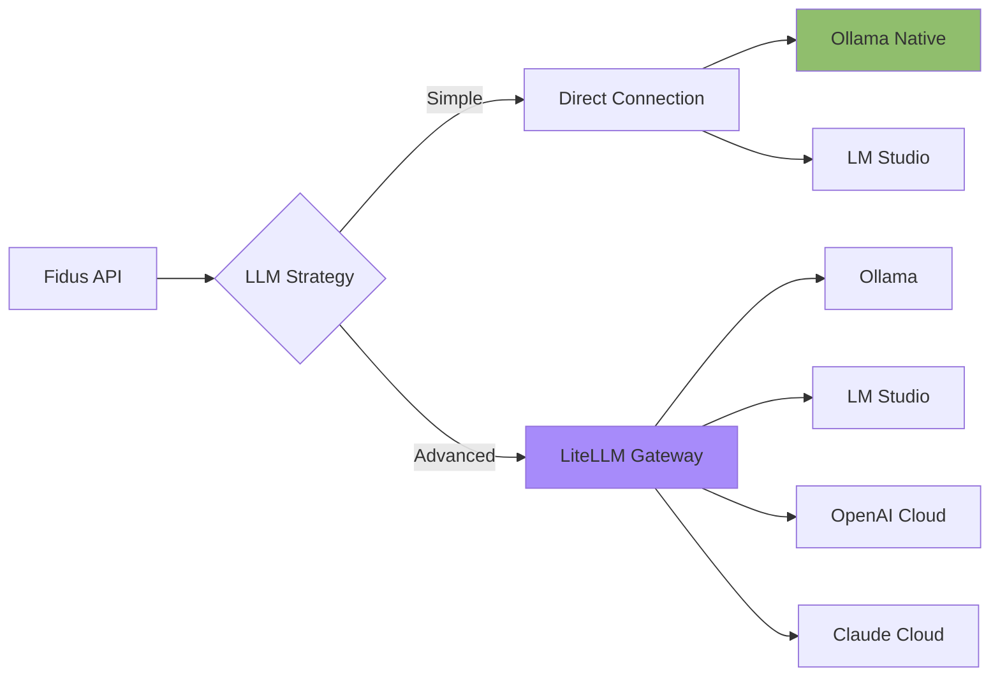
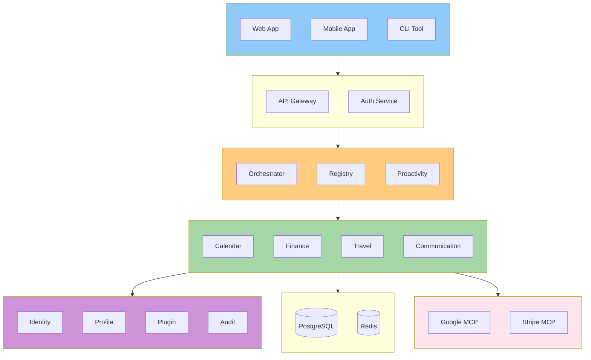

# Executive Summary

**Version:** 1.0
**Date:** 2025-10-27
**Status:** Draft (Awaiting Human Review)
**Part of:** Fidus Solution Architecture
**Author:** AI-Generated

---

## System Overview

**Fidus** is a privacy-first, AI-powered personal assistant built on a **multi-agent architecture** using **Domain-Driven Design** principles. The system coordinates specialized **AI agents** (called Supervisors) across 8 life domains (Calendar, Finance, Travel, Communication, Health, Home, Shopping, Learning) to provide proactive assistance while maintaining strict user privacy and data sovereignty.

Each **Supervisor** is an autonomous AI agent with its own LangGraph-based "brain" for multi-step reasoning, embedded within an MCP Server for standardized communication. This creates a true **multi-agent system** where domain-specialized agents collaborate via an **event-driven backbone** to solve complex, cross-domain tasks. All inter-agent communication follows the **HTTP + Server-Sent Events (SSE)** protocol, enabling real-time coordination between agents.

Built with **privacy by design**, Fidus defaults to local LLM processing (Ollama) while offering optional cloud LLMs for users who prioritize convenience over privacy.

---

## Core Architecture Decisions

### 1. Multi-Agent Architecture with Dynamic Registry

**Decision:** Each life domain is implemented as an autonomous **AI Agent** (Supervisor) with its own LangGraph-based reasoning engine, embedded within an MCP Server for standardized communication.

**What is a Supervisor?**
- **AI Agent Core:** LangGraph state machine for multi-step reasoning and decision-making
- **MCP Server Wrapper:** Standardized HTTP + SSE interface for communication
- **Domain Expertise:** Specialized knowledge and tools for one life domain
- **Autonomous Operation:** Makes decisions independently within its domain

**Multi-Agent Coordination:**
- **Orchestrator:** Meta-agent that coordinates domain agents
- **Agent Discovery:** Admin adds agents via UI, orchestrator connects dynamically
- **Agent Collaboration:** Agents communicate via domain events (async)
- **Multi-Agent Scenarios:** Orchestrator chains agents for complex tasks

**Example Multi-Agent Flow:**
```
User: "Book flight to Berlin and block time in calendar"

Orchestrator (Meta-Agent):
→ Analyzes: Needs Travel Agent + Calendar Agent
→ Strategy: Sequential (Travel first, then Calendar)

Travel Agent:
→ Reasoning: Search flights → Select best option → Book
→ Emits: TripBooked event

Calendar Agent:
→ Receives: TripBooked event
→ Reasoning: Find free slots → Create appointment
→ Emits: AppointmentCreated event

Result: Flight booked + Calendar updated
```

**Rationale:**
- **Intelligence:** Each agent is an expert in its domain
- **Scalability:** Agents can be deployed and scaled independently
- **Extensibility:** New agents can be added without modifying existing ones (Principle 2)
- **Resilience:** Agent failure doesn't affect other agents

**Implementation:**
- Orchestrator = Meta-agent (MCP Client) with LangGraph
- Supervisors = Domain agents (MCP Servers) with LangGraph
- Admin-driven agent registration via UI
- Event-driven inter-agent communication

---

### 2. LLM-Driven Logic (No Hard-Coded Rules)

**Decision:** ALL business logic decisions (intent detection, routing, relevance assessment) are made by LLMs, not hard-coded rules.

**Rationale:**
- **Flexibility:** System adapts to natural language variations without code changes
- **Intelligence:** LLM understands context, nuance, and user intent
- **Evolvability:** New capabilities emerge through prompt engineering, not code rewrites

**Implementation:**
- Orchestrator uses LLM for intent detection and routing
- Supervisors use LangGraph state machines with LLM-driven decision nodes
- Dynamic prompt generation based on available Supervisors (Principle 2)

---

### 3. Event-Driven Communication via BullMQ

**Decision:** Supervisors communicate asynchronously via domain events through BullMQ (reliable message queue) backed by Redis.

**Rationale:**
- **Loose Coupling:** Supervisors don't need to know about each other (Principle 3)
- **Reliability:** At-least-once delivery for critical business events
- **Proactivity:** Events enable signal detection and proactive suggestions
- **Auditability:** All events logged for EU AI Act compliance

**Implementation:**
- Critical events → BullMQ queues (reliable, persistent)
- Non-critical notifications → Redis Pub/Sub (fast, ephemeral)
- Event Store → PostgreSQL (append-only, immutable)

---

### 4. Privacy-First with Local LLM (Multiple Options)

**Decision:** Local LLM as default (Ollama or LM Studio), cloud LLMs (OpenAI, Anthropic) as optional upgrade, with LiteLLM as unified gateway for production.

**LLM Deployment Options:**

1. **Ollama (Native on Host)** - *Recommended for Production*
   - Best performance (10-20% faster than Docker)
   - Direct GPU access without Docker GPU passthrough
   - Headless operation for servers
   - Lowest memory overhead

2. **LM Studio (Native with GUI)** - *Recommended for Development*
   - Visual model browser and management
   - Built-in chat UI for testing
   - Real-time performance monitoring
   - Multi-platform (Windows, macOS, Linux)

3. **All-in-Docker** - *Recommended for Quick Start*
   - Single docker-compose command
   - All services isolated
   - Simple backup/restore

4. **LiteLLM Gateway** - *Recommended for Enterprise*
   - Unified API for all providers (Ollama, LM Studio, OpenAI, Claude)
   - Automatic load balancing and fallbacks
   - Cost tracking and budget management
   - Response caching to save tokens
   - Admin dashboard with monitoring

**Rationale:**
- **Privacy:** Data never leaves user's device with local LLM (Principle 4)
- **Performance:** Native Ollama provides 10-20% better performance than Docker
- **Usability:** LM Studio offers GUI for users who prefer visual tools
- **Flexibility:** LiteLLM enables multi-provider support with unified API
- **Data Sovereignty:** User controls where their data is processed
- **Compliance:** GDPR-friendly, no third-party data sharing by default
- **Cloud Fallback:** Cloud LLMs available as opt-in fallback for peak loads

**Implementation:**
- LLM Provider Interface abstracts local vs. cloud
- Community Edition → Local LLM default (Ollama or LM Studio)
- Cloud Edition → Cloud LLM with local option
- Enterprise → LiteLLM Gateway with multi-provider support
- Privacy Proxy filters PII when calling cloud LLMs (optional)

**Architecture Decision:**


---

### 5. Admin-Driven Supervisor Management

**Decision:** Administrators add Supervisors via UI, Orchestrator connects to them using HTTP + SSE.

**Rationale:**
- **Security:** Admin controls which Supervisors are trusted
- **Flexibility:** Supervisors can run anywhere (local, remote, cloud)
- **Multi-Tenancy:** Each tenant can have different Supervisors
- **Auditability:** Track who added which Supervisor and when

**Implementation:**
- Admin provides: Supervisor name, endpoint, credentials
- Backend stores encrypted credentials
- Orchestrator establishes SSE connection and calls `/messages` endpoint
- Dynamic Registry updates, prompt cache invalidated (Principle 2)

---

### 6. Multi-Database Strategy

**Decision:** Use specialized databases for different data types instead of a single monolithic database.

**Rationale:**
- **Performance:** Each database optimized for its use case
- **Scalability:** Scale databases independently
- **Flexibility:** Choose best tool for each job

**Implementation:**
| Database | Use Case | Examples |
|----------|----------|----------|
| **PostgreSQL** | Transactional data, audit logs | Appointments, transactions, users |
| **Neo4j** | Relationships, preferences | User profiles, preference graph |
| **Qdrant** | Semantic search, embeddings | User context, document search |
| **Redis** | Caching, sessions, event bus | Session storage, BullMQ backend |

---

## Technology Stack

### Frontend

| Technology | Version | Purpose |
|-----------|---------|---------|
| **Next.js** | 14+ (App Router) | React framework with SSR |
| **React** | 18+ | UI library |
| **TypeScript** | 5+ | Type safety |
| **Tailwind CSS** | 3+ | Utility-first CSS |
| **Zustand** | 4+ | Client state management |

### Backend

| Technology | Version | Purpose |
|-----------|---------|---------|
| **FastAPI** | 0.100+ | Python async web framework |
| **LangGraph** | Latest | State machines for agents |
| **Pydantic** | 2+ | Data validation |
| **Prisma** | 5+ | Database ORM |

### LLM & AI

| Technology | Version | Purpose |
|-----------|---------|---------|
| **Ollama** | Latest | Local LLM inference (Primary) |
| **LM Studio** | Latest | Alternative local LLM with GUI |
| **LiteLLM** | Latest | Unified LLM Gateway (Optional) |
| **Llama 3.1** | 8B/70B | Default local model |
| **OpenAI SDK** | Latest | Optional cloud LLM |
| **Anthropic SDK** | Latest | Optional cloud LLM |

**LLM Deployment Options:**
- **Ollama (Native):** Best performance, production-ready, headless
- **LM Studio:** GUI for development, visual model management
- **LiteLLM Gateway:** Multi-provider support, cost tracking, fallbacks
- **Cloud LLMs:** Optional fallback with user opt-in (privacy-first)

### Integration & Communication

| Technology | Version | Purpose |
|-----------|---------|---------|
| **MCP SDK** | Latest | Model Context Protocol |
| **HTTP + SSE** | Standard | Transport layer |
| **BullMQ** | 4+ | Reliable message queue |
| **Socket.IO** | 4+ | Real-time websockets (UI) |

### Databases

| Database | Version | Purpose |
|----------|---------|---------|
| **PostgreSQL** | 15+ | Primary transactional DB |
| **Neo4j** | 5+ | Graph database (relationships) |
| **Qdrant** | 1.7+ | Vector database (embeddings) |
| **Redis** | 7+ | Cache, sessions, event bus |

### DevOps & Deployment

| Technology | Version | Purpose |
|-----------|---------|---------|
| **Docker** | 24+ | Containerization |
| **Docker Compose** | 2+ | Local orchestration |
| **Kubernetes** | 1.28+ | Production orchestration |
| **GitHub Actions** | N/A | CI/CD pipeline |

---

## Deployment Options

### Community Edition (Self-Hosted)

**Target:** Individuals, developers, privacy enthusiasts

Fidus Community Edition bietet **fünf Deployment-Varianten** für unterschiedliche Performance- und Usability-Anforderungen:

#### Variante 1: All-in-Docker (Einfachste Installation)

**Deployment:**
- Single Docker Compose file
- Alle Services inkl. Ollama in Docker
- Ein Command zum Starten

**Vorteile:**
- ✅ Schnellste Installation
- ✅ Alle Services isoliert
- ✅ Einfaches Backup/Restore

**Nachteile:**
- ⚠️ LLM-Performance 10-20% langsamer
- ⚠️ GPU-Zugriff komplexer

**Installation:**
```bash
git clone https://github.com/y-core-engineering/fidus.git
cd fidus
docker-compose up -d
# Access at http://localhost:3000
```

#### Variante 2: Hybrid (Ollama Native) - **EMPFOHLEN für Production**

**Deployment:**
- Ollama läuft nativ auf Host
- Rest der Services in Docker
- Optimale LLM-Performance

**Vorteile:**
- ✅ **10-20% schnellere LLM-Performance**
- ✅ **Direkter GPU-Zugriff** (kein Docker GPU Passthrough)
- ✅ **Geringerer Memory Overhead**
- ✅ Production-ready

**Installation:**
```bash
# 1. Ollama nativ installieren
curl -fsSL https://ollama.com/install.sh | sh
ollama pull llama3.1:8b

# 2. Fidus starten (ohne Ollama Container)
git clone https://github.com/y-core-engineering/fidus.git
cd fidus
docker-compose -f docker-compose.hybrid.yml up -d
# Access at http://localhost:3000
```

#### Variante 3: Hybrid (LM Studio) - **EMPFOHLEN für Development**

**Deployment:**
- LM Studio Desktop App auf Host
- GUI für Modell-Management
- OpenAI-kompatible API
- Rest der Services in Docker

**Vorteile:**
- ✅ **Grafische Benutzeroberfläche**
- ✅ **Visual Model Browser & Management**
- ✅ **Built-in Chat UI zum Testen**
- ✅ **Real-time Performance Monitoring**
- ✅ Multi-Plattform (Windows, macOS, Linux)

**Installation:**
```bash
# 1. LM Studio installieren von https://lmstudio.ai/
# 2. Modell in LM Studio herunterladen
# 3. Local Server starten (Port 1234)
# 4. Fidus starten
git clone https://github.com/y-core-engineering/fidus.git
cd fidus
docker-compose -f docker-compose.hybrid.yml --env-file .env.lmstudio up -d
```

#### LLM Abstraction Layer: LiteLLM (Optional, Production)

**Für Production Deployments mit Multi-Provider-Support:**

LiteLLM als unified Gateway für alle LLM-Provider (Ollama, LM Studio, OpenAI, Claude):

**Features:**
- ✅ Single OpenAI-compatible API für alle Provider
- ✅ Automatisches Load Balancing & Fallback
- ✅ Cost Tracking & Budget Management
- ✅ Response Caching (spart Tokens)
- ✅ Privacy Proxy für Cloud-LLMs
- ✅ Admin Dashboard mit Real-time Monitoring

**Installation:**
```bash
# Ollama auf Host + LiteLLM in Docker
docker-compose -f docker-compose.litellm.yml up -d
# Access Dashboard: http://localhost:4001
```

**Use Cases:**
- Multiple LLM-Provider unterstützen
- Cloud-LLMs als Fallback (opt-in)
- Cost Control für Cloud-LLMs
- Enterprise Multi-Tenancy

#### Variante 4: Development Setup (Local LLM) - **EMPFOHLEN für Contributors**

**Deployment:**
- App-Code (Web + API) läuft nativ auf Host
- Dependencies (DBs) in Docker
- Ollama/LM Studio nativ auf Host
- Hot-Reload für Backend & Frontend
- Full IDE Debugging Support

**Vorteile:**
- ✅ **Instant Hot-Reload** - Keine Docker-Rebuilds
- ✅ **Source-Level Debugging** - Breakpoints in VS Code/PyCharm
- ✅ **Schnelle Test-Iteration** - TDD-friendly
- ✅ **Native Performance** - Kein Docker-Overhead
- ✅ **100% Privacy** - Alle Daten lokal
- ✅ **Keine API-Kosten** - Kostenlos

**Installation:**
```bash
# 1. Dependencies in Docker
docker-compose -f docker-compose.dev-deps.yml up -d

# 2. Ollama nativ
ollama serve && ollama pull llama3.1:8b

# 3. Backend (Python/FastAPI)
cd packages/api
poetry install
poetry run uvicorn fidus.main:app --reload

# 4. Frontend (Next.js)
cd packages/web
pnpm install && pnpm dev

# Access at http://localhost:3000
# API Docs at http://localhost:8000/docs
```

#### Variante 5: Development Setup (Cloud LLM) - **EMPFOHLEN für GPU-freie Entwickler**

**Deployment:**
- App-Code (Web + API) läuft nativ auf Host
- Dependencies (DBs) + LiteLLM Gateway in Docker
- Cloud-LLMs (ChatGPT, Claude) via LiteLLM
- Hot-Reload für Backend & Frontend
- Full IDE Debugging Support

**Vorteile:**
- ✅ **Keine GPU nötig** - Cloud-LLMs laufen remote
- ✅ **Beste LLM-Qualität** - GPT-4o, Claude 3.5 Sonnet
- ✅ **Multi-Provider Support** - Einfacher Switch zwischen LLMs
- ✅ **Cost Tracking** - Budget-Control via LiteLLM Dashboard
- ✅ **Response Caching** - 50-80% Kostenersparnis
- ✅ **Fallback-Chains** - Automatischer Fallback bei Ausfall

**Installation:**
```bash
# 1. API Keys holen (OpenAI, Anthropic)
# OpenAI: https://platform.openai.com/api-keys
# Anthropic: https://console.anthropic.com/

# 2. Dependencies + LiteLLM in Docker
docker-compose -f docker-compose.dev-cloud.yml --env-file .env.dev.cloud up -d

# 3. Backend (Python/FastAPI)
cd packages/api
poetry install
export $(cat ../../.env.dev.cloud | xargs)
poetry run uvicorn fidus.main:app --reload

# 4. Frontend (Next.js)
cd packages/web
pnpm install && pnpm dev

# Access at http://localhost:3000
# LiteLLM Dashboard: http://localhost:4001
```

**Kosten:** $5-40/Monat je nach Nutzung (mit Caching: -50-80%)

**Infrastructure Requirements:**

| Variante | Min RAM | Min CPU | Min Storage | GPU | Kosten | Setup | Use Case |
|----------|---------|---------|-------------|-----|--------|-------|----------|
| All-in-Docker | 16GB | 4 cores | 50GB | Optional | Gratis | ⭐⭐ Einfach | Quick Start, Testing |
| Ollama Native | 16GB | 8 cores | 100GB | Empfohlen | Gratis | ⭐⭐⭐ Mittel | Production |
| LM Studio | 16GB | 8 cores | 100GB | Empfohlen | Gratis | ⭐ Sehr einfach | Development, GUI |
| LiteLLM Gateway | 16GB | 8 cores | 100GB | Empfohlen | Gratis | ⭐⭐⭐ Mittel | Enterprise, Multi-Provider |
| **Dev (Local LLM)** | **16GB** | **8 cores** | **100GB** | **Empfohlen** | **Gratis** | **⭐⭐⭐ Mittel** | **Active Dev (Privacy)** |
| **Dev (Cloud LLM)** | **16GB** | **8 cores** | **100GB** | **❌ Nicht nötig** | **$5-40/mo** | **⭐⭐ Einfach** | **Active Dev (Quality)** |

---

### Cloud Edition (Managed)

**Target:** Families, small teams, users who want convenience

**Deployment:**
- Kubernetes cluster (AWS EKS, Google GKE, Azure AKS)
- Managed databases (RDS, Cloud SQL, etc.)
- Auto-scaling enabled
- Cloud LLM as default (with local option)

**Pricing Tiers:**
- **Free:** Cloud LLM, 1 user, 100 requests/day
- **Starter ($29/mo):** Local LLM option, 1 user, unlimited requests
- **Family ($49/mo):** Up to 5 users, shared resources
- **Team ($99/mo):** Up to 20 users, SSO, admin controls

**Infrastructure:**
- Auto-scaling from 3 to 50 nodes
- Multi-region for high availability
- CDN for global performance
- Automated backups

---

### Enterprise Edition (Hybrid/On-Premise)

**Target:** Companies, regulated industries, air-gapped environments

**Deployment:**
- On-premise Kubernetes or Docker Swarm
- Air-gapped option available
- SSO integration (SAML, OAuth)
- Advanced access controls

**Features:**
- Bring-your-own LLM
- Custom Supervisors
- Audit log export
- Compliance reports (GDPR, SOC 2)

**Infrastructure:**
- Customizable (based on user count)
- High availability (3+ replicas per service)
- Backup & disaster recovery included

---

## System Architecture (High-Level)



---

## Key Performance Indicators

### Performance Targets

| Metric | Target | Measurement |
|--------|--------|-------------|
| **User Request Latency** | < 2 seconds | p95 response time |
| **Event Processing** | < 500ms | Event to reaction time |
| **Proactive Suggestion** | < 5 seconds | Signal detection to notification |
| **LLM Response** | < 3 seconds | Ollama 8B local inference |
| **API Throughput** | 1000 req/s | Per orchestrator instance |

### Scalability Targets

| Edition | Users | Requests/Day | Horizontal Scaling |
|---------|-------|--------------|-------------------|
| **Community** | 1-5 | Unlimited | Single node |
| **Cloud Starter** | 1 | Unlimited | Auto-scale 1-3 nodes |
| **Cloud Family** | 5 | Unlimited | Auto-scale 3-10 nodes |
| **Cloud Team** | 20 | Unlimited | Auto-scale 5-20 nodes |
| **Enterprise** | 100+ | Unlimited | Custom (10-100+ nodes) |

### Availability Targets

| Edition | SLA | Downtime/Month | Support |
|---------|-----|----------------|---------|
| **Community** | Best effort | N/A | Community forum |
| **Cloud Free** | 99.0% | ~7 hours | Email (48h response) |
| **Cloud Starter** | 99.5% | ~3.6 hours | Email (24h response) |
| **Cloud Family/Team** | 99.9% | ~43 minutes | Email + Chat (12h response) |
| **Enterprise** | 99.95% | ~21 minutes | 24/7 phone + dedicated account manager |

---

## Security & Compliance

### Privacy Architecture

**Data Residency:**
- Community Edition: All data local (user's device/server)
- Cloud Edition: Data in user-selected region (EU, US, Asia)
- Enterprise Edition: Customer-controlled (on-premise or private cloud)

**Encryption:**
- At-rest: AES-256 for all databases
- In-transit: TLS 1.3 for all HTTP communication
- Credentials: Encrypted with tenant-specific keys

**Data Minimization:**
- Privacy Proxy filters PII before sending to cloud LLMs
- Optional prompt logging (disabled by default)
- Automatic data retention cleanup (90 days default, configurable)

### Compliance

**EU AI Act (in force since Feb 2, 2025):**
- ✅ Transparency: All AI decisions logged with reasoning
- ✅ User information: Clear labeling as AI system
- ✅ Risk classification: Limited Risk (not high-risk)
- ✅ Explainability: "Why did you do that?" feature

**GDPR:**
- ✅ Right to erasure: User can delete all data
- ✅ Data portability: Export in JSON format
- ✅ Consent management: Granular privacy settings
- ✅ Audit trail: All data access logged

**Other:**
- ISO 27001 ready (Enterprise Edition)
- SOC 2 Type II (Cloud Edition, in progress)
- HIPAA compliance (on roadmap for Health domain)

---

## Quality Attributes

### Maintainability

**Architecture Patterns:**
- Domain-Driven Design (clear boundaries)
- Event-Driven Architecture (loose coupling)
- Hexagonal Architecture (ports & adapters)
- Plugin Architecture (extensibility)

**Code Quality:**
- TypeScript for type safety
- Pydantic for runtime validation
- ESLint + Prettier for consistent formatting
- Pre-commit hooks for quality gates
- > 80% test coverage target

### Observability

**Logging:**
- Structured JSON logs
- Log levels: DEBUG, INFO, WARN, ERROR
- Correlation IDs for distributed tracing

**Monitoring:**
- Prometheus for metrics
- Grafana for dashboards
- Alerting via PagerDuty (Cloud/Enterprise)

**Tracing:**
- OpenTelemetry for distributed tracing
- Jaeger for trace visualization

---

## Success Criteria

### MVP (Phase 1) - Q2 2025

**Must Have:**
- ✅ Orchestrator with intent detection
- ✅ 3 Domain Supervisors (Calendar, Finance, Travel)
- ✅ MCP integration (Google Calendar, Stripe)
- ✅ Basic proactivity (5+ signals)
- ✅ Web UI (Next.js)
- ✅ Community Edition (Docker Compose)
- ✅ Local LLM (Ollama) working

**Success Metrics:**
- 100 alpha users
- < 2s response time (p95)
- 80% test coverage
- 0 critical security vulnerabilities

### Phase 2 - Q3 2025

**Features:**
- ✅ 5 more Domain Supervisors (Communication, Health, Home, Shopping, Learning)
- ✅ Cloud Edition (Kubernetes)
- ✅ Multi-user support (Family Tier)
- ✅ Plugin marketplace (MVP)
- ✅ Mobile app (React Native)

**Success Metrics:**
- 1,000 beta users
- 99.5% uptime (Cloud Edition)
- 50+ community plugins
- < 500ms event processing

### Phase 3 - Q4 2025

**Features:**
- ✅ Enterprise Edition
- ✅ Advanced proactivity (learning from user feedback)
- ✅ Voice interface
- ✅ Offline mode
- ✅ AI Act compliance certification

**Success Metrics:**
- 10,000 active users
- 10 enterprise customers
- 99.9% uptime
- GDPR compliance audit passed

---

## Next Steps

### For Reviewers

1. **Read:** [02-architecture-principles.md](02-architecture-principles.md) to understand the "why"
2. **Review:** [03-component-architecture.md](03-component-architecture.md) for implementation details
3. **Validate:** [12-review-checklist.md](12-review-checklist.md) for completeness

### For Developers

1. **Understand:** [05-data-flows.md](05-data-flows.md) for visual architecture
2. **Choose:** [06-technology-decisions.md](06-technology-decisions.md) for tech stack rationale
3. **Implement:** Start with Calendar Supervisor (simplest domain)

### For Product Managers

1. **Roadmap:** This executive summary outlines MVP → Phase 3
2. **Pricing:** Free, Starter ($29), Family ($49), Team ($99), Enterprise (custom)
3. **Competition:** See business documentation for differentiation

---

## References

**Architecture Documentation:**
- [../architecture/00-core-principles.md](../architecture/00-core-principles.md) - The 5 Core Principles
- [../architecture/README.md](../architecture/README.md) - Architecture overview

**Domain Model:**
- [../domain-model/README.md](../domain-model/README.md) - DDD overview
- [../domain-model/02-bounded-contexts.md](../domain-model/02-bounded-contexts.md) - 14 Bounded Contexts

**Solution Architecture:**
- [README.md](README.md) - Navigation and document index

---

**Version History:**
- v1.0 (2025-10-27): Initial draft

---

**End of Executive Summary**
