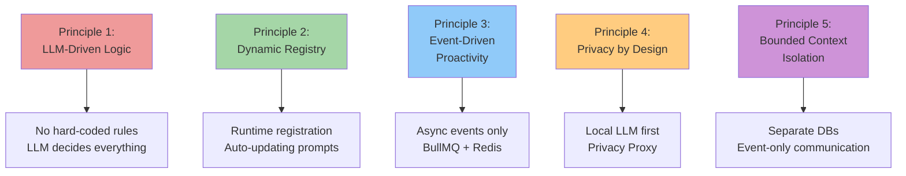
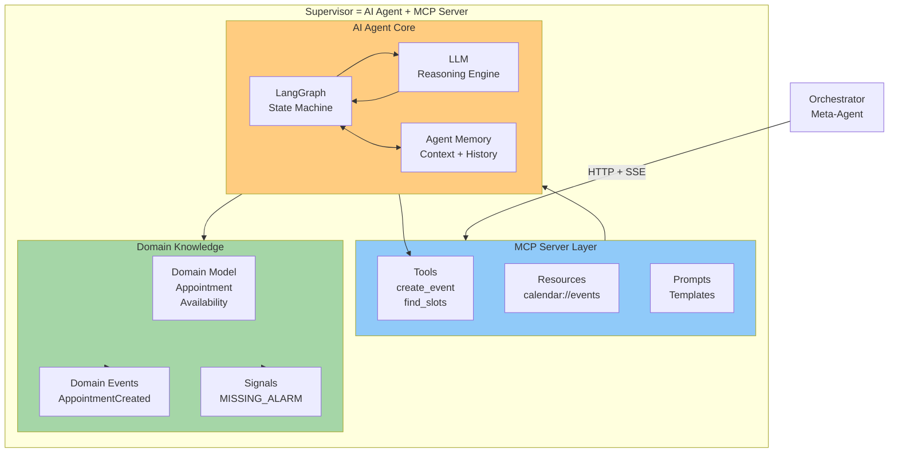
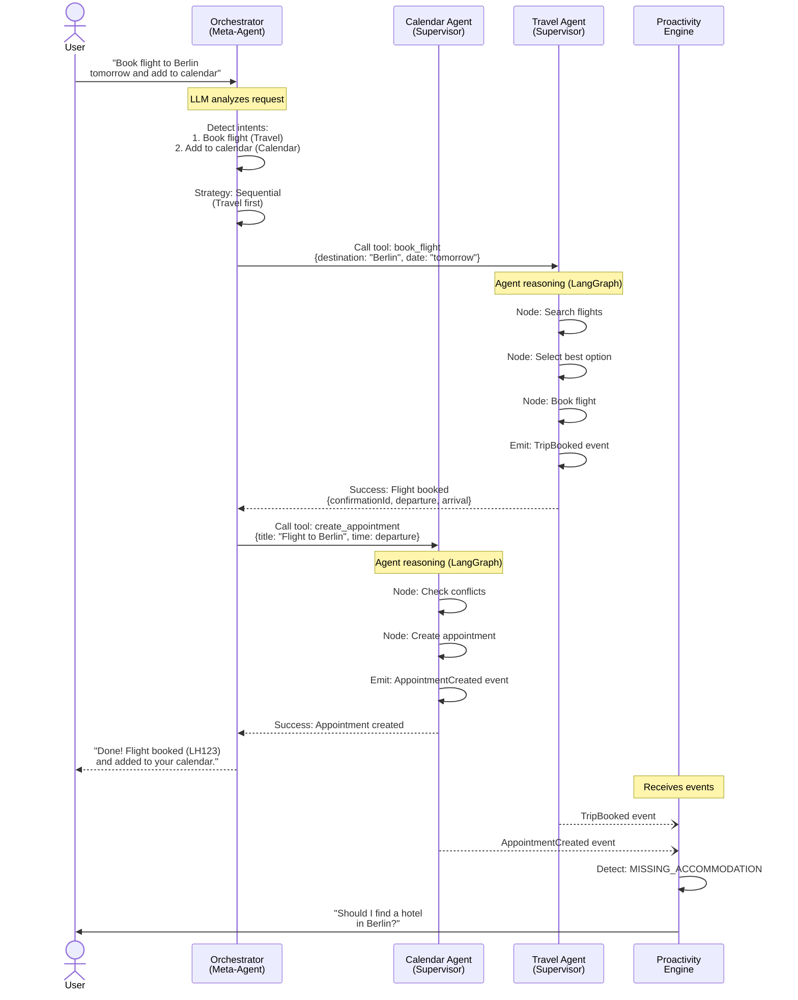
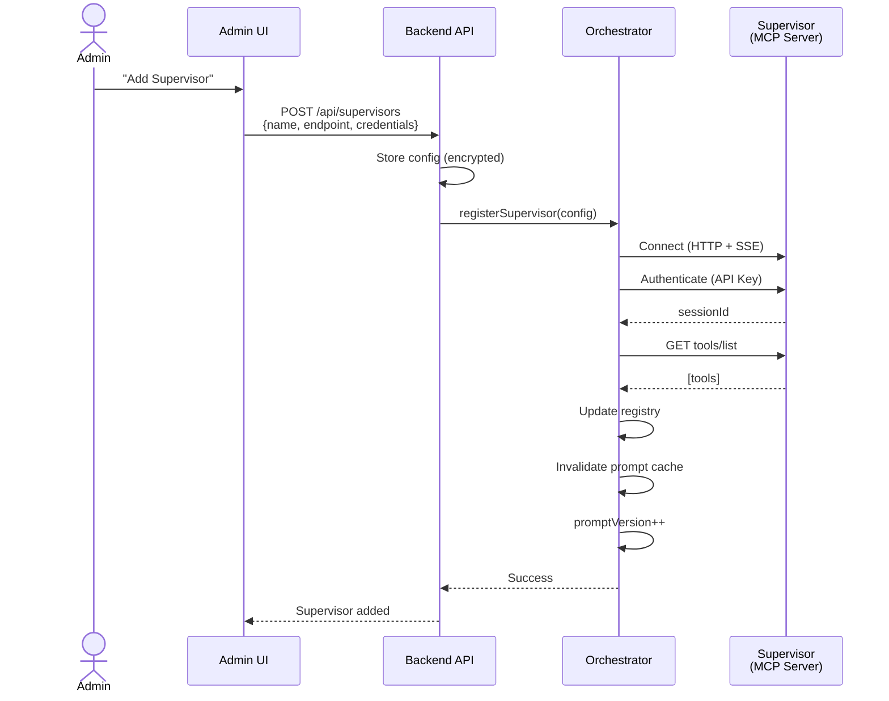
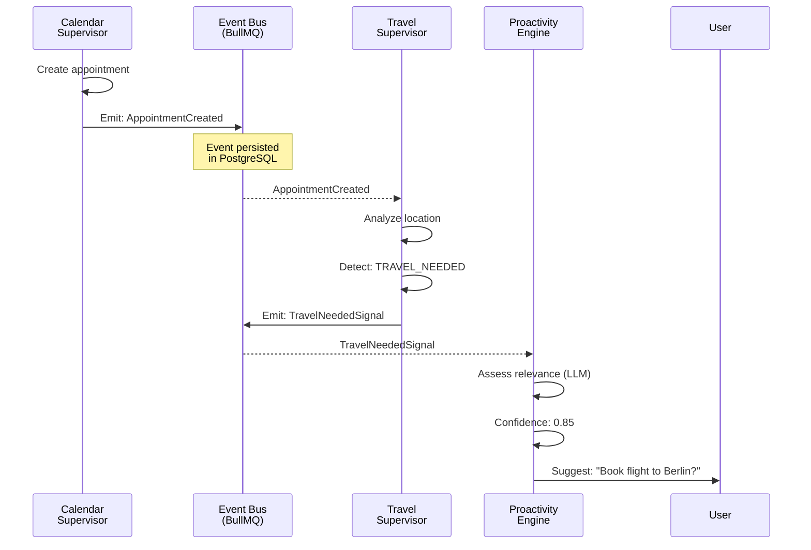
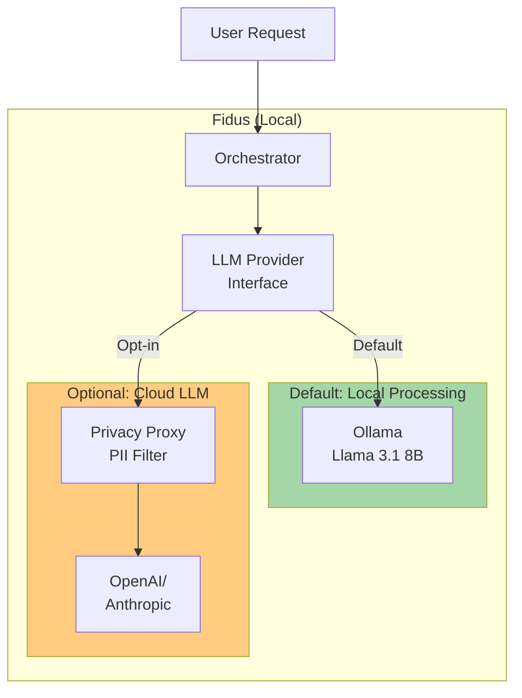
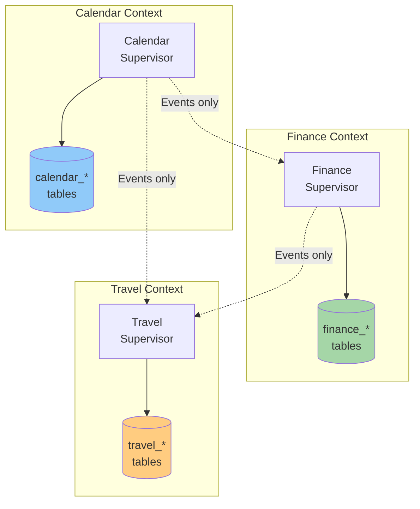
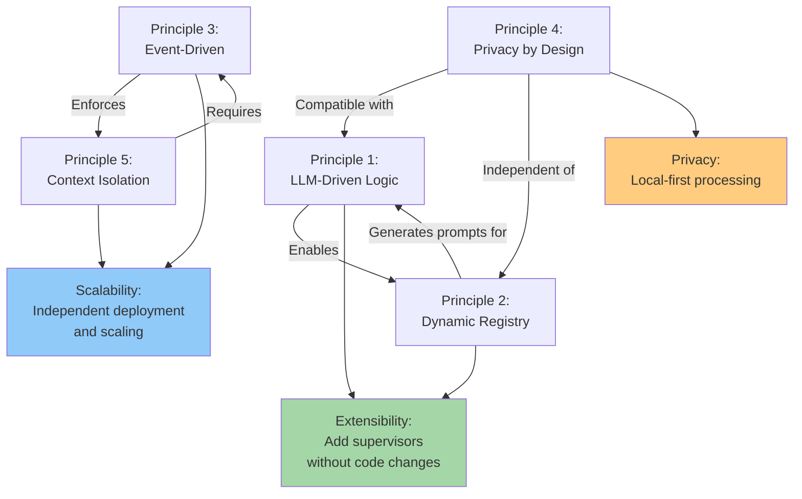

# Architecture Principles

**Version:** 1.0
**Date:** 2025-10-27
**Status:** Draft (Awaiting Human Review)
**Part of:** Fidus Solution Architecture
**Author:** AI-Generated

---

## Overview

This document details how the **5 Core Principles** from [../architecture/00-core-principles.md](../architecture/00-core-principles.md) are implemented in the Fidus solution architecture. These principles are **NON-NEGOTIABLE** and drive every architectural decision.

**Key Concept:** Fidus is a **multi-agent system** where each Supervisor is an autonomous AI agent with its own LangGraph-based reasoning engine, embedded within an MCP Server for standardized communication. The Orchestrator acts as a meta-agent that coordinates these domain-specialized agents.

---

## The 5 Core Principles



---

## The Multi-Agent System Architecture

Before diving into the 5 principles, it's critical to understand Fidus as a **multi-agent system**:

### What is a Supervisor?

A **Supervisor** is NOT just an MCP Server - it's an **autonomous AI agent** embedded within an MCP Server:



**Components:**

1. **AI Agent Core (LangGraph)**
   - Multi-step reasoning capabilities
   - Context management and memory
   - Decision-making based on domain expertise
   - Autonomous operation within domain boundaries

2. **MCP Server Layer**
   - Standardized HTTP + SSE communication
   - Tool exposure for Orchestrator
   - Resource management
   - Prompt templates

3. **Domain Knowledge**
   - Domain-specific business logic
   - Aggregates and value objects (DDD)
   - Domain events for inter-agent communication
   - Signal providers for proactivity

### Multi-Agent Coordination

**Orchestrator as Meta-Agent:**

The Orchestrator is itself an AI agent (meta-agent) that coordinates domain agents:



**Key Insights:**

1. **Each agent is autonomous:** Makes decisions within its domain
2. **Agents have memory:** LangGraph maintains conversation context
3. **Agents communicate via events:** Loose coupling, async collaboration
4. **Orchestrator coordinates:** But doesn't make domain decisions
5. **Emergent behavior:** Complex tasks solved by agent collaboration

### Agent Autonomy Example

**Calendar Agent's Internal Reasoning (LangGraph):**

```typescript
class CalendarAgent {
  private graph: StateGraph<CalendarState>;

  buildGraph() {
    this.graph = new StateGraph({ channels: { ... } });

    // Agent's reasoning nodes
    this.graph.addNode("analyze_request", this.analyzeRequest);
    this.graph.addNode("check_availability", this.checkAvailability);
    this.graph.addNode("detect_conflicts", this.detectConflicts);
    this.graph.addNode("resolve_conflicts", this.resolveConflicts);
    this.graph.addNode("create_appointment", this.createAppointment);
    this.graph.addNode("notify_participants", this.notifyParticipants);

    // Agent's decision logic (LLM-driven)
    this.graph.addConditionalEdges("analyze_request", this.decideNextStep, {
      "simple_create": "create_appointment",
      "needs_availability": "check_availability",
      "needs_participant_check": "notify_participants"
    });

    this.graph.addConditionalEdges("detect_conflicts", this.handleConflicts, {
      "no_conflicts": "create_appointment",
      "conflicts_found": "resolve_conflicts",
      "ask_user": END // Agent asks user for decision
    });
  }

  // Agent uses LLM for reasoning
  private async decideNextStep(state: CalendarState): Promise<string> {
    const decision = await this.llm.complete({
      system: "You are the Calendar Agent. Analyze the request and decide next step.",
      user: `Request: ${state.userMessage}
             Available info: ${state.context}
             What should I do next?`,
      schema: NextStepSchema
    });

    return decision.nextStep;
  }
}
```

**The agent independently:**
- Analyzes requests
- Checks availability
- Detects conflicts
- Resolves conflicts (or asks user)
- Creates appointments
- Notifies participants

**The Orchestrator only:**
- Routes requests to appropriate agent(s)
- Coordinates multi-agent scenarios
- Aggregates responses

---

## Principle 1: LLM-Driven Logic

> **NO hard-coded business rules. The LLM decides routing, relevance, and timing.**

### The Problem This Solves

Traditional rule-based systems fail when:
- User requests are ambiguous or use natural language variations
- New use cases emerge that weren't anticipated
- Business rules need to change (requires code deployment)

**Example of what we AVOID:**
```typescript
// ❌ BAD: Hard-coded routing logic
function routeRequest(userMessage: string): string {
  if (userMessage.includes('calendar') || userMessage.includes('appointment')) {
    return 'calendar-supervisor';
  }
  if (userMessage.includes('money') || userMessage.includes('budget')) {
    return 'finance-supervisor';
  }
  // ... 100+ more if-statements
}
```

### Our Solution: LLM-Driven Intent Detection

**Orchestrator uses LLM to understand user intent:**

```typescript
class Orchestrator {
  async detectIntent(userMessage: string): Promise<Intent> {
    const systemPrompt = this.generateSystemPrompt(); // From Dynamic Registry

    const response = await this.llm.complete({
      system: systemPrompt,
      user: userMessage,
      schema: IntentSchema // Structured output
    });

    return response.intent; // { supervisor: 'calendar', confidence: 0.95, ... }
  }

  private generateSystemPrompt(): string {
    // Prompt is GENERATED from registry (Principle 2)
    const supervisors = this.registry.getAllSupervisors();

    return `
You are Fidus, an AI personal assistant.

## Available Supervisors

${supervisors.map(s => `
### ${s.name}
${s.description}
Use for: ${s.useCases.join(', ')}
`).join('\n')}

## Task

Analyze the user's request and determine:
1. Which supervisor(s) to use
2. What tools to call
3. Order of execution (parallel vs sequential)

Return JSON matching IntentSchema.
    `;
  }
}
```

**Benefits:**
- ✅ Natural language understanding (handles variations)
- ✅ Multi-supervisor coordination ("Book flight and hotel")
- ✅ Confidence scoring (can ask for clarification if uncertain)
- ✅ No code changes needed for new supervisors (prompt auto-updates)

### LLM-Driven Decisions Throughout the System

| Component | LLM Decision | Example |
|-----------|--------------|---------|
| **Orchestrator** | Intent detection, routing | "Which supervisor handles this?" |
| **Orchestrator** | Multi-domain coordination | "Should I call these in parallel or sequence?" |
| **Supervisors** | Reasoning steps | "What's the next action in this workflow?" |
| **Proactivity Engine** | Relevance assessment | "Is this signal important enough to notify?" |
| **Proactivity Engine** | Timing decision | "When should I show this suggestion?" |

### Trade-offs

| Advantage | Disadvantage |
|-----------|--------------|
| ✅ Flexible (handles natural language) | ❌ Non-deterministic (same input may vary) |
| ✅ Evolvable (prompt changes, not code) | ❌ Latency (LLM inference takes time) |
| ✅ Context-aware | ❌ Token costs (for cloud LLMs) |
| ✅ Multi-lingual support | ❌ Requires guardrails (hallucination risk) |

### Mitigation Strategies

**For Non-Determinism:**
- Use structured outputs (Zod schemas) to constrain LLM responses
- Temperature = 0 for deterministic tasks
- Confidence thresholds (reject if confidence < 0.7)

**For Latency:**
- Cache frequent intents (Redis)
- Parallel LLM calls where possible
- Local LLM (Ollama) for < 1s inference

**For Hallucination:**
- Schema validation (Zod/Pydantic)
- Tool result verification
- Logging and audit trail

---

## Principle 2: Dynamic Registry

> **NO static component lists. Supervisors register themselves at runtime; prompts regenerate automatically.**

### The Problem This Solves

Static configuration fails when:
- Adding a new supervisor requires code changes in orchestrator
- Plugin marketplace grows (can't hardcode all plugins)
- Different deployments have different supervisors available

**Example of what we AVOID:**
```typescript
// ❌ BAD: Static supervisor list
const SUPERVISORS = {
  calendar: new CalendarSupervisor(),
  finance: new FinanceSupervisor(),
  travel: new TravelSupervisor(),
  // Adding a new one requires code change!
};
```

### Our Solution: Dynamic Supervisor Registry

**Admin adds supervisor via UI → Orchestrator discovers it:**



**Implementation:**

```typescript
class SupervisorRegistry {
  private supervisors: Map<string, RegisteredSupervisor> = new Map();
  private promptVersion: number = 0;
  private cachedSystemPrompt: string | null = null;

  async register(config: SupervisorConfig): Promise<void> {
    // 1. Connect to supervisor via MCP
    const client = new MCPClient({
      endpoint: config.endpoint,
      auth: config.credentials
    });

    await client.connect();

    // 2. Fetch capabilities
    const tools = await client.callMethod('tools/list');
    const resources = await client.callMethod('resources/list');
    const prompts = await client.callMethod('prompts/list');

    // 3. Register in map
    this.supervisors.set(config.name, {
      name: config.name,
      client,
      tools,
      resources,
      prompts,
      description: config.description,
      useCases: config.useCases,
      status: 'active',
      registeredAt: new Date()
    });

    // 4. CRITICAL: Invalidate prompt cache
    this.cachedSystemPrompt = null;
    this.promptVersion++;

    logger.info(`Supervisor registered: ${config.name} (prompt v${this.promptVersion})`);
  }

  async unregister(name: string): Promise<void> {
    const supervisor = this.supervisors.get(name);
    if (supervisor) {
      await supervisor.client.disconnect();
      this.supervisors.delete(name);

      // Invalidate cache
      this.cachedSystemPrompt = null;
      this.promptVersion++;

      logger.info(`Supervisor unregistered: ${name} (prompt v${this.promptVersion})`);
    }
  }

  getSystemPrompt(): string {
    // Return cached if available
    if (this.cachedSystemPrompt) {
      return this.cachedSystemPrompt;
    }

    // Generate new prompt from current supervisors
    const supervisors = Array.from(this.supervisors.values());

    this.cachedSystemPrompt = `
You are Fidus, a personal AI assistant.

## Available Supervisors (${supervisors.length})

${supervisors.map(s => `
### ${s.name}
${s.description}

**Tools:**
${s.tools.map(t => `- ${t.name}: ${t.description}`).join('\n')}

**Use Cases:** ${s.useCases.join(', ')}
`).join('\n---\n')}

## Your Task

Analyze user requests and route to appropriate supervisor(s).
Use tools as needed. Be proactive and context-aware.
    `;

    return this.cachedSystemPrompt;
  }
}
```

### How Prompts Auto-Update

**Scenario: Admin adds "Home Supervisor"**

**Before:**
```
Available Supervisors (3)

### calendar
Manages appointments...

### finance
Manages budgets...

### travel
Manages trips...
```

**After registration:**
```
Available Supervisors (4)

### calendar
Manages appointments...

### finance
Manages budgets...

### travel
Manages trips...

### home
Manages smart home devices...
Tools:
- control_device: Turn on/off devices
- create_automation: Create automation rules
Use Cases: smart home, lighting, heating, security
```

**Next user request automatically uses updated prompt!**

### Benefits

✅ **Plug & Play:** Add supervisors without code changes
✅ **Plugin Marketplace:** Community can add supervisors
✅ **Multi-Tenant:** Each tenant can have different supervisors
✅ **Versioning:** Prompt version tracks changes (for debugging)

### Trade-offs

| Advantage | Disadvantage |
|-----------|--------------|
| ✅ Extensible (easy to add supervisors) | ❌ Discovery complexity (admin must configure) |
| ✅ Tenant-specific customization | ❌ Prompt size grows (LLM context limit) |
| ✅ No orchestrator redeployment | ❌ Runtime errors (supervisor down) |

### Mitigation Strategies

**For Prompt Size:**
- Summarize tool descriptions (not full API docs)
- Paginate supervisors if > 20 (use LLM to pre-filter)
- Cache frequently used prompts

**For Discovery:**
- Auto-detect local supervisors (Docker Compose)
- Supervisor marketplace with one-click install
- Health checks (mark supervisor as inactive if down)

---

## Principle 3: Event-Driven Proactivity

> **NO synchronous inter-domain communication. Supervisors communicate via asynchronous domain events.**

### The Problem This Solves

Tight coupling between domains leads to:
- Circular dependencies (Calendar needs Finance, Finance needs Calendar)
- Performance bottlenecks (synchronous calls block)
- Failure cascades (one supervisor down affects all)

**Example of what we AVOID:**
```typescript
// ❌ BAD: Synchronous cross-domain call
class CalendarSupervisor {
  async createAppointment(details: AppointmentDetails) {
    const appointment = await this.repository.save(details);

    // Tight coupling to Travel Supervisor
    const travelNeeded = await travelSupervisor.checkIfTravelNeeded(appointment);

    if (travelNeeded) {
      await travelSupervisor.suggestBooking(appointment.location);
    }

    return appointment;
  }
}
```

### Our Solution: Event-Driven Communication

**Calendar emits event → Travel reacts asynchronously:**



**Implementation:**

```typescript
// Calendar Supervisor emits event
class CalendarSupervisor {
  async createAppointment(details: AppointmentDetails) {
    // 1. Create appointment (domain logic)
    const appointment = new Appointment(details);
    await this.repository.save(appointment);

    // 2. Emit domain event
    await this.eventBus.publish('calendar.appointment.created', {
      appointmentId: appointment.id,
      userId: appointment.userId,
      tenantId: appointment.tenantId,
      title: appointment.title,
      startTime: appointment.startTime,
      endTime: appointment.endTime,
      location: appointment.location,
      participants: appointment.participants
    });

    return appointment;
  }
}

// Travel Supervisor subscribes to event
class TravelSupervisor {
  async initialize() {
    // Subscribe to calendar events
    this.eventBus.subscribe('calendar.appointment.created',
      this.onAppointmentCreated.bind(this)
    );
  }

  private async onAppointmentCreated(event: AppointmentCreatedEvent) {
    // Check if travel needed
    const userHomeCity = await this.profileService.getHomeCity(event.userId);

    if (event.location && event.location !== userHomeCity) {
      // Emit signal for proactivity
      await this.signalBus.emit({
        type: 'TRAVEL_NEEDED',
        confidence: 0.85,
        context: {
          appointmentId: event.appointmentId,
          destination: event.location,
          date: event.startTime
        },
        suggestedAction: 'Book flight and hotel'
      });
    }
  }
}
```

### Event Bus Architecture: BullMQ + Redis

**Technology Decision:**

| Event Type | Technology | Delivery Guarantee | Persistence |
|------------|-----------|-------------------|-------------|
| **Critical Business Events** | BullMQ | At-least-once | PostgreSQL (Event Store) |
| **Non-Critical Notifications** | Redis Pub/Sub | At-most-once | None |

**Critical Events (BullMQ):**
- `AppointmentCreated`, `TransactionRecorded`, `TripBooked`
- Persistent (survive restarts)
- Retry logic (exponential backoff)
- Dead letter queue (failed events)

**Non-Critical (Redis Pub/Sub):**
- `UserTyping`, `NotificationDismissed`, `UIStateChanged`
- Fast (< 1ms latency)
- Ephemeral (lost if subscriber offline)

**Implementation:**

```typescript
class EventBus {
  constructor(
    private bullMQ: BullMQClient,
    private redisPubSub: RedisPubSubClient
  ) {}

  async publish(eventType: string, payload: any, options?: PublishOptions) {
    const event: DomainEvent = {
      id: generateUUID(),
      type: eventType,
      payload,
      timestamp: new Date(),
      version: '1.0'
    };

    // Determine routing
    if (this.isCriticalEvent(eventType)) {
      // BullMQ: Reliable delivery
      await this.bullMQ.add(eventType, event, {
        attempts: 3,
        backoff: { type: 'exponential', delay: 1000 }
      });
    } else {
      // Redis Pub/Sub: Fast delivery
      await this.redisPubSub.publish(eventType, event);
    }

    // Always store in Event Store (append-only)
    await this.eventStore.append(event);
  }

  async subscribe(eventType: string, handler: EventHandler) {
    if (this.isCriticalEvent(eventType)) {
      // BullMQ worker
      await this.bullMQ.process(eventType, async (job) => {
        await handler(job.data);
      });
    } else {
      // Redis Pub/Sub subscriber
      await this.redisPubSub.subscribe(eventType, handler);
    }
  }

  private isCriticalEvent(eventType: string): boolean {
    const criticalPrefixes = [
      'calendar.appointment.',
      'finance.transaction.',
      'travel.trip.',
      'finance.budget.'
    ];

    return criticalPrefixes.some(prefix => eventType.startsWith(prefix));
  }
}
```

### Benefits

✅ **Loose Coupling:** Supervisors don't know about each other
✅ **Scalability:** Events processed asynchronously
✅ **Resilience:** Supervisor down = events queued, not lost
✅ **Auditability:** All events in Event Store (EU AI Act compliance)
✅ **Proactivity:** Events enable signal detection

### Trade-offs

| Advantage | Disadvantage |
|-----------|--------------|
| ✅ Decoupled (independent deployment) | ❌ Eventual consistency (not immediate) |
| ✅ Resilient (retry logic) | ❌ Complexity (event versioning) |
| ✅ Scalable (async processing) | ❌ Debugging harder (distributed) |

### Mitigation Strategies

**For Eventual Consistency:**
- Use correlation IDs for tracing
- Show loading states in UI ("Processing...")
- Compensating transactions for errors

**For Complexity:**
- Structured event schemas (Zod/Pydantic)
- Event versioning (v1, v2) with migrations
- Comprehensive logging with OpenTelemetry

---

## Principle 4: Privacy by Design

> **NO Cloud-Only solutions without local alternative. Local LLM processing as default.**

### The Problem This Solves

Cloud-based AI systems compromise privacy:
- User data sent to third-party servers
- Vendor lock-in (can't switch providers)
- Compliance risk (GDPR, data residency laws)

### Our Solution: Local-First with Cloud Option

**Architecture:**



**LLM Provider Interface (abstraction):**

```typescript
interface LLMProvider {
  complete(request: CompletionRequest): Promise<CompletionResponse>;
  embed(text: string): Promise<number[]>;
  getModel(): string;
}

class LocalLLMProvider implements LLMProvider {
  constructor(private ollama: OllamaClient) {}

  async complete(request: CompletionRequest): Promise<CompletionResponse> {
    // All processing happens locally
    return await this.ollama.generate({
      model: 'llama3.1:8b',
      prompt: request.prompt,
      system: request.system,
      temperature: request.temperature ?? 0
    });
  }

  getModel(): string {
    return 'llama3.1:8b (local)';
  }
}

class CloudLLMProvider implements LLMProvider {
  constructor(
    private client: OpenAI,
    private privacyProxy: PrivacyProxy
  ) {}

  async complete(request: CompletionRequest): Promise<CompletionResponse> {
    // Filter PII before sending to cloud
    const filteredRequest = await this.privacyProxy.filter(request);

    const response = await this.client.chat.completions.create({
      model: 'gpt-4o',
      messages: filteredRequest.messages,
      temperature: request.temperature ?? 0
    });

    return this.privacyProxy.restore(response);
  }

  getModel(): string {
    return 'gpt-4o (cloud, PII-filtered)';
  }
}
```

**Privacy Proxy (PII filtering):**

```typescript
class PrivacyProxy {
  private entityMap: Map<string, string> = new Map();

  async filter(request: CompletionRequest): Promise<CompletionRequest> {
    let filteredPrompt = request.prompt;

    // Detect and replace PII
    const entities = await this.detectPII(filteredPrompt);

    for (const entity of entities) {
      const placeholder = this.createPlaceholder(entity.type);
      this.entityMap.set(placeholder, entity.value);
      filteredPrompt = filteredPrompt.replace(entity.value, placeholder);
    }

    return { ...request, prompt: filteredPrompt };
  }

  async restore(response: CompletionResponse): Promise<CompletionResponse> {
    let restoredText = response.text;

    // Restore original values
    for (const [placeholder, originalValue] of this.entityMap) {
      restoredText = restoredText.replace(placeholder, originalValue);
    }

    this.entityMap.clear(); // Clean up

    return { ...response, text: restoredText };
  }

  private async detectPII(text: string): Promise<Entity[]> {
    // Use NER (Named Entity Recognition) model
    // Examples: email, phone, address, credit card
    return await this.nerModel.detect(text);
  }

  private createPlaceholder(entityType: string): string {
    return `[${entityType}_${generateUUID().slice(0, 8)}]`;
  }
}
```

**Example:**

**Original prompt:**
```
User: "Send email to john.doe@example.com about the meeting at 123 Main St"
```

**Filtered prompt (sent to cloud):**
```
User: "Send email to [EMAIL_a1b2c3d4] about the meeting at [ADDRESS_e5f6g7h8]"
```

**Cloud LLM response:**
```
"I'll send an email to [EMAIL_a1b2c3d4] mentioning the meeting location at [ADDRESS_e5f6g7h8]."
```

**Restored response (to user):**
```
"I'll send an email to john.doe@example.com mentioning the meeting location at 123 Main St."
```

### Deployment Tiers & Privacy Levels

| Tier | LLM Default | Privacy Level | Data Location |
|------|------------|---------------|---------------|
| **Free (Cloud)** | OpenAI (cloud) | Medium (PII-filtered) | Cloud servers |
| **Starter ($29/mo)** | Ollama (local) | High (local-only) | User's device |
| **Family ($49/mo)** | Ollama (local) | High (local-only) | User's device |
| **Enterprise** | Bring-your-own | Custom | Customer-controlled |

### Benefits

✅ **Privacy:** Local LLM = data never leaves device
✅ **Compliance:** GDPR-friendly (no third-party data sharing)
✅ **Offline:** Works without internet (local LLM)
✅ **Cost:** No API fees for local processing
✅ **Choice:** User decides privacy vs. performance

### Trade-offs

| Advantage | Disadvantage |
|-----------|--------------|
| ✅ Privacy (local processing) | ❌ Hardware requirements (GPU for fast inference) |
| ✅ No vendor lock-in | ❌ Local model quality (< GPT-4o) |
| ✅ Offline mode | ❌ Model updates (manual download) |

### Mitigation Strategies

**For Hardware Requirements:**
- Optimize for CPU inference (quantized models)
- Cloud option for users without GPU
- Model size options (1B, 3B, 8B, 70B)

**For Model Quality:**
- Fine-tune local models for domain tasks
- Hybrid approach (local for routing, cloud for complex reasoning)
- Model marketplace (community fine-tuned models)

---

## Principle 5: Bounded Context Isolation

> **NO shared database tables across contexts. Each context owns its data and logic.**

### The Problem This Solves

Shared databases lead to:
- Tight coupling (schema changes affect multiple contexts)
- Deployment dependencies (can't deploy Calendar without Finance)
- Data leaks (cross-context queries bypass business rules)

**Example of what we AVOID:**
```sql
-- ❌ BAD: Shared appointments table
CREATE TABLE appointments (
  id UUID PRIMARY KEY,
  user_id UUID,
  title TEXT,
  start_time TIMESTAMP,
  -- Finance context added these columns (violates boundary!)
  expense_id UUID,
  budget_category TEXT
);
```

### Our Solution: Database per Context

**Architecture:**



**Database Schema Separation:**

```sql
-- Calendar Context owns calendar_* tables
CREATE TABLE calendar_appointments (
  id UUID PRIMARY KEY,
  tenant_id UUID NOT NULL,
  user_id UUID NOT NULL,
  title TEXT NOT NULL,
  start_time TIMESTAMP NOT NULL,
  end_time TIMESTAMP NOT NULL,
  location TEXT,
  -- NO finance columns!
  created_at TIMESTAMP DEFAULT NOW()
);

-- Finance Context owns finance_* tables
CREATE TABLE finance_transactions (
  id UUID PRIMARY KEY,
  tenant_id UUID NOT NULL,
  user_id UUID NOT NULL,
  amount DECIMAL NOT NULL,
  currency TEXT NOT NULL,
  category TEXT NOT NULL,
  -- NO calendar columns!
  created_at TIMESTAMP DEFAULT NOW()
);

-- Travel Context owns travel_* tables
CREATE TABLE travel_trips (
  id UUID PRIMARY KEY,
  tenant_id UUID NOT NULL,
  user_id UUID NOT NULL,
  destination TEXT NOT NULL,
  departure_date DATE NOT NULL,
  return_date DATE NOT NULL,
  -- NO calendar or finance columns!
  created_at TIMESTAMP DEFAULT NOW()
);
```

### Cross-Context Data Access via Events

**Scenario:** Travel Supervisor needs to know about calendar appointments

**❌ WRONG: Direct database access**
```typescript
// Travel Supervisor directly queries calendar DB
const appointments = await db.query(
  'SELECT * FROM calendar_appointments WHERE location = ?',
  [destination]
);
```

**✅ CORRECT: Subscribe to events**
```typescript
// Travel Supervisor subscribes to calendar events
class TravelSupervisor {
  private appointmentsCache: Map<string, CachedAppointment> = new Map();

  async initialize() {
    // Subscribe to calendar events
    this.eventBus.subscribe('calendar.appointment.created',
      this.onAppointmentCreated.bind(this)
    );

    this.eventBus.subscribe('calendar.appointment.updated',
      this.onAppointmentUpdated.bind(this)
    );
  }

  private async onAppointmentCreated(event: AppointmentCreatedEvent) {
    // Cache relevant data in Travel context
    this.appointmentsCache.set(event.appointmentId, {
      appointmentId: event.appointmentId,
      location: event.location,
      startTime: event.startTime,
      // Only data we need!
    });

    // Check if travel needed
    await this.checkTravelNeeded(event);
  }
}
```

### Multi-Tenancy Implementation

**Row-Level Security (PostgreSQL):**

```sql
-- Enable RLS on all tables
ALTER TABLE calendar_appointments ENABLE ROW LEVEL SECURITY;

-- Policy: Users can only see their tenant's data
CREATE POLICY tenant_isolation ON calendar_appointments
  FOR ALL
  TO authenticated_user
  USING (tenant_id = current_setting('app.current_tenant')::UUID);

-- Application sets tenant context
SET app.current_tenant = 'tenant-abc-123';

-- Now all queries automatically filtered by tenant
SELECT * FROM calendar_appointments;
-- Returns only appointments for tenant-abc-123
```

**Application-Level Tenant Filtering:**

```typescript
class CalendarRepository {
  async findByUser(userId: string, tenantId: string): Promise<Appointment[]> {
    // ALWAYS include tenantId in queries
    return await this.db.query(
      'SELECT * FROM calendar_appointments WHERE user_id = $1 AND tenant_id = $2',
      [userId, tenantId]
    );
  }

  async save(appointment: Appointment, tenantId: string): Promise<void> {
    // ALWAYS include tenantId in inserts
    await this.db.query(
      'INSERT INTO calendar_appointments (id, user_id, tenant_id, ...) VALUES ($1, $2, $3, ...)',
      [appointment.id, appointment.userId, tenantId, ...]
    );
  }
}
```

### Benefits

✅ **Independent Deployment:** Deploy Calendar without affecting Finance
✅ **Independent Scaling:** Scale Finance separately from Calendar
✅ **Clear Ownership:** Each team owns their context
✅ **Failure Isolation:** Calendar DB down ≠ Finance down

### Trade-offs

| Advantage | Disadvantage |
|-----------|--------------|
| ✅ Loose coupling | ❌ Data duplication (events cached) |
| ✅ Independent evolution | ❌ Eventual consistency |
| ✅ Team autonomy | ❌ Complex queries (no JOINs across contexts) |

### Mitigation Strategies

**For Data Duplication:**
- Cache only essential data
- Event-driven synchronization
- TTL for cached data

**For Complex Queries:**
- Use read models (CQRS pattern)
- API composition in Orchestrator
- Materialized views for reporting

---

## Summary: How Principles Work Together



**Key Insights:**

1. **LLM-Driven + Dynamic Registry** = Automatic adaptation to new supervisors
2. **Event-Driven + Context Isolation** = Loose coupling at runtime
3. **Privacy by Design** = Independent principle, compatible with all others
4. **All 5 principles** = Extensible, scalable, privacy-first system

---

## References

**Source Documents:**
- [../architecture/00-core-principles.md](../architecture/00-core-principles.md) - The 5 Core Principles (original)
- [../architecture/01-overview.md](../architecture/01-overview.md) - System overview
- [../architecture/05-registry-system.md](../architecture/05-registry-system.md) - Dynamic registry details

**Related Solution Architecture:**
- [03-component-architecture.md](03-component-architecture.md) - How components implement these principles
- [04-integration-architecture.md](04-integration-architecture.md) - Event bus and MCP integration
- [06-technology-decisions.md](06-technology-decisions.md) - Technology choices driven by principles

---

**Version History:**
- v1.0 (2025-10-27): Initial draft

---

**End of Architecture Principles**
