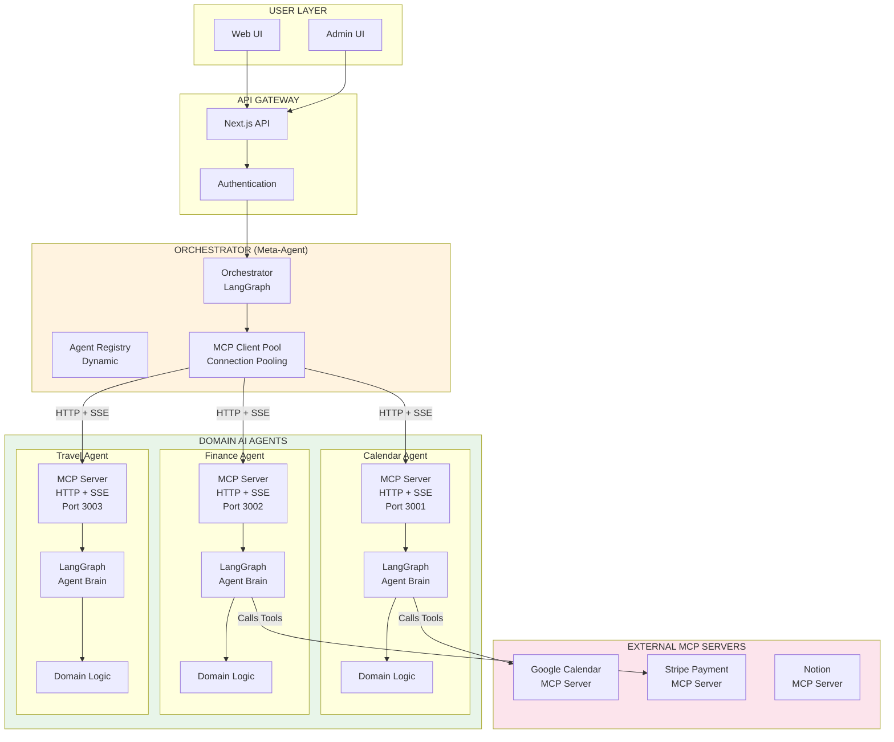
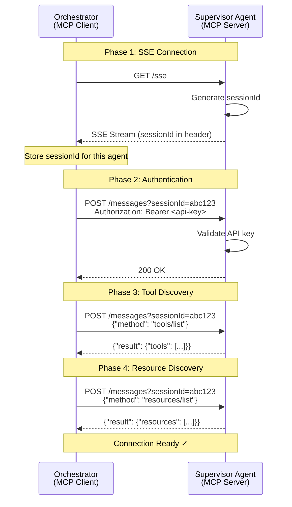
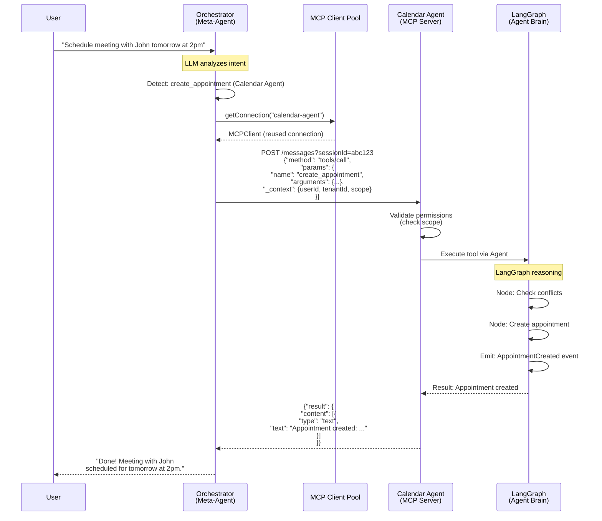
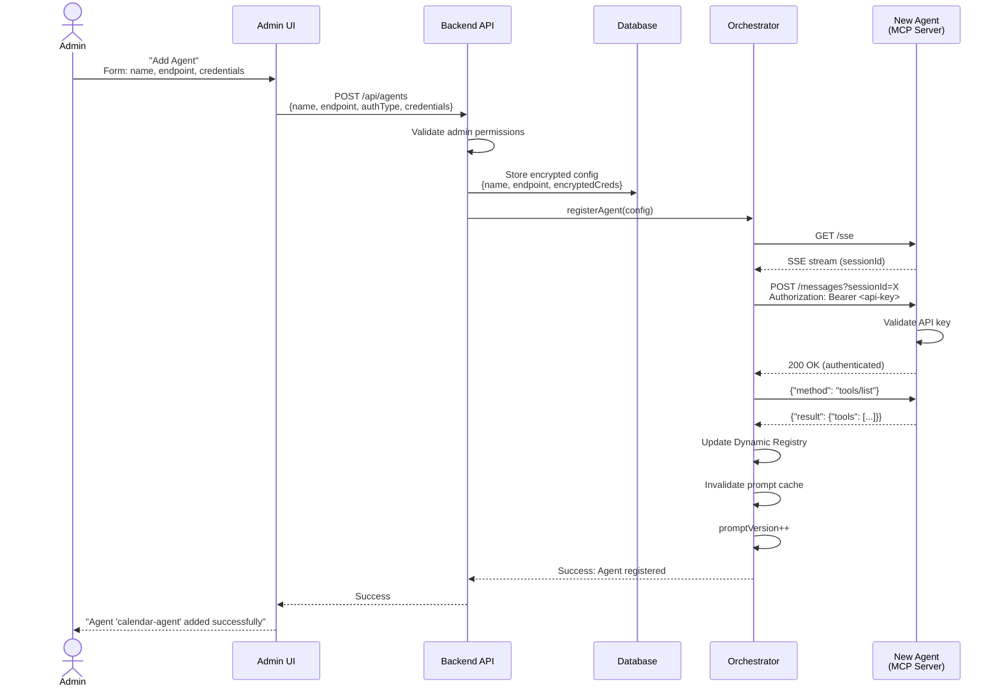
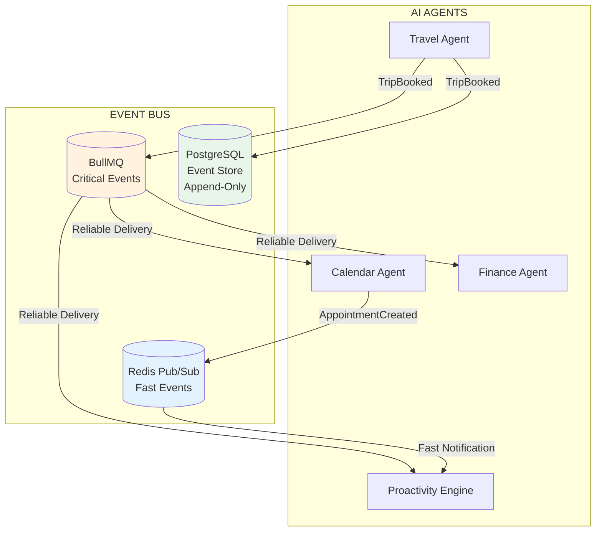
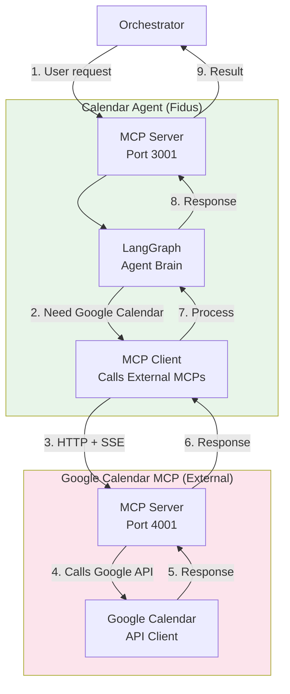
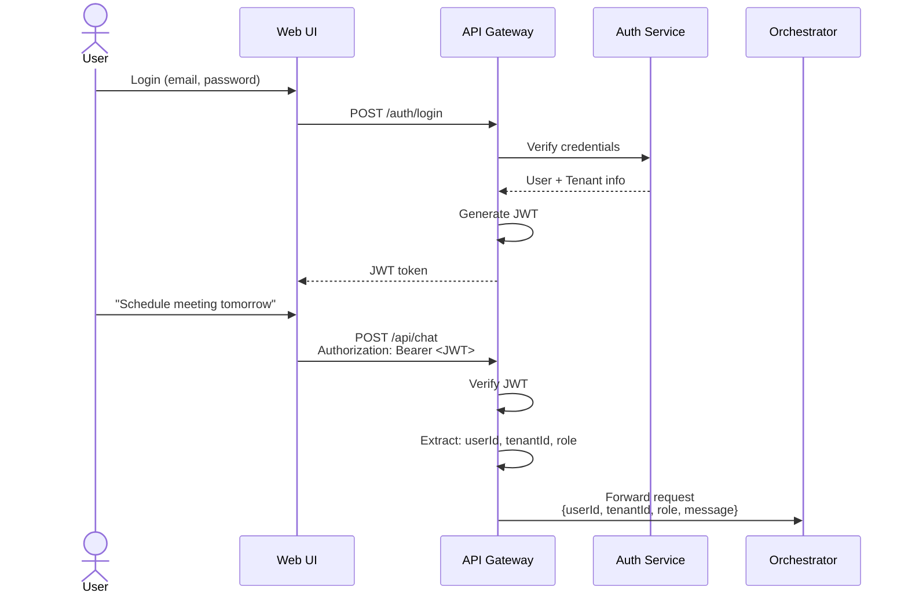

# Integration Architecture

**Version:** 1.0
**Date:** 2025-10-27
**Status:** Draft (Awaiting Human Review)
**Part of:** Fidus Solution Architecture
**Author:** AI-Generated

---

## Overview

This document details how the **multi-agent system** integrates its components through standardized protocols and patterns. Fidus uses **Model Context Protocol (MCP)** with **HTTP + Server-Sent Events (SSE)** as the primary communication layer between the Orchestrator (meta-agent) and domain agents (Supervisors).

**Key Integration Points:**
1. **MCP Communication:** Orchestrator ↔ Supervisors (HTTP + SSE)
2. **Admin-Driven Registration:** Dynamic agent discovery via UI
3. **Event Bus:** Inter-agent communication (BullMQ + Redis)
4. **External MCP Servers:** Integration with third-party services
5. **API Gateway:** User ↔ Fidus communication

---

## 1. MCP Protocol Integration

### 1.1 What is MCP?

**Model Context Protocol (MCP)** is a standardized protocol for LLM-tool integration, similar to how HTTP standardizes web communication.

**MCP Components:**
- **Tools:** Executable functions (e.g., `create_appointment`, `book_flight`)
- **Resources:** Data sources (e.g., `calendar://events/today`)
- **Prompts:** Template prompts for common tasks
- **Transport:** HTTP + SSE for real-time bidirectional communication

**Why MCP for Fidus?**
- ✅ **Standardization:** Industry-standard protocol
- ✅ **Interoperability:** Works with community MCP servers
- ✅ **Real-time:** SSE enables agent → orchestrator notifications
- ✅ **Tool Discovery:** Dynamic tool listing
- ✅ **Type Safety:** JSON-RPC with schema validation

### 1.2 MCP Architecture in Fidus



---

## 2. MCP HTTP + SSE Transport

### 2.1 Protocol Overview

**MCP over HTTP uses two endpoints:**

1. **SSE Endpoint:** Establishes Server-Sent Events connection
2. **Messages Endpoint:** Handles JSON-RPC requests/responses

```
Agent (MCP Server):
├─ GET  /sse              → Establish SSE connection
└─ POST /messages?sessionId=<id>  → Send JSON-RPC requests
```

### 2.2 Connection Establishment Flow



### 2.3 MCP Server Implementation (Agent Side)

**Calendar Agent MCP Server:**

```typescript
import { Server } from '@modelcontextprotocol/sdk/server/index.js';
import { SSEServerTransport } from '@modelcontextprotocol/sdk/server/sse.js';
import express from 'express';

class CalendarAgentMCPServer {
  private server: Server;
  private agent: CalendarAgent; // LangGraph-based agent

  async initialize() {
    // 1. Create MCP Server
    this.server = new Server(
      {
        name: 'calendar-agent',
        version: '1.0.0',
      },
      {
        capabilities: {
          tools: {},
          resources: {},
          prompts: {},
        },
      }
    );

    // 2. Register Tools (exposed to Orchestrator)
    this.server.setRequestHandler(ListToolsRequestSchema, async () => ({
      tools: [
        {
          name: 'create_appointment',
          description: 'Create a calendar appointment',
          inputSchema: {
            type: 'object',
            properties: {
              title: { type: 'string' },
              startTime: { type: 'string', format: 'date-time' },
              duration: { type: 'number' },
              participants: { type: 'array', items: { type: 'string' } },
            },
            required: ['title', 'startTime', 'duration'],
          },
        },
        {
          name: 'find_free_slots',
          description: 'Find available time slots',
          inputSchema: {
            type: 'object',
            properties: {
              date: { type: 'string', format: 'date' },
              duration: { type: 'number' },
              participants: { type: 'array', items: { type: 'string' } },
            },
            required: ['date', 'duration'],
          },
        },
      ],
    }));

    // 3. Register Tool Handlers (delegates to Agent)
    this.server.setRequestHandler(CallToolRequestSchema, async (request) => {
      const { name, arguments: args } = request.params;

      // Validate permissions (from context)
      await this.validatePermissions(request);

      // Delegate to AI Agent for execution
      switch (name) {
        case 'create_appointment':
          return await this.agent.createAppointment(args);

        case 'find_free_slots':
          return await this.agent.findFreeSlots(args);

        default:
          throw new Error(`Unknown tool: ${name}`);
      }
    });

    // 4. Register Resources
    this.server.setRequestHandler(ListResourcesRequestSchema, async () => ({
      resources: [
        {
          uri: 'calendar://events/today',
          name: "Today's appointments",
          mimeType: 'application/json',
        },
        {
          uri: 'calendar://events/upcoming',
          name: 'Upcoming appointments',
          mimeType: 'application/json',
        },
      ],
    }));

    // 5. Start HTTP + SSE Server
    const app = express();

    app.get('/sse', async (req, res) => {
      const transport = new SSEServerTransport('/messages', res);
      await this.server.connect(transport);
    });

    app.post('/messages', async (req, res) => {
      // Handle JSON-RPC messages
      // (handled by SSEServerTransport)
    });

    app.listen(3001, () => {
      console.log('Calendar Agent MCP Server running on port 3001');
    });
  }

  private async validatePermissions(request: any) {
    // Extract context from request
    const context = request.params._context; // Fidus extension

    // Check scope permissions (family/multi-user)
    if (!this.hasPermission(context.scope, request.params.name)) {
      throw new PermissionError('Insufficient permissions');
    }
  }
}
```

### 2.4 MCP Client Implementation (Orchestrator Side)

**Orchestrator MCP Client Pool:**

```typescript
import { Client } from '@modelcontextprotocol/sdk/client/index.js';
import { SSEClientTransport } from '@modelcontextprotocol/sdk/client/sse.js';

class MCPClientPool {
  private connections: Map<string, MCPConnection> = new Map();

  async getConnection(agentName: string): Promise<Client> {
    // Reuse existing connection
    if (this.connections.has(agentName)) {
      const conn = this.connections.get(agentName)!;
      conn.lastUsed = new Date();
      return conn.client;
    }

    // Create new connection
    const config = await this.getAgentConfig(agentName);
    const client = await this.createConnection(config);

    this.connections.set(agentName, {
      client,
      config,
      lastUsed: new Date(),
    });

    return client;
  }

  private async createConnection(config: AgentConfig): Promise<Client> {
    // 1. Create MCP Client
    const client = new Client(
      {
        name: 'orchestrator',
        version: '1.0.0',
      },
      {
        capabilities: {},
      }
    );

    // 2. Create SSE Transport
    const transport = new SSEClientTransport(
      new URL(`${config.endpoint}/sse`)
    );

    // 3. Connect
    await client.connect(transport);

    // 4. Authenticate
    // (authentication happens via HTTP headers in transport)

    // 5. List tools
    const toolsResult = await client.request(
      { method: 'tools/list' },
      ListToolsResultSchema
    );

    console.log(`Connected to ${config.name}: ${toolsResult.tools.length} tools available`);

    return client;
  }

  private async getAgentConfig(agentName: string): Promise<AgentConfig> {
    // Fetch from database (admin-configured)
    return await db.agentConfigs.findOne({ name: agentName });
  }

  // Cleanup inactive connections (5 min timeout)
  async cleanupInactive() {
    const timeout = 5 * 60 * 1000;
    const now = Date.now();

    for (const [name, conn] of this.connections) {
      if (now - conn.lastUsed.getTime() > timeout) {
        await conn.client.close();
        this.connections.delete(name);
        console.log(`Closed inactive connection: ${name}`);
      }
    }
  }
}
```

### 2.5 Tool Call Flow

**Complete request/response cycle:**



---

## 3. Admin-Driven Agent Registration

### 3.1 The Problem

How does the Orchestrator discover available agents?

**Requirements:**
- ✅ Admin controls which agents are trusted
- ✅ Support for local agents (Docker) and remote agents (cloud)
- ✅ Dynamic: Add/remove agents without restarting Orchestrator
- ✅ Secure: Orchestrator authenticates to agents

### 3.2 Solution: Admin UI + Dynamic Registry



### 3.3 Agent Configuration (Database)

**Schema:**

```typescript
interface AgentConfig {
  id: string;
  name: string;                    // e.g., "calendar-agent"
  displayName: string;             // e.g., "Calendar Assistant"
  endpoint: string;                // e.g., "http://localhost:3001"
  authType: 'api_key' | 'oauth' | 'basic';
  encryptedCredentials: string;    // Encrypted API key/token
  status: 'active' | 'inactive' | 'error';
  tenantId: string;                // Which tenant owns this agent
  addedBy: string;                 // Admin user ID
  createdAt: Date;
  updatedAt: Date;
  lastHealthCheck?: Date;
  capabilities?: {                 // Cached from tools/list
    tools: Tool[];
    resources: Resource[];
    prompts: Prompt[];
  };
}
```

**Example:**

```json
{
  "id": "agent_cal_001",
  "name": "calendar-agent",
  "displayName": "Calendar Assistant",
  "endpoint": "http://calendar-supervisor:3001",
  "authType": "api_key",
  "encryptedCredentials": "ENC[aes256,data:...,iv:...,tag:...]",
  "status": "active",
  "tenantId": "tenant_abc123",
  "addedBy": "user_admin_456",
  "createdAt": "2025-10-27T10:00:00Z",
  "capabilities": {
    "tools": [
      {"name": "create_appointment", "description": "..."},
      {"name": "find_free_slots", "description": "..."}
    ],
    "resources": [
      {"uri": "calendar://events/today", "name": "Today's events"}
    ]
  }
}
```

### 3.4 Admin UI Flow

**Add Agent Form:**

```typescript
interface AddAgentForm {
  name: string;              // Internal identifier
  displayName: string;       // User-friendly name
  endpoint: string;          // URL (http://localhost:3001 or https://...)
  authType: 'api_key' | 'oauth' | 'basic';
  credentials: {
    apiKey?: string;         // For api_key auth
    oauthToken?: string;     // For oauth auth
    username?: string;       // For basic auth
    password?: string;       // For basic auth
  };
}
```

**UI Screenshot (Conceptual):**

```
┌────────────────────────────────────────────────┐
│ Add New Agent                                  │
├────────────────────────────────────────────────┤
│                                                │
│ Name: [calendar-agent________________]         │
│       Internal identifier (no spaces)          │
│                                                │
│ Display Name: [Calendar Assistant_______]      │
│               User-friendly name               │
│                                                │
│ Endpoint: [http://localhost:3001______]        │
│           Agent's MCP server URL               │
│                                                │
│ Auth Type: [API Key ▼]                         │
│            ○ API Key  ○ OAuth  ○ Basic Auth    │
│                                                │
│ API Key: [sk_prod_abc123xyz___________]        │
│          Will be encrypted in database         │
│                                                │
│ [Test Connection]  [Cancel]  [Add Agent]      │
└────────────────────────────────────────────────┘
```

### 3.5 Discovery Modes

**Mode 1: Local Agents (Docker Compose)**

Admin can use auto-discovery for local Docker services:

```yaml
# docker-compose.yml
services:
  calendar-agent:
    image: fidus/calendar-agent:latest
    ports:
      - "3001:3001"
    environment:
      - AGENT_API_KEY=${CALENDAR_AGENT_KEY}
    labels:
      - "fidus.agent=true"
      - "fidus.agent.name=calendar-agent"
```

**Auto-Discovery Button:**

```
UI: [Discover Local Agents]

→ Scans Docker network for services with fidus.agent=true
→ Pre-fills form with detected services
→ Admin reviews and confirms
```

**Mode 2: Remote Agents (Cloud/External)**

Admin manually enters endpoint and credentials.

**Mode 3: Community Marketplace**

Admin browses marketplace and installs with one click:

```
UI: Agent Marketplace

┌─────────────────────────────────────┐
│ Google Calendar Agent               │
│ by @fidus-community                 │
│                                     │
│ Connect your Google Calendar        │
│                                     │
│ Permissions:                        │
│ • Read calendar events              │
│ • Create/update events              │
│                                     │
│ [Install] [Learn More]              │
└─────────────────────────────────────┘

→ User clicks Install
→ OAuth flow to authorize Google
→ Agent auto-configured with OAuth token
```

---

## 4. Event-Driven Inter-Agent Communication

### 4.1 Why Events?

Agents need to communicate without tight coupling:

**Example Scenario:**
```
Travel Agent books flight
→ Calendar Agent should add to calendar
→ Finance Agent should record expense
→ Proactivity Engine should suggest hotel
```

**Problem with Synchronous Calls:**
- Travel Agent would need to know about Calendar, Finance, Proactivity
- Tight coupling
- Failure cascade (if Calendar down, flight booking fails)

**Solution: Event-Driven**
- Travel Agent emits `TripBooked` event
- Other agents subscribe and react independently

### 4.2 Event Bus Architecture

**Two-Tier Event Bus:**

1. **Critical Events:** BullMQ (reliable, persistent)
2. **Non-Critical Events:** Redis Pub/Sub (fast, ephemeral)



### 4.3 Event Types

**Critical Events (BullMQ):**
- Domain events that change business state
- Must be delivered (at-least-once)
- Examples: `AppointmentCreated`, `TransactionRecorded`, `TripBooked`

**Non-Critical Events (Redis Pub/Sub):**
- Notifications, UI updates, real-time sync
- Can be lost if subscriber offline
- Examples: `UserTyping`, `NotificationDismissed`, `AgentStatusChanged`

**Routing Logic:**

```typescript
class EventBus {
  async publish(event: DomainEvent, options?: PublishOptions) {
    // Determine event criticality
    const isCritical = this.isCriticalEvent(event.type);

    if (isCritical) {
      // BullMQ: Reliable delivery
      await this.bullMQ.add(event.type, event, {
        attempts: 3,
        backoff: { type: 'exponential', delay: 1000 },
      });
    } else {
      // Redis Pub/Sub: Fast delivery
      await this.redisPubSub.publish(event.type, event);
    }

    // Always store in Event Store (audit trail)
    await this.eventStore.append(event);
  }

  private isCriticalEvent(eventType: string): boolean {
    const criticalPrefixes = [
      'calendar.appointment.',
      'finance.transaction.',
      'travel.trip.',
      'finance.budget.',
      'health.vital.',
    ];

    return criticalPrefixes.some(prefix => eventType.startsWith(prefix));
  }
}
```

### 4.4 Event Schema

**Domain Event Structure:**

```typescript
interface DomainEvent {
  // Metadata
  id: string;                      // UUID
  type: string;                    // e.g., "calendar.appointment.created"
  timestamp: Date;
  version: string;                 // Schema version (e.g., "1.0")

  // Context
  tenantId: string;
  userId: string;
  agentId: string;                 // Which agent emitted this

  // Payload (domain-specific)
  payload: Record<string, any>;

  // Correlation (for tracing)
  correlationId?: string;          // Links related events
  causationId?: string;            // What caused this event
}
```

**Example:**

```json
{
  "id": "evt_a1b2c3d4",
  "type": "travel.trip.booked",
  "timestamp": "2025-10-27T14:30:00Z",
  "version": "1.0",
  "tenantId": "tenant_abc123",
  "userId": "user_456",
  "agentId": "travel-agent",
  "payload": {
    "tripId": "trip_789",
    "destination": "Berlin",
    "departureDate": "2025-11-01",
    "returnDate": "2025-11-05",
    "flightConfirmation": "LH123",
    "totalCost": {
      "amount": 350,
      "currency": "EUR"
    }
  },
  "correlationId": "req_xyz123",
  "causationId": "cmd_book_trip_xyz"
}
```

### 4.5 Agent Event Subscription

**Calendar Agent subscribes to Travel events:**

```typescript
class CalendarAgent {
  async initialize() {
    // Subscribe to travel events
    await eventBus.subscribe(
      'travel.trip.booked',
      this.onTripBooked.bind(this)
    );
  }

  private async onTripBooked(event: DomainEvent) {
    const trip = event.payload;

    // Agent reasoning: Should I add to calendar?
    const decision = await this.llm.complete({
      system: "You are the Calendar Agent. A trip was booked. Should you add it to the calendar?",
      user: `Trip: ${trip.destination}, ${trip.departureDate} - ${trip.returnDate}`,
      schema: DecisionSchema,
    });

    if (decision.shouldAdd) {
      // Use LangGraph for multi-step reasoning
      await this.graph.invoke({
        action: 'create_appointment',
        data: {
          title: `Trip to ${trip.destination}`,
          startTime: trip.departureDate,
          endTime: trip.returnDate,
          notes: `Flight: ${trip.flightConfirmation}`,
        },
      });
    }
  }
}
```

---

## 5. External MCP Server Integration

### 5.1 Agent Calls External MCP Servers

Agents (e.g., Calendar Agent) can call external MCP servers (e.g., Google Calendar MCP) to access third-party services:



**Calendar Agent using Google Calendar MCP:**

```typescript
class CalendarAgent {
  private googleCalendarMCP: Client;

  async initialize() {
    // Connect to external Google Calendar MCP Server
    this.googleCalendarMCP = await this.connectToExternalMCP({
      name: 'google-calendar',
      endpoint: 'http://google-calendar-mcp:4001',
    });
  }

  private async createAppointment(args: CreateAppointmentArgs) {
    // Agent's reasoning: Use LangGraph
    const state = await this.graph.invoke({
      action: 'create_appointment',
      data: args,
    });

    // If user has Google Calendar connected, sync there too
    if (state.shouldSyncToGoogle) {
      await this.googleCalendarMCP.request({
        method: 'tools/call',
        params: {
          name: 'create_event',
          arguments: {
            summary: args.title,
            start: { dateTime: args.startTime },
            end: { dateTime: args.endTime },
            attendees: args.participants.map(email => ({ email })),
          },
        },
      }, CallToolResultSchema);
    }

    // Return result
    return {
      content: [{
        type: 'text',
        text: `Appointment created: ${args.title}`,
      }],
    };
  }
}
```

### 5.2 Anti-Corruption Layer (ACL)

Agents protect their domain model from external services:

```typescript
class GoogleCalendarACL {
  // Translate Google Event → Fidus Appointment
  toAppointment(googleEvent: GoogleEvent): Appointment {
    return new Appointment({
      id: generateId(), // Our own ID
      title: googleEvent.summary,
      startTime: new Date(googleEvent.start.dateTime),
      endTime: new Date(googleEvent.end.dateTime),
      participants: googleEvent.attendees?.map(a => a.email) || [],
      location: googleEvent.location,
      externalId: googleEvent.id,
      externalProvider: 'google',
    });
  }

  // Translate Fidus Appointment → Google Event
  toGoogleEvent(appointment: Appointment): GoogleEvent {
    return {
      summary: appointment.title,
      start: { dateTime: appointment.startTime.toISOString() },
      end: { dateTime: appointment.endTime.toISOString() },
      attendees: appointment.participants.map(email => ({ email })),
      location: appointment.location,
    };
  }
}
```

---

## 6. Authentication & Authorization

### 6.1 User Authentication (JWT)

**Flow:**



**JWT Payload:**

```json
{
  "sub": "user_456",
  "email": "john@example.com",
  "tenantId": "tenant_abc123",
  "role": "member",
  "scope": {
    "allowedResources": ["family_calendar", "family_shopping"],
    "permissions": ["read", "write"]
  },
  "iat": 1698409200,
  "exp": 1698495600
}
```

### 6.2 Agent-to-Agent Authentication

**Orchestrator authenticates to Agents:**

```typescript
class OrchestratorMCPClient {
  async connectToAgent(config: AgentConfig): Promise<Client> {
    const client = new Client({ name: 'orchestrator', version: '1.0.0' }, {});

    // Create transport with authentication
    const transport = new SSEClientTransport(
      new URL(`${config.endpoint}/sse`),
      {
        headers: {
          'Authorization': `Bearer ${decrypt(config.encryptedCredentials)}`,
          'X-Tenant-Id': this.tenantId,
        },
      }
    );

    await client.connect(transport);
    return client;
  }
}
```

**Agent validates requests:**

```typescript
class AgentMCPServer {
  async validateRequest(req: Request): Promise<Context> {
    // Extract API key from header
    const apiKey = req.headers.authorization?.replace('Bearer ', '');

    if (!apiKey) {
      throw new AuthError('Missing API key');
    }

    // Validate API key
    const config = await db.agentConfigs.findOne({ apiKey });

    if (!config) {
      throw new AuthError('Invalid API key');
    }

    // Return context
    return {
      tenantId: config.tenantId,
      orchestratorId: config.orchestratorId,
      permissions: config.permissions,
    };
  }
}
```

### 6.3 Scope-Based Access Control (Multi-User)

**Family scenario: Parent vs. Child permissions:**

```typescript
interface ScopeContext {
  userId: string;
  tenantId: string;
  role: 'owner' | 'admin' | 'member' | 'child';
  allowedResources: string[];
  permissions: ('read' | 'write' | 'delete' | 'admin')[];
}

// Parent scope
const parentScope: ScopeContext = {
  userId: 'user_parent',
  tenantId: 'family_schmidt',
  role: 'owner',
  allowedResources: ['family_calendar', 'family_budget', 'family_shopping'],
  permissions: ['read', 'write', 'delete', 'admin'],
};

// Child scope
const childScope: ScopeContext = {
  userId: 'user_child',
  tenantId: 'family_schmidt',
  role: 'child',
  allowedResources: ['family_shopping'], // Only shopping list
  permissions: ['read', 'write'], // No delete or admin
};
```

**Agent enforces scope:**

```typescript
class CalendarAgent {
  async validateToolCall(toolName: string, context: ScopeContext) {
    // Check 1: Resource access
    if (toolName === 'delete_appointment') {
      if (!context.permissions.includes('delete')) {
        throw new PermissionError('Delete permission required');
      }
    }

    // Check 2: Resource ownership
    const resourceId = extractResourceId(toolName);
    if (resourceId && !context.allowedResources.includes(resourceId)) {
      throw new PermissionError('Resource access denied');
    }
  }
}
```

---

## 7. Health Checks & Monitoring

### 7.1 Agent Health Checks

**Health endpoint (every agent):**

```typescript
app.get('/health', async (req, res) => {
  const health = {
    status: 'healthy',
    agent: 'calendar-agent',
    version: '1.0.0',
    uptime: process.uptime(),
    checks: {
      mcp_server: await this.checkMCPServer(),
      langgraph: await this.checkLangGraph(),
      database: await this.checkDatabase(),
      external_mcp: await this.checkExternalMCP(),
    },
  };

  const allHealthy = Object.values(health.checks).every(c => c.status === 'ok');

  res.status(allHealthy ? 200 : 503).json(health);
});
```

**Example response:**

```json
{
  "status": "healthy",
  "agent": "calendar-agent",
  "version": "1.0.0",
  "uptime": 3600,
  "checks": {
    "mcp_server": {
      "status": "ok",
      "message": "MCP server responding"
    },
    "langgraph": {
      "status": "ok",
      "message": "LangGraph compiled and ready"
    },
    "database": {
      "status": "ok",
      "message": "PostgreSQL connected",
      "latency_ms": 5
    },
    "external_mcp": {
      "status": "ok",
      "message": "Google Calendar MCP reachable"
    }
  }
}
```

### 7.2 Orchestrator Monitors Agents

```typescript
class AgentHealthMonitor {
  async monitorAgents() {
    setInterval(async () => {
      for (const [name, config] of this.registry.getAll()) {
        try {
          const response = await fetch(`${config.endpoint}/health`);
          const health = await response.json();

          if (health.status !== 'healthy') {
            await this.markAgentUnhealthy(name, health);
          } else {
            await this.markAgentHealthy(name);
          }
        } catch (error) {
          await this.markAgentDown(name, error);
        }
      }
    }, 30000); // Every 30 seconds
  }

  private async markAgentUnhealthy(name: string, health: any) {
    console.warn(`Agent ${name} is unhealthy:`, health);
    await db.agentConfigs.update({ name }, { status: 'unhealthy' });

    // Remove from active registry (temporarily)
    this.registry.deactivate(name);

    // Alert admin
    await this.sendAlert('agent_unhealthy', { name, health });
  }
}
```

---

## 8. Error Handling

### 8.1 MCP Error Responses

**JSON-RPC Error Codes:**

| Code | Name | Meaning |
|------|------|---------|
| -32700 | Parse error | Invalid JSON |
| -32600 | Invalid Request | JSON-RPC format error |
| -32601 | Method not found | Tool/method doesn't exist |
| -32602 | Invalid params | Parameter validation failed |
| -32603 | Internal error | Agent internal error |
| -32000 | Server error | Custom server errors |

**Example error response:**

```json
{
  "jsonrpc": "2.0",
  "id": "req_123",
  "error": {
    "code": -32602,
    "message": "Invalid params",
    "data": {
      "validationErrors": [
        {
          "field": "startTime",
          "message": "Must be a valid ISO 8601 date-time"
        }
      ]
    }
  }
}
```

### 8.2 Agent Error Handling

```typescript
class CalendarAgent {
  private async safeToolHandler(
    handler: Function,
    request: ToolCallRequest
  ): Promise<ToolCallResult> {
    try {
      // Validate schema
      const validated = this.validateSchema(request.params.arguments);

      // Execute handler
      const result = await handler(validated);

      return {
        content: [{
          type: 'text',
          text: JSON.stringify(result),
        }],
      };
    } catch (error) {
      if (error instanceof ValidationError) {
        throw new McpError(
          ErrorCode.InvalidParams,
          'Validation failed',
          { errors: error.errors }
        );
      }

      if (error instanceof PermissionError) {
        throw new McpError(
          ErrorCode.InvalidParams,
          'Permission denied',
          { reason: error.message }
        );
      }

      // Unknown error
      throw new McpError(
        ErrorCode.InternalError,
        'Internal agent error',
        { originalError: error.message }
      );
    }
  }
}
```

---

## 9. Summary

### 9.1 Integration Points

| Component A | Component B | Protocol | Purpose |
|-------------|-------------|----------|---------|
| User | API Gateway | HTTPS | User requests |
| API Gateway | Orchestrator | Internal (HTTP) | Forward requests |
| Orchestrator | Agents | MCP (HTTP + SSE) | Agent coordination |
| Agent | External MCP | MCP (HTTP + SSE) | Third-party tools |
| Agent | Agent | Events (BullMQ) | Inter-agent communication |
| Agent | Database | SQL/Native | Data persistence |

### 9.2 Key Decisions

**1. MCP over HTTP + SSE**
- ✅ Standardized protocol
- ✅ Real-time bidirectional communication
- ✅ Industry adoption (tool ecosystem)

**2. Admin-Driven Registration**
- ✅ Security (admin controls agents)
- ✅ Flexibility (local + remote agents)
- ✅ Multi-tenancy (per-tenant agents)

**3. Two-Tier Event Bus**
- ✅ Reliability (BullMQ for critical events)
- ✅ Performance (Redis Pub/Sub for fast events)
- ✅ Auditability (Event Store for all events)

**4. Agent Autonomy**
- ✅ LangGraph for reasoning
- ✅ MCP for communication
- ✅ Domain-driven design

### 9.3 Non-Functional Requirements

| Requirement | Implementation | Target |
|-------------|----------------|--------|
| **Latency** | Connection pooling, caching | < 2s p95 |
| **Reliability** | BullMQ retry logic, health checks | 99.9% uptime |
| **Security** | JWT auth, API keys, scope validation | Zero breaches |
| **Scalability** | Horizontal scaling, async events | 1000+ req/s |
| **Observability** | Structured logging, OpenTelemetry | Full traceability |

---

## References

**Source Documents:**
- [../architecture/02-supervisor-architecture.md](../architecture/02-supervisor-architecture.md) - Supervisor design
- [../architecture/06-mcp-integration.md](../architecture/06-mcp-integration.md) - MCP protocol details
- [../architecture/04-signals-events-proactivity.md](../architecture/04-signals-events-proactivity.md) - Event-driven architecture

**Related Solution Architecture:**
- [02-architecture-principles.md](02-architecture-principles.md) - Multi-agent system principles
- [03-component-architecture.md](03-component-architecture.md) - Agent components
- [07-security-compliance.md](07-security-compliance.md) - Security details

---

**Version History:**
- v1.0 (2025-10-27): Initial draft

---

**End of Integration Architecture**
