# Data Flows

**Version:** 1.0
**Date:** 2025-10-27
**Status:** Draft (Awaiting Human Review)
**Part of:** Fidus Solution Architecture
**Author:** AI-Generated

---

## Table of Contents

1. [Overview](#overview)
2. [Core Flow Patterns](#core-flow-patterns)
3. [User Request Flows](#user-request-flows)
4. [Event-Driven Communication Flows](#event-driven-communication-flows)
5. [Data Persistence Flows](#data-persistence-flows)
6. [External Integration Flows](#external-integration-flows)
7. [Proactivity Flows](#proactivity-flows)
8. [Authentication & Authorization Flows](#authentication--authorization-flows)
9. [Multi-Agent Coordination Flows](#multi-agent-coordination-flows)
10. [State Management Flows](#state-management-flows)
11. [Error Handling & Recovery Flows](#error-handling--recovery-flows)
12. [Monitoring & Observability Flows](#monitoring--observability-flows)
13. [Privacy & Compliance Flows](#privacy--compliance-flows)
14. [Data Flow Patterns Reference](#data-flow-patterns-reference)

---

## Overview

This document provides comprehensive documentation of all data flows within the Fidus system. Each flow is illustrated using **Mermaid diagrams** to visualize the sequence of operations, data transformations, and interactions between components.

### Flow Categories

The Fidus system implements 13 distinct categories of data flows:

| Category | Purpose | Primary Components |
|----------|---------|-------------------|
| **User Request Flows** | Handle user interactions from UI to agent execution | Web UI, Orchestrator, Domain Agents |
| **Event-Driven Communication** | Enable asynchronous agent-to-agent communication | Event Bus, BullMQ, Redis Pub/Sub |
| **Data Persistence** | Manage data storage and retrieval | Repositories, PostgreSQL, Redis |
| **External Integration** | Connect to external services via MCP | MCP Client, External MCP Servers, Anti-Corruption Layer |
| **Proactivity** | Detect opportunities and generate suggestions | Proactivity Agent, Data Signal Collectors, Trigger Analyzers |
| **Authentication & Authorization** | Secure access control | Identity Agent, Auth0/Keycloak, Scope Engine |
| **Multi-Agent Coordination** | Orchestrate complex multi-step scenarios | Orchestrator, Domain Agents, Coordination Service |
| **State Management** | Maintain agent context and conversation state | LangGraph Checkpointers, Redis, Session Store |
| **Error Handling & Recovery** | Manage failures and compensating transactions | Error Handlers, Retry Logic, Saga Coordinators |
| **Monitoring & Observability** | Track system health and performance | Prometheus, Grafana, Structured Logging |
| **Privacy & Compliance** | Enforce data protection and audit requirements | Privacy Proxy, Audit Agent, Anonymizer |
| **Data Flow Patterns** | Reusable flow templates | Request-Response, Event-Driven, CQRS, Saga |

### Key Principles

All data flows in Fidus adhere to these principles:

1. **Privacy by Design** - All flows respect tenant isolation and data minimization
2. **Event-Driven First** - Asynchronous communication preferred over synchronous calls
3. **Idempotency** - All critical operations are idempotent
4. **Observability** - All flows emit metrics, logs, and traces
5. **Graceful Degradation** - Flows handle failures without cascading
6. **Type Safety** - All data validated with schemas (Zod for TS, Pydantic for Python)

---

## Core Flow Patterns

### Pattern 1: Request-Response Flow

The fundamental synchronous interaction pattern used for user-initiated requests.

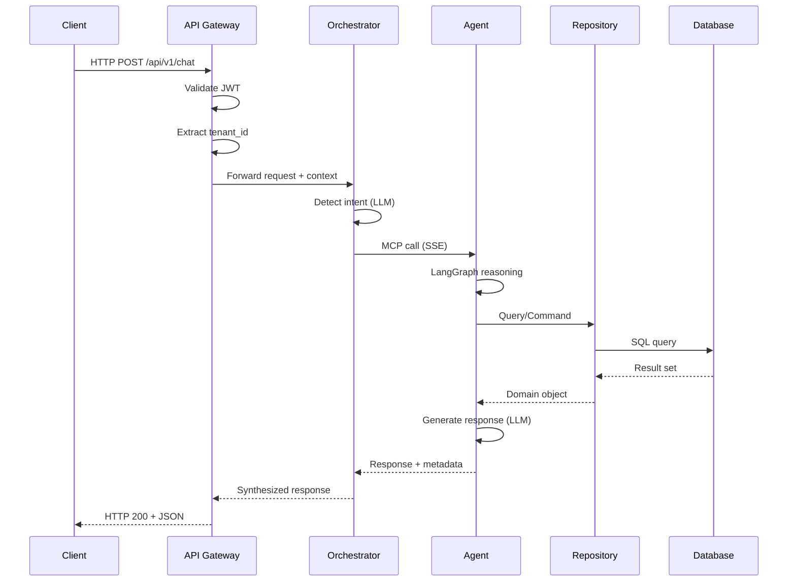
```mermaid
sequenceDiagram
    participant Client
    participant API Gateway
    participant Orchestrator
    participant Agent
    participant Repository
    participant Database

    Client->>API Gateway: HTTP POST /api/v1/chat
    API Gateway->>API Gateway: Validate JWT
    API Gateway->>API Gateway: Extract tenant_id
    API Gateway->>Orchestrator: Forward request + context

    Orchestrator->>Orchestrator: Detect intent (LLM)
    Orchestrator->>Agent: MCP call (SSE)

    Agent->>Agent: LangGraph reasoning
    Agent->>Repository: Query/Command
    Repository->>Database: SQL query
    Database-->>Repository: Result set
    Repository-->>Agent: Domain object

    Agent->>Agent: Generate response (LLM)
    Agent-->>Orchestrator: Response + metadata
    Orchestrator-->>API Gateway: Synthesized response
    API Gateway-->>Client: HTTP 200 + JSON
```

**Flow Characteristics:**
- **Latency:** 200-2000ms (depending on LLM calls)
- **Synchronous:** Client waits for response
- **Transactional:** Database changes committed before response
- **Idempotent:** Duplicate requests produce same result

---

### Pattern 2: Event-Driven Flow

Asynchronous communication pattern for agent-to-agent coordination.

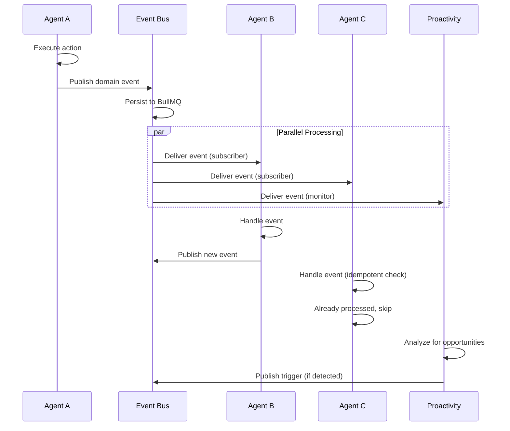
```mermaid
sequenceDiagram
    participant Agent A
    participant Event Bus
    participant Agent B
    participant Agent C
    participant Proactivity

    Agent A->>Agent A: Execute action
    Agent A->>Event Bus: Publish domain event
    Event Bus->>Event Bus: Persist to BullMQ

    par Parallel Processing
        Event Bus->>Agent B: Deliver event (subscriber)
        Event Bus->>Agent C: Deliver event (subscriber)
        Event Bus->>Proactivity: Deliver event (monitor)
    end

    Agent B->>Agent B: Handle event
    Agent B->>Event Bus: Publish new event

    Agent C->>Agent C: Handle event (idempotent check)
    Agent C->>Agent C: Already processed, skip

    Proactivity->>Proactivity: Analyze for opportunities
    Proactivity->>Event Bus: Publish trigger (if detected)
```

**Flow Characteristics:**
- **Latency:** 10-100ms per hop
- **Asynchronous:** Publisher doesn't wait for subscribers
- **At-Least-Once Delivery:** Events may be delivered multiple times
- **Idempotent Handlers:** All subscribers check for duplicates

---

### Pattern 3: CQRS (Command Query Responsibility Segregation)

Separates read operations (queries) from write operations (commands).

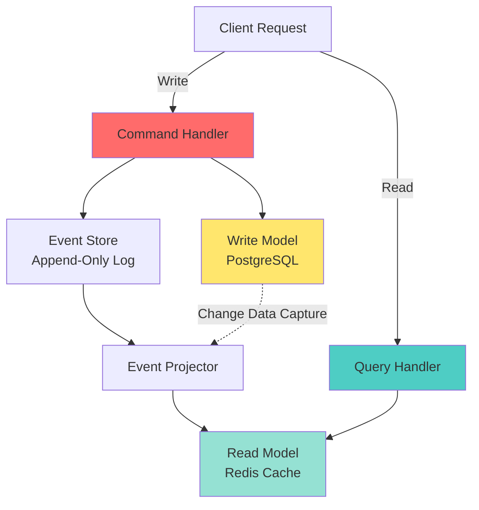
```mermaid
flowchart TD
    Client[Client Request]

    Client -->|Write| Command[Command Handler]
    Client -->|Read| Query[Query Handler]

    Command --> WriteModel[Write Model<br/>PostgreSQL]
    Command --> EventStore[Event Store<br/>Append-Only Log]

    EventStore --> Projector[Event Projector]
    Projector --> ReadModel[Read Model<br/>Redis Cache]

    Query --> ReadModel

    WriteModel -.->|Change Data Capture| Projector

    style Command fill:#ff6b6b
    style Query fill:#4ecdc4
    style WriteModel fill:#ffe66d
    style ReadModel fill:#95e1d3
```

**Flow Characteristics:**
- **Write Path:** Commands update PostgreSQL, emit events
- **Read Path:** Queries read from Redis cache (fast)
- **Eventual Consistency:** Read model updated asynchronously
- **Scalability:** Read and write models scale independently

---

### Pattern 4: Saga Pattern (Distributed Transactions)

Manages multi-agent scenarios with compensating transactions.

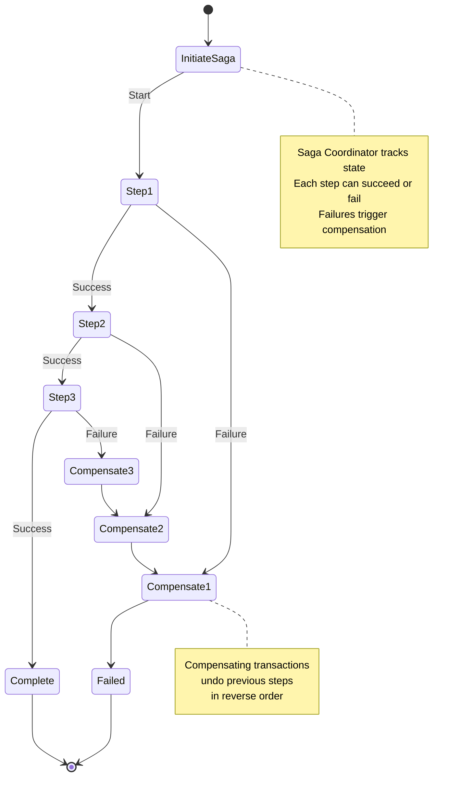
```mermaid
stateDiagram-v2
    [*] --> InitiateSaga
    InitiateSaga --> Step1: Start

    Step1 --> Step2: Success
    Step1 --> Compensate1: Failure

    Step2 --> Step3: Success
    Step2 --> Compensate2: Failure

    Step3 --> Complete: Success
    Step3 --> Compensate3: Failure

    Compensate3 --> Compensate2
    Compensate2 --> Compensate1
    Compensate1 --> Failed

    Complete --> [*]
    Failed --> [*]

    note right of InitiateSaga
        Saga Coordinator tracks state
        Each step can succeed or fail
        Failures trigger compensation
    end note

    note right of Compensate1
        Compensating transactions
        undo previous steps
        in reverse order
    end note
```

**Flow Characteristics:**
- **Distributed Transaction:** Spans multiple agents
- **Compensating Actions:** Each step has an undo operation
- **Eventual Consistency:** System reaches consistent state
- **Failure Handling:** Automatic rollback on failure

---

## User Request Flows

### Flow 1: Simple User Query

User asks a question that a single agent can answer.

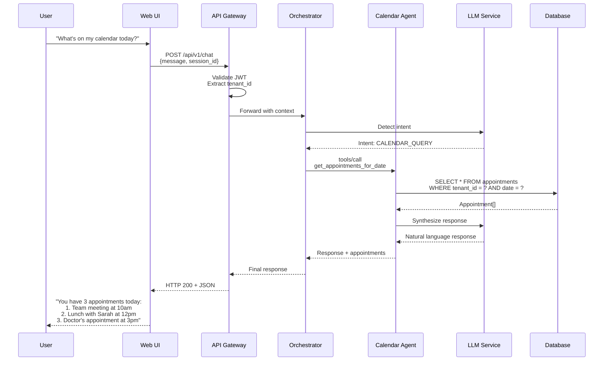
```mermaid
sequenceDiagram
    participant User
    participant Web UI
    participant API Gateway
    participant Orchestrator
    participant Calendar Agent
    participant LLM Service
    participant Database

    User->>Web UI: "What's on my calendar today?"
    Web UI->>API Gateway: POST /api/v1/chat<br/>{message, session_id}

    API Gateway->>API Gateway: Validate JWT<br/>Extract tenant_id
    API Gateway->>Orchestrator: Forward with context

    Orchestrator->>LLM Service: Detect intent
    LLM Service-->>Orchestrator: Intent: CALENDAR_QUERY

    Orchestrator->>Calendar Agent: tools/call<br/>get_appointments_for_date

    Calendar Agent->>Database: SELECT * FROM appointments<br/>WHERE tenant_id = ? AND date = ?
    Database-->>Calendar Agent: Appointment[]

    Calendar Agent->>LLM Service: Synthesize response
    LLM Service-->>Calendar Agent: Natural language response

    Calendar Agent-->>Orchestrator: Response + appointments
    Orchestrator-->>API Gateway: Final response
    API Gateway-->>Web UI: HTTP 200 + JSON
    Web UI-->>User: "You have 3 appointments today:<br/>1. Team meeting at 10am<br/>2. Lunch with Sarah at 12pm<br/>3. Doctor's appointment at 3pm"
```

**Key Points:**
- **Single Agent:** Only Calendar Agent involved
- **Synchronous:** User waits for response (~500ms)
- **Tenant Isolated:** All queries filtered by tenant_id
- **LLM Usage:** 2 LLM calls (intent detection + response synthesis)

---

### Flow 2: Multi-Agent Command

User request requires coordination between multiple agents.

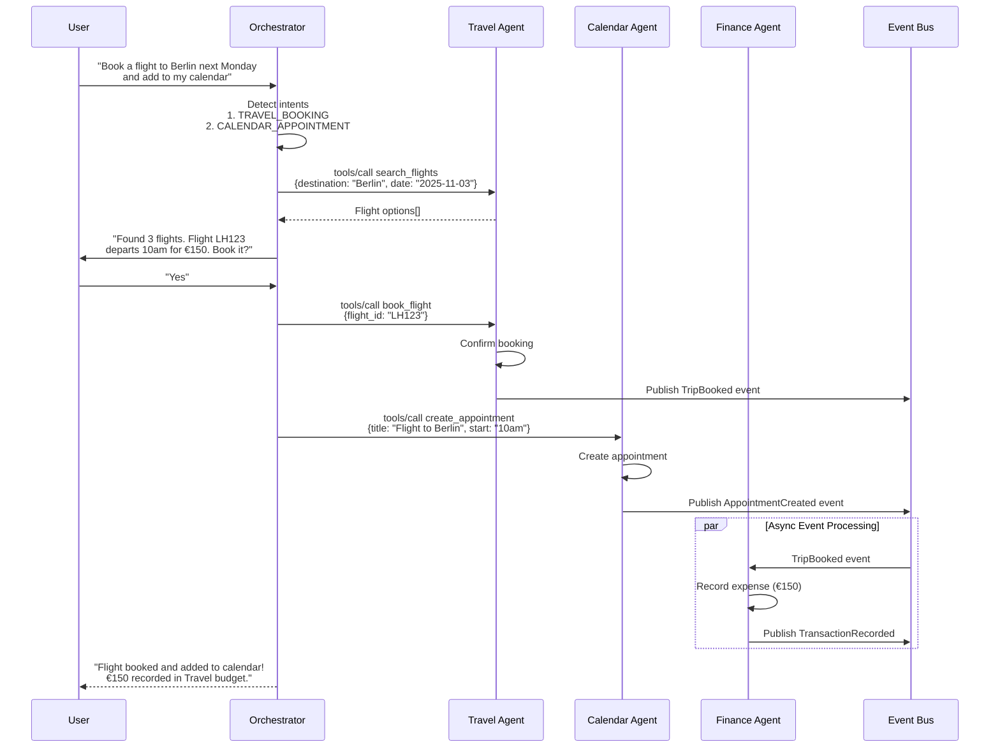
```mermaid
sequenceDiagram
    participant User
    participant Orchestrator
    participant Travel Agent
    participant Calendar Agent
    participant Finance Agent
    participant Event Bus

    User->>Orchestrator: "Book a flight to Berlin next Monday<br/>and add to my calendar"

    Orchestrator->>Orchestrator: Detect intents<br/>1. TRAVEL_BOOKING<br/>2. CALENDAR_APPOINTMENT

    Orchestrator->>Travel Agent: tools/call search_flights<br/>{destination: "Berlin", date: "2025-11-03"}
    Travel Agent-->>Orchestrator: Flight options[]

    Orchestrator->>User: "Found 3 flights. Flight LH123<br/>departs 10am for €150. Book it?"
    User->>Orchestrator: "Yes"

    Orchestrator->>Travel Agent: tools/call book_flight<br/>{flight_id: "LH123"}
    Travel Agent->>Travel Agent: Confirm booking
    Travel Agent->>Event Bus: Publish TripBooked event

    Orchestrator->>Calendar Agent: tools/call create_appointment<br/>{title: "Flight to Berlin", start: "10am"}
    Calendar Agent->>Calendar Agent: Create appointment
    Calendar Agent->>Event Bus: Publish AppointmentCreated event

    par Async Event Processing
        Event Bus->>Finance Agent: TripBooked event
        Finance Agent->>Finance Agent: Record expense (€150)
        Finance Agent->>Event Bus: Publish TransactionRecorded
    end

    Orchestrator-->>User: "Flight booked and added to calendar!<br/>€150 recorded in Travel budget."
```

**Key Points:**
- **Multi-Agent Coordination:** Travel + Calendar + Finance agents
- **Sequential Execution:** Booking then calendar entry
- **Event-Driven Side Effects:** Finance agent triggered by event
- **User Confirmation:** Orchestrator asks for confirmation before booking

---

### Flow 3: Streaming Response

Long-running task with progress updates streamed to user.

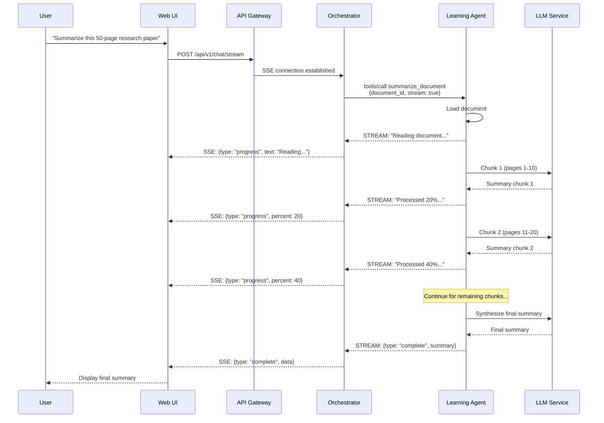
```mermaid
sequenceDiagram
    participant User
    participant Web UI
    participant API Gateway
    participant Orchestrator
    participant Learning Agent
    participant LLM Service

    User->>Web UI: "Summarize this 50-page research paper"
    Web UI->>API Gateway: POST /api/v1/chat/stream
    API Gateway->>Orchestrator: SSE connection established

    Orchestrator->>Learning Agent: tools/call summarize_document<br/>{document_id, stream: true}

    Learning Agent->>Learning Agent: Load document
    Learning Agent-->>Orchestrator: STREAM: "Reading document..."
    Orchestrator-->>Web UI: SSE: {type: "progress", text: "Reading..."}

    Learning Agent->>LLM Service: Chunk 1 (pages 1-10)
    LLM Service-->>Learning Agent: Summary chunk 1
    Learning Agent-->>Orchestrator: STREAM: "Processed 20%..."
    Orchestrator-->>Web UI: SSE: {type: "progress", percent: 20}

    Learning Agent->>LLM Service: Chunk 2 (pages 11-20)
    LLM Service-->>Learning Agent: Summary chunk 2
    Learning Agent-->>Orchestrator: STREAM: "Processed 40%..."
    Orchestrator-->>Web UI: SSE: {type: "progress", percent: 40}

    Note over Learning Agent: Continue for remaining chunks...

    Learning Agent->>LLM Service: Synthesize final summary
    LLM Service-->>Learning Agent: Final summary
    Learning Agent-->>Orchestrator: STREAM: {type: "complete", summary}
    Orchestrator-->>Web UI: SSE: {type: "complete", data}

    Web UI-->>User: Display final summary
```

**Key Points:**
- **Server-Sent Events (SSE):** Real-time progress updates
- **Chunked Processing:** Large document split into chunks
- **Non-Blocking:** User can cancel mid-stream
- **Progress Tracking:** Percentage completion shown

---

### Flow 4: Conversational Context

Multi-turn conversation maintaining state across requests.

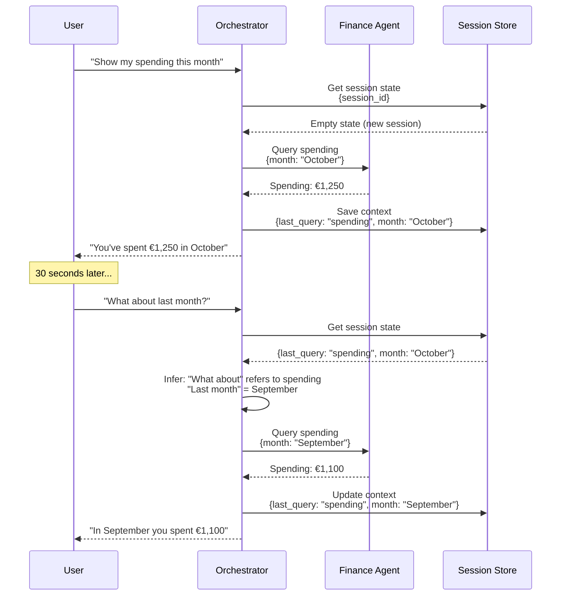
```mermaid
sequenceDiagram
    participant User
    participant Orchestrator
    participant Finance Agent
    participant Session Store

    User->>Orchestrator: "Show my spending this month"
    Orchestrator->>Session Store: Get session state<br/>{session_id}
    Session Store-->>Orchestrator: Empty state (new session)

    Orchestrator->>Finance Agent: Query spending<br/>{month: "October"}
    Finance Agent-->>Orchestrator: Spending: €1,250

    Orchestrator->>Session Store: Save context<br/>{last_query: "spending", month: "October"}
    Orchestrator-->>User: "You've spent €1,250 in October"

    Note over User: 30 seconds later...

    User->>Orchestrator: "What about last month?"
    Orchestrator->>Session Store: Get session state
    Session Store-->>Orchestrator: {last_query: "spending", month: "October"}

    Orchestrator->>Orchestrator: Infer: "What about" refers to spending<br/>"Last month" = September

    Orchestrator->>Finance Agent: Query spending<br/>{month: "September"}
    Finance Agent-->>Orchestrator: Spending: €1,100

    Orchestrator->>Session Store: Update context<br/>{last_query: "spending", month: "September"}
    Orchestrator-->>User: "In September you spent €1,100"
```

**Key Points:**
- **Session State:** Maintained in Redis (24h TTL)
- **Context Inference:** Orchestrator uses previous context to resolve ambiguity
- **Conversation Memory:** Each agent maintains its own state in LangGraph checkpointer
- **Privacy:** Session state is tenant-isolated

---

## Event-Driven Communication Flows

### Flow 5: Domain Event Broadcasting

One agent publishes an event, multiple agents react.

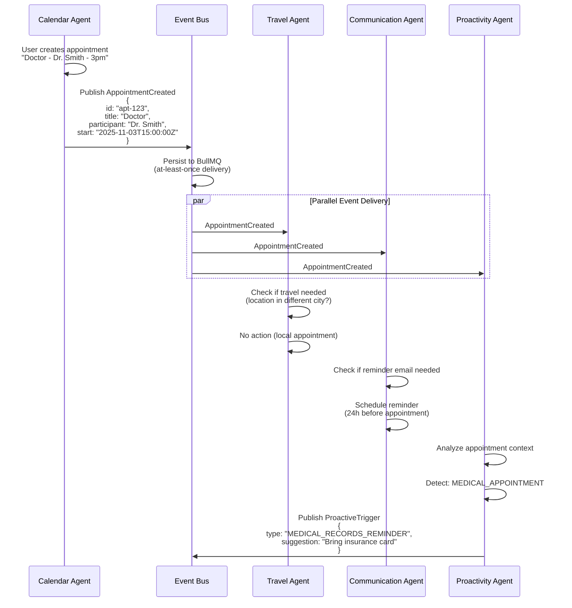
```mermaid
sequenceDiagram
    participant Calendar Agent
    participant Event Bus
    participant Travel Agent
    participant Communication Agent
    participant Proactivity Agent

    Calendar Agent->>Calendar Agent: User creates appointment<br/>"Doctor - Dr. Smith - 3pm"

    Calendar Agent->>Event Bus: Publish AppointmentCreated<br/>{<br/>  id: "apt-123",<br/>  title: "Doctor",<br/>  participant: "Dr. Smith",<br/>  start: "2025-11-03T15:00:00Z"<br/>}

    Event Bus->>Event Bus: Persist to BullMQ<br/>(at-least-once delivery)

    par Parallel Event Delivery
        Event Bus->>Travel Agent: AppointmentCreated
        Event Bus->>Communication Agent: AppointmentCreated
        Event Bus->>Proactivity Agent: AppointmentCreated
    end

    Travel Agent->>Travel Agent: Check if travel needed<br/>(location in different city?)
    Travel Agent->>Travel Agent: No action (local appointment)

    Communication Agent->>Communication Agent: Check if reminder email needed
    Communication Agent->>Communication Agent: Schedule reminder<br/>(24h before appointment)

    Proactivity Agent->>Proactivity Agent: Analyze appointment context
    Proactivity Agent->>Proactivity Agent: Detect: MEDICAL_APPOINTMENT
    Proactivity Agent->>Event Bus: Publish ProactiveTrigger<br/>{<br/>  type: "MEDICAL_RECORDS_REMINDER",<br/>  suggestion: "Bring insurance card"<br/>}
```

**Key Points:**
- **Fan-Out Pattern:** One event, multiple subscribers
- **Loose Coupling:** Calendar Agent doesn't know who's listening
- **Idempotent Handling:** Each agent checks if already processed
- **Async Processing:** Subscribers process independently

---

### Flow 6: Event Choreography

Complex multi-agent scenario coordinated purely through events (no orchestrator).

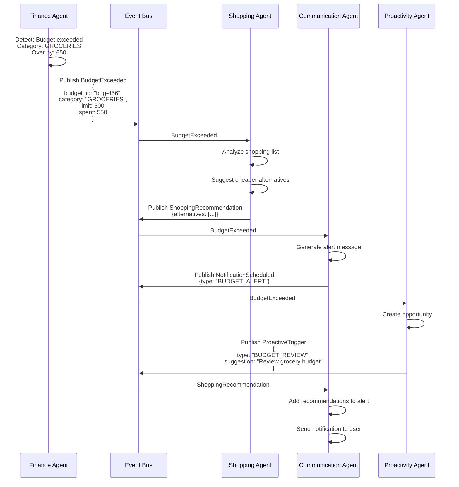
```mermaid
sequenceDiagram
    participant Finance Agent
    participant Event Bus
    participant Shopping Agent
    participant Communication Agent
    participant Proactivity Agent

    Finance Agent->>Finance Agent: Detect: Budget exceeded<br/>Category: GROCERIES<br/>Over by: €50

    Finance Agent->>Event Bus: Publish BudgetExceeded<br/>{<br/>  budget_id: "bdg-456",<br/>  category: "GROCERIES",<br/>  limit: 500,<br/>  spent: 550<br/>}

    Event Bus->>Shopping Agent: BudgetExceeded
    Shopping Agent->>Shopping Agent: Analyze shopping list
    Shopping Agent->>Shopping Agent: Suggest cheaper alternatives
    Shopping Agent->>Event Bus: Publish ShoppingRecommendation<br/>{alternatives: [...]}

    Event Bus->>Communication Agent: BudgetExceeded
    Communication Agent->>Communication Agent: Generate alert message
    Communication Agent->>Event Bus: Publish NotificationScheduled<br/>{type: "BUDGET_ALERT"}

    Event Bus->>Proactivity Agent: BudgetExceeded
    Proactivity Agent->>Proactivity Agent: Create opportunity
    Proactivity Agent->>Event Bus: Publish ProactiveTrigger<br/>{<br/>  type: "BUDGET_REVIEW",<br/>  suggestion: "Review grocery budget"<br/>}

    Event Bus->>Communication Agent: ShoppingRecommendation
    Communication Agent->>Communication Agent: Add recommendations to alert
    Communication Agent->>Communication Agent: Send notification to user
```

**Key Points:**
- **No Central Orchestrator:** Agents react to events autonomously
- **Event Chain:** One event triggers another in a chain
- **Emergent Behavior:** Complex workflow emerges from simple rules
- **Resilient:** Failure of one agent doesn't block others

---

### Flow 7: Event Sourcing

Complete audit trail of all state changes through append-only event log.

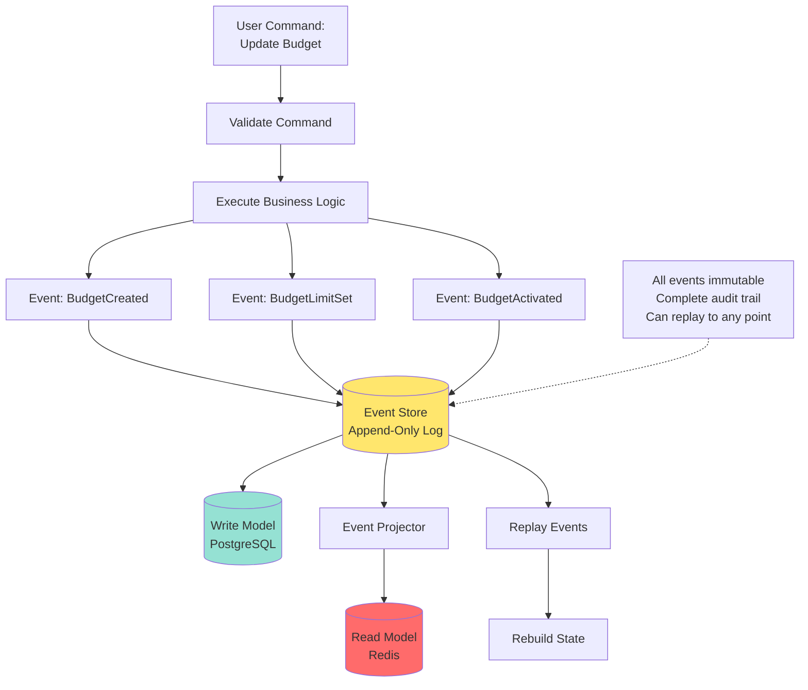
```mermaid
flowchart TD
    Command[User Command:<br/>Update Budget]

    Command --> Validate[Validate Command]
    Validate --> Execute[Execute Business Logic]

    Execute --> Event1[Event: BudgetCreated]
    Execute --> Event2[Event: BudgetLimitSet]
    Execute --> Event3[Event: BudgetActivated]

    Event1 --> EventStore[(Event Store<br/>Append-Only Log)]
    Event2 --> EventStore
    Event3 --> EventStore

    EventStore --> WriteDB[(Write Model<br/>PostgreSQL)]
    EventStore --> Projector[Event Projector]

    Projector --> ReadCache[(Read Model<br/>Redis)]

    EventStore --> Replay[Replay Events]
    Replay --> Rebuild[Rebuild State]

    style EventStore fill:#ffe66d
    style WriteDB fill:#95e1d3
    style ReadCache fill:#ff6b6b

    Note1[All events immutable<br/>Complete audit trail<br/>Can replay to any point]
    Note1 -.-> EventStore
```

**Event Store Schema:**

```typescript
interface StoredEvent {
  id: string;                    // Unique event ID
  tenant_id: string;             // Tenant isolation
  aggregate_id: string;          // Which entity changed
  aggregate_type: string;        // Budget, Appointment, etc.
  event_type: string;            // BudgetCreated, etc.
  event_data: Record<string, any>; // Event payload
  metadata: {
    user_id: string;
    timestamp: Date;
    correlation_id: string;      // Trace across services
    causation_id: string;        // Which event caused this
  };
  version: number;               // Optimistic concurrency
}
```

**Key Points:**
- **Immutable Log:** Events never deleted, only appended
- **Complete History:** Can reconstruct state at any point in time
- **Audit Trail:** EU AI Act compliance for AI decisions
- **Debugging:** Replay events to reproduce bugs

---

## Data Persistence Flows

### Flow 8: Write Path (Command)

Storing data changes with domain events.

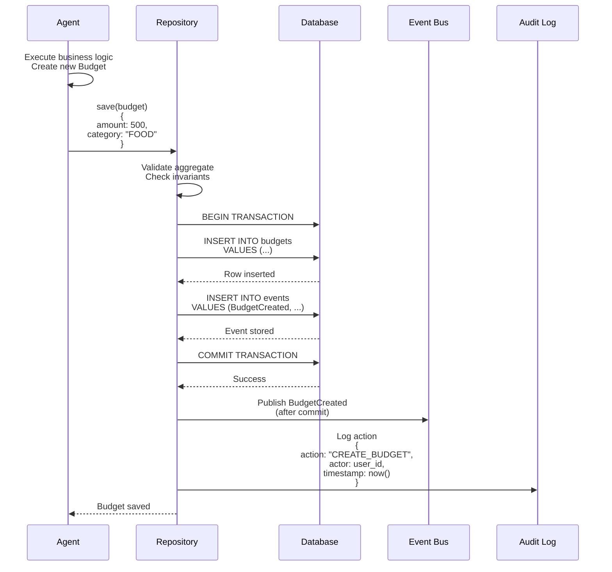
```mermaid
sequenceDiagram
    participant Agent
    participant Repository
    participant Database
    participant Event Bus
    participant Audit Log

    Agent->>Agent: Execute business logic<br/>Create new Budget

    Agent->>Repository: save(budget)<br/>{<br/>  amount: 500,<br/>  category: "FOOD"<br/>}

    Repository->>Repository: Validate aggregate<br/>Check invariants

    Repository->>Database: BEGIN TRANSACTION

    Repository->>Database: INSERT INTO budgets<br/>VALUES (...)
    Database-->>Repository: Row inserted

    Repository->>Database: INSERT INTO events<br/>VALUES (BudgetCreated, ...)
    Database-->>Repository: Event stored

    Repository->>Database: COMMIT TRANSACTION
    Database-->>Repository: Success

    Repository->>Event Bus: Publish BudgetCreated<br/>(after commit)

    Repository->>Audit Log: Log action<br/>{<br/>  action: "CREATE_BUDGET",<br/>  actor: user_id,<br/>  timestamp: now()<br/>}

    Repository-->>Agent: Budget saved
```

**Key Points:**
- **Transactional:** Event stored in same transaction as entity
- **Event After Commit:** Only publish event if transaction succeeds
- **Audit Trail:** All writes logged for compliance
- **Optimistic Locking:** Version number prevents concurrent updates

---

### Flow 9: Read Path (Query)

Reading data with caching for performance.

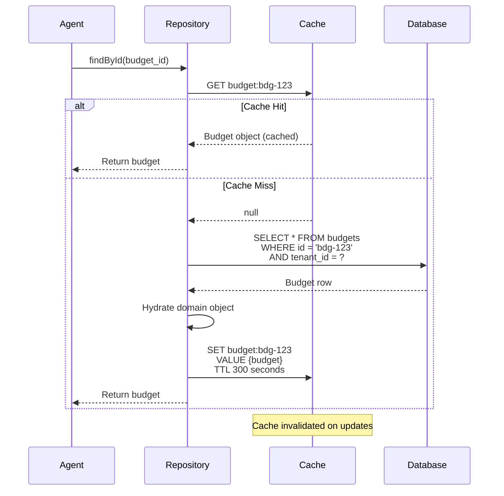
```mermaid
sequenceDiagram
    participant Agent
    participant Repository
    participant Cache
    participant Database

    Agent->>Repository: findById(budget_id)

    Repository->>Cache: GET budget:bdg-123

    alt Cache Hit
        Cache-->>Repository: Budget object (cached)
        Repository-->>Agent: Return budget
    else Cache Miss
        Cache-->>Repository: null

        Repository->>Database: SELECT * FROM budgets<br/>WHERE id = 'bdg-123'<br/>AND tenant_id = ?
        Database-->>Repository: Budget row

        Repository->>Repository: Hydrate domain object

        Repository->>Cache: SET budget:bdg-123<br/>VALUE {budget}<br/>TTL 300 seconds

        Repository-->>Agent: Return budget
    end

    Note over Cache: Cache invalidated on updates
```

**Caching Strategy:**

| Data Type | Cache TTL | Invalidation Strategy |
|-----------|-----------|----------------------|
| **User Profile** | 1 hour | Invalidate on update |
| **Budget** | 5 minutes | Invalidate on transaction |
| **Appointments** | 10 minutes | Invalidate on create/update |
| **Transaction History** | 30 seconds | Invalidate on new transaction |
| **Proactive Opportunities** | No cache | Always fresh |

**Key Points:**
- **Cache-Aside Pattern:** Application manages cache
- **TTL-Based Expiry:** Cache entries expire automatically
- **Invalidate on Write:** Write operations clear cache
- **Tenant Isolation:** Cache keys include tenant_id

---

### Flow 10: Aggregate Persistence

Storing complex domain aggregates with child entities.

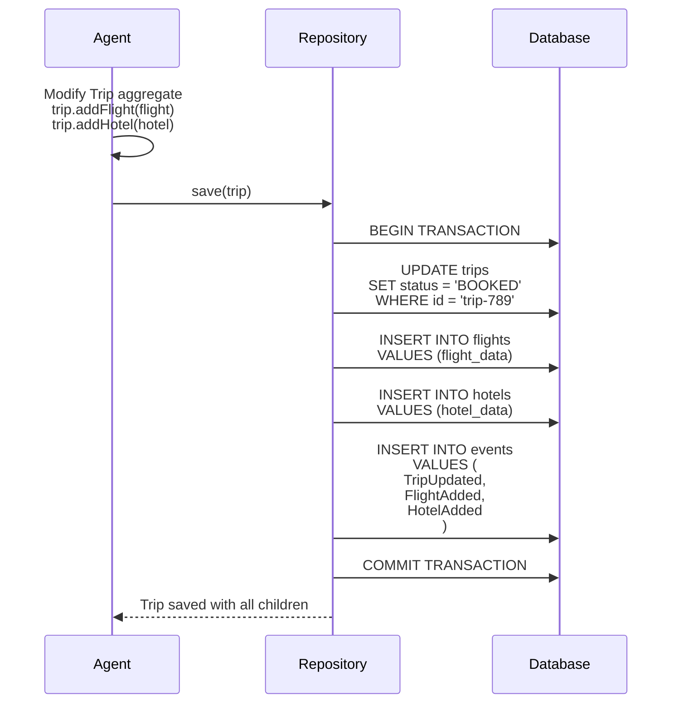
```mermaid
sequenceDiagram
    participant Agent
    participant Repository
    participant Database

    Agent->>Agent: Modify Trip aggregate<br/>trip.addFlight(flight)<br/>trip.addHotel(hotel)

    Agent->>Repository: save(trip)

    Repository->>Database: BEGIN TRANSACTION

    Repository->>Database: UPDATE trips<br/>SET status = 'BOOKED'<br/>WHERE id = 'trip-789'

    Repository->>Database: INSERT INTO flights<br/>VALUES (flight_data)

    Repository->>Database: INSERT INTO hotels<br/>VALUES (hotel_data)

    Repository->>Database: INSERT INTO events<br/>VALUES (<br/>  TripUpdated,<br/>  FlightAdded,<br/>  HotelAdded<br/>)

    Repository->>Database: COMMIT TRANSACTION

    Repository-->>Agent: Trip saved with all children
```

**Aggregate Root Pattern:**

```typescript
class Trip {
  // Aggregate root
  id: string;
  tenant_id: string;
  status: TripStatus;

  // Child entities (managed by root)
  flights: Flight[];
  hotels: Hotel[];
  activities: Activity[];

  // Invariant enforcement
  addFlight(flight: Flight): void {
    // Business rule: Can't add flight to cancelled trip
    if (this.status === 'CANCELLED') {
      throw new Error('Cannot add flight to cancelled trip');
    }

    // Business rule: Flight dates must be within trip dates
    if (!this.datesInclude(flight.departureDate)) {
      throw new Error('Flight dates outside trip dates');
    }

    this.flights.push(flight);
    this.emitEvent(new FlightAdded(this.id, flight.id));
  }
}
```

**Key Points:**
- **Transactional Consistency:** All changes in single transaction
- **Invariant Enforcement:** Aggregate root ensures business rules
- **Cascade Operations:** Deleting trip deletes all children
- **Event Emission:** Each state change generates event

---

## External Integration Flows

### Flow 11: External MCP Server Call

Agent calling external MCP server (e.g., Google Calendar).

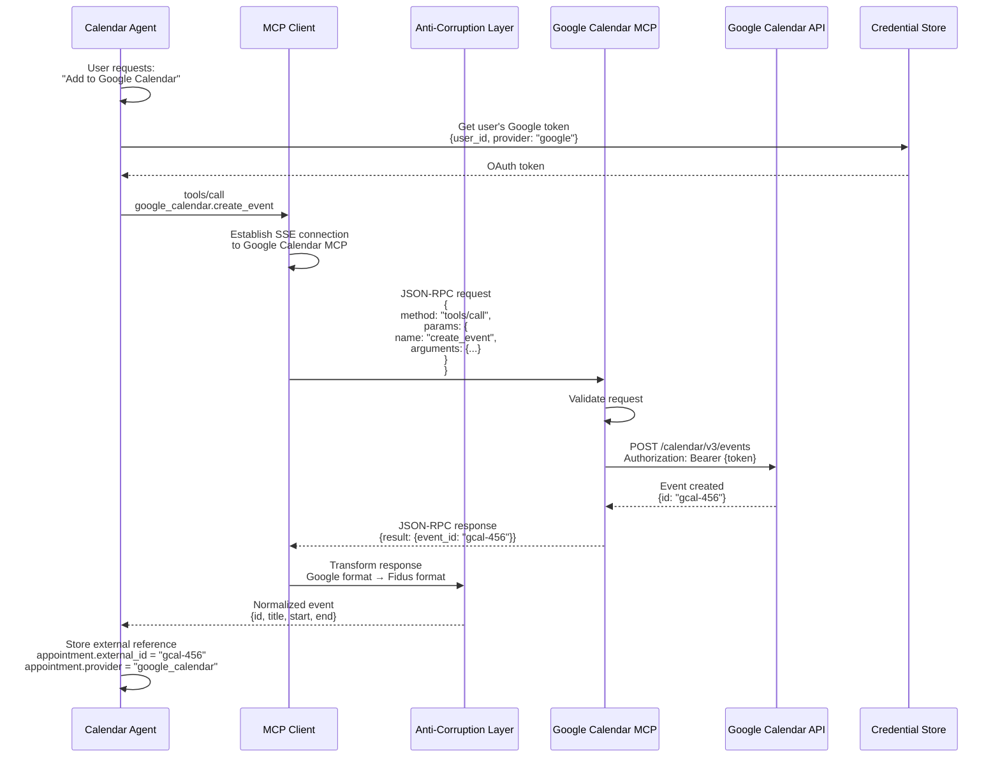
```mermaid
sequenceDiagram
    participant Calendar Agent
    participant MCP Client
    participant Anti-Corruption Layer
    participant Google Calendar MCP
    participant Google Calendar API
    participant Credential Store

    Calendar Agent->>Calendar Agent: User requests:<br/>"Add to Google Calendar"

    Calendar Agent->>Credential Store: Get user's Google token<br/>{user_id, provider: "google"}
    Credential Store-->>Calendar Agent: OAuth token

    Calendar Agent->>MCP Client: tools/call<br/>google_calendar.create_event

    MCP Client->>MCP Client: Establish SSE connection<br/>to Google Calendar MCP

    MCP Client->>Google Calendar MCP: JSON-RPC request<br/>{<br/>  method: "tools/call",<br/>  params: {<br/>    name: "create_event",<br/>    arguments: {...}<br/>  }<br/>}

    Google Calendar MCP->>Google Calendar MCP: Validate request
    Google Calendar MCP->>Google Calendar API: POST /calendar/v3/events<br/>Authorization: Bearer {token}

    Google Calendar API-->>Google Calendar MCP: Event created<br/>{id: "gcal-456"}

    Google Calendar MCP-->>MCP Client: JSON-RPC response<br/>{result: {event_id: "gcal-456"}}

    MCP Client->>Anti-Corruption Layer: Transform response<br/>Google format → Fidus format

    Anti-Corruption Layer-->>Calendar Agent: Normalized event<br/>{id, title, start, end}

    Calendar Agent->>Calendar Agent: Store external reference<br/>appointment.external_id = "gcal-456"<br/>appointment.provider = "google_calendar"
```

**Anti-Corruption Layer:**

```typescript
class GoogleCalendarAdapter implements ExternalCalendarAdapter {
  // Transform Fidus format → Google format
  toExternal(appointment: Appointment): GoogleEvent {
    return {
      summary: appointment.title,
      start: {
        dateTime: appointment.start.toISOString(),
        timeZone: appointment.timezone || 'UTC'
      },
      end: {
        dateTime: appointment.end.toISOString(),
        timeZone: appointment.timezone || 'UTC'
      },
      description: appointment.description,
      // Map only fields that Google supports
    };
  }

  // Transform Google format → Fidus format
  fromExternal(googleEvent: GoogleEvent): Appointment {
    return Appointment.create({
      title: googleEvent.summary,
      start: new Date(googleEvent.start.dateTime),
      end: new Date(googleEvent.end.dateTime),
      description: googleEvent.description,
      // Ignore Google-specific fields
      external_id: googleEvent.id,
      external_provider: 'google_calendar'
    });
  }
}
```

**Key Points:**
- **Per-User Credentials:** Each user's OAuth token stored encrypted
- **Anti-Corruption Layer:** Protects Fidus domain model from external schemas
- **Bidirectional Sync:** Changes in Google Calendar reflected in Fidus
- **Error Handling:** External API failures don't crash agent

---

### Flow 12: Webhook Event from External Service

External service pushes events to Fidus via webhook.

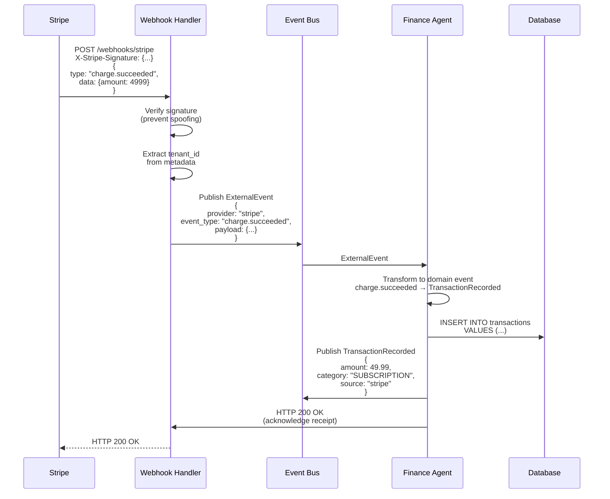
```mermaid
sequenceDiagram
    participant Stripe
    participant Webhook Handler
    participant Event Bus
    participant Finance Agent
    participant Database

    Stripe->>Webhook Handler: POST /webhooks/stripe<br/>X-Stripe-Signature: {...}<br/>{<br/>  type: "charge.succeeded",<br/>  data: {amount: 4999}<br/>}

    Webhook Handler->>Webhook Handler: Verify signature<br/>(prevent spoofing)

    Webhook Handler->>Webhook Handler: Extract tenant_id<br/>from metadata

    Webhook Handler->>Event Bus: Publish ExternalEvent<br/>{<br/>  provider: "stripe",<br/>  event_type: "charge.succeeded",<br/>  payload: {...}<br/>}

    Event Bus->>Finance Agent: ExternalEvent

    Finance Agent->>Finance Agent: Transform to domain event<br/>charge.succeeded → TransactionRecorded

    Finance Agent->>Database: INSERT INTO transactions<br/>VALUES (...)

    Finance Agent->>Event Bus: Publish TransactionRecorded<br/>{<br/>  amount: 49.99,<br/>  category: "SUBSCRIPTION",<br/>  source: "stripe"<br/>}

    Finance Agent->>Webhook Handler: HTTP 200 OK<br/>(acknowledge receipt)

    Webhook Handler-->>Stripe: HTTP 200 OK
```

**Webhook Security:**

```typescript
class WebhookHandler {
  async handleStripeWebhook(req: Request): Promise<Response> {
    // 1. Verify signature
    const signature = req.headers.get('X-Stripe-Signature');
    const isValid = stripe.webhooks.verifySignature(
      req.body,
      signature,
      process.env.STRIPE_WEBHOOK_SECRET
    );

    if (!isValid) {
      return new Response('Invalid signature', { status: 401 });
    }

    // 2. Idempotency check
    const event = await req.json();
    const processed = await this.idempotencyStore.has(event.id);
    if (processed) {
      return new Response('Already processed', { status: 200 });
    }

    // 3. Extract tenant context
    const tenant_id = event.data.object.metadata?.tenant_id;
    if (!tenant_id) {
      return new Response('Missing tenant_id', { status: 400 });
    }

    // 4. Publish to event bus
    await this.eventBus.publish('external.stripe.event', {
      ...event,
      tenant_id
    });

    // 5. Mark as processed
    await this.idempotencyStore.set(event.id, true, { ttl: 86400 });

    return new Response('OK', { status: 200 });
  }
}
```

**Key Points:**
- **Signature Verification:** Prevents webhook spoofing attacks
- **Idempotency:** Duplicate webhooks handled gracefully
- **Async Processing:** Webhook acknowledged immediately, processed async
- **Tenant Isolation:** Webhook events include tenant context

---

### Flow 13: Polling External API

Periodically fetch data from external service that doesn't support webhooks.

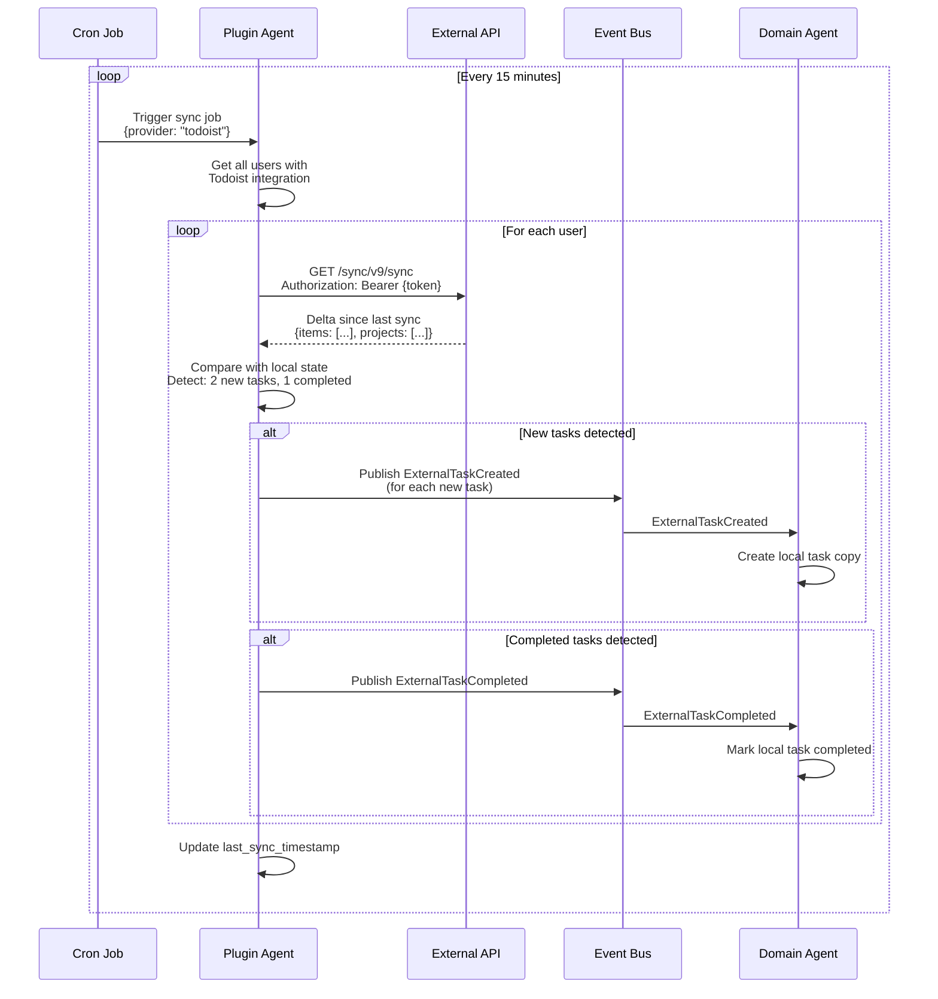
```mermaid
sequenceDiagram
    participant Cron Job
    participant Plugin Agent
    participant External API
    participant Event Bus
    participant Domain Agent

    loop Every 15 minutes
        Cron Job->>Plugin Agent: Trigger sync job<br/>{provider: "todoist"}

        Plugin Agent->>Plugin Agent: Get all users with<br/>Todoist integration

        loop For each user
            Plugin Agent->>External API: GET /sync/v9/sync<br/>Authorization: Bearer {token}

            External API-->>Plugin Agent: Delta since last sync<br/>{items: [...], projects: [...]}

            Plugin Agent->>Plugin Agent: Compare with local state<br/>Detect: 2 new tasks, 1 completed

            alt New tasks detected
                Plugin Agent->>Event Bus: Publish ExternalTaskCreated<br/>(for each new task)

                Event Bus->>Domain Agent: ExternalTaskCreated
                Domain Agent->>Domain Agent: Create local task copy
            end

            alt Completed tasks detected
                Plugin Agent->>Event Bus: Publish ExternalTaskCompleted

                Event Bus->>Domain Agent: ExternalTaskCompleted
                Domain Agent->>Domain Agent: Mark local task completed
            end
        end

        Plugin Agent->>Plugin Agent: Update last_sync_timestamp
    end
```

**Polling Strategy:**

| Service | Polling Interval | Reason |
|---------|-----------------|--------|
| **Email (IMAP)** | 5 minutes | Near real-time needed |
| **Todoist** | 15 minutes | Tasks don't change frequently |
| **Weather API** | 1 hour | Weather updates slowly |
| **Stock Prices** | 5 seconds (market hours only) | High frequency needed |
| **Smart Home Devices** | 30 seconds | State changes frequently |

**Key Points:**
- **Delta Sync:** Only fetch changes since last sync
- **Rate Limiting:** Respect external API limits
- **Per-User Polling:** Each user's integrations polled separately
- **Exponential Backoff:** On API errors, increase polling interval

---

## Proactivity Flows

### Flow 14: Opportunity Detection

Proactivity Agent detects opportunity from data signals and events.

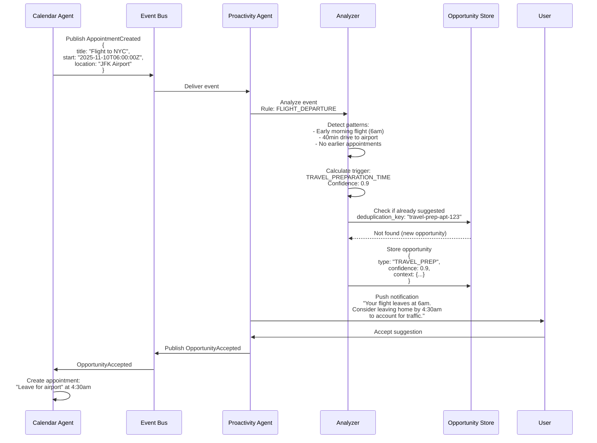
```mermaid
sequenceDiagram
    participant Calendar Agent
    participant Event Bus
    participant Proactivity Agent
    participant Analyzer
    participant Opportunity Store
    participant User

    Calendar Agent->>Event Bus: Publish AppointmentCreated<br/>{<br/>  title: "Flight to NYC",<br/>  start: "2025-11-10T06:00:00Z",<br/>  location: "JFK Airport"<br/>}

    Event Bus->>Proactivity Agent: Deliver event

    Proactivity Agent->>Analyzer: Analyze event<br/>Rule: FLIGHT_DEPARTURE

    Analyzer->>Analyzer: Detect patterns:<br/>- Early morning flight (6am)<br/>- 40min drive to airport<br/>- No earlier appointments

    Analyzer->>Analyzer: Calculate trigger:<br/>TRAVEL_PREPARATION_TIME<br/>Confidence: 0.9

    Analyzer->>Opportunity Store: Check if already suggested<br/>deduplication_key: "travel-prep-apt-123"

    Opportunity Store-->>Analyzer: Not found (new opportunity)

    Analyzer->>Opportunity Store: Store opportunity<br/>{<br/>  type: "TRAVEL_PREP",<br/>  confidence: 0.9,<br/>  context: {...}<br/>}

    Proactivity Agent->>User: Push notification<br/>"Your flight leaves at 6am.<br/>Consider leaving home by 4:30am<br/>to account for traffic."

    User->>Proactivity Agent: Accept suggestion

    Proactivity Agent->>Event Bus: Publish OpportunityAccepted

    Event Bus->>Calendar Agent: OpportunityAccepted
    Calendar Agent->>Calendar Agent: Create appointment:<br/>"Leave for airport" at 4:30am
```

**Opportunity Analysis Rules:**

```typescript
interface OpportunityRule {
  id: string;
  name: string;
  trigger_conditions: TriggerCondition[];
  confidence_threshold: number;
  execute: (context: Context) => Opportunity | null;
}

// Example: Flight Departure Rule
const flightDepartureRule: OpportunityRule = {
  id: 'FLIGHT_DEPARTURE',
  name: 'Suggest travel preparation time',
  trigger_conditions: [
    {
      event_type: 'AppointmentCreated',
      pattern: /flight|airport/i,
      field: 'title'
    }
  ],
  confidence_threshold: 0.8,

  execute: (context) => {
    const appointment = context.event.data;
    const travelTime = calculateTravelTime(
      context.user.location,
      appointment.location
    );

    const departureTime = new Date(appointment.start);
    departureTime.setMinutes(
      departureTime.getMinutes() - travelTime - 60 // Extra buffer
    );

    return {
      type: 'TRAVEL_PREP',
      confidence: 0.9,
      suggestion: `Leave by ${formatTime(departureTime)} to arrive on time`,
      action: {
        type: 'CREATE_APPOINTMENT',
        params: {
          title: 'Leave for airport',
          start: departureTime,
          duration: 15 // 15min reminder
        }
      }
    };
  }
};
```

**Key Points:**
- **Rule-Based + ML:** Combines hardcoded rules with ML predictions
- **Confidence Scoring:** Low confidence = suggest, high confidence = auto-execute
- **Deduplication:** Same opportunity not suggested multiple times
- **User Feedback Loop:** Accepted/rejected suggestions improve model

---

### Flow 15: Data Signal Collection

Proactivity Agent queries agents for current state (pull-based).

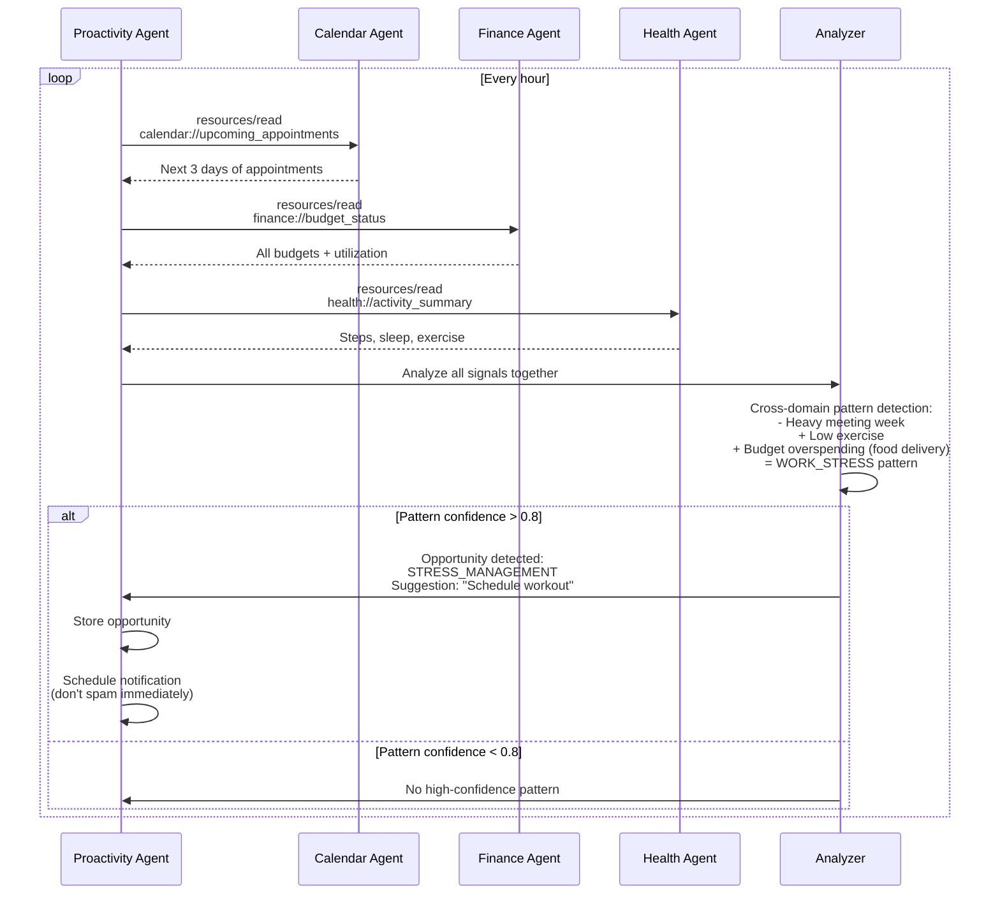
```mermaid
sequenceDiagram
    participant Proactivity Agent
    participant Calendar Agent
    participant Finance Agent
    participant Health Agent
    participant Analyzer

    loop Every hour
        Proactivity Agent->>Calendar Agent: resources/read<br/>calendar://upcoming_appointments
        Calendar Agent-->>Proactivity Agent: Next 3 days of appointments

        Proactivity Agent->>Finance Agent: resources/read<br/>finance://budget_status
        Finance Agent-->>Proactivity Agent: All budgets + utilization

        Proactivity Agent->>Health Agent: resources/read<br/>health://activity_summary
        Health Agent-->>Proactivity Agent: Steps, sleep, exercise

        Proactivity Agent->>Analyzer: Analyze all signals together

        Analyzer->>Analyzer: Cross-domain pattern detection:<br/>- Heavy meeting week<br/>+ Low exercise<br/>+ Budget overspending (food delivery)<br/>= WORK_STRESS pattern

        alt Pattern confidence > 0.8
            Analyzer->>Proactivity Agent: Opportunity detected:<br/>STRESS_MANAGEMENT<br/>Suggestion: "Schedule workout"

            Proactivity Agent->>Proactivity Agent: Store opportunity
            Proactivity Agent->>Proactivity Agent: Schedule notification<br/>(don't spam immediately)
        else Pattern confidence < 0.8
            Analyzer->>Proactivity Agent: No high-confidence pattern
        end
    end
```

**Data Signal Types:**

| Signal Type | Update Frequency | Purpose |
|-------------|-----------------|---------|
| **Calendar Load** | Hourly | Detect busy periods |
| **Budget Status** | Every 15 minutes | Detect overspending early |
| **Task Backlog** | Hourly | Detect overcommitment |
| **Sleep Quality** | Daily | Detect rest patterns |
| **Communication Volume** | Hourly | Detect communication overload |
| **Location History** | Real-time (if GPS enabled) | Detect commute patterns |

**Key Points:**
- **Pull-Based:** Proactivity Agent queries on schedule
- **Cross-Domain Analysis:** Combines signals from multiple domains
- **Pattern Recognition:** ML model trained on historical patterns
- **Non-Intrusive:** Notifications scheduled intelligently (not spam)

---

### Flow 16: Proactive Suggestion Lifecycle

Complete lifecycle of a proactive suggestion from detection to execution.

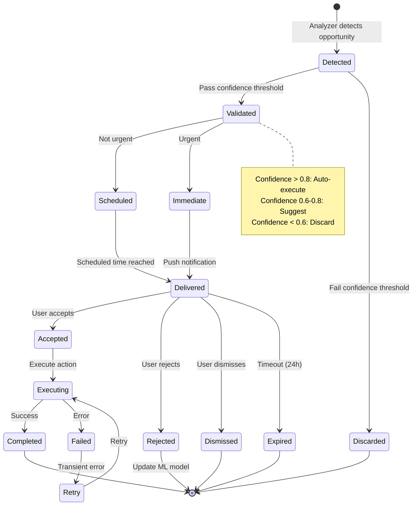
```mermaid
stateDiagram-v2
    [*] --> Detected: Analyzer detects opportunity

    Detected --> Validated: Pass confidence threshold
    Detected --> Discarded: Fail confidence threshold

    Validated --> Scheduled: Not urgent
    Validated --> Immediate: Urgent

    Scheduled --> Delivered: Scheduled time reached
    Immediate --> Delivered: Push notification

    Delivered --> Accepted: User accepts
    Delivered --> Rejected: User rejects
    Delivered --> Dismissed: User dismisses
    Delivered --> Expired: Timeout (24h)

    Accepted --> Executing: Execute action
    Executing --> Completed: Success
    Executing --> Failed: Error

    Failed --> Retry: Transient error
    Retry --> Executing: Retry

    Completed --> [*]
    Rejected --> [*]: Update ML model
    Dismissed --> [*]
    Expired --> [*]
    Discarded --> [*]

    note right of Validated
        Confidence > 0.8: Auto-execute
        Confidence 0.6-0.8: Suggest
        Confidence < 0.6: Discard
    end note
```

**Suggestion Storage Schema:**

```typescript
interface ProactiveSuggestion {
  id: string;
  tenant_id: string;
  user_id: string;

  // Opportunity details
  type: OpportunityType;
  confidence: number;
  detected_at: Date;
  context: Record<string, any>;

  // Lifecycle
  status: 'DETECTED' | 'SCHEDULED' | 'DELIVERED' | 'ACCEPTED' | 'REJECTED' | 'EXPIRED';
  scheduled_for?: Date;
  delivered_at?: Date;
  responded_at?: Date;

  // Presentation
  message: string;
  action_label: string;
  action: {
    type: 'CREATE_APPOINTMENT' | 'RECORD_TRANSACTION' | 'SEND_MESSAGE';
    params: Record<string, any>;
  };

  // Feedback loop
  user_response?: 'ACCEPT' | 'REJECT' | 'DISMISS';
  execution_result?: 'SUCCESS' | 'FAILURE';

  // Deduplication
  deduplication_key: string;
  expires_at: Date;
}
```

**Key Points:**
- **Lifecycle Tracking:** Every suggestion tracked from detection to completion
- **User Feedback:** Accepted/rejected suggestions improve future predictions
- **Auto-Execution:** High confidence suggestions executed automatically
- **Expiry:** Suggestions expire after 24h (time-sensitive)

---

## Authentication & Authorization Flows

### Flow 17: User Login (OAuth 2.0)

User authenticates via external identity provider (Auth0).

```mermaid
sequenceDiagram
    participant User
    participant Web UI
    participant API Gateway
    participant Identity Agent
    participant Auth0
    participant Database

    User->>Web UI: Click "Login with Google"
    Web UI->>Auth0: Redirect to /authorize<br/>?client_id=...&response_type=code

    Auth0->>User: Show Google login page
    User->>Auth0: Enter credentials
    Auth0->>Auth0: Verify with Google

    Auth0-->>Web UI: Redirect to callback<br/>?code=auth_code_123

    Web UI->>API Gateway: POST /auth/callback<br/>{code: "auth_code_123"}

    API Gateway->>Identity Agent: Exchange code for tokens
    Identity Agent->>Auth0: POST /oauth/token<br/>{code, client_secret}

    Auth0-->>Identity Agent: {<br/>  access_token: "...",<br/>  id_token: "...",<br/>  refresh_token: "..."<br/>}

    Identity Agent->>Identity Agent: Decode id_token<br/>Extract: email, name, sub

    Identity Agent->>Database: Find or create user<br/>WHERE email = decoded.email

    alt User exists
        Database-->>Identity Agent: Existing user
    else New user
        Database->>Database: INSERT INTO users
        Database-->>Identity Agent: New user created
    end

    Identity Agent->>Identity Agent: Generate Fidus session token<br/>(JWT with tenant_id)

    Identity Agent-->>API Gateway: {<br/>  session_token: "...",<br/>  user: {...}<br/>}

    API Gateway-->>Web UI: Set cookie: fidus_session
    Web UI-->>User: Redirect to dashboard
```

**Session Token (JWT):**

```typescript
interface FidusSessionToken {
  // Standard JWT claims
  iss: 'https://fidus.ai';
  sub: string;               // user_id
  aud: 'fidus-api';
  exp: number;               // Expiry (24h)
  iat: number;               // Issued at

  // Fidus-specific claims
  tenant_id: string;         // Tenant isolation
  user_id: string;
  email: string;
  roles: string[];           // ['ADMIN', 'USER']
  scopes: string[];          // ['calendar:read', 'finance:write']

  // Session metadata
  session_id: string;        // For revocation
  device_id?: string;        // Device fingerprint
}
```

**Key Points:**
- **OAuth 2.0 Code Flow:** Most secure OAuth flow
- **Token Exchange:** Auth code exchanged for access token server-side
- **User Provisioning:** New users created automatically (JIT provisioning)
- **Fidus Session:** Fidus-specific JWT issued for API access

---

### Flow 18: API Request Authorization

Checking permissions for every API request.

```mermaid
sequenceDiagram
    participant Client
    participant API Gateway
    participant Identity Agent
    participant Scope Engine
    participant Domain Agent

    Client->>API Gateway: GET /api/v1/appointments<br/>Authorization: Bearer {jwt}

    API Gateway->>API Gateway: Verify JWT signature
    API Gateway->>API Gateway: Check expiry (exp claim)

    alt JWT invalid or expired
        API Gateway-->>Client: 401 Unauthorized
    end

    API Gateway->>API Gateway: Extract claims:<br/>tenant_id, user_id, scopes

    API Gateway->>Scope Engine: Check permission<br/>{<br/>  user_id,<br/>  resource: "appointments",<br/>  action: "read"<br/>}

    Scope Engine->>Scope Engine: Match scopes:<br/>User has "calendar:read"<br/>Required: "calendar:read"

    alt Permission denied
        Scope Engine-->>API Gateway: DENY
        API Gateway-->>Client: 403 Forbidden
    end

    Scope Engine-->>API Gateway: ALLOW

    API Gateway->>Domain Agent: Forward request + context<br/>{<br/>  tenant_id,<br/>  user_id,<br/>  params: {...}<br/>}

    Domain Agent->>Domain Agent: Query with tenant filter:<br/>WHERE tenant_id = ?

    Domain Agent-->>API Gateway: Appointments (tenant-isolated)
    API Gateway-->>Client: HTTP 200 + JSON
```

**Scope Definitions:**

```typescript
interface Scope {
  name: string;
  resource: string;
  action: 'read' | 'write' | 'delete' | 'admin';
  description: string;
}

const SCOPES: Scope[] = [
  { name: 'calendar:read', resource: 'appointments', action: 'read', description: 'Read calendar events' },
  { name: 'calendar:write', resource: 'appointments', action: 'write', description: 'Create/update events' },
  { name: 'finance:read', resource: 'transactions', action: 'read', description: 'View transactions' },
  { name: 'finance:write', resource: 'transactions', action: 'write', description: 'Record transactions' },
  { name: 'admin:all', resource: '*', action: 'admin', description: 'Full admin access' },
];
```

**Key Points:**
- **JWT Verification:** Every request validates JWT signature
- **Scope-Based Authorization:** Fine-grained permissions (not just roles)
- **Tenant Isolation:** All queries filtered by tenant_id
- **Fail-Safe:** Default deny if permission check fails

---

### Flow 19: Multi-User Family Scenario

Family account with multiple users and shared/private data.

```mermaid
sequenceDiagram
    participant Parent
    participant Child
    participant API Gateway
    participant Scope Engine
    participant Calendar Agent
    participant Database

    Note over Parent,Database: Parent creates family calendar event

    Parent->>API Gateway: POST /appointments<br/>{<br/>  title: "Family Dinner",<br/>  visibility: "FAMILY"<br/>}

    API Gateway->>Scope Engine: Check permission<br/>parent has "calendar:write"
    Scope Engine-->>API Gateway: ALLOW

    API Gateway->>Calendar Agent: Create appointment
    Calendar Agent->>Database: INSERT INTO appointments<br/>VALUES (<br/>  tenant_id = 'family-123',<br/>  owner_id = 'parent-456',<br/>  visibility = 'FAMILY'<br/>)

    Note over Parent,Database: Child queries calendar

    Child->>API Gateway: GET /appointments<br/>Authorization: Bearer {child_jwt}

    API Gateway->>Scope Engine: Check permission<br/>child has "calendar:read"
    Scope Engine-->>API Gateway: ALLOW

    API Gateway->>Calendar Agent: Query appointments<br/>{user_id: 'child-789'}

    Calendar Agent->>Database: SELECT * FROM appointments<br/>WHERE tenant_id = 'family-123'<br/>AND (<br/>  visibility = 'FAMILY'<br/>  OR owner_id = 'child-789'<br/>)

    Database-->>Calendar Agent: [<br/>  Family Dinner (visible),<br/>  Parent's Doctor Appt (hidden)<br/>]

    Calendar Agent-->>API Gateway: Filtered appointments
    API Gateway-->>Child: Only "Family Dinner" returned
```

**Visibility Rules:**

```typescript
enum Visibility {
  PRIVATE = 'PRIVATE',     // Only owner can see
  FAMILY = 'FAMILY',       // All family members can see
  PUBLIC = 'PUBLIC'        // Anyone in tenant can see
}

class CalendarRepository {
  async findByUser(user_id: string, tenant_id: string): Promise<Appointment[]> {
    return db.query(`
      SELECT * FROM appointments
      WHERE tenant_id = $1
      AND (
        -- User is owner (sees everything)
        owner_id = $2

        -- Or appointment is family-visible and user in same family
        OR (visibility = 'FAMILY' AND EXISTS (
          SELECT 1 FROM family_members
          WHERE tenant_id = $1
          AND user_id = $2
        ))

        -- Or appointment is public
        OR visibility = 'PUBLIC'
      )
      ORDER BY start_time ASC
    `, [tenant_id, user_id]);
  }
}
```

**Key Points:**
- **Shared Tenant:** All family members share same tenant_id
- **Granular Visibility:** Per-item visibility controls
- **Data Isolation:** Children can't see parents' private data
- **Role-Based:** Parents have admin role, children have user role

---

## Multi-Agent Coordination Flows

### Flow 20: Sequential Multi-Agent Flow

Orchestrator coordinates agents in sequence for complex task.

```mermaid
sequenceDiagram
    participant User
    participant Orchestrator
    participant Travel Agent
    participant Calendar Agent
    participant Finance Agent

    User->>Orchestrator: "Book flight to Berlin, add to calendar,<br/>and track expense"

    Orchestrator->>Orchestrator: Detect intents:<br/>1. TRAVEL_BOOKING<br/>2. CALENDAR_APPOINTMENT<br/>3. FINANCE_RECORD<br/><br/>Strategy: SEQUENTIAL

    rect rgb(200, 220, 255)
        Note over Orchestrator,Travel Agent: Step 1: Book Flight
        Orchestrator->>Travel Agent: tools/call search_flights<br/>{destination: "Berlin", date: "2025-11-10"}
        Travel Agent-->>Orchestrator: Flight options

        Orchestrator->>User: "Found flight LH123 for €150. Book it?"
        User->>Orchestrator: "Yes"

        Orchestrator->>Travel Agent: tools/call book_flight<br/>{flight_id: "LH123"}
        Travel Agent->>Travel Agent: Confirm booking
        Travel Agent-->>Orchestrator: {<br/>  booking_id: "TRV-789",<br/>  flight: "LH123",<br/>  departure: "2025-11-10T10:00:00Z"<br/>}
    end

    rect rgb(200, 255, 220)
        Note over Orchestrator,Calendar Agent: Step 2: Add to Calendar
        Orchestrator->>Calendar Agent: tools/call create_appointment<br/>{<br/>  title: "Flight LH123 to Berlin",<br/>  start: "2025-11-10T10:00:00Z",<br/>  metadata: {booking_id: "TRV-789"}<br/>}
        Calendar Agent->>Calendar Agent: Create appointment
        Calendar Agent-->>Orchestrator: {appointment_id: "APT-456"}
    end

    rect rgb(255, 220, 200)
        Note over Orchestrator,Finance Agent: Step 3: Record Expense
        Orchestrator->>Finance Agent: tools/call record_transaction<br/>{<br/>  amount: 150,<br/>  currency: "EUR",<br/>  category: "TRAVEL",<br/>  description: "Flight LH123",<br/>  metadata: {<br/>    booking_id: "TRV-789",<br/>    appointment_id: "APT-456"<br/>  }<br/>}
        Finance Agent->>Finance Agent: Record transaction
        Finance Agent-->>Orchestrator: {transaction_id: "TXN-123"}
    end

    Orchestrator->>Orchestrator: Synthesize final response
    Orchestrator-->>User: "Done! Flight booked (LH123),<br/>added to calendar,<br/>and €150 expense recorded."
```

**Key Points:**
- **Sequential Execution:** Each step completes before next starts
- **Context Passing:** IDs from previous steps passed to next steps
- **User Confirmation:** Orchestrator asks user before expensive operations
- **Atomic:** All steps complete or none (compensating transactions on failure)

---

### Flow 21: Parallel Multi-Agent Flow

Orchestrator runs independent agents in parallel for speed.

```mermaid
sequenceDiagram
    participant User
    participant Orchestrator
    participant Travel Agent
    participant Finance Agent
    participant Weather Service

    User->>Orchestrator: "Can I afford a trip to Paris next week?<br/>Will the weather be good?"

    Orchestrator->>Orchestrator: Detect intents:<br/>1. BUDGET_CHECK<br/>2. TRAVEL_COST_ESTIMATE<br/>3. WEATHER_FORECAST<br/><br/>Strategy: PARALLEL (independent)

    par Parallel Execution
        Orchestrator->>Travel Agent: tools/call estimate_trip_cost<br/>{destination: "Paris", duration: 3}
        Travel Agent->>Travel Agent: Search flights + hotels
        Travel Agent-->>Orchestrator: {estimated_cost: 800}

        Orchestrator->>Finance Agent: tools/call check_budget<br/>{category: "TRAVEL"}
        Finance Agent->>Finance Agent: Query budget + transactions
        Finance Agent-->>Orchestrator: {<br/>  budget: 1000,<br/>  spent: 150,<br/>  available: 850<br/>}

        Orchestrator->>Weather Service: GET /forecast<br/>?location=Paris&days=7
        Weather Service-->>Orchestrator: {forecast: "Sunny, 18-22°C"}
    end

    Orchestrator->>Orchestrator: Wait for all responses<br/>(max 5 seconds timeout)

    Orchestrator->>Orchestrator: Synthesize response:<br/>Budget: 850 available vs 800 needed ✓<br/>Weather: Sunny ✓

    Orchestrator-->>User: "Yes! You have €850 available in your<br/>Travel budget, and a 3-day trip to Paris<br/>costs ~€800. Weather looks great:<br/>sunny and 18-22°C."
```

**Parallel Execution Rules:**

```typescript
class Orchestrator {
  async executeParallel(tasks: AgentTask[]): Promise<AgentResponse[]> {
    // 1. Start all tasks concurrently
    const promises = tasks.map(task =>
      this.executeTask(task).catch(error => ({
        task_id: task.id,
        error: error.message,
        status: 'FAILED'
      }))
    );

    // 2. Wait for all with timeout
    const results = await Promise.race([
      Promise.all(promises),
      timeout(5000) // 5 second max
    ]);

    // 3. Check if any critical tasks failed
    const failed = results.filter(r => r.status === 'FAILED');
    const critical = failed.filter(f =>
      tasks.find(t => t.id === f.task_id)?.critical
    );

    if (critical.length > 0) {
      throw new Error(`Critical task failed: ${critical[0].task_id}`);
    }

    // 4. Return successful results (partial success OK for non-critical)
    return results.filter(r => r.status !== 'FAILED');
  }
}
```

**Key Points:**
- **Concurrent Execution:** All agents called simultaneously
- **Timeout Protection:** Max 5 seconds wait for all responses
- **Partial Failure Handling:** Non-critical failures don't block response
- **Performance:** 3x faster than sequential for independent tasks

---

### Flow 22: Conditional Multi-Agent Flow

Orchestrator uses LLM to decide coordination strategy dynamically.

```mermaid
sequenceDiagram
    participant User
    participant Orchestrator
    participant LLM
    participant Finance Agent
    participant Travel Agent
    participant Calendar Agent

    User->>Orchestrator: "Book a hotel in Tokyo if my budget allows,<br/>then add to my calendar"

    Orchestrator->>LLM: Analyze request and determine strategy<br/>{<br/>  request: "...",<br/>  available_agents: ["finance", "travel", "calendar"]<br/>}

    LLM-->>Orchestrator: {<br/>  strategy: "CONDITIONAL",<br/>  flow: [<br/>    {agent: "finance", action: "check_budget"},<br/>    {<br/>      condition: "budget_available >= 200",<br/>      then: [<br/>        {agent: "travel", action: "book_hotel"},<br/>        {agent: "calendar", action: "create_appointment"}<br/>      ],<br/>      else: [<br/>        {action: "notify_user", message: "Insufficient budget"}<br/>      ]<br/>    }<br/>  ]<br/>}

    rect rgb(200, 220, 255)
        Note over Orchestrator,Finance Agent: Condition Check
        Orchestrator->>Finance Agent: tools/call check_budget<br/>{category: "TRAVEL"}
        Finance Agent-->>Orchestrator: {available: 350}
    end

    Orchestrator->>Orchestrator: Evaluate condition:<br/>350 >= 200 ? TRUE

    alt Condition TRUE
        rect rgb(200, 255, 220)
            Note over Orchestrator,Travel Agent: Execute "then" branch
            Orchestrator->>Travel Agent: tools/call book_hotel<br/>{city: "Tokyo"}
            Travel Agent-->>Orchestrator: {booking_id: "HTL-999", cost: 250}

            Orchestrator->>Calendar Agent: tools/call create_appointment<br/>{title: "Hotel in Tokyo"}
            Calendar Agent-->>Orchestrator: {appointment_id: "APT-888"}
        end

        Orchestrator-->>User: "Hotel booked! €250 charged.<br/>Added to your calendar."
    else Condition FALSE
        Orchestrator-->>User: "Sorry, insufficient budget for a hotel in Tokyo.<br/>You have €150 available, need ~€200."
    end
```

**LLM-Driven Coordination Schema:**

```typescript
interface CoordinationStrategy {
  strategy: 'SEQUENTIAL' | 'PARALLEL' | 'CONDITIONAL';
  flow: CoordinationStep[];
}

interface CoordinationStep {
  agent: string;
  action: string;
  params?: Record<string, any>;

  // For conditional strategies
  condition?: string;           // JavaScript expression
  then?: CoordinationStep[];
  else?: CoordinationStep[];

  // For error handling
  on_error?: 'ABORT' | 'CONTINUE' | 'RETRY';
  retry_count?: number;
}

// LLM prompt for strategy generation
const COORDINATION_PROMPT = `
You are a multi-agent coordinator. Given a user request, determine:
1. Which agents are needed
2. What strategy to use (sequential, parallel, or conditional)
3. The exact flow of operations

Return a JSON object matching the CoordinationStrategy schema.

User request: {user_message}
Available agents: {agents}
`;
```

**Key Points:**
- **LLM-Driven Logic:** Orchestrator uses LLM to determine strategy
- **Dynamic Coordination:** Strategy not hardcoded, adapted to request
- **Condition Evaluation:** JavaScript expressions evaluated safely
- **Flexible:** Handles complex multi-step scenarios with branching

---

## State Management Flows

### Flow 23: LangGraph State Persistence

Agent state persisted across requests for conversation continuity.

```mermaid
sequenceDiagram
    participant User
    participant Orchestrator
    participant Calendar Agent
    participant LangGraph
    participant Redis
    participant Database

    Note over User,Database: First Request

    User->>Orchestrator: "Schedule a meeting with Sarah"
    Orchestrator->>Calendar Agent: tools/call create_appointment

    Calendar Agent->>LangGraph: Initialize state machine<br/>{session_id: "sess-123"}

    LangGraph->>LangGraph: Execute node: "parse_request"<br/>State: {<br/>  request: "meeting with Sarah",<br/>  participant: "Sarah",<br/>  duration: null,<br/>  date: null<br/>}

    LangGraph->>Redis: SAVE state<br/>Key: "session:sess-123:state"<br/>TTL: 24h

    Calendar Agent-->>User: "When would you like to meet with Sarah?"

    Note over User,Database: Second Request (30 seconds later)

    User->>Orchestrator: "Tomorrow at 2pm"
    Orchestrator->>Calendar Agent: tools/call (continue session)

    Calendar Agent->>LangGraph: Resume state machine<br/>{session_id: "sess-123"}

    LangGraph->>Redis: GET state<br/>Key: "session:sess-123:state"
    Redis-->>LangGraph: {<br/>  request: "meeting with Sarah",<br/>  participant: "Sarah",<br/>  duration: null,<br/>  date: null<br/>}

    LangGraph->>LangGraph: Execute node: "extract_datetime"<br/>Update state: {<br/>  ...(previous),<br/>  date: "2025-11-04T14:00:00Z",<br/>  duration: 60<br/>}

    LangGraph->>LangGraph: Execute node: "create_appointment"

    Calendar Agent->>Database: INSERT INTO appointments

    LangGraph->>Redis: UPDATE state<br/>Key: "session:sess-123:state"<br/>State: {<br/>  ...(previous),<br/>  status: "COMPLETED",<br/>  appointment_id: "APT-777"<br/>}

    Calendar Agent-->>User: "Meeting with Sarah scheduled<br/>for tomorrow at 2pm."
```

**LangGraph State Schema:**

```typescript
interface CalendarAgentState {
  // Conversation context
  session_id: string;
  user_id: string;
  tenant_id: string;

  // Multi-turn request parsing
  request_type: 'CREATE_APPOINTMENT' | 'QUERY' | 'UPDATE' | 'DELETE';
  partial_data: {
    title?: string;
    participant?: string;
    start?: Date;
    end?: Date;
    duration?: number;
    location?: string;
  };

  // State machine progress
  current_node: string;
  completed_nodes: string[];

  // User interaction
  awaiting_user_input: boolean;
  last_question: string;

  // Result
  created_appointment?: Appointment;
  error?: string;
}

class CalendarAgent {
  async resumeSession(session_id: string): Promise<void> {
    // Restore state from Redis
    const state = await this.redis.get(`session:${session_id}:state`);

    if (!state) {
      throw new Error('Session expired or not found');
    }

    // Resume LangGraph from saved state
    this.graph.loadState(JSON.parse(state));

    // Continue from current node
    await this.graph.continue();
  }
}
```

**Key Points:**
- **Session Continuity:** Multi-turn conversations span requests
- **Redis Storage:** Fast state persistence with TTL
- **Partial Data:** Agent collects information incrementally
- **Resumable:** State machine resumes from exact point it left off

---

### Flow 24: State Synchronization Across Agents

Shared context accessible to multiple agents in a coordinated flow.

```mermaid
sequenceDiagram
    participant Orchestrator
    participant Shared Context
    participant Travel Agent
    participant Calendar Agent
    participant Finance Agent

    Orchestrator->>Shared Context: Initialize coordination<br/>{<br/>  coordination_id: "coord-456",<br/>  tenant_id: "tenant-123",<br/>  user_id: "user-789"<br/>}

    Orchestrator->>Travel Agent: Start booking

    Travel Agent->>Travel Agent: Book flight LH123
    Travel Agent->>Shared Context: WRITE context<br/>{<br/>  "flight": {<br/>    "id": "LH123",<br/>    "cost": 150,<br/>    "departure": "2025-11-10T10:00:00Z"<br/>  }<br/>}

    Orchestrator->>Calendar Agent: Add to calendar

    Calendar Agent->>Shared Context: READ context
    Shared Context-->>Calendar Agent: {<br/>  "flight": {<br/>    "id": "LH123",<br/>    "departure": "2025-11-10T10:00:00Z"<br/>  }<br/>}

    Calendar Agent->>Calendar Agent: Use flight info from context<br/>Create appointment for departure time

    Calendar Agent->>Shared Context: WRITE context<br/>{<br/>  "appointment": {<br/>    "id": "APT-999",<br/>    "title": "Flight LH123"<br/>  }<br/>}

    Orchestrator->>Finance Agent: Record expense

    Finance Agent->>Shared Context: READ context
    Shared Context-->>Finance Agent: {<br/>  "flight": {"cost": 150},<br/>  "appointment": {"id": "APT-999"}<br/>}

    Finance Agent->>Finance Agent: Record €150 transaction<br/>Link to appointment APT-999

    Orchestrator->>Shared Context: GET full context
    Shared Context-->>Orchestrator: {<br/>  "flight": {...},<br/>  "appointment": {...},<br/>  "transaction": {"id": "TXN-888"}<br/>}

    Orchestrator->>Orchestrator: Synthesize response from full context

    Orchestrator->>Shared Context: CLEANUP<br/>Delete coordination context
```

**Shared Context Implementation:**

```typescript
class SharedCoordinationContext {
  private redis: Redis;

  async initialize(coordination_id: string, initial_data: Record<string, any>): Promise<void> {
    const key = `coordination:${coordination_id}`;
    await this.redis.hset(key, initial_data);
    await this.redis.expire(key, 3600); // 1 hour TTL
  }

  async read(coordination_id: string, namespace: string): Promise<any> {
    const key = `coordination:${coordination_id}`;
    const value = await this.redis.hget(key, namespace);
    return value ? JSON.parse(value) : null;
  }

  async write(coordination_id: string, namespace: string, data: any): Promise<void> {
    const key = `coordination:${coordination_id}`;
    await this.redis.hset(key, namespace, JSON.stringify(data));

    // Extend TTL on every write
    await this.redis.expire(key, 3600);
  }

  async readAll(coordination_id: string): Promise<Record<string, any>> {
    const key = `coordination:${coordination_id}`;
    const data = await this.redis.hgetall(key);

    // Parse all JSON values
    return Object.entries(data).reduce((acc, [k, v]) => {
      acc[k] = JSON.parse(v);
      return acc;
    }, {} as Record<string, any>);
  }

  async cleanup(coordination_id: string): Promise<void> {
    const key = `coordination:${coordination_id}`;
    await this.redis.del(key);
  }
}
```

**Key Points:**
- **Shared Memory:** All agents in coordination can read/write context
- **Namespaced:** Each agent writes to its own namespace ("flight", "appointment")
- **TTL:** Context auto-expires after 1 hour
- **Coordination ID:** Unique ID ties all agents together in a flow

---

## Error Handling & Recovery Flows

### Flow 25: Compensating Transaction (Saga Rollback)

Multi-agent scenario fails, compensating transactions undo previous steps.

```mermaid
sequenceDiagram
    participant User
    participant Orchestrator
    participant Travel Agent
    participant Calendar Agent
    participant Finance Agent

    User->>Orchestrator: "Book flight and hotel to Paris"

    rect rgb(200, 255, 200)
        Note over Orchestrator,Travel Agent: Step 1: Book Flight (SUCCESS)
        Orchestrator->>Travel Agent: tools/call book_flight
        Travel Agent->>Travel Agent: Flight LH456 booked
        Travel Agent-->>Orchestrator: {booking_id: "FLT-111"}
    end

    rect rgb(200, 255, 200)
        Note over Orchestrator,Calendar Agent: Step 2: Add to Calendar (SUCCESS)
        Orchestrator->>Calendar Agent: tools/call create_appointment
        Calendar Agent->>Calendar Agent: Appointment created
        Calendar Agent-->>Orchestrator: {appointment_id: "APT-222"}
    end

    rect rgb(255, 200, 200)
        Note over Orchestrator,Travel Agent: Step 3: Book Hotel (FAILURE)
        Orchestrator->>Travel Agent: tools/call book_hotel
        Travel Agent->>Travel Agent: No availability!
        Travel Agent-->>Orchestrator: ERROR: "No hotels available"
    end

    Orchestrator->>Orchestrator: Saga failed at step 3<br/>Trigger compensating transactions

    rect rgb(255, 220, 200)
        Note over Orchestrator,Calendar Agent: Compensate Step 2: Delete Appointment
        Orchestrator->>Calendar Agent: tools/call delete_appointment<br/>{id: "APT-222"}
        Calendar Agent->>Calendar Agent: Delete appointment
        Calendar Agent-->>Orchestrator: Deleted
    end

    rect rgb(255, 220, 200)
        Note over Orchestrator,Travel Agent: Compensate Step 1: Cancel Flight
        Orchestrator->>Travel Agent: tools/call cancel_booking<br/>{id: "FLT-111"}
        Travel Agent->>Travel Agent: Cancel flight LH456
        Travel Agent-->>Orchestrator: Cancelled (refund issued)
    end

    Orchestrator-->>User: "Sorry, couldn't complete booking.<br/>No hotels available in Paris.<br/>Your flight has been cancelled<br/>and you'll receive a full refund."
```

**Saga Coordinator Implementation:**

```typescript
interface SagaStep {
  id: string;
  agent: string;
  action: string;
  params: Record<string, any>;
  compensate: {
    agent: string;
    action: string;
    params_from_result: (result: any) => Record<string, any>;
  };
}

class SagaCoordinator {
  private completedSteps: Array<{ step: SagaStep; result: any }> = [];

  async executeSaga(steps: SagaStep[]): Promise<any> {
    try {
      // Execute each step sequentially
      for (const step of steps) {
        const result = await this.executeStep(step);
        this.completedSteps.push({ step, result });
      }

      return { status: 'SUCCESS', steps: this.completedSteps };
    } catch (error) {
      // Failure detected, trigger compensations
      await this.compensate();
      throw error;
    }
  }

  private async compensate(): Promise<void> {
    // Compensate in reverse order
    for (let i = this.completedSteps.length - 1; i >= 0; i--) {
      const { step, result } = this.completedSteps[i];

      try {
        const compensateParams = step.compensate.params_from_result(result);

        await this.executeStep({
          id: `compensate-${step.id}`,
          agent: step.compensate.agent,
          action: step.compensate.action,
          params: compensateParams,
          compensate: null // Compensations don't have compensations
        });

        console.log(`Compensated step: ${step.id}`);
      } catch (compensateError) {
        // Log but continue compensating other steps
        console.error(`Failed to compensate ${step.id}:`, compensateError);
      }
    }
  }
}

// Example usage
const bookTripSaga: SagaStep[] = [
  {
    id: 'book_flight',
    agent: 'travel',
    action: 'book_flight',
    params: { destination: 'Paris', date: '2025-11-10' },
    compensate: {
      agent: 'travel',
      action: 'cancel_booking',
      params_from_result: (result) => ({ booking_id: result.booking_id })
    }
  },
  {
    id: 'create_appointment',
    agent: 'calendar',
    action: 'create_appointment',
    params: { title: 'Flight to Paris' },
    compensate: {
      agent: 'calendar',
      action: 'delete_appointment',
      params_from_result: (result) => ({ appointment_id: result.appointment_id })
    }
  },
  {
    id: 'book_hotel',
    agent: 'travel',
    action: 'book_hotel',
    params: { city: 'Paris', nights: 3 },
    compensate: {
      agent: 'travel',
      action: 'cancel_booking',
      params_from_result: (result) => ({ booking_id: result.booking_id })
    }
  }
];
```

**Key Points:**
- **Reverse Order Compensation:** Undo in reverse order of execution
- **Best-Effort Rollback:** If compensation fails, log but continue
- **User Notification:** User informed about failure and compensations
- **Eventual Consistency:** System reaches consistent state after compensations

---

### Flow 26: Retry with Exponential Backoff

Transient failures retried automatically before failing.

```mermaid
sequenceDiagram
    participant Agent
    participant External API
    participant Retry Logic

    Agent->>External API: POST /book_hotel<br/>(Attempt 1)
    External API-->>Agent: 503 Service Unavailable

    Agent->>Retry Logic: Handle transient error
    Retry Logic->>Retry Logic: Determine if retryable:<br/>503 = YES (transient)

    Retry Logic->>Retry Logic: Wait 1 second<br/>(2^0 * 1s = 1s)

    Retry Logic->>External API: POST /book_hotel<br/>(Attempt 2)
    External API-->>Retry Logic: 503 Service Unavailable

    Retry Logic->>Retry Logic: Wait 2 seconds<br/>(2^1 * 1s = 2s)

    Retry Logic->>External API: POST /book_hotel<br/>(Attempt 3)
    External API-->>Retry Logic: 503 Service Unavailable

    Retry Logic->>Retry Logic: Wait 4 seconds<br/>(2^2 * 1s = 4s)

    Retry Logic->>External API: POST /book_hotel<br/>(Attempt 4)
    External API-->>Retry Logic: 200 OK<br/>{booking_id: "HTL-555"}

    Retry Logic-->>Agent: Success after 4 attempts
```

**Retry Logic Implementation:**

```typescript
interface RetryOptions {
  maxAttempts: number;
  initialDelayMs: number;
  maxDelayMs: number;
  backoffMultiplier: number;
  retryableErrors: Array<number | string>;
}

const DEFAULT_RETRY_OPTIONS: RetryOptions = {
  maxAttempts: 5,
  initialDelayMs: 1000,
  maxDelayMs: 30000,
  backoffMultiplier: 2,
  retryableErrors: [
    408, // Request Timeout
    429, // Too Many Requests
    500, // Internal Server Error
    502, // Bad Gateway
    503, // Service Unavailable
    504, // Gateway Timeout
    'ECONNRESET',
    'ETIMEDOUT',
    'ENOTFOUND'
  ]
};

async function retryWithBackoff<T>(
  operation: () => Promise<T>,
  options: RetryOptions = DEFAULT_RETRY_OPTIONS
): Promise<T> {
  let lastError: any;

  for (let attempt = 1; attempt <= options.maxAttempts; attempt++) {
    try {
      return await operation();
    } catch (error: any) {
      lastError = error;

      // Check if error is retryable
      const isRetryable = options.retryableErrors.some(
        retryableError =>
          error.status === retryableError ||
          error.code === retryableError
      );

      if (!isRetryable || attempt === options.maxAttempts) {
        throw error;
      }

      // Calculate backoff delay
      const delay = Math.min(
        options.initialDelayMs * Math.pow(options.backoffMultiplier, attempt - 1),
        options.maxDelayMs
      );

      console.log(`Attempt ${attempt} failed, retrying in ${delay}ms...`);
      await sleep(delay);
    }
  }

  throw lastError;
}

// Usage
const booking = await retryWithBackoff(
  () => travelApi.bookHotel({ city: 'Paris', nights: 3 }),
  {
    maxAttempts: 5,
    initialDelayMs: 1000,
    maxDelayMs: 30000,
    backoffMultiplier: 2,
    retryableErrors: [503, 504]
  }
);
```

**Error Classification:**

| Error Type | HTTP Status | Retryable? | Strategy |
|------------|-------------|------------|----------|
| **Transient Network** | 503, 504, ECONNRESET | ✅ Yes | Retry with backoff |
| **Rate Limiting** | 429 | ✅ Yes | Retry with backoff (respect Retry-After header) |
| **Timeout** | 408, ETIMEDOUT | ✅ Yes | Retry with backoff |
| **Invalid Request** | 400 | ❌ No | Fail immediately |
| **Unauthorized** | 401, 403 | ❌ No | Refresh token, then retry once |
| **Not Found** | 404 | ❌ No | Fail immediately |
| **Conflict** | 409 | ⚠️ Maybe | Check if idempotent, then retry |

**Key Points:**
- **Exponential Backoff:** Delay doubles each retry (1s, 2s, 4s, 8s...)
- **Max Delay Cap:** Never wait more than 30 seconds
- **Selective Retry:** Only retry transient errors (not client errors)
- **Max Attempts:** Give up after 5 attempts to avoid infinite loops

---

## Monitoring & Observability Flows

### Flow 27: Distributed Tracing

Trace request across multiple agents with OpenTelemetry.

```mermaid
sequenceDiagram
    participant Client
    participant API Gateway
    participant Orchestrator
    participant Travel Agent
    participant Finance Agent
    participant Telemetry

    Client->>API Gateway: POST /chat<br/>X-Request-ID: req-abc-123

    API Gateway->>Telemetry: START SPAN: http.request<br/>trace_id: trc-999<br/>span_id: spn-001<br/>parent: null

    API Gateway->>Orchestrator: Forward request<br/>X-Trace-ID: trc-999<br/>X-Span-ID: spn-001

    Orchestrator->>Telemetry: START SPAN: orchestrator.detect_intent<br/>trace_id: trc-999<br/>span_id: spn-002<br/>parent: spn-001

    Orchestrator->>Orchestrator: LLM call: detect intent

    Orchestrator->>Telemetry: END SPAN: orchestrator.detect_intent<br/>duration: 450ms

    Orchestrator->>Travel Agent: MCP call: book_flight<br/>X-Trace-ID: trc-999<br/>X-Span-ID: spn-002

    Travel Agent->>Telemetry: START SPAN: travel.book_flight<br/>trace_id: trc-999<br/>span_id: spn-003<br/>parent: spn-002

    Travel Agent->>Travel Agent: Search flights<br/>Call external API

    Travel Agent->>Telemetry: ADD EVENT: external_api.call<br/>span: spn-003<br/>api: "amadeus.com"

    Travel Agent->>Telemetry: END SPAN: travel.book_flight<br/>duration: 1200ms

    Travel Agent-->>Orchestrator: Booking confirmed

    Orchestrator->>Finance Agent: MCP call: record_transaction<br/>X-Trace-ID: trc-999<br/>X-Span-ID: spn-002

    Finance Agent->>Telemetry: START SPAN: finance.record<br/>trace_id: trc-999<br/>span_id: spn-004<br/>parent: spn-002

    Finance Agent->>Finance Agent: Insert transaction

    Finance Agent->>Telemetry: END SPAN: finance.record<br/>duration: 80ms

    Orchestrator->>Telemetry: END SPAN: orchestrator.process<br/>duration: 2100ms

    API Gateway->>Telemetry: END SPAN: http.request<br/>duration: 2200ms

    API Gateway-->>Client: HTTP 200 OK

    Note over Telemetry: Full trace available:<br/>trc-999<br/>├─ spn-001 (http.request) 2200ms<br/>│  └─ spn-002 (orchestrator) 2100ms<br/>│     ├─ spn-002a (detect_intent) 450ms<br/>│     ├─ spn-003 (travel) 1200ms<br/>│     └─ spn-004 (finance) 80ms
```

**OpenTelemetry Span Attributes:**

```typescript
interface SpanAttributes {
  // Standard HTTP attributes
  'http.method': string;
  'http.url': string;
  'http.status_code': number;
  'http.user_agent': string;

  // Fidus-specific attributes
  'fidus.tenant_id': string;
  'fidus.user_id': string;
  'fidus.agent': string;
  'fidus.request_type': string;

  // LLM-specific attributes
  'llm.provider': 'openai' | 'ollama';
  'llm.model': string;
  'llm.prompt_tokens': number;
  'llm.completion_tokens': number;
  'llm.total_tokens': number;

  // MCP-specific attributes
  'mcp.method': 'tools/call' | 'resources/read';
  'mcp.tool_name'?: string;
  'mcp.resource_uri'?: string;

  // Error attributes
  'error': boolean;
  'error.type'?: string;
  'error.message'?: string;
}

class TelemetryService {
  startSpan(name: string, attributes: SpanAttributes): Span {
    const tracer = trace.getTracer('fidus');
    return tracer.startSpan(name, {
      attributes,
      kind: SpanKind.INTERNAL
    });
  }

  async traceOperation<T>(
    name: string,
    attributes: SpanAttributes,
    operation: () => Promise<T>
  ): Promise<T> {
    const span = this.startSpan(name, attributes);

    try {
      const result = await operation();
      span.setStatus({ code: SpanStatusCode.OK });
      return result;
    } catch (error: any) {
      span.setStatus({
        code: SpanStatusCode.ERROR,
        message: error.message
      });
      span.recordException(error);
      throw error;
    } finally {
      span.end();
    }
  }
}
```

**Key Points:**
- **Trace ID:** Unique ID follows request through entire system
- **Span Hierarchy:** Parent-child relationships show call graph
- **Timing Data:** Exact duration of each operation
- **Visualization:** Tools like Jaeger show waterfall view of traces

---

### Flow 28: Metrics Collection

Prometheus metrics collected from all components.

```mermaid
flowchart TD
    subgraph "Agents"
        A1[Orchestrator]
        A2[Calendar Agent]
        A3[Finance Agent]
        A4[Travel Agent]
    end

    subgraph "Infrastructure"
        I1[Event Bus]
        I2[Database]
        I3[Redis]
    end

    A1 -->|metrics| Exporter[Prometheus Exporter<br/>/metrics endpoint]
    A2 -->|metrics| Exporter
    A3 -->|metrics| Exporter
    A4 -->|metrics| Exporter

    I1 -->|metrics| Exporter
    I2 -->|metrics| Exporter
    I3 -->|metrics| Exporter

    Exporter -->|scrape every 15s| Prometheus[Prometheus Server]

    Prometheus --> Grafana[Grafana Dashboard]

    Prometheus -->|alerts| AlertManager[Alert Manager]
    AlertManager -->|notify| Ops[Ops Team]

    style Prometheus fill:#f9c74f
    style Grafana fill:#90be6d
    style AlertManager fill:#f94144
```

**Key Metrics:**

```typescript
// Request metrics
const httpRequestsTotal = new Counter({
  name: 'fidus_http_requests_total',
  help: 'Total HTTP requests',
  labelNames: ['method', 'path', 'status', 'tenant_id']
});

const httpRequestDuration = new Histogram({
  name: 'fidus_http_request_duration_seconds',
  help: 'HTTP request duration in seconds',
  labelNames: ['method', 'path', 'status'],
  buckets: [0.1, 0.5, 1, 2, 5, 10]
});

// Agent-specific metrics
const agentRequestsTotal = new Counter({
  name: 'fidus_agent_requests_total',
  help: 'Total agent requests',
  labelNames: ['agent', 'tool', 'status']
});

const agentRequestDuration = new Histogram({
  name: 'fidus_agent_request_duration_seconds',
  help: 'Agent request duration',
  labelNames: ['agent', 'tool'],
  buckets: [0.1, 0.5, 1, 2, 5, 10, 30]
});

// LLM metrics
const llmRequestsTotal = new Counter({
  name: 'fidus_llm_requests_total',
  help: 'Total LLM requests',
  labelNames: ['provider', 'model', 'status']
});

const llmTokensUsed = new Counter({
  name: 'fidus_llm_tokens_total',
  help: 'Total LLM tokens consumed',
  labelNames: ['provider', 'model', 'type'] // type: 'prompt' | 'completion'
});

const llmRequestDuration = new Histogram({
  name: 'fidus_llm_request_duration_seconds',
  help: 'LLM request duration',
  labelNames: ['provider', 'model'],
  buckets: [0.5, 1, 2, 5, 10, 30, 60]
});

// Event Bus metrics
const eventsPublished = new Counter({
  name: 'fidus_events_published_total',
  help: 'Total events published',
  labelNames: ['event_type', 'agent']
});

const eventsProcessed = new Counter({
  name: 'fidus_events_processed_total',
  help: 'Total events processed',
  labelNames: ['event_type', 'agent', 'status'] // status: 'success' | 'failure'
});

const eventProcessingDuration = new Histogram({
  name: 'fidus_event_processing_duration_seconds',
  help: 'Event processing duration',
  labelNames: ['event_type', 'agent'],
  buckets: [0.01, 0.05, 0.1, 0.5, 1, 5]
});

// Database metrics
const dbQueriesTotal = new Counter({
  name: 'fidus_db_queries_total',
  help: 'Total database queries',
  labelNames: ['operation', 'table', 'status']
});

const dbQueryDuration = new Histogram({
  name: 'fidus_db_query_duration_seconds',
  help: 'Database query duration',
  labelNames: ['operation', 'table'],
  buckets: [0.001, 0.005, 0.01, 0.05, 0.1, 0.5, 1]
});

// Connection pool metrics
const dbConnectionsActive = new Gauge({
  name: 'fidus_db_connections_active',
  help: 'Active database connections'
});

const redisConnectionsActive = new Gauge({
  name: 'fidus_redis_connections_active',
  help: 'Active Redis connections'
});
```

**Grafana Dashboard Panels:**

1. **Request Rate**: `rate(fidus_http_requests_total[5m])`
2. **Error Rate**: `rate(fidus_http_requests_total{status=~"5.."}[5m])`
3. **P95 Latency**: `histogram_quantile(0.95, fidus_http_request_duration_seconds)`
4. **Agent Performance**: Heatmap of agent request durations
5. **LLM Token Usage**: `rate(fidus_llm_tokens_total[1h])` (cost estimation)
6. **Event Processing Lag**: Difference between published and processed events

**Key Points:**
- **Prometheus Pull Model:** Prometheus scrapes /metrics endpoints
- **Label Cardinality:** Careful not to create too many unique label combinations
- **Histograms for Latency:** Allows percentile calculation (P50, P95, P99)
- **Alerting**: Alert on error rate > 5%, P95 latency > 5s, etc.

---

## Privacy & Compliance Flows

### Flow 29: Data Anonymization for External LLM

User data anonymized before sending to cloud LLM providers.

```mermaid
sequenceDiagram
    participant Agent
    participant Privacy Proxy
    participant Anonymizer
    participant Mapping Store
    participant OpenAI

    Agent->>Agent: User query:<br/>"Remind me about my appointment<br/>with Dr. Sarah Johnson tomorrow"

    Agent->>Privacy Proxy: LLM completion request<br/>{<br/>  prompt: "...",<br/>  user_context: {<br/>    name: "Dr. Sarah Johnson",<br/>    date: "2025-11-04"<br/>  }<br/>}

    Privacy Proxy->>Anonymizer: Detect PII<br/>(names, emails, phone numbers)

    Anonymizer->>Anonymizer: Identify PII:<br/>- "Dr. Sarah Johnson" (PERSON)<br/>- "2025-11-04" (keep, not PII)

    Anonymizer->>Anonymizer: Generate token:<br/>"Dr. Sarah Johnson" → "[PERSON_1]"

    Anonymizer->>Mapping Store: Store mapping<br/>Key: "anon-sess-789:PERSON_1"<br/>Value: "Dr. Sarah Johnson"<br/>TTL: 1 hour

    Anonymizer-->>Privacy Proxy: Anonymized prompt:<br/>"Remind me about my appointment<br/>with [PERSON_1] tomorrow"

    Privacy Proxy->>OpenAI: POST /v1/chat/completions<br/>{<br/>  model: "gpt-4",<br/>  messages: [{<br/>    role: "user",<br/>    content: "Remind me about my<br/>    appointment with [PERSON_1]<br/>    tomorrow"<br/>  }]<br/>}

    OpenAI-->>Privacy Proxy: {<br/>  completion: "I'll remind you<br/>  about your appointment with<br/>  [PERSON_1] on November 4th"<br/>}

    Privacy Proxy->>Anonymizer: De-anonymize response

    Anonymizer->>Mapping Store: GET "anon-sess-789:PERSON_1"
    Mapping Store-->>Anonymizer: "Dr. Sarah Johnson"

    Anonymizer->>Anonymizer: Replace tokens:<br/>"[PERSON_1]" → "Dr. Sarah Johnson"

    Anonymizer-->>Privacy Proxy: De-anonymized:<br/>"I'll remind you about your<br/>appointment with Dr. Sarah Johnson<br/>on November 4th"

    Privacy Proxy-->>Agent: Final response
```

**Anonymization Rules:**

```typescript
interface AnonymizationRule {
  type: 'PERSON' | 'EMAIL' | 'PHONE' | 'ADDRESS' | 'CREDIT_CARD' | 'SSN';
  pattern: RegExp;
  replacement: (match: string, index: number) => string;
}

const ANONYMIZATION_RULES: AnonymizationRule[] = [
  {
    type: 'EMAIL',
    pattern: /\b[A-Za-z0-9._%+-]+@[A-Za-z0-9.-]+\.[A-Z|a-z]{2,}\b/g,
    replacement: (_, index) => `[EMAIL_${index}]`
  },
  {
    type: 'PHONE',
    pattern: /\b(\+?\d{1,3}[-.\s]?)?\(?\d{3}\)?[-.\s]?\d{3}[-.\s]?\d{4}\b/g,
    replacement: (_, index) => `[PHONE_${index}]`
  },
  {
    type: 'CREDIT_CARD',
    pattern: /\b\d{4}[-\s]?\d{4}[-\s]?\d{4}[-\s]?\d{4}\b/g,
    replacement: (_, index) => `[CARD_${index}]`
  },
  {
    type: 'PERSON',
    // Use NER (Named Entity Recognition) model for person names
    pattern: null, // Detected by ML model, not regex
    replacement: (_, index) => `[PERSON_${index}]`
  }
];

class Anonymizer {
  async anonymize(text: string, session_id: string): Promise<{ text: string; mapping: Record<string, string> }> {
    let anonymized = text;
    const mapping: Record<string, string> = {};

    // 1. Regex-based anonymization
    for (const rule of ANONYMIZATION_RULES.filter(r => r.pattern)) {
      let index = 0;
      anonymized = anonymized.replace(rule.pattern, (match) => {
        const token = rule.replacement(match, index++);
        mapping[token] = match;
        return token;
      });
    }

    // 2. NER-based person name detection
    const persons = await this.nerModel.detectPersons(anonymized);
    for (let i = 0; i < persons.length; i++) {
      const token = `[PERSON_${i}]`;
      mapping[token] = persons[i];
      anonymized = anonymized.replace(persons[i], token);
    }

    // 3. Store mapping in Redis
    for (const [token, value] of Object.entries(mapping)) {
      await this.mappingStore.set(
        `${session_id}:${token}`,
        value,
        { ttl: 3600 }
      );
    }

    return { text: anonymized, mapping };
  }

  async deanonymize(text: string, session_id: string): Promise<string> {
    let deanonymized = text;

    // Find all tokens in response
    const tokens = text.match(/\[([A-Z]+_\d+)\]/g) || [];

    // Replace each token with original value
    for (const token of tokens) {
      const original = await this.mappingStore.get(`${session_id}:${token}`);
      if (original) {
        deanonymized = deanonymized.replace(token, original);
      }
    }

    return deanonymized;
  }
}
```

**Key Points:**
- **PII Detection:** Regex + NER models detect sensitive data
- **Token Replacement:** PII replaced with tokens like [PERSON_1]
- **Reversible Mapping:** Mapping stored temporarily in Redis (1h TTL)
- **Transparent:** Agent doesn't know anonymization happened

---

### Flow 30: GDPR Data Export Request

User requests complete export of all their data.

```mermaid
sequenceDiagram
    participant User
    participant Web UI
    participant Audit Agent
    participant Database
    participant Export Service
    participant Storage

    User->>Web UI: Request data export<br/>(GDPR Article 15)

    Web UI->>Audit Agent: tools/call request_data_export<br/>{user_id: "user-123"}

    Audit Agent->>Audit Agent: Log GDPR request<br/>{<br/>  type: "DATA_EXPORT",<br/>  user_id: "user-123",<br/>  timestamp: now()<br/>}

    Audit Agent->>Export Service: Initiate export job<br/>{<br/>  job_id: "export-456",<br/>  user_id: "user-123",<br/>  tenant_id: "tenant-789"<br/>}

    Export Service->>Database: Query all user data

    par Parallel Data Collection
        Database->>Export Service: Appointments (Calendar)
        Database->>Export Service: Transactions (Finance)
        Database->>Export Service: Trips (Travel)
        Database->>Export Service: Messages (Communication)
        Database->>Export Service: Health data (Health)
        Database->>Export Service: Audit logs (Compliance)
    end

    Export Service->>Export Service: Structure data in JSON<br/>{<br/>  user: {...},<br/>  appointments: [...],<br/>  transactions: [...],<br/>  ...<br/>}

    Export Service->>Export Service: Generate ZIP archive<br/>├─ user_data.json<br/>├─ appointments.csv<br/>├─ transactions.csv<br/>├─ audit_log.csv<br/>└─ README.txt

    Export Service->>Storage: Upload to secure storage<br/>Key: "exports/user-123/export-456.zip"<br/>Signed URL TTL: 7 days

    Storage-->>Export Service: {<br/>  signed_url: "https://...",<br/>  expires_at: "2025-11-11"<br/>}

    Export Service->>Audit Agent: Export completed

    Audit Agent->>User: Send email<br/>Subject: "Your data export is ready"<br/>Body: "Download: {signed_url}<br/>Link expires in 7 days"

    User->>Storage: Download ZIP archive<br/>GET {signed_url}

    Storage-->>User: export-456.zip
```

**Export Format (user_data.json):**

```json
{
  "export_metadata": {
    "export_date": "2025-10-27T14:30:00Z",
    "export_id": "export-456",
    "user_id": "user-123",
    "tenant_id": "tenant-789",
    "data_format_version": "1.0"
  },
  "user_profile": {
    "id": "user-123",
    "email": "user@example.com",
    "name": "John Doe",
    "created_at": "2025-01-01T00:00:00Z",
    "preferences": {
      "timezone": "Europe/Berlin",
      "language": "en",
      "notifications_enabled": true
    }
  },
  "domains": {
    "calendar": {
      "appointments": [
        {
          "id": "apt-1",
          "title": "Team Meeting",
          "start": "2025-11-04T10:00:00Z",
          "end": "2025-11-04T11:00:00Z",
          "location": "Office",
          "participants": ["sarah@example.com"],
          "created_at": "2025-11-01T09:00:00Z"
        }
      ],
      "total_count": 245
    },
    "finance": {
      "transactions": [
        {
          "id": "txn-1",
          "amount": 42.50,
          "currency": "EUR",
          "category": "GROCERIES",
          "merchant": "Supermarket",
          "date": "2025-11-03",
          "created_at": "2025-11-03T18:30:00Z"
        }
      ],
      "budgets": [
        {
          "id": "bdg-1",
          "category": "GROCERIES",
          "limit": 500,
          "currency": "EUR",
          "period": "MONTHLY"
        }
      ],
      "total_transactions": 1834
    },
    "travel": {
      "trips": [...],
      "total_count": 12
    },
    "communication": {
      "messages": [...],
      "total_count": 567
    },
    "health": {
      "activities": [...],
      "total_count": 89
    }
  },
  "audit_log": {
    "actions": [
      {
        "timestamp": "2025-11-03T14:22:00Z",
        "action": "CREATE_APPOINTMENT",
        "resource": "apt-1",
        "ip_address": "192.168.1.100",
        "user_agent": "Mozilla/5.0..."
      }
    ],
    "total_count": 3421
  }
}
```

**Key Points:**
- **Complete Export:** All domains included in export
- **Machine-Readable:** JSON + CSV formats
- **Secure Delivery:** Time-limited signed URL (7 days)
- **Audit Trail:** Export request logged for compliance
- **GDPR Article 15:** Right to data portability

---

### Flow 31: GDPR Data Deletion Request

User requests complete deletion of all their data.

```mermaid
sequenceDiagram
    participant User
    participant Web UI
    participant Audit Agent
    participant Database
    participant Event Bus
    participant All Agents

    User->>Web UI: Request account deletion<br/>(GDPR Article 17)

    Web UI->>Audit Agent: tools/call request_data_deletion<br/>{<br/>  user_id: "user-123",<br/>  confirmation: true<br/>}

    Audit Agent->>Audit Agent: Log GDPR request<br/>{<br/>  type: "DATA_DELETION",<br/>  user_id: "user-123",<br/>  timestamp: now()<br/>}

    Audit Agent->>Audit Agent: Verify legal requirements<br/>- User confirmed (yes)<br/>- No legal hold (none)<br/>- Retention period passed (yes)

    Audit Agent->>Event Bus: Publish UserDeletionRequested<br/>{<br/>  user_id: "user-123",<br/>  tenant_id: "tenant-789",<br/>  scheduled_for: now() + 30 days<br/>}

    par Notify All Agents
        Event Bus->>All Agents: UserDeletionRequested
        All Agents->>All Agents: Mark user data for deletion<br/>(soft delete, 30-day grace period)
    end

    Audit Agent-->>User: "Account scheduled for deletion<br/>in 30 days. Cancel anytime before."

    Note over User,All Agents: 30-day grace period...

    opt User changes mind
        User->>Audit Agent: Cancel deletion request
        Audit Agent->>Event Bus: Publish UserDeletionCancelled
        Event Bus->>All Agents: Restore user data
    end

    Note over User,All Agents: 30 days passed, proceed with deletion

    Audit Agent->>Database: BEGIN TRANSACTION

    Audit Agent->>Database: DELETE FROM appointments<br/>WHERE user_id = 'user-123'
    Audit Agent->>Database: DELETE FROM transactions<br/>WHERE user_id = 'user-123'
    Audit Agent->>Database: DELETE FROM trips<br/>WHERE user_id = 'user-123'
    Audit Agent->>Database: DELETE FROM messages<br/>WHERE user_id = 'user-123'
    Audit Agent->>Database: DELETE FROM health_data<br/>WHERE user_id = 'user-123'

    Audit Agent->>Database: Anonymize audit logs<br/>UPDATE audit_log<br/>SET user_email = '[DELETED]',<br/>    user_name = '[DELETED]'<br/>WHERE user_id = 'user-123'

    Audit Agent->>Database: DELETE FROM users<br/>WHERE id = 'user-123'

    Audit Agent->>Database: COMMIT TRANSACTION

    Audit Agent->>Audit Agent: Log deletion completion<br/>(required for GDPR compliance)<br/>{<br/>  type: "DATA_DELETION_COMPLETED",<br/>  user_id: "user-123",<br/>  rows_deleted: 4589<br/>}
```

**Deletion Strategy:**

```typescript
interface DeletionPolicy {
  immediate_delete: string[];        // Delete immediately
  anonymize: string[];               // Keep but anonymize
  retain_for_legal: string[];        // Keep for legal requirements
  grace_period_days: number;
}

const GDPR_DELETION_POLICY: DeletionPolicy = {
  immediate_delete: [
    'appointments',
    'transactions',
    'trips',
    'messages',
    'health_data',
    'preferences',
    'sessions'
  ],
  anonymize: [
    'audit_logs',        // Keep for 1 year (EU AI Act), but anonymize
    'ai_decision_logs'   // Keep for 6 months (EU AI Act), but anonymize
  ],
  retain_for_legal: [
    'financial_records'  // Keep for 7 years (tax law)
  ],
  grace_period_days: 30
};

class GDPRDeletionService {
  async requestDeletion(user_id: string): Promise<void> {
    // 1. Schedule deletion (30-day grace period)
    await this.scheduler.schedule({
      job_id: `deletion-${user_id}`,
      execute_at: new Date(Date.now() + 30 * 24 * 60 * 60 * 1000),
      action: 'DELETE_USER_DATA',
      params: { user_id }
    });

    // 2. Soft-delete user (mark as deleted, but keep data)
    await this.db.query(`
      UPDATE users
      SET status = 'PENDING_DELETION',
          deletion_scheduled_at = NOW() + INTERVAL '30 days'
      WHERE id = $1
    `, [user_id]);

    // 3. Notify user
    await this.notificationService.send({
      user_id,
      type: 'ACCOUNT_DELETION_SCHEDULED',
      message: 'Your account is scheduled for deletion in 30 days.'
    });
  }

  async executeDeletion(user_id: string): Promise<void> {
    const transaction = await this.db.beginTransaction();

    try {
      // 1. Delete user data
      for (const table of GDPR_DELETION_POLICY.immediate_delete) {
        await transaction.query(`DELETE FROM ${table} WHERE user_id = $1`, [user_id]);
      }

      // 2. Anonymize logs
      for (const table of GDPR_DELETION_POLICY.anonymize) {
        await transaction.query(`
          UPDATE ${table}
          SET user_email = '[DELETED]',
              user_name = '[DELETED]',
              user_ip = '0.0.0.0'
          WHERE user_id = $1
        `, [user_id]);
      }

      // 3. Delete user record
      await transaction.query(`DELETE FROM users WHERE id = $1`, [user_id]);

      // 4. Log deletion (compliance requirement)
      await transaction.query(`
        INSERT INTO gdpr_deletion_log (user_id, deleted_at, rows_deleted)
        VALUES ($1, NOW(), (SELECT COUNT(*) FROM audit_log WHERE user_id = $1))
      `, [user_id]);

      await transaction.commit();
    } catch (error) {
      await transaction.rollback();
      throw error;
    }
  }
}
```

**Key Points:**
- **30-Day Grace Period:** User can cancel deletion during this time
- **Soft Delete First:** Data marked as deleted, not immediately removed
- **Anonymize Logs:** Audit logs kept for compliance but anonymized
- **Legal Retention:** Financial records kept 7 years per tax law
- **GDPR Article 17:** Right to erasure ("right to be forgotten")

---

## Data Flow Patterns Reference

### Summary Table

| Flow Pattern | Use Case | Latency | Consistency | Complexity |
|-------------|----------|---------|-------------|------------|
| **Request-Response** | User queries | 200-2000ms | Strong | Low |
| **Event-Driven** | Agent coordination | 10-100ms/hop | Eventual | Medium |
| **CQRS** | High read volume | 10-50ms (read) | Eventual | High |
| **Saga** | Distributed transactions | Variable | Eventual | High |
| **Streaming** | Long operations | Real-time | N/A | Medium |
| **Polling** | External integrations | Minutes | Eventual | Low |
| **Webhook** | External push events | Seconds | Eventual | Medium |

### Flow Selection Decision Tree

```mermaid
flowchart TD
    Start{What is the user doing?}

    Start -->|Asking a question| Sync{Response needed immediately?}
    Start -->|Executing a command| Multi{Multiple agents needed?}
    Start -->|Long-running task| Stream[Streaming Response Flow]

    Sync -->|Yes| ReqRes[Request-Response Flow]
    Sync -->|No| Async[Event-Driven Flow]

    Multi -->|Yes, sequential| Saga[Saga Pattern Flow]
    Multi -->|Yes, parallel| Parallel[Parallel Multi-Agent Flow]
    Multi -->|Yes, conditional| Conditional[Conditional LLM-Driven Flow]
    Multi -->|No| ReqRes

    ReqRes --> ReadWrite{Read or write?}
    ReadWrite -->|Read| CQRS{High volume?}
    ReadWrite -->|Write| Persist[Data Persistence Flow]

    CQRS -->|Yes| CQRSFlow[CQRS Read Flow]
    CQRS -->|No| DirectDB[Direct Database Query]

    style ReqRes fill:#4ecdc4
    style Async fill:#ff6b6b
    style Saga fill:#ffe66d
    style Stream fill:#95e1d3
```

---

## Conclusion

This document provides a comprehensive view of all data flows within the Fidus system. Each flow has been illustrated with detailed Mermaid diagrams showing sequence, state transitions, and component interactions.

### Key Takeaways

1. **Privacy-First**: All flows implement tenant isolation and data minimization
2. **Event-Driven**: Asynchronous communication is the default for agent coordination
3. **Idempotent**: All critical operations can be safely retried
4. **Observable**: Every flow emits metrics, logs, and traces
5. **Resilient**: Failures handled gracefully with retries and compensations
6. **Compliant**: GDPR requirements built into core flows

### Next Steps

For implementation details, see:
- [03-component-architecture.md](03-component-architecture.md) - Component implementations
- [06-technology-decisions.md](06-technology-decisions.md) - Technology stack details
- [07-security-compliance.md](07-security-compliance.md) - Security implementations

---

**Version History:**
- v1.0 (2025-10-27): Initial comprehensive data flows documentation with 31 detailed Mermaid diagrams

---

**End of Data Flows Document**
