# Evolution Strategy

**Version:** 1.0
**Date:** 2025-10-27
**Status:** Draft (Awaiting Human Review)
**Part of:** Fidus Solution Architecture
**Author:** AI-Generated

---

## Table of Contents

1. [Overview](#overview)
2. [Product Roadmap](#product-roadmap)
3. [Phase 1: MVP (Q1 2026)](#phase-1-mvp-q1-2026)
4. [Phase 2: Market Validation (Q2 2026)](#phase-2-market-validation-q2-2026)
5. [Phase 3: Scale (Q3-Q4 2026)](#phase-3-scale-q3-q4-2026)
6. [Phase 4: Enterprise (2027)](#phase-4-enterprise-2027)
7. [Technology Evolution](#technology-evolution)
8. [Architecture Evolution](#architecture-evolution)
9. [Domain Evolution](#domain-evolution)
10. [Migration Paths](#migration-paths)
11. [Backward Compatibility Strategy](#backward-compatibility-strategy)
12. [Deprecation Policy](#deprecation-policy)
13. [Future Considerations](#future-considerations)

---

## Overview

This document outlines the **evolution strategy** for the Fidus system over a 3-year horizon (2025-2028), including feature roadmap, architecture evolution, technology upgrades, and migration paths.

### Evolution Principles

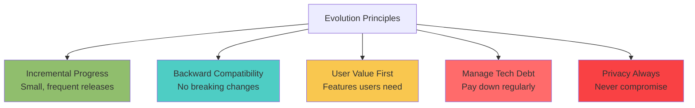

### Key Principles

1. **User Value First** - Prioritize features that deliver immediate user value
2. **Privacy Always** - Never compromise on privacy, even for convenience
3. **Incremental Evolution** - Small, frequent releases over big bang changes
4. **Backward Compatibility** - Existing installations continue to work
5. **Open Ecosystem** - Support community contributions and extensions

---

## Product Roadmap

### Timeline Overview

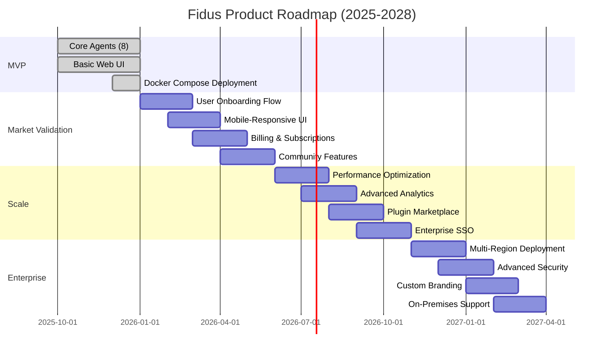

### Feature Priority Matrix

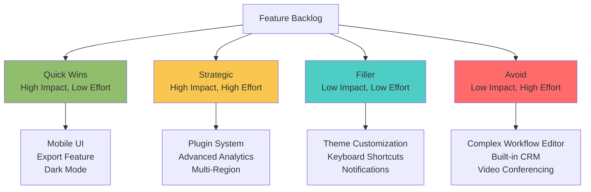

---

## Phase 1: MVP (Q1 2026)

### Scope

**Goal:** Launch minimal viable product with core functionality for early adopters.

### Features

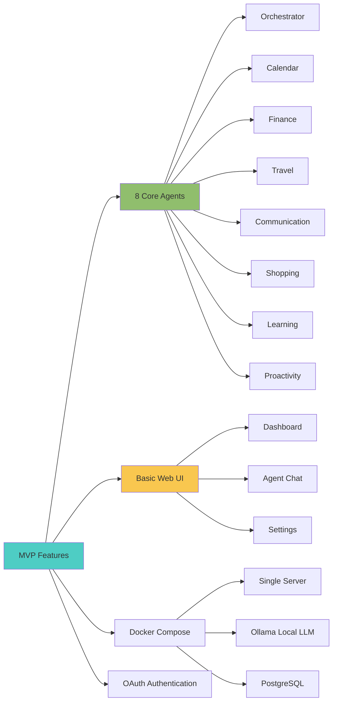

### Success Metrics

| Metric | Target | Measurement |
|--------|--------|-------------|
| **Early Adopters** | 100 users | User signups |
| **Active Usage** | 50% WAU/MAU | Weekly vs monthly active users |
| **Retention** | 40% (30-day) | Users active after 30 days |
| **Performance** | P95 < 2s | API response time |
| **Stability** | 95% uptime | System availability |
| **Feedback Score** | NPS > 30 | Net Promoter Score |

### Technical Milestones

- ✅ All 8 domain agents implemented
- ✅ LangGraph state machines for all agents
- ✅ MCP server integration
- ✅ Multi-tenant data isolation
- ✅ GDPR-compliant data export/deletion
- ✅ Docker Compose deployment
- ✅ Basic monitoring (Prometheus + Grafana)

### Known Limitations (MVP)

- ⚠️ Single-server deployment only
- ⚠️ No mobile app (responsive web only)
- ⚠️ Limited external integrations (5 MCP servers)
- ⚠️ No advanced analytics
- ⚠️ Basic UI (no customization)
- ⚠️ English language only

---

## Phase 2: Market Validation (Q2 2026)

### Scope

**Goal:** Validate product-market fit, improve onboarding, add key integrations.

### Feature Roadmap

```mermaid
flowchart TD
    Q2[Q2 2026 Features]

    Q2 --> Onboarding[Improved Onboarding<br/>Jan-Feb 2026]
    Q2 --> Mobile[Mobile-Responsive UI<br/>Feb-Mar 2026]
    Q2 --> Billing[Billing & Subscriptions<br/>Mar-Apr 2026]
    Q2 --> Community[Community Features<br/>Apr-May 2026]
    Q2 --> Integrations[More Integrations<br/>May-Jun 2026]

    Onboarding --> O1[Interactive Tutorial]
    Onboarding --> O2[Sample Data]
    Onboarding --> O3[Quick Setup Wizard]

    Mobile --> M1[Responsive Design]
    Mobile --> M2[Touch-Optimized UI]
    Mobile --> M3[PWA Support]

    Billing --> B1[Stripe Integration]
    Billing --> B2[Subscription Tiers]
    Billing --> B3[Usage Tracking]

    Community --> C1[Public Roadmap]
    Community --> C2[Feature Voting]
    Community --> C3[Discord Community]

    Integrations --> I1[10+ New MCP Servers]
    Integrations --> I2[Zapier Integration]
    Integrations --> I3[IFTTT Support]

    style Q2 fill:#4ecdc4
    style Onboarding fill:#90be6d
    style Mobile fill:#90be6d
    style Billing fill:#f9c74f
```

### User Onboarding Flow

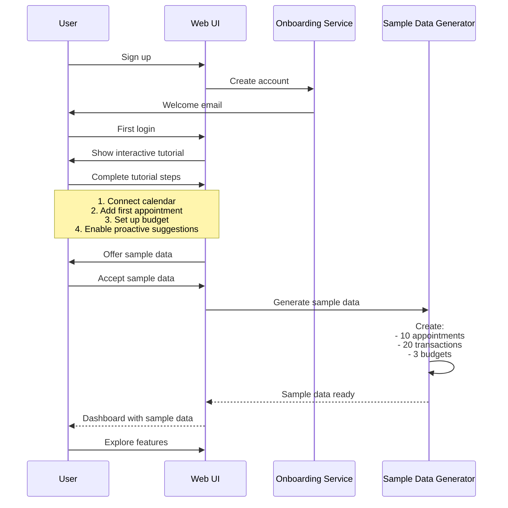

### Success Metrics

| Metric | Target | Measurement |
|--------|--------|-------------|
| **User Growth** | 1,000 users | Total signups |
| **Activation Rate** | 60% | Users completing onboarding |
| **Retention (30-day)** | 50% | Users active after 30 days |
| **Paying Customers** | 100 | Stripe subscriptions |
| **MRR** | €5,000 | Monthly recurring revenue |
| **NPS** | > 40 | Net Promoter Score |

### Technical Improvements

- ✅ Mobile-responsive UI (Tailwind breakpoints)
- ✅ PWA support (offline mode, install prompt)
- ✅ Stripe billing integration
- ✅ Improved performance (P95 < 1.5s)
- ✅ 10+ additional MCP server integrations
- ✅ Community feature voting (GitHub Discussions)
- ✅ Public roadmap (GitHub Projects)

---

## Phase 3: Scale (Q3-Q4 2026)

### Scope

**Goal:** Scale to 10,000+ users, introduce plugin marketplace, enterprise features.

### Feature Roadmap

```mermaid
flowchart TD
    Q3Q4[Q3-Q4 2026 Features]

    Q3Q4 --> Perf[Performance Optimization<br/>Jun-Aug 2026]
    Q3Q4 --> Analytics[Advanced Analytics<br/>Jul-Sep 2026]
    Q3Q4 --> Plugins[Plugin Marketplace<br/>Aug-Oct 2026]
    Q3Q4 --> Enterprise[Enterprise Features<br/>Sep-Nov 2026]

    Perf --> P1[Database Query Optimization]
    Perf --> P2[Redis Caching Strategy]
    Perf --> P3[CDN Integration]
    Perf --> P4[LLM Model Optimization]

    Analytics --> A1[Usage Dashboard]
    Analytics --> A2[Spending Insights]
    Analytics --> A3[Productivity Metrics]
    Analytics --> A4[Export Reports]

    Plugins --> PL1[Plugin SDK]
    Plugins --> PL2[Plugin Discovery]
    Plugins --> PL3[Plugin Sandboxing]
    Plugins --> PL4[Plugin Monetization]

    Enterprise --> E1["SSO (SAML/OIDC)"]
    Enterprise --> E2[Team Management]
    Enterprise --> E3[Audit Logs]
    Enterprise --> E4[Custom Branding]

    style Q3Q4 fill:#4ecdc4
    style Perf fill:#90be6d
    style Analytics fill:#f9c74f
    style Plugins fill:#ff6b6b
    style Enterprise fill:#95e1d3
```

### Plugin Marketplace Architecture

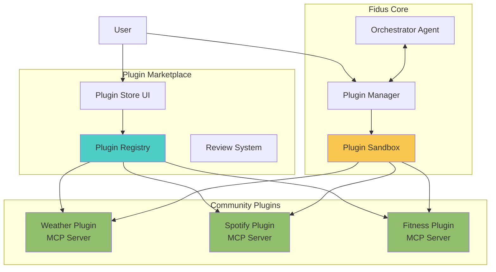

### Plugin SDK Example

```typescript
// fidus-plugin-sdk
import { FidusPlugin, MCPServer } from '@fidus/plugin-sdk';

export class WeatherPlugin extends FidusPlugin {
  name = 'weather';
  version = '1.0.0';
  author = 'John Doe';
  description = 'Get weather forecasts and current conditions';

  mcpServer: MCPServer;

  async initialize() {
    // Initialize MCP server
    this.mcpServer = new MCPServer({
      name: 'weather',
      version: '1.0.0',
    });

    // Register tools
    this.mcpServer.registerTool({
      name: 'get_weather',
      description: 'Get current weather for a location',
      parameters: {
        location: { type: 'string', required: true },
        units: { type: 'string', enum: ['metric', 'imperial'], default: 'metric' },
      },
      handler: this.getWeather.bind(this),
    });

    // Register resources (data signals)
    this.mcpServer.registerResource({
      uri: 'weather://current',
      name: 'Current weather',
      description: 'Current weather at user location',
      handler: this.getCurrentWeather.bind(this),
    });

    // Start MCP server
    await this.mcpServer.start();
  }

  async getWeather(params: { location: string; units: string }) {
    // Call external weather API
    const response = await fetch(
      `https://api.openweathermap.org/data/2.5/weather?q=${params.location}&units=${params.units}&appid=${this.config.apiKey}`
    );
    const data = await response.json();

    return {
      temperature: data.main.temp,
      conditions: data.weather[0].description,
      humidity: data.main.humidity,
      wind_speed: data.wind.speed,
    };
  }

  async getCurrentWeather() {
    // Get user's location from Fidus
    const userLocation = await this.fidus.getUser Location();
    return this.getWeather({ location: userLocation, units: 'metric' });
  }
}

// Export plugin
export default new WeatherPlugin();
```

### Plugin Sandboxing

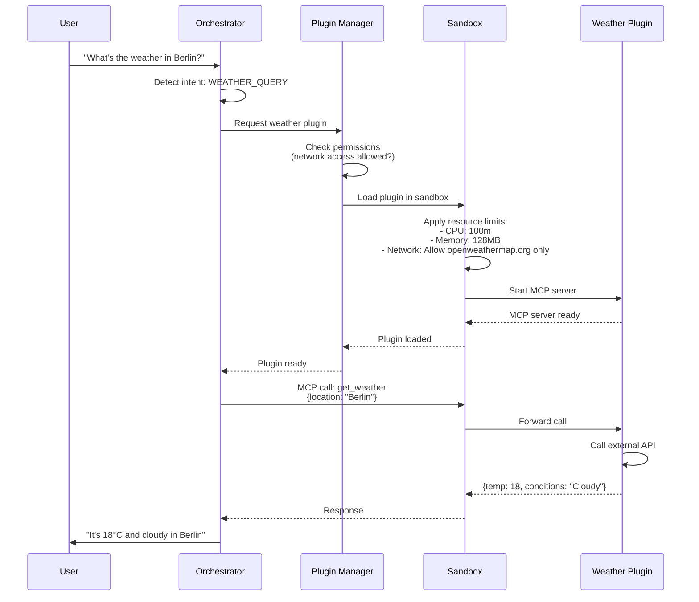

### Success Metrics

| Metric | Target | Measurement |
|--------|--------|-------------|
| **User Growth** | 10,000 users | Total signups |
| **Paying Customers** | 1,000 | Stripe subscriptions |
| **MRR** | €50,000 | Monthly recurring revenue |
| **Plugin Count** | 50+ | Community plugins published |
| **Enterprise Customers** | 10 | Companies with >100 users |
| **Uptime** | 99.9% | System availability |

---

## Phase 4: Enterprise (2027)

### Scope

**Goal:** Become enterprise-ready with multi-region deployment, advanced security, compliance.

### Feature Roadmap

```mermaid
flowchart TD
    Enterprise[Enterprise Features<br/>2027]

    Enterprise --> MultiRegion[Multi-Region Deployment<br/>Q1 2027]
    Enterprise --> Security[Advanced Security<br/>Q2 2027]
    Enterprise --> Compliance[Compliance & Audit<br/>Q3 2027]
    Enterprise --> Custom[Customization<br/>Q4 2027]

    MultiRegion --> MR1[Active-Active Multi-Region]
    MultiRegion --> MR2[Global Load Balancing]
    MultiRegion --> MR3[Data Residency Options]

    Security --> S1[SOC 2 Type II Certification]
    Security --> S2[Penetration Testing]
    Security --> S3[Bug Bounty Program]
    Security --> S4[Advanced Threat Detection]

    Compliance --> CO1[HIPAA Compliance]
    Compliance --> CO2[ISO 27001 Certification]
    Compliance --> CO3[Industry-Specific Compliance]
    Compliance --> CO4[Enhanced Audit Logs]

    Custom --> CU1[White-Label Solution]
    Custom --> CU2[Custom Domain]
    Custom --> CU3[API-First Architecture]
    Custom --> CU4[Advanced Workflow Builder]

    style Enterprise fill:#4ecdc4
    style MultiRegion fill:#90be6d
    style Security fill:#f94144
    style Compliance fill:#f9c74f
```

### Multi-Region Architecture

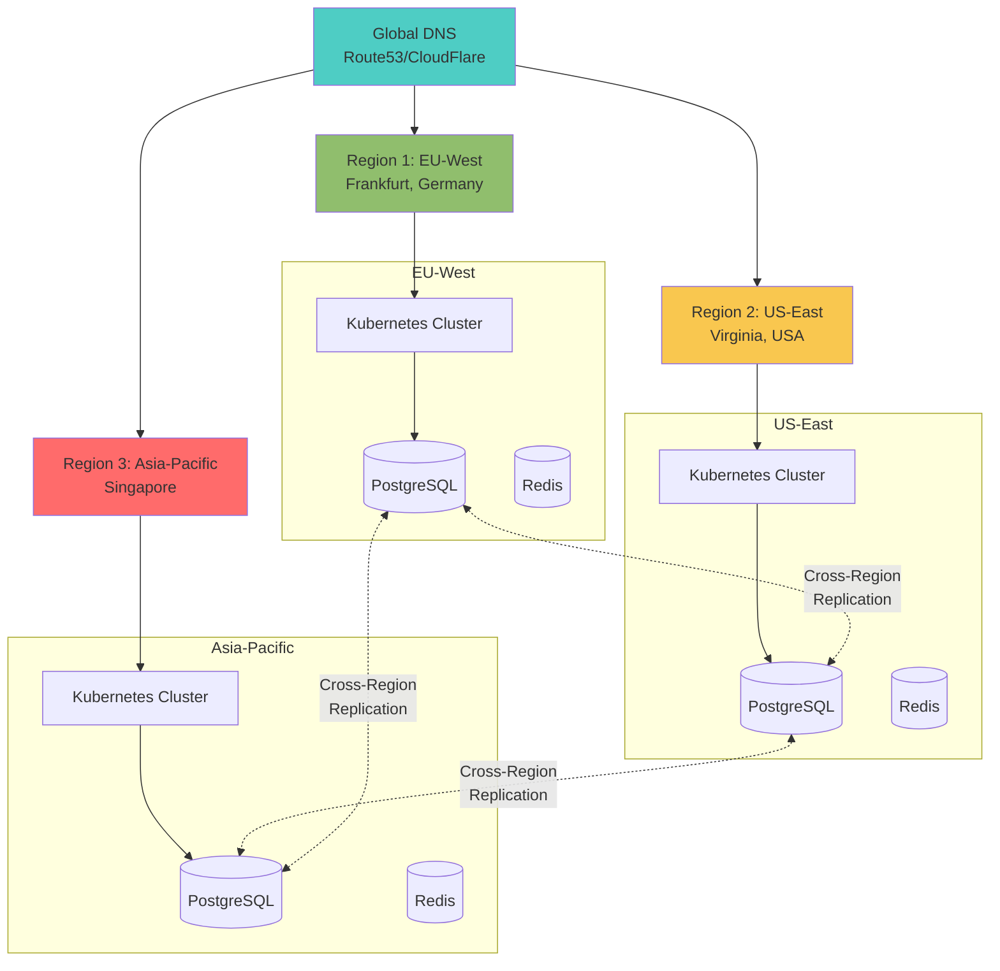

### Data Residency Compliance

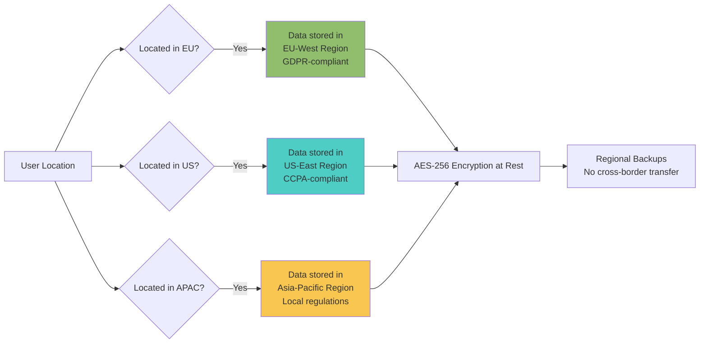

### Success Metrics

| Metric | Target | Measurement |
|--------|--------|-------------|
| **Enterprise Customers** | 100+ | Companies with >100 users |
| **ARR** | €1M+ | Annual recurring revenue |
| **Uptime** | 99.99% | System availability (multi-region) |
| **Security Certification** | SOC 2 Type II | Audit completion |
| **Compliance** | HIPAA, ISO 27001 | Certifications obtained |
| **Global Users** | 50,000+ | Users across all regions |

---

## Technology Evolution

### Technology Upgrade Path

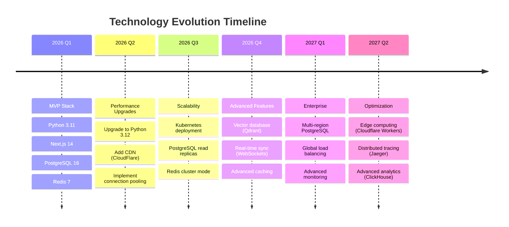

### LLM Evolution Strategy

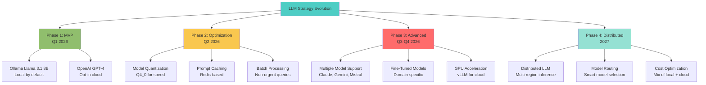

### Database Evolution

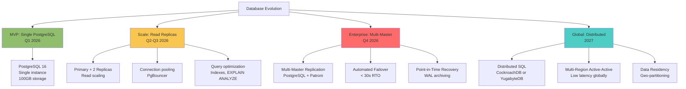

---

## Architecture Evolution

### Microservices Migration

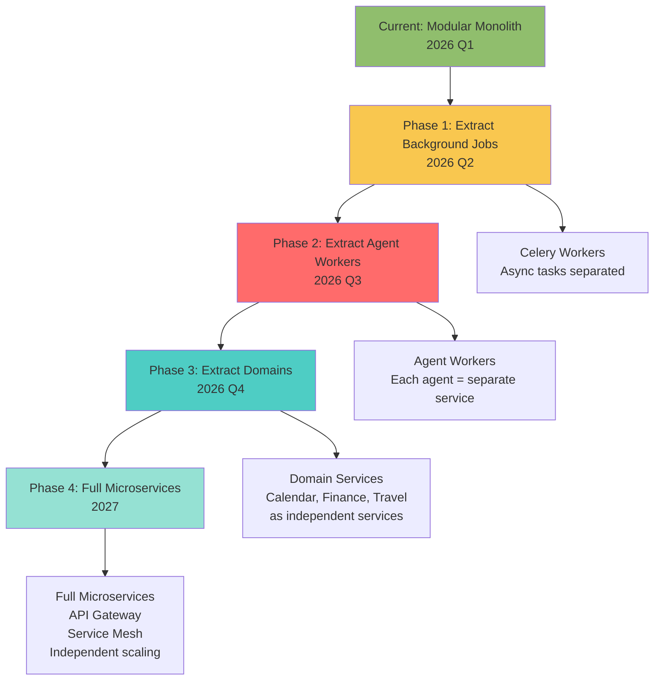

### From Monolith to Microservices

**Current Architecture (Modular Monolith):**

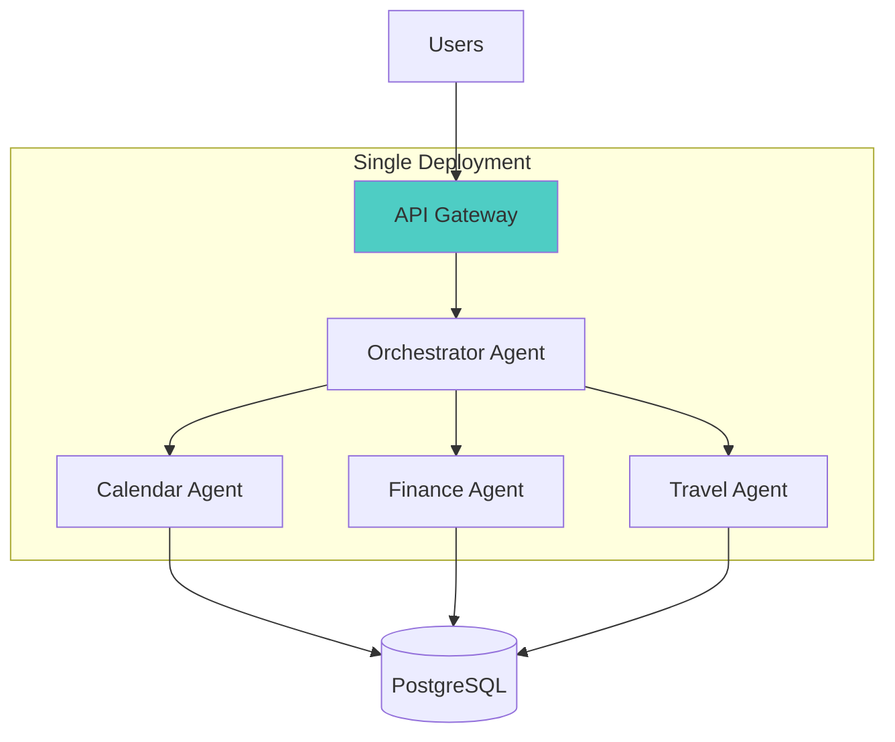

**Target Architecture (Microservices):**

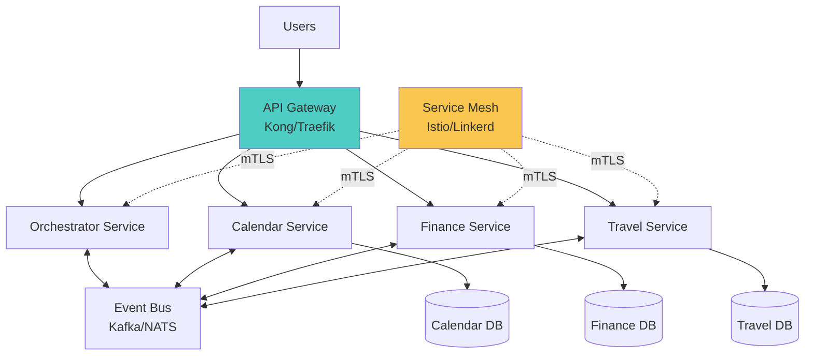

### Migration Strategy (Strangler Fig Pattern)

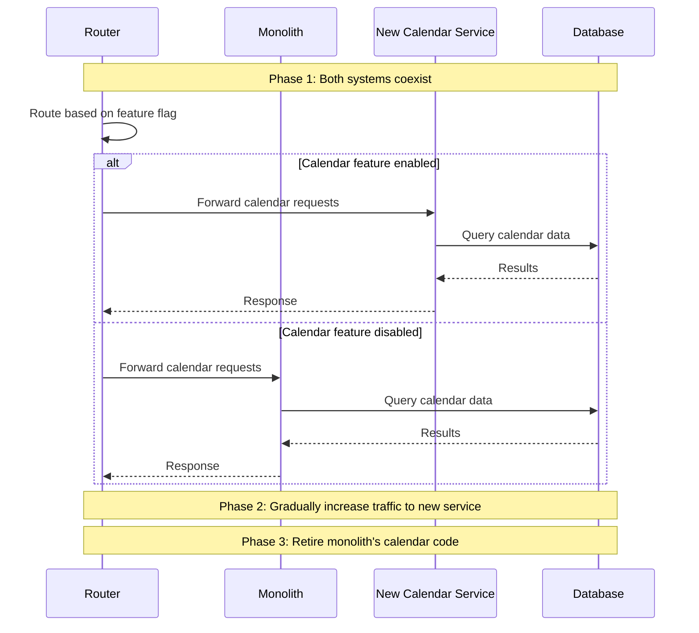

---

## Domain Evolution

### New Domain Addition Process

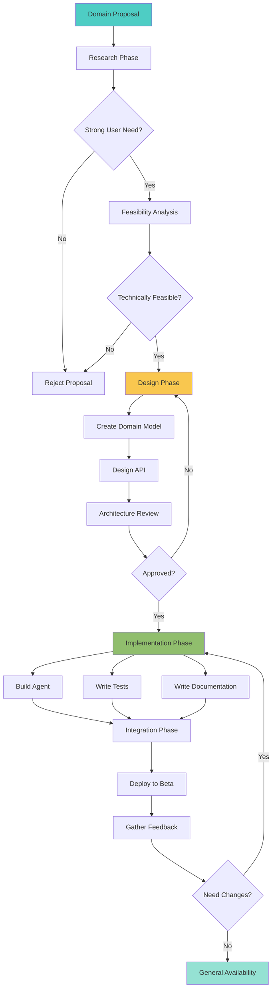

### Candidate Domains (Future)

| Domain | Priority | Timeline | Rationale |
|--------|----------|----------|-----------|
| **Home** | Medium | Q3 2026 | Smart home control, maintenance tracking |
| **Health** | Low | Q4 2026 | Medical appointment tracking (not medical advice) |
| **Fitness** | Low | 2027 | Workout tracking, integration with fitness apps |
| **Pet Care** | Low | 2027 | Pet appointments, vaccination tracking |
| **Vehicle** | Low | 2027 | Maintenance tracking, insurance management |
| **Legal** | Medium | 2027 | Document management, deadline tracking |

**Excluded Domains:**
- ❌ **Social Media Management** - Privacy concerns, complex APIs
- ❌ **Dating** - Out of scope for productivity tool
- ❌ **Gaming** - Not aligned with productivity focus
- ❌ **Gambling** - Ethical concerns

---

## Migration Paths

### Version Upgrade Process

```mermaid
sequenceDiagram
    participant Admin
    participant Update Service
    participant Docker Registry
    participant Current System
    participant New System
    participant Database

    Admin->>Update Service: Check for updates
    Update Service->>Docker Registry: Fetch latest version
    Docker Registry-->>Update Service: v1.2.0 available

    Update Service-->>Admin: New version available<br/>v1.1.0 → v1.2.0<br/>Changelog: ...

    Admin->>Update Service: Initiate update

    Update Service->>Current System: Create backup
    Current System->>Database: pg_dump
    Database-->>Current System: Backup complete

    Update Service->>Docker Registry: Pull new images
    Docker Registry-->>Update Service: Images downloaded

    Update Service->>Database: Run migrations
    Database-->>Update Service: Migrations applied

    Update Service->>New System: Start new containers
    New System->>New System: Health check

    alt Health check passed
        Update Service->>Current System: Stop old containers
        Update Service-->>Admin: Update successful ✅
    else Health check failed
        Update Service->>New System: Stop new containers
        Update Service->>Database: Rollback migrations
        Update Service->>Current System: Restart old containers
        Update Service-->>Admin: Update failed ❌<br/>Rolled back to v1.1.0
    end
```

### Database Migration Strategy

```mermaid
flowchart TD
    Start[Database Migration Needed]

    Start --> Backup[1. Create Backup]
    Backup --> Check[2. Check Migration Safety]

    Check --> Safe{Safe?}
    Safe -->|No breaking changes| Forward[Forward-Only Migration]
    Safe -->|Breaking changes| Expand[Expand-Contract Pattern]

    Forward --> Apply[3. Apply Migration]
    Apply --> Verify[4. Verify Data Integrity]
    Verify --> Complete[5. Complete]

    Expand --> ExpandPhase[3a. Expand Phase<br/>Add new columns/tables]
    ExpandPhase --> Dual[3b. Dual-Write Phase<br/>Write to both old and new]
    Dual --> Migrate[3c. Migrate Existing Data]
    Migrate --> Contract[3d. Contract Phase<br/>Remove old columns/tables]
    Contract --> Complete

    style Start fill:#4ecdc4
    style Forward fill:#90be6d
    style Expand fill:#f9c74f
```

**Expand-Contract Example:**

```sql
-- Phase 1: EXPAND (Add new column)
ALTER TABLE users ADD COLUMN email_verified BOOLEAN;

-- Phase 2: DUAL-WRITE (Application writes to both email_verified and old verification flow)
-- Application code handles both old and new schemas

-- Phase 3: MIGRATE (Backfill existing data)
UPDATE users SET email_verified = TRUE WHERE verification_token IS NULL;
UPDATE users SET email_verified = FALSE WHERE verification_token IS NOT NULL;

-- Phase 4: CONTRACT (Remove old column after 2 releases)
ALTER TABLE users DROP COLUMN verification_token;
```

### Self-Hosted to Cloud Migration

```mermaid
sequenceDiagram
    participant User
    participant Self-Hosted
    participant Export Service
    participant Cloud Platform
    participant Cloud Import

    User->>Self-Hosted: Request data export
    Self-Hosted->>Export Service: Generate export

    Export Service->>Export Service: Export all data:<br/>- Users<br/>- Appointments<br/>- Transactions<br/>- Settings

    Export Service-->>User: Download export.zip<br/>(Encrypted)

    User->>Cloud Platform: Sign up for cloud account
    Cloud Platform-->>User: Account created

    User->>Cloud Platform: Upload export.zip
    Cloud Platform->>Cloud Import: Process import

    Cloud Import->>Cloud Import: Validate data<br/>Check compatibility

    alt Compatible
        Cloud Import->>Cloud Import: Import data<br/>Preserve UUIDs<br/>Maintain relationships

        Cloud Import-->>User: Import successful ✅<br/>XX appointments<br/>XX transactions
    else Incompatible
        Cloud Import-->>User: Import failed ❌<br/>Reason: Version mismatch
    end

    User->>Self-Hosted: Verify cloud data
    User->>Self-Hosted: Decommission (optional)
```

---

## Backward Compatibility Strategy

### API Versioning

```mermaid
flowchart LR
    Client[Client] --> Gateway[API Gateway]

    Gateway --> V1{API Version?}

    V1 -->|v1| V1Handler[API v1 Handler<br/>Legacy format]
    V1 -->|v2| V2Handler[API v2 Handler<br/>New format]
    V1 -->|No version| Latest[Latest API<br/>Currently v2]

    V1Handler --> Adapter[Format Adapter]
    Adapter --> Service[Business Logic]

    V2Handler --> Service
    Latest --> Service

    Service --> Response[Response]

    style Gateway fill:#4ecdc4
    style V1Handler fill:#f9c74f
    style V2Handler fill:#90be6d
```

**API Versioning Policy:**

- **Support Window:** 12 months for deprecated APIs
- **Version Format:** `/api/v1/...`, `/api/v2/...`
- **Deprecation Notice:** 6 months advance notice
- **Breaking Changes:** Only in major versions

**Example:**

```typescript
// API v1 (deprecated 2026-06-01, removed 2027-06-01)
GET /api/v1/appointments
Response: {
  "appointments": [
    {
      "id": "apt-123",
      "title": "Meeting",
      "start_time": "2025-11-04T10:00:00Z",  // ISO 8601
      "end_time": "2025-11-04T11:00:00Z"
    }
  ]
}

// API v2 (current)
GET /api/v2/appointments
Response: {
  "data": [
    {
      "id": "apt-123",
      "type": "appointment",
      "attributes": {
        "title": "Meeting",
        "start": "2025-11-04T10:00:00Z",
        "end": "2025-11-04T11:00:00Z",
        "timezone": "Europe/Berlin"  // Added timezone
      },
      "relationships": {
        "participants": { "data": [...] }
      }
    }
  ],
  "meta": {
    "total": 1,
    "page": 1
  }
}
```

### Database Schema Evolution

```mermaid
flowchart TD
    Schema[Schema Change Needed]

    Schema --> Type{Change Type?}

    Type -->|Add Column| AddCol[Add column with DEFAULT<br/>No downtime]
    Type -->|Remove Column| RemoveCol[3-Phase Removal<br/>12 months]
    Type -->|Rename Column| RenameCol[Alias pattern<br/>6 months dual-support]
    Type -->|Change Type| ChangeType[Expand-Contract<br/>12 months]

    AddCol --> Deploy1[Deploy in next release]

    RemoveCol --> Phase1[Phase 1: Mark deprecated<br/>Application stops using]
    Phase1 --> Phase2[Phase 2: Remove from code<br/>Column remains in DB]
    Phase2 --> Phase3[Phase 3: DROP column<br/>After 12 months]

    RenameCol --> Alias[Create view with old name<br/>pointing to new name]
    Alias --> Deprecate[Deprecate old name]
    Deprecate --> RemoveAlias[Remove view after 6 months]

    ChangeType --> ExpandContract[Use Expand-Contract pattern]

    style AddCol fill:#90be6d
    style RemoveCol fill:#f9c74f
    style RenameCol fill:#4ecdc4
    style ChangeType fill:#ff6b6b
```

---

## Deprecation Policy

### Deprecation Timeline

```mermaid
gantt
    title Feature Deprecation Timeline
    dateFormat YYYY-MM-DD
    section Deprecation Process
    Announcement           :milestone, m1, 2026-01-01, 0d
    Deprecation Notice     :active, dep1, 2026-01-01, 180d
    Developer Migration    :dep2, 2026-01-01, 270d
    Grace Period           :dep3, 2026-07-01, 180d
    Feature Removal        :milestone, m2, 2026-12-31, 0d
```

**Policy:**
1. **Announcement:** Deprecation announced 12 months in advance
2. **Documentation:** Updated docs with migration guide
3. **Warnings:** Runtime warnings for 6 months
4. **Grace Period:** 6 months with errors (still functional)
5. **Removal:** Feature removed after 12 months total

### Deprecation Notice Example

```typescript
// Deprecated function (will be removed in v2.0.0)
/**
 * @deprecated Use `createAppointment()` instead. This function will be removed in v2.0.0.
 * Migration guide: https://docs.fidus.ai/migration/v1-to-v2
 */
export function addAppointment(data: AppointmentData) {
  console.warn(
    'addAppointment() is deprecated and will be removed in v2.0.0. Use createAppointment() instead.'
  );
  return createAppointment(data);
}

// New function
export function createAppointment(data: AppointmentData) {
  // New implementation
}
```

---

## Future Considerations

### Emerging Technologies to Watch

```mermaid
mindmap
  root((Future Tech))
    AI/LLM
      Multimodal LLMs
        Voice input/output
        Image understanding
      Agents
        AutoGPT-like autonomy
        Multi-agent collaboration
      Edge AI
        On-device inference
        Privacy-preserving AI
    Infrastructure
      WebAssembly
        Browser-side agents
        Cross-platform plugins
      Edge Computing
        Cloudflare Workers
        Deno Deploy
      Serverless
        Lambda/Cloud Run
        Cold start optimization
    Data
      Vector Databases
        Semantic search
        RAG improvements
      Real-Time
        CRDTs for sync
        WebRTC data channels
      Privacy Tech
        Homomorphic encryption
        Federated learning
```

### Research & Development Areas

| Area | Goal | Timeline | Impact |
|------|------|----------|--------|
| **Voice Interface** | Natural voice interaction with agents | 2027 | High |
| **Multimodal Input** | Image/video understanding | 2027 | Medium |
| **Federated Learning** | Learn from all users without centralizing data | 2028 | High |
| **Blockchain Integration** | Decentralized identity, verifiable credentials | 2028 | Low |
| **AR/VR Support** | Spatial computing interfaces | 2029 | Medium |
| **Brain-Computer Interface** | Direct thought input (speculative) | 2030+ | Unknown |

### Long-Term Vision (2028-2030)

```mermaid
flowchart TD
    Vision[Fidus Long-Term Vision]

    Vision --> AI[Truly Autonomous AI]
    Vision --> Privacy[Ultimate Privacy]
    Vision --> Ubiquitous[Ubiquitous Access]
    Vision --> Open[Open Ecosystem]

    AI --> AI1[Proactive assistance<br/>anticipates needs]
    AI --> AI2[Context-aware<br/>across all domains]
    AI --> AI3[Learns from behavior<br/>without compromising privacy]

    Privacy --> P1[Zero-knowledge architecture<br/>Server knows nothing]
    Privacy --> P2[End-to-end encryption<br/>for everything]
    Privacy --> P3[Federated learning<br/>AI improves without data sharing]

    Ubiquitous --> U1[Every device<br/>Phone, watch, glasses, car]
    Ubiquitous --> U2[Every context<br/>Home, work, travel]
    Ubiquitous --> U3[Seamless sync<br/>Real-time across devices]

    Open --> O1[100% open source<br/>Community-driven]
    Open --> O2[Open standards<br/>Interoperable with everything]
    Open --> O3[Plugin ecosystem<br/>Thousands of community plugins]

    style Vision fill:#4ecdc4
    style AI fill:#90be6d
    style Privacy fill:#f94144
    style Ubiquitous fill:#f9c74f
    style Open fill:#95e1d3
```

---

## Conclusion

This document outlines a comprehensive **3-year evolution strategy** for Fidus, from MVP (Q1 2026) to enterprise-grade system (2027+).

### Key Principles

1. **Incremental Progress:** Small, frequent releases over big bang changes
2. **User Value First:** Prioritize features users actually need
3. **Privacy Always:** Never compromise privacy for convenience
4. **Backward Compatibility:** Existing installations continue to work
5. **Open Ecosystem:** Support community contributions

### Success Factors

- ✅ Strong product-market fit (NPS > 40)
- ✅ Sustainable growth (10,000+ users by end of 2026)
- ✅ Healthy revenue (€50k MRR by end of 2026)
- ✅ Engaged community (50+ community plugins by end of 2026)
- ✅ Enterprise readiness (SOC 2, multi-region by 2027)

### Next Steps

For related documentation, see:
- [README.md](README.md) - Solution architecture overview
- [01-executive-summary.md](01-executive-summary.md) - High-level summary
- [03-component-architecture.md](03-component-architecture.md) - Detailed component design

---

**Version History:**
- v1.0 (2025-10-27): Initial comprehensive evolution strategy documentation

---

**End of Evolution Strategy Document**
