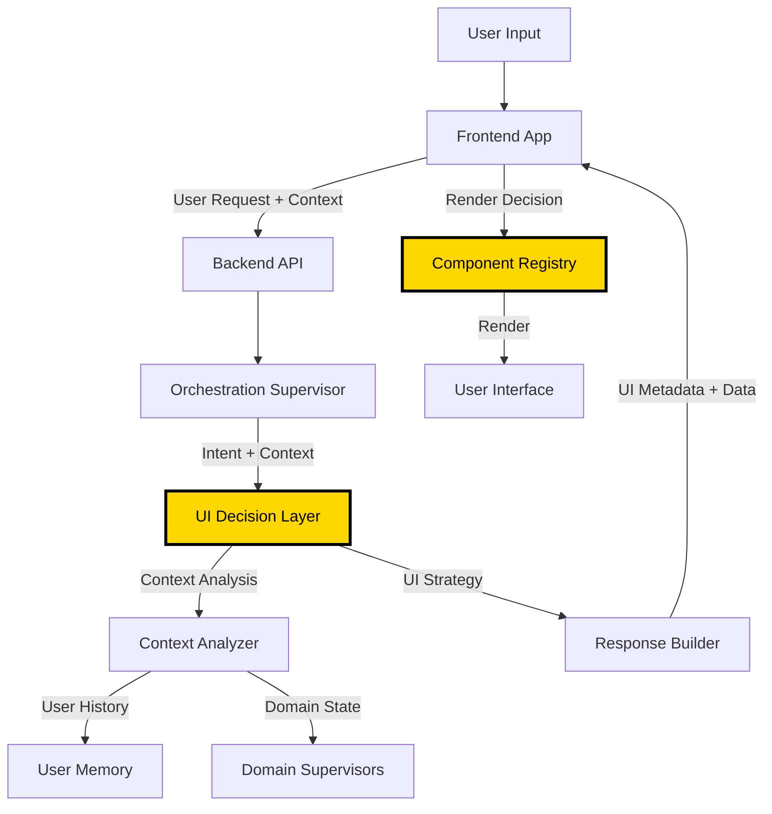
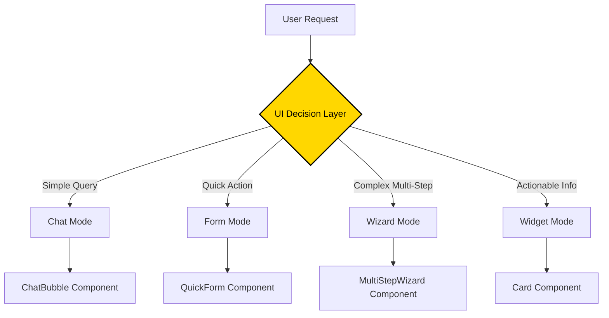
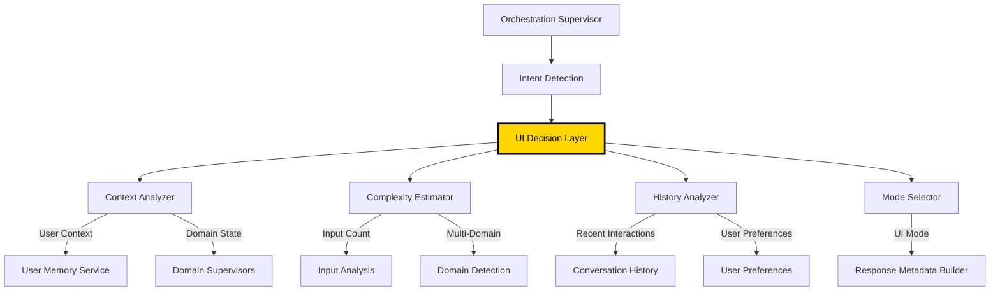
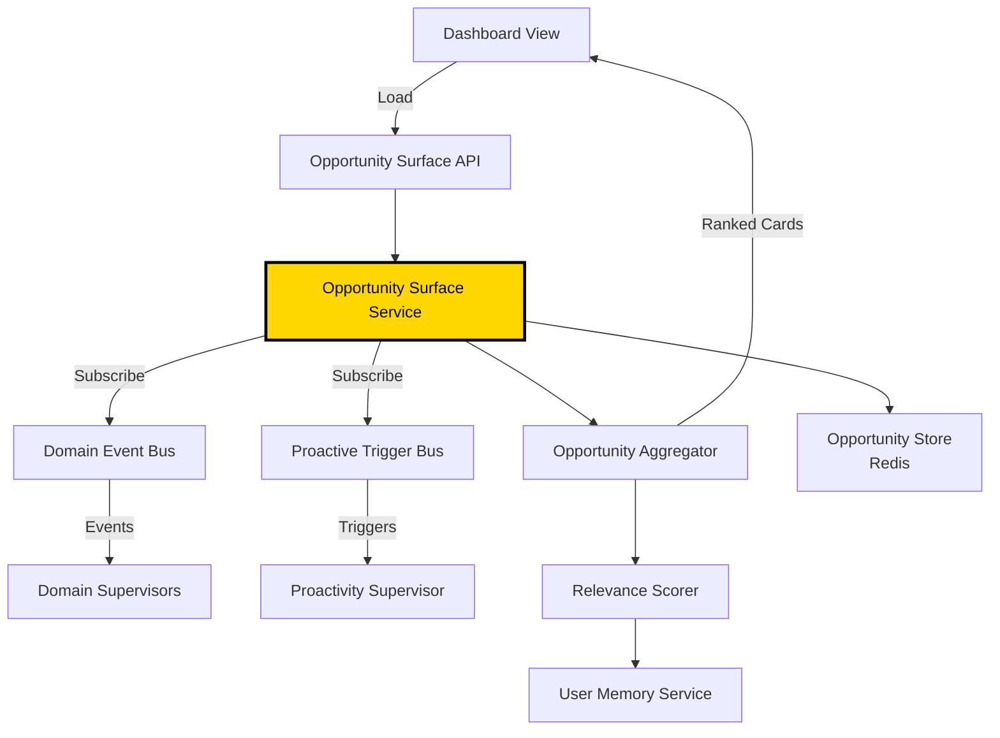
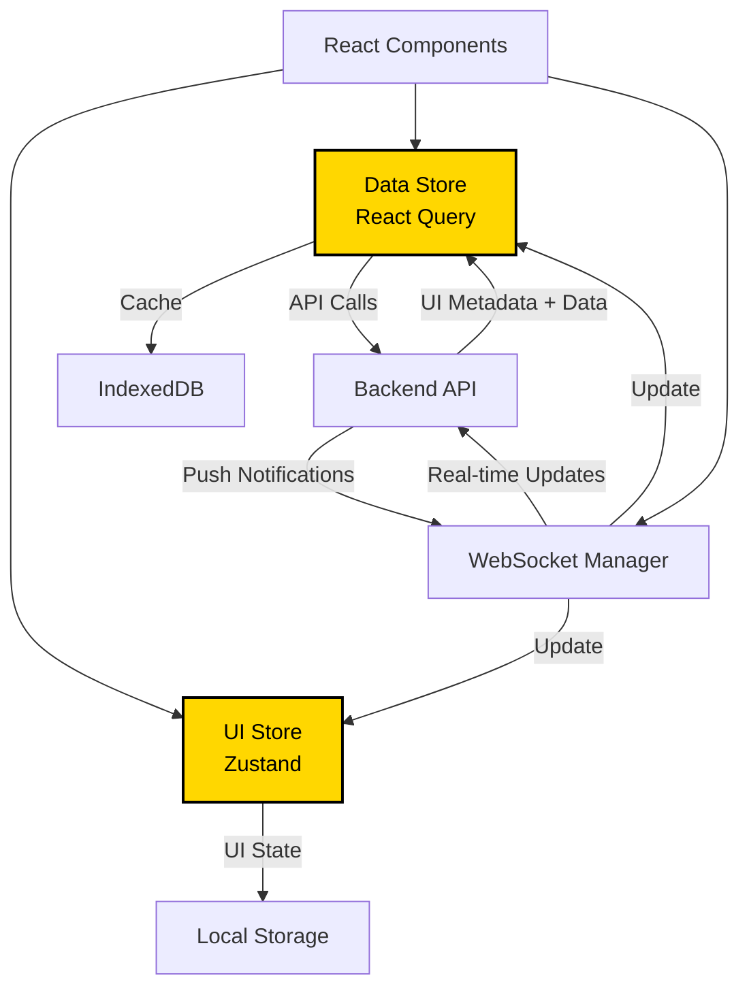
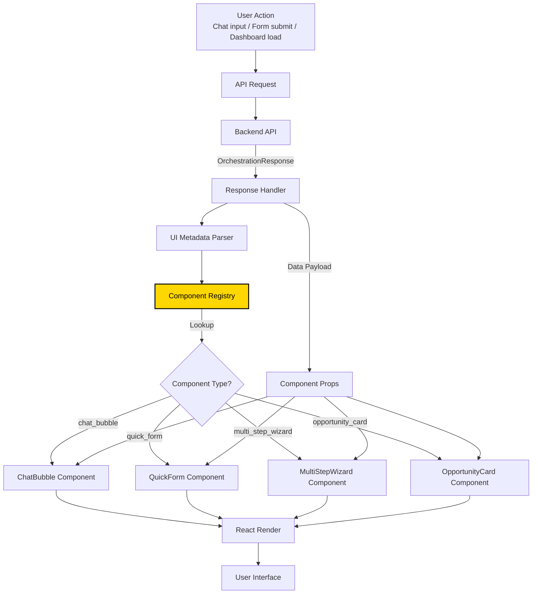

# Frontend Architecture: AI-Driven UI Implementation

**Document Status:** Draft
**Last Updated:** 2025-10-28
**Related Documents:**
- [UX/UI: AI-Driven UI Paradigm](../ux-ui-design/00-ai-driven-ui-paradigm.md)
- [Architecture: Supervisor Architecture](../architecture/02-supervisor-architecture.md)
- [Component Architecture](03-component-architecture.md)
- [Data Flows](05-data-flows.md)

---

## Table of Contents

- [Overview](#overview)
- [AI-Driven UI Architecture](#ai-driven-ui-architecture)
- [Frontend Component Model](#frontend-component-model)
- [UI Decision Layer](#ui-decision-layer)
- [Opportunity Surface Service](#opportunity-surface-service)
- [State Management](#state-management)
- [API Contract](#api-contract)
- [Rendering Pipeline](#rendering-pipeline)
- [Integration Patterns](#integration-patterns)
- [Implementation Roadmap](#implementation-roadmap)

---

## Overview

This document describes how the **AI-Driven UI Paradigm** (defined in UX/UI design) is technically implemented in Fidus's frontend architecture. Unlike traditional web applications with fixed screens and static navigation, Fidus uses an **LLM-orchestrated UI** where the backend determines what interface to render based on context.

### Key Architectural Principles

1. **Backend-Driven UI Decisions**: LLM (Orchestration Supervisor) decides what UI to render
2. **Frontend as Renderer**: Frontend receives UI metadata and renders appropriate components
3. **Dynamic Component Registry**: Components are selected at runtime based on UI metadata
4. **Context-Aware Rendering**: UI adapts to user intent, domain, complexity, and history
5. **Opportunity Surface**: Dashboard is not static widgets, but dynamic relevance-scored cards

---

## AI-Driven UI Architecture

### High-Level Flow



### Architecture Layers

| Layer | Location | Responsibility |
|-------|----------|----------------|
| **UI Decision Layer** | Backend (Orchestrator) | Analyzes context and decides what UI to render |
| **Response Builder** | Backend (API) | Constructs response with UI metadata + data payload |
| **Component Registry** | Frontend | Maps UI metadata to React components |
| **Rendering Engine** | Frontend | Renders selected components with data |

---

## Frontend Component Model

### Component Categories

Fidus frontend components are organized into **4 UI modes** as defined in the AI-Driven UI Paradigm:



### Component Registry Structure

```typescript
// packages/web/src/lib/components/registry.ts

export enum UIMode {
  CHAT = 'chat',
  FORM = 'form',
  WIZARD = 'wizard',
  WIDGET = 'widget',
}

export enum ComponentType {
  // Chat Mode
  CHAT_BUBBLE = 'chat_bubble',
  CHAT_SUGGESTIONS = 'chat_suggestions',

  // Form Mode
  QUICK_FORM = 'quick_form',
  DOMAIN_FORM = 'domain_form',

  // Wizard Mode
  MULTI_STEP_WIZARD = 'multi_step_wizard',
  PROGRESS_INDICATOR = 'progress_indicator',

  // Widget Mode
  OPPORTUNITY_CARD = 'opportunity_card',
  INFO_CARD = 'info_card',
  ACTION_CARD = 'action_card',
}

export interface ComponentMetadata {
  mode: UIMode;
  componentType: ComponentType;
  props: Record<string, unknown>;
  actions?: ActionMetadata[];
  privacy?: PrivacyMetadata;
}

export const ComponentRegistry: Record<ComponentType, React.ComponentType<any>> = {
  [ComponentType.CHAT_BUBBLE]: ChatBubble,
  [ComponentType.QUICK_FORM]: QuickForm,
  [ComponentType.MULTI_STEP_WIZARD]: MultiStepWizard,
  [ComponentType.OPPORTUNITY_CARD]: OpportunityCard,
  // ... other components
};
```

### Component Props Interface

```typescript
// packages/shared/src/types/ui-metadata.ts

export interface UIMetadata {
  // UI Mode Selection
  mode: 'chat' | 'form' | 'wizard' | 'widget';

  // Component Selection
  componentType: string;

  // Data Payload
  data: Record<string, unknown>;

  // Actions (buttons, links, swipes)
  actions?: {
    id: string;
    label: string;
    type: 'primary' | 'secondary' | 'destructive';
    intent?: string; // For follow-up requests
    endpoint?: string; // For direct API calls
  }[];

  // Privacy Badge
  privacy?: {
    level: 'local' | 'cloud' | 'encrypted';
    label: string;
    tooltip: string;
  };

  // Accessibility
  accessibility?: {
    role?: string;
    ariaLabel?: string;
    ariaDescribedBy?: string;
  };

  // Wizard-specific
  wizard?: {
    currentStep: number;
    totalSteps: number;
    canGoBack: boolean;
    canSkip: boolean;
  };

  // Widget-specific (Opportunity Cards)
  widget?: {
    relevanceScore: number; // 0-100
    triggerType?: string;
    expiresAt?: string; // ISO 8601
    dismissable: boolean;
  };
}
```

---

## UI Decision Layer

The **UI Decision Layer** is a new component of the Orchestration Supervisor responsible for analyzing context and deciding what UI to render.

### Architecture



### Decision Logic

```python
# packages/api/fidus/domain/orchestration/ui_decision_layer.py

from enum import Enum
from typing import Dict, Any, Optional
from pydantic import BaseModel


class UIMode(str, Enum):
    CHAT = "chat"
    FORM = "form"
    WIZARD = "wizard"
    WIDGET = "widget"


class UIDecisionContext(BaseModel):
    """Context for UI decision making."""

    # Intent Analysis
    intent_type: str
    intent_confidence: float
    domains_involved: list[str]

    # Complexity Estimation
    required_inputs: int
    optional_inputs: int
    multi_domain: bool
    multi_step: bool

    # User History
    recent_interactions: list[str]
    user_expertise_level: str  # 'novice' | 'intermediate' | 'expert'
    preferred_mode: Optional[UIMode] = None

    # Domain State
    has_conflicts: bool
    requires_confirmation: bool
    has_suggestions: bool


class UIDecisionLayer:
    """
    Decides what UI mode to use based on context.

    This is a critical component of the AI-Driven UI Paradigm.
    The LLM doesn't just return data - it decides HOW to present it.
    """

    def __init__(self, llm_client, user_memory_service):
        self.llm = llm_client
        self.user_memory = user_memory_service

    def decide_ui_mode(
        self,
        intent: str,
        context: UIDecisionContext
    ) -> Dict[str, Any]:
        """
        Decide what UI mode to use for this request.

        Returns:
            UIMetadata dict with mode, componentType, and props
        """
        # Rule-based first pass (fast)
        if self._is_simple_query(context):
            return self._create_chat_response(intent, context)

        if self._is_quick_action(context):
            return self._create_form_response(intent, context)

        if self._is_complex_multi_step(context):
            return self._create_wizard_response(intent, context)

        # LLM decision for edge cases
        return self._llm_decide_mode(intent, context)

    def _is_simple_query(self, context: UIDecisionContext) -> bool:
        """Simple informational query → Chat mode."""
        return (
            context.required_inputs == 0 and
            not context.multi_domain and
            not context.has_conflicts and
            context.intent_type in ['query', 'status_check', 'information_request']
        )

    def _is_quick_action(self, context: UIDecisionContext) -> bool:
        """Quick action with few inputs → Form mode."""
        return (
            1 <= context.required_inputs <= 3 and
            not context.multi_domain and
            not context.multi_step and
            context.intent_type in ['create', 'update', 'schedule']
        )

    def _is_complex_multi_step(self, context: UIDecisionContext) -> bool:
        """Complex multi-step action → Wizard mode."""
        return (
            context.required_inputs > 3 or
            context.multi_domain or
            context.multi_step or
            context.has_conflicts
        )

    def _create_chat_response(
        self,
        intent: str,
        context: UIDecisionContext
    ) -> Dict[str, Any]:
        """Create chat mode UI metadata."""
        return {
            'mode': UIMode.CHAT,
            'componentType': 'chat_bubble',
            'props': {
                'text': '',  # Filled by domain supervisor
                'suggestions': self._generate_suggestions(intent, context),
            },
            'privacy': self._determine_privacy_level(context),
        }

    def _create_form_response(
        self,
        intent: str,
        context: UIDecisionContext
    ) -> Dict[str, Any]:
        """Create form mode UI metadata."""
        return {
            'mode': UIMode.FORM,
            'componentType': 'quick_form',
            'props': {
                'title': self._generate_form_title(intent),
                'fields': [],  # Filled by domain supervisor
                'submitLabel': 'Create',
            },
            'actions': [
                {'id': 'submit', 'label': 'Create', 'type': 'primary'},
                {'id': 'cancel', 'label': 'Cancel', 'type': 'secondary'},
            ],
            'privacy': self._determine_privacy_level(context),
        }

    def _create_wizard_response(
        self,
        intent: str,
        context: UIDecisionContext
    ) -> Dict[str, Any]:
        """Create wizard mode UI metadata."""
        steps = self._determine_wizard_steps(intent, context)

        return {
            'mode': UIMode.WIZARD,
            'componentType': 'multi_step_wizard',
            'props': {
                'title': self._generate_wizard_title(intent),
                'steps': steps,
            },
            'wizard': {
                'currentStep': 1,
                'totalSteps': len(steps),
                'canGoBack': True,
                'canSkip': False,
            },
            'privacy': self._determine_privacy_level(context),
        }

    def _llm_decide_mode(
        self,
        intent: str,
        context: UIDecisionContext
    ) -> Dict[str, Any]:
        """Use LLM to decide UI mode for edge cases."""
        prompt = f"""
        Given this user request context, decide the best UI mode:

        Intent: {intent}
        Domains: {context.domains_involved}
        Required inputs: {context.required_inputs}
        Multi-step: {context.multi_step}
        User expertise: {context.user_expertise_level}

        Choose ONE mode:
        - chat: Simple informational response
        - form: Quick data entry (1-3 fields)
        - wizard: Multi-step guided process
        - widget: Actionable card on dashboard

        Respond with JSON: {{"mode": "...", "reason": "..."}}
        """

        response = self.llm.generate(prompt)
        # Parse and return UI metadata
        # ...
```

### Integration with Orchestration Supervisor

```python
# packages/api/fidus/domain/orchestration/orchestration_supervisor.py

class OrchestrationSupervisor:
    """Main orchestration supervisor with UI decision making."""

    def __init__(self):
        # ... existing initialization
        self.ui_decision_layer = UIDecisionLayer(
            llm_client=self.llm,
            user_memory_service=self.memory_service
        )

    async def process_request(
        self,
        user_id: str,
        tenant_id: str,
        user_input: str
    ) -> Dict[str, Any]:
        """
        Process user request and return response with UI metadata.
        """
        # 1. Detect intent
        intent = await self.detect_intent(user_input)

        # 2. Build UI decision context
        context = await self._build_ui_context(
            user_id=user_id,
            tenant_id=tenant_id,
            intent=intent,
            user_input=user_input
        )

        # 3. Decide UI mode (NEW!)
        ui_metadata = self.ui_decision_layer.decide_ui_mode(
            intent=intent.name,
            context=context
        )

        # 4. Route to domain supervisor
        domain_response = await self.route_to_supervisor(
            intent=intent,
            user_input=user_input,
            tenant_id=tenant_id
        )

        # 5. Build final response with UI metadata
        return {
            'ui': ui_metadata,
            'data': domain_response,
            'metadata': {
                'intent': intent.name,
                'confidence': intent.confidence,
                'domains': context.domains_involved,
            }
        }
```

---

## Opportunity Surface Service

The **Opportunity Surface Service** manages the dynamic dashboard (called "Opportunity Surface" in design docs).

### Architecture



### Service Implementation

```python
# packages/api/fidus/domain/orchestration/opportunity_surface_service.py

from typing import List, Dict, Any, Optional
from datetime import datetime, timedelta
from pydantic import BaseModel


class OpportunityCard(BaseModel):
    """An opportunity card for the dashboard."""

    id: str
    tenant_id: str
    user_id: str

    # Card Content
    title: str
    description: str
    icon: str

    # Relevance
    relevance_score: float  # 0-100
    trigger_type: str
    opportunity_type: str  # 'urgent' | 'important' | 'suggestion' | 'info'

    # Lifecycle
    created_at: datetime
    expires_at: Optional[datetime] = None
    dismissed_at: Optional[datetime] = None
    acted_upon_at: Optional[datetime] = None

    # Actions
    primary_action: Optional[Dict[str, Any]] = None
    secondary_actions: List[Dict[str, Any]] = []

    # Privacy
    privacy_level: str  # 'local' | 'cloud' | 'encrypted'

    # Domain
    source_domain: str
    related_entities: List[str] = []


class OpportunitySurfaceService:
    """
    Manages the dynamic Opportunity Surface (dashboard).

    Responsibilities:
    - Listen to proactive triggers from all domains
    - Score opportunities for relevance
    - Aggregate and rank opportunities
    - Provide API for dashboard to fetch cards
    - Handle card lifecycle (dismiss, expire, act upon)
    """

    def __init__(
        self,
        event_bus,
        trigger_bus,
        user_memory_service,
        opportunity_store
    ):
        self.event_bus = event_bus
        self.trigger_bus = trigger_bus
        self.user_memory = user_memory_service
        self.store = opportunity_store

        # Subscribe to all proactive triggers
        self._subscribe_to_triggers()

    def _subscribe_to_triggers(self):
        """Subscribe to proactive triggers from all domains."""
        self.trigger_bus.subscribe(
            pattern="*.trigger.*",
            callback=self.on_proactive_trigger
        )

    async def on_proactive_trigger(self, trigger: Dict[str, Any]):
        """
        Handle proactive trigger from any domain.

        Create an opportunity card if relevant.
        """
        # 1. Score relevance
        relevance_score = await self._score_relevance(trigger)

        if relevance_score < 30:
            # Not relevant enough, ignore
            return

        # 2. Create opportunity card
        card = await self._create_opportunity_card(
            trigger=trigger,
            relevance_score=relevance_score
        )

        # 3. Store card
        await self.store.save(card)

        # 4. Notify frontend via WebSocket
        await self._notify_dashboard_update(
            user_id=card.user_id,
            tenant_id=card.tenant_id
        )

    async def _score_relevance(self, trigger: Dict[str, Any]) -> float:
        """
        Score opportunity relevance (0-100).

        Factors:
        - Trigger confidence
        - User history (has user ignored similar opportunities?)
        - Time context (is this timely?)
        - Domain preferences (does user care about this domain?)
        - Urgency level
        """
        score = trigger.get('confidence', 0.5) * 100  # Base score

        # Boost for urgency
        if trigger.get('opportunity_type') == 'urgent':
            score *= 1.5

        # Reduce if user previously dismissed similar
        user_history = await self.user_memory.get_opportunity_history(
            user_id=trigger['user_id'],
            trigger_type=trigger['trigger_type']
        )

        if user_history.get('dismiss_rate', 0) > 0.7:
            score *= 0.5  # User doesn't care about these

        # Boost if timely
        if self._is_timely(trigger):
            score *= 1.2

        return min(score, 100)  # Cap at 100

    async def _create_opportunity_card(
        self,
        trigger: Dict[str, Any],
        relevance_score: float
    ) -> OpportunityCard:
        """Create opportunity card from trigger."""
        return OpportunityCard(
            id=generate_id(),
            tenant_id=trigger['tenant_id'],
            user_id=trigger['user_id'],
            title=trigger['title'],
            description=trigger['description'],
            icon=trigger.get('icon', 'bell'),
            relevance_score=relevance_score,
            trigger_type=trigger['trigger_type'],
            opportunity_type=trigger['opportunity_type'],
            created_at=datetime.utcnow(),
            expires_at=trigger.get('expires_at'),
            primary_action=trigger.get('primary_action'),
            secondary_actions=trigger.get('secondary_actions', []),
            privacy_level=trigger.get('privacy_level', 'local'),
            source_domain=trigger['domain'],
            related_entities=trigger.get('related_entities', []),
        )

    async def get_opportunities(
        self,
        user_id: str,
        tenant_id: str,
        limit: int = 10
    ) -> List[OpportunityCard]:
        """
        Get active opportunities for user's dashboard.

        Returns cards sorted by relevance score (descending).
        """
        # 1. Fetch active cards from store
        cards = await self.store.get_active(
            user_id=user_id,
            tenant_id=tenant_id
        )

        # 2. Re-score (relevance decays over time)
        for card in cards:
            card.relevance_score = self._decay_relevance(card)

        # 3. Sort by relevance
        cards.sort(key=lambda c: c.relevance_score, reverse=True)

        # 4. Return top N
        return cards[:limit]

    async def dismiss_opportunity(
        self,
        opportunity_id: str,
        user_id: str,
        tenant_id: str
    ):
        """Dismiss an opportunity card."""
        card = await self.store.get(opportunity_id)

        if card.user_id != user_id or card.tenant_id != tenant_id:
            raise PermissionError("Cannot dismiss other user's opportunities")

        card.dismissed_at = datetime.utcnow()
        await self.store.save(card)

        # Update user memory (learn from dismissals)
        await self.user_memory.record_opportunity_dismissal(
            user_id=user_id,
            trigger_type=card.trigger_type,
            relevance_score=card.relevance_score
        )

    async def act_upon_opportunity(
        self,
        opportunity_id: str,
        action_id: str,
        user_id: str,
        tenant_id: str
    ):
        """User acted upon an opportunity card."""
        card = await self.store.get(opportunity_id)

        if card.user_id != user_id or card.tenant_id != tenant_id:
            raise PermissionError("Cannot act on other user's opportunities")

        card.acted_upon_at = datetime.utcnow()
        await self.store.save(card)

        # Update user memory (learn from actions)
        await self.user_memory.record_opportunity_action(
            user_id=user_id,
            trigger_type=card.trigger_type,
            relevance_score=card.relevance_score
        )
```

### API Endpoints

```python
# packages/api/fidus/api/routes/opportunities.py

from fastapi import APIRouter, Depends
from typing import List

router = APIRouter(prefix="/api/v1/opportunities", tags=["opportunities"])


@router.get("/", response_model=List[OpportunityCard])
async def get_opportunities(
    limit: int = 10,
    user_id: str = Depends(get_current_user_id),
    tenant_id: str = Depends(get_current_tenant_id),
    service: OpportunitySurfaceService = Depends(get_opportunity_service)
):
    """
    Get active opportunities for the current user's dashboard.

    Returns cards sorted by relevance score.
    """
    return await service.get_opportunities(
        user_id=user_id,
        tenant_id=tenant_id,
        limit=limit
    )


@router.post("/{opportunity_id}/dismiss")
async def dismiss_opportunity(
    opportunity_id: str,
    user_id: str = Depends(get_current_user_id),
    tenant_id: str = Depends(get_current_tenant_id),
    service: OpportunitySurfaceService = Depends(get_opportunity_service)
):
    """Dismiss an opportunity card."""
    await service.dismiss_opportunity(
        opportunity_id=opportunity_id,
        user_id=user_id,
        tenant_id=tenant_id
    )
    return {"status": "dismissed"}


@router.post("/{opportunity_id}/act")
async def act_upon_opportunity(
    opportunity_id: str,
    action_id: str,
    user_id: str = Depends(get_current_user_id),
    tenant_id: str = Depends(get_current_tenant_id),
    service: OpportunitySurfaceService = Depends(get_opportunity_service)
):
    """User acted upon an opportunity (clicked primary/secondary action)."""
    await service.act_upon_opportunity(
        opportunity_id=opportunity_id,
        action_id=action_id,
        user_id=user_id,
        tenant_id=tenant_id
    )
    return {"status": "acted_upon"}
```

---

## State Management

### Frontend State Architecture



### UI Store (Zustand)

```typescript
// packages/web/src/lib/state/ui-store.ts

import { create } from 'zustand';
import { persist } from 'zustand/middleware';

interface UIState {
  // Current UI Mode
  currentMode: 'chat' | 'form' | 'wizard' | 'widget' | null;

  // Dashboard
  opportunityCards: OpportunityCard[];
  dashboardLayout: 'grid' | 'list';

  // Chat
  chatHistory: ChatMessage[];
  chatSuggestions: string[];

  // Wizard
  wizardState: WizardState | null;

  // Actions
  setCurrentMode: (mode: UIState['currentMode']) => void;
  setOpportunityCards: (cards: OpportunityCard[]) => void;
  addChatMessage: (message: ChatMessage) => void;
  updateWizardState: (state: WizardState) => void;
}

export const useUIStore = create<UIState>()(
  persist(
    (set) => ({
      currentMode: null,
      opportunityCards: [],
      dashboardLayout: 'grid',
      chatHistory: [],
      chatSuggestions: [],
      wizardState: null,

      setCurrentMode: (mode) => set({ currentMode: mode }),
      setOpportunityCards: (cards) => set({ opportunityCards: cards }),
      addChatMessage: (message) =>
        set((state) => ({ chatHistory: [...state.chatHistory, message] })),
      updateWizardState: (wizardState) => set({ wizardState }),
    }),
    {
      name: 'fidus-ui-state',
    }
  )
);
```

### Data Store (React Query)

```typescript
// packages/web/src/lib/api/queries.ts

import { useQuery, useMutation, useQueryClient } from '@tanstack/react-query';

export function useOpportunities() {
  return useQuery({
    queryKey: ['opportunities'],
    queryFn: async () => {
      const response = await fetch('/api/v1/opportunities');
      return response.json();
    },
    refetchInterval: 60000, // Refresh every minute
  });
}

export function useDismissOpportunity() {
  const queryClient = useQueryClient();

  return useMutation({
    mutationFn: async (opportunityId: string) => {
      await fetch(`/api/v1/opportunities/${opportunityId}/dismiss`, {
        method: 'POST',
      });
    },
    onSuccess: () => {
      queryClient.invalidateQueries({ queryKey: ['opportunities'] });
    },
  });
}

export function useSubmitRequest() {
  return useMutation({
    mutationFn: async (request: { input: string }) => {
      const response = await fetch('/api/v1/orchestrate', {
        method: 'POST',
        headers: { 'Content-Type': 'application/json' },
        body: JSON.stringify(request),
      });
      return response.json();
    },
  });
}
```

---

## API Contract

### Request Format

```typescript
// packages/shared/src/types/api.ts

export interface OrchestrationRequest {
  // User input
  input: string;

  // Optional context
  context?: {
    currentDomain?: string;
    conversationId?: string;
    referenceEntities?: string[];
  };

  // UI preferences (optional, can override LLM decision)
  uiPreferences?: {
    preferredMode?: 'chat' | 'form' | 'wizard';
    disableAutoMode?: boolean;
  };
}
```

### Response Format

```typescript
// packages/shared/src/types/api.ts

export interface OrchestrationResponse {
  // UI Metadata (NEW!)
  ui: {
    mode: 'chat' | 'form' | 'wizard' | 'widget';
    componentType: string;
    props: Record<string, unknown>;
    actions?: ActionMetadata[];
    privacy?: PrivacyMetadata;
    wizard?: WizardMetadata;
    widget?: WidgetMetadata;
  };

  // Data Payload
  data: Record<string, unknown>;

  // Metadata
  metadata: {
    intent: string;
    confidence: number;
    domains: string[];
    processingTime: number;
  };

  // Error (if any)
  error?: {
    code: string;
    message: string;
    details?: Record<string, unknown>;
  };
}
```

### Example Responses

**Chat Mode Response:**

```json
{
  "ui": {
    "mode": "chat",
    "componentType": "chat_bubble",
    "props": {
      "text": "You have 3 appointments today: Team standup at 9:00 AM, Client call at 2:00 PM, and Dentist at 5:30 PM.",
      "suggestions": [
        "Show me details for the client call",
        "Reschedule the dentist appointment",
        "What's on my calendar tomorrow?"
      ]
    },
    "privacy": {
      "level": "local",
      "label": "🔒 Local",
      "tooltip": "This data never leaves your device"
    }
  },
  "data": {
    "appointments": [
      { "id": "1", "title": "Team standup", "startTime": "2025-10-28T09:00:00Z" },
      { "id": "2", "title": "Client call", "startTime": "2025-10-28T14:00:00Z" },
      { "id": "3", "title": "Dentist", "startTime": "2025-10-28T17:30:00Z" }
    ]
  },
  "metadata": {
    "intent": "calendar_query",
    "confidence": 0.95,
    "domains": ["calendar"],
    "processingTime": 245
  }
}
```

**Form Mode Response:**

```json
{
  "ui": {
    "mode": "form",
    "componentType": "quick_form",
    "props": {
      "title": "Schedule Appointment",
      "fields": [
        {
          "id": "title",
          "label": "Title",
          "type": "text",
          "required": true,
          "value": "Team meeting"
        },
        {
          "id": "startTime",
          "label": "Start Time",
          "type": "datetime",
          "required": true
        },
        {
          "id": "duration",
          "label": "Duration",
          "type": "select",
          "options": ["30 min", "1 hour", "2 hours"],
          "value": "1 hour"
        }
      ],
      "submitLabel": "Schedule"
    },
    "actions": [
      { "id": "submit", "label": "Schedule", "type": "primary" },
      { "id": "cancel", "label": "Cancel", "type": "secondary" }
    ],
    "privacy": {
      "level": "local",
      "label": "🔒 Local",
      "tooltip": "This data stays on your device"
    }
  },
  "data": {},
  "metadata": {
    "intent": "calendar_create",
    "confidence": 0.92,
    "domains": ["calendar"],
    "processingTime": 312
  }
}
```

**Wizard Mode Response:**

```json
{
  "ui": {
    "mode": "wizard",
    "componentType": "multi_step_wizard",
    "props": {
      "title": "Plan Weekend Trip",
      "steps": [
        {
          "id": "destination",
          "title": "Choose Destination",
          "description": "Where would you like to go?"
        },
        {
          "id": "dates",
          "title": "Select Dates",
          "description": "When do you want to travel?"
        },
        {
          "id": "budget",
          "title": "Set Budget",
          "description": "How much do you want to spend?"
        },
        {
          "id": "preferences",
          "title": "Preferences",
          "description": "Activities and accommodation"
        }
      ]
    },
    "wizard": {
      "currentStep": 1,
      "totalSteps": 4,
      "canGoBack": false,
      "canSkip": false
    },
    "privacy": {
      "level": "cloud",
      "label": "☁️ Cloud",
      "tooltip": "Travel recommendations use cloud AI"
    }
  },
  "data": {
    "currentStep": {
      "fields": [
        {
          "id": "destination",
          "label": "Destination",
          "type": "autocomplete",
          "suggestions": ["Paris", "Barcelona", "Amsterdam"]
        }
      ]
    }
  },
  "metadata": {
    "intent": "travel_plan",
    "confidence": 0.88,
    "domains": ["travel", "calendar", "finance"],
    "processingTime": 567
  }
}
```

**Widget Mode Response (Opportunity Card):**

```json
{
  "ui": {
    "mode": "widget",
    "componentType": "opportunity_card",
    "props": {
      "title": "Budget Alert: Food category exceeded",
      "description": "You've spent €1,250 of your €1,000 food budget this month.",
      "icon": "alert-circle",
      "variant": "urgent"
    },
    "actions": [
      {
        "id": "view_details",
        "label": "View Details",
        "type": "primary",
        "intent": "Show food budget details"
      },
      {
        "id": "adjust_budget",
        "label": "Adjust Budget",
        "type": "secondary",
        "intent": "Increase food budget"
      }
    ],
    "widget": {
      "relevanceScore": 95,
      "triggerType": "BUDGET_EXCEEDED",
      "expiresAt": null,
      "dismissable": true
    },
    "privacy": {
      "level": "local",
      "label": "🔒 Local",
      "tooltip": "Budget data is stored locally"
    }
  },
  "data": {
    "budget": {
      "category": "FOOD",
      "limit": 1000,
      "spent": 1250,
      "currency": "EUR"
    }
  },
  "metadata": {
    "intent": "proactive_alert",
    "confidence": 1.0,
    "domains": ["finance"],
    "processingTime": 123
  }
}
```

---

## Rendering Pipeline

### Frontend Rendering Flow



### Renderer Component

```typescript
// packages/web/src/components/ui/DynamicRenderer.tsx

import React from 'react';
import { OrchestrationResponse } from '@fidus/shared/types/api';
import { ComponentRegistry, ComponentType } from '@/lib/components/registry';

interface DynamicRendererProps {
  response: OrchestrationResponse;
  onAction?: (actionId: string, intent?: string) => void;
}

export function DynamicRenderer({ response, onAction }: DynamicRendererProps) {
  const { ui, data } = response;

  // 1. Look up component from registry
  const Component = ComponentRegistry[ui.componentType as ComponentType];

  if (!Component) {
    console.error(`Unknown component type: ${ui.componentType}`);
    return <ErrorFallback message="Unable to render response" />;
  }

  // 2. Prepare props
  const componentProps = {
    ...ui.props,
    data,
    actions: ui.actions,
    privacy: ui.privacy,
    wizard: ui.wizard,
    widget: ui.widget,
    onAction,
  };

  // 3. Render
  return (
    <div className="dynamic-render" data-ui-mode={ui.mode}>
      <Component {...componentProps} />
    </div>
  );
}
```

### Usage in Chat Interface

```typescript
// packages/web/src/components/chat/ChatInterface.tsx

import React, { useState } from 'react';
import { useSubmitRequest } from '@/lib/api/queries';
import { DynamicRenderer } from '@/components/ui/DynamicRenderer';

export function ChatInterface() {
  const [messages, setMessages] = useState<OrchestrationResponse[]>([]);
  const submitRequest = useSubmitRequest();

  const handleSubmit = async (input: string) => {
    const response = await submitRequest.mutateAsync({ input });
    setMessages((prev) => [...prev, response]);
  };

  const handleAction = async (actionId: string, intent?: string) => {
    if (intent) {
      // Follow-up request
      await handleSubmit(intent);
    } else {
      // Direct API call
      // ...
    }
  };

  return (
    <div className="chat-interface">
      {messages.map((response, idx) => (
        <DynamicRenderer
          key={idx}
          response={response}
          onAction={handleAction}
        />
      ))}

      <ChatInput onSubmit={handleSubmit} />
    </div>
  );
}
```

---

## Integration Patterns

### Pattern 1: Dashboard (Opportunity Surface)

```typescript
// packages/web/src/app/dashboard/page.tsx

import React from 'react';
import { useOpportunities } from '@/lib/api/queries';
import { OpportunityCard } from '@/components/opportunities/OpportunityCard';

export default function DashboardPage() {
  const { data: opportunities, isLoading } = useOpportunities();

  if (isLoading) return <LoadingSpinner />;

  return (
    <div className="dashboard">
      <h1>Opportunity Surface</h1>

      {opportunities.length === 0 ? (
        <EmptyState message="No opportunities right now. You're all set!" />
      ) : (
        <div className="opportunity-grid">
          {opportunities.map((opportunity) => (
            <OpportunityCard key={opportunity.id} opportunity={opportunity} />
          ))}
        </div>
      )}
    </div>
  );
}
```

### Pattern 2: Chat Interface

```typescript
// packages/web/src/app/chat/page.tsx

import React from 'react';
import { ChatInterface } from '@/components/chat/ChatInterface';

export default function ChatPage() {
  return (
    <div className="chat-page">
      <ChatInterface />
    </div>
  );
}
```

### Pattern 3: Domain-Specific Views (Optional)

Even though Fidus primarily uses AI-driven UI, users can still navigate to domain-specific views if they want traditional navigation:

```typescript
// packages/web/src/app/calendar/page.tsx

import React from 'react';
import { useCalendarEvents } from '@/lib/api/queries';
import { CalendarView } from '@/components/calendar/CalendarView';

export default function CalendarPage() {
  const { data: events } = useCalendarEvents();

  return (
    <div className="calendar-page">
      <CalendarView events={events} />
    </div>
  );
}
```

**Note:** Domain-specific views are **secondary** to the AI-driven chat/dashboard. Most users will interact through chat or opportunity cards.

---

## Implementation Roadmap

### Phase 1: Foundation (Weeks 1-2)

**Backend:**
- [ ] Create `UIDecisionLayer` class in Orchestration Supervisor
- [ ] Extend `OrchestrationResponse` schema to include `ui` metadata
- [ ] Update all domain supervisors to return UI-compatible responses
- [ ] Add `UIDecisionContext` to orchestration flow

**Frontend:**
- [ ] Set up Component Registry with 4 base components (Chat, Form, Wizard, Widget)
- [ ] Create `DynamicRenderer` component
- [ ] Set up Zustand store for UI state
- [ ] Set up React Query for API calls

**Shared:**
- [ ] Define `UIMetadata` TypeScript interfaces
- [ ] Create Zod schemas for UI metadata validation

### Phase 2: Opportunity Surface (Weeks 3-4)

**Backend:**
- [ ] Create `OpportunitySurfaceService`
- [ ] Implement `OpportunityCard` model and Redis store
- [ ] Subscribe to proactive triggers from all domains
- [ ] Implement relevance scoring algorithm
- [ ] Add API endpoints: `/api/v1/opportunities`

**Frontend:**
- [ ] Create `OpportunityCard` component
- [ ] Create Dashboard page with opportunity grid
- [ ] Implement WebSocket connection for real-time updates
- [ ] Add swipe-to-dismiss gesture

### Phase 3: UI Decision Logic (Weeks 5-6)

**Backend:**
- [ ] Implement rule-based UI mode selection
- [ ] Implement LLM-based UI mode selection for edge cases
- [ ] Add complexity estimation
- [ ] Integrate user memory for personalization
- [ ] Add A/B testing framework for UI decisions

**Frontend:**
- [ ] Implement all component variants (info/action/urgent cards)
- [ ] Add form validation and error handling
- [ ] Implement wizard navigation (back/next/skip)
- [ ] Add accessibility attributes

### Phase 4: Polish & Testing (Weeks 7-8)

**Backend:**
- [ ] Performance optimization (caching, batching)
- [ ] Add comprehensive logging for UI decisions
- [ ] Write integration tests for UI Decision Layer

**Frontend:**
- [ ] Add animations and transitions
- [ ] Implement responsive design for mobile
- [ ] Add offline support (PWA)
- [ ] Write E2E tests with Playwright

**Documentation:**
- [ ] API documentation for UI metadata
- [ ] Component usage guide for developers
- [ ] Update onboarding wizard to explain AI-driven UI

### Phase 5: Advanced Features (Weeks 9-12)

- [ ] Voice input with UI adaptation
- [ ] Multi-modal UI (voice + visual)
- [ ] UI decision analytics dashboard (for admins)
- [ ] User preferences for UI modes
- [ ] Keyboard shortcuts and power-user features

---

## Conclusion

This architecture document bridges the gap between the **AI-Driven UI Paradigm** (design) and the **technical implementation** (code). By adding a **UI Decision Layer** to the Orchestration Supervisor and creating an **Opportunity Surface Service**, Fidus becomes a truly LLM-orchestrated application where the backend decides what UI to render based on context.

### Key Takeaways

1. **Backend drives UI decisions** - LLM analyzes context and chooses chat/form/wizard/widget
2. **Frontend is a renderer** - Component registry dynamically renders based on UI metadata
3. **Opportunity Surface is dynamic** - Dashboard shows relevance-scored cards, not static widgets
4. **API contract includes UI metadata** - Every response specifies how to render it
5. **User memory personalizes UI** - System learns which UI modes users prefer

### Next Steps

1. Create `docs/solution-architecture/14-api-response-schema.md` documenting full API contract
2. Begin Phase 1 implementation (Foundation)
3. Update existing domain supervisors to return UI metadata

---

**Document Version:** 1.0
**Authors:** Architecture Team
**Review Status:** Draft - Pending Review
**Related PRs:** TBD
