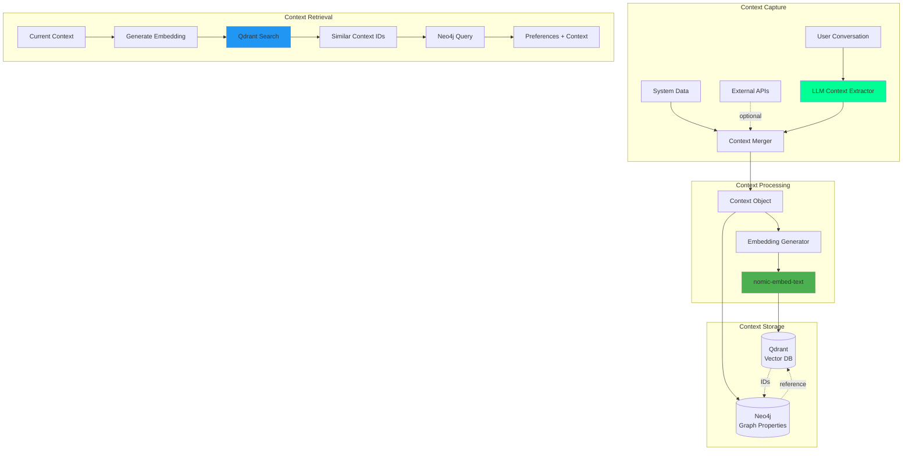

# Situational Context - Solution Architecture

**Version:** 1.0
**Date:** 2025-11-03
**Status:** Draft
**Part of:** Fidus Solution Architecture

---

## Overview

This document describes the technical implementation of **Situational Context** in the Fidus system, enabling context-aware preference learning and retrieval.

**Reference:** [Architecture: Situational Context](../architecture/08-situational-context-architecture.md)

---

## Technology Stack

| Component | Technology | Rationale |
|-----------|-----------|-----------|
| **Context Extraction** | LLM (via LiteLLM) | Natural language understanding, flexible factor extraction |
| **Context Storage** | Neo4j (graph properties) | Schema-less key-value storage, graph relationships |
| **Embedding Generation** | nomic-embed-text (via Ollama) | Local, privacy-first, high-quality embeddings |
| **Vector Search** | Qdrant | Fast similarity search, metadata filtering |
| **Context Caching** | Redis | Hot-path performance optimization |

---

## Architecture Diagram



---

## Data Model

### Neo4j Schema

```cypher
# Preference with multiple situational contexts

(:User {id: string, created_at: datetime})
  -[:HAS_PREFERENCE]->
(:Preference {
  id: uuid,
  domain: string,
  key: string,
  value: string,
  confidence: float,
  learned_at: datetime,
  reinforcement_count: int,
  rejection_count: int
})
  -[:IN_SITUATION]->
(:Situation {
  id: uuid,
  embedding_id: string,           # Reference to Qdrant vector
  factors: json,                  # Schema-less context factors
  captured_at: datetime,
  description: string             # Human-readable context summary
})

# Example Situation node:
(:Situation {
  id: "sit-123",
  embedding_id: "qdrant-abc",
  factors: {
    time_of_day: "morning",
    location: "office",
    activity: "working",
    energy_level: "low",
    with_people: ["colleague"]
  },
  captured_at: 2025-11-03T08:30:00Z,
  description: "Monday morning at office, working with low energy"
})
```

**Key Design Decisions:**

1. **`factors` as JSON:** Allows schema-less, dynamic context factors
2. **Multiple Situations per Preference:** Same preference can apply in different contexts
3. **`embedding_id` reference:** Links to Qdrant for similarity search
4. **`description` for humans:** Helps with debugging and user transparency

### Qdrant Schema

```python
# Collection: situations
{
  "collection_name": "situations",
  "vectors": {
    "size": 768,              # nomic-embed-text dimension
    "distance": "Cosine"
  }
}

# Point structure
{
  "id": "qdrant-abc",         # UUID
  "vector": [0.1, 0.2, ...],  # 768-dim embedding
  "payload": {
    # All context factors as payload (for filtering)
    "situation_id": "sit-123",
    "user_id": "user-456",
    "time_of_day": "morning",
    "location": "office",
    "activity": "working",
    "energy_level": "low",
    "with_people": ["colleague"],
    "captured_at": "2025-11-03T08:30:00Z"
  }
}
```

**Key Design Decisions:**

1. **Cosine Distance:** Best for semantic similarity
2. **Payload = full context:** Enables metadata filtering
3. **User ID in payload:** Ensures tenant isolation in search

---

## Implementation Components

### 1. Dynamic Context Extraction

**Component:** `DynamicContextExtractor`

**Responsibility:** Extract situational factors from conversation using LLM

```python
# packages/api/fidus/memory/context/extractor.py

from typing import Dict, Any
import json
from litellm import completion

class DynamicContextExtractor:
    """Extracts situational context factors from conversation using LLM."""

    EXTRACTION_PROMPT = """Extract all relevant situational context factors from this conversation.

Conversation snippet:
"{conversation}"

Extract ANY context factors that might influence user preferences.

Common factor categories (NOT exhaustive, you can add new ones):
- Temporal: time_of_day, day_of_week, is_weekend, season
- Spatial: location_type, is_familiar, indoors
- Social: alone, with_people, group_size
- Activity: current_activity, intensity, duration
- Cognitive: energy_level, stress_level, mood, focus_required
- Physical: weather, temperature, noise_level
- Schedule: busy, free_time, deadline_pressure

IMPORTANT: You can create NEW factor names if relevant!
Examples: "coffee_already_consumed", "first_task_of_day", "post_workout"

Guidelines:
1. Only include factors clearly stated or strongly implied
2. Use snake_case for factor names
3. Keep values simple (strings, numbers, booleans, arrays)
4. Omit factors if not mentioned or unclear

Return as JSON object with key-value pairs.

Example output:
{{
  "time_of_day": "morning",
  "location_type": "office",
  "energy_level": "low",
  "activity": "working",
  "coffee_already_consumed": false,
  "first_meeting_of_day": true
}}
"""

    def __init__(self, litellm_config: dict):
        self.litellm_config = litellm_config

    async def extract(self, conversation_snippet: str) -> Dict[str, Any]:
        """Extract context factors from conversation."""

        prompt = self.EXTRACTION_PROMPT.format(conversation=conversation_snippet)

        try:
            response = await completion(
                model=self.litellm_config["model"],
                messages=[{"role": "user", "content": prompt}],
                temperature=0.3,  # Lower temp for more consistent extraction
                **self.litellm_config.get("params", {})
            )

            content = response.choices[0].message.content

            # Parse JSON response
            extracted = json.loads(content)

            return extracted

        except json.JSONDecodeError as e:
            # Fallback: empty context
            return {}
        except Exception as e:
            # Log error, return empty context
            return {}
```

### 2. System Context Provider

**Component:** `SystemContextProvider`

**Responsibility:** Provide always-available context from system state

```python
# packages/api/fidus/memory/context/system_provider.py

from datetime import datetime
from typing import Dict, Any

class SystemContextProvider:
    """Provides context from system state (always available)."""

    def get_system_context(self) -> Dict[str, Any]:
        """Get context from current system time."""

        now = datetime.now()

        return {
            "timestamp": now.isoformat(),
            "hour": now.hour,
            "minute": now.minute,
            "day_of_week": now.strftime("%A"),
            "day_of_month": now.day,
            "month": now.month,
            "year": now.year,
            "is_weekend": now.weekday() >= 5,
            "is_work_hours": self._is_work_hours(now),
            "season": self._get_season(now.month),
            "time_of_day": self._classify_time(now.hour)
        }

    def _is_work_hours(self, dt: datetime) -> bool:
        """Check if current time is typical work hours."""
        return 9 <= dt.hour < 17 and dt.weekday() < 5

    def _get_season(self, month: int) -> str:
        """Get season from month (Northern Hemisphere)."""
        if month in [12, 1, 2]:
            return "winter"
        elif month in [3, 4, 5]:
            return "spring"
        elif month in [6, 7, 8]:
            return "summer"
        else:
            return "autumn"

    def _classify_time(self, hour: int) -> str:
        """Classify time of day."""
        if 5 <= hour < 12:
            return "morning"
        elif 12 <= hour < 17:
            return "afternoon"
        elif 17 <= hour < 22:
            return "evening"
        else:
            return "night"
```

### 3. Context Merger

**Component:** `ContextMerger`

**Responsibility:** Merge context from multiple sources

```python
# packages/api/fidus/memory/context/merger.py

from typing import Dict, Any

class ContextMerger:
    """Merges context from multiple sources."""

    def merge(
        self,
        system_context: Dict[str, Any],
        extracted_context: Dict[str, Any],
        explicit_context: Dict[str, Any] = None
    ) -> Dict[str, Any]:
        """Merge contexts with priority: explicit > extracted > system."""

        # Start with system context
        merged = {**system_context}

        # Overlay extracted context
        merged.update(extracted_context)

        # Overlay explicit context (highest priority)
        if explicit_context:
            merged.update(explicit_context)

        return merged

    def create_description(self, context: Dict[str, Any]) -> str:
        """Create human-readable context description."""

        parts = []

        # Temporal
        if time := context.get("time_of_day"):
            day = context.get("day_of_week", "")
            parts.append(f"{time} on {day}" if day else time)

        # Spatial
        if location := context.get("location_type"):
            parts.append(f"at {location}")

        # Activity
        if activity := context.get("activity"):
            parts.append(f"doing {activity}")

        # Social
        if alone := context.get("alone"):
            if alone:
                parts.append("alone")
            elif with_people := context.get("with_people"):
                parts.append(f"with {', '.join(with_people)}")

        # Cognitive
        if energy := context.get("energy_level"):
            parts.append(f"energy: {energy}")

        return ", ".join(parts) if parts else "general context"
```

### 4. Context Embedding Service

**Component:** `ContextEmbeddingService`

**Responsibility:** Generate embeddings for context objects

```python
# packages/api/fidus/memory/context/embedding.py

from typing import Dict, Any, List
from litellm import embedding as create_embedding

class ContextEmbeddingService:
    """Generates embeddings for context objects."""

    def __init__(self, embedding_model: str = "nomic-embed-text"):
        self.embedding_model = embedding_model

    async def embed_context(self, context: Dict[str, Any]) -> List[float]:
        """Generate embedding for context object."""

        # Convert context to natural language text
        text = self._context_to_text(context)

        # Generate embedding
        response = await create_embedding(
            model=f"ollama/{self.embedding_model}",
            input=text
        )

        return response.data[0].embedding

    def _context_to_text(self, context: Dict[str, Any]) -> str:
        """Convert context dict to natural language text for embedding."""

        # Sort for consistency
        sorted_factors = sorted(context.items())

        parts = []

        for key, value in sorted_factors:
            # Skip technical fields
            if key in ["timestamp", "embedding_id", "situation_id", "user_id"]:
                continue

            # Format key-value as natural text
            readable_key = key.replace("_", " ")

            # Handle different value types
            if isinstance(value, bool):
                if value:
                    parts.append(readable_key)
            elif isinstance(value, list):
                parts.append(f"{readable_key}: {', '.join(str(v) for v in value)}")
            else:
                parts.append(f"{readable_key}: {value}")

        return ". ".join(parts)
```

### 5. Context Storage Service

**Component:** `ContextStorageService`

**Responsibility:** Store context in Neo4j + Qdrant

```python
# packages/api/fidus/memory/context/storage.py

import uuid
from typing import Dict, Any
from neo4j import AsyncDriver
from qdrant_client import AsyncQdrantClient
from qdrant_client.models import PointStruct

class ContextStorageService:
    """Stores context in Neo4j + Qdrant."""

    def __init__(
        self,
        neo4j_driver: AsyncDriver,
        qdrant_client: AsyncQdrantClient,
        embedding_service: ContextEmbeddingService
    ):
        self.neo4j = neo4j_driver
        self.qdrant = qdrant_client
        self.embedding_service = embedding_service

    async def store_context(
        self,
        user_id: str,
        preference_id: str,
        context: Dict[str, Any],
        description: str
    ) -> str:
        """Store context and link to preference."""

        # Generate IDs
        situation_id = str(uuid.uuid4())
        embedding_id = str(uuid.uuid4())

        # Generate embedding
        embedding = await self.embedding_service.embed_context(context)

        # Store in Qdrant
        await self.qdrant.upsert(
            collection_name="situations",
            points=[PointStruct(
                id=embedding_id,
                vector=embedding,
                payload={
                    "situation_id": situation_id,
                    "user_id": user_id,
                    "preference_id": preference_id,
                    **context  # All context factors as payload
                }
            )]
        )

        # Store in Neo4j
        query = """
        MATCH (p:Preference {id: $preference_id})
        CREATE (s:Situation {
            id: $situation_id,
            embedding_id: $embedding_id,
            factors: $factors,
            captured_at: datetime(),
            description: $description
        })
        CREATE (p)-[:IN_SITUATION]->(s)
        """

        await self.neo4j.execute_query(
            query,
            preference_id=preference_id,
            situation_id=situation_id,
            embedding_id=embedding_id,
            factors=context,  # Stored as JSON in Neo4j
            description=description
        )

        return situation_id
```

### 6. Context Retrieval Service

**Component:** `ContextRetrievalService`

**Responsibility:** Find preferences for similar contexts

```python
# packages/api/fidus/memory/context/retrieval.py

from typing import List, Dict, Any
from qdrant_client import AsyncQdrantClient
from qdrant_client.models import Filter, FieldCondition, MatchValue
from neo4j import AsyncDriver

class ContextRetrievalService:
    """Retrieves preferences based on context similarity."""

    def __init__(
        self,
        neo4j_driver: AsyncDriver,
        qdrant_client: AsyncQdrantClient,
        embedding_service: ContextEmbeddingService
    ):
        self.neo4j = neo4j_driver
        self.qdrant = qdrant_client
        self.embedding_service = embedding_service

    async def get_relevant_preferences(
        self,
        user_id: str,
        current_context: Dict[str, Any],
        min_confidence: float = 0.3,
        min_similarity: float = 0.7,
        limit: int = 10
    ) -> List[Dict[str, Any]]:
        """Get preferences relevant to current context."""

        # 1. Generate embedding for current context
        context_embedding = await self.embedding_service.embed_context(current_context)

        # 2. Search for similar situations in Qdrant
        search_results = await self.qdrant.search(
            collection_name="situations",
            query_vector=context_embedding,
            query_filter=Filter(
                must=[
                    FieldCondition(
                        key="user_id",
                        match=MatchValue(value=user_id)
                    )
                ]
            ),
            limit=limit * 2,  # Get more to account for confidence filtering
            score_threshold=min_similarity
        )

        # Extract situation IDs with similarity scores
        situation_scores = {
            hit.payload["situation_id"]: hit.score
            for hit in search_results
        }

        if not situation_scores:
            return []

        # 3. Get preferences from Neo4j
        query = """
        MATCH (u:User {id: $user_id})-[:HAS_PREFERENCE]->(p:Preference)
              -[:IN_SITUATION]->(s:Situation)
        WHERE s.id IN $situation_ids
          AND p.confidence >= $min_confidence
        RETURN DISTINCT
            p.id AS preference_id,
            p.domain AS domain,
            p.key AS key,
            p.value AS value,
            p.confidence AS confidence,
            s.id AS situation_id,
            s.factors AS context,
            s.description AS context_description
        """

        result = await self.neo4j.execute_query(
            query,
            user_id=user_id,
            situation_ids=list(situation_scores.keys()),
            min_confidence=min_confidence
        )

        # 4. Enrich with similarity scores and rank
        preferences = []
        for record in result.records:
            situation_id = record["situation_id"]
            similarity = situation_scores.get(situation_id, 0.0)

            # Calculate combined score
            score = record["confidence"] * similarity

            preferences.append({
                "preference_id": record["preference_id"],
                "domain": record["domain"],
                "key": record["key"],
                "value": record["value"],
                "confidence": record["confidence"],
                "context_similarity": similarity,
                "score": score,
                "context": record["context"],
                "context_description": record["context_description"]
            })

        # Sort by combined score
        preferences.sort(key=lambda p: p["score"], reverse=True)

        return preferences[:limit]
```

---

## API Endpoints

### Store Preference with Context

```python
POST /api/memory/preferences

{
  "user_id": "user-123",
  "domain": "coffee",
  "key": "morning_drink",
  "value": "cappuccino",
  "confidence": 0.8,
  "context": {
    "time_of_day": "morning",
    "location": "office",
    "alone": true
  }
}
```

### Get Context-Aware Preferences

```python
GET /api/memory/preferences/context-aware?user_id=user-123

Request body:
{
  "current_context": {
    "time_of_day": "morning",
    "location": "office",
    "activity": "working"
  },
  "min_confidence": 0.3,
  "limit": 5
}

Response:
{
  "preferences": [
    {
      "preference_id": "pref-456",
      "domain": "coffee",
      "key": "morning_drink",
      "value": "cappuccino",
      "confidence": 0.85,
      "context_similarity": 0.92,
      "score": 0.782,
      "context_description": "morning at office, alone"
    }
  ]
}
```

---

## Performance Optimizations

### 1. Context Caching (Redis)

```python
# Cache current context for 5 minutes
await redis.setex(
    f"context:{user_id}",
    300,  # 5 minutes
    json.dumps(context)
)

# Cache preference retrieval results
await redis.setex(
    f"prefs:{user_id}:{context_hash}",
    300,
    json.dumps(preferences)
)
```

### 2. Batch Embedding Generation

```python
# Generate embeddings in batches
contexts = [context1, context2, context3]
texts = [self._context_to_text(c) for c in contexts]

response = await create_embedding(
    model="ollama/nomic-embed-text",
    input=texts  # Batch request
)

embeddings = [data.embedding for data in response.data]
```

### 3. Qdrant Payload Indexing

```python
# Index frequently filtered fields
await qdrant.create_payload_index(
    collection_name="situations",
    field_name="user_id",
    field_schema="keyword"
)

await qdrant.create_payload_index(
    collection_name="situations",
    field_name="time_of_day",
    field_schema="keyword"
)
```

---

## Testing Strategy

### Unit Tests

```python
# test_context_extractor.py

async def test_extract_temporal_context():
    extractor = DynamicContextExtractor(config)

    conversation = "It's Monday morning and I'm at the office"

    context = await extractor.extract(conversation)

    assert context["day_of_week"] == "Monday"
    assert context["time_of_day"] == "morning"
    assert context["location_type"] == "office"


async def test_extract_creates_new_factors():
    extractor = DynamicContextExtractor(config)

    conversation = "I already had 3 coffees today, but I need another"

    context = await extractor.extract(conversation)

    # LLM should create new factor
    assert "coffees_consumed" in context or "coffees_today" in context
```

### Integration Tests

```python
# test_context_retrieval.py

async def test_similar_contexts_retrieve_preferences():
    # Setup: Store preference with context
    await storage.store_preference(
        user_id="user-1",
        preference={"domain": "coffee", "key": "drink", "value": "espresso"},
        context={"time_of_day": "morning", "location": "office"}
    )

    # Act: Query with similar context
    current_context = {"time_of_day": "morning", "location": "office"}
    prefs = await retrieval.get_relevant_preferences("user-1", current_context)

    # Assert
    assert len(prefs) > 0
    assert prefs[0]["value"] == "espresso"
    assert prefs[0]["context_similarity"] > 0.9


async def test_different_contexts_retrieve_different_preferences():
    # Store: Morning preference
    await storage.store_preference(
        user_id="user-1",
        preference={"domain": "coffee", "key": "drink", "value": "espresso"},
        context={"time_of_day": "morning"}
    )

    # Store: Afternoon preference
    await storage.store_preference(
        user_id="user-1",
        preference={"domain": "coffee", "key": "drink", "value": "decaf"},
        context={"time_of_day": "afternoon"}
    )

    # Act: Morning query
    morning_prefs = await retrieval.get_relevant_preferences(
        "user-1",
        {"time_of_day": "morning"}
    )

    # Act: Afternoon query
    afternoon_prefs = await retrieval.get_relevant_preferences(
        "user-1",
        {"time_of_day": "afternoon"}
    )

    # Assert: Different preferences returned
    assert morning_prefs[0]["value"] == "espresso"
    assert afternoon_prefs[0]["value"] == "decaf"
```

---

## Monitoring & Observability

### Metrics to Track

```python
# Context extraction metrics
context_extraction_duration_seconds
context_extraction_errors_total
context_factors_extracted_count

# Embedding generation metrics
embedding_generation_duration_seconds
embedding_dimension_size

# Retrieval metrics
context_retrieval_duration_seconds
context_similarity_scores_histogram
preferences_retrieved_count

# Cache metrics
context_cache_hit_rate
context_cache_miss_rate
```

### Logging

```python
logger.info(
    "Context extracted",
    extra={
        "user_id": user_id,
        "factors_count": len(context),
        "factors": list(context.keys()),
        "conversation_length": len(conversation),
        "extraction_duration_ms": duration
    }
)

logger.info(
    "Context retrieval",
    extra={
        "user_id": user_id,
        "current_context": current_context,
        "similar_contexts_found": len(situation_scores),
        "preferences_returned": len(preferences),
        "avg_similarity": avg_similarity,
        "retrieval_duration_ms": duration
    }
)
```

---

## Learning Strategy Implementation

### When Does Learning Occur?

The system uses three distinct learning modes optimized for different scenarios:

#### 1. Immediate Learning (Synchronous)

**Implementation:**

```python
# packages/api/fidus/memory/learning_orchestrator.py

import re
from typing import Dict, Any

class LearningOrchestrator:
    """Orchestrates context-aware learning."""

    EXPLICIT_PATTERNS = [
        r"\b(I always|I never|I prefer|I like|I love|I hate)\b",
        r"\b(immer|nie|bevorzuge|mag|liebe)\b",  # German
        r"\b(every time|whenever)\b",
    ]

    def _is_explicit_preference(self, message: str) -> bool:
        """Fast regex check for explicit preferences (<50ms)."""
        for pattern in self.EXPLICIT_PATTERNS:
            if re.search(pattern, message, re.IGNORECASE):
                return True
        return False

    async def on_message(self, user_id: str, message: str) -> dict:
        """Process user message - returns immediately."""

        # Fast intent check
        if self._is_explicit_preference(message):
            # Extract preference immediately
            preference = await self._extract_preference(message)

            # Capture current context
            context = await self.context_service.get_current_context()

            # Store with context
            await self.preference_service.store_with_context(
                user_id,
                preference,
                context,
                confidence=0.75
            )

            response = f"Got it! I'll remember: {preference.summary}"
        else:
            # Normal conversation
            response = await self._generate_response(user_id, message)

        # Always store in history for later analysis
        await self.conversation_store.append(user_id, message, response)

        # Check if triggers should fire (non-blocking)
        await self._check_triggers(user_id)

        return {"response": response}
```

**Performance Target:** <200ms end-to-end latency
**Confidence Score:** 0.75-0.9 (high confidence for explicit statements)

#### 2. Deferred Learning (Asynchronous)

**Implementation:**

```python
# packages/api/fidus/memory/background_jobs.py

from rq import Queue
from redis import Redis

redis_conn = Redis(host='localhost', port=6379)
job_queue = Queue('fidus-learning', connection=redis_conn)

@job_queue.job(timeout=60)
def analyze_conversation(user_id: str):
    """Analyze conversation after it ends."""

    # Get full conversation
    conversation = get_conversation_history(user_id)

    # Extract context from beginning/end
    initial_context = extract_context_from_start(conversation[:3])
    final_context = extract_context_from_end(conversation[-3:])

    # LLM analysis for implicit preferences
    prompt = f"""Analyze this conversation for implicit preferences:

{format_conversation(conversation)}

Initial context: {initial_context}
Final context: {final_context}

Find preferences that were IMPLIED but not explicitly stated.
Return JSON array of preferences with context."""

    implicit_prefs = await llm_analyze(prompt)

    # Store with lower confidence
    for pref in implicit_prefs:
        await store_preference(
            user_id,
            pref['domain'],
            pref['key'],
            pref['value'],
            pref['context'],
            confidence=0.5  # Lower for implicit
        )

    # Update confidence of existing preferences
    await update_confidence_scores(user_id, conversation)

    print(f"✅ Analyzed conversation: {len(implicit_prefs)} implicit preferences")
```

**Conversation End Detection:**

```python
# packages/api/fidus/memory/conversation_tracker.py

class ConversationTracker:
    """Tracks conversation state."""

    def __init__(self, timeout_minutes: int = 10):
        self.timeout = timedelta(minutes=timeout_minutes)
        self.active = {}  # user_id -> last_activity

    async def on_message(self, user_id: str):
        """Update activity timestamp."""
        self.active[user_id] = datetime.now()

        # Start watcher if needed
        if not hasattr(self, '_watcher'):
            asyncio.create_task(self._watch_timeouts())

    async def _watch_timeouts(self):
        """Check for conversation timeouts."""
        while True:
            await asyncio.sleep(60)

            now = datetime.now()
            for user_id, last_activity in list(self.active.items()):
                if now - last_activity > self.timeout:
                    # Conversation ended
                    del self.active[user_id]
                    await self.orchestrator.on_conversation_end(user_id)
```

**Confidence Score:** 0.5-0.7 (medium confidence for implicit preferences)

#### 3. Pattern Recognition (Event-Triggered)

**Implementation:**

```python
async def _check_triggers(self, user_id: str):
    """Check if pattern analysis should be triggered."""

    message_count = await self.conversation_store.count(user_id)

    # TRIGGER 1: Every 20 messages
    if message_count % 20 == 0:
        self.jobs.enqueue(
            'quick_pattern_check',
            user_id=user_id,
            priority='low'
        )

    # TRIGGER 2: Context change detection
    current = await self.context_service.get_current_context()
    last = await self.context_store.get_last_analyzed(user_id)

    similarity = self._context_similarity(current, last)
    if similarity < 0.5:
        # Significant change!
        self.jobs.enqueue(
            'deep_pattern_analysis',
            user_id=user_id,
            context=current,
            priority='medium'
        )

async def on_preference_rejected(self, user_id: str, pref_id: str):
    """Handle preference rejection feedback."""

    pref = await self.preference_store.get(pref_id)
    pref.rejection_count += 1
    await self.preference_store.update(pref)

    # TRIGGER 3: Confidence drift
    if pref.rejection_count >= 3:
        self.jobs.enqueue(
            'revalidate_preference',
            preference_id=pref_id,
            priority='high'
        )
```

**Background Jobs:**

```python
@job_queue.job(timeout=30)
def quick_pattern_check(user_id: str):
    """Lightweight pattern detection."""
    recent = get_recent_messages(user_id, limit=20)

    patterns = {
        'keywords': detect_repeated_keywords(recent),
        'time_patterns': detect_time_patterns(recent),
        'sentiment': analyze_sentiment(recent)
    }

    update_user_patterns(user_id, patterns)

@job_queue.job(timeout=300)
def deep_pattern_analysis(user_id: str, context: dict):
    """Heavy LLM analysis for new context."""
    messages = get_messages_for_context(user_id, context)

    # Full LLM analysis
    patterns = llm_extract_patterns(messages, context)
    store_patterns(user_id, context, patterns)

@job_queue.job(timeout=120)
def revalidate_preference(preference_id: str):
    """Re-validate after multiple rejections."""
    pref = get_preference(preference_id)

    # LLM decides: keep, modify, or delete
    decision = llm_revalidate(pref, get_recent_behavior(pref.user_id))

    if decision['action'] == 'delete':
        delete_preference(preference_id)
    elif decision['action'] == 'modify':
        update_preference(preference_id, decision['new_value'])
    else:
        adjust_confidence(preference_id, decision['confidence'])
```

### Infrastructure Requirements

**Redis Queue (RQ):**
```yaml
# docker-compose.yml
redis:
  image: redis:7-alpine
  ports:
    - "6379:6379"

rq-worker:
  build: ./packages/api
  command: rq worker fidus-learning
  depends_on:
    - redis
    - neo4j
    - qdrant
```

**Job Monitoring:**
```python
# Monitor job queue
from rq import Worker
from rq.job import Job

# Get job status
job = Job.fetch(job_id, connection=redis_conn)
print(job.get_status())  # queued, started, finished, failed

# Dashboard (RQ Dashboard)
# pip install rq-dashboard
# rq-dashboard
```

---

## Migration from Prototype to Production

### Fidus Memory (Prototype)
- Basic temporal context (time, day)
- LLM-extracted activity and social context
- Single embedding per context
- Three learning modes (immediate, deferred, pattern)
- Redis Queue for background jobs

### Full Fidus System
- Multi-dimensional context (6+ dimensions)
- External context sources (calendar, weather, location)
- Multi-embedding strategy (temporal, activity, social)
- Context relevance learning
- Predictive context
- Advanced trigger strategies

**Migration Strategy:** Prototype context storage is forward-compatible. Adding new features doesn't require data migration.

---

## Related Documents

- [Architecture: Situational Context](../architecture/08-situational-context-architecture.md) - Conceptual architecture
- [User Profile Service](03-component-architecture.md#user-profile-service) - Where context is used
- [Technology Decisions: Vector Databases](06-technology-decisions.md#qdrant) - Why Qdrant
- [Security & Compliance](07-security-compliance.md) - Context privacy

---

**Maintained by:** Solution Architecture Team
**Last Updated:** 2025-11-03
**Next Review:** After Fidus Memory Phase 3 completion

---

**End of Document**
