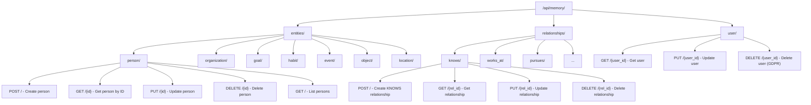

# Entity Management - Solution Architecture

**Version:** 1.0
**Date:** 2025-11-20
**Status:** Active
**Part of:** Fidus Solution Architecture

**References:**
- [Entity-Relationship Model Architecture](../architecture/10-entity-relationship-model.md)
- [Memory Domain Model](../domain-model/15-memory-entity-model.md)
- [ADR-0001: Situational Context as Relationship Qualifier](../adr/ADR-0001-situational-context-as-relationship-qualifier.md)

---

## Overview

This document describes the technical implementation of **Entity Management** in the Fidus Memory system, covering 8 entity types and 9 relationship types.

**Entities:** User, Person, Organization, Goal, Habit, Event, Object, Location, Preference

**Relationships:** KNOWS, WORKS_AT, MEMBER_OF, PURSUES, HAS_HABIT, ATTENDS, OWNS, FREQUENTS, HAS_PREFERENCE

**Core Principle:** **Minimal fixed schema + AI-discovered properties**

---

## Technology Stack

| Component | Technology | Rationale |
|-----------|-----------|-----------|
| **Entity Storage** | Neo4j | Graph database for entity relationships |
| **Entity Extraction** | LLM (via LiteLLM) | AI-driven entity recognition from conversation |
| **Property Discovery** | LLM (via LiteLLM) | AI discovers properties dynamically (no schema constraints!) |
| **Relationship Qualification** | Qdrant (situational context) | Context metadata for relationships |
| **Entity Deduplication** | Embedding similarity (Qdrant) | Fuzzy matching to avoid duplicates |
| **API Layer** | FastAPI | REST API for CRUD operations |

---

## Entity Types Implementation

### 1. User Entity (Aggregate Root)

**Neo4j Schema:**
```cypher
(:User {
  id: uuid,
  tenant_id: uuid,
  email: string,                  # Core property (from auth)
  created_at: datetime,
  updated_at: datetime,

  # User attributes (optional)
  name: string,
  preferred_language: string,     # e.g., "de", "en"
  timezone: string,               # e.g., "Europe/Berlin"
  skills: string[],               # List of skills (Priority 🟢 Low)

  # AI-discovered properties (examples)
  notification_preferences: json,
  active_hours: string[],
  # ... any other properties AI discovers!
})
```

**API Endpoints:**
```
GET    /api/memory/user/{user_id}
PUT    /api/memory/user/{user_id}
DELETE /api/memory/user/{user_id}  # GDPR: Cascade delete all entities
```

**Implementation:**
```python
# packages/api/fidus/memory/entities/user.py

from pydantic import BaseModel
from typing import Optional, List, Dict, Any

class User(BaseModel):
    """User aggregate root."""
    id: str
    tenant_id: str
    email: str
    created_at: str
    updated_at: str

    # Optional core attributes
    name: Optional[str] = None
    preferred_language: Optional[str] = "en"
    timezone: Optional[str] = "UTC"
    skills: List[str] = []

    # AI-discovered properties
    ai_properties: Dict[str, Any] = {}  # Flexible storage for AI-discovered attributes

class UserRepository:
    """Repository for User entity."""

    async def create(self, user: User) -> User:
        """Create user in Neo4j."""
        query = """
        CREATE (u:User {
            id: $id,
            tenant_id: $tenant_id,
            email: $email,
            name: $name,
            preferred_language: $preferred_language,
            timezone: $timezone,
            skills: $skills,
            created_at: datetime(),
            updated_at: datetime()
        })
        RETURN u
        """
        # ... execute query

    async def delete(self, user_id: str, tenant_id: str) -> bool:
        """
        Delete user and CASCADE delete all entities owned by user.
        GDPR Right to Erasure implementation.
        """
        query = """
        MATCH (u:User {id: $user_id, tenant_id: $tenant_id})
        OPTIONAL MATCH (u)-[r]->(entity)
        DETACH DELETE u, entity
        """
        # Also delete from Qdrant: all situations with user_id
        await self.qdrant.delete(
            collection_name="situations",
            points_selector=Filter(
                must=[FieldCondition(key="user_id", match=MatchValue(value=user_id))]
            )
        )
```

---

### 2. Person Entity

**Priority:** 🔴 High

**Neo4j Schema:**
```cypher
(:Person {
  id: uuid,
  tenant_id: uuid,
  name: string,                   # Core property (required)
  created_at: datetime,
  updated_at: datetime,

  # AI-discovered properties (examples, NOT exhaustive!)
  profession: string,             # e.g., "Software Engineer"
  topics: string[],               # e.g., ["tech", "hiking", "photography"]
  communication_style: string,    # e.g., "direct", "diplomatic"
  availability_pattern: string,   # e.g., "weekdays 9-17"
  contact_preferences: json,      # How they prefer to be contacted
  # ... ANY other properties AI discovers!
})
```

**API Endpoints:**
```
POST   /api/memory/entities/person
GET    /api/memory/entities/person/{person_id}
PUT    /api/memory/entities/person/{person_id}
DELETE /api/memory/entities/person/{person_id}
GET    /api/memory/entities/person?user_id={user_id}  # List all persons for user
```

**Implementation:**
```python
# packages/api/fidus/memory/entities/person.py

from pydantic import BaseModel, Field
from typing import Optional, List, Dict, Any

class Person(BaseModel):
    """Person entity."""
    id: str
    tenant_id: str
    name: str                      # Required
    created_at: str
    updated_at: str

    # AI-discovered properties
    ai_properties: Dict[str, Any] = Field(
        default_factory=dict,
        description="Flexible storage for AI-discovered properties"
    )

    @property
    def profession(self) -> Optional[str]:
        return self.ai_properties.get("profession")

    @property
    def topics(self) -> List[str]:
        return self.ai_properties.get("topics", [])

class PersonRepository:
    """Repository for Person entity."""

    async def create(self, person: Person) -> Person:
        """Create person with AI-discovered properties."""
        query = """
        CREATE (p:Person {
            id: $id,
            tenant_id: $tenant_id,
            name: $name,
            created_at: datetime(),
            updated_at: datetime()
        })
        SET p += $ai_properties  # Dynamically add AI-discovered properties!
        RETURN p
        """
        result = await self.neo4j.execute_query(
            query,
            id=person.id,
            tenant_id=person.tenant_id,
            name=person.name,
            ai_properties=person.ai_properties
        )
        return person

    async def update_properties(
        self,
        person_id: str,
        tenant_id: str,
        new_properties: Dict[str, Any]
    ) -> Person:
        """
        Update person with new AI-discovered properties.
        Example: AI learns "Anna ist sehr detailorientiert"
                 → adds {detail_oriented: true}
        """
        query = """
        MATCH (p:Person {id: $person_id, tenant_id: $tenant_id})
        SET p += $new_properties,
            p.updated_at = datetime()
        RETURN p
        """
        # ... execute query
```

**Entity Extraction from Conversation:**
```python
# packages/api/fidus/memory/services/entity_extractor.py

from litellm import completion
import json

class EntityExtractor:
    """Extract entities from conversation using LLM."""

    ENTITY_EXTRACTION_PROMPT = """
    Extract entity information from this conversation.

    Conversation:
    "{conversation}"

    Extract:
    1. Entity type (person, organization, goal, habit, event, object, location)
    2. Entity name/description
    3. Any properties mentioned (FLEXIBLE - you can discover new properties!)

    For a Person entity, you might extract:
    - name (required)
    - profession (if mentioned)
    - topics of interest (if mentioned)
    - communication style (if observed)
    - any other relevant properties

    IMPORTANT: You are NOT limited to predefined properties!
    Discover properties organically from the conversation.

    Return as JSON:
    {{
      "entity_type": "person",
      "name": "Anna Schmidt",
      "properties": {{
        "profession": "Software Engineer",
        "topics": ["tech", "hiking"],
        "communication_style": "direct"
      }}
    }}
    """

    async def extract_person(self, conversation: str) -> Optional[Dict[str, Any]]:
        """Extract Person entity from conversation."""
        response = await completion(
            model="gpt-4o-mini",  # or local model
            messages=[{
                "role": "system",
                "content": self.ENTITY_EXTRACTION_PROMPT.format(conversation=conversation)
            }]
        )

        result = json.loads(response.choices[0].message.content)

        if result["entity_type"] == "person":
            return {
                "name": result["name"],
                "ai_properties": result["properties"]
            }
        return None
```

---

### 3. Organization Entity

**Priority:** 🔴 High

**Neo4j Schema:**
```cypher
(:Organization {
  id: uuid,
  tenant_id: uuid,
  name: string,                   # Core property (required)
  created_at: datetime,
  updated_at: datetime,

  # AI-discovered properties (examples)
  industry: string,               # e.g., "technology", "healthcare"
  size: string,                   # e.g., "startup", "enterprise"
  location: string,               # e.g., "Berlin, Germany"
  culture: string,                # e.g., "remote-first", "hierarchical"
  benefits: string[],             # e.g., ["gym", "flextime"]
  # ... ANY other properties!
})
```

**API Endpoints:**
```
POST   /api/memory/entities/organization
GET    /api/memory/entities/organization/{org_id}
PUT    /api/memory/entities/organization/{org_id}
DELETE /api/memory/entities/organization/{org_id}
```

**Implementation:** Similar to Person entity (flexible AI-discovered properties)

---

### 4. Goal Entity

**Priority:** 🔴 High

**Neo4j Schema:**
```cypher
(:Goal {
  id: uuid,
  tenant_id: uuid,
  description: string,            # Core property (required)
  type: string,                   # Category (AI-categorized, e.g., "health", "career")
  created_at: datetime,
  updated_at: datetime,

  # AI-discovered properties (examples)
  target_value: string,           # e.g., "75kg", "B2 German"
  current_value: string,          # Current progress
  deadline: date,                 # Target completion date
  motivation: string,             # Why this goal matters
  obstacles: string[],            # Identified challenges
  strategies: string[],           # Approaches being used
  milestones: json,               # Sub-goals
  # ... ANY other properties!
})
```

**API Endpoints:**
```
POST   /api/memory/entities/goal
GET    /api/memory/entities/goal/{goal_id}
PUT    /api/memory/entities/goal/{goal_id}
DELETE /api/memory/entities/goal/{goal_id}
PATCH  /api/memory/entities/goal/{goal_id}/progress  # Update progress
```

---

### 5-8. Other Entities (Medium/Low Priority)

**Habit, Event, Object, Location** follow the same pattern:
- Minimal core schema (id, tenant_id, name/description, timestamps)
- AI-discovered properties via `ai_properties` dict
- Standard CRUD API endpoints
- Flexible property updates

**See:** [Memory Domain Model](../domain-model/15-memory-entity-model.md) for complete schemas

---

## Relationship Types Implementation

### Standard Relationship Properties

**ALL relationships have these properties:**

```cypher
[RELATIONSHIP_TYPE {
  relationship_instance_id: uuid,  # Unique ID for this relationship instance
  situation_id: uuid,              # Reference to Qdrant context
  observed_at: datetime,           # When was this relationship observed
  confidence: float,               # AI confidence (0.0-1.0)
  source: string                   # "explicit" | "implicit"
}]
```

---

### 1. KNOWS (User → Person)

**Stable Properties (Neo4j):**
```cypher
[:KNOWS {
  relationship_instance_id: uuid,
  situation_id: uuid,

  # Stable properties (NOT situational!)
  role: string,                    # "colleague", "friend", "family", "mentor"
  relationship_type: string,       # "professional", "personal", "family"
  communication_frequency: string, # "daily", "weekly" (AI-learned pattern)
  topics: string[],                # Shared interests (AI-learned)

  observed_at: datetime,
  confidence: float,
  source: string
}]
```

**Situational Context (Qdrant):**
```python
{
  "context": {
    "emotion": "friendly" | "tense" | "respectful",  # Situational!
    "mood": "collaborative" | "distant",
    "activity": "project_discussion" | "lunch",
    "location": "office" | "cafe",
    "time_of_day": "morning" | "evening",
    # ... AI-discovered situational factors
  }
}
```

**API Endpoint:**
```
POST /api/memory/relationships/knows
{
  "user_id": "user-123",
  "person_id": "person-456",
  "role": "colleague",
  "relationship_type": "professional",
  "context": {
    "emotion": "friendly",
    "activity": "project_discussion",
    "time_of_day": "morning"
  }
}
```

**Implementation:**
```python
# packages/api/fidus/memory/relationships/knows.py

from pydantic import BaseModel
from typing import Dict, Any
from uuid import uuid4

class KnowsRelationship(BaseModel):
    """KNOWS relationship (User → Person)."""
    relationship_instance_id: str
    situation_id: str
    role: str                      # Stable
    relationship_type: str         # Stable
    communication_frequency: str   # Stable (AI-learned)
    topics: List[str] = []         # Stable (AI-learned)
    confidence: float
    source: str

class KnowsRelationshipService:
    """Service for KNOWS relationships."""

    async def create_knows_relationship(
        self,
        user_id: str,
        person_id: str,
        tenant_id: str,
        role: str,
        relationship_type: str,
        context: Dict[str, Any],
        confidence: float = 0.9
    ) -> KnowsRelationship:
        """
        Create KNOWS relationship with situational context.

        Implements Qdrant-first pattern (ADR-0001):
        1. Store context in Qdrant (PRIMARY)
        2. Store relationship in Neo4j (SECONDARY)
        3. Rollback Qdrant on Neo4j failure
        """
        situation_id = str(uuid4())
        relationship_instance_id = str(uuid4())

        # Generate embedding
        embedding = await self.embedding_service.embed_context(context)

        try:
            # 1. Qdrant-Insert (PRIMARY)
            await self.qdrant.upsert(
                collection_name="situations",
                points=[{
                    "id": situation_id,
                    "vector": embedding,
                    "payload": {
                        "tenant_id": tenant_id,
                        "user_id": user_id,
                        "entity_type": "person",
                        "entity_id": person_id,
                        "relationship_type": "KNOWS",
                        "relationship_instance_id": relationship_instance_id,
                        "created_at": datetime.utcnow().isoformat(),
                        "context": context  # Full flexible context!
                    }
                }]
            )

            # 2. Neo4j-Insert (SECONDARY - only reference!)
            query = """
            MATCH (u:User {id: $user_id, tenant_id: $tenant_id})
            MATCH (p:Person {id: $person_id, tenant_id: $tenant_id})
            CREATE (u)-[r:KNOWS {
                relationship_instance_id: $rel_id,
                situation_id: $sit_id,
                role: $role,
                relationship_type: $rel_type,
                communication_frequency: $comm_freq,
                topics: $topics,
                observed_at: datetime(),
                confidence: $conf,
                source: $source
            }]->(p)
            RETURN r
            """

            await self.neo4j.execute_query(
                query,
                user_id=user_id,
                person_id=person_id,
                tenant_id=tenant_id,
                rel_id=relationship_instance_id,
                sit_id=situation_id,
                role=role,
                rel_type=relationship_type,
                comm_freq="unknown",  # Will be AI-learned over time
                topics=[],            # Will be AI-learned over time
                conf=confidence,
                source="explicit"
            )

        except Neo4jException as e:
            # Rollback: Delete from Qdrant
            await self.qdrant.delete(
                collection_name="situations",
                points_selector=[situation_id]
            )
            raise

        return KnowsRelationship(
            relationship_instance_id=relationship_instance_id,
            situation_id=situation_id,
            role=role,
            relationship_type=relationship_type,
            communication_frequency="unknown",
            topics=[],
            confidence=confidence,
            source="explicit"
        )
```

---

### 2. WORKS_AT (User → Organization)

**Stable Properties:**
```cypher
[:WORKS_AT {
  relationship_instance_id: uuid,
  situation_id: uuid,

  role: string,                    # Job title (e.g., "Senior Engineer")
  department: string,
  employment_type: string,         # "full_time", "part_time", "contractor"
  started_at: date,
  satisfaction_level: string,      # Overall (AI-learned, e.g., "high", "medium", "low")

  observed_at: datetime,
  confidence: float,
  source: string
}]
```

**Situational Context (Qdrant):**
```python
{
  "context": {
    "mood": "productive" | "frustrated",  # Situational!
    "stress_level": "high" | "low",
    "activity": "coding" | "meetings",
    "deadline_pressure": "high" | "normal",
    # ... AI-discovered
  }
}
```

---

### 3-9. Other Relationships

**MEMBER_OF, PURSUES, HAS_HABIT, ATTENDS, OWNS, FREQUENTS, HAS_PREFERENCE**

Follow the same pattern:
- Standard properties (relationship_instance_id, situation_id, confidence, etc.)
- Type-specific stable properties (in Neo4j)
- Situational context (in Qdrant)
- Qdrant-first storage pattern

**See:** [Memory Domain Model](../domain-model/15-memory-entity-model.md) for complete relationship specifications

---

## Entity Deduplication Strategy

**Problem:** AI might extract "Anna", "Anna Schmidt", "Anna S." as separate entities

**Solution:** Embedding-based fuzzy matching

```python
# packages/api/fidus/memory/services/entity_deduplicator.py

from qdrant_client import QdrantClient
from qdrant_client.models import Filter, FieldCondition, MatchValue

class EntityDeduplicator:
    """Detect and merge duplicate entities using embeddings."""

    async def find_similar_persons(
        self,
        name: str,
        tenant_id: str,
        threshold: float = 0.85
    ) -> List[str]:
        """
        Find persons with similar names using embedding similarity.

        Example:
        - Input: "Anna Schmidt"
        - Finds: ["Anna S.", "Anna", "A. Schmidt"]
        """
        # Generate embedding for name
        embedding = await self.embedding_service.embed_text(name)

        # Search in "person_names" collection (separate Qdrant collection for names)
        results = await self.qdrant.search(
            collection_name="person_names",
            query_vector=embedding,
            query_filter=Filter(
                must=[
                    FieldCondition(key="tenant_id", match=MatchValue(value=tenant_id))
                ]
            ),
            limit=5,
            score_threshold=threshold  # 0.85 = high similarity
        )

        return [hit.payload["person_id"] for hit in results]

    async def merge_persons(
        self,
        source_person_id: str,
        target_person_id: str,
        tenant_id: str
    ) -> None:
        """
        Merge two person entities.

        Process:
        1. Merge AI-discovered properties (union)
        2. Redirect all relationships from source to target
        3. Delete source person
        4. Update Qdrant: change entity_id in all situations
        """
        # 1. Get both persons
        source = await self.person_repo.get(source_person_id, tenant_id)
        target = await self.person_repo.get(target_person_id, tenant_id)

        # 2. Merge properties (target gets all properties from source)
        merged_properties = {**source.ai_properties, **target.ai_properties}
        await self.person_repo.update_properties(target_person_id, tenant_id, merged_properties)

        # 3. Redirect relationships
        query = """
        MATCH (u:User)-[r]->(p:Person {id: $source_id, tenant_id: $tenant_id})
        MATCH (target:Person {id: $target_id, tenant_id: $tenant_id})
        CREATE (u)-[r2:KNOWS]->(target)
        SET r2 = properties(r)
        DELETE r
        """
        await self.neo4j.execute_query(query, source_id=source_person_id, target_id=target_person_id, tenant_id=tenant_id)

        # 4. Update Qdrant
        # (Qdrant doesn't support updates, so we need to reindex affected situations)
        # This is acceptable since merges are rare

        # 5. Delete source person
        await self.person_repo.delete(source_person_id, tenant_id)
```

---

## API Design

### RESTful API Structure



### API Request/Response Examples

**Create Person:**
```http
POST /api/memory/entities/person
Content-Type: application/json
Authorization: Bearer {token}

{
  "name": "Anna Schmidt",
  "ai_properties": {
    "profession": "Software Engineer",
    "topics": ["tech", "hiking"],
    "communication_style": "direct"
  }
}

Response 201 Created:
{
  "id": "person-uuid",
  "tenant_id": "tenant-1",
  "name": "Anna Schmidt",
  "ai_properties": {
    "profession": "Software Engineer",
    "topics": ["tech", "hiking"],
    "communication_style": "direct"
  },
  "created_at": "2025-11-20T10:00:00Z",
  "updated_at": "2025-11-20T10:00:00Z"
}
```

**Create KNOWS Relationship:**
```http
POST /api/memory/relationships/knows
Content-Type: application/json

{
  "person_id": "person-uuid",
  "role": "colleague",
  "relationship_type": "professional",
  "context": {
    "emotion": "friendly",
    "activity": "project_discussion",
    "time_of_day": "morning",
    "location": "office"
  }
}

Response 201 Created:
{
  "relationship_instance_id": "rel-uuid",
  "situation_id": "sit-uuid",
  "person_id": "person-uuid",
  "role": "colleague",
  "relationship_type": "professional",
  "confidence": 0.9,
  "observed_at": "2025-11-20T10:00:00Z"
}
```

---

## Testing Strategy

### Unit Tests

```python
# tests/unit/memory/test_person_repository.py

import pytest
from fidus.memory.entities.person import PersonRepository, Person

@pytest.mark.asyncio
async def test_create_person_with_ai_properties():
    """Test creating person with AI-discovered properties."""
    repo = PersonRepository(neo4j_driver, qdrant_client)

    person = Person(
        id="person-123",
        tenant_id="tenant-1",
        name="Anna Schmidt",
        created_at="2025-11-20T10:00:00Z",
        updated_at="2025-11-20T10:00:00Z",
        ai_properties={
            "profession": "Software Engineer",
            "topics": ["tech", "hiking"],
            "communication_style": "direct"
        }
    )

    created = await repo.create(person)

    assert created.name == "Anna Schmidt"
    assert created.ai_properties["profession"] == "Software Engineer"

@pytest.mark.asyncio
async def test_update_person_ai_properties():
    """Test updating person with new AI-discovered properties."""
    repo = PersonRepository(neo4j_driver, qdrant_client)

    # AI learns new property: "Anna ist sehr detailorientiert"
    updated = await repo.update_properties(
        person_id="person-123",
        tenant_id="tenant-1",
        new_properties={"detail_oriented": True}
    )

    assert updated.ai_properties["detail_oriented"] is True
```

### Integration Tests

```python
# tests/integration/memory/test_knows_relationship_workflow.py

@pytest.mark.asyncio
async def test_create_knows_relationship_with_context():
    """Test full workflow: Create person + KNOWS relationship + context storage."""

    # 1. Create person
    person = await person_repo.create(Person(name="Anna Schmidt", ...))

    # 2. Create KNOWS relationship with context
    relationship = await knows_service.create_knows_relationship(
        user_id="user-123",
        person_id=person.id,
        tenant_id="tenant-1",
        role="colleague",
        relationship_type="professional",
        context={
            "emotion": "friendly",
            "activity": "project_discussion",
            "time_of_day": "morning"
        }
    )

    # 3. Verify Neo4j relationship
    result = await neo4j.execute_query("""
        MATCH (u:User {id: $user_id})-[r:KNOWS]->(p:Person {id: $person_id})
        RETURN r
    """, user_id="user-123", person_id=person.id)

    assert result[0]["r"]["role"] == "colleague"
    assert result[0]["r"]["situation_id"] == relationship.situation_id

    # 4. Verify Qdrant context
    situations = await qdrant.retrieve(
        collection_name="situations",
        ids=[relationship.situation_id]
    )

    assert situations[0].payload["context"]["emotion"] == "friendly"
    assert situations[0].payload["context"]["activity"] == "project_discussion"
```

---

## Performance Considerations

### Entity Queries

**Optimize Neo4j queries:**
```cypher
# GOOD: Use index on tenant_id + id
CREATE INDEX person_tenant_id FOR (p:Person) ON (p.tenant_id, p.id)

# Query with index
MATCH (p:Person {tenant_id: $tenant_id, id: $person_id})
RETURN p

# BAD: No tenant_id filter (cross-tenant leak risk + slow)
MATCH (p:Person {id: $person_id})
RETURN p
```

### Relationship Queries

**1-Hop pattern (v2.0) is faster:**
```cypher
# v2.0: 1-HOP (FAST)
MATCH (u:User)-[r:KNOWS]->(p:Person)
WHERE r.situation_id IN $situation_ids
RETURN p, r

# v1.0: 2-HOP (SLOW - deprecated!)
MATCH (u:User)-[:HAS_PREFERENCE]->(pref)-[:IN_SITUATION]->(s:Situation)
WHERE s.id IN $situation_ids
RETURN pref
```

---

## Security & Multi-Tenancy

### Tenant Isolation

**ALL queries must filter by `tenant_id`:**

```python
# GOOD
async def get_person(person_id: str, tenant_id: str):
    query = """
    MATCH (p:Person {id: $person_id, tenant_id: $tenant_id})
    RETURN p
    """
    # tenant_id ensures isolation

# BAD (security risk!)
async def get_person(person_id: str):
    query = """
    MATCH (p:Person {id: $person_id})
    RETURN p
    """
    # Missing tenant_id → cross-tenant leak!
```

### GDPR Right to Erasure

**User deletion must CASCADE:**
```python
async def delete_user(user_id: str, tenant_id: str):
    """
    Delete user and ALL associated data.
    GDPR Article 17 implementation.
    """
    # 1. Delete from Neo4j (cascades to entities)
    await neo4j.execute_query("""
        MATCH (u:User {id: $user_id, tenant_id: $tenant_id})
        OPTIONAL MATCH (u)-[r]->(entity)
        DETACH DELETE u, entity
    """, user_id=user_id, tenant_id=tenant_id)

    # 2. Delete from Qdrant (all situations)
    await qdrant.delete(
        collection_name="situations",
        points_selector=Filter(
            must=[
                FieldCondition(key="user_id", match=MatchValue(value=user_id)),
                FieldCondition(key="tenant_id", match=MatchValue(value=tenant_id))
            ]
        )
    )
```

---

## Related Documents

- **[Memory Domain Model](../domain-model/15-memory-entity-model.md)** - DDD specification
- **[Entity-Relationship Model Architecture](../architecture/10-entity-relationship-model.md)** - Architecture overview
- **[Situational Context - Solution Architecture](14-situational-context.md)** - Context storage
- **[ADR-0001](../adr/ADR-0001-situational-context-as-relationship-qualifier.md)** - Qdrant-first pattern

---

**Maintained by:** Memory Team
**Last Updated:** 2025-11-20
**Next Review:** After implementing Person, Organization, Goal entities

---

**End of Document**
