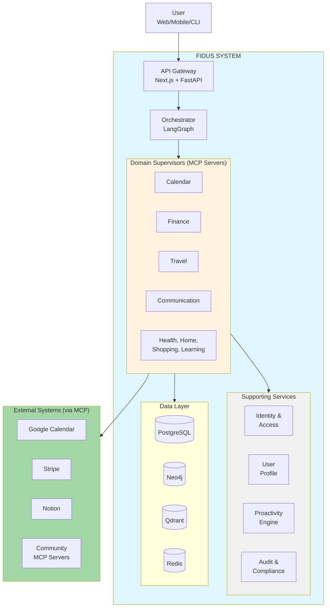

# Fidus Solution Architecture

**Version:** 1.1
**Date:** 2025-11-20
**Status:** Draft (Awaiting Human Review)
**Part of:** Fidus Solution Architecture
**Author:** AI-Generated
**Supersedes:** v1.0 (2025-10-27) - Profile Agent with basic preferences
**Migration:** Added Memory Context Agent v3.0 with full entity/relationship management and Qdrant-first architecture

---

## Overview

This directory contains the **Solution Architecture** for the Fidus system - a detailed technical blueprint that translates the system architecture and domain model into concrete implementation decisions.

The solution architecture bridges the gap between:
- **WHAT** the system does (Domain Model: [../domain-model/](../domain-model/))
- **WHY** it's designed this way (Architecture: [../architecture/](../architecture/))
- **HOW** it's implemented (Solution Architecture: this directory)

---

## Purpose

The solution architecture serves multiple audiences:

| Audience | What They Find Here |
|----------|-------------------|
| **Solution Architects** | Technology decisions, integration patterns, deployment strategies |
| **Senior Developers** | Component architecture, API specifications, data flows |
| **DevOps Engineers** | Deployment scenarios, infrastructure requirements, scaling strategies |
| **Security Engineers** | Security architecture, compliance mechanisms, permission systems |
| **Project Managers** | Evolution strategy, migration paths, quality attributes |

---

## Document Structure

### Core Documents (Read in Order)

1. **[01-executive-summary.md](01-executive-summary.md)**
   - System overview in 3-5 sentences
   - Core architecture decisions at a glance
   - Technology stack summary
   - Deployment options overview
   - **Read this first!**

2. **[02-architecture-principles.md](02-architecture-principles.md)**
   - The 5 Core Principles (NON-NEGOTIABLE)
   - How EACH principle is implemented
   - Architecture decisions that support principles
   - Trade-offs and justifications
   - **Critical for understanding all other decisions!**

3. **[03-component-architecture.md](03-component-architecture.md)** - **Updated v1.1**
   - Detailed breakdown of ALL 14 Bounded Contexts
   - For EACH context: Purpose, Interfaces, Dependencies, Technology
   - Supervisor implementation (LangGraph + MCP)
   - **Memory Context Agent (v3.0)** - Entity & relationship management ⭐ NEW
   - Database schemas (conceptual level)
   - **The heart of the solution!**

### Integration & Communication

4. **[04-integration-architecture.md](04-integration-architecture.md)**
   - MCP Server Integration (HTTP + SSE)
   - Admin-driven Supervisor registration
   - Event Bus (BullMQ + Redis Pub/Sub)
   - External Systems integration (Google Calendar, Stripe, etc.)
   - API Gateway & Authentication flows

5. **[05-data-flows.md](05-data-flows.md)** - **Updated v1.1**
   - User Request Flow (synchronous) - Mermaid
   - Event-Driven Flow (asynchronous) - Mermaid
   - **Memory & Entity Management Flows (v3.0)** - 6 new flows ⭐ NEW
   - Proactivity Detection Flow - Mermaid
   - Cross-Domain Scenarios with concrete examples
   - **Visual guide to system behavior!**

### Technology & Quality

6. **[06-technology-decisions.md](06-technology-decisions.md)**
   - Framework choices (LangGraph, Next.js, FastAPI)
   - LLM strategy (Ollama local + Cloud optional)
   - Database rationale (Qdrant, Neo4j, Redis, PostgreSQL)
   - Language choices (TypeScript, Python)
   - MCP Protocol justification
   - **Trade-offs for EVERY technology!**

7. **[07-security-compliance.md](07-security-compliance.md)**
   - Privacy-First Architecture implementation
   - GDPR Compliance mechanisms
   - EU AI Act compliance (logging, transparency)
   - Tenant Isolation strategy
   - Encryption (at-rest, in-transit)
   - Permission system (Service, Data, LLM permissions)
   - Multi-User / Family Scopes

8. **[08-quality-attributes.md](08-quality-attributes.md)**
   - Performance: How < 2s latency achieved
   - Scalability: Horizontal/vertical scaling strategies
   - Resilience: Error handling, circuit breakers, failover
   - Observability: Logging, monitoring, tracing

### Deployment & Evolution

9. **[09-deployment-scenarios.md](09-deployment-scenarios.md)**
   - Community Edition (Self-Hosted Docker)
   - Cloud Edition (Managed Kubernetes)
   - Enterprise Edition (Hybrid, Air-Gapped)
   - Infrastructure requirements
   - Deployment procedures

10. **[10-evolution-strategy.md](10-evolution-strategy.md)**
    - Adding new Bounded Contexts
    - Deprecating contexts
    - API versioning strategy
    - Backward compatibility
    - Migration patterns

### Review Materials

11. **[11-open-questions.md](11-open-questions.md)**
    - Clarifications needed from architecture
    - Trade-off decisions requiring human input
    - Technical uncertainties
    - Contradictions found (if any)

12. **[12-review-checklist.md](12-review-checklist.md)**
    - All Core Principles implemented? ✓
    - All Bounded Contexts covered? ✓
    - Security & Compliance complete? ✓
    - Deployment scenarios documented? ✓
    - Technology decisions justified? ✓

### Memory & Context (v3.0) ⭐ NEW

13. **[14-situational-context.md](14-situational-context.md)** ⭐ **NEW v2.0**
    - Situational Context as Relationship Qualifier (ADR-0001)
    - Qdrant-First Pattern (PRIMARY context storage)
    - Neo4j relationship properties (SECONDARY reference)
    - Flexible, AI-discovered context factors
    - Embedding-based context similarity
    - **Critical for understanding v3.0 architecture!**

14. **[15-entity-management.md](15-entity-management.md)** ⭐ **NEW v3.0**
    - Complete implementation guide for 8 entity types
    - Implementation guide for 9 relationship types
    - Entity extraction from conversation (LLM-driven)
    - Entity deduplication strategy
    - API design for entity/relationship management
    - Testing strategy & GDPR compliance
    - **Complete v3.0 implementation guide!**

---

## Recommended Reading Order

### For First-Time Readers

1. Start with [01-executive-summary.md](01-executive-summary.md) to get the big picture
2. Read [02-architecture-principles.md](02-architecture-principles.md) to understand the "why"
3. Review [03-component-architecture.md](03-component-architecture.md) for the "what"
4. Check [05-data-flows.md](05-data-flows.md) for visual understanding
5. Dive into specific topics as needed

### For Architects

Read all documents in order (1-12)

### For Developers

1. Executive Summary (01)
2. Architecture Principles (02)
3. Component Architecture (03)
4. Integration Architecture (04)
5. Technology Decisions (06)

### For DevOps Engineers

1. Executive Summary (01)
2. Deployment Scenarios (09)
3. Quality Attributes (08)
4. Integration Architecture (04)

### For Security Engineers

1. Executive Summary (01)
2. Architecture Principles (02) - especially Principle 4 & 5
3. Security & Compliance (07)
4. Integration Architecture (04) - authentication flows

---

## Key Architectural Decisions

### The 5 Core Principles (NON-NEGOTIABLE)

From [../architecture/00-core-principles.md](../architecture/00-core-principles.md):

1. **LLM-Driven Logic** - NO hard-coded business rules
2. **Dynamic Registry** - NO static component lists
3. **Event-Driven Proactivity** - NO synchronous inter-domain communication
4. **Privacy by Design** - Local-first with Ollama, optional cloud
5. **Bounded Context Isolation** - NO shared databases across contexts

These principles drive EVERY decision in this solution architecture.

---

## Technology Stack (Summary)

| Layer | Technology | Rationale |
|-------|-----------|-----------|
| **Frontend** | Next.js 14+ (App Router) | React-based, SSR, modern DX |
| **Backend** | FastAPI (Python) | Async support, OpenAPI, Python ecosystem |
| **Orchestration** | LangGraph | State machines for multi-step reasoning |
| **LLM** | Ollama (local) + Optional Cloud | Privacy-first, user choice |
| **Protocol** | MCP (Model Context Protocol) | Standard for tool integration |
| **Transport** | HTTP + SSE | Real-time events, standard protocols |
| **Event Bus** | BullMQ + Redis | Reliable message delivery |
| **Databases** | PostgreSQL, Neo4j, Qdrant, Redis | Multi-model for different needs |
| **Language** | TypeScript + Python | Type safety, ecosystem |
| **Deployment** | Docker + Kubernetes | Containerized, scalable |

See [06-technology-decisions.md](06-technology-decisions.md) for detailed rationale.

---

## System Context Diagram

---

## Source Documents

This solution architecture is based on:

### Architecture Documentation
- [../architecture/00-core-principles.md](../architecture/00-core-principles.md) - The 5 Core Principles
- [../architecture/01-overview.md](../architecture/01-overview.md) - System overview
- [../architecture/02-supervisor-architecture.md](../architecture/02-supervisor-architecture.md) - Supervisor design
- [../architecture/03-orchestrator-architecture.md](../architecture/03-orchestrator-architecture.md) - Orchestrator design
- [../architecture/04-signals-events-proactivity.md](../architecture/04-signals-events-proactivity.md) - Event-driven architecture
- [../architecture/05-registry-system.md](../architecture/05-registry-system.md) - Dynamic registry
- [../architecture/06-mcp-integration.md](../architecture/06-mcp-integration.md) - MCP protocol integration
- [../architecture/07-user-profiling.md](../architecture/07-user-profiling.md) - User profiling
- [../architecture/09-security-architecture.md](../architecture/09-security-architecture.md) - Security & permissions
- [../architecture/11-compliance-architecture.md](../architecture/11-compliance-architecture.md) - EU AI Act compliance
- [../architecture/decisions.md](../architecture/decisions.md) - Architecture decisions

### Domain Model (DDD)
- [../domain-model/README.md](../domain-model/README.md) - DDD overview
- [../domain-model/01-ubiquitous-language.md](../domain-model/01-ubiquitous-language.md) - Shared vocabulary
- [../domain-model/02-bounded-contexts.md](../domain-model/02-bounded-contexts.md) - 14 Bounded Contexts
- [../domain-model/03-context-map.md](../domain-model/03-context-map.md) - Context relationships
- Domain-specific documents (04-14) - Detailed domain models

---

## Development Status

| Document | Status | Reviewer | Date |
|----------|--------|----------|------|
| README.md | ✅ Updated v1.1 | Pending | 2025-11-20 |
| 01-executive-summary.md | ⏳ In Progress | - | - |
| 02-architecture-principles.md | ⏳ Pending | - | - |
| 03-component-architecture.md | ✅ Updated v1.1 | Pending | 2025-11-20 |
| 04-integration-architecture.md | ⏳ Pending | - | - |
| 05-data-flows.md | ✅ Updated v1.1 | Pending | 2025-11-20 |
| 06-technology-decisions.md | ⏳ Pending | - | - |
| 07-security-compliance.md | ⏳ Pending | - | - |
| 08-quality-attributes.md | ⏳ Pending | - | - |
| 09-deployment-scenarios.md | ⏳ Pending | - | - |
| 10-evolution-strategy.md | ⏳ Pending | - | - |
| 11-open-questions.md | ⏳ Pending | - | - |
| 12-review-checklist.md | ⏳ Pending | - | - |
| **14-situational-context.md** | ✅ **NEW v2.0** | Pending | 2025-11-20 |
| **15-entity-management.md** | ✅ **NEW v3.0** | Pending | 2025-11-20 |

---

## Version History

- **v1.1 (2025-11-20):** Memory Context Agent v3.0 - BREAKING CHANGES
  - **NEW:** [14-situational-context.md](14-situational-context.md) - v2.0 with Qdrant-first pattern
  - **NEW:** [15-entity-management.md](15-entity-management.md) - Complete entity/relationship implementation guide
  - **UPDATED:** [03-component-architecture.md](03-component-architecture.md) - Memory Context Agent (formerly Profile Agent)
  - **UPDATED:** [05-data-flows.md](05-data-flows.md) - Added 6 new Memory & Entity Management flows
  - **UPDATED:** README.md - Added v3.0 documentation references
  - **Migration:** Profile Agent → Memory Context Agent with 8 entities + 9 relationships
  - **Architecture:** Qdrant-first pattern (PRIMARY) + Neo4j references (SECONDARY)
  - **Based on:** ADR-0001 - Situational Context as Relationship Qualifier

- **v1.0 (2025-10-27):** Initial draft
  - Created document structure
  - Navigation and overview
  - Source document references

---

## Questions or Feedback?

For questions about this solution architecture:
- **GitHub Discussions:** https://github.com/y-core-engineering/fidus/discussions
- **Discord:** https://discord.gg/fidus
- **Email:** dev@fidus.ai

---

**Maintained by:** Core Team
**Last Updated:** 2025-11-20
**Next Review:** After v3.0 implementation & testing

---

**End of README**
