# AI-Driven UI Paradigm

**Version:** 1.0
**Date:** 2025-10-28
**Status:** Draft (Awaiting Human Review)
**Part of:** Fidus UX/UI Design
**Author:** AI-Generated

---

## Overview

Fidus implements a **fundamentally different UI paradigm** than traditional applications. Instead of fixed screens and predetermined flows, Fidus uses an **AI-Driven UI** where the LLM dynamically decides what interface to present based on context.

This document explains the paradigm shift, its principles, and why it differs from conventional UI design.

---

## The Paradigm Shift

### Traditional UI (What Fidus Is NOT)


**Problems with Traditional UI:**
- **Rigid Structure:** User must navigate to "Calendar Screen" even for quick check
- **Static Content:** Dashboard shows same widgets regardless of context
- **Predetermined Flows:** App dictates "Step 1, Step 2, Step 3"
- **User Must Seek:** User navigates to features instead of features coming to user
- **Hardcoded Logic:** "Morning = show weather" coded in JavaScript

---

### AI-Driven UI (What Fidus IS)

```mermaid
graph TB
    User[User Context] --> LLM{LLM<br/>Analyzes Context}

    LLM --> Decides{What UI Form?}

    Decides -->|Complex input| Form[Dynamic Form]
    Decides -->|Simple query| Chat[Chat Response]
    Decides -->|Visual data| Widget[Interactive Widget]
    Decides -->|Multiple steps| Wizard[Conversational Wizard]

    Form --> Rendered[UI Rendered]
    Chat --> Rendered
    Widget --> Rendered
    Wizard --> Rendered

    Rendered --> UserAction{User Action}
    UserAction -->|Swipe/X| Dismiss[Card Dismissed]
    UserAction -->|Interact| Continue[Interaction Continues]

    style LLM fill:#90ee90
    style Decides fill:#90ee90
    style Rendered fill:#90ee90

    Note[✅ Context-driven<br/>✅ LLM decides form<br/>✅ Situational rendering<br/>✅ User controls visibility]

    style Note fill:#99ff99,stroke:#00cc00
```



**Advantages of AI-Driven UI:**
- **Contextually Adaptive:** Interface changes based on situation
- **LLM-Orchestrated:** AI decides optimal UI form (form vs. chat vs. widget)
- **Nothing Predetermined:** Same query can render differently based on context
- **User Empowered:** User dismisses cards (swipe/X), no auto-hide
- **Intelligent Surfacing:** Opportunities appear when relevant

---

## Core Principle: Context-Driven UI Rendering

### Principle Statement

**The LLM analyzes user context and decides the optimal UI form. The same user intent can result in different interfaces based on situation.**

### Example: "Show my budget"

**Context 1: User has stable spending, mid-month**


**Result:** Simple chat text response (no need for complex UI)

---

**Context 2: User exceeded budget, end of month**

```mermaid
graph TB
    User[User: Show my budget] --> LLM{LLM Analyzes}
    LLM --> Decision[Needs attention + action]
    Decision --> Widget[Budget Widget Card]

    subgraph WidgetContent[Embedded Widget in Chat]
        Chart[Bar Chart: Food 120%, Transport 95%]
        Alert[⚠️ Food budget exceeded by 100 EUR]
        Actions[View Transactions or Adjust Budget]
    end

    Widget --> WidgetContent

    style Widget fill:#ef9a9a
    style Alert fill:#ff9999
```



**Result:** Interactive widget with chart, warning, and action buttons

---

**Context 3: User planning major expense**

```mermaid
graph TB
    User[User: Show my budget] --> LLM{LLM Analyzes}
    LLM --> Decision[Planning scenario detected]
    Decision --> Form[Budget Planning Form]

    subgraph FormContent[Dynamic Form in Chat]
        Input1[Current spending: auto-filled]
        Input2[Planned expense: input field]
        Input3[Duration: dropdown]
        Suggestion[💡 Suggested: Reduce dining by 30%]
        Submit[Calculate Impact]
    end

    Form --> FormContent

    style Form fill:#ffcc80
    style Suggestion fill:#ffffcc
```



**Result:** Form for budget planning with smart defaults

---

### Key Insight

**The SAME user query ("show my budget") produced THREE different UIs based on context:**

| Context | LLM Decision | UI Form | Reasoning |
|---------|--------------|---------|-----------|
| Normal spending | Simple text | Chat response | No action needed, quick info |
| Budget exceeded | Visual + actions | Widget card | Needs attention, user should act |
| Planning expense | Structured input | Dynamic form | Complex scenario, multiple parameters |

**This is what "Context-Driven UI Rendering" means.**

---

## Core Principle: Dashboard as Opportunity Surface

### Principle Statement

**The dashboard is NOT a collection of static widgets. It's a dynamic "Opportunity Surface" that shows contextually relevant cards based on time, location, user history, and supervisor signals.**

### Anti-Pattern: Static Dashboard

```mermaid
graph TB
    subgraph StaticDashboard[Traditional Dashboard - WRONG]
        W1[Weather Widget<br/>Always visible]
        W2[Calendar Widget<br/>Always visible]
        W3[Budget Widget<br/>Always visible]
        W4[News Widget<br/>Always visible]
    end

    style StaticDashboard fill:#e57373,stroke:#cc0000

    Problem[❌ Same widgets all day<br/>❌ Hardcoded in JavaScript<br/>❌ User must ignore irrelevant ones<br/>❌ Cluttered interface]

    style Problem fill:#ff9999
```



---

### Fidus Approach: Opportunity Surface


---

### Example: Morning (7 AM)

**Context:**
- Time: 7:00 AM
- User just opened app
- Meeting at 9:00 AM (no alarm set)
- Raining outside
- Flight to Paris tomorrow

**LLM Analysis:**

```typescript
// Pseudo-code (concept, not implementation)
const signals = [
  { type: 'WEATHER', relevance: 0.9, data: 'Raining' },
  { type: 'MISSING_ALARM', relevance: 0.95, data: 'Meeting in 2h, no alarm' },
  { type: 'CHECK_IN_AVAILABLE', relevance: 0.8, data: 'Flight tomorrow' },
  { type: 'BUDGET_WARNING', relevance: 0.6, data: 'Food 90%' },
  { type: 'NEWS', relevance: 0.3, data: 'Tech headlines' }
];

// LLM decides threshold: Show only if relevance > 0.75
const cardsToShow = signals.filter(s => s.relevance > 0.75);
```

**Dashboard Shows:**



```mermaid
graph TB
    subgraph Dashboard[Opportunity Surface - 7 AM]
        Card1[⚠️ URGENT: No alarm set<br/>Meeting in 2 hours<br/>Set Alarm or Reschedule]

        Card2[☔ Weather Alert<br/>Heavy rain until 10 AM<br/>Add Umbrella Reminder]

        Card3[✈️ Travel Reminder<br/>Flight tomorrow 2 PM<br/>Check-in now available<br/>Check In or View Trip]
    end

    style Card1 fill:#e57373,stroke:#cc0000
    style Card2 fill:#64b5f6
    style Card3 fill:#fff176
    style Dashboard fill:#e0e0e0
```

**Cards NOT shown:**
- Budget warning (0.6 relevance - not urgent now)
- News (0.3 relevance - can read anytime)

---

### Example: Evening (8 PM)

**Context:**
- Time: 8:00 PM
- User just finished work
- No urgent appointments tomorrow
- Budget exceeded today
- Flight tomorrow (same trip)

**Dashboard Shows:**



```mermaid
graph TB
    subgraph Dashboard[Opportunity Surface - 8 PM]
        Card1[📊 Day Summary<br/>3 meetings completed<br/>5 emails sent<br/>View Details]

        Card2[💰 Budget Alert<br/>Food budget: 120% - 50 EUR over<br/>View Transactions or Adjust Budget]

        Card3[🛫 Tomorrow Preview<br/>Flight at 2 PM - Berlin Tegel<br/>Hotel: Hilton, check-in 4 PM<br/>View Itinerary]
    end

    style Card1 fill:#a5d6a7
    style Card2 fill:#ef9a9a
    style Card3 fill:#90caf9
    style Dashboard fill:#e0e0e0
```

**Key Differences from Morning:**
- **No weather card** (evening, not going out soon)
- **Budget card NOW shows** (evening = budget review time)
- **Day summary appears** (end of workday context)
- **Travel card still there** (flight tomorrow still relevant)

---

### Key Insight

**The dashboard is NOT hardcoded. LLM decides based on context:**


**NO JavaScript code says "if time = morning, show weather".**

**LLM analyzes context and decides relevance.**

---

## Core Principle: User Controls Visibility

### Principle Statement

**Users dismiss Opportunity Cards explicitly (swipe or X button). Dashboard cards NEVER auto-hide after a timeout. Dashboard is always accessible.**

### Important Distinction: Dashboard Cards vs OS Notifications

Fidus uses two types of notifications with different dismissal behavior:

| Type | Location | Auto-Dismiss? | Why? |
|------|----------|---------------|------|
| **Opportunity Cards** | Dashboard (Opportunity Surface) | ❌ NEVER | User must explicitly swipe/click X. Cards persist until user decides to dismiss. |
| **OS Notifications** | Desktop toast / Mobile push | ✅ YES (per OS defaults) | Ephemeral alerts that follow platform conventions (typically 5-10 seconds). Not part of the Opportunity Surface. |

**Rule:** Dashboard Opportunity Cards are **persistent** and **user-controlled**. OS-level notifications (toasts/push) follow **platform defaults** and may auto-dismiss.

**Example:**
- Budget exceeded → Shows as Opportunity Card on Dashboard (stays until user dismisses)
- Budget exceeded → Also sends OS notification toast (auto-dismisses per OS defaults)
- User can click toast to jump to Dashboard card, which persists

### Anti-Pattern: Auto-Hide Dashboard Cards


**Problems with auto-dismissing Dashboard Cards:**
- User might be temporarily distracted (in meeting, on call, etc.)
- Important info disappears before user reads it
- System assumes "no action = not important"
- User has no control over what stays visible
- Violates accessibility guidelines (WCAG 2.2.1 - Timing Adjustable)

---

### Fidus Approach: User-Controlled Dismissal

```mermaid
sequenceDiagram
    participant System
    participant Card
    participant User

    System->>Card: Display opportunity card
    Note over Card: Card stays visible

    alt User Swipes Card Away
        User->>Card: Swipe left/right
        Card->>System: Dismissed by user
        Note over System: Learn: User not interested
    else User Clicks X Button
        User->>Card: Click X
        Card->>System: Dismissed by user
        Note over System: Learn: User acknowledged
    else User Ignores
        Note over Card: Card remains visible
        Note over System: No auto-hide
        User->>Card: Interacts later (after 5 minutes)
        Card->>System: User engaged
    end

    rect rgba(0, 255, 0, 0.1)
    Note over System,User: ✅ User controls visibility
    end
```



**Advantages:**
- **User decides** when to dismiss
- **Card stays** until user acts
- **No missed info** due to timeout
- **System learns** from user's dismissal behavior

---

### Dismissal Mechanisms


---

### Dashboard Access


**Key Points:**
- Dashboard is **always accessible** (swipe down from anywhere)
- User can **open and close** at will
- No modal lock-in (tap outside to dismiss)
- Cards remain on dashboard **until user dismisses them**

---

## Core Principle: Nothing Predetermined

### Principle Statement

**We design EXAMPLES, not RULES. The LLM decides based on context. Our design shows "In situation X, system MIGHT show Y" - not "system MUST show Y".**

### Example: "Morning Shows Weather"

**❌ WRONG (Hardcoded Rule):**

```javascript
// Bad - predetermined logic
if (time >= 6 && time <= 9 && location === 'home') {
  dashboard.show(WeatherWidget);
}
```

**Problem:** This is a RULE coded in JavaScript. It will ALWAYS show weather between 6-9 AM at home, even if:
- User is indoors all day (weather irrelevant)
- It's sunny and clear (no weather alerts)
- User is sick and not leaving home

---

**✅ CORRECT (LLM Decides):**

```typescript
// Good - LLM analyzes context
const context = {
  time: '7:00 AM',
  location: 'home',
  weather: { condition: 'raining', temperature: 10 },
  calendar: [{ time: '9:00 AM', location: 'office', distance: 5km }],
  userHistory: { typicalLeaveTime: '8:15 AM', hasUmbrella: false }
};

const llmPrompt = `
Given user context:
${JSON.stringify(context)}

Evaluate relevance of showing weather card.
Consider:
- Is user going outside soon?
- Is weather condition notable?
- Does user need to take action (umbrella, jacket)?

Return relevance score (0.0 - 1.0) and reasoning.
`;

const result = await llm.analyze(llmPrompt);
// result.relevance: 0.92
// result.reasoning: "User has meeting in 2h, 5km away, raining, no umbrella"

if (result.relevance > 0.75) {
  dashboard.showCard({
    type: 'WEATHER',
    content: generateWeatherCard(context),
    reasoning: result.reasoning
  });
}
```

**Advantages:**
- **Flexible:** System adapts to user's actual situation
- **Intelligent:** Considers multiple factors
- **Explainable:** User can see WHY card was shown
- **Evolvable:** Improve prompt without code changes

---

### Design Examples vs. Design Rules

**When designing, we show EXAMPLES:**

| ❌ Don't Say (Rule) | ✅ Say (Example) |
|---------------------|------------------|
| "Morning dashboard shows weather" | "In the morning, if user has outdoor activity soon and weather is notable, system MIGHT show weather card (example relevance: 0.9)" |
| "Budget exceeded triggers alert" | "When budget exceeded AND near end of billing period AND user actively spending, system MIGHT show budget alert (example relevance: 0.85)" |
| "Travel card appears 24h before departure" | "As departure approaches AND user hasn't checked in AND no hotel booking, system MIGHT show travel reminder (example relevance varies 0.6-0.95)" |

---

### Example: Budget Alert

**Scenario 1: Budget 95%, Day 28 of Month**

```mermaid
graph LR
    Context1[Budget: 95%<br/>Day: 28<br/>Active spending: Yes] -->|LLM| High[Relevance: 0.9<br/>SHOW CARD]

    High --> Card1[💰 Budget Alert<br/>Food: 475 EUR / 500 EUR<br/>5 days left in month<br/>View or Adjust]

    style High fill:#e57373
    style Card1 fill:#ef9a9a
```



**LLM Reasoning:** "User is 95% through budget with 5 days left. High likelihood of exceeding. User actively spending (transaction 2h ago). **Show alert now.**"

---

**Scenario 2: Budget 95%, Day 5 of Month**


**LLM Reasoning:** "Budget 95% but only day 5 of month. Likely a large planned expense (rent/insurance). Not concerning. **Don't show alert.**"

---

**Key Insight:**

**Same metric (95% budget) → Different decisions based on context.**

**NO rule can capture this nuance. LLM evaluates situation.**

---

## How This Differs from Traditional UI

### Traditional UI Design Process


**Characteristics:**
- Designer defines every screen upfront
- Developer codes exact flows
- Navigation is fixed (sidebar, tabs, etc.)
- User must follow predetermined paths
- Changes require redesign + redevelopment

---

### AI-Driven UI Design Process (Fidus)

```mermaid
graph TD
    Research[User Research] --> Contexts[Define Contexts<br/>Not Screens!]
    Contexts --> Principles[Define UI Principles<br/>Not Wireframes!]
    Principles --> Examples[Show Example Situations<br/>Not Fixed Designs!]
    Examples --> Components[Design Reusable Components<br/>Context-Independent]
    Components --> Prompts[Write LLM Prompts<br/>For UI Decisions]
    Prompts --> Dev[Developers Implement]

    Dev --> System[LLM-Driven System:<br/>Context → LLM → UI Form]

    System --> Adapt[System Adapts<br/>Without Code Changes]

    style System fill:#81c784
    style Adapt fill:#90ee90

    Note[Result: Contextual UI,<br/>adaptive rendering,<br/>no hardcoded flows]

    style Note fill:#99ff99
```



**Characteristics:**
- Designer defines **principles** and **examples**, not screens
- Developer builds **context-adaptive** system
- LLM decides UI form at runtime
- User gets interface tailored to situation
- Changes require prompt updates (no code changes)

---

### Comparison Table

| Aspect | Traditional UI | AI-Driven UI (Fidus) |
|--------|----------------|----------------------|
| **Screens** | Fixed screens (Dashboard, Calendar, Settings) | Situational interfaces (context-driven) |
| **Navigation** | Static sidebar/tabs | Dynamic opportunity surface |
| **Flows** | Predetermined (Step 1 → Step 2 → Step 3) | LLM decides (form vs. wizard vs. chat) |
| **Content** | Hardcoded ("show weather if morning") | LLM analyzes ("show if relevant") |
| **Dismissal** | OS notifications auto-hide after timeout | Dashboard cards: User swipes/clicks X (never auto-hide) |
| **Dashboard** | Static widgets | Opportunity surface (changes all day) |
| **Design Artifacts** | Wireframes for every screen | Examples + principles + component library |
| **Developer Work** | Implement exact screens | Build context-adaptive system |
| **Changes** | Redesign + redevelop | Update prompts (no code changes) |
| **User Experience** | Rigid, user navigates to features | Adaptive, features come to user |

---

## Implications for Design

### What Designers Must Deliver

**Traditional UI Design:**
- Wireframes for every screen
- Fixed navigation structure
- Exact user flows (step-by-step)
- Pixel-perfect mockups

**AI-Driven UI Design (Fidus):**
- **Principles:** Context-Driven, LLM-Orchestrated, User-Controlled
- **Examples:** "In situation X, system might show Y" (not rules!)
- **Component Library:** Reusable components (context-independent)
- **Context Definitions:** What factors affect UI decisions?
- **Prompt Guidelines:** How should LLM evaluate relevance?

---

### Example: Designing Budget Feature

**Traditional Approach:**

1. Design "Budget Screen" with fixed layout
2. Define when to navigate to it (user clicks "Finance" → "Budgets")
3. Show alert if budget > 90% (hardcoded rule)
4. Developer implements exact flow

**AI-Driven Approach (Fidus):**

1. **Define Contexts:**
   - Budget normal, mid-month
   - Budget exceeded, end of month
   - Planning major expense

2. **Show Examples:**
   - Context 1 → Chat response (text only)
   - Context 2 → Warning card with chart
   - Context 3 → Planning form with suggestions

3. **Design Components:**
   - Budget chart component (reusable)
   - Budget alert card (reusable)
   - Budget planning form (reusable)

4. **Write Prompt Guidelines:**
   ```
   Evaluate budget alert relevance:
   - High: Budget > 90% AND < 5 days left in period
   - Medium: Budget > 80% AND unusual spending pattern
   - Low: Budget normal OR early in period
   ```

5. **Developer Implements:**
   - LLM evaluates context → decides UI form
   - System renders appropriate component
   - User dismisses when done

---

## Key Takeaways

### For Designers

1. **Think in Contexts, Not Screens**
   - Don't design "Calendar Screen"
   - Design "How calendar info appears in different contexts"

2. **Show Examples, Not Rules**
   - Don't say "Dashboard shows X"
   - Say "In situation Y, dashboard MIGHT show X (example)"

3. **Design Components, Not Pages**
   - Components should work anywhere (chat, dashboard, detail view)
   - Context-independent

4. **Embrace Flexibility**
   - LLM will make decisions you didn't anticipate
   - That's the goal!

---

### For Developers

1. **Build Context-Adaptive System**
   - Don't hardcode "if morning, show weather"
   - Pass context to LLM, let it decide

2. **Make Components Reusable**
   - Budget chart works in: chat, dashboard, detail view
   - Don't tie components to specific screens

3. **No Auto-Hide**
   - User dismisses cards (swipe/X)
   - Cards stay until user acts

4. **Dashboard = Dynamic**
   - NOT a collection of fixed widgets
   - LLM populates based on relevance

---

### For Users

1. **Interface Adapts to You**
   - Same query can look different based on context
   - That's intentional!

2. **You Control Visibility**
   - Swipe away cards you don't need
   - Cards stay until you dismiss them
   - Dashboard always accessible (swipe down)

3. **No Fixed Navigation**
   - No need to remember "Finance is in Menu → Reports"
   - Just ask or check opportunity surface

4. **System Learns**
   - If you dismiss a card type often, system shows it less
   - If you engage with a card type, system shows it more

---

## Next Steps

This paradigm is the **foundation** for all UX/UI design in Fidus.

Read next:
1. [01-design-philosophy-principles.md](01-design-philosophy-principles.md) - Design principles aligned with this paradigm
2. [04-interaction-patterns.md](04-interaction-patterns.md) - Concrete interaction patterns
3. [06-contextual-ui-patterns.md](06-contextual-ui-patterns.md) - Situational UI examples

---

**End of Document**
