# Design Philosophy & Principles

**Version:** 1.0
**Date:** 2025-10-28
**Status:** Draft (Awaiting Human Review)
**Part of:** Fidus UX/UI Design
**Author:** AI-Generated

---

## Overview

This document defines the **design philosophy** and **core principles** that guide all UX/UI decisions in Fidus. These principles are derived from the system's architecture and directly shape how users interact with the system.

**Foundation:** These principles align with Fidus's [Core Architecture Principles](../architecture/00-core-principles.md) and the [AI-Driven UI Paradigm](00-ai-driven-ui-paradigm.md).

---

## Design Philosophy

### Trust Through Transparency

**Fidus is a faithful companion, not a black box.**

**Core Values:**

1. **Trustworthy:** User can see what Fidus does with their data
2. **Loyal:** Always on user's side, never working against them
3. **Reliable:** Consistent behavior, predictable outcomes
4. **Discreet:** Privacy-first, minimal data collection

**Derived from:** [Brand Identity](../branding/fidus-brand-identity-en.md)

---

## Core Design Principles

### 1. Contextually Adaptive

**The interface adapts to the user's current context, not the other way around.**

#### Principle Statement

Users should NOT navigate to features. Features should come to users based on context.

#### Rationale

Traditional apps force users to remember where features are ("Finance is in Menu → Reports → Budgets"). Fidus brings relevant information to the user proactively.

**Architecture Foundation:** [LLM-Driven Logic](../architecture/00-core-principles.md#1-llm-driven-logic-over-hard-coded-rules)

---

#### How It Manifests in UI

**Example 1: Morning Context**

```mermaid
graph TB
    Context[User Context:<br/>Morning, leaving for work soon] --> LLM{LLM Analyzes}

    LLM --> Cards[Dashboard Shows]

    subgraph OpportunitySurface[Opportunity Surface]
        C1[☔ Weather: Rain expected<br/>Take umbrella]
        C2[🚗 Traffic Alert<br/>Route to office: +15 min]
        C3[📅 Meeting Soon<br/>Client call at 10 AM]
    end

    Cards --> OpportunitySurface

    style OpportunitySurface fill:#a5d6a7
    style LLM fill:#64b5f6
```

**Not shown:** Budget summary (not relevant right now)

---

**Example 2: Evening Context**

**Not shown:** Weather (evening, not going out)

---

#### Design Implications

**DO:**
- ✅ Design components that can appear anywhere (context-independent)
- ✅ Show examples of context-driven rendering
- ✅ Let LLM decide what to show and when

**DON'T:**
- ❌ Design fixed "screens" with predetermined content
- ❌ Hardcode "morning = weather, evening = summary"
- ❌ Force users to navigate deep menus

---

### 2. LLM-Orchestrated

**The LLM decides the optimal UI form (chat, form, widget, wizard) based on the situation.**

#### Principle Statement

The same user intent can result in different interfaces depending on context. Designers provide components; LLM composes them.

#### Rationale

Traditional UIs have fixed flows ("Click here, then fill this form"). Fidus adapts: sometimes a quick chat answer suffices, sometimes a structured form is better, sometimes a visual widget is optimal.

**Architecture Foundation:** [LLM-Driven Logic](../architecture/00-core-principles.md#1-llm-driven-logic-over-hard-coded-rules)

---

#### How It Manifests in UI

**Example: "Create a budget"**

**Scenario 1: First-Time User (No Budget History)**

---

**Scenario 2: Experienced User (Has Budget History)**

---

**Scenario 3: User Asking for Advice**

```mermaid
graph TB
    User[User: Should I create a new budget?] --> LLM{LLM Analyzes:<br/>Advice needed}

    LLM --> Decision[Conversational wizard<br/>is best]

    Decision --> Wizard[Multi-Step Conversation]

    subgraph WizardUI[Conversational Flow]
        W1[Fidus: What are you trying to manage?]
        W2[User: My food spending is high]
        W3[Fidus: Your avg is 600 EUR. Set limit at 500 EUR?]
        W4[User: Yes]
        W5[Fidus: ✓ Budget created. I'll alert you at 80%.]
    end

    Wizard --> WizardUI

    style Wizard fill:#fff176
```

---

#### Key Insight

**Same intent ("create budget") → THREE different UI forms:**

| User Context | LLM Decision | UI Form | Reasoning |
|--------------|--------------|---------|-----------|
| First-time user | Needs guidance | Form with tips | User unfamiliar with budgeting |
| Experienced user | Wants efficiency | Quick form with defaults | User knows what they want |
| Asking for advice | Needs conversation | Conversational wizard | User needs help deciding |

**LLM chooses form type at runtime. Designer provides all three patterns.**

---

#### Design Implications

**DO:**
- ✅ Design multiple interaction patterns for same intent (form, chat, widget, wizard)
- ✅ Create reusable components that work in any context
- ✅ Show examples of when each pattern is appropriate

**DON'T:**
- ❌ Design one "correct" way to do something
- ❌ Assume users always follow same flow
- ❌ Hardcode "budget creation = always show form"

---

### 3. User-Controlled Visibility

**Users explicitly dismiss cards (swipe or X button). No auto-hide. Dashboard always accessible.**

#### Principle Statement

The system suggests; the user decides. Cards stay visible until the user dismisses them.

#### Rationale

Auto-hiding notifications is disrespectful of user attention. If something is important enough to show, it's important enough to let the user decide when to dismiss it.

**Architecture Foundation:** [Proactive Over Reactive](../architecture/00-core-principles.md#5-proactive-over-reactive)

---

#### How It Manifests in UI

**Dismissal Mechanisms:**

---

**Dashboard Access:**

---

#### User Control Examples

**Example 1: Budget Alert Card**

```mermaid
graph LR
    subgraph Card[Budget Alert Card]
        Header[💰 Budget Alert]
        Content[Food: 95% spent<br/>25 EUR left for 3 days]
        X[✕]
        Actions[View Details or Adjust Budget]
    end

    User[User Options] --> Option1[Swipe to dismiss<br/>→ Not interested now]
    User --> Option2[Click X<br/>→ Acknowledged, deal with later]
    User --> Option3[Tap View Details<br/>→ See transactions]
    User --> Option4[Do nothing<br/>→ Card stays, revisit later]

    style Card fill:#ef9a9a
    style Option3 fill:#81c784
    style Option4 fill:#90caf9
```

---

**Example 2: Weather Card**

User sees weather alert in morning but is on a call. Card stays visible. After call (30 minutes later), user reads it and taps "Add umbrella reminder". Card then auto-dismisses (action completed).

**Timeline:**

**Key:** Card visible for **33 minutes** because user was busy. NO auto-hide at 30 seconds.

---

#### Design Implications

**DO:**
- ✅ Always provide X button or swipe gesture for dismissal
- ✅ Make dashboard accessible from anywhere (swipe down)
- ✅ Let cards stay visible indefinitely
- ✅ Auto-dismiss only when user completes an action

**DON'T:**
- ❌ Auto-hide cards after timeout
- ❌ Assume "no action = not important"
- ❌ Force users to find dashboard in menu
- ❌ Remove cards without user consent

---

### 4. Privacy-Transparent

**Users see exactly what Fidus does with their data. Privacy is visible, not hidden.**

#### Principle Statement

Privacy is not a checkbox in settings. It's an active, visible part of the user experience.

#### Rationale

Users distrust black-box AI systems. Showing where data is processed, why, and how builds trust. Transparency is the foundation of privacy.

**Architecture Foundation:** [Privacy-First by Design](../architecture/00-core-principles.md#3-privacy-first-by-design)

---

#### How It Manifests in UI

**Example 1: Local vs. Cloud Processing Indicator**

```mermaid
graph TB
    UserQuery[User: What's my budget status?] --> LLM{LLM Processes}

    LLM --> Local{Processing<br/>Location?}

    Local -->|Local Ollama| LocalBadge[Response + Badge:<br/>🔒 Processed Locally]
    Local -->|Cloud LLM| CloudBadge[Response + Badge:<br/>☁️ Processed via OpenAI]

    LocalBadge --> UserSees1[User sees:<br/>Data stayed on device]
    CloudBadge --> UserSees2[User sees:<br/>Data sent to cloud<br/>Why? button]

    UserSees2 --> Explanation[Explanation Modal:<br/>- Local LLM unavailable<br/>- Sensitive data filtered<br/>- Only query sent, not raw data]

    style LocalBadge fill:#81c784,stroke:#2e7d32
    style CloudBadge fill:#ffd54f,stroke:#f57c00
    style Explanation fill:#90caf9
```

---

**Example 2: Permission Request (Just-in-Time)**

```mermaid
sequenceDiagram
    participant User
    participant Fidus
    participant CalSupervisor as Calendar Supervisor

    User->>Fidus: "Do I have any meetings tomorrow?"
    Fidus->>CalSupervisor: Check calendar
    CalSupervisor->>Fidus: Permission needed: calendar.read

    Fidus->>User: Permission Request Modal

    rect rgba(255, 243, 224, 1)
    Note over User,Fidus: 📅 Calendar Access Needed<br/><br/>Fidus needs to read your calendar<br/>to find meetings tomorrow.<br/><br/>✅ Granted once, always accessible<br/>🔒 Data stays local<br/>❌ Revocable anytime<br/><br/>[Allow] [Deny]
    end

    User->>Fidus: [Allow]
    Fidus->>CalSupervisor: Permission granted
    CalSupervisor-->>Fidus: Tomorrow's meetings
    Fidus->>User: "Yes, 2 meetings: 10 AM and 3 PM"
```

---

**Example 3: Audit Log (User-Accessible)**

```mermaid
graph TB
    User[User Clicks:<br/>Settings → Privacy → Audit Log]

    User --> LogView[Audit Log View]

    subgraph LogUI[Audit Log Interface]
        Filters[Filters:<br/>Date Range, Domain, Action Type]

        subgraph LogEntries[Log Entries]
            E1[Oct 28, 10:15<br/>📅 Calendar: Read events<br/>Reason: User asked for meetings<br/>Data accessed: Tomorrow's events<br/>View Details button]

            E2[Oct 28, 10:10<br/>💰 Finance: Read budget<br/>Reason: Budget alert triggered<br/>Data accessed: Food budget only<br/>View Details button]

            E3[Oct 27, 18:30<br/>☁️ Cloud LLM: Query sent<br/>Reason: Local LLM offline<br/>Data: Anonymized query<br/>View Details button]
        end

        Export[Export as JSON or Delete My Data]
    end

    LogView --> LogUI

    style E3 fill:#ffd54f
    style Export fill:#ef9a9a
```

---

#### Privacy-Transparent Design Patterns

| Pattern | Description | When to Use |
|---------|-------------|-------------|
| **Processing Badge** | Shows where LLM processed request (local/cloud) | On every LLM response |
| **Permission Modal** | Just-in-time permission request with clear purpose | When supervisor needs new data access |
| **Privacy Indicators** | Icons showing data status (🔒 local, ☁️ cloud, 🔐 encrypted) | On cards, forms, settings |
| **Audit Log** | User-accessible log of all system actions | Always available in Settings |
| **Data Map** | Visual diagram of where user data is stored | In onboarding and settings |
| **Revocation Controls** | Easy-to-find buttons to revoke permissions | In Settings → Privacy → Permissions |

---

#### Design Implications

**DO:**
- ✅ Show local vs. cloud processing on every response
- ✅ Request permissions just-in-time (not upfront)
- ✅ Provide clear, accessible audit log
- ✅ Use privacy icons consistently (🔒 ☁️ 🔐)
- ✅ Explain WHY data access is needed

**DON'T:**
- ❌ Hide where data is processed
- ❌ Request blanket permissions upfront
- ❌ Make audit log hard to find
- ❌ Use vague language ("improve experience")
- ❌ Collect data without explanation

---

### 5. Proactively Helpful

**Fidus anticipates needs and acts on them, but never annoyingly.**

#### Principle Statement

The system should provide value before being asked, but always respect user attention. Target: >50% proactive interaction acceptance rate.

#### Rationale

A true personal assistant doesn't wait for commands. But notifications must be valuable, not spammy. If users dismiss most proactive suggestions, the system is failing.

**Architecture Foundation:** [Proactive Over Reactive](../architecture/00-core-principles.md#5-proactive-over-reactive)

---

#### How It Manifests in UI

**Proactive Trigger Example:**

```mermaid
graph TB
    Signals[Supervisor Signals] --> ProactivityEngine{Proactivity Engine<br/>Evaluates}

    subgraph SignalSources[Signal Sources]
        S1[📅 Calendar: Meeting at 9 AM<br/>Location: 5km away]
        S2[⏰ No alarm set]
        S3[🚗 Traffic: Heavy delays]
    end

    SignalSources --> ProactivityEngine

    ProactivityEngine --> Relevance{Relevance<br/>Score?}

    Relevance -->|High: 0.92| Show[Show Proactive Card]
    Relevance -->|Low: 0.45| Suppress[Don't Show<br/>Not valuable enough]

    Show --> Card[⚠️ URGENT: Meeting Soon<br/>Meeting at 9 AM - 50 min<br/>Traffic: +15 min delay<br/>No alarm set<br/><br/>Set Alarm Now or Dismiss]

    style Show fill:#e57373
    style Card fill:#ef9a9a
    style Suppress stroke-dasharray: 5 5
```

**Acceptance Feedback Loop:**

---

#### Proactivity Levels

| Level | Description | Relevance Threshold | Example |
|-------|-------------|---------------------|---------|
| **Urgent** | Requires immediate action | > 0.85 | Meeting in 30 min, no alarm set |
| **Timely** | Time-sensitive but not urgent | 0.70 - 0.85 | Check-in available for tomorrow's flight |
| **Optimization** | Improves user's situation | 0.55 - 0.70 | Budget at 80%, suggest adjusting |
| **Insight** | Interesting but not actionable | 0.40 - 0.55 | Spent 20% less on food this month |

**Only "Urgent" and "Timely" trigger push notifications. Others appear on dashboard only.**

---

#### Design Implications

**DO:**
- ✅ Show relevance score to user (why this is important)
- ✅ Provide clear action buttons (what can user do?)
- ✅ Track acceptance rate (measure proactivity quality)
- ✅ Let users configure proactivity per domain

**DON'T:**
- ❌ Show low-relevance suggestions proactively
- ❌ Push notifications for "Insight" level (dashboard only)
- ❌ Repeat dismissed suggestions immediately
- ❌ Ignore user feedback (dismissal = signal)

---

### 6. Accessible to All

**Fidus must be usable by everyone, regardless of ability.**

#### Principle Statement

Accessibility is not a feature; it's a requirement. WCAG 2.1 AA compliance minimum.

#### Rationale

Privacy and autonomy matter to everyone. If Fidus is only usable by able-bodied users, it fails its mission.

**Standard:** [WCAG 2.1 AA](https://www.w3.org/WAI/WCAG21/quickref/?versions=2.1&levels=aa)

---

#### How It Manifests in UI

**Keyboard Navigation:**

**All interactions must be keyboard-accessible:**
- **Tab:** Move focus between cards and controls
- **Enter:** Activate focused card or button
- **Escape:** Dismiss card or close modal
- **Arrow Keys:** Navigate within card content
- **Space:** Activate buttons

---

**Screen Reader Support:**

**Every card must include:**
- `role="alert"` or `role="status"` (for announcements)
- `aria-label` on all interactive elements
- Alt text for images/icons
- Semantic HTML (`<button>`, `<article>`, etc.)

---

**Color Contrast (WCAG AA):**

| Element | Contrast Ratio | Example |
|---------|----------------|---------|
| **Normal Text** | 4.5:1 minimum | Black (#000) on White (#FFF) = 21:1 ✅ |
| **Large Text** | 3:1 minimum | Yellow (#FFD700) on Black (#000) = 11:1 ✅ |
| **UI Components** | 3:1 minimum | Button border must contrast with background |
| **Focus Indicators** | 3:1 minimum | Blue (#1976D2) on White (#FFF) = 5.4:1 ✅ |

**Brand Colors (from [Brand Identity](../branding/fidus-brand-identity-en.md)) meet WCAG AA:**
- Primary Yellow (#FFD700) on Black (#000): 11:1 ✅
- Black text (#000) on White (#FFF): 21:1 ✅

---

**Focus Indicators:**

**All interactive elements must show focus state:**
- Visible border (2px blue outline)
- Contrast ratio: 3:1 minimum
- No `:focus { outline: none; }` without custom indicator

---

#### Accessibility Checklist

**For Every Component:**
- [ ] Keyboard navigable (Tab, Enter, Escape, Arrows)
- [ ] Screen reader compatible (semantic HTML, ARIA labels)
- [ ] Color contrast WCAG AA compliant
- [ ] Focus indicators visible
- [ ] Alt text for images/icons
- [ ] No time-based auto-hide (user controls dismissal)
- [ ] Error messages announced to screen readers
- [ ] Form labels associated with inputs

**For Proactive Cards:**
- [ ] `role="alert"` for urgent, `role="status"` for non-urgent
- [ ] Swipe gesture has keyboard alternative (Escape key)
- [ ] X button is focusable and activatable via keyboard

---

#### Design Implications

**DO:**
- ✅ Test with keyboard only (no mouse)
- ✅ Test with screen reader (VoiceOver, NVDA)
- ✅ Use semantic HTML (`<button>`, not `
`)
- ✅ Provide alt text for all meaningful images
- ✅ Ensure 4.5:1 contrast for text, 3:1 for UI components

**DON'T:**
- ❌ Rely solely on color to convey meaning
- ❌ Use `outline: none` without custom focus indicator
- ❌ Create keyboard traps (focus must be escapable)
- ❌ Auto-play videos or animations (accessibility issue)
- ❌ Use tiny text (< 16px for body text)

---

## Design Principle Summary

| Principle | What It Means | How It Manifests |
|-----------|---------------|------------------|
| **Contextually Adaptive** | Interface adapts to user context | Dashboard shows relevant cards based on time/location/signals |
| **LLM-Orchestrated** | LLM decides UI form | Same intent → different UI (form vs. chat vs. widget) |
| **User-Controlled** | User decides visibility | Swipe/X to dismiss, no auto-hide, dashboard always accessible |
| **Privacy-Transparent** | User sees data usage | Local/cloud badges, just-in-time permissions, audit log |
| **Proactively Helpful** | Anticipates needs | Shows opportunities before user asks (if relevance > 0.75) |
| **Accessible to All** | Usable by everyone | WCAG 2.1 AA: keyboard nav, screen readers, contrast |

---

## How Principles Work Together

### Example: Budget Alert

```mermaid
graph TB
    Context[Context:<br/>End of month<br/>Budget 95% spent<br/>User has history of exceeding] --> LLM{LLM Analyzes}

    LLM --> Principles[Apply Principles]

    Principles --> P1[1. Contextually Adaptive<br/>→ Show on dashboard now]
    Principles --> P2[2. LLM-Orchestrated<br/>→ Choose widget card format]
    Principles --> P3[3. User-Controlled<br/>→ Let user dismiss when ready]
    Principles --> P4[4. Privacy-Transparent<br/>→ Show 🔒 badge, data local]
    Principles --> P5[5. Proactively Helpful<br/>→ Suggest action: Adjust budget]
    Principles --> P6[6. Accessible<br/>→ Keyboard nav, screen reader support]

    P1 --> Card[Budget Alert Card]
    P2 --> Card
    P3 --> Card
    P4 --> Card
    P5 --> Card
    P6 --> Card

    subgraph CardUI[Budget Alert Card]
        Badge[🔒 Processed Locally]
        Header[💰 Budget Alert]
        Chart[Bar Chart: Food 95%]
        Text[475 EUR / 500 EUR<br/>3 days left in month]
        Actions[View Transactions or Adjust Budget]
        Dismiss[✕]
    end

    Card --> CardUI

    style Card fill:#ef9a9a
    style Badge fill:#81c784
```

**All six principles applied to a single card.**

---

## Next Steps

These principles guide every design decision in Fidus.

Read next:
1. [02-user-personas-journeys.md](02-user-personas-journeys.md) - Who are Fidus users?
2. [04-interaction-patterns.md](04-interaction-patterns.md) - Concrete interaction patterns
3. [05-design-system-components.md](05-design-system-components.md) - Component library

---

**End of Document**
