# User Personas & Journeys

**Version:** 1.0
**Date:** 2025-10-28
**Status:** Draft (Awaiting Human Review)
**Part of:** Fidus UX/UI Design
**Author:** AI-Generated

---

## Overview

This document defines the **user personas** for Fidus and maps their key journeys through the system. Unlike traditional user journeys that show "User clicks X, then Y", these journeys show **Context → System Response** to illustrate the AI-Driven UI paradigm.

**Foundation:** Based on [AI-Driven UI Paradigm](00-ai-driven-ui-paradigm.md) and [Design Principles](01-design-philosophy-principles.md)

---

## Primary Personas

### Persona 1: Sarah - The Busy Professional

**Background:**
- Works 50-60 hours/week
- Travels frequently for client meetings
- Manages tight budgets (work & personal)
- Values privacy highly (uses ProtonMail, Signal)
- Early adopter of productivity tools

**Goals:**
- Never miss important meetings
- Stay on top of finances
- Minimize time spent on admin tasks
- Keep work and personal life separate

**Pain Points with Traditional Apps:**
- Too many apps to check (calendar, email, budget, travel)
- Notifications overwhelming (50+ per day)
- Rigid interfaces (must navigate deep menus)
- Privacy concerns (cloud apps share data)

**Why Fidus?**
- ✅ Local-first (privacy)
- ✅ Proactive (anticipates needs)
- ✅ Contextual (shows what's relevant NOW)
- ✅ Unified (all domains in one place)

---

### Persona 2: Marcus - The Family Organizer

**Background:**
- Manages family calendar (4 people)
- Coordinates school, activities, medical appointments
- Tracks family budget
- Tech enthusiast, self-hosts services
- Values data sovereignty

**Goals:**
- Keep family organized (everyone knows where to be)
- Coordinate shared resources (car, shopping lists)
- Track family expenses
- Teach kids digital privacy

**Pain Points with Traditional Apps:**
- Family calendar on Google (privacy concern)
- Budget apps don't support multi-user
- Kids have access to sensitive data
- No granular permission control

**Why Fidus?**
- ✅ Multi-tenancy (Personal/Family separation)
- ✅ Self-hosted (data sovereignty)
- ✅ Granular permissions (kids see only their calendar)
- ✅ Shared resources (shopping lists, budgets)

---

### Persona 3: Elena - The Privacy Advocate

**Background:**
- Investigative journalist (sensitive sources)
- Uses encrypted everything (Tor, VPN, encrypted email)
- Refuses cloud services
- Runs Linux, self-hosts everything
- GDPR advocate

**Goals:**
- Complete data control (no cloud, ever)
- Source protection (journalistic privilege)
- Transparency (know what AI does with data)
- Audit trail (for legal compliance)

**Pain Points with Traditional Apps:**
- All productivity apps require cloud
- No transparency (black-box AI)
- No audit logs (can't prove data sovereignty)
- Vendor lock-in

**Why Fidus?**
- ✅ 100% local LLM (Ollama)
- ✅ Self-hosted (no cloud dependency)
- ✅ Open-source (can audit code)
- ✅ Transparent (shows every AI decision)
- ✅ Audit log (EU AI Act compliance)

---

### Persona 4: David - The Enterprise Admin

**Background:**
- Manages IT for mid-size company
- Responsible for GDPR compliance
- Evaluates productivity tools
- Needs air-gapped solution (financial sector)
- Budget for enterprise tools

**Goals:**
- Improve employee productivity
- Maintain GDPR/ISO 27001 compliance
- Keep data on-premise (regulatory requirement)
- Centralized admin control (SSO, permissions)

**Pain Points with Traditional Apps:**
- Cloud AI assistants violate compliance
- No air-gapped solutions available
- Per-user licensing expensive
- No fine-grained access control

**Why Fidus?**
- ✅ Enterprise Edition (on-premise)
- ✅ Air-gapped deployment
- ✅ SSO integration (SAML, OAuth)
- ✅ Audit logs (compliance reporting)
- ✅ Admin dashboard (user management)

---

## User Journey: Sarah (Busy Professional)

### Journey 1: Morning Routine

**Context:** Sarah wakes up, opens Fidus on her phone (PWA).

```mermaid
graph TB
    Wake[Sarah wakes up<br/>7:00 AM] --> Open[Opens Fidus PWA]

    Open --> LLM{Fidus Analyzes<br/>Context}

    subgraph Context[Sarah's Context]
        Time[Time: 7:00 AM]
        Location[Location: Home]
        Calendar[Calendar: Client meeting 10 AM, 8km away]
        Weather[Weather: Heavy rain]
        Alarm[No alarm set]
        Travel[Flight to Paris tomorrow]
    end

    Context --> LLM

    LLM --> Dashboard[Shows Opportunity Surface]

    subgraph Cards[Proactive Cards]
        C1[⚠️ URGENT: No alarm set<br/>Meeting in 3h, need to leave by 9:15<br/>• Set Alarm • Reschedule]

        C2[☔ Weather Alert<br/>Heavy rain until 11 AM<br/>Traffic delays expected<br/>• Add Umbrella Reminder]

        C3[✈️ Travel Tomorrow<br/>Flight at 2 PM - Check-in available<br/>Hotel: Confirmation needed<br/>• Check In • View Trip]
    end

    Dashboard --> Cards

    Sarah[Sarah's Actions] --> A1[Taps Set Alarm<br/>→ Alarm set for 8:00 AM]
    Sarah --> A2[Swipes Weather Card<br/>→ Dismissed, umbrella by door]
    Sarah --> A3[Ignores Travel Card<br/>→ Will check in later]

    style C1 fill:#e57373
    style C2 fill:#64b5f6
    style C3 fill:#fff176
    style A1 fill:#81c784
```

**Key Points:**
- **Contextual:** Dashboard shows relevant info based on time, location, calendar
- **Proactive:** System detected missing alarm (user didn't ask)
- **User-Controlled:** Sarah dismisses weather card, ignores travel card (stays visible)
- **Priority:** Urgent card (missing alarm) shown first

---

### Journey 2: Budget Check During Lunch

**Context:** Sarah eating lunch, casually checks budget.

**Key Points:**
- **LLM-Orchestrated:** First query → simple text (sufficient). Follow-up → widget (visual needed)
- **Contextual Adaptation:** Same topic, different UI forms based on information depth
- **Privacy-Transparent:** 🔒 badge shown (processed locally)

---

### Journey 3: Evening - Budget Alert

**Context:** Sarah ate at expensive restaurant. Budget now exceeded.

**Key Points:**
- **Proactive:** System detected budget issue without user asking
- **Contextual:** High relevance because end of month + history of exceeding
- **User-Controlled:** Sarah chooses when to deal with it (card stays until dismissed)
- **Privacy:** Badge shows local processing

---

## User Journey: Marcus (Family Organizer)

### Journey 1: Shared Family Calendar

**Context:** Marcus's partner added a school event. Marcus opens Fidus.

```mermaid
sequenceDiagram
    participant Partner as Partner (Phone)
    participant FamilyCalendar as Family Calendar
    participant Marcus as Marcus (Desktop)
    participant Fidus as Fidus System

    Partner->>FamilyCalendar: Adds event: "Parent-Teacher Meeting<br/>Oct 30, 6 PM"
    FamilyCalendar->>Fidus: Event: AppointmentCreated (Family Tenant)

    Fidus->>Marcus: Push notification (PWA):<br/>"📅 Family calendar updated<br/>Partner added: Parent-Teacher Meeting"

    Marcus->>Fidus: Opens Fidus (clicks notification)

    Fidus->>Marcus: Shows Family Calendar View

    rect rgba(232, 245, 233, 1)
    Note over Marcus,Fidus: Calendar View:<br/>Oct 30, 6 PM: Parent-Teacher Meeting<br/>Added by: Partner<br/>[Add to My Calendar] [Decline]
    end

    Marcus->>Fidus: Taps "Add to My Calendar"
    Fidus->>FamilyCalendar: Syncs to Marcus's personal calendar
    Fidus->>Marcus: "✓ Added to your calendar<br/>Reminder set for 5:30 PM"
```

**Key Points:**
- **Multi-Tenancy:** Family calendar separate from Marcus's personal calendar
- **Shared Resources:** Both partners can add/edit family events
- **Privacy Boundaries:** Marcus can choose to add to personal calendar or not
- **Notifications:** Push notification via PWA

---

### Journey 2: Kids' Permission Boundaries

**Context:** Marcus's 10-year-old son tries to view family budget.

**Key Points:**
- **Granular Permissions:** Kids have restricted access by default
- **Just-in-Time Requests:** Son can request access when needed
- **Parent Control:** Marcus decides what to grant (read vs. write, temporary vs. permanent)
- **Transparent:** System shows who requested, who granted, and when

---

## User Journey: Elena (Privacy Advocate)

### Journey 1: First-Time Setup (Privacy-First Onboarding)

**Context:** Elena installs Fidus Community Edition (self-hosted, local LLM).

**Key Points:**
- **Privacy-First:** LLM choice presented upfront (local recommended)
- **Transparent:** Clear explanation of privacy guarantees
- **No Dark Patterns:** User can skip data import
- **Accessible:** Keyboard navigable (Tab, Enter)

---

### Journey 2: Audit Log Review (Transparency)

**Context:** Elena checks what Fidus did with her data today.

```mermaid
graph TB
    Elena[Elena Opens Fidus] --> Settings[Settings → Privacy → Audit Log]

    Settings --> LogView[Audit Log View]

    subgraph LogUI[Audit Log Interface]
        Filters[Filters:<br/>📅 Today, 📊 All Domains, 🔍 All Actions]

        subgraph Entries[Log Entries]
            E1[14:32 - Calendar Supervisor<br/>Action: Read events<br/>Reason: User asked for tomorrow's schedule<br/>Data accessed: Tomorrow's appointments 3<br/>LLM: Ollama Llama 3.1 8B local<br/>Confidence: 0.92<br/>→ View Full Details]

            E2[14:15 - Finance Supervisor<br/>Action: Read budget<br/>Reason: Budget alert evaluation<br/>Data accessed: Food budget only<br/>LLM: Ollama local<br/>Confidence: 0.88<br/>→ View Full Details]

            E3[09:22 - Proactivity Engine<br/>Action: Evaluated signals<br/>Reason: Morning opportunity detection<br/>Data accessed: Calendar, Location<br/>LLM: Ollama local<br/>Confidence: 0.75<br/>→ View Full Details]
        end

        Export[🔒 Export Log JSON or 🗑️ Delete All Data]
    end

    LogView --> LogUI

    Elena --> Detail[Clicks View Full Details on E1]

    Detail --> FullLog["Full Log Entry:<br/>timestamp: 2025-10-28T14:32:15Z<br/>supervisor: CalendarSupervisor<br/>action: read_events<br/>reason: User query<br/>data_accessed: appointments:tomorrow<br/>llm_model: ollama:llama3.1:8b<br/>processing_location: local<br/>confidence: 0.92"]

    style LogUI fill:#90caf9
    style E3 fill:#81c784
```

**Key Points:**
- **Transparent:** Every AI decision logged
- **Detailed:** User can see exact prompts/responses
- **EU AI Act Compliant:** Audit log mandatory for AI systems
- **User Control:** Export data or delete everything

---

## User Journey: David (Enterprise Admin)

### Journey 1: Onboarding New Employee (SSO)

**Context:** New employee joins company, David sets up Fidus access.

```mermaid
sequenceDiagram
    participant David as David (Admin)
    participant FidusAdmin as Fidus Admin Portal
    participant SSO as Company SSO (SAML)
    participant NewEmployee as New Employee

    David->>FidusAdmin: Logs in (admin account)
    David->>FidusAdmin: Settings → Users → Add User

    rect rgba(227, 242, 253, 1)
    FidusAdmin->>David: Add User Form:<br/>Email: employee@company.com<br/>Role: [Member] (not Admin)<br/>Access: [Calendar, Finance] only<br/><br/>[Create User]
    end

    David->>FidusAdmin: Submits form
    FidusAdmin->>SSO: Provisions user in SSO
    FidusAdmin->>NewEmployee: Email: "Welcome to Fidus<br/>Log in at fidus.company.com"

    NewEmployee->>FidusAdmin: Clicks link → fidus.company.com
    FidusAdmin->>SSO: Redirect to SSO login
    NewEmployee->>SSO: Logs in with company credentials

    SSO-->>FidusAdmin: Auth token + user profile
    FidusAdmin->>NewEmployee: Onboarding flow (simplified for enterprise)

    rect rgba(232, 245, 233, 1)
    Note over NewEmployee,FidusAdmin: Onboarding:<br/>1. Welcome<br/>2. No LLM choice (admin configured Ollama)<br/>3. No privacy settings (enterprise defaults)<br/>4. Import calendar from company Exchange<br/>5. Done
    end

    NewEmployee->>FidusAdmin: Completes onboarding
    FidusAdmin->>NewEmployee: Dashboard with company policies applied
```

**Key Points:**
- **SSO Integration:** No separate password, uses company credentials
- **Role-Based Access:** Admin controls what users can access
- **Simplified Onboarding:** Enterprise users skip LLM/privacy choices (admin decides)
- **Compliance:** All settings enforced by IT policy

---

### Journey 2: Compliance Audit Report

**Context:** David needs to generate compliance report for auditor.

**Key Points:**
- **Compliance:** Ready-made reports for auditors
- **Granular:** All AI decisions logged (EU AI Act)
- **Actionable:** Recommendations for admin
- **Exportable:** JSON for automated processing

---

## Journey Patterns Summary

### Common Journey Patterns

| Pattern | Description | Example |
|---------|-------------|---------|
| **Context → Opportunity Card** | System detects context, shows relevant card on dashboard | Morning → Weather + Meeting reminder |
| **Query → Adaptive UI** | User asks, LLM decides UI form (chat, form, widget) | "Show budget" → text or widget based on detail level |
| **Proactive → User Control** | System suggests, user dismisses when ready | Budget alert stays until user swipes/clicks X |
| **Permission Request → Approval** | Just-in-time permission with clear purpose | Calendar access when user asks for meetings |
| **Event → Notification** | Domain event triggers notification (multi-user) | Partner adds family calendar event |
| **Admin Action → User Impact** | Admin decision immediately affects user experience | Admin grants permission, user sees new data |

---

### Persona-Specific Preferences

| Persona | Privacy Level | LLM Choice | Multi-Tenancy | Key Features |
|---------|--------------|------------|---------------|--------------|
| **Sarah** | Very High | Local (Ollama) | Personal only | Proactivity, travel integration |
| **Marcus** | High | Local (Ollama) | Personal + Family | Shared calendar, granular permissions |
| **Elena** | Extreme | Local only | Personal only | Audit log, no cloud ever, transparency |
| **David** | High (Compliance) | Enterprise policy | Company-wide | SSO, admin controls, compliance reports |

---

## Next Steps

These personas and journeys inform all design decisions.

Read next:
1. [03-information-architecture.md](03-information-architecture.md) - How content is organized
2. [04-interaction-patterns.md](04-interaction-patterns.md) - Concrete interaction patterns for journeys
3. [10-multi-tenancy-ux.md](10-multi-tenancy-ux.md) - Multi-tenancy UX details (for Marcus & David)

---

**End of Document**
