```mermaid
graph TB
    ChatInterface[Chat Interface] --> History[Conversation History]
    ChatInterface --> Input[Input Area]
    ChatInterface --> Suggestions[Smart Suggestions]

    subgraph HistorySection[Conversation History]
        Messages[User queries + Fidus responses]
        EmbeddedUI[Embedded UI elements:<br/>- Widgets<br/>- Forms<br/>- Charts]
        Timestamp[Timestamps + Context badges]
    end

    History --> HistorySection

    subgraph InputSection[Input Area]
        TextInput[Text input field<br/>Placeholder: Ask Fidus anything...]
        VoiceBtn[🎤 Voice input optional]
        AttachBtn[📎 Attach file e.g., receipt]
    end

    Input --> InputSection

    subgraph SuggestionsSection[Smart Suggestions - Above Input]
        S1[Context-aware prompts<br/>Morning: Check my calendar today]
        S2[Based on user history<br/>Common: Show food budget]
        S3[Follow-up to last query<br/>User asked budget → Suggest: View transactions]
    end

    Suggestions --> SuggestionsSection

    style ChatInterface fill:#90caf9
    style EmbeddedUI fill:#fff176
```

# Information Architecture

**Version:** 1.0
**Date:** 2025-10-28
**Status:** Draft (Awaiting Human Review)
**Part of:** Fidus UX/UI Design
**Author:** AI-Generated

---

## Overview

This document defines the **Information Architecture (IA)** for Fidus. Unlike traditional IAs with fixed hierarchies (Home > Calendar > Event), Fidus uses **Contextual Layers** where content appears dynamically based on user context.

**Foundation:** [AI-Driven UI Paradigm](00-ai-driven-ui-paradigm.md) - Nothing is predetermined

---

## Traditional IA vs. Fidus IA

### Traditional Hierarchical IA (What Fidus Is NOT)

---

### Fidus Contextual Layers

```mermaid
graph TB
    subgraph Layer1[Layer 1: Opportunity Surface - Always Accessible]
        Dashboard[Dashboard<br/>Contextual cards based on relevance]
    end

    subgraph Layer2[Layer 2: Conversational Interface - Primary]
        Chat[Chat Interface<br/>Natural language queries]
        Voice[Voice Commands<br/>Optional]
    end

    subgraph Layer3[Layer 3: Situational UI - Appears When Needed]
        Forms[Dynamic Forms<br/>LLM decides when to show]
        Widgets[Interactive Widgets<br/>Embedded in chat/dashboard]
        DetailViews[Detail Views<br/>Full-screen deep dives]
    end

    subgraph Layer4[Layer 4: Settings - Rarely Accessed]
        Privacy[Privacy Controls]
        Integrations[Integrations]
        Account[Account]
    end

    Layer1 <--> Layer2
    Layer2 --> Layer3
    Layer3 --> Layer2
    Layer4 -.-> Layer1

    style Layer1 fill:#a5d6a7
    style Layer2 fill:#90caf9
    style Layer3 fill:#fff176
    style Layer4 fill:#ce93d8

    Note[✅ Contextual layers<br/>✅ Features come to user<br/>✅ No fixed navigation]
    style Note fill:#99ff99
```

---

## Layer 1: Opportunity Surface (Dashboard)

### Purpose

The dashboard is a **dynamic Opportunity Surface** that shows contextually relevant cards. It's NOT a fixed screen with predetermined widgets.

### Access

- **Gesture:** Swipe down from top (anywhere in app)
- **Button:** Dashboard icon in header
- **Keyboard:** `Cmd/Ctrl + D`

### Content

Content changes based on:
- **Time:** Morning vs. evening
- **Location:** Home vs. office vs. traveling
- **User History:** What user typically needs
- **Supervisor Signals:** Budget alerts, appointment reminders, travel notifications

### Structure

---

## Layer 2: Conversational Interface

### Purpose

The primary interaction method. Users ask questions or give commands in natural language.

### Access

- **Always Visible:** Chat button in bottom-right (floating action button)
- **Keyboard:** `Cmd/Ctrl + K` (focus chat input)
- **Voice:** Tap microphone icon (optional)

### Structure

---

## Layer 3: Situational UI

### Purpose

UI elements that appear **dynamically** based on conversation or context. NOT fixed screens.

### Types

#### 1. Dynamic Forms

Forms that LLM decides to show when structured input is more efficient than conversation.

**Example:** User says "Create a budget"

---

#### 2. Interactive Widgets

Visual components embedded in chat or dashboard for rich interactions.

**Example:** Budget status query

```mermaid
graph TB
    Query[User: Show my budget status] --> LLM{LLM Decides}

    LLM --> Decision[Visual representation better]

    Decision --> Widget[Budget Widget in Chat]

    subgraph WidgetUI[Budget Status Widget]
        Header[💰 October Budget Summary]
        Chart[Bar Chart:<br/>Food 90%, Transport 75%, Entertainment 50%]
        Table[Category, Spent, Limit, Remaining<br/>Food, 450€, 500€, 50€<br/>...]
        Actions[View Transactions or Adjust Budgets]
    end

    Widget --> WidgetUI

    style Widget fill:#90caf9
```

---

#### 3. Detail Views

Full-screen views for deep dives into specific data.

**Example:** User taps "View Transactions" from budget widget

---

### Navigation Between Layers

**Key:** Fluid navigation. No fixed "screens". Users flow between layers based on context.

---

## Layer 4: Settings

### Purpose

Infrequently accessed configuration. Deep link from header menu.

### Structure

---

## Bounded Contexts in UI

### How 14 Supervisors Map to UI

**User Never Sees "Supervisors"** - They see:
- **Opportunity Cards** (from Proactivity + Domain Supervisors)
- **Chat Responses** (from Orchestrator → Domain Supervisors)
- **Settings** (from Support Supervisors)

---

## Search & Discovery

### Global Search

**Access:** Search button in header or `Cmd/Ctrl + K`

**Search Scope:**
- **User Data:** Appointments, transactions, trips, messages
- **Actions:** "Create budget", "Schedule meeting", "Plan trip"
- **Settings:** "Change theme", "View audit log"

---

## Content Hierarchy

### Priority Levels

| Level | Description | Example | Visibility |
|-------|-------------|---------|------------|
| **Urgent** | Requires immediate action | Missing alarm for meeting in 2h | Push notification + top of dashboard |
| **Timely** | Time-sensitive, not urgent | Check-in available for tomorrow's flight | Dashboard card |
| **Important** | Valuable but not time-bound | Budget at 90%, 5 days left | Dashboard card (lower priority) |
| **Informational** | Nice to know | Spent 10% less this month vs. last | Dashboard card (lowest) or chat only |
| **Background** | System events | Synced calendar with Google | No UI (audit log only) |

**LLM decides priority** - NOT hardcoded rules.

---

## Multi-Tenancy in IA

### Tenant Switching

```mermaid
graph LR
    User[User] --> ProfileMenu[Profile Menu top-right]

    ProfileMenu --> TenantPicker[Tenant Picker]

    subgraph Tenants[Available Tenants]
        T1[🧑 Personal]
        T2[👨‍👩‍👧‍👦 Family]
        T3[🏢 Company Acme Inc.]
    end

    TenantPicker --> Tenants

    User --> Selects[Selects Family]

    Selects --> Reload[Dashboard Reloads]

    subgraph FamilyDashboard[Family Tenant Dashboard]
        FC1[Family calendar with shared events]
        FC2[Shared shopping list]
        FC3[No personal finance shows]
    end

    Reload --> FamilyDashboard

    style FamilyDashboard fill:#a5d6a7
```

**Key:** Each tenant has independent:
- Dashboard (different opportunity cards)
- Chat history (tenant-scoped conversations)
- Data (no cross-tenant data leak)

---

## Mobile-Specific IA

### Bottom Navigation (Mobile Only)

```mermaid
graph LR
    subgraph BottomNav[Bottom Navigation Bar]
        Nav1[🏠 Dashboard]
        Nav2[💬 Chat]
        Nav3[🔔 Notifications]
        Nav4[⚙️ Settings]
    end

    style BottomNav fill:#90caf9
```

**Rationale:** On mobile, swipe gestures may be harder. Bottom nav provides quick access.

**Desktop:** No bottom nav (gestures and keyboard shortcuts sufficient)

---

## Key Takeaways

### Information Architecture Principles

1. **Contextual Layers Over Fixed Hierarchy**
   - Content organized by relevance, not fixed menu structure

2. **Opportunity Surface Over Dashboard**
   - Dynamic cards based on context, not static widgets

3. **Conversational Primary, GUI Secondary**
   - Chat is main interaction, forms/widgets appear when needed

4. **Settings Minimal**
   - Most config happens implicitly (system learns), not explicit settings

5. **Multi-Tenancy First-Class**
   - Easy tenant switching, independent data per tenant

---

## Next Steps

Read next:
1. [04-interaction-patterns.md](04-interaction-patterns.md) - Concrete interaction patterns
2. [06-contextual-ui-patterns.md](06-contextual-ui-patterns.md) - Situational UI examples
3. [10-multi-tenancy-ux.md](10-multi-tenancy-ux.md) - Multi-tenancy UX details

---

**End of Document**
