# Interaction Patterns

**Version:** 1.0
**Date:** 2025-10-28
**Status:** Current

> **Navigation:** [← Back to Information Architecture](03-information-architecture.md) | [UX/UI README](README.md) | [Next: Design System & Components →](05-design-system-components.md)

---

## Table of Contents

1. [Overview](#1-overview)
2. [Conversational UI as Primary Interface](#2-conversational-ui-as-primary-interface)
3. [Situational & Contextual UI](#3-situational--contextual-ui)
4. [Proactive Notification Patterns](#4-proactive-notification-patterns)
5. [Multi-Step Workflows](#5-multi-step-workflows)
6. [Voice Input Patterns](#6-voice-input-patterns)
7. [Permission Request Patterns](#7-permission-request-patterns)
8. [Error Handling & Recovery](#8-error-handling--recovery)

---

## 1. Overview

### 1.1 Purpose

This document defines the core interaction patterns for Fidus, with a focus on **conversational UI as the primary interface**. Unlike traditional productivity applications that rely on forms, buttons, and menus, Fidus prioritizes natural language conversation supported by **situational UI** that appears dynamically based on context.

### 1.2 Interaction Philosophy

**Core Belief:** The best interface is no interface. Conversation is the most natural form of human communication.


**Design Rationale:**
- **Conversational (Primary):** Natural language is how humans communicate intent
- **Situational UI (Secondary):** Rich interfaces appear when conversation needs visual support
- **Direct Manipulation (Tertiary):** Quick actions for repetitive tasks
- **Traditional UI (Fallback):** Always available for those who prefer clicks over chat

### 1.3 Interaction Principles

**Principle 1: Conversation First, UI Second**
- Every task should be completable via natural language
- UI appears only when it adds value (visualization, complex input)
- UI enhances conversation, doesn't replace it

**Principle 2: Progressive Disclosure in Conversation**
- Start with simple questions, add complexity only if needed
- Don't ask for information Fidus already knows
- Multi-turn dialogue is acceptable for complex tasks

**Principle 3: Situational UI is Ephemeral**
- Contextual UIs appear during conversation, disappear when done
- Not permanent widgets, but temporary conversation aids
- User can dismiss and continue chat-only interaction

**Principle 4: Confidence Drives UI Complexity**
- High confidence → Direct action with confirmation
- Medium confidence → Present options with recommendation
- Low confidence → Ask clarifying questions, show alternatives

---

## 2. Conversational UI as Primary Interface

### 2.1 Chat Interface Design

The chat interface is the **primary entry point** for all interactions:

```mermaid
graph TB
    subgraph ChatInterface["Chat Interface Layout"]
        subgraph Header["Chat Header"]
            Title[💬 Chat with Fidus]
            Context[Current Context: General]
            Minimize[Minimize Button]
        end

        subgraph MessageArea["Message Area (Scrollable)"]
            UserMsg1[User Message<br/>"What's on my calendar today?"]
            FidusResp1[Fidus Response<br/>+ Calendar Card]
            UserMsg2[User Message<br/>"Reschedule the 2pm meeting"]
            FidusResp2[Fidus Response<br/>+ Action Confirmation]
        end

        subgraph InputArea["Input Area (Bottom)"]
            TextField[Text Input:<br/>"Ask Fidus anything..."]
            VoiceBtn[🎤 Voice]
            AttachBtn[📎 Attach]
            SendBtn[↗ Send]
        end

        subgraph Suggestions["Quick Suggestions (Dynamic)"]
            Sug1["Check my calendar"]
            Sug2["How much have I spent?"]
            Sug3["Plan a trip"]
        end
    end

    Header --> MessageArea
    MessageArea --> InputArea
    InputArea --> Suggestions
```

**Design Specifications:**

**Chat Header:**
- Title: "Chat with Fidus" (personalized: "Chat with Fidus, Sarah")
- Current Context: Shows active domain if conversation is domain-specific
- Minimize: Collapses chat to floating button (bottom-right)

**Message Area:**
- Scrollable, infinite history
- User messages: Right-aligned, blue background
- Fidus responses: Left-aligned, light gray background
- Timestamps: Shown on hover or for messages >5 min apart
- Loading state: Animated dots "Fidus is thinking..."

**Input Area:**
- Multi-line text field (expands up to 5 lines, then scrolls)
- Placeholder: "Ask Fidus anything..." (changes based on context)
- Voice button: Opens voice input
- Attach button: Attach files (receipts, photos, documents)
- Send button: Submits message (or Enter key)

**Quick Suggestions:**
- 3-5 suggested actions below input
- Dynamically generated based on:
  - Time of day (morning: "Morning brief", evening: "Tomorrow's schedule")
  - Recent activity (just added expense: "View budget", booked flight: "Find hotels")
  - Proactive opportunities ("Budget alert: Review spending")

**Accessibility:**
- Keyboard navigation: Tab through interface, Enter to send
- Screen reader: Announces new Fidus messages
- High contrast: User messages #1976D2, Fidus messages #E0E0E0
- Focus indicators: 2px blue outline on focused element

---

### 2.2 Conversational Patterns

#### Pattern 1: Intent Detection & Routing

```mermaid
sequenceDiagram
    participant U as User
    participant Chat as Chat UI
    participant Orch as Orchestrator
    participant Cal as Calendar Supervisor
    participant Fin as Finance Supervisor

    U->>Chat: "How much have I spent<br/>on restaurants this month?"
    Chat->>Orch: Parse intent
    Note over Orch: LLM detects:<br/>Finance domain<br/>+ Query: spending<br/>+ Filter: restaurants, this month

    Orch->>Fin: Routes to Finance
    Fin->>Orch: Returns: €450 spent
    Orch->>Chat: Formats response
    Chat->>U: "You've spent €450 on<br/>restaurants this month<br/>(90% of your €500 budget)"

    Note over Chat: Situational UI triggered:<br/>Budget card appears
```

**Key Features:**
- **Implicit Routing:** User doesn't need to say "Finance, show me..."
- **Context Extraction:** LLM extracts filters (restaurants, this month)
- **Intelligent Response:** Adds context (90% of budget) without being asked
- **UI Enhancement:** Situational budget card appears (see section 3)

#### Pattern 2: Clarifying Questions

When intent is ambiguous, Fidus asks clarifying questions:

```mermaid
sequenceDiagram
    participant U as User
    participant F as Fidus

    U->>F: "Schedule a meeting tomorrow"
    F->>U: "Got it! A few quick questions:<br/>• What time? (Morning, afternoon, specific time?)<br/>• How long? (30 min, 1 hour?)<br/>• Who should attend?"

    U->>F: "2pm, 1 hour, with Maria and Jonas"
    F->>U: "Perfect! Let me check availability..."

    Note over F: Checks Calendar

    F->>U: "2pm works for everyone.<br/>Should I book it?"

    U->>F: "Yes"
    F->>U: "Done! Meeting created for<br/>tomorrow 2:00-3:00 PM.<br/>Invites sent to Maria and Jonas."
```

**Clarification Strategy:**
- Ask **essential questions** only (what's required to complete task)
- Offer **common defaults** in questions ("Morning, afternoon")
- Allow **partial answers** ("2pm with Maria" → still asks "How long?")
- Provide **quick options** alongside open-ended input

**Example Clarification UI:**

```
User: "Schedule a meeting tomorrow"

Fidus: I'll help you schedule that meeting! Just need a few details:

+-------------------------------------+
| What time?                          |
| [ Morning ] [ Afternoon ] [Specific]|
|                                     |
| How long?                           |
| [ 30 min ] [ 1 hour ] [ 2 hours ]  |
|                                     |
| Who should attend?                  |
| [Type names or select from list]   |
|                                     |
|        [Skip] [Create Meeting]     |
+-------------------------------------+
```

**Design Rationale:**
- Visual form appears inline in chat (situational UI)
- Buttons for common choices reduce typing
- Still allows text input ("2pm" instead of clicking)
- Form is dismissible (user can continue with text)

#### Pattern 3: Confirmation & Undo

Before executing actions with consequences, Fidus confirms:

```mermaid
graph TB
    UserIntent["User: 'Delete all transactions<br/>from last month'"]

    FidusConfirm["Fidus: 'This will permanently delete<br/>47 transactions from September.<br/>This cannot be undone.<br/><br/>Are you sure?'"]

    UserConfirms["User: 'Yes, delete them'"]

    FidusAction["Fidus: Executes deletion"]

    FidusUndo["Fidus: 'Done! Deleted 47 transactions.<br/><br/>→ Undo within 30 seconds"]

    UserIntent --> FidusConfirm
    FidusConfirm --> UserConfirms
    UserConfirms --> FidusAction
    FidusAction --> FidusUndo
```

**Confirmation Rules:**

| Action Type | Confirmation Required | Undo Available |
|-------------|----------------------|----------------|
| **Destructive** (delete, cancel) | ✅ Always | ✅ 30-second window |
| **Irreversible** (send email, book flight) | ✅ Always | ❌ No undo |
| **Reversible** (create event, add expense) | ⚠️ Only if ambiguous | ✅ 5-minute window |
| **Read-only** (view calendar, check budget) | ❌ Never | N/A |

**Undo Pattern:**

```
Fidus: Done! Meeting scheduled for tomorrow 2pm.

[ Undo ] ← Clickable for 5 minutes
```

**Design Rationale:**
- Undo button appears immediately after action
- Time-limited (5 min for reversible, 30 sec for destructive)
- After timeout, undo button grays out and shows "Too late to undo"
- Accidental actions are easily recovered

#### Pattern 4: Multi-Turn Dialogues

Complex tasks span multiple conversational turns:

**Example: Trip Planning (10+ turns)**

```
User: "Plan a trip to Barcelona"

Fidus: "I'd love to help! When are you thinking of going?"

User: "First week of December"

Fidus: "Great! I found flights:
• Dec 1-7: €289 (direct, Lufthansa)
• Dec 2-8: €245 (1 stop, Ryanair)

Which works better?"

User: "The direct flight"

Fidus: "Perfect! Now for accommodation, what's your preference?
• Hotel (€80-150/night)
• Airbnb (€50-100/night)"

User: "Airbnb with workspace"

Fidus: "Got it. I found 3 options with dedicated workspace:
[Situational UI: Airbnb cards appear]

Which one?"

User: "The second one"

Fidus: "Excellent choice! Summary:
✈️ Flight: Dec 1-7, Lufthansa (€289)
🏠 Airbnb: Central apartment (€420 for 6 nights)
💰 Total: €709

Ready to book?"

User: "Book it"

Fidus: "Booking complete! Trip added to your calendar and budget.
Need anything else? (Restaurants, transportation, activities?)"
```

**Multi-Turn Design Principles:**
- **State Persistence:** Fidus remembers all previous context
- **Graceful Interruption:** User can change topic mid-dialogue
- **Progress Indicators:** Show which step in multi-step process
- **Situational UI:** Rich cards appear at decision points
- **Summarization:** Recap before final commitment

---

### 2.3 Tone & Personality in Conversation

Fidus's conversational tone reflects the brand identity:

**Tone Attributes:**
- **Trustworthy:** Never overpromises, admits uncertainty
- **Loyal:** Remembers preferences, acts in user's interest
- **Reliable:** Consistent, predictable responses
- **Discreet:** Respects privacy, never mentions sensitive data publicly

**Voice Examples:**

**High Confidence:**
```
✅ "I'm confident this is the best option based on your past preferences."
✅ "This works perfectly with your schedule."
```

**Medium Confidence:**
```
⚠️ "I think this could work, but I've only seen 2 similar cases."
⚠️ "This seems reasonable, but double-check the details."
```

**Low Confidence:**
```
❌ "I'm not sure about this. Here are 3 options—what do you think?"
❌ "I need more information to give a good answer."
```

**Uncertainty Handling:**
```
User: "What's the weather in Tokyo next Tuesday?"

Fidus: "I need internet access to check live weather. I'm currently offline.

Want me to:
• Remember to check when I'm online
• Use cached weather from yesterday (might be outdated)
• Skip this for now"
```

**Error Admission:**
```
Fidus: "I made a mistake—I scheduled the meeting for 2pm instead of 3pm.

I've sent an update to all attendees. Sorry about that!"
```

**Design Rationale:**
- Transparent about confidence and limitations
- Admits mistakes rather than hiding them
- Offers solutions when encountering problems
- Maintains professional but friendly tone

---

## 3. Situational & Contextual UI

### 3.1 Concept: Ephemeral Interfaces

**Definition:** Situational UI refers to rich, interactive interfaces that appear **within the chat** based on conversational context, then disappear when no longer needed.

**Not This (Traditional):** Persistent sidebar widgets, always-visible dashboards

**This (Situational):** Inline cards, pickers, visualizations that appear during conversation


**Key Characteristics:**
- **Context-Triggered:** Appears based on conversation topic
- **Inline:** Embedded in chat thread, not in separate panel
- **Interactive:** User can manipulate directly (select dates, adjust budgets)
- **Dismissible:** User can close and continue text-only conversation
- **Ephemeral:** Disappears when context changes or task completes

---

### 3.2 Situational UI Examples

#### Example 1: Budget Discussion → Budget Card

**Trigger:** User asks about spending

```
User: "How much have I spent on food this month?"

Fidus: "You've spent €450 on food, which is 90% of your €500 budget."
```

**Situational UI Appears:**

```mermaid
graph TB
    subgraph BudgetCard["Budget Card (Inline in Chat)"]
        subgraph Header["Card Header"]
            Icon[💰]
            Title["Food Budget - October"]
            CloseBtn[✕]
        end

        subgraph Progress["Progress Bar"]
            Bar["█████████░ 90%"]
            Label["€450 / €500"]
        end

        subgraph Details["Details"]
            Spent["Spent: €450"]
            Remaining["Remaining: €50"]
            DaysLeft["10 days left in month"]
        end

        subgraph Chart["Spending Trend"]
            LineChart["Line chart showing<br/>daily spending this month"]
        end

        subgraph Actions["Quick Actions"]
            ViewTx["View Transactions"]
            AdjustBudget["Adjust Budget"]
            Export["Export CSV"]
        end
    end

    Header --> Progress
    Progress --> Details
    Details --> Chart
    Chart --> Actions
```

**Interaction Flow:**
1. **User clicks "View Transactions"** → Transaction list appears below card
2. **User clicks transaction** → Transaction details appear
3. **User clicks "Close"** or types new message → Card fades out

**Design Rationale:**
- **Visual Enhancement:** Progress bar makes 90% instantly graspable
- **Contextual Data:** Chart shows spending trend, not just current total
- **Actionable:** User can drill down or adjust budget directly
- **Non-Intrusive:** Appears in chat flow, doesn't block conversation

#### Example 2: Calendar Scheduling → Calendar Picker

**Trigger:** User asks to schedule meeting

```
User: "Schedule a meeting with Maria next week"

Fidus: "When works best for you?"
```

**Situational UI Appears:**

```mermaid
graph TB
    subgraph CalendarPicker["Calendar Picker (Inline)"]
        subgraph WeekView["Week View"]
            Mon["Monday<br/>• 10:00 AM ✓<br/>• 2:00 PM ✓<br/>• 4:00 PM ✓"]
            Tue["Tuesday<br/>• 10:00 AM ✓<br/>• 3:00 PM ✓"]
            Wed["Wednesday<br/>• Fully Booked"]
            Thu["Thursday<br/>• 9:00 AM ✓<br/>• 2:00 PM ✓"]
            Fri["Friday<br/>• 4:00 PM ✓"]
        end

        subgraph Filters["Filters"]
            Duration["Duration: 1 hour ▼"]
            Attendees["With: Maria ✓"]
            Preferences["Prefer: Afternoons"]
        end

        subgraph Actions["Actions"]
            SelectSlot["Click any green slot to book"]
            TypeTime["Or type: 'Tuesday 3pm'"]
        end
    end

    WeekView --> Filters
    Filters --> Actions
```

**Interaction Options:**
- **Click slot:** Directly book by clicking green checkmark
- **Type time:** Continue conversation: "Tuesday 3pm"
- **Adjust filters:** Change duration or attendees

**Design Rationale:**
- **Visual Availability:** See free slots at a glance
- **Smart Defaults:** Filters based on learned preferences (afternoons)
- **Dual Input:** Click for speed, type for precision
- **Context Awareness:** Maria's availability also shown (if Fidus has access)

#### Example 3: Travel Planning → Trip Card

**Trigger:** User mentions trip or Fidus suggests travel

```
User: "Plan my trip to Paris"

Fidus: "I found your flights and accommodation. Here's your trip summary:"
```

**Situational UI Appears:**

```mermaid
graph TB
    subgraph TripCard["Trip Card"]
        subgraph Header["Trip Header"]
            Destination["✈️ Paris, France"]
            Dates["Nov 10-15, 2025 (5 nights)"]
        end

        subgraph Flight["Flight Details"]
            Outbound["→ Nov 10: Berlin → Paris<br/>Lufthansa LH1234, 10:00 AM"]
            Return["← Nov 15: Paris → Berlin<br/>Lufthansa LH1235, 6:00 PM"]
        end

        subgraph Accommodation["Accommodation"]
            Hotel["Hotel Eiffel Seine<br/>4★, Central Paris<br/>€120/night"]
        end

        subgraph Summary["Trip Summary"]
            Cost["Total Cost: €950<br/>(Flight €350 + Hotel €600)"]
            Status["Status: Not Booked"]
        end

        subgraph Actions["Actions"]
            Book["Book Trip"]
            Modify["Change Dates"]
            AddActivities["Add Activities"]
        end
    end

    Header --> Flight
    Flight --> Accommodation
    Accommodation --> Summary
    Summary --> Actions
```

**Interaction Flow:**
1. **User clicks "Add Activities"** → Activity suggestions appear
2. **User clicks "Book Trip"** → Confirmation dialog appears
3. **After booking** → Trip added to calendar, budget updated

**Design Rationale:**
- **Comprehensive View:** All trip details in one card
- **Cost Transparency:** Shows total cost breakdown
- **Action-Oriented:** Clear next steps (Book, Modify, Add)
- **Calendar Integration:** One-click add to calendar

#### Example 4: Finance Transaction Entry → Receipt Scanner

**Trigger:** User says "I bought something" or "Add expense"

```
User: "I just bought groceries for €45"

Fidus: "Got it! Categorizing..."
```

**Situational UI Appears:**

```mermaid
graph TB
    subgraph ExpenseCard["Expense Entry Card"]
        subgraph Details["Expense Details"]
            Amount["Amount: €45"]
            Category["Category: Groceries 🛒<br/>(Auto-detected)"]
            Date["Date: Today"]
            Location["Location: Rewe Supermarkt<br/>(From GPS)"]
        end

        subgraph Receipt["Receipt (Optional)"]
            ReceiptPrompt["Have a receipt?"]
            CameraBtn["📷 Take Photo"]
            UploadBtn["📎 Upload"]
        end

        subgraph Confirmation["Confirmation"]
            Correct["Looks correct?"]
            SaveBtn["Save Expense"]
            EditBtn["Edit Details"]
        end
    end

    Details --> Receipt
    Receipt --> Confirmation
```

**Smart Features:**
- **Auto-Categorization:** LLM infers "Groceries" from context
- **Location Detection:** Uses GPS to determine store name
- **Receipt OCR:** If user uploads receipt, extract items and total
- **Budget Impact:** "This puts Groceries budget at 78%"

**Design Rationale:**
- **Minimal Friction:** Most fields pre-filled, one-tap save
- **Optional Richness:** Receipt upload is optional, not required
- **Immediate Feedback:** Shows budget impact before saving

---

### 3.3 Situational UI Design Principles

**Principle 1: Appear Inline, Not in Sidebars**
- Situational UIs are embedded in the chat thread
- Not in right panels or pop-up modals
- Flow naturally with conversation

**Principle 2: Always Dismissible**
- User can close any situational UI with "✕" button
- Conversation continues without interruption
- UI reappears if topic is mentioned again

**Principle 3: Progressive Disclosure**
- Show essential information first (e.g., budget total)
- Details expand on click (e.g., transaction list)
- User controls depth of interaction

**Principle 4: Dual Input (Visual + Text)**
- User can interact with UI (click buttons, select dates)
- OR continue with text ("Tuesday 3pm" instead of clicking)
- Both methods should have equal outcomes

**Principle 5: Contextual Actions**
- Actions in situational UI are context-specific
- Budget card: "View Transactions", "Adjust Budget"
- Calendar picker: "Book Slot", "Find Later Time"
- Not generic "View", "Edit" buttons

---

### 3.4 Situational UI Catalog

| Context | Trigger | Situational UI | Key Actions |
|---------|---------|----------------|-------------|
| **Budget Query** | "How much spent on X?" | Budget card with progress bar & chart | View Transactions, Adjust Budget, Export |
| **Calendar Scheduling** | "Schedule meeting" | Week/day view with free slots | Select Slot, Change Duration, Add Attendees |
| **Trip Planning** | "Plan trip to X" | Trip card with flights & hotels | Book Trip, Modify, Add Activities |
| **Expense Entry** | "I bought X for €Y" | Expense card with receipt scanner | Save, Edit, Add Receipt |
| **Email Draft** | "Draft email to X" | Email composer with AI suggestions | Send, Edit, Save Draft |
| **Health Reminder** | "Did I take meds?" | Medication log with history | Mark Taken, Snooze, View History |
| **Shopping List** | "Add X to shopping" | Shopping list with categories | Add More, Check Off, Share List |
| **Learning Progress** | "How's my course?" | Course progress card with milestones | Continue Learning, View Notes, Schedule Study |

---

## 4. Proactive Notification Patterns

### 4.1 Notification Philosophy

**Core Principle:** Proactive notifications should be **helpful, not intrusive**. Quality over quantity.

**Success Metric:** >50% of proactive notifications should be acted upon (not dismissed).

### 4.2 Notification Types & Presentation

```mermaid
graph TB
    subgraph NotificationTypes["Notification Types"]
        Urgent["🔴 URGENT<br/>(Requires immediate action)"]
        TimeSensitive["🟠 TIME-SENSITIVE<br/>(Action needed soon)"]
        Optimization["🟡 OPTIMIZATION<br/>(Helpful suggestion)"]
        Insight["🔵 INSIGHT<br/>(Informational)"]
    end

    subgraph Presentation["Presentation Mode"]
        Push["Push Notification<br/>(Mobile/Desktop)"]
        InApp["In-App Alert<br/>(Slide-in drawer)"]
        Digest["Digest<br/>(Morning/Evening brief)"]
        Silent["Silent<br/>(In notification center only)"]
    end

    Urgent --> Push
    TimeSensitive --> InApp
    Optimization --> InApp
    Insight --> Digest

    Push -.->|User disabled push| InApp
    InApp -.->|DND active| Digest
```

**Presentation Rules:**

| Type | Timing | Presentation | Example |
|------|--------|--------------|---------|
| **Urgent** | Immediate | Push notification | "Meeting conflict in 15 minutes!" |
| **Time-Sensitive** | Within context window | In-app slide-in | "Flight check-in opens in 2 hours" |
| **Optimization** | Smart timing | In-app (when user opens Fidus) | "You can save €50 by switching to train" |
| **Insight** | Digest (morning/evening) | Summary card | "You exercised 3x this week, up from 2x last week" |

---

### 4.3 Proactive Notification Examples

#### Example 1: Calendar Conflict (Urgent)

**Trigger:** Proactivity Engine detects double-booking

**Notification:**

```
+---------------------------------------------+
| 🔴 URGENT: Meeting Conflict                |
|                                             |
| You have overlapping meetings at 2pm:      |
| • Client Call (John Doe)                   |
| • Team Standup                             |
|                                             |
| Suggested resolution:                       |
| Reschedule Team Standup to 3pm?            |
|                                             |
| [ Reschedule ] [ View Calendar ] [ Dismiss ]|
+---------------------------------------------+
```

**Notification Behavior:**
- **Timing:** Appears 15 minutes before conflict
- **Sound:** Attention-grabbing alert (respectful, not annoying)
- **Persistence:** Stays visible until acted upon
- **Actions:** Direct resolution buttons (Reschedule, View, Dismiss)

**Design Rationale:**
- High urgency justified (double-booking is serious)
- Solution suggested (reschedule to 3pm)
- User can act directly from notification

#### Example 2: Budget Alert (Time-Sensitive)

**Trigger:** Budget reaches 80% threshold

**Notification:**

```
+---------------------------------------------+
| 🟠 Budget Alert: Food                      |
|                                             |
| You've spent €400 of €500 (80%)            |
|                                             |
| At current pace, you'll exceed budget by   |
| €125 before month end (10 days left).      |
|                                             |
| Suggestions:                                |
| • Review recent transactions                |
| • Increase budget to €625                  |
| • Set spending limit for rest of month     |
|                                             |
| [ Review ] [ Adjust Budget ] [ Dismiss ]   |
+---------------------------------------------+
```

**Notification Behavior:**
- **Timing:** Appears when budget hits 80% (configurable)
- **Sound:** Soft chime (informative, not alarming)
- **Persistence:** Visible until user acts or dismisses
- **Forecast:** Predicts end-of-month spending based on current pace

**Design Rationale:**
- Time-sensitive but not urgent (10 days to adjust)
- Proactive suggestion (increase budget or limit spending)
- Actionable (direct buttons to review or adjust)

#### Example 3: Travel Reminder (Time-Sensitive)

**Trigger:** 24 hours before departure

**Notification:**

```
+---------------------------------------------+
| ✈️ Your Trip to Paris                       |
|                                             |
| Departure: Tomorrow, Nov 10 at 10:00 AM    |
| Lufthansa LH1234 from Berlin Tegel         |
|                                             |
| Ready to go?                                |
| ✅ Flight booked                            |
| ✅ Hotel confirmed                          |
| ⚠️ Check-in opens in 2 hours               |
| ❓ Passport (expires in 3 months - renew?) |
|                                             |
| [ Check In ] [ View Trip ] [ Pack List ]   |
+---------------------------------------------+
```

**Notification Behavior:**
- **Timing:** 24 hours before departure
- **Checklist:** Shows trip readiness status
- **Proactive Warnings:** Passport expiry detected
- **Actions:** Check in, view trip details, packing list

**Design Rationale:**
- Comprehensive pre-trip checklist
- Catches potential issues (passport expiry)
- One-tap actions (check-in, packing list)

#### Example 4: Optimization Suggestion (Optimization)

**Trigger:** Fidus detects better flight price

**Notification:**

```
+---------------------------------------------+
| 💡 Travel Optimization                      |
|                                             |
| I found a better flight for your Paris trip:|
|                                             |
| Current: Lufthansa €350 (1 stop)           |
| Alternative: Air France €289 (direct)      |
|                                             |
| Save €61 and 2 hours travel time.          |
|                                             |
| Want to switch? (Free cancellation)        |
|                                             |
| [ View Details ] [ Switch Flight ] [ Keep ]|
+---------------------------------------------+
```

**Notification Behavior:**
- **Timing:** When better option found (within booking window)
- **Non-Urgent:** Appears in-app when user opens Fidus
- **Confidence:** Only shown if significantly better (>€50 savings or >1hr time savings)
- **Low Risk:** Mentions free cancellation to reduce decision friction

**Design Rationale:**
- Clear value proposition (save money + time)
- Low risk (free cancellation)
- User remains in control (can keep current booking)

#### Example 5: Health Reminder (Time-Sensitive)

**Trigger:** Medication due (context-aware timing)

**Notification:**

```
+---------------------------------------------+
| 💊 Medication Reminder                      |
|                                             |
| Time to take: Metformin 500mg              |
|                                             |
| Best with meal (you usually eat now)       |
|                                             |
| Last taken: Yesterday 7:30 PM (✓)         |
| Streak: 15 days                            |
|                                             |
| [ Taken ] [ Snooze 15 min ] [ Skip ]       |
+---------------------------------------------+
```

**Notification Behavior:**
- **Smart Timing:** Based on meal patterns, not fixed time
- **Context Awareness:** "You usually eat now" (learned from calendar)
- **Streak Tracking:** Gamification for adherence
- **Flexible:** Snooze or skip with reason

**Design Rationale:**
- Context-aware timing (with meal, not arbitrary time)
- Positive reinforcement (15-day streak)
- Flexible (life happens, allow skip with reason)

---

### 4.4 Notification Interaction Patterns

#### Pattern 1: Slide-In Drawer (Desktop)


**Desktop Notification (Bottom-Right Corner):**

```
+--------------------------------+
| 🟠 Budget Alert: Food         |
|                                |
| €400 / €500 (80%)             |
|                                |
| [ Review ] [ Dismiss ]         |
+--------------------------------+
    ↑
    Slides in from bottom-right
    Stays until user acts or 30 seconds
```

**Behavior:**
- Slides in from bottom-right with smooth animation (300ms)
- **Important:** This is an OS-level notification (toast), NOT an Opportunity Card
- Follows OS notification defaults (typically auto-dismiss after 5-10 seconds on most platforms)
- User can dismiss immediately by clicking anywhere on the toast
- Multiple notifications stack vertically
- Clicking action button (e.g., "Review") opens relevant view and dismisses toast

**Note:** Desktop toasts are ephemeral notifications. For persistent information, see [Opportunity Cards](#pattern-1-opportunistic-surfacing) on the Dashboard, which NEVER auto-dismiss.

#### Pattern 2: Push Notification (Mobile)

**Mobile Push (iOS/Android):**

```
+-----------------------------------------+
| Fidus                              9:15 |
| 🔴 Meeting Conflict                     |
| You have overlapping meetings at 2pm.   |
| Reschedule?                             |
+-----------------------------------------+
```

**Behavior:**
- Appears as native OS notification
- Tapping opens Fidus to relevant context
- Swipe actions (iOS): "Reschedule", "View", "Dismiss"
- Rich notification (Android): Shows inline actions

#### Pattern 3: In-App Notification Center

**Persistent Access:**

```
🔔 Notification Bell (Top Bar) → Badge: "3"

Clicking opens Notification Center:

+-----------------------------------------+
| Notifications                           |
|                                         |
| 🔴 URGENT (1)                           |
| • Meeting conflict at 2pm               |
|                                         |
| 🟠 TIME-SENSITIVE (1)                   |
| • Budget alert: Food 80%                |
|                                         |
| 🟡 OPTIMIZATION (1)                     |
| • Better flight found (-€61)            |
|                                         |
| [ Clear All ] [ Settings ]              |
+-----------------------------------------+
```

**Features:**
- Categorized by urgency
- Badge count on bell icon
- Persistent access to missed notifications
- Settings link for per-domain configuration

---

### 4.5 Proactive Notification Settings

Users configure proactivity per domain:

```mermaid
graph TB
    subgraph ProactivitySettings["Proactivity Settings"]
        subgraph Global["Global Settings"]
            Master["Master Toggle<br/>Proactivity: ON"]
            Level["Proactivity Level:<br/>Medium"]
            DND["Do Not Disturb<br/>9 PM - 8 AM, During meetings"]
        end

        subgraph PerDomain["Per-Domain Settings"]
            Calendar["📅 Calendar: HIGH<br/>All conflicts, reminders"]
            Finance["💰 Finance: MEDIUM<br/>Budget alerts at 80%"]
            Travel["✈️ Travel: HIGH<br/>All trip reminders"]
            Health["🏃 Health: VERY HIGH<br/>All medication reminders"]
            Shopping["🛒 Shopping: LOW<br/>Only urgent items"]
        end

        subgraph DeliveryMethod["Delivery Method"]
            Push["Push: ON"]
            Email["Email Digest: Daily 8 AM"]
            InApp["In-App: ON"]
        end
    end

    Global --> PerDomain
    PerDomain --> DeliveryMethod
```

**Proactivity Levels:**

| Level | Behavior | Example |
|-------|----------|---------|
| **OFF** | No proactive notifications | Only respond to user queries |
| **LOW** | Only urgent/critical | Meeting conflicts, critical health |
| **MEDIUM** | Urgent + time-sensitive | + Budget alerts, trip reminders |
| **HIGH** | + Optimization suggestions | + Better flight prices, spending insights |
| **VERY HIGH** | + Informational insights | + Daily brief, weekly summaries |

**Design Rationale:**
- Granular control prevents notification fatigue
- Per-domain settings (high for health, low for shopping)
- Do Not Disturb respects user context (meetings, sleep)

---

## 5. Multi-Step Workflows

### 5.1 Workflow Design Principles

**Principle 1: Progressive Task Completion**
- Break complex tasks into small, manageable steps
- User can complete at their own pace
- Allow pausing and resuming

**Principle 2: Context Persistence**
- System remembers all previous inputs
- User can revisit earlier steps
- No re-entry of information

**Principle 3: Intelligent Defaults**
- Pre-fill fields based on learned preferences
- Suggest common options
- Reduce required decisions

**Principle 4: Graceful Exit**
- User can cancel workflow at any step
- Draft is auto-saved (recoverable later)
- Clear exit points at each step

---

### 5.2 Workflow Example: Trip Planning

**Complete Trip Planning Workflow (15+ Steps):**

```mermaid
graph TB
    Start["User: 'Plan trip to Barcelona'"]

    Step1["Fidus: 'When?'<br/>User: 'First week of December'"]

    Step2["Fidus: 'How many days?'<br/>User: '5 days'"]

    Step3["Fidus: Searches flights<br/>Shows 3 options"]

    Step4["User selects flight"]

    Step5["Fidus: 'Accommodation preference?'<br/>Shows: Hotel, Airbnb, Hostel"]

    Step6["User: 'Airbnb with workspace'"]

    Step7["Fidus: Shows 3 Airbnbs<br/>with workspaces"]

    Step8["User selects Airbnb"]

    Step9["Fidus: 'Budget for trip?'<br/>Suggests: €700 based on selections"]

    Step10["User: 'Yes, €700'"]

    Step11["Fidus: Shows trip summary<br/>Flight + Airbnb + Budget"]

    Step12["Fidus: 'Ready to book?'"]

    Step13["User: 'Book it'"]

    Step14["Fidus: Books flight + Airbnb<br/>Adds to calendar<br/>Creates budget category"]

    Step15["Fidus: 'Trip booked!<br/>Need activities/restaurants?'"]

    Start --> Step1
    Step1 --> Step2
    Step2 --> Step3
    Step3 --> Step4
    Step4 --> Step5
    Step5 --> Step6
    Step6 --> Step7
    Step7 --> Step8
    Step8 --> Step9
    Step9 --> Step10
    Step10 --> Step11
    Step11 --> Step12
    Step12 --> Step13
    Step13 --> Step14
    Step14 --> Step15
```

**Workflow Features:**

**1. Progress Indicator:**
```
Trip Planning Progress: [▰▰▰▰▱▱▱] Step 4 of 7
```

**2. Step Review:**
```
Current Selections:
✅ Dates: Dec 1-6 (5 days)
✅ Flight: Lufthansa €289
✅ Airbnb: Central workspace €420
⏳ Budget: In progress...
```

**3. Edit Previous Steps:**
```
User: "Actually, change flight to the cheaper one"
Fidus: "Done! Updated to Ryanair €245. New total: €665"
```

**4. Pause & Resume:**
```
User: "I'll finish this later"
Fidus: "No problem! I've saved your progress. Say 'continue Barcelona trip' when ready."

[2 hours later]

User: "Continue Barcelona trip"
Fidus: "Welcome back! You were selecting accommodation. Here are those 3 Airbnbs again..."
```

**Design Rationale:**
- Visual progress indicator reduces anxiety
- Step review builds confidence ("Am I doing this right?")
- Edit capability prevents mistakes from being permanent
- Pause/resume respects user's time constraints

---

### 5.3 Workflow Example: Budget Creation

**Budget Creation Workflow:**

```mermaid
graph TB
    Start["User: 'Create a budget'"]

    Clarify["Fidus: 'For what category?'<br/>Shows: Food, Transport, Entertainment, Custom"]

    Amount["Fidus: 'How much per month?'<br/>Suggests: €500 (based on avg spending)"]

    Period["Fidus: 'For how long?'<br/>Shows: This month, Next 3 months, Ongoing"]

    Alerts["Fidus: 'Alert me at what %?'<br/>Default: 80%"]

    Summary["Fidus: Shows budget summary<br/>Category, Amount, Period, Alert"]

    Confirm["Fidus: 'Create this budget?'"]

    Created["Fidus: 'Done! Budget created.<br/>Tracking starts now.'"]

    Start --> Clarify
    Clarify --> Amount
    Amount --> Period
    Period --> Alerts
    Alerts --> Summary
    Summary --> Confirm
    Confirm --> Created
```

**Smart Defaults Applied:**
- **Amount:** Pre-filled with average spending from last 3 months
- **Period:** Defaults to "Ongoing" (most common)
- **Alert:** 80% threshold (research-backed sweet spot)

**Workflow UI:**

```
Step 1 of 4: Category

What should this budget cover?

[ Food 🍴 ]  [ Transport 🚗 ]  [ Entertainment 🎭 ]

[ Custom... ]

--------------------------------
Progress: ▰▱▱▱ | [Cancel] [Next]
```

**Design Rationale:**
- Visual buttons for common categories
- Custom option for advanced users
- Progress bar shows how many steps remain
- Cancel button always visible (safe exit)

---

### 5.4 Workflow Interruption Handling

**Scenario: User Interrupts Workflow**

```
Fidus: "What category for this budget?"
[Workflow: Budget Creation, Step 1 of 4]

User: "Wait, what's on my calendar tomorrow?"

Fidus: "Let me answer that first, then we'll finish the budget.

Tomorrow you have:
• 10:00 AM - Team Standup
• 2:00 PM - Client Call

Back to budget creation: What category?"
```

**Interruption Strategy:**
- Acknowledge interruption
- Answer the question
- Seamlessly return to workflow
- Context preserved (still on Step 1)

**Design Rationale:**
- Users think non-linearly; allow tangents
- Returning to workflow should feel natural
- No penalty for interrupting (context saved)

---

## 6. Voice Input Patterns

### 6.1 Voice Input Design

Voice input is a **first-class citizen**, not an afterthought:


**Voice Activation Methods:**

**Method 1: Tap Button**
```
+----------------------------------+
| Ask Fidus anything...            |
|                              🎤 ← |
+----------------------------------+
       Tap to start listening
```

**Method 2: Wake Word (Optional)**
```
User: "Hey Fidus"
Fidus: [Chime] "Listening..."
User: "What's on my calendar today?"
Fidus: [Shows calendar] + [Speaks response]
```

**Method 3: Keyboard Shortcut**
```
Cmd+Shift+V (Desktop) → Activates voice input
```

**Voice Feedback:**

```
+----------------------------------+
| 🎤 Listening...                  |
|                                  |
| ▁▂▃▅▇▅▃▂▁  [Animated waveform]  |
|                                  |
| Transcription:                   |
| "What's on my calendar today?"   |
|                                  |
| [Stop] [Cancel]                  |
+----------------------------------+
```

---

### 6.2 Voice Interaction Patterns

#### Pattern 1: Voice Query

```
User: [Speaks] "What's on my calendar today?"

Fidus: [Visual] Displays calendar view
       [Audio] "You have 3 meetings today:
                Team Standup at 10,
                Client Call at 2,
                and Gym at 6."
```

**Design Features:**
- **Multimodal Response:** Visual + audio
- **Concise Audio:** Audio is shorter than text (scanning takes time)
- **Natural Language:** "Team Standup at 10" not "10:00 AM Team Standup"

#### Pattern 2: Voice Command

```
User: [Speaks] "Reschedule my 2pm meeting to 3pm"

Fidus: [Visual] Shows meeting being moved
       [Audio] "Done! Your Client Call is now at 3pm.
                I've sent updates to all attendees."
```

**Confirmation:**
- Action executed immediately (high confidence)
- Undo button appears: "Undo" (voice: "Undo that")

#### Pattern 3: Voice Clarification

```
User: [Speaks] "Schedule a meeting tomorrow"

Fidus: [Visual] Shows clarification form
       [Audio] "What time works for you?"

User: [Speaks] "2pm"

Fidus: [Audio] "For how long?"

User: [Speaks] "One hour"

Fidus: [Audio] "Who should attend?"

User: [Speaks] "Maria and Jonas"

Fidus: [Visual] Shows meeting details
       [Audio] "Got it! Meeting tomorrow 2pm for one hour
                with Maria and Jonas. Should I book it?"

User: [Speaks] "Yes"

Fidus: [Audio] "Done!"
```

**Design Features:**
- Natural back-and-forth dialogue
- Visual confirmation at each step
- Audio responses are concise questions

---

### 6.3 Voice Accessibility Features

**For Visually Impaired Users:**
- Audio-first experience (all UI is announced)
- Voice commands for all actions
- Haptic feedback on mobile (vibration confirms action)

**For Motor-Impaired Users:**
- Hands-free operation
- Voice replaces typing, clicking, scrolling
- "Scroll down", "Go back", "Open settings" commands

**For Dyslexic Users:**
- Alternative to reading/typing
- Audio confirmation of text entries
- Reduces cognitive load of written text

**Voice Command Examples:**

| Command | Action |
|---------|--------|
| "Open calendar" | Navigates to Calendar domain |
| "Scroll down" | Scrolls current view |
| "Go back" | Navigates back |
| "Read that again" | Re-speaks last response |
| "Louder" / "Softer" | Adjusts TTS volume |
| "Faster" / "Slower" | Adjusts TTS speed |

---

## 7. Permission Request Patterns

### 7.1 Permission Philosophy

**Core Principle:** Permissions are requested **just-in-time** (when needed), not upfront.

**Anti-Pattern:** Onboarding that asks for all permissions at once ("Allow Calendar, Contacts, Location, Camera...")

**Fidus Approach:** Request permission only when feature is used.

### 7.2 Permission Types

Fidus has three permission categories:


---

### 7.3 Just-in-Time Permission Requests

#### Example 1: Calendar Access

**Trigger:** User asks calendar-related question for first time

```
User: "What's on my calendar today?"

Fidus: "I'd love to show you! To access your calendar,
        I need your permission.

+-----------------------------------------+
| 📅 Calendar Permission                  |
|                                         |
| Fidus needs access to:                 |
| • Read calendar events                  |
| • Create new events                     |
| • Update existing events                |
|                                         |
| Your data is:                           |
| • Processed locally (Community Edition) |
| • Never shared with third parties       |
| • Encrypted at rest                     |
|                                         |
| [ Allow ] [ Learn More ] [ Not Now ]    |
+-----------------------------------------+
```

**Permission Request Features:**
- **Granular:** Lists specific access types (read, create, update)
- **Transparent:** Explains how data is used
- **Optional:** "Not Now" allows deferring
- **Educational:** "Learn More" links to privacy docs

**After Permission Granted:**
```
Fidus: "Thank you! I can now access your calendar.

You have 3 meetings today:
• 10:00 AM - Team Standup
• 2:00 PM - Client Call
• 6:00 PM - Gym
```

#### Example 2: LLM Permission (Cloud)

**Trigger:** User asks complex question that local LLM struggles with

```
Fidus (Local LLM): "I'm not confident in this answer.
                    My local AI has limitations.

Would you like me to:
• Use cloud AI (GPT-4) for better results
• Try anyway with local AI (might be inaccurate)
• Rephrase your question

+-----------------------------------------+
| ☁️ Cloud LLM Permission                 |
|                                         |
| To use GPT-4, I'll send your question  |
| to OpenAI's servers.                    |
|                                         |
| Your privacy:                           |
| • End-to-end encrypted                  |
| • PII (names, emails) filtered out     |
| • No data stored by OpenAI             |
| • You can revoke anytime               |
|                                         |
| Grant access to:                        |
| ☐ All domains                           |
| ☑ Calendar only (for this question)   |
|                                         |
| [ Allow Once ] [ Always Allow ] [ Deny ]|
+-----------------------------------------+
```

**LLM Permission Features:**
- **Granular Control:** Per-domain or one-time access
- **Privacy Proxy:** PII filtering explained
- **Flexible:** Allow once, always, or deny
- **Revocable:** "You can revoke anytime"

#### Example 3: Location Permission

**Trigger:** User asks about nearby restaurants

```
User: "Find restaurants nearby"

Fidus: "To find nearby restaurants, I need your location.

+-----------------------------------------+
| 📍 Location Permission                  |
|                                         |
| Fidus will use your location to:       |
| • Find nearby restaurants               |
| • Suggest places based on distance     |
|                                         |
| Your location is:                       |
| • Used only for this search             |
| • Not stored permanently                |
| • Not shared with third parties         |
|                                         |
| [ Allow Once ] [ Allow Always ] [ Deny ]|
+-----------------------------------------+
```

**Location Permission Features:**
- **Purpose-Specific:** Clear use case (find restaurants)
- **Temporary:** "Used only for this search"
- **Flexible:** Allow once vs. always

---

### 7.4 Permission Management UI

**Settings → Privacy → Permissions:**

```mermaid
graph TB
    subgraph PermissionsUI["Permission Management"]
        subgraph ServicePerm["Service Permissions"]
            GoogleCal["Google Calendar<br/>✅ Read, Write<br/>Last used: Today"]
            Stripe["Stripe API<br/>✅ Read-only<br/>Last used: 2 days ago"]
            AppleHealth["Apple Health<br/>❌ Not connected"]
        end

        subgraph DataPerm["Data Permissions"]
            CalendarData["Calendar Domain<br/>✅ Full access"]
            FinanceData["Finance Domain<br/>✅ Read, Write"]
            HealthData["Health Domain<br/>⚠️ Read-only"]
        end

        subgraph LLMPerm["LLM Permissions"]
            LocalLLM["Local LLM (Ollama)<br/>✅ All domains"]
            CloudLLM["Cloud LLM (GPT-4)<br/>⚠️ Calendar only"]
        end
    end

    ServicePerm --> Actions1[• Revoke • Edit]
    DataPerm --> Actions2[• Revoke • Edit]
    LLMPerm --> Actions3[• Revoke • Edit]
```

**Permission Management Features:**
- **Visual Status:** ✅ (active), ❌ (not connected), ⚠️ (limited)
- **Last Used:** Shows when permission was last accessed
- **Revoke:** One-click revoke with confirmation
- **Edit:** Modify granular permissions (e.g., change "Read, Write" to "Read-only")

**Revoke Confirmation:**
```
+-----------------------------------------+
| Revoke Google Calendar Access?          |
|                                         |
| If you revoke, Fidus will no longer:   |
| • See your calendar events              |
| • Create new events                     |
| • Update existing events                |
|                                         |
| You can re-grant access later.          |
|                                         |
| [ Cancel ] [ Revoke Access ]            |
+-----------------------------------------+
```

---

## 8. Form Validation Patterns

### 8.1 Validation Philosophy

**Core Principle:** Validate early, validate often, but never block the user unnecessarily.

**Fidus Approach:**
- **Real-time validation** for instant feedback
- **Inline error messages** near the problematic field
- **Progressive validation** (validate as user types, not just on submit)
- **Helpful suggestions** instead of just "error"
- **Preserve user input** even when invalid

### 8.2 Validation Types

#### Client-Side Validation (Immediate)


**When to validate:**
- `onBlur` (field loses focus) - Primary trigger
- `onChange` (while typing) - For real-time feedback on complex rules
- `onSubmit` (form submission) - Final check before sending

#### Server-Side Validation (Final)

Always validate on the server, even if client-side passed.

**Examples:**
- Check if email already exists
- Verify appointment slot is still available
- Confirm budget hasn't changed

### 8.3 Field Validation Patterns

#### Pattern 1: Required Field

```
+-----------------------------------------+
|  Title *                                |
|  +-----------------------------------+  |
|  |                                   |  | ← Empty, not yet touched
|  +-----------------------------------+  |
+-----------------------------------------+

User clicks away (onBlur):

+-----------------------------------------+
|  Title *                                |
|  +-----------------------------------+  |
|  |                                   |  | ← Red border
|  +-----------------------------------+  |
|  ❌ This field is required              |
+-----------------------------------------+

User types "Team":

+-----------------------------------------+
|  Title *                                |
|  +-----------------------------------+  |
|  | Team                              |  | ← Green border
|  +-----------------------------------+  |
|  ✅ Looks good                          |
+-----------------------------------------+
```

**Rules:**
- Show error only **after** user interacts with field (don't show on page load)
- Remove error as soon as field becomes valid
- Use ✅ green checkmark for valid state (positive reinforcement)

#### Pattern 2: Email Format

```
+-----------------------------------------+
|  Email *                                |
|  +-----------------------------------+  |
|  | john@                             |  | ← Orange border (typing)
|  +-----------------------------------+  |
|  ⚠️ Email incomplete                    |
+-----------------------------------------+

User completes: "john@example.com"

+-----------------------------------------+
|  Email *                                |
|  +-----------------------------------+  |
|  | john@example.com                  |  | ← Green border
|  +-----------------------------------+  |
|  ✅ Valid email address                 |
+-----------------------------------------+
```

**Progressive States:**
- **Empty**: No border, no message
- **Invalid (typing)**: Orange border, warning (not error)
- **Valid**: Green border, success message

#### Pattern 3: Password Strength

```
+-----------------------------------------+
|  Password *                             |
|  +-----------------------------------+  |
|  | ••••••                            |  |
|  +-----------------------------------+  |
|                                         |
|  Password strength: Weak                |
|  [██░░░░░░░░░░░░░░░░░░] 10%            |
|                                         |
|  To improve:                            |
|  ❌ At least 8 characters (currently 6) |
|  ✅ Contains lowercase letters          |
|  ❌ Contains uppercase letters          |
|  ❌ Contains numbers                    |
|  ❌ Contains special characters         |
+-----------------------------------------+

User types: "MyPass123!"

+-----------------------------------------+
|  Password *                             |
|  +-----------------------------------+  |
|  | ••••••••••                        |  |
|  +-----------------------------------+  |
|                                         |
|  Password strength: Strong              |
|  [████████████████] 100%                |
|                                         |
|  Requirements:                          |
|  ✅ At least 8 characters               |
|  ✅ Contains lowercase letters          |
|  ✅ Contains uppercase letters          |
|  ✅ Contains numbers                    |
|  ✅ Contains special characters         |
+-----------------------------------------+
```

**Real-time Feedback:**
- Show requirements checklist
- Update as user types
- Visual progress bar
- Never say "weak password" without explaining how to improve

#### Pattern 4: Date/Time Validation

```
User enters past date for appointment:

+-----------------------------------------+
|  Appointment Date *                     |
|  +-----------------------------------+  |
|  | 2025-10-20                        |  | ← Red border
|  +-----------------------------------+  |
|  ❌ Date cannot be in the past          |
|  💡 Did you mean: 2025-11-20?           |
|  [Use Suggested Date]                   |
+-----------------------------------------+
```

**Smart Suggestions:**
- Detect likely mistakes (past dates, invalid formats)
- Offer corrected alternatives
- One-click fix button

#### Pattern 5: Numeric Range

```
Budget amount validation:

+-----------------------------------------+
|  Budget Amount * (€)                    |
|  +-----------------------------------+  |
|  | 50000                             |  | ← Orange border
|  +-----------------------------------+  |
|  ⚠️ That's quite high for food budget   |
|  💡 Typical range: €200 - €1,000        |
|                                         |
|  [Keep €50,000] [Use €500 (suggested)] |
+-----------------------------------------+
```

**Soft Warnings:**
- Allow "unusual" values, but warn user
- Provide context (typical range, average)
- Quick fix button with suggested value

### 8.4 Form-Level Validation

#### Cross-Field Validation

```
Start time: 2:00 PM
End time: 1:00 PM  ← Problem!

+-----------------------------------------+
|  ❌ End time must be after start time   |
|                                         |
|  Start: 2:00 PM                         |
|  End:   1:00 PM                         |
|                                         |
|  💡 Did you mean 3:00 PM?               |
|  [Fix Automatically]                    |
+-----------------------------------------+
```

**Rules:**
- Validate relationships between fields
- Show error at form level (not on individual fields)
- Offer automatic fix when possible

#### Duplicate Detection

```
User tries to schedule duplicate appointment:

+-----------------------------------------+
|  ⚠️ Possible Duplicate Detected         |
|                                         |
|  You already have a similar appointment:|
|  "Team Meeting" on Nov 5 at 2:00 PM    |
|                                         |
|  Are you sure you want to create this?  |
|                                         |
|  [Yes, Create Anyway] [Cancel]          |
+-----------------------------------------+
```

### 8.5 Validation Error Messages

#### ❌ Bad Error Messages

```
"Invalid input"
→ What's invalid? How do I fix it?

"Error: ERR_VALIDATION_FAILED"
→ Technical jargon, no help

"Field cannot be empty"
→ Which field? I see 10 fields!

"Date must be in format YYYY-MM-DD"
→ Why not just accept any format and convert it?
```

#### ✅ Good Error Messages

```
"Email address is incomplete.
Example: john@example.com"
→ Clear, with example

"Appointment date (Nov 5) conflicts with
existing appointment 'Team Meeting' at 2:00 PM.
Choose a different time or reschedule the conflict."
→ Specific, explains conflict, offers solution

"Password must be at least 8 characters.
Currently: 6 characters."
→ Shows requirement and current state

"End time (1:00 PM) is before start time (2:00 PM).
Did you mean 3:00 PM?"
→ Explains problem, suggests fix
```

#### Error Message Template

```
[What's wrong] + [Why it's wrong] + [How to fix]

Example:
"Budget amount (€50,000) exceeds typical food budget
range (€200 - €1,000). This seems unusually high.
Consider using €500 or confirm if intentional."

Parts:
- What: Budget amount (€50,000)
- Why: Exceeds typical range
- How: Use €500 or confirm
```

### 8.6 Async Validation

#### Pattern: Check Email Availability

```
User types email: "john@example.com"

Step 1 - Format validation (immediate):
+-----------------------------------------+
|  Email *                                |
|  +-----------------------------------+  |
|  | john@example.com                  |  | ← Green
|  +-----------------------------------+  |
|  ✅ Valid format                        |
+-----------------------------------------+

Step 2 - Checking availability (2 seconds):
+-----------------------------------------+
|  Email *                                |
|  +-----------------------------------+  |
|  | john@example.com                  |  | ← Blue
|  +-----------------------------------+  |
|  🔄 Checking availability...            |
+-----------------------------------------+

Step 3 - Already exists:
+-----------------------------------------+
|  Email *                                |
|  +-----------------------------------+  |
|  | john@example.com                  |  | ← Red
|  +-----------------------------------+  |
|  ❌ Email already registered            |
|  💡 Forgot password? [Reset Password]   |
+-----------------------------------------+
```

**Debouncing:**
- Wait 500ms after user stops typing before checking
- Show loading indicator during check
- Cache results to avoid repeated checks

### 8.7 Validation Accessibility

#### Screen Reader Support

```
[Screen Reader Announces]:
"Email field. Required. Edit text. Currently: john@example.com.
Error: Email already registered.
Suggestion: Link, Reset Password."
```

**ARIA Attributes:**
```html
<input
  type="email"
  aria-required="true"
  aria-invalid="true"
  aria-describedby="email-error"
/>
<div id="email-error" role="alert">
  Email already registered.
  <a href="/reset">Reset Password</a>
</div>
```

#### Keyboard Navigation

- `Tab` through fields in logical order
- `Space` to toggle checkboxes
- `Enter` to submit form
- Focus moves to first error on failed submit

### 8.8 Form Submission States


#### Submitting State

```
+-----------------------------------------+
|  Schedule Appointment                   |
+-----------------------------------------+
|  Title:       Team Meeting              |
|  Date:        Nov 5, 2025               |
|  Time:        2:00 PM                   |
|                                         |
|  [ Scheduling... ]  ← Disabled, loading |
|  🔄 Creating appointment...             |
+-----------------------------------------+
```

**During Submission:**
- Disable submit button (prevent double-submit)
- Show loading indicator
- Show progress message
- Keep form visible (don't hide)
- Allow cancellation if possible

#### Success State

```
+-----------------------------------------+
|  ✅ Appointment Scheduled               |
+-----------------------------------------+
|                                         |
|  "Team Meeting" has been added to your  |
|  calendar for Nov 5, 2025 at 2:00 PM.  |
|                                         |
|  [View Appointment] [Schedule Another]  |
|                                         |
+-----------------------------------------+
```

**After Success:**
- Clear success message
- Summarize what happened
- Offer next actions
- Auto-dismiss after 5 seconds OR keep visible (user preference)

---

## 9. Success & Confirmation States

### 9.1 Success State Philosophy

**Core Principle:** Celebrate user accomplishments, provide clear feedback, and guide next steps.

**Success States:**
- **Instant Success** - Action completed immediately (e.g., mark as read)
- **Delayed Success** - Action processing (e.g., email sending)
- **Partial Success** - Some items succeeded, some failed

### 9.2 Success Patterns

#### Pattern 1: Inline Success (Quick Actions)

```
User marks email as read:

Before:
+-----------------------------------------+
| 📧 Email from John                      |
| [Mark as Read] [Archive] [Delete]       |
+-----------------------------------------+

After (2 seconds):
+-----------------------------------------+
| ✅ Marked as read                       |
+-----------------------------------------+

Then fades out, email removed from list
```

**Use When:** Quick, reversible actions with minimal impact

#### Pattern 2: Toast Notification (Background Actions)

```
User adds expense while browsing calendar:

+-----------------------------------------+
| ✅ Expense Added                        |
| €45.50 added to Food budget             |
| [Undo]  [View]                          |
+-----------------------------------------+
     ↑ Appears bottom-right, auto-dismisses after 5s
```

**Use When:** Action happens in background, user continues other tasks

#### Pattern 3: Modal Success (Important Actions)

```
User completes trip booking:

+-----------------------------------------+
|  ✅ Trip Booked Successfully            |
+-----------------------------------------+
|                                         |
|  Your Barcelona trip is confirmed!      |
|                                         |
|  📅 Nov 15-17, 2025                     |
|  ✈️ Flight: BA 456 (9:00 AM)            |
|  🏨 Hotel: Grand Plaza                  |
|                                         |
|  Confirmation sent to your email.       |
|                                         |
|  [View Trip Details] [Close]            |
|                                         |
+-----------------------------------------+
```

**Use When:** Major accomplishment, user should pause and review

#### Pattern 4: Full-Page Success (Onboarding Completion)

```
+-----------------------------------------+
|                                         |
|              +----------+               |
|              |    ✅    |               |
|              |  Success |               |
|              +----------+               |
|                                         |
|        You're All Set!                  |
|                                         |
|  Fidus is ready to help manage your     |
|  calendar, finances, and more.          |
|                                         |
|  What's next:                           |
|  • Try saying "What's on my calendar?"  |
|  • Add your first expense               |
|  • Explore the dashboard                |
|                                         |
|  [Get Started →]                        |
|                                         |
+-----------------------------------------+
```

**Use When:** End of major workflow (onboarding, setup, first-time flows)

### 9.3 Confirmation Patterns

#### Pattern 1: Destructive Action Confirmation

```
User clicks "Delete Account":

+-----------------------------------------+
|  ⚠️ Delete Account?                     |
+-----------------------------------------+
|                                         |
|  This will permanently delete:          |
|  • All your data (calendar, finance)    |
|  • Your account settings                |
|  • Chat history                         |
|                                         |
|  This action CANNOT be undone.          |
|                                         |
|  Type "DELETE" to confirm:              |
|  +-----------------------------------+  |
|  |                                   |  |
|  +-----------------------------------+  |
|                                         |
|  [Cancel] [Delete Account]              |
|            ↑ Disabled until typed       |
+-----------------------------------------+
```

**Destructive Actions Require:**
- Clear warning about what will be deleted
- Explicit confirmation (typing "DELETE")
- Disabled button until confirmed
- Cancel option prominent

#### Pattern 2: High-Value Action Confirmation

```
User sends email to 50 people:

+-----------------------------------------+
|  📧 Send Email to 50 Recipients?        |
+-----------------------------------------+
|                                         |
|  You're about to send:                  |
|  "Team Update - Q4 Goals"               |
|                                         |
|  To: All Team Members (50 people)       |
|                                         |
|  ☑️ I've reviewed the recipients        |
|  ☑️ I've checked for typos               |
|                                         |
|  [Cancel] [Send Email]                  |
|                                         |
+-----------------------------------------+
```

**High-Value Actions Require:**
- Summary of what will happen
- List of affected items/people
- Checklist for user to verify
- Clear cancel option

#### Pattern 3: Conflict Resolution Confirmation

```
User schedules overlapping appointment:

+-----------------------------------------+
|  ⚠️ Scheduling Conflict                 |
+-----------------------------------------+
|                                         |
|  This appointment overlaps with:        |
|  "Client Call" - 2:00-3:00 PM           |
|                                         |
|  How would you like to proceed?         |
|                                         |
|  ◉ Find alternative time               |
|    (recommended)                        |
|                                         |
|  ○ Schedule anyway                      |
|    (creates double-booking)             |
|                                         |
|  ○ Reschedule existing appointment     |
|                                         |
|  [Cancel] [Continue]                    |
|                                         |
+-----------------------------------------+
```

**Conflict Resolution:**
- Explain the conflict clearly
- Provide multiple options
- Recommend best option
- Allow user to choose

### 9.4 Progress Indicators (Multi-Step Success)

```mermaid
stateDiagram-v2
    [*] --> Step1: Start
    Step1 --> Step2: Complete Step 1 ✅
    Step2 --> Step3: Complete Step 2 ✅
    Step3 --> Success: Complete Step 3 ✅
    Success --> [*]
```

#### Pattern: Wizard Progress

```
Step 1 of 3: Choose Destination ✅
Step 2 of 3: Select Dates (current)
Step 3 of 3: Set Budget

+-----------------------------------------+
|  Plan Weekend Trip                      |
+-----------------------------------------+
|                                         |
|  [██████████░░░░░░░░] 50% complete      |
|                                         |
|  ✅ Destination: Barcelona              |
|  📅 Now: Select your travel dates       |
|  ⏳ Next: Set your budget                |
|                                         |
|  [← Back] [Continue →]                  |
|                                         |
+-----------------------------------------+
```

**Progress Elements:**
- Progress bar (visual)
- Step indicators (✅ done, current, ⏳ upcoming)
- Current step highlighted
- Completed steps summarized

### 9.5 Undo Patterns

#### Pattern 1: Immediate Undo (Toast)

```
User deletes email:

+-----------------------------------------+
| 🗑️ Email Deleted                        |
| [Undo] (5 seconds remaining)            |
+-----------------------------------------+

After 5 seconds: Permanently deleted
```

**Immediate Undo:**
- 5-30 second window
- Countdown timer shown
- Action reversible during window

#### Pattern 2: Recently Deleted (Trash)

```
User deletes appointment:

Immediate:
✅ Appointment deleted
[Undo] (5 seconds)

Later:
Settings → Calendar → Recently Deleted
+-----------------------------------------+
|  📅 Recently Deleted (3 items)          |
+-----------------------------------------+
|  Team Meeting - Deleted 2 hours ago     |
|  [Restore] [Delete Permanently]         |
|                                         |
|  Dentist - Deleted yesterday            |
|  [Restore] [Delete Permanently]         |
|                                         |
|  Auto-deleted in 7 days                 |
+-----------------------------------------+
```

**Recently Deleted:**
- 7-30 day retention
- Can restore anytime
- Auto-delete after period

### 9.6 Success Accessibility

#### Screen Reader Announcements

```
[Screen Reader]:
"Success. Appointment scheduled.
Team Meeting added to your calendar for November 5, 2025 at 2:00 PM.
Buttons: View Appointment, Schedule Another."
```

**ARIA Attributes:**
```html
<div role="alert" aria-live="polite">
  <h2>✅ Appointment Scheduled</h2>
  <p>Team Meeting added to your calendar...</p>
</div>
```

**Focus Management:**
- Move focus to success message
- Allow dismissing with Escape
- Focus returns to trigger element after dismiss

### 9.7 Success Message Guidelines

#### ✅ Good Success Messages

```
"Appointment scheduled for Nov 5 at 2:00 PM"
→ Specific, includes key details

"Budget updated: Food €1,000 → €1,500"
→ Shows before/after

"Email sent to 50 recipients"
→ Quantifies impact

"Trip booked! Confirmation #TRV-12345"
→ Provides reference number
```

#### ❌ Bad Success Messages

```
"Success!"
→ Success at what?

"Operation completed"
→ What operation?

"Done"
→ Not helpful

"OK"
→ No information
```

#### Success Message Template

```
[Action completed] + [Key details] + [What's next]

Example:
"Appointment scheduled for Nov 5 at 2:00 PM.
Reminder set for 15 minutes before.
[View] [Add Another]"

Parts:
- Action: Appointment scheduled
- Details: Nov 5 at 2:00 PM, reminder
- Next: View or Add Another
```

---

## 10. Loading States

### 10.1 Loading State Philosophy

**Core Principle:** Keep users informed during wait times with appropriate feedback.

**Loading State Types:**
- **Spinner** - Indeterminate progress (unknown duration)
- **Progress Bar** - Determinate progress (known duration/percentage)
- **Skeleton Screen** - Content placeholder (best UX)
- **Inline Loading** - Loading indicator within component

### 10.2 Loading Patterns

#### Pattern 1: Skeleton Screens (Preferred)

**Best for:** Initial page load, list loading

```
Dashboard loading:

+-----------------------------------------+
|  Dashboard                              |
+-----------------------------------------+
|                                         |
|  ████████████░░░░░░░░░░░░░░░░░░░░░░░░  |
|  ████░░░░░░░░░░░░░░░░░░░░░░░░░░░░░░░░  |
|                                         |
|  [██████] [██████]                      |
|                                         |
|  ------------------------------------   |
|                                         |
|  ████████████░░░░░░░░░░░░░░░░░░░░░░░░  |
|  ████░░░░░░░░░░░░░░░░░░░░░░░░░░░░░░░░  |
|                                         |
|  [██████] [██████]                      |
|                                         |
+-----------------------------------------+
     ↑ Gray boxes pulse/shimmer
```

**Why Skeleton Screens:**
- Perceived performance improvement (feels faster)
- Shows layout before content loads
- No jarring empty→full transition
- Reduces perceived wait time by 20-30%

#### Pattern 2: Inline Spinner (Quick Actions)

```
User clicks "Mark as Read":

Before:
[Mark as Read] [Archive]

During (< 1 second):
[⏳ Marking...] [Archive]
       ↑ Small spinner

After:
✅ Marked as read
```

**Use When:** Action takes 0.5-2 seconds

#### Pattern 3: Chat Typing Indicator

```
User sends message, Fidus is processing:

+-----------------------------------------+
|  You: What's on my calendar today?      |
|                                         |
|  Fidus:                                 |
|  ● ● ●  ← Animated typing indicator    |
|                                         |
+-----------------------------------------+

Then:
+-----------------------------------------+
|  You: What's on my calendar today?      |
|                                         |
|  Fidus: You have 3 appointments today...|
|                                         |
+-----------------------------------------+
```

**Animation:** Three dots that bounce/pulse sequentially

#### Pattern 4: Progress Bar (Known Duration)

```
Downloading Local AI Model:

+-----------------------------------------+
|  Downloading Local AI Model             |
+-----------------------------------------+
|                                         |
|  [████████████░░░░░░░░] 65%            |
|                                         |
|  Downloaded: 3.1 GB / 4.7 GB            |
|  Time remaining: ~2 minutes             |
|                                         |
|  This happens once. The model stays     |
|  on your device forever.                |
|                                         |
+-----------------------------------------+
```

**Use When:**
- File uploads/downloads
- Multi-step processes with known steps
- Long operations (>10 seconds)

#### Pattern 5: Overlay Spinner (Blocking)

```
User saves settings (takes 2-3 seconds):

+-----------------------------------------+
|  Settings                               |
+-----------------------------------------+
|                                         |
|  +-----------------------------------+  |
|  |                                   |  |
|  |         ⏳                        |  |
|  |    Saving settings...             |  |
|  |                                   |  |
|  +-----------------------------------+  |
|         ↑ Overlay blocks interaction    |
|                                         |
+-----------------------------------------+
```

**Use Sparingly:** Only when user MUST wait (saving critical data)

### 10.3 Loading State Timing

```mermaid
graph LR
    Start[Action Triggered] --> Check{Duration?}

    Check -->|< 300ms| NoLoader[No Loader<br/>Too fast to notice]
    Check -->|300ms - 1s| InlineSpinner[Inline Spinner]
    Check -->|1s - 5s| ModalSpinner[Modal Spinner<br/>+ Message]
    Check -->|5s - 30s| ProgressBar[Progress Bar<br/>+ Time Estimate]
    Check -->|> 30s| Background[Background Task<br/>+ Notification]

    style NoLoader fill:#90ee90
    style InlineSpinner fill:#ffd700
    style ModalSpinner fill:#ffb84d
    style ProgressBar fill:#ff9999
    style Background fill:#ff6666
```

**Rules:**
- **< 300ms**: No loader (instant)
- **300ms - 1s**: Small inline spinner
- **1s - 5s**: Spinner with "Loading..." text
- **5s - 30s**: Progress bar with time estimate
- **> 30s**: Move to background, notify when done

### 10.4 Loading Messages

#### ❌ Bad Loading Messages

```
"Loading..."
→ What's loading?

"Please wait..."
→ Why? How long?

"Processing..."
→ Processing what?
```

#### ✅ Good Loading Messages

```
"Checking your calendar..."
→ Specific action

"Analyzing 234 transactions..."
→ Shows what's being processed

"Searching 5 years of emails (45%)..."
→ Progress indication

"Downloading AI model (3.1 GB / 4.7 GB)..."
→ Specific progress
```

#### Loading Message Template

```
[Action] + [What's being processed] + [Optional: Progress]

Examples:
"Searching your calendar for conflicts..."
"Analyzing food expenses (47 transactions)..."
"Booking flight (step 2 of 3)..."
"Syncing data across devices (23%)..."
```

### 10.5 Skeleton Screen Patterns

#### Calendar Skeleton

```
+-----------------------------------------+
|  📅 Calendar                            |
+-----------------------------------------+
|                                         |
|  Mon  Tue  Wed  Thu  Fri  Sat  Sun     |
|  ---  ---  ---  ---  ---  ---  ---     |
|   1    2    3    4    5    6    7      |
|        ██   ██   ██                     |
|   8    9   10   11   12   13   14      |
|        ██        ██                     |
|  ...                                    |
|                                         |
|  Today's Appointments:                  |
|  ████████████░░░░░░░░░░░░░░░░░░░░░░    |
|  ████░░░░░░░░░░░░░░░░░░░░░░░░░░░░░░    |
|                                         |
+-----------------------------------------+
```

#### Finance List Skeleton

```
+-----------------------------------------+
|  💰 Recent Transactions                 |
+-----------------------------------------+
|                                         |
|  ████████████░░░░░░░░░░   -€85.50      |
|  Oct 27 • ████                          |
|                                         |
|  ████████████░░░░░░░░░░   -€67.80      |
|  Oct 25 • ████                          |
|                                         |
|  ████████████░░░░░░░░░░   -€12.50      |
|  Oct 23 • ████                          |
|                                         |
+-----------------------------------------+
```

#### Card Grid Skeleton

```
+-----------------------------------------+
|  ✈️ Upcoming Trips                      |
+-----------------------------------------+
|                                         |
|  +-------------+  +-------------+      |
|  | ████████    |  | ████████    |      |
|  | ████░░░░    |  | ████░░░░    |      |
|  | ░░░░░░░░    |  | ░░░░░░░░    |      |
|  +-------------+  +-------------+      |
|                                         |
|  +-------------+  +-------------+      |
|  | ████████    |  | ████████    |      |
|  | ████░░░░    |  | ████░░░░    |      |
|  | ░░░░░░░░    |  | ░░░░░░░░    |      |
|  +-------------+  +-------------+      |
|                                         |
+-----------------------------------------+
```

### 10.6 Background Tasks

For long-running operations (> 30 seconds):

```
User initiates export:

Step 1 - Immediate feedback:
+-----------------------------------------+
|  📦 Export Started                      |
|                                         |
|  Exporting 2,345 transactions...        |
|  This will take a few minutes.          |
|                                         |
|  You'll receive a notification when     |
|  the export is ready.                   |
|                                         |
|  [OK, Got It]                           |
+-----------------------------------------+

User can continue using app

Step 2 - Background indicator:
+-----------------------------------------+
|  Dashboard            🔄 1 task running |
|                                         |
|  [View Background Tasks]                |
+-----------------------------------------+

Step 3 - Completion notification:
+-----------------------------------------+
|  ✅ Export Complete                     |
|  Your data export is ready              |
|  [Download] [Dismiss]                   |
+-----------------------------------------+
```

**Background Task Manager:**
```
+-----------------------------------------+
|  🔄 Background Tasks                    |
+-----------------------------------------+
|                                         |
|  Exporting transactions                 |
|  [███████████░░░░░░░] 75%              |
|  ~1 minute remaining                    |
|  [Cancel]                               |
|                                         |
|  Syncing calendar                       |
|  [████████████████] Complete            |
|  ✅ Synced 47 events                    |
|                                         |
+-----------------------------------------+
```

### 10.7 Loading State Accessibility

#### Screen Reader Announcements

```
[Screen Reader]:
"Loading. Checking your calendar.
Please wait."

[After 2 seconds]:
"Loading complete. You have 3 appointments today."
```

**ARIA Attributes:**
```html
<div
  role="status"
  aria-live="polite"
  aria-busy="true"
>
  <span aria-label="Loading">
    Checking your calendar...
  </span>
</div>
```

#### Keyboard Accessibility

- Loading overlays trap focus (prevent interaction with hidden content)
- Escape key cancels if cancellation supported
- Focus returns to trigger element after loading completes

### 10.8 Loading State Best Practices

**DO:**
- ✅ Show progress for operations > 1 second
- ✅ Provide specific messages ("Analyzing 234 transactions...")
- ✅ Use skeleton screens for initial page loads
- ✅ Show time estimates for > 5 second operations
- ✅ Allow cancellation for long operations
- ✅ Keep UI responsive (don't block everything)

**DON'T:**
- ❌ Show spinners for < 300ms operations (too fast, causes flicker)
- ❌ Use generic "Loading..." without context
- ❌ Block entire app for small operations
- ❌ Hide critical content behind full-page spinner
- ❌ Leave users guessing how long they'll wait
- ❌ Show progress bars that don't actually progress

### 10.9 Loading State Animations

#### Spinner Animation

```css
@keyframes spin {
  0% { transform: rotate(0deg); }
  100% { transform: rotate(360deg); }
}

.spinner {
  animation: spin 1s linear infinite;
}
```

#### Pulse Animation (Skeleton)

```css
@keyframes pulse {
  0% { opacity: 1; }
  50% { opacity: 0.4; }
  100% { opacity: 1; }
}

.skeleton {
  animation: pulse 2s ease-in-out infinite;
  background: linear-gradient(
    90deg,
    #f0f0f0 25%,
    #e0e0e0 50%,
    #f0f0f0 75%
  );
  background-size: 200% 100%;
}
```

#### Typing Indicator Animation

```css
@keyframes typing {
  0%, 60%, 100% { opacity: 0.3; }
  30% { opacity: 1; }
}

.dot:nth-child(1) { animation: typing 1.4s infinite 0s; }
.dot:nth-child(2) { animation: typing 1.4s infinite 0.2s; }
.dot:nth-child(3) { animation: typing 1.4s infinite 0.4s; }
```

---

## 11. Error Handling & Recovery

### 11.1 Error Philosophy

**Core Principle:** Errors are opportunities to build trust through transparency and helpful recovery.

**Anti-Pattern:** Generic "Something went wrong" messages

**Fidus Approach:** Explain what happened, why, and how to fix it.

### 8.2 Error Types & Handling

#### Error Type 1: LLM Fails to Understand

```
User: "asdfkjhasdfkjh"

Fidus: "I didn't understand that. Could you rephrase?

Here are some things I can help with:
• Check your calendar
• Track expenses
• Plan a trip
• Send an email

Or try asking in a different way."
```

**Recovery Strategy:**
- Admit confusion clearly
- Provide examples of valid queries
- Encourage rephrasing

#### Error Type 2: External Service Error

```
User: "Show my Google Calendar"

Fidus: "I'm having trouble connecting to Google Calendar.

Possible causes:
• Google Calendar service might be down
• Your internet connection is offline
• Permission was revoked

Would you like me to:
• Retry connection
• Show cached calendar (from 2 hours ago)
• Check permission settings

[ Retry ] [ Show Cached ] [ Settings ]"
```

**Recovery Strategy:**
- Explain possible causes
- Offer multiple recovery paths
- Provide cached fallback when available

#### Error Type 3: Insufficient Permission

```
User: "Create a calendar event"

Fidus: "I don't have permission to create calendar events.

You granted read-only access. To create events, I need write permission.

[ Grant Write Permission ] [ Cancel ]"
```

**Recovery Strategy:**
- Clearly state missing permission
- Explain why it's needed
- One-click grant permission

#### Error Type 4: Conflicting User Input

```
User: "Schedule meeting tomorrow at 2pm"
[Meeting at 2pm already exists]

Fidus: "You already have a meeting at 2pm tomorrow:
'Client Call with John Doe'

Would you like to:
• Schedule at a different time (I suggest 3pm)
• Cancel existing meeting and schedule new one
• Overlap meetings (not recommended)

[ Reschedule to 3pm ] [ Cancel Existing ] [ Keep Both ]"
```

**Recovery Strategy:**
- Explain the conflict clearly
- Suggest best resolution
- Offer alternatives

#### Error Type 5: LLM Confidence Too Low

```
User: "Find the cheapest flight to Tokyo next month"

Fidus: "I found several options, but I'm not confident which is best.

Here are 3 options (sorted by price):
1. Ryanair €450 (2 stops, 18h travel)
2. Lufthansa €650 (1 stop, 14h travel)
3. ANA €850 (direct, 11h travel)

I usually recommend direct flights for long trips, but
the price difference is significant. What's most important to you?

• Price (choose cheapest)
• Time (choose fastest)
• Comfort (choose direct)

[ Price ] [ Time ] [ Comfort ]"
```

**Recovery Strategy:**
- Admit low confidence
- Present options with trade-offs
- Ask user to clarify priorities

---

### 8.3 Fallback Mode: LLM Unavailable

**Scenario:** Local LLM crashes or cloud LLM is unreachable

```
Fidus: "My AI is temporarily unavailable.

I'm switching to basic mode with limited capabilities.

What I can still do:
✅ View your calendar, expenses, trips
✅ Simple actions (create event, add expense)
❌ Complex planning (trip optimization, email drafts)
❌ Natural language understanding (use buttons instead)

+-----------------------------------------+
| What would you like to do?              |
|                                         |
| [ View Calendar ]                       |
| [ Add Expense ]                         |
| [ View Budget ]                         |
| [ Settings ]                            |
+-----------------------------------------+
```

**Fallback Mode Features:**
- **Transparency:** Clearly states AI is unavailable
- **Capability List:** Shows what's still possible
- **Button-Based UI:** Falls back to traditional UI
- **Automatic Recovery:** When LLM returns, notifies user

**Recovery Notification:**
```
Fidus: "Good news! My AI is back online.

You can now use natural language again.

Try asking: 'What should I focus on today?'"
```

---

## 9. Summary

### 9.1 Key Interaction Patterns

**1. Conversational UI (Primary)**
- Natural language is the primary interaction mode
- Multi-turn dialogues for complex tasks
- Confidence-based response strategies

**2. Situational UI (Context-Triggered)**
- Rich interfaces appear inline in chat
- Budget cards, calendar pickers, trip planners
- Ephemeral, dismissible, actionable

**3. Proactive Notifications**
- Four types: Urgent, Time-Sensitive, Optimization, Insight
- Smart timing based on user context
- >50% acceptance rate target

**4. Multi-Step Workflows**
- Progressive task completion
- Context persistence (pause/resume)
- Intelligent defaults
- Graceful exit points

**5. Voice Input**
- First-class citizen, not afterthought
- Multimodal responses (visual + audio)
- Accessibility-critical feature

**6. Just-in-Time Permissions**
- Request when needed, not upfront
- Granular control (Service, Data, LLM)
- Transparent explanations
- Easy revocation

**7. Error Handling**
- Transparent about failures
- Helpful recovery options
- Fallback modes when LLM unavailable

### 9.2 Design Principles Recap

**Conversation First:** Natural language supersedes UI
**Situational UI:** Ephemeral, context-triggered enhancements
**Proactive but Respectful:** High acceptance rate through smart timing
**Progressive Disclosure:** Simple by default, complex on demand
**Multimodal:** Voice, text, touch all supported equally
**Transparent Permissions:** Just-in-time, granular, revocable
**Graceful Degradation:** Clear fallbacks when systems fail

### 9.3 Next Steps

**[Continue to Design System & Components →](05-design-system-components.md)**

Explore the visual design language, component library, brand identity alignment, and icon set for all 14 bounded contexts.

---

**Version History:**
- v1.0 (2025-10-28): Initial interaction patterns documentation
