# Design System & Components

**Version:** 1.0
**Date:** 2025-10-28
**Status:** Draft (Awaiting Human Review)
**Part of:** Fidus UX/UI Design
**Author:** AI-Generated

---

## Overview

This document defines the **design system** and **component library** for Fidus. All components are **context-independent** and work across all interaction patterns.

**Foundation:** [AI-Driven UI Paradigm](00-ai-driven-ui-paradigm.md) | [Brand Identity](../branding/fidus-brand-identity-en.md)

---

## Design Tokens

### Color Palette

Based on [Fidus Brand Identity](../branding/fidus-brand-identity-en.md):

**Primary Colors (Brand):**

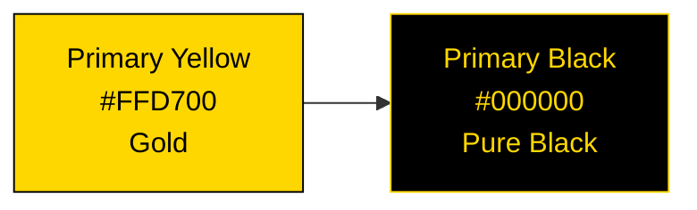

| Color | Hex | Usage | Contrast |
|-------|-----|-------|----------|
| **Primary Yellow** | #FFD700 | Accent, highlights, CTAs | 11:1 on black ✅ |
| **Primary Black** | #000000 | Text, borders, backgrounds | 21:1 on white ✅ |

**Secondary Colors (Trust):**

Trust-building colors for status and semantic meaning:

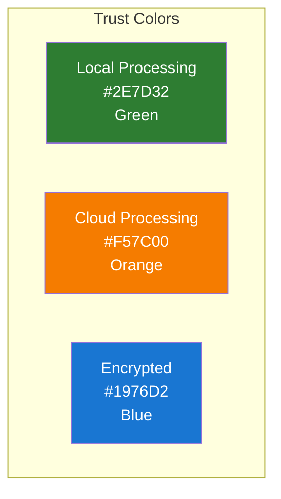

| Color | Hex | Usage | Meaning |
|-------|-----|-------|---------|
| **Trust Green** | #2E7D32 | Local processing badge | Privacy, security |
| **Warning Orange** | #F57C00 | Cloud processing badge | Attention, transparency |
| **Info Blue** | #1976D2 | Encrypted data badge | Trust, reliability |

**Semantic Colors:**

| Color | Hex | Usage | WCAG AA |
|-------|-----|-------|---------|
| **Success** | #4CAF50 | Positive actions, confirmations | ✅ 4.5:1 |
| **Warning** | #FF9800 | Cautions, alerts | ✅ 4.5:1 |
| **Error** | #F44336 | Errors, critical alerts | ✅ 5.2:1 |
| **Info** | #2196F3 | Informational messages | ✅ 4.6:1 |

**Neutral Colors:**

| Color | Hex | Usage |
|-------|-----|-------|
| **White** | #FFFFFF | Backgrounds, card surfaces |
| **Gray 100** | #e0e0e0 | Dashboard background |
| **Gray 300** | #E0E0E0 | Borders, dividers |
| **Gray 500** | #9E9E9E | Secondary text |
| **Gray 700** | #616161 | Tertiary text |
| **Gray 900** | #212121 | Primary text (alt to black) |

---

### Typography

**Font Family:**

```css
--font-family-primary: 'Inter', -apple-system, BlinkMacSystemFont,
                        'Segoe UI', Roboto, sans-serif;
--font-family-mono: 'Fira Code', 'Monaco', 'Courier New', monospace;
```

**Type Scale:**

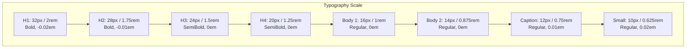

| Level | Size | Weight | Line Height | Letter Spacing | Usage |
|-------|------|--------|-------------|----------------|-------|
| **H1** | 32px | 700 | 1.2 | -0.02em | Page titles |
| **H2** | 28px | 700 | 1.3 | -0.01em | Section headers |
| **H3** | 24px | 600 | 1.4 | 0em | Card headers |
| **H4** | 20px | 600 | 1.4 | 0em | Subsection headers |
| **Body 1** | 16px | 400 | 1.5 | 0em | Primary body text |
| **Body 2** | 14px | 400 | 1.5 | 0em | Secondary text |
| **Caption** | 12px | 400 | 1.4 | 0.01em | Helper text, labels |
| **Small** | 10px | 400 | 1.4 | 0.02em | Timestamps, metadata |

---

### Spacing System

**8px Grid System:**

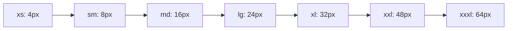

| Token | Value | Usage |
|-------|-------|-------|
| `--spacing-xs` | 4px | Icon margins, tight spacing |
| `--spacing-sm` | 8px | Small gaps, compact lists |
| `--spacing-md` | 16px | Default spacing, card padding |
| `--spacing-lg` | 24px | Section gaps, card margins |
| `--spacing-xl` | 32px | Large section spacing |
| `--spacing-xxl` | 48px | Page sections |
| `--spacing-xxxl` | 64px | Hero sections |

**CRITICAL:** NEVER hardcode pixel values. ALWAYS use CSS variables:

```css
/* ❌ WRONG */
.card {
  padding: 16px;
  margin: 24px;
}

/* ✅ CORRECT */
.card {
  padding: var(--spacing-md);
  margin: var(--spacing-lg);
}
```

---

### Elevation & Shadows

**Shadow System:**

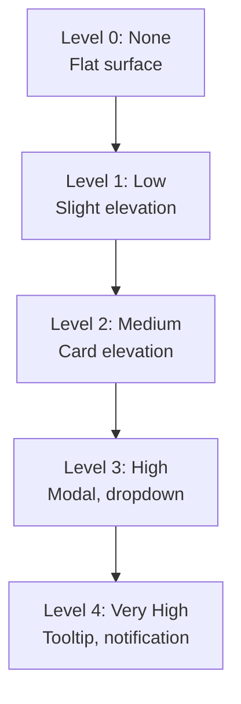

| Level | CSS Shadow | Usage |
|-------|------------|-------|
| **0** | `none` | Flat UI elements |
| **1** | `0 1px 2px rgba(0,0,0,0.1)` | Subtle lift (buttons) |
| **2** | `0 2px 8px rgba(0,0,0,0.15)` | Cards, opportunity cards |
| **3** | `0 4px 16px rgba(0,0,0,0.2)` | Modals, dropdown menus |
| **4** | `0 8px 24px rgba(0,0,0,0.3)` | Tooltips, notifications |

---

### Border Radius

| Token | Value | Usage |
|-------|-------|-------|
| `--radius-sm` | 4px | Buttons, small elements |
| `--radius-md` | 8px | Cards, inputs |
| `--radius-lg` | 12px | Large cards, modals |
| `--radius-xl` | 16px | Feature cards |
| `--radius-full` | 9999px | Pills, avatars |

---

## Component Types

Fidus has **four component types** aligned with interaction patterns:

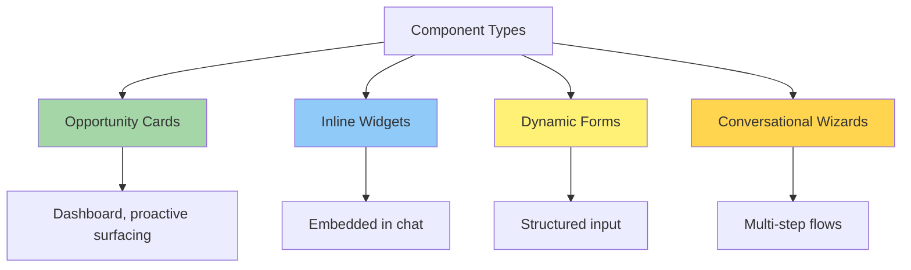

---

## Opportunity Cards

**Purpose:** Proactive information surfacing on dashboard

### Card Anatomy

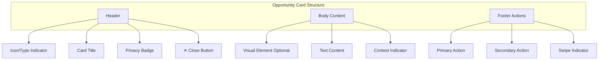

### Visual Structure

```
┌──────────────────────────────────────────┐
│ [Icon] Card Title      [Badge] [✕]       │ ← Header (48px)
├──────────────────────────────────────────┤
│                                          │
│ [Visual Element - Optional]              │ ← Visual (variable)
│                                          │
│ Primary text content goes here.          │ ← Body
│ Secondary information follows.           │   (variable)
│                                          │
│ 💡 Why now? Context explanation          │ ← Context
│                                          │
├──────────────────────────────────────────┤
│ [Primary Action]    Secondary Action     │ ← Footer (56px)
└──────────────────────────────────────────┘
       ← Swipe gesture indicator →
```

### Card Variants

**Budget Alert Card:**

```
┌──────────────────────────────────────────┐
│ 💰 Budget Alert        🔒 Local       ✕  │
├──────────────────────────────────────────┤
│ ████████████████████░░ 95%               │
│                                          │
│ Food: 475 EUR / 500 EUR                  │
│ 3 days remaining in month                │
│                                          │
│ 💡 Month-end approaching, spending high  │
├──────────────────────────────────────────┤
│ [View Transactions]  Adjust Budget       │
└──────────────────────────────────────────┘
```

**Calendar Conflict Card:**

```
┌──────────────────────────────────────────┐
│ ⚠️ Calendar Conflict   🔒 Local       ✕  │
├──────────────────────────────────────────┤
│ Double booking detected:                 │
│                                          │
│ • Team Meeting: 2:00 PM - 3:00 PM        │
│ • Client Call: 2:30 PM - 3:30 PM         │
│                                          │
│ 💡 Both on Nov 4, overlap 30 minutes     │
├──────────────────────────────────────────┤
│ [Reschedule One]  View Calendar          │
└──────────────────────────────────────────┘
```

**Travel Reminder Card:**

```
┌──────────────────────────────────────────┐
│ ✈️ Travel Reminder     🔒 Local       ✕  │
├──────────────────────────────────────────┤
│ Flight to Paris tomorrow                 │
│                                          │
│ Departure: Nov 10, 2:00 PM               │
│ Berlin (BER) → Paris (CDG)               │
│                                          │
│ ✓ Check-in complete                      │
│ ⚠️ No hotel booking yet                  │
│                                          │
│ 💡 Less than 24 hours until departure    │
├──────────────────────────────────────────┤
│ [Find Hotel]  View Itinerary             │
└──────────────────────────────────────────┘
```

### Card States

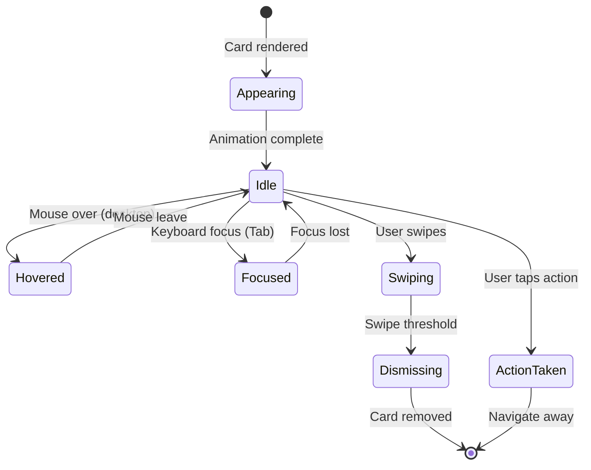

**Visual States:**

| State | Visual Change | Animation |
|-------|---------------|-----------|
| **Appearing** | Fade in + slide up | 300ms ease-out |
| **Idle** | Default appearance | - |
| **Hover** | Lift 2px, shadow increases | 150ms ease |
| **Focus** | Blue outline 2px | Instant |
| **Swiping** | Follow finger/cursor, fade | Real-time |
| **Dismissing** | Slide out + fade | 250ms ease-in |

---

## Inline Widgets

**Purpose:** Interactive elements embedded in chat conversations

### Widget Types

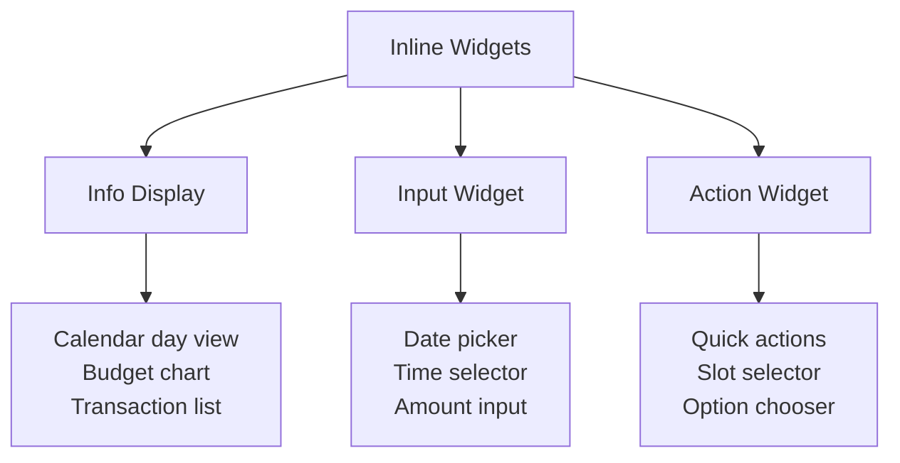

### Calendar Day View Widget

**Embedded in chat:**

```
┌────────────────────────────────┐
│ User                           │
│ What's my schedule today?      │
└────────────────────────────────┘

┌────────────────────────────────┐
│ Fidus              🔒 Local    │
│ Busy day! Here's your schedule:│
└────────────────────────────────┘

┌────────────────────────────────┐
│ [Inline Calendar Widget]       │ ← Widget
├────────────────────────────────┤
│ Today - October 28             │
│                                │
│ 09:00 ████ Team Standup        │
│ 10:00 ████ Planning            │
│ 11:00 ░░░░ (Free)              │
│ 12:00 ░░░░ (Lunch)             │
│ 13:00 ████ Client Call         │
│                                │
│ [Add Event] [View Full] [✕]    │
└────────────────────────────────┘
```

**Widget Features:**
- **Minimal:** Shows only essential info
- **Interactive:** User can tap to add event
- **Dismissible:** ✕ button minimizes widget
- **Expandable:** "View Full" opens full calendar
- **Context-Aware:** Shows time range relevant to query

---

### Budget Chart Widget

```
┌────────────────────────────────┐
│ [Budget Overview Widget]       │
├────────────────────────────────┤
│ October Budget Status          │
│                                │
│ Food       ████████░░  80%     │
│            400 / 500 EUR       │
│                                │
│ Transport  ██████░░░░  60%     │
│            180 / 300 EUR       │
│                                │
│ Shopping   ████░░░░░░  40%     │
│            80 / 200 EUR        │
│                                │
│ Total: 660 / 1000 EUR (66%)    │
│                                │
│ [View Details] [Adjust] [✕]    │
└────────────────────────────────┘
```

---

### Time Slot Selector Widget

**For meeting scheduling:**

```
┌────────────────────────────────┐
│ [Available Slots Widget]       │
├────────────────────────────────┤
│ When works for you?            │
│                                │
│ ○ Tomorrow, 10:00 AM - 11:00 AM│
│   (Morning slot, John free)    │
│                                │
│ ○ Tomorrow, 2:00 PM - 3:00 PM  │
│   (Afternoon, both free)       │
│                                │
│ ○ Nov 4, 9:00 AM - 10:00 AM    │
│   (Early next week)            │
│                                │
│ [Select]  [More Options] [✕]   │
└────────────────────────────────┘
```

**Selection Behavior:**
- User taps radio button → slot selected (visual feedback)
- User taps [Select] → meeting created, widget auto-dismisses
- User taps [More Options] → opens full scheduling form

---

## Dynamic Forms

**Purpose:** Structured input when LLM decides form is more efficient

### Form Components

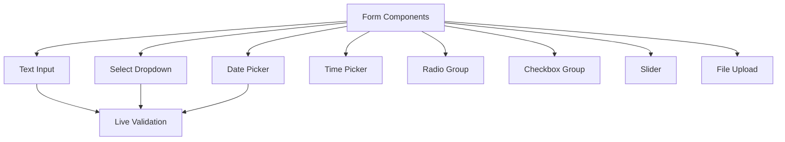

### Text Input

**States:**

```
Idle:
┌────────────────────┐
│ Label *            │
│ [Placeholder text] │
└────────────────────┘

Focused:
┌────────────────────┐
│ Label *            │
│ [User typing__|  ] │ ← Blue border
└────────────────────┘

Valid:
┌────────────────────┐
│ Label *            │
│ [Value entered   ]✓│ ← Green check
└────────────────────┘

Error:
┌────────────────────┐
│ Label *            │
│ [Invalid value   ]×│ ← Red X
│ ⚠️ Error message   │
└────────────────────┘
```

**CSS Variables:**

```css
--input-height: 48px;
--input-padding: var(--spacing-md);
--input-border: 1px solid var(--gray-300);
--input-border-focus: 2px solid var(--info-blue);
--input-border-error: 2px solid var(--error);
--input-border-radius: var(--radius-md);
```

---

### Select Dropdown

```
Closed:
┌────────────────────┐
│ Category *         │
│ [Food           ▼] │
└────────────────────┘

Open:
┌────────────────────┐
│ Category *         │
│ [Food           ▲] │
├────────────────────┤
│ ✓ Food             │ ← Selected
│   Transport        │
│   Shopping         │
│   Entertainment    │
│   Other            │
└────────────────────┘
```

---

### Date & Time Pickers

**Date Picker:**

```
┌────────────────────────────────┐
│ Select Date                    │
├────────────────────────────────┤
│ ← October 2024              →  │
│                                │
│ Sun Mon Tue Wed Thu Fri Sat    │
│ 29  30   1   2   3   4   5     │
│  6   7   8   9  10  11  12     │
│ 13  14  15  16  17  18  19     │
│ 20  21  22  23  24  25  26     │
│ 27 [28] 29  30  31   1   2     │ ← Today circled
│                                │
│ [Today] [Clear]      [Select]  │
└────────────────────────────────┘
```

**Time Picker:**

```
┌────────────────────┐
│ Start Time *       │
│ [09 : 00     AM ▼] │
└────────────────────┘

Expanded:
┌────────────────────┐
│ Hour  Min    Period│
│ [09]  [00]   [AM]  │
│  ▲     ▲      ▲    │ ← Spinners
│  ▼     ▼      ▼    │
└────────────────────┘
```

---

### Form Layout

**Single Column (Mobile):**

```
┌──────────────────────────────────────────┐
│ Create Budget              🔒 Local    ✕ │
├──────────────────────────────────────────┤
│ Category *                               │
│ [Food                                 ▼] │
│                                          │
│ Amount *                                 │
│ [500                                EUR] │
│                                          │
│ Period *                                 │
│ [● Monthly  ○ Weekly]                    │
│                                          │
│ Start Date                               │
│ [Nov 1, 2024                         📅] │
│                                          │
├──────────────────────────────────────────┤
│              [Create Budget]             │
│                 Cancel                   │
└──────────────────────────────────────────┘
```

**Two Column (Desktop):**

```
┌──────────────────────────────────────────┐
│ Create Budget              🔒 Local    ✕ │
├──────────────────────────────────────────┤
│ Category *            Amount *           │
│ [Food             ▼]  [500         EUR]  │
│                                          │
│ Period *              Start Date         │
│ [● Monthly ○ Weekly]  [Nov 1, 2024  📅]  │
│                                          │
├──────────────────────────────────────────┤
│              [Create Budget]             │
│                 Cancel                   │
└──────────────────────────────────────────┘
```

---

## Conversational Wizards

**Purpose:** Multi-step flows mixing conversation and forms

### Wizard Progress Indicator

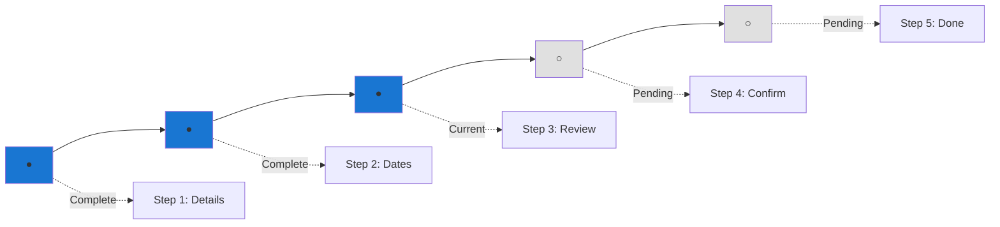

**Visual:**

```
Step 3 of 5: Review Details

●●●○○

[Previous] [Continue]
```

---

### Wizard Step Variants

**Conversational Step:**

```
┌────────────────────────────────┐
│ Fidus              🔒 Local    │
│                                │
│ When would you like to         │
│ travel to Paris?               │
│                                │
│ [This Month]  [Next Month]     │
│ [Specific Dates]               │
└────────────────────────────────┘
```

**Form Step:**

```
┌──────────────────────────────────────────┐
│ Trip Dates                     🔒 Local ✕ │
├──────────────────────────────────────────┤
│ Step 2 of 5                    ●●○○○      │
├──────────────────────────────────────────┤
│ Departure Date *                         │
│ [Nov 10, 2024                        📅] │
│                                          │
│ Return Date *                            │
│ [Nov 14, 2024                        📅] │
│                                          │
│ Duration: 4 nights, 5 days              │
├──────────────────────────────────────────┤
│              [Continue]                  │
│                 Back                     │
└──────────────────────────────────────────┘
```

---

## Bounded Context Icons

Each of Fidus's 14 bounded contexts has a unique icon:

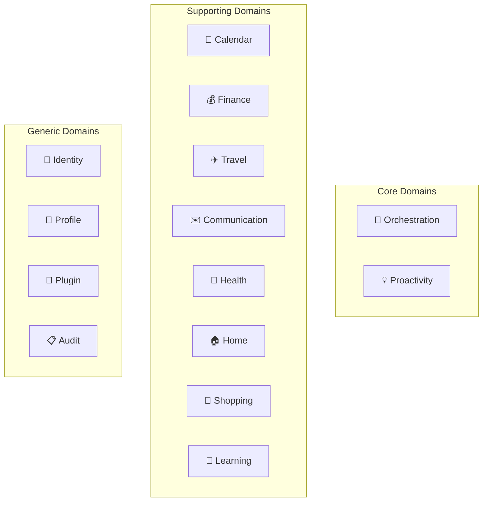

| Context | Icon | Emoji | Color |
|---------|------|-------|-------|
| **Orchestration** | 🎯 | Target | Gray |
| **Proactivity** | 💡 | Light bulb | Yellow |
| **Calendar** | 📅 | Calendar | Blue |
| **Finance** | 💰 | Money bag | Green |
| **Travel** | ✈️ | Airplane | Sky blue |
| **Communication** | ✉️ | Envelope | Purple |
| **Health** | 🏥 | Hospital | Red |
| **Home** | 🏠 | House | Orange |
| **Shopping** | 🛒 | Shopping cart | Teal |
| **Learning** | 📖 | Book | Indigo |
| **Identity** | 🔐 | Locked key | Dark gray |
| **Profile** | 👤 | Person | Gray |
| **Plugin** | 🧩 | Puzzle piece | Multi-color |
| **Audit** | 📋 | Clipboard | Dark gray |

---

## Privacy & Trust Indicators

### Privacy Badges

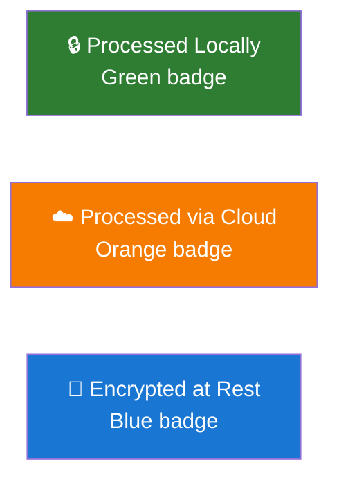

**Visual Implementation:**

```
Local Processing:
┌──────────────────┐
│ 🔒 Processed     │
│    Locally       │
└──────────────────┘

Cloud Processing:
┌──────────────────┐
│ ☁️ Processed via │
│    OpenAI        │
│    [Why?]        │ ← Tap to see explanation
└──────────────────┘

Encrypted Data:
┌──────────────────┐
│ 🔐 Encrypted     │
│    at Rest       │
└──────────────────┘
```

---

## Animation Principles

### Motion Guidelines

**Purposeful, Not Decorative:**

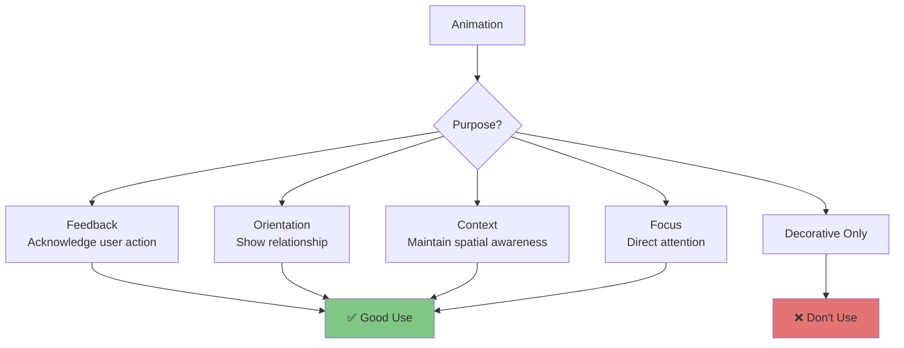

### Animation Timing

| Animation | Duration | Easing | Purpose |
|-----------|----------|--------|---------|
| **Button Press** | 100ms | ease-in | Feedback |
| **Card Appear** | 300ms | ease-out | Orientation |
| **Card Dismiss** | 250ms | ease-in | Exit |
| **Modal Open** | 200ms | ease-out | Focus |
| **Modal Close** | 150ms | ease-in | Exit |
| **Page Transition** | 300ms | ease-in-out | Context |

**CSS Variables:**

```css
--transition-fast: 100ms;
--transition-normal: 200ms;
--transition-slow: 300ms;

--easing-in: cubic-bezier(0.4, 0, 1, 1);
--easing-out: cubic-bezier(0, 0, 0.2, 1);
--easing-in-out: cubic-bezier(0.4, 0, 0.2, 1);
```

---

## Accessibility Features

### Focus Indicators

**All interactive elements MUST have visible focus:**

```
Button Focus:
┌────────────────┐
│ Primary Action │ ← 2px blue outline
└────────────────┘

Card Focus:
┌──────────────────────────────────────────┐
│ 💰 Budget Alert        🔒 Local       ✕  │ ← 2px blue outline
├──────────────────────────────────────────┤
│ Content...                               │
└──────────────────────────────────────────┘
```

**CSS:**

```css
/* NEVER remove outline without replacement */
/* ❌ WRONG */
:focus {
  outline: none;
}

/* ✅ CORRECT */
:focus {
  outline: 2px solid var(--info-blue);
  outline-offset: 2px;
}

/* ✅ ALTERNATIVE */
:focus {
  box-shadow: 0 0 0 3px rgba(25, 118, 210, 0.4);
}
```

---

### Screen Reader Text

**Hidden but accessible labels:**

```html
<!-- Dismiss button with accessible label -->
<button aria-label="Dismiss budget alert card">
  ✕
</button>

<!-- Icon with accessible alternative -->
<span aria-label="Local processing">🔒</span>

<!-- Screen reader only text -->
<span class="sr-only">
  Budget alert: Food category 95% spent
</span>
```

**CSS:**

```css
.sr-only {
  position: absolute;
  width: 1px;
  height: 1px;
  padding: 0;
  margin: -1px;
  overflow: hidden;
  clip: rect(0, 0, 0, 0);
  white-space: nowrap;
  border-width: 0;
}
```

---

## Responsive Behavior

### Component Adaptations

**Cards:**

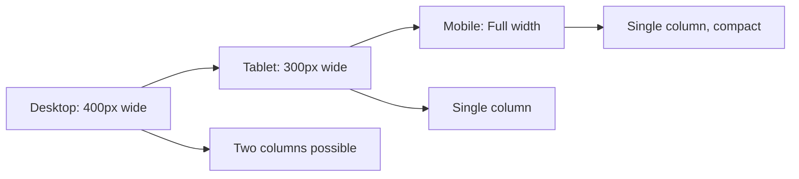

**Forms:**

- **Desktop:** Two-column layout when space allows
- **Tablet:** Single column, larger touch targets
- **Mobile:** Single column, full-width inputs

---

## Component Library Summary

| Component | Purpose | Context-Independent | Dismissible | Keyboard Accessible |
|-----------|---------|---------------------|-------------|---------------------|
| **Opportunity Card** | Proactive surfacing | ✅ | ✅ Swipe/X | ✅ Tab + Esc |
| **Inline Widget** | Chat-embedded interaction | ✅ | ✅ X button | ✅ Tab + Esc |
| **Dynamic Form** | Structured input | ✅ | ✅ X button | ✅ Full nav |
| **Wizard Step** | Multi-step flow | ✅ | ✅ Cancel | ✅ Full nav |

---

## Implementation Notes

### CSS Architecture

**Use CSS Custom Properties:**

```css
/* Define in :root */
:root {
  --color-primary-yellow: #FFD700;
  --color-primary-black: #000000;
  --spacing-md: 16px;
  --radius-md: 8px;
  --shadow-card: 0 2px 8px rgba(0,0,0,0.15);
}

/* Use throughout */
.opportunity-card {
  background: white;
  border-radius: var(--radius-md);
  padding: var(--spacing-md);
  box-shadow: var(--shadow-card);
}
```

**Component-Scoped Styles:**

```css
/* Card component */
.fidus-card {
  /* Base styles */
}

.fidus-card__header {
  /* Header styles */
}

.fidus-card__body {
  /* Body styles */
}

.fidus-card--urgent {
  /* Modifier for urgent cards */
}
```

---

## Next Steps

This design system provides the foundation for implementing all Fidus components.

Read next:
1. [06-contextual-ui-patterns.md](06-contextual-ui-patterns.md) - How these components appear in different contexts
2. [07-responsive-pwa.md](07-responsive-pwa.md) - Responsive behavior across devices
3. [11-accessibility.md](11-accessibility.md) - Detailed accessibility guidelines

---

**End of Document**
