# Design System & Components

**Version:** 1.0
**Date:** 2025-10-28
**Status:** Draft (Awaiting Human Review)
**Part of:** Fidus UX/UI Design
**Author:** AI-Generated

---

## Overview

This document defines the **design system** and **component library** for Fidus. All components are **context-independent** and work across all interaction patterns.

**Foundation:** [AI-Driven UI Paradigm](00-ai-driven-ui-paradigm.md) | [Brand Identity](../branding/fidus-brand-identity-en.md)

---

## Design Tokens

### Color Palette

Based on [Fidus Brand Identity](../branding/fidus-brand-identity-en.md):

**Primary Colors (Brand):**


| Color | Hex | Usage | Contrast |
|-------|-----|-------|----------|
| **Primary Yellow** | #FFD700 | Accent, highlights, CTAs | 11:1 on black ✅ |
| **Primary Black** | #000000 | Text, borders, backgrounds | 21:1 on white ✅ |

**Secondary Colors (Trust):**

Trust-building colors for status and semantic meaning:


| Color | Hex | Usage | Meaning |
|-------|-----|-------|---------|
| **Trust Green** | #2E7D32 | Local processing badge | Privacy, security |
| **Warning Orange** | #F57C00 | Cloud processing badge | Attention, transparency |
| **Info Blue** | #1976D2 | Encrypted data badge | Trust, reliability |

**Semantic Colors:**

| Color | Hex | Usage | WCAG AA |
|-------|-----|-------|---------|
| **Success** | #4CAF50 | Positive actions, confirmations | ✅ 4.5:1 |
| **Warning** | #FF9800 | Cautions, alerts | ✅ 4.5:1 |
| **Error** | #F44336 | Errors, critical alerts | ✅ 5.2:1 |
| **Info** | #2196F3 | Informational messages | ✅ 4.6:1 |

**Neutral Colors:**

| Color | Hex | Usage |
|-------|-----|-------|
| **White** | #FFFFFF | Backgrounds, card surfaces |
| **Gray 100** | #e0e0e0 | Dashboard background |
| **Gray 300** | #E0E0E0 | Borders, dividers |
| **Gray 500** | #9E9E9E | Secondary text |
| **Gray 700** | #616161 | Tertiary text |
| **Gray 900** | #212121 | Primary text (alt to black) |

---

### Typography

**Font Family:**

```css
--font-family-primary: 'Inter', -apple-system, BlinkMacSystemFont,
                        'Segoe UI', Roboto, sans-serif;
--font-family-mono: 'Fira Code', 'Monaco', 'Courier New', monospace;
```

**Type Scale:**


| Level | Size | Weight | Line Height | Letter Spacing | Usage |
|-------|------|--------|-------------|----------------|-------|
| **H1** | 32px | 700 | 1.2 | -0.02em | Page titles |
| **H2** | 28px | 700 | 1.3 | -0.01em | Section headers |
| **H3** | 24px | 600 | 1.4 | 0em | Card headers |
| **H4** | 20px | 600 | 1.4 | 0em | Subsection headers |
| **Body 1** | 16px | 400 | 1.5 | 0em | Primary body text |
| **Body 2** | 14px | 400 | 1.5 | 0em | Secondary text |
| **Caption** | 12px | 400 | 1.4 | 0.01em | Helper text, labels |
| **Small** | 10px | 400 | 1.4 | 0.02em | Timestamps, metadata |

---

### Spacing System

**8px Grid System:**


| Token | Value | Usage |
|-------|-------|-------|
| `--spacing-xs` | 4px | Icon margins, tight spacing |
| `--spacing-sm` | 8px | Small gaps, compact lists |
| `--spacing-md` | 16px | Default spacing, card padding |
| `--spacing-lg` | 24px | Section gaps, card margins |
| `--spacing-xl` | 32px | Large section spacing |
| `--spacing-xxl` | 48px | Page sections |
| `--spacing-xxxl` | 64px | Hero sections |

**CRITICAL:** NEVER hardcode pixel values. ALWAYS use CSS variables:

```css
/* ❌ WRONG */
.card {
  padding: 16px;
  margin: 24px;
}

/* ✅ CORRECT */
.card {
  padding: var(--spacing-md);
  margin: var(--spacing-lg);
}
```

---

### Elevation & Shadows

**Shadow System:**


| Level | CSS Shadow | Usage |
|-------|------------|-------|
| **0** | `none` | Flat UI elements |
| **1** | `0 1px 2px rgba(0,0,0,0.1)` | Subtle lift (buttons) |
| **2** | `0 2px 8px rgba(0,0,0,0.15)` | Cards, opportunity cards |
| **3** | `0 4px 16px rgba(0,0,0,0.2)` | Modals, dropdown menus |
| **4** | `0 8px 24px rgba(0,0,0,0.3)` | Tooltips, notifications |

---

### Border Radius

| Token | Value | Usage |
|-------|-------|-------|
| `--radius-sm` | 4px | Buttons, small elements |
| `--radius-md` | 8px | Cards, inputs |
| `--radius-lg` | 12px | Large cards, modals |
| `--radius-xl` | 16px | Feature cards |
| `--radius-full` | 9999px | Pills, avatars |

---

## Component Types

Fidus has **four component types** aligned with interaction patterns:


---

## Opportunity Cards

**Purpose:** Proactive information surfacing on dashboard

### Card Anatomy

```mermaid
graph TB
    subgraph Card[Opportunity Card Structure]
        Header[Header]
        Body[Body Content]
        Footer[Footer Actions]
    end

    Header --> Icon[Icon/Type Indicator]
    Header --> Title[Card Title]
    Header --> Privacy[Privacy Badge]
    Header --> Close[✕ Close Button]

    Body --> Visual[Visual Element Optional]
    Body --> Text[Text Content]
    Body --> Context[Context Indicator]

    Footer --> Primary[Primary Action]
    Footer --> Secondary[Secondary Action]
    Footer --> Swipe[Swipe Indicator]
```



### Visual Structure

```
+------------------------------------------+
| [Icon] Card Title      [Badge] [✕]       | ← Header (48px)
+------------------------------------------+
|                                          |
| [Visual Element - Optional]              | ← Visual (variable)
|                                          |
| Primary text content goes here.          | ← Body
| Secondary information follows.           |   (variable)
|                                          |
| 💡 Why now? Context explanation          | ← Context
|                                          |
+------------------------------------------+
| [Primary Action]    Secondary Action     | ← Footer (56px)
+------------------------------------------+
       ← Swipe gesture indicator →
```

### Card Variants

**Budget Alert Card:**

```
+------------------------------------------+
| 💰 Budget Alert        🔒 Local       ✕  |
+------------------------------------------+
| ████████████████████░░ 95%               |
|                                          |
| Food: 475 EUR / 500 EUR                  |
| 3 days remaining in month                |
|                                          |
| 💡 Month-end approaching, spending high  |
+------------------------------------------+
| [View Transactions]  Adjust Budget       |
+------------------------------------------+
```

**Calendar Conflict Card:**

```
+------------------------------------------+
| ⚠️ Calendar Conflict   🔒 Local       ✕  |
+------------------------------------------+
| Double booking detected:                 |
|                                          |
| • Team Meeting: 2:00 PM - 3:00 PM        |
| • Client Call: 2:30 PM - 3:30 PM         |
|                                          |
| 💡 Both on Nov 4, overlap 30 minutes     |
+------------------------------------------+
| [Reschedule One]  View Calendar          |
+------------------------------------------+
```

**Travel Reminder Card:**

```
+------------------------------------------+
| ✈️ Travel Reminder     🔒 Local       ✕  |
+------------------------------------------+
| Flight to Paris tomorrow                 |
|                                          |
| Departure: Nov 10, 2:00 PM               |
| Berlin (BER) → Paris (CDG)               |
|                                          |
| ✓ Check-in complete                      |
| ⚠️ No hotel booking yet                  |
|                                          |
| 💡 Less than 24 hours until departure    |
+------------------------------------------+
| [Find Hotel]  View Itinerary             |
+------------------------------------------+
```

### Card States


**Visual States:**

| State | Visual Change | Animation |
|-------|---------------|-----------|
| **Appearing** | Fade in + slide up | 300ms ease-out |
| **Idle** | Default appearance | - |
| **Hover** | Lift 2px, shadow increases | 150ms ease |
| **Focus** | Blue outline 2px | Instant |
| **Swiping** | Follow finger/cursor, fade | Real-time |
| **Dismissing** | Slide out + fade | 250ms ease-in |

---

## Inline Widgets

**Purpose:** Interactive elements embedded in chat conversations

### Widget Types


### Calendar Day View Widget

**Embedded in chat:**

```
+--------------------------------+
| User                           |
| What's my schedule today?      |
+--------------------------------+

+--------------------------------+
| Fidus              🔒 Local    |
| Busy day! Here's your schedule:|
+--------------------------------+

+--------------------------------+
| [Inline Calendar Widget]       | ← Widget
+--------------------------------+
| Today - October 28             |
|                                |
| 09:00 ████ Team Standup        |
| 10:00 ████ Planning            |
| 11:00 ░░░░ (Free)              |
| 12:00 ░░░░ (Lunch)             |
| 13:00 ████ Client Call         |
|                                |
| [Add Event] [View Full] [✕]    |
+--------------------------------+
```

**Widget Features:**
- **Minimal:** Shows only essential info
- **Interactive:** User can tap to add event
- **Dismissible:** ✕ button minimizes widget
- **Expandable:** "View Full" opens full calendar
- **Context-Aware:** Shows time range relevant to query

---

### Budget Chart Widget

```
+--------------------------------+
| [Budget Overview Widget]       |
+--------------------------------+
| October Budget Status          |
|                                |
| Food       ████████░░  80%     |
|            400 / 500 EUR       |
|                                |
| Transport  ██████░░░░  60%     |
|            180 / 300 EUR       |
|                                |
| Shopping   ████░░░░░░  40%     |
|            80 / 200 EUR        |
|                                |
| Total: 660 / 1000 EUR (66%)    |
|                                |
| [View Details] [Adjust] [✕]    |
+--------------------------------+
```

---

### Time Slot Selector Widget

**For meeting scheduling:**

```
+--------------------------------+
| [Available Slots Widget]       |
+--------------------------------+
| When works for you?            |
|                                |
| ○ Tomorrow, 10:00 AM - 11:00 AM|
|   (Morning slot, John free)    |
|                                |
| ○ Tomorrow, 2:00 PM - 3:00 PM  |
|   (Afternoon, both free)       |
|                                |
| ○ Nov 4, 9:00 AM - 10:00 AM    |
|   (Early next week)            |
|                                |
| [Select]  [More Options] [✕]   |
+--------------------------------+
```

**Selection Behavior:**
- User taps radio button → slot selected (visual feedback)
- User taps [Select] → meeting created, widget auto-dismisses
- User taps [More Options] → opens full scheduling form

---

## Dynamic Forms

**Purpose:** Structured input when LLM decides form is more efficient

### Form Components


### Text Input

**States:**

```
Idle:
+--------------------+
| Label *            |
| [Placeholder text] |
+--------------------+

Focused:
+--------------------+
| Label *            |
| [User typing__|  ] | ← Blue border
+--------------------+

Valid:
+--------------------+
| Label *            |
| [Value entered   ]✓| ← Green check
+--------------------+

Error:
+--------------------+
| Label *            |
| [Invalid value   ]×| ← Red X
| ⚠️ Error message   |
+--------------------+
```

**CSS Variables:**

```css
--input-height: 48px;
--input-padding: var(--spacing-md);
--input-border: 1px solid var(--gray-300);
--input-border-focus: 2px solid var(--info-blue);
--input-border-error: 2px solid var(--error);
--input-border-radius: var(--radius-md);
```

---

### Select Dropdown

```
Closed:
+--------------------+
| Category *         |
| [Food           ▼] |
+--------------------+

Open:
+--------------------+
| Category *         |
| [Food           ▲] |
+--------------------+
| ✓ Food             | ← Selected
|   Transport        |
|   Shopping         |
|   Entertainment    |
|   Other            |
+--------------------+
```

---

### Date & Time Pickers

**Date Picker:**

```
+--------------------------------+
| Select Date                    |
+--------------------------------+
| ← October 2024              →  |
|                                |
| Sun Mon Tue Wed Thu Fri Sat    |
| 29  30   1   2   3   4   5     |
|  6   7   8   9  10  11  12     |
| 13  14  15  16  17  18  19     |
| 20  21  22  23  24  25  26     |
| 27 [28] 29  30  31   1   2     | ← Today circled
|                                |
| [Today] [Clear]      [Select]  |
+--------------------------------+
```

**Time Picker:**

```
+--------------------+
| Start Time *       |
| [09 : 00     AM ▼] |
+--------------------+

Expanded:
+--------------------+
| Hour  Min    Period|
| [09]  [00]   [AM]  |
|  ▲     ▲      ▲    | ← Spinners
|  ▼     ▼      ▼    |
+--------------------+
```

---

### Form Layout

**Single Column (Mobile):**

```
+------------------------------------------+
| Create Budget              🔒 Local    ✕ |
+------------------------------------------+
| Category *                               |
| [Food                                 ▼] |
|                                          |
| Amount *                                 |
| [500                                EUR] |
|                                          |
| Period *                                 |
| [● Monthly  ○ Weekly]                    |
|                                          |
| Start Date                               |
| [Nov 1, 2024                         📅] |
|                                          |
+------------------------------------------+
|              [Create Budget]             |
|                 Cancel                   |
+------------------------------------------+
```

**Two Column (Desktop):**

```
+------------------------------------------+
| Create Budget              🔒 Local    ✕ |
+------------------------------------------+
| Category *            Amount *           |
| [Food             ▼]  [500         EUR]  |
|                                          |
| Period *              Start Date         |
| [● Monthly ○ Weekly]  [Nov 1, 2024  📅]  |
|                                          |
+------------------------------------------+
|              [Create Budget]             |
|                 Cancel                   |
+------------------------------------------+
```

---

## Conversational Wizards

**Purpose:** Multi-step flows mixing conversation and forms

### Wizard Progress Indicator

```mermaid
graph LR
    S1[●] --> S2[●]
    S2 --> S3[●]
    S3 --> S4[○]
    S4 --> S5[○]

    S1 -.->|Complete| Label1[Step 1: Details]
    S2 -.->|Complete| Label2[Step 2: Dates]
    S3 -.->|Current| Label3[Step 3: Review]
    S4 -.->|Pending| Label4[Step 4: Confirm]
    S5 -.->|Pending| Label5[Step 5: Done]

    style S1 fill:#1976D2
    style S2 fill:#1976D2
    style S3 fill:#1976D2
    style S4 fill:#e0e0e0
    style S5 fill:#e0e0e0
```



**Visual:**

```
Step 3 of 5: Review Details

●●●○○

[Previous] [Continue]
```

---

### Wizard Step Variants

**Conversational Step:**

```
+--------------------------------+
| Fidus              🔒 Local    |
|                                |
| When would you like to         |
| travel to Paris?               |
|                                |
| [This Month]  [Next Month]     |
| [Specific Dates]               |
+--------------------------------+
```

**Form Step:**

```
+------------------------------------------+
| Trip Dates                     🔒 Local ✕ |
+------------------------------------------+
| Step 2 of 5                    ●●○○○      |
+------------------------------------------+
| Departure Date *                         |
| [Nov 10, 2024                        📅] |
|                                          |
| Return Date *                            |
| [Nov 14, 2024                        📅] |
|                                          |
| Duration: 4 nights, 5 days              |
+------------------------------------------+
|              [Continue]                  |
|                 Back                     |
+------------------------------------------+
```

---

## Bounded Context Icons

Each of Fidus's 14 bounded contexts has a unique icon:

```mermaid
graph TB
    subgraph CoreDomains[Core Domains]
        Orch[🎯 Orchestration]
        Proact[💡 Proactivity]
    end

    subgraph SupportingDomains[Supporting Domains]
        Cal[📅 Calendar]
        Fin[💰 Finance]
        Travel[✈️ Travel]
        Comm[✉️ Communication]
        Health[🏥 Health]
        Home[🏠 Home]
        Shop[🛒 Shopping]
        Learn[📖 Learning]
    end

    subgraph GenericDomains[Generic Domains]
        Identity[🔐 Identity]
        Profile[👤 Profile]
        Plugin[🧩 Plugin]
        Audit[📋 Audit]
    end
```



| Context | Icon | Emoji | Color |
|---------|------|-------|-------|
| **Orchestration** | 🎯 | Target | Gray |
| **Proactivity** | 💡 | Light bulb | Yellow |
| **Calendar** | 📅 | Calendar | Blue |
| **Finance** | 💰 | Money bag | Green |
| **Travel** | ✈️ | Airplane | Sky blue |
| **Communication** | ✉️ | Envelope | Purple |
| **Health** | 🏥 | Hospital | Red |
| **Home** | 🏠 | House | Orange |
| **Shopping** | 🛒 | Shopping cart | Teal |
| **Learning** | 📖 | Book | Indigo |
| **Identity** | 🔐 | Locked key | Dark gray |
| **Profile** | 👤 | Person | Gray |
| **Plugin** | 🧩 | Puzzle piece | Multi-color |
| **Audit** | 📋 | Clipboard | Dark gray |

---

## Privacy & Trust Indicators

### Privacy Badges

```mermaid
graph LR
    Local[🔒 Processed Locally<br/>Green badge]
    Cloud[☁️ Processed via Cloud<br/>Orange badge]
    Encrypted[🔐 Encrypted at Rest<br/>Blue badge]

    style Local fill:#2E7D32,color:#ffffff
    style Cloud fill:#F57C00,color:#fff
    style Encrypted fill:#1976D2,color:#fff
```



**Visual Implementation:**

```
Local Processing:
+------------------+
| 🔒 Processed     |
|    Locally       |
+------------------+

Cloud Processing:
+------------------+
| ☁️ Processed via |
|    OpenAI        |
|    [Why?]        | ← Tap to see explanation
+------------------+

Encrypted Data:
+------------------+
| 🔐 Encrypted     |
|    at Rest       |
+------------------+
```

---

## Animation Principles

### Motion Guidelines

**Purposeful, Not Decorative:**

```mermaid
graph TB
    Animation[Animation] --> Purpose{Purpose?}

    Purpose --> P1[Feedback<br/>Acknowledge user action]
    Purpose --> P2[Orientation<br/>Show relationship]
    Purpose --> P3[Context<br/>Maintain spatial awareness]
    Purpose --> P4[Focus<br/>Direct attention]

    P1 --> Good[✅ Good Use]
    P2 --> Good
    P3 --> Good
    P4 --> Good

    Purpose --> Decorative[Decorative Only]
    Decorative --> Bad[❌ Don't Use]

    style Good fill:#81c784
    style Bad fill:#e57373
```



### Animation Timing

| Animation | Duration | Easing | Purpose |
|-----------|----------|--------|---------|
| **Button Press** | 100ms | ease-in | Feedback |
| **Card Appear** | 300ms | ease-out | Orientation |
| **Card Dismiss** | 250ms | ease-in | Exit |
| **Modal Open** | 200ms | ease-out | Focus |
| **Modal Close** | 150ms | ease-in | Exit |
| **Page Transition** | 300ms | ease-in-out | Context |

**CSS Variables:**

```css
--transition-fast: 100ms;
--transition-normal: 200ms;
--transition-slow: 300ms;

--easing-in: cubic-bezier(0.4, 0, 1, 1);
--easing-out: cubic-bezier(0, 0, 0.2, 1);
--easing-in-out: cubic-bezier(0.4, 0, 0.2, 1);
```

---

## Accessibility Features

### Focus Indicators

**All interactive elements MUST have visible focus:**

```
Button Focus:
+----------------+
| Primary Action | ← 2px blue outline
+----------------+

Card Focus:
+------------------------------------------+
| 💰 Budget Alert        🔒 Local       ✕  | ← 2px blue outline
+------------------------------------------+
| Content...                               |
+------------------------------------------+
```

**CSS:**

```css
/* NEVER remove outline without replacement */
/* ❌ WRONG */
:focus {
  outline: none;
}

/* ✅ CORRECT */
:focus {
  outline: 2px solid var(--info-blue);
  outline-offset: 2px;
}

/* ✅ ALTERNATIVE */
:focus {
  box-shadow: 0 0 0 3px rgba(25, 118, 210, 0.4);
}
```

---

### Screen Reader Text

**Hidden but accessible labels:**

```html
<!-- Dismiss button with accessible label -->
<button aria-label="Dismiss budget alert card">
  ✕
</button>

<!-- Icon with accessible alternative -->
<span aria-label="Local processing">🔒</span>

<!-- Screen reader only text -->
<span class="sr-only">
  Budget alert: Food category 95% spent
</span>
```

**CSS:**

```css
.sr-only {
  position: absolute;
  width: 1px;
  height: 1px;
  padding: 0;
  margin: -1px;
  overflow: hidden;
  clip: rect(0, 0, 0, 0);
  white-space: nowrap;
  border-width: 0;
}
```

---

## Responsive Behavior

### Component Adaptations

**Cards:**


**Forms:**

- **Desktop:** Two-column layout when space allows
- **Tablet:** Single column, larger touch targets
- **Mobile:** Single column, full-width inputs

---

## Component Library Summary

| Component | Purpose | Context-Independent | Dismissible | Keyboard Accessible |
|-----------|---------|---------------------|-------------|---------------------|
| **Opportunity Card** | Proactive surfacing | ✅ | ✅ Swipe/X | ✅ Tab + Esc |
| **Inline Widget** | Chat-embedded interaction | ✅ | ✅ X button | ✅ Tab + Esc |
| **Dynamic Form** | Structured input | ✅ | ✅ X button | ✅ Full nav |
| **Wizard Step** | Multi-step flow | ✅ | ✅ Cancel | ✅ Full nav |

---

## Implementation Notes

### CSS Architecture

**Use CSS Custom Properties:**

```css
/* Define in :root */
:root {
  --color-primary-yellow: #FFD700;
  --color-primary-black: #000000;
  --spacing-md: 16px;
  --radius-md: 8px;
  --shadow-card: 0 2px 8px rgba(0,0,0,0.15);
}

/* Use throughout */
.opportunity-card {
  background: white;
  border-radius: var(--radius-md);
  padding: var(--spacing-md);
  box-shadow: var(--shadow-card);
}
```

**Component-Scoped Styles:**

```css
/* Card component */
.fidus-card {
  /* Base styles */
}

.fidus-card__header {
  /* Header styles */
}

.fidus-card__body {
  /* Body styles */
}

.fidus-card--urgent {
  /* Modifier for urgent cards */
}
```

---

## Next Steps

This design system provides the foundation for implementing all Fidus components.

Read next:
1. [06-contextual-ui-patterns.md](06-contextual-ui-patterns.md) - How these components appear in different contexts
2. [07-responsive-pwa.md](07-responsive-pwa.md) - Responsive behavior across devices
3. [11-accessibility.md](11-accessibility.md) - Detailed accessibility guidelines

---

**End of Document**
