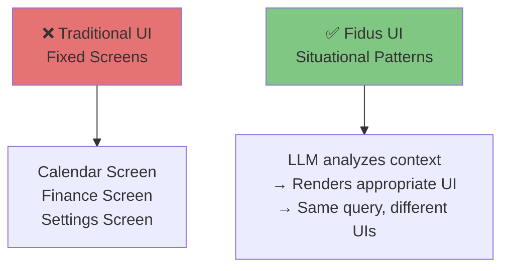

# Contextual UI Patterns

**Version:** 1.0
**Date:** 2025-10-28
**Status:** Draft (Awaiting Human Review)
**Part of:** Fidus UX/UI Design
**Author:** AI-Generated

---

## Overview

This document shows **situational UI patterns** for Fidus's 14 bounded contexts.

**CRITICAL:** These are NOT "fixed screens." They are EXAMPLES of how the LLM MIGHT render UI based on context.

**Foundation:** [AI-Driven UI Paradigm](00-ai-driven-ui-paradigm.md)

---

## Important: Not Fixed Screens!



**This document shows:**
- "In situation X, LLM MIGHT render Y"
- Alternative contexts → different UI responses
- Example dialogues → UI outcomes

**This document does NOT show:**
- "Calendar Screen always looks like this"
- "User navigates to Finance → sees this"
- Hardcoded flows

---

## Core Domains

### 1. Orchestration Domain (🎯)

**Purpose:** Intent detection and routing to appropriate supervisors

**User RARELY interacts directly** with Orchestration - it works behind the scenes.

#### Situational Pattern: Intent Unclear

**Context:**
- User query: "Fix it"
- Ambiguous intent
- Orchestrator cannot determine which supervisor to route to

**LLM Renders: Clarification Dialog**

```
+--------------------------------+
| User                           |
| Fix it                         |
+--------------------------------+

+--------------------------------+
| Fidus              🔒 Local    |
|                                |
| I'm not sure what to fix.      |
| Could you clarify?             |
|                                |
| Did you mean:                  |
| • Fix calendar conflict?       |
| • Fix budget issue?            |
| • Fix something else?          |
+--------------------------------+
```

---

#### Situational Pattern: Supervisor Fallback

**Context:**
- Finance supervisor's LLM offline
- User asks budget question
- Orchestrator detects failure

**LLM Renders: Fallback Notice**

```
+--------------------------------+
| Fidus              ⚠️ Cloud    |
|                                |
| Budget information requested.  |
|                                |
| Local LLM temporarily          |
| unavailable. I'm using cloud   |
| processing (OpenAI).           |
|                                |
| ☁️ Your query (not raw data)   |
|    was sent to cloud.          |
|                                |
| [Continue] [Cancel]            |
|                                |
| [Why?] Learn about fallback    |
+--------------------------------+
```

---

### 2. Proactivity Domain (💡)

**Purpose:** Opportunity detection and surfacing

#### Situational Pattern: High-Relevance Opportunity

**Context:**
- Meeting in 30 minutes
- No alarm set
- Traffic delay detected
- Relevance: 0.95 (very high)

**LLM Renders: Urgent Proactive Card**

```
+------------------------------------------+
| ⚠️ URGENT                  🔒 Local    ✕ |
+------------------------------------------+
| Meeting starting soon                    |
|                                          |
| Client Call - 2:00 PM (30 min away)      |
| Office location (5km drive)              |
|                                          |
| ⚠️ No alarm set                          |
| 🚗 Traffic delay: +15 minutes            |
|                                          |
| 💡 Leave now to arrive on time          |
+------------------------------------------+
| [Set Alarm & Navigate]  [Reschedule]     |
+------------------------------------------+
```

---

#### Situational Pattern: Insight (Low Action Needed)

**Context:**
- User spent 20% less on food this month
- Not urgent, just interesting
- Relevance: 0.55 (medium)

**LLM Renders: Insight Card (Dashboard Only, No Push)**

```
+------------------------------------------+
| 💡 Spending Insight        🔒 Local    ✕ |
+------------------------------------------+
| Food spending down 20% this month        |
|                                          |
| Oct: 400 EUR vs Sep: 500 EUR            |
| You saved 100 EUR!                       |
|                                          |
| 💡 Keep it up! On track to save 1200    |
|    EUR annually at this rate.            |
+------------------------------------------+
| [View Trends]  Thanks, got it            |
+------------------------------------------+
```

**Note:** This appears on dashboard only. NO push notification (not urgent enough).

---

## Supporting Domains

### 3. Calendar Domain (📅)

#### Situational Pattern 1: Simple Query

**Context:**
- User: "What's my schedule today?"
- Only 2 events
- No conflicts
- Morning time

**LLM Renders: Text Response**

```
+--------------------------------+
| User                           |
| What's my schedule today?      |
+--------------------------------+

+--------------------------------+
| Fidus              🔒 Local    |
|                                |
| You have 2 meetings today:     |
|                                |
| • 10:00 AM - Team Standup      |
|   (30 min, Video call)         |
|                                |
| • 3:00 PM - Client Review      |
|   (1 hour, Office)             |
|                                |
| Free time: 11 AM - 2 PM        |
+--------------------------------+
```

---

#### Situational Pattern 2: Busy Day

**Context:**
- User: "What's my schedule today?"
- 5+ events
- Complex schedule
- User needs visual overview

**LLM Renders: Text + Calendar Widget**

```
+--------------------------------+
| Fidus              🔒 Local    |
|                                |
| Busy day! 5 meetings scheduled:|
+--------------------------------+

+--------------------------------+
| [Day View Widget]              |
+--------------------------------+
| Today - October 28             |
|                                |
| 09:00 ████ Team Standup        |
| 10:00 ████ Planning Session    |
| 11:00 ░░░░ (Free)              |
| 12:00 ░░░░ (Lunch)             |
| 13:00 ████ Client Call         |
| 14:00 ████ Review Meeting      |
| 15:00 ████ 1:1 Manager         |
| 16:00 ░░░░ (Free until 5 PM)   |
|                                |
| [View Full] [Add Event] [✕]    |
+--------------------------------+
```

---

#### Situational Pattern 3: Conflict Detection

**Context:**
- User creates new event
- Overlaps with existing event
- Calendar supervisor detects conflict

**LLM Renders: Conflict Warning + Options**

```
+------------------------------------------+
| ⚠️ Calendar Conflict       🔒 Local    ✕ |
+------------------------------------------+
| The meeting you're creating overlaps:    |
|                                          |
| New: Client Call                         |
|      Oct 28, 2:00 PM - 3:00 PM           |
|                                          |
| Existing: Team Planning                  |
|           Oct 28, 2:30 PM - 3:30 PM      |
|                                          |
| Overlap: 30 minutes (2:30 - 3:00 PM)     |
|                                          |
| 💡 What would you like to do?           |
+------------------------------------------+
| [Reschedule New]  [Reschedule Existing]  |
| [Keep Both]       Cancel                 |
+------------------------------------------+
```

---

#### Situational Pattern 4: Creating Recurring Event

**Context:**
- User: "Create weekly team standup"
- Experienced user (has created recurring events)
- LLM decides form is efficient

**LLM Renders: Recurring Event Form**

```
+------------------------------------------+
| Create Recurring Event     🔒 Local    ✕ |
+------------------------------------------+
| 💡 Creating recurring event with smart  |
|    defaults based on "team standup"      |
+------------------------------------------+
| Title *                                  |
| [Team Standup                         ]  |
|                                          |
| Duration                                 |
| [30 minutes ▼]     Location             |
|                    [Video Call - Zoom ▼] |
|                                          |
| Recurrence                               |
| [● Weekly  ○ Daily  ○ Monthly]           |
|                                          |
| Every [1▼] week(s) on:                   |
| [✓ Mon] [ Tue] [ Wed] [ Thu] [ Fri]      |
|                                          |
| Time: [09:00 ▼] - [09:30 ▼]             |
|                                          |
| Starts: [Nov 4, 2024 📅]                 |
| Ends: (● Never  ○ After  ○ On date)      |
+------------------------------------------+
|              [Create Event]              |
|           Cancel   Save Draft            |
+------------------------------------------+
```

---

### 4. Finance Domain (💰)

#### Situational Pattern 1: Budget Status (Normal)

**Context:**
- User: "How's my budget?"
- Mid-month, budgets normal
- No issues

**LLM Renders: Text Summary**

```
+--------------------------------+
| Fidus              🔒 Local    |
|                                |
| Your budgets are on track:     |
|                                |
| • Food: 60% (300/500 EUR)      |
| • Transport: 45% (135/300)     |
| • Shopping: 30% (60/200)       |
|                                |
| Total: 55% of monthly budget   |
| spent. 15 days remaining.      |
+--------------------------------+
```

---

#### Situational Pattern 2: Budget Exceeded

**Context:**
- User: "How's my budget?"
- Food budget at 110%
- End of month (3 days left)
- Active spending (transaction 1h ago)

**LLM Renders: Budget Alert Widget**

```
+--------------------------------+
| Fidus              🔒 Local    |
|                                |
| ⚠️ Budget alert for Food       |
|    category:                   |
+--------------------------------+

+------------------------------------------+
| [Budget Alert Widget]                    |
+------------------------------------------+
| Food Budget Status                       |
|                                          |
| █████████████████████░ 110%              |
|                                          |
| Spent: 550 EUR / Budget: 500 EUR         |
| Over by: 50 EUR                          |
|                                          |
| 3 days left in month                     |
| Last transaction: 1h ago (groceries)     |
|                                          |
| 💡 You've exceeded budget in 2 of last  |
|    3 months. Consider adjusting limit.   |
|                                          |
| Recent Transactions:                     |
| • Oct 28: Grocery - 45 EUR               |
| • Oct 27: Restaurant - 32 EUR            |
| • Oct 26: Coffee - 8 EUR                 |
|                                          |
+------------------------------------------+
| [View All]  [Adjust Budget]  [✕]         |
+------------------------------------------+
```

---

#### Situational Pattern 3: Creating Budget (First Time)

**Context:**
- User: "Create a budget"
- First-time user, no budget history
- LLM decides wizard with guidance

**LLM Renders: Budget Creation Wizard**

**Step 1: Conversational Start**

```
+--------------------------------+
| Fidus              🔒 Local    |
|                                |
| Great! Let's create your       |
| first budget.                  |
|                                |
| Which category would you       |
| like to budget for?            |
|                                |
| [💰 Food]  [🚗 Transport]      |
| [🛒 Shopping]  [Other]         |
+--------------------------------+
```

**Step 2: Amount with Guidance**

```
+------------------------------------------+
| Set Food Budget            🔒 Local    ✕ |
+------------------------------------------+
| Step 2 of 3                    ●●○        |
+------------------------------------------+
| Monthly Amount *                         |
| [                                   EUR] |
|                                          |
| 💡 Average food budget: 500 EUR/month   |
|    Based on similar user profiles        |
|                                          |
| Suggested amounts:                       |
| [Budget: 400] [Moderate: 500]            |
| [Comfortable: 600]                       |
+------------------------------------------+
|              [Continue]                  |
|                 Back                     |
+------------------------------------------+
```

---

### 5. Travel Domain (✈️)

#### Situational Pattern 1: Upcoming Trip Reminder

**Context:**
- Flight tomorrow at 2 PM
- No check-in yet
- No hotel booking
- Relevance: 0.9 (high)

**LLM Renders: Proactive Travel Card**

```
+------------------------------------------+
| ✈️ Travel Reminder         🔒 Local    ✕ |
+------------------------------------------+
| Trip to Paris tomorrow                   |
|                                          |
| Flight: Nov 10, 2:00 PM                  |
| Berlin (BER) → Paris (CDG)               |
| Lufthansa LH 2345                        |
|                                          |
| ✅ Flight booked                         |
| ⚠️ Check-in available now                |
| ❌ No hotel booking                      |
|                                          |
| 💡 Less than 24 hours until departure   |
+------------------------------------------+
| [Check In Now]  [Find Hotel]             |
| View Full Itinerary                      |
+------------------------------------------+
```

---

#### Situational Pattern 2: Planning New Trip

**Context:**
- User: "Plan a trip to Paris"
- First time planning with Fidus
- Needs guidance

**LLM Renders: Trip Planning Wizard**

**Step 1: Dates**

```
+--------------------------------+
| Fidus              🔒 Local    |
|                                |
| Let's plan your Paris trip!    |
|                                |
| When would you like to go?     |
|                                |
| [This Month]  [Next Month]     |
| [Specific Dates]               |
+--------------------------------+
```

**Step 2: Date Selection + Conflict Check**

```
+------------------------------------------+
| Trip Dates                     🔒 Local ✕ |
+------------------------------------------+
| Step 2 of 5                    ●●○○○      |
+------------------------------------------+
| Departure *                              |
| [Nov 10, 2024                        📅] |
|                                          |
| Return *                                 |
| [Nov 14, 2024                        📅] |
|                                          |
| Duration: 4 nights, 5 days              |
|                                          |
| ⚠️ Conflict Found:                       |
|    You have "Client Meeting" on Nov 12   |
|    [Reschedule Meeting]                  |
|    [Skip that day]                       |
|    [Choose Different Dates]              |
+------------------------------------------+
|              [Continue]                  |
|                 Back                     |
+------------------------------------------+
```

---

### 6. Communication Domain (✉️)

#### Situational Pattern 1: Email Summary

**Context:**
- User: "Any important emails?"
- 15 unread emails
- 3 marked urgent by LLM

**LLM Renders: Email Summary Widget**

```
+--------------------------------+
| Fidus              🔒 Local    |
|                                |
| You have 15 unread emails.     |
| 3 need your attention:         |
+--------------------------------+

+------------------------------------------+
| [Priority Emails Widget]                 |
+------------------------------------------+
| ⚠️ URGENT                                |
| From: Client (John Doe)                  |
| Subject: Project deadline moved          |
| 2 hours ago                              |
| [Read] [Archive] [Reply]                 |
|                                          |
| 🔴 HIGH PRIORITY                         |
| From: Manager                            |
| Subject: Q4 Review meeting               |
| 5 hours ago                              |
| [Read] [Archive] [Reply]                 |
|                                          |
| 🟡 FOLLOW-UP                             |
| From: Vendor                             |
| Subject: Invoice #12345                  |
| 1 day ago (no reply yet)                 |
| [Read] [Archive] [Reply]                 |
|                                          |
+------------------------------------------+
| [View All Emails] [Mark All Read] [✕]    |
+------------------------------------------+
```

---

#### Situational Pattern 2: Quick Reply

**Context:**
- User taps "Reply" on urgent email
- LLM suggests quick responses

**LLM Renders: Quick Reply Options**

```
+--------------------------------+
| Fidus              🔒 Local    |
|                                |
| Reply to: Project deadline     |
|           moved                |
|                                |
| Suggested replies:             |
|                                |
| [Acknowledged, will update     |
|  timeline accordingly]         |
|                                |
| [Can we discuss this on a      |
|  call?]                        |
|                                |
| [When is the new deadline?]    |
|                                |
| [Write Custom Reply]           |
+--------------------------------+
```

---

### 7. Health Domain (🏥)

#### Situational Pattern 1: Medication Reminder

**Context:**
- User has daily medication scheduled
- Time: 8:00 AM (medication time)
- User hasn't logged taking it

**LLM Renders: Medication Reminder Card**

```
+------------------------------------------+
| 🏥 Medication Reminder     🔒 Local    ✕ |
+------------------------------------------+
| Time to take your medication             |
|                                          |
| Vitamin D (5000 IU)                      |
| Scheduled: Daily at 8:00 AM              |
|                                          |
| 💡 You haven't logged taking it today   |
+------------------------------------------+
| [I Took It]  [Snooze 30 min]  [Skip]     |
+------------------------------------------+
```

---

#### Situational Pattern 2: Doctor Appointment

**Context:**
- User: "Schedule doctor appointment"
- Has doctor info in system
- LLM decides form efficient

**LLM Renders: Medical Appointment Form**

```
+------------------------------------------+
| Schedule Appointment       🔒 Local    ✕ |
+------------------------------------------+
| Doctor *                                 |
| [Dr. Smith - General Practitioner     ▼] |
|                                          |
| Reason for Visit                         |
| [Annual checkup                       ▼] |
|                                          |
| Preferred Date                           |
| [As soon as possible                  ▼] |
|                                          |
| Preferred Time                           |
| [Morning                              ▼] |
|                                          |
| 💡 Dr. Smith typically has availability |
|    Tuesdays 9-11 AM. Checking...        |
+------------------------------------------+
|              [Find Slots]                |
|                 Cancel                   |
+------------------------------------------+
```

---

### 8. Home Domain (🏠)

#### Situational Pattern 1: Maintenance Due

**Context:**
- HVAC filter change due (scheduled every 3 months)
- Last changed 90 days ago
- Relevance: 0.7 (medium)

**LLM Renders: Maintenance Reminder Card**

```
+------------------------------------------+
| 🏠 Home Maintenance        🔒 Local    ✕ |
+------------------------------------------+
| HVAC filter change due                   |
|                                          |
| Last changed: 90 days ago (Jul 28)       |
| Next due: Today (Oct 28)                 |
|                                          |
| Filter type: 20x25x1 MERV 11             |
|                                          |
| 💡 Order online or visit hardware store |
+------------------------------------------+
| [Order Filter]  [Done]  [Remind Later]   |
+------------------------------------------+
```

---

### 9. Shopping Domain (🛒)

#### Situational Pattern 1: Shopping List

**Context:**
- User: "What's on my shopping list?"
- 5 items, categorized

**LLM Renders: Shopping List Widget**

```
+--------------------------------+
| Fidus              🔒 Local    |
|                                |
| You have 5 items on your list: |
+--------------------------------+

+------------------------------------------+
| [Shopping List Widget]                   |
+------------------------------------------+
| Groceries (3)                            |
| □ Milk (2L)                              |
| □ Bread (whole wheat)                    |
| □ Eggs (dozen)                           |
|                                          |
| Household (2)                            |
| □ Dish soap                              |
| □ Paper towels                           |
|                                          |
+------------------------------------------+
| [+ Add Item]  [Share List]  [Clear] [✕]  |
+------------------------------------------+
```

---

#### Situational Pattern 2: Price Alert

**Context:**
- Item on watchlist dropped in price
- User wanted laptop under 1000 EUR
- Now 899 EUR

**LLM Renders: Price Alert Card**

```
+------------------------------------------+
| 🛒 Price Drop Alert        🔒 Local    ✕ |
+------------------------------------------+
| Item you're watching is on sale!         |
|                                          |
| MacBook Air M2 13"                       |
|                                          |
| Was: 1,099 EUR                           |
| Now: 899 EUR                             |
| You save: 200 EUR (18%)                  |
|                                          |
| 💡 Below your target price of 1,000 EUR |
+------------------------------------------+
| [Buy Now]  [View Details]  [Remove]      |
+------------------------------------------+
```

---

### 10. Learning Domain (📖)

#### Situational Pattern 1: Course Progress

**Context:**
- User enrolled in online course
- Module due tomorrow
- Not started yet

**LLM Renders: Learning Reminder Card**

```
+------------------------------------------+
| 📖 Course Reminder         🔒 Local    ✕ |
+------------------------------------------+
| Module due tomorrow                      |
|                                          |
| Course: Python for Data Science          |
| Module 3: Data Visualization             |
|                                          |
| Due: Oct 29, 11:59 PM                    |
| Estimated time: 2 hours                  |
|                                          |
| Progress: 2/5 modules complete (40%)     |
|                                          |
| 💡 Start tonight to finish on time      |
+------------------------------------------+
| [Start Module]  [View Course]  [Extend]  |
+------------------------------------------+
```

---

## Generic Domains

### 11. Identity & Access Domain (🔐)

#### Situational Pattern: Permission Request

**Context:**
- Calendar supervisor needs Google Calendar access
- Just-in-time permission request
- User has never granted this before

**LLM Renders: Permission Request Modal**

```
+------------------------------------------+
| 🔐 Permission Needed       🔒 Local      |
+------------------------------------------+
| Calendar Access Required                 |
|                                          |
| Fidus needs permission to:               |
|                                          |
| ✅ Read your calendar events             |
| ✅ Create new events                     |
| ✅ Update existing events                |
| ❌ Delete events (not requested)         |
|                                          |
| Why: You asked "Do I have meetings       |
|      tomorrow?" - I need to check.       |
|                                          |
| Data handling:                           |
| • Processed locally (Ollama)             |
| • Never sent to cloud                    |
| • Revocable anytime                      |
|                                          |
| Service: Google Calendar                 |
| Account: your.email@gmail.com            |
+------------------------------------------+
| [Allow]  [Deny]  [Learn More]            |
+------------------------------------------+
```

---

### 12. Profile Domain (👤)

#### Situational Pattern: First-Time Onboarding

**Context:**
- New user, first launch
- No profile set up
- Onboarding wizard

**LLM Renders: Welcome + Profile Setup**

**Step 1: Welcome**

```
+--------------------------------+
| 👋 Welcome to Fidus            |
+--------------------------------+
|                                |
| Your faithful AI companion     |
| for privacy-first personal     |
| assistance.                    |
|                                |
| Let's set up your profile.     |
|                                |
| This takes about 2 minutes.    |
|                                |
|              [Let's Go]        |
|                                |
|             Skip for now       |
+--------------------------------+
```

**Step 2: Basic Info**

```
+------------------------------------------+
| Your Profile               🔒 Local    ✕ |
+------------------------------------------+
| Step 1 of 3                    ●○○        |
+------------------------------------------+
| How should I address you?                |
|                                          |
| Name                                     |
| [                                     ]  |
|                                          |
| Time Zone                                |
| [Europe/Berlin                        ▼] |
|                                          |
| Language                                 |
| [English                              ▼] |
|                                          |
| 💡 All data stays local on your device  |
+------------------------------------------+
|              [Continue]                  |
|                 Back                     |
+------------------------------------------+
```

---

### 13. Plugin Domain (🧩)

#### Situational Pattern: Plugin Marketplace

**Context:**
- User: "What plugins are available?"
- Browse marketplace

**LLM Renders: Plugin Marketplace Widget**

```
+------------------------------------------+
| 🧩 Plugin Marketplace      🔒 Local    ✕ |
+------------------------------------------+
| Search plugins...              [🔍]      |
|                                          |
| Featured Plugins                         |
|                                          |
| +------------------------------------+   |
| | 📊 Finance Analytics              |   |
| | Advanced budget insights & trends |   |
| | ★★★★☆ (127) • Free               |   |
| |              [Install]             |   |
| +------------------------------------+   |
|                                          |
| +------------------------------------+   |
| | 🏋️ Fitness Tracker                 |   |
| | Connect with health apps          |   |
| | ★★★★★ (342) • Free               |   |
| |              [Install]             |   |
| +------------------------------------+   |
|                                          |
| +------------------------------------+   |
| | 🎵 Spotify Integration             |   |
| | Music playlists & recommendations |   |
| | ★★★★☆ (89) • Free                |   |
| |              [Install]             |   |
| +------------------------------------+   |
|                                          |
+------------------------------------------+
| [Browse All]  [My Plugins]               |
+------------------------------------------+
```

---

### 14. Audit & Compliance Domain (📋)

#### Situational Pattern: Audit Log Access

**Context:**
- User: "Show me what Fidus accessed today"
- Privacy-conscious user
- Audit log query

**LLM Renders: Audit Log View**

```
+------------------------------------------+
| 📋 Audit Log               🔒 Local    ✕ |
+------------------------------------------+
| Filters                                  |
| Date: [Today ▼]  Domain: [All ▼]         |
| Action: [All ▼]                          |
+------------------------------------------+
| Today's Activity                         |
|                                          |
| 10:15 AM - 📅 Calendar                   |
| Action: Read events                      |
| Reason: User query "meetings tomorrow"   |
| Data: Tomorrow's events (2)              |
| Processing: Local (Ollama)               |
| [Details]                                |
|                                          |
| 10:10 AM - 💰 Finance                    |
| Action: Read budget                      |
| Reason: Proactive check (month-end)      |
| Data: Food budget only                   |
| Processing: Local (Ollama)               |
| [Details]                                |
|                                          |
| 09:45 AM - ✉️ Communication              |
| Action: Read emails                      |
| Reason: User query "important emails"    |
| Data: Email metadata (15 messages)       |
| Processing: Local (Ollama)               |
| [Details]                                |
|                                          |
| 08:30 AM - ☁️ Cloud LLM                  |
| Action: Query sent to OpenAI             |
| Reason: Local LLM offline                |
| Data: Anonymized query only              |
| Processing: Cloud (OpenAI GPT-4)         |
| [Details]                                |
|                                          |
+------------------------------------------+
| [Export JSON]  [Delete My Data]          |
+------------------------------------------+
```

---

## Cross-Domain Patterns

### Settings UI

**Context:**
- User taps Settings icon
- General settings access

**LLM Renders: Settings Dashboard**

```
+------------------------------------------+
| ⚙️ Settings                🔒 Local    ✕ |
+------------------------------------------+
| Account & Profile                        |
| > Your profile and preferences           |
|                                          |
| Privacy & Security                       |
| > Permissions, audit log, data export    |
|                                          |
| Domains                                  |
| > Configure Calendar, Finance, etc.      |
|                                          |
| LLM Settings                             |
| > Local (Ollama) vs Cloud models         |
|                                          |
| Proactivity                              |
| > Opportunity frequency & types          |
|                                          |
| Notifications                            |
| > Push notification preferences          |
|                                          |
| Plugins                                  |
| > Manage installed extensions            |
|                                          |
| Appearance                               |
| > Theme, language, accessibility         |
|                                          |
| About                                    |
| > Version, license, support              |
+------------------------------------------+
| Version: 1.0.0 (Community Edition)       |
+------------------------------------------+
```

---

### Onboarding Flow (Complete)

**Context:**
- Brand new user
- Never used Fidus
- Needs introduction

**Step 1: Welcome**

```
+--------------------------------+
| 👋 Welcome to Fidus            |
+--------------------------------+
| Your faithful AI companion     |
|                                |
| Privacy-first • Always learning|
| • Proactively helpful          |
|                                |
| Let's get started!             |
|                                |
|              [Begin]           |
|                                |
|         I'll set up later      |
+--------------------------------+
```

**Step 2: Privacy Explanation**

```
+--------------------------------+
| 🔒 Privacy First               |
+--------------------------------+
| Your data belongs to YOU.      |
|                                |
| ✅ Processed locally by default|
| ✅ Encrypted at rest           |
| ✅ Never sold to third parties |
| ✅ Fully transparent logging   |
|                                |
| You control what Fidus can     |
| access and when.               |
|                                |
| [Next: Set Up Profile]         |
|                                |
|         1/4                    |
+--------------------------------+
```

**Step 3: Choose Domains**

```
+------------------------------------------+
| Which areas can I help you with?         |
+------------------------------------------+
| Select domains to enable:                |
|                                          |
| [✓] 📅 Calendar - Manage appointments    |
| [✓] 💰 Finance - Track budget & spending |
| [ ] ✈️ Travel - Plan trips               |
| [✓] ✉️ Communication - Email summaries   |
| [ ] 🏥 Health - Medication & appointments|
| [ ] 🏠 Home - Maintenance tracking       |
| [ ] 🛒 Shopping - Lists & price alerts   |
| [ ] 📖 Learning - Course progress        |
|                                          |
| 💡 You can enable more later in Settings|
|                                          |
|              [Continue]                  |
|                 Back                     |
|                                          |
|         2/4                              |
+------------------------------------------+
```

**Step 4: Grant Permissions**

```
+------------------------------------------+
| 🔐 Connect Your Services                 |
+------------------------------------------+
| To use enabled domains, Fidus needs:     |
|                                          |
| 📅 Calendar Access                       |
| [Connect Google Calendar]                |
|                                          |
| 💰 Finance Access                        |
| [Connect Bank (Optional)]                |
| [Skip - Manual Entry]                    |
|                                          |
| ✉️ Email Access                          |
| [Connect Gmail]                          |
|                                          |
| 💡 Permissions are granular and          |
|    revocable anytime.                    |
|                                          |
|              [Continue]                  |
|                 Back                     |
|                                          |
|         3/4                              |
+------------------------------------------+
```

**Step 5: Ready**

```
+--------------------------------+
| ✅ All Set!                    |
+--------------------------------+
| Fidus is ready to assist you.  |
|                                |
| Enabled domains:               |
| • Calendar                     |
| • Finance                      |
| • Communication                |
|                                |
| Try asking:                    |
| • "What's my schedule today?"  |
| • "How's my budget?"           |
| • "Any important emails?"      |
|                                |
| Or just open the dashboard     |
| (swipe down) to see what's     |
| relevant right now.            |
|                                |
|         [Start Using Fidus]    |
|                                |
|         4/4                    |
+--------------------------------+
```

---

## Alternative Context Examples

### Same Query, Different Contexts

**Query: "Create a budget"**

**Context 1: First-Time User**
→ LLM renders: Wizard with guidance and examples

**Context 2: Experienced User**
→ LLM renders: Quick form with smart defaults

**Context 3: User Uncertain**
→ LLM renders: Conversational clarification first

---

**Query: "What's my schedule?"**

**Context 1: Simple Day (2 events)**
→ LLM renders: Text response

**Context 2: Busy Day (5+ events)**
→ LLM renders: Text + Calendar widget

**Context 3: Multi-Day Query**
→ LLM renders: Week view widget

---

## Key Takeaways

### For Designers

**Do:**
- ✅ Show EXAMPLES of situational rendering
- ✅ Demonstrate FLEXIBILITY in UI responses
- ✅ Emphasize LLM DECISION-MAKING
- ✅ Include ALTERNATIVE contexts

**Don't:**
- ❌ Design "fixed screens"
- ❌ Say "always shows X"
- ❌ Hardcode UI flows
- ❌ Assume predetermined navigation

---

### For Developers

**Implement:**
- Context-adaptive rendering engine
- LLM prompt-based UI decisions
- Component library (not page templates)
- Real-time context evaluation

**Not:**
- Fixed route → fixed screen mappings
- Hardcoded "if time = morning, show weather"
- Predetermined UI flows

---

## Next Steps

These situational patterns guide implementation across all 14 domains.

Read next:
1. [07-responsive-pwa.md](07-responsive-pwa.md) - How these patterns adapt across devices
2. [08-privacy-trust-ux.md](08-privacy-trust-ux.md) - Privacy-transparent UI details
3. [09-ai-llm-ux.md](09-ai-llm-ux.md) - How LLM orchestrates pattern selection

---

**End of Document**
