# Contextual UI Patterns

**Version:** 1.0
**Date:** 2025-10-28
**Status:** Draft (Awaiting Human Review)
**Part of:** Fidus UX/UI Design
**Author:** AI-Generated

---

## Overview

This document shows **situational UI patterns** for Fidus's 14 bounded contexts.

**CRITICAL:** These are NOT "fixed screens." They are EXAMPLES of how the LLM MIGHT render UI based on context.

**Foundation:** [AI-Driven UI Paradigm](00-ai-driven-ui-paradigm.md)

---

## Important: Not Fixed Screens!

```mermaid
graph TB
    Traditional[❌ Traditional UI<br/>Fixed Screens] --> Wrong[Calendar Screen<br/>Finance Screen<br/>Settings Screen]

    Fidus[✅ Fidus UI<br/>Situational Patterns] --> Right[LLM analyzes context<br/>→ Renders appropriate UI<br/>→ Same query, different UIs]

    style Traditional fill:#e57373
    style Fidus fill:#81c784
```



**This document shows:**
- "In situation X, LLM MIGHT render Y"
- Alternative contexts → different UI responses
- Example dialogues → UI outcomes

**This document does NOT show:**
- "Calendar Screen always looks like this"
- "User navigates to Finance → sees this"
- Hardcoded flows

---

## Core Domains

### 1. Orchestration Domain (🎯)

**Purpose:** Intent detection and routing to appropriate supervisors

**User RARELY interacts directly** with Orchestration - it works behind the scenes.

#### Situational Pattern: Intent Unclear

**Context:**
- User query: "Fix it"
- Ambiguous intent
- Orchestrator cannot determine which supervisor to route to

**LLM Renders: Clarification Dialog**

```
┌────────────────────────────────┐
│ User                           │
│ Fix it                         │
└────────────────────────────────┘

┌────────────────────────────────┐
│ Fidus              🔒 Local    │
│                                │
│ I'm not sure what to fix.      │
│ Could you clarify?             │
│                                │
│ Did you mean:                  │
│ • Fix calendar conflict?       │
│ • Fix budget issue?            │
│ • Fix something else?          │
└────────────────────────────────┘
```

---

#### Situational Pattern: Supervisor Fallback

**Context:**
- Finance supervisor's LLM offline
- User asks budget question
- Orchestrator detects failure

**LLM Renders: Fallback Notice**

```
┌────────────────────────────────┐
│ Fidus              ⚠️ Cloud    │
│                                │
│ Budget information requested.  │
│                                │
│ Local LLM temporarily          │
│ unavailable. I'm using cloud   │
│ processing (OpenAI).           │
│                                │
│ ☁️ Your query (not raw data)   │
│    was sent to cloud.          │
│                                │
│ [Continue] [Cancel]            │
│                                │
│ [Why?] Learn about fallback    │
└────────────────────────────────┘
```

---

### 2. Proactivity Domain (💡)

**Purpose:** Opportunity detection and surfacing

#### Situational Pattern: High-Relevance Opportunity

**Context:**
- Meeting in 30 minutes
- No alarm set
- Traffic delay detected
- Relevance: 0.95 (very high)

**LLM Renders: Urgent Proactive Card**

```
┌──────────────────────────────────────────┐
│ ⚠️ URGENT                  🔒 Local    ✕ │
├──────────────────────────────────────────┤
│ Meeting starting soon                    │
│                                          │
│ Client Call - 2:00 PM (30 min away)      │
│ Office location (5km drive)              │
│                                          │
│ ⚠️ No alarm set                          │
│ 🚗 Traffic delay: +15 minutes            │
│                                          │
│ 💡 Leave now to arrive on time          │
├──────────────────────────────────────────┤
│ [Set Alarm & Navigate]  [Reschedule]     │
└──────────────────────────────────────────┘
```

---

#### Situational Pattern: Insight (Low Action Needed)

**Context:**
- User spent 20% less on food this month
- Not urgent, just interesting
- Relevance: 0.55 (medium)

**LLM Renders: Insight Card (Dashboard Only, No Push)**

```
┌──────────────────────────────────────────┐
│ 💡 Spending Insight        🔒 Local    ✕ │
├──────────────────────────────────────────┤
│ Food spending down 20% this month        │
│                                          │
│ Oct: 400 EUR vs Sep: 500 EUR            │
│ You saved 100 EUR!                       │
│                                          │
│ 💡 Keep it up! On track to save 1200    │
│    EUR annually at this rate.            │
├──────────────────────────────────────────┤
│ [View Trends]  Thanks, got it            │
└──────────────────────────────────────────┘
```

**Note:** This appears on dashboard only. NO push notification (not urgent enough).

---

## Supporting Domains

### 3. Calendar Domain (📅)

#### Situational Pattern 1: Simple Query

**Context:**
- User: "What's my schedule today?"
- Only 2 events
- No conflicts
- Morning time

**LLM Renders: Text Response**

```
┌────────────────────────────────┐
│ User                           │
│ What's my schedule today?      │
└────────────────────────────────┘

┌────────────────────────────────┐
│ Fidus              🔒 Local    │
│                                │
│ You have 2 meetings today:     │
│                                │
│ • 10:00 AM - Team Standup      │
│   (30 min, Video call)         │
│                                │
│ • 3:00 PM - Client Review      │
│   (1 hour, Office)             │
│                                │
│ Free time: 11 AM - 2 PM        │
└────────────────────────────────┘
```

---

#### Situational Pattern 2: Busy Day

**Context:**
- User: "What's my schedule today?"
- 5+ events
- Complex schedule
- User needs visual overview

**LLM Renders: Text + Calendar Widget**

```
┌────────────────────────────────┐
│ Fidus              🔒 Local    │
│                                │
│ Busy day! 5 meetings scheduled:│
└────────────────────────────────┘

┌────────────────────────────────┐
│ [Day View Widget]              │
├────────────────────────────────┤
│ Today - October 28             │
│                                │
│ 09:00 ████ Team Standup        │
│ 10:00 ████ Planning Session    │
│ 11:00 ░░░░ (Free)              │
│ 12:00 ░░░░ (Lunch)             │
│ 13:00 ████ Client Call         │
│ 14:00 ████ Review Meeting      │
│ 15:00 ████ 1:1 Manager         │
│ 16:00 ░░░░ (Free until 5 PM)   │
│                                │
│ [View Full] [Add Event] [✕]    │
└────────────────────────────────┘
```

---

#### Situational Pattern 3: Conflict Detection

**Context:**
- User creates new event
- Overlaps with existing event
- Calendar supervisor detects conflict

**LLM Renders: Conflict Warning + Options**

```
┌──────────────────────────────────────────┐
│ ⚠️ Calendar Conflict       🔒 Local    ✕ │
├──────────────────────────────────────────┤
│ The meeting you're creating overlaps:    │
│                                          │
│ New: Client Call                         │
│      Oct 28, 2:00 PM - 3:00 PM           │
│                                          │
│ Existing: Team Planning                  │
│           Oct 28, 2:30 PM - 3:30 PM      │
│                                          │
│ Overlap: 30 minutes (2:30 - 3:00 PM)     │
│                                          │
│ 💡 What would you like to do?           │
├──────────────────────────────────────────┤
│ [Reschedule New]  [Reschedule Existing]  │
│ [Keep Both]       Cancel                 │
└──────────────────────────────────────────┘
```

---

#### Situational Pattern 4: Creating Recurring Event

**Context:**
- User: "Create weekly team standup"
- Experienced user (has created recurring events)
- LLM decides form is efficient

**LLM Renders: Recurring Event Form**

```
┌──────────────────────────────────────────┐
│ Create Recurring Event     🔒 Local    ✕ │
├──────────────────────────────────────────┤
│ 💡 Creating recurring event with smart  │
│    defaults based on "team standup"      │
├──────────────────────────────────────────┤
│ Title *                                  │
│ [Team Standup                         ]  │
│                                          │
│ Duration                                 │
│ [30 minutes ▼]     Location             │
│                    [Video Call - Zoom ▼] │
│                                          │
│ Recurrence                               │
│ [● Weekly  ○ Daily  ○ Monthly]           │
│                                          │
│ Every [1▼] week(s) on:                   │
│ [✓ Mon] [ Tue] [ Wed] [ Thu] [ Fri]      │
│                                          │
│ Time: [09:00 ▼] - [09:30 ▼]             │
│                                          │
│ Starts: [Nov 4, 2024 📅]                 │
│ Ends: (● Never  ○ After  ○ On date)      │
├──────────────────────────────────────────┤
│              [Create Event]              │
│           Cancel   Save Draft            │
└──────────────────────────────────────────┘
```

---

### 4. Finance Domain (💰)

#### Situational Pattern 1: Budget Status (Normal)

**Context:**
- User: "How's my budget?"
- Mid-month, budgets normal
- No issues

**LLM Renders: Text Summary**

```
┌────────────────────────────────┐
│ Fidus              🔒 Local    │
│                                │
│ Your budgets are on track:     │
│                                │
│ • Food: 60% (300/500 EUR)      │
│ • Transport: 45% (135/300)     │
│ • Shopping: 30% (60/200)       │
│                                │
│ Total: 55% of monthly budget   │
│ spent. 15 days remaining.      │
└────────────────────────────────┘
```

---

#### Situational Pattern 2: Budget Exceeded

**Context:**
- User: "How's my budget?"
- Food budget at 110%
- End of month (3 days left)
- Active spending (transaction 1h ago)

**LLM Renders: Budget Alert Widget**

```
┌────────────────────────────────┐
│ Fidus              🔒 Local    │
│                                │
│ ⚠️ Budget alert for Food       │
│    category:                   │
└────────────────────────────────┘

┌──────────────────────────────────────────┐
│ [Budget Alert Widget]                    │
├──────────────────────────────────────────┤
│ Food Budget Status                       │
│                                          │
│ █████████████████████░ 110%              │
│                                          │
│ Spent: 550 EUR / Budget: 500 EUR         │
│ Over by: 50 EUR                          │
│                                          │
│ 3 days left in month                     │
│ Last transaction: 1h ago (groceries)     │
│                                          │
│ 💡 You've exceeded budget in 2 of last  │
│    3 months. Consider adjusting limit.   │
│                                          │
│ Recent Transactions:                     │
│ • Oct 28: Grocery - 45 EUR               │
│ • Oct 27: Restaurant - 32 EUR            │
│ • Oct 26: Coffee - 8 EUR                 │
│                                          │
├──────────────────────────────────────────┤
│ [View All]  [Adjust Budget]  [✕]         │
└──────────────────────────────────────────┘
```

---

#### Situational Pattern 3: Creating Budget (First Time)

**Context:**
- User: "Create a budget"
- First-time user, no budget history
- LLM decides wizard with guidance

**LLM Renders: Budget Creation Wizard**

**Step 1: Conversational Start**

```
┌────────────────────────────────┐
│ Fidus              🔒 Local    │
│                                │
│ Great! Let's create your       │
│ first budget.                  │
│                                │
│ Which category would you       │
│ like to budget for?            │
│                                │
│ [💰 Food]  [🚗 Transport]      │
│ [🛒 Shopping]  [Other]         │
└────────────────────────────────┘
```

**Step 2: Amount with Guidance**

```
┌──────────────────────────────────────────┐
│ Set Food Budget            🔒 Local    ✕ │
├──────────────────────────────────────────┤
│ Step 2 of 3                    ●●○        │
├──────────────────────────────────────────┤
│ Monthly Amount *                         │
│ [                                   EUR] │
│                                          │
│ 💡 Average food budget: 500 EUR/month   │
│    Based on similar user profiles        │
│                                          │
│ Suggested amounts:                       │
│ [Budget: 400] [Moderate: 500]            │
│ [Comfortable: 600]                       │
├──────────────────────────────────────────┤
│              [Continue]                  │
│                 Back                     │
└──────────────────────────────────────────┘
```

---

### 5. Travel Domain (✈️)

#### Situational Pattern 1: Upcoming Trip Reminder

**Context:**
- Flight tomorrow at 2 PM
- No check-in yet
- No hotel booking
- Relevance: 0.9 (high)

**LLM Renders: Proactive Travel Card**

```
┌──────────────────────────────────────────┐
│ ✈️ Travel Reminder         🔒 Local    ✕ │
├──────────────────────────────────────────┤
│ Trip to Paris tomorrow                   │
│                                          │
│ Flight: Nov 10, 2:00 PM                  │
│ Berlin (BER) → Paris (CDG)               │
│ Lufthansa LH 2345                        │
│                                          │
│ ✅ Flight booked                         │
│ ⚠️ Check-in available now                │
│ ❌ No hotel booking                      │
│                                          │
│ 💡 Less than 24 hours until departure   │
├──────────────────────────────────────────┤
│ [Check In Now]  [Find Hotel]             │
│ View Full Itinerary                      │
└──────────────────────────────────────────┘
```

---

#### Situational Pattern 2: Planning New Trip

**Context:**
- User: "Plan a trip to Paris"
- First time planning with Fidus
- Needs guidance

**LLM Renders: Trip Planning Wizard**

**Step 1: Dates**

```
┌────────────────────────────────┐
│ Fidus              🔒 Local    │
│                                │
│ Let's plan your Paris trip!    │
│                                │
│ When would you like to go?     │
│                                │
│ [This Month]  [Next Month]     │
│ [Specific Dates]               │
└────────────────────────────────┘
```

**Step 2: Date Selection + Conflict Check**

```
┌──────────────────────────────────────────┐
│ Trip Dates                     🔒 Local ✕ │
├──────────────────────────────────────────┤
│ Step 2 of 5                    ●●○○○      │
├──────────────────────────────────────────┤
│ Departure *                              │
│ [Nov 10, 2024                        📅] │
│                                          │
│ Return *                                 │
│ [Nov 14, 2024                        📅] │
│                                          │
│ Duration: 4 nights, 5 days              │
│                                          │
│ ⚠️ Conflict Found:                       │
│    You have "Client Meeting" on Nov 12   │
│    [Reschedule Meeting]                  │
│    [Skip that day]                       │
│    [Choose Different Dates]              │
├──────────────────────────────────────────┤
│              [Continue]                  │
│                 Back                     │
└──────────────────────────────────────────┘
```

---

### 6. Communication Domain (✉️)

#### Situational Pattern 1: Email Summary

**Context:**
- User: "Any important emails?"
- 15 unread emails
- 3 marked urgent by LLM

**LLM Renders: Email Summary Widget**

```
┌────────────────────────────────┐
│ Fidus              🔒 Local    │
│                                │
│ You have 15 unread emails.     │
│ 3 need your attention:         │
└────────────────────────────────┘

┌──────────────────────────────────────────┐
│ [Priority Emails Widget]                 │
├──────────────────────────────────────────┤
│ ⚠️ URGENT                                │
│ From: Client (John Doe)                  │
│ Subject: Project deadline moved          │
│ 2 hours ago                              │
│ [Read] [Archive] [Reply]                 │
│                                          │
│ 🔴 HIGH PRIORITY                         │
│ From: Manager                            │
│ Subject: Q4 Review meeting               │
│ 5 hours ago                              │
│ [Read] [Archive] [Reply]                 │
│                                          │
│ 🟡 FOLLOW-UP                             │
│ From: Vendor                             │
│ Subject: Invoice #12345                  │
│ 1 day ago (no reply yet)                 │
│ [Read] [Archive] [Reply]                 │
│                                          │
├──────────────────────────────────────────┤
│ [View All Emails] [Mark All Read] [✕]    │
└──────────────────────────────────────────┘
```

---

#### Situational Pattern 2: Quick Reply

**Context:**
- User taps "Reply" on urgent email
- LLM suggests quick responses

**LLM Renders: Quick Reply Options**

```
┌────────────────────────────────┐
│ Fidus              🔒 Local    │
│                                │
│ Reply to: Project deadline     │
│           moved                │
│                                │
│ Suggested replies:             │
│                                │
│ [Acknowledged, will update     │
│  timeline accordingly]         │
│                                │
│ [Can we discuss this on a      │
│  call?]                        │
│                                │
│ [When is the new deadline?]    │
│                                │
│ [Write Custom Reply]           │
└────────────────────────────────┘
```

---

### 7. Health Domain (🏥)

#### Situational Pattern 1: Medication Reminder

**Context:**
- User has daily medication scheduled
- Time: 8:00 AM (medication time)
- User hasn't logged taking it

**LLM Renders: Medication Reminder Card**

```
┌──────────────────────────────────────────┐
│ 🏥 Medication Reminder     🔒 Local    ✕ │
├──────────────────────────────────────────┤
│ Time to take your medication             │
│                                          │
│ Vitamin D (5000 IU)                      │
│ Scheduled: Daily at 8:00 AM              │
│                                          │
│ 💡 You haven't logged taking it today   │
├──────────────────────────────────────────┤
│ [I Took It]  [Snooze 30 min]  [Skip]     │
└──────────────────────────────────────────┘
```

---

#### Situational Pattern 2: Doctor Appointment

**Context:**
- User: "Schedule doctor appointment"
- Has doctor info in system
- LLM decides form efficient

**LLM Renders: Medical Appointment Form**

```
┌──────────────────────────────────────────┐
│ Schedule Appointment       🔒 Local    ✕ │
├──────────────────────────────────────────┤
│ Doctor *                                 │
│ [Dr. Smith - General Practitioner     ▼] │
│                                          │
│ Reason for Visit                         │
│ [Annual checkup                       ▼] │
│                                          │
│ Preferred Date                           │
│ [As soon as possible                  ▼] │
│                                          │
│ Preferred Time                           │
│ [Morning                              ▼] │
│                                          │
│ 💡 Dr. Smith typically has availability │
│    Tuesdays 9-11 AM. Checking...        │
├──────────────────────────────────────────┤
│              [Find Slots]                │
│                 Cancel                   │
└──────────────────────────────────────────┘
```

---

### 8. Home Domain (🏠)

#### Situational Pattern 1: Maintenance Due

**Context:**
- HVAC filter change due (scheduled every 3 months)
- Last changed 90 days ago
- Relevance: 0.7 (medium)

**LLM Renders: Maintenance Reminder Card**

```
┌──────────────────────────────────────────┐
│ 🏠 Home Maintenance        🔒 Local    ✕ │
├──────────────────────────────────────────┤
│ HVAC filter change due                   │
│                                          │
│ Last changed: 90 days ago (Jul 28)       │
│ Next due: Today (Oct 28)                 │
│                                          │
│ Filter type: 20x25x1 MERV 11             │
│                                          │
│ 💡 Order online or visit hardware store │
├──────────────────────────────────────────┤
│ [Order Filter]  [Done]  [Remind Later]   │
└──────────────────────────────────────────┘
```

---

### 9. Shopping Domain (🛒)

#### Situational Pattern 1: Shopping List

**Context:**
- User: "What's on my shopping list?"
- 5 items, categorized

**LLM Renders: Shopping List Widget**

```
┌────────────────────────────────┐
│ Fidus              🔒 Local    │
│                                │
│ You have 5 items on your list: │
└────────────────────────────────┘

┌──────────────────────────────────────────┐
│ [Shopping List Widget]                   │
├──────────────────────────────────────────┤
│ Groceries (3)                            │
│ □ Milk (2L)                              │
│ □ Bread (whole wheat)                    │
│ □ Eggs (dozen)                           │
│                                          │
│ Household (2)                            │
│ □ Dish soap                              │
│ □ Paper towels                           │
│                                          │
├──────────────────────────────────────────┤
│ [+ Add Item]  [Share List]  [Clear] [✕]  │
└──────────────────────────────────────────┘
```

---

#### Situational Pattern 2: Price Alert

**Context:**
- Item on watchlist dropped in price
- User wanted laptop under 1000 EUR
- Now 899 EUR

**LLM Renders: Price Alert Card**

```
┌──────────────────────────────────────────┐
│ 🛒 Price Drop Alert        🔒 Local    ✕ │
├──────────────────────────────────────────┤
│ Item you're watching is on sale!         │
│                                          │
│ MacBook Air M2 13"                       │
│                                          │
│ Was: 1,099 EUR                           │
│ Now: 899 EUR                             │
│ You save: 200 EUR (18%)                  │
│                                          │
│ 💡 Below your target price of 1,000 EUR │
├──────────────────────────────────────────┤
│ [Buy Now]  [View Details]  [Remove]      │
└──────────────────────────────────────────┘
```

---

### 10. Learning Domain (📖)

#### Situational Pattern 1: Course Progress

**Context:**
- User enrolled in online course
- Module due tomorrow
- Not started yet

**LLM Renders: Learning Reminder Card**

```
┌──────────────────────────────────────────┐
│ 📖 Course Reminder         🔒 Local    ✕ │
├──────────────────────────────────────────┤
│ Module due tomorrow                      │
│                                          │
│ Course: Python for Data Science          │
│ Module 3: Data Visualization             │
│                                          │
│ Due: Oct 29, 11:59 PM                    │
│ Estimated time: 2 hours                  │
│                                          │
│ Progress: 2/5 modules complete (40%)     │
│                                          │
│ 💡 Start tonight to finish on time      │
├──────────────────────────────────────────┤
│ [Start Module]  [View Course]  [Extend]  │
└──────────────────────────────────────────┘
```

---

## Generic Domains

### 11. Identity & Access Domain (🔐)

#### Situational Pattern: Permission Request

**Context:**
- Calendar supervisor needs Google Calendar access
- Just-in-time permission request
- User has never granted this before

**LLM Renders: Permission Request Modal**

```
┌──────────────────────────────────────────┐
│ 🔐 Permission Needed       🔒 Local      │
├──────────────────────────────────────────┤
│ Calendar Access Required                 │
│                                          │
│ Fidus needs permission to:               │
│                                          │
│ ✅ Read your calendar events             │
│ ✅ Create new events                     │
│ ✅ Update existing events                │
│ ❌ Delete events (not requested)         │
│                                          │
│ Why: You asked "Do I have meetings       │
│      tomorrow?" - I need to check.       │
│                                          │
│ Data handling:                           │
│ • Processed locally (Ollama)             │
│ • Never sent to cloud                    │
│ • Revocable anytime                      │
│                                          │
│ Service: Google Calendar                 │
│ Account: your.email@gmail.com            │
├──────────────────────────────────────────┤
│ [Allow]  [Deny]  [Learn More]            │
└──────────────────────────────────────────┘
```

---

### 12. Profile Domain (👤)

#### Situational Pattern: First-Time Onboarding

**Context:**
- New user, first launch
- No profile set up
- Onboarding wizard

**LLM Renders: Welcome + Profile Setup**

**Step 1: Welcome**

```
┌────────────────────────────────┐
│ 👋 Welcome to Fidus            │
├────────────────────────────────┤
│                                │
│ Your faithful AI companion     │
│ for privacy-first personal     │
│ assistance.                    │
│                                │
│ Let's set up your profile.     │
│                                │
│ This takes about 2 minutes.    │
│                                │
│              [Let's Go]        │
│                                │
│             Skip for now       │
└────────────────────────────────┘
```

**Step 2: Basic Info**

```
┌──────────────────────────────────────────┐
│ Your Profile               🔒 Local    ✕ │
├──────────────────────────────────────────┤
│ Step 1 of 3                    ●○○        │
├──────────────────────────────────────────┤
│ How should I address you?                │
│                                          │
│ Name                                     │
│ [                                     ]  │
│                                          │
│ Time Zone                                │
│ [Europe/Berlin                        ▼] │
│                                          │
│ Language                                 │
│ [English                              ▼] │
│                                          │
│ 💡 All data stays local on your device  │
├──────────────────────────────────────────┤
│              [Continue]                  │
│                 Back                     │
└──────────────────────────────────────────┘
```

---

### 13. Plugin Domain (🧩)

#### Situational Pattern: Plugin Marketplace

**Context:**
- User: "What plugins are available?"
- Browse marketplace

**LLM Renders: Plugin Marketplace Widget**

```
┌──────────────────────────────────────────┐
│ 🧩 Plugin Marketplace      🔒 Local    ✕ │
├──────────────────────────────────────────┤
│ Search plugins...              [🔍]      │
│                                          │
│ Featured Plugins                         │
│                                          │
│ ┌────────────────────────────────────┐   │
│ │ 📊 Finance Analytics              │   │
│ │ Advanced budget insights & trends │   │
│ │ ★★★★☆ (127) • Free               │   │
│ │              [Install]             │   │
│ └────────────────────────────────────┘   │
│                                          │
│ ┌────────────────────────────────────┐   │
│ │ 🏋️ Fitness Tracker                 │   │
│ │ Connect with health apps          │   │
│ │ ★★★★★ (342) • Free               │   │
│ │              [Install]             │   │
│ └────────────────────────────────────┘   │
│                                          │
│ ┌────────────────────────────────────┐   │
│ │ 🎵 Spotify Integration             │   │
│ │ Music playlists & recommendations │   │
│ │ ★★★★☆ (89) • Free                │   │
│ │              [Install]             │   │
│ └────────────────────────────────────┘   │
│                                          │
├──────────────────────────────────────────┤
│ [Browse All]  [My Plugins]               │
└──────────────────────────────────────────┘
```

---

### 14. Audit & Compliance Domain (📋)

#### Situational Pattern: Audit Log Access

**Context:**
- User: "Show me what Fidus accessed today"
- Privacy-conscious user
- Audit log query

**LLM Renders: Audit Log View**

```
┌──────────────────────────────────────────┐
│ 📋 Audit Log               🔒 Local    ✕ │
├──────────────────────────────────────────┤
│ Filters                                  │
│ Date: [Today ▼]  Domain: [All ▼]         │
│ Action: [All ▼]                          │
├──────────────────────────────────────────┤
│ Today's Activity                         │
│                                          │
│ 10:15 AM - 📅 Calendar                   │
│ Action: Read events                      │
│ Reason: User query "meetings tomorrow"   │
│ Data: Tomorrow's events (2)              │
│ Processing: Local (Ollama)               │
│ [Details]                                │
│                                          │
│ 10:10 AM - 💰 Finance                    │
│ Action: Read budget                      │
│ Reason: Proactive check (month-end)      │
│ Data: Food budget only                   │
│ Processing: Local (Ollama)               │
│ [Details]                                │
│                                          │
│ 09:45 AM - ✉️ Communication              │
│ Action: Read emails                      │
│ Reason: User query "important emails"    │
│ Data: Email metadata (15 messages)       │
│ Processing: Local (Ollama)               │
│ [Details]                                │
│                                          │
│ 08:30 AM - ☁️ Cloud LLM                  │
│ Action: Query sent to OpenAI             │
│ Reason: Local LLM offline                │
│ Data: Anonymized query only              │
│ Processing: Cloud (OpenAI GPT-4)         │
│ [Details]                                │
│                                          │
├──────────────────────────────────────────┤
│ [Export JSON]  [Delete My Data]          │
└──────────────────────────────────────────┘
```

---

## Cross-Domain Patterns

### Settings UI

**Context:**
- User taps Settings icon
- General settings access

**LLM Renders: Settings Dashboard**

```
┌──────────────────────────────────────────┐
│ ⚙️ Settings                🔒 Local    ✕ │
├──────────────────────────────────────────┤
│ Account & Profile                        │
│ > Your profile and preferences           │
│                                          │
│ Privacy & Security                       │
│ > Permissions, audit log, data export    │
│                                          │
│ Domains                                  │
│ > Configure Calendar, Finance, etc.      │
│                                          │
│ LLM Settings                             │
│ > Local (Ollama) vs Cloud models         │
│                                          │
│ Proactivity                              │
│ > Opportunity frequency & types          │
│                                          │
│ Notifications                            │
│ > Push notification preferences          │
│                                          │
│ Plugins                                  │
│ > Manage installed extensions            │
│                                          │
│ Appearance                               │
│ > Theme, language, accessibility         │
│                                          │
│ About                                    │
│ > Version, license, support              │
├──────────────────────────────────────────┤
│ Version: 1.0.0 (Community Edition)       │
└──────────────────────────────────────────┘
```

---

### Onboarding Flow (Complete)

**Context:**
- Brand new user
- Never used Fidus
- Needs introduction

**Step 1: Welcome**

```
┌────────────────────────────────┐
│ 👋 Welcome to Fidus            │
├────────────────────────────────┤
│ Your faithful AI companion     │
│                                │
│ Privacy-first • Always learning│
│ • Proactively helpful          │
│                                │
│ Let's get started!             │
│                                │
│              [Begin]           │
│                                │
│         I'll set up later      │
└────────────────────────────────┘
```

**Step 2: Privacy Explanation**

```
┌────────────────────────────────┐
│ 🔒 Privacy First               │
├────────────────────────────────┤
│ Your data belongs to YOU.      │
│                                │
│ ✅ Processed locally by default│
│ ✅ Encrypted at rest           │
│ ✅ Never sold to third parties │
│ ✅ Fully transparent logging   │
│                                │
│ You control what Fidus can     │
│ access and when.               │
│                                │
│ [Next: Set Up Profile]         │
│                                │
│         1/4                    │
└────────────────────────────────┘
```

**Step 3: Choose Domains**

```
┌──────────────────────────────────────────┐
│ Which areas can I help you with?         │
├──────────────────────────────────────────┤
│ Select domains to enable:                │
│                                          │
│ [✓] 📅 Calendar - Manage appointments    │
│ [✓] 💰 Finance - Track budget & spending │
│ [ ] ✈️ Travel - Plan trips               │
│ [✓] ✉️ Communication - Email summaries   │
│ [ ] 🏥 Health - Medication & appointments│
│ [ ] 🏠 Home - Maintenance tracking       │
│ [ ] 🛒 Shopping - Lists & price alerts   │
│ [ ] 📖 Learning - Course progress        │
│                                          │
│ 💡 You can enable more later in Settings│
│                                          │
│              [Continue]                  │
│                 Back                     │
│                                          │
│         2/4                              │
└──────────────────────────────────────────┘
```

**Step 4: Grant Permissions**

```
┌──────────────────────────────────────────┐
│ 🔐 Connect Your Services                 │
├──────────────────────────────────────────┤
│ To use enabled domains, Fidus needs:     │
│                                          │
│ 📅 Calendar Access                       │
│ [Connect Google Calendar]                │
│                                          │
│ 💰 Finance Access                        │
│ [Connect Bank (Optional)]                │
│ [Skip - Manual Entry]                    │
│                                          │
│ ✉️ Email Access                          │
│ [Connect Gmail]                          │
│                                          │
│ 💡 Permissions are granular and          │
│    revocable anytime.                    │
│                                          │
│              [Continue]                  │
│                 Back                     │
│                                          │
│         3/4                              │
└──────────────────────────────────────────┘
```

**Step 5: Ready**

```
┌────────────────────────────────┐
│ ✅ All Set!                    │
├────────────────────────────────┤
│ Fidus is ready to assist you.  │
│                                │
│ Enabled domains:               │
│ • Calendar                     │
│ • Finance                      │
│ • Communication                │
│                                │
│ Try asking:                    │
│ • "What's my schedule today?"  │
│ • "How's my budget?"           │
│ • "Any important emails?"      │
│                                │
│ Or just open the dashboard     │
│ (swipe down) to see what's     │
│ relevant right now.            │
│                                │
│         [Start Using Fidus]    │
│                                │
│         4/4                    │
└────────────────────────────────┘
```

---

## Alternative Context Examples

### Same Query, Different Contexts

**Query: "Create a budget"**

**Context 1: First-Time User**
→ LLM renders: Wizard with guidance and examples

**Context 2: Experienced User**
→ LLM renders: Quick form with smart defaults

**Context 3: User Uncertain**
→ LLM renders: Conversational clarification first

---

**Query: "What's my schedule?"**

**Context 1: Simple Day (2 events)**
→ LLM renders: Text response

**Context 2: Busy Day (5+ events)**
→ LLM renders: Text + Calendar widget

**Context 3: Multi-Day Query**
→ LLM renders: Week view widget

---

## Key Takeaways

### For Designers

**Do:**
- ✅ Show EXAMPLES of situational rendering
- ✅ Demonstrate FLEXIBILITY in UI responses
- ✅ Emphasize LLM DECISION-MAKING
- ✅ Include ALTERNATIVE contexts

**Don't:**
- ❌ Design "fixed screens"
- ❌ Say "always shows X"
- ❌ Hardcode UI flows
- ❌ Assume predetermined navigation

---

### For Developers

**Implement:**
- Context-adaptive rendering engine
- LLM prompt-based UI decisions
- Component library (not page templates)
- Real-time context evaluation

**Not:**
- Fixed route → fixed screen mappings
- Hardcoded "if time = morning, show weather"
- Predetermined UI flows

---

## Next Steps

These situational patterns guide implementation across all 14 domains.

Read next:
1. [07-responsive-pwa.md](07-responsive-pwa.md) - How these patterns adapt across devices
2. [08-privacy-trust-ux.md](08-privacy-trust-ux.md) - Privacy-transparent UI details
3. [09-ai-llm-ux.md](09-ai-llm-ux.md) - How LLM orchestrates pattern selection

---

**End of Document**
