# Responsive Design & Progressive Web App

**Version:** 1.0
**Date:** 2025-10-28
**Status:** Draft (Awaiting Human Review)
**Part of:** Fidus UX/UI Design
**Author:** AI-Generated

---

## Overview

This document defines how Fidus adapts across devices and implements Progressive Web App (PWA) capabilities.

**Foundation:** [AI-Driven UI Paradigm](00-ai-driven-ui-paradigm.md) | [Design System](05-design-system-components.md)

---

## Responsive Breakpoints

### Breakpoint System

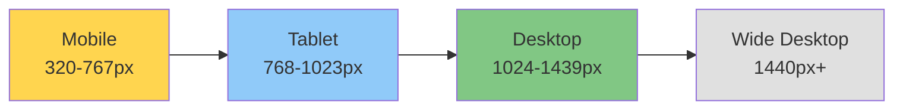

| Breakpoint | Width | Primary Device | Layout Strategy |
|------------|-------|----------------|-----------------|
| **Mobile** | 320-767px | Phones | Single column, stacked cards |
| **Tablet** | 768-1023px | Tablets | Adaptive columns, larger touch targets |
| **Desktop** | 1024-1439px | Laptops, desktops | Multi-column, full features |
| **Wide** | 1440px+ | Large monitors | Optimized spacing, max content width |

---

## Mobile-First Approach

### Design Philosophy

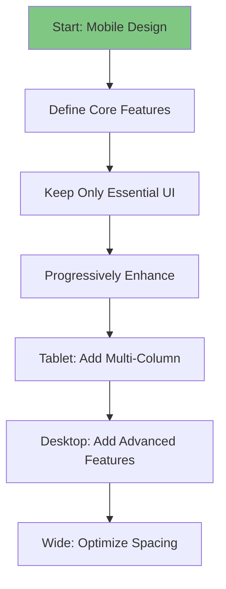

**Principle:** Design for mobile first, enhance for larger screens.

---

## Component Responsiveness

### Opportunity Cards

**Mobile (320-767px):**

```
┌──────────────────────────────────┐
│ 💰 Budget Alert    🔒 Local   ✕ │  ← Full width
├──────────────────────────────────┤
│ Food: 95% spent                  │
│ 475 EUR / 500 EUR                │
│                                  │
│ 💡 3 days left in month          │
├──────────────────────────────────┤
│ [View Details]                   │  ← Stacked buttons
│ [Adjust Budget]                  │
└──────────────────────────────────┘
```

**Tablet (768-1023px):**

```
┌────────────────────────────────────────┐
│ 💰 Budget Alert        🔒 Local     ✕ │  ← 48px padding
├────────────────────────────────────────┤
│ Food Budget: 475 EUR / 500 EUR         │
│ █████████████████████░ 95%             │
│                                        │
│ 💡 3 days remaining in month           │
├────────────────────────────────────────┤
│ [View Details]  [Adjust Budget]        │  ← Side by side
└────────────────────────────────────────┘
```

**Desktop (1024px+):**

```
┌──────────────────────────────────────────┐
│ 💰 Budget Alert        🔒 Local       ✕ │
├──────────────────────────────────────────┤
│ ████████████████████░░ 95%               │
│                                          │
│ Food: 475 EUR / 500 EUR                  │
│ You've spent 95% with 3 days left.       │
│                                          │
│ 💡 You exceeded food budget in 2 of     │
│    last 3 months. Consider adjusting.    │
├──────────────────────────────────────────┤
│ [View Transactions]  Adjust Budget       │
└──────────────────────────────────────────┘
```

---

### Dashboard Layout

**Mobile: Stacked Cards**

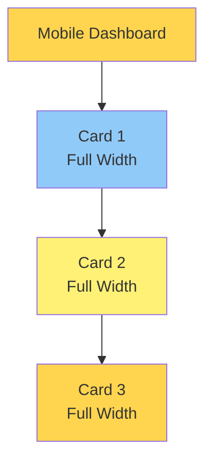

**Tablet: 2-Column Grid**

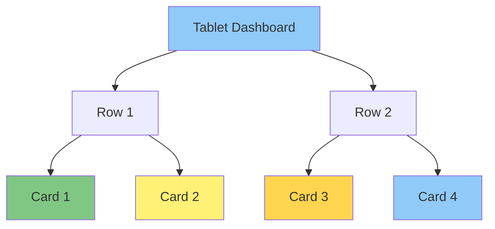

**Desktop: 3-Column Grid**

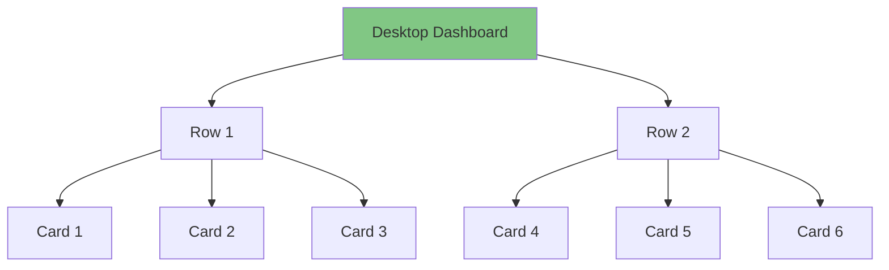

---

### Forms

**Mobile: Single Column**

```
┌──────────────────────────────────┐
│ Create Budget        🔒 Local ✕  │
├──────────────────────────────────┤
│ Category *                       │
│ [Food                         ▼] │
│                                  │
│ Amount *                         │
│ [500                        EUR] │
│                                  │
│ Period *                         │
│ [● Monthly  ○ Weekly]            │
│                                  │
│ Start Date                       │
│ [Nov 1, 2024                 📅] │
├──────────────────────────────────┤
│          [Create Budget]         │  ← Full width
│             Cancel               │
└──────────────────────────────────┘
```

**Desktop: Two Column**

```
┌──────────────────────────────────────────┐
│ Create Budget              🔒 Local    ✕ │
├──────────────────────────────────────────┤
│ Category *            Amount *           │
│ [Food             ▼]  [500         EUR]  │
│                                          │
│ Period *              Start Date         │
│ [● Monthly ○ Weekly]  [Nov 1, 2024  📅]  │
├──────────────────────────────────────────┤
│              [Create Budget]             │
│                 Cancel                   │
└──────────────────────────────────────────┘
```

---

## Touch & Interaction

### Touch Targets

**Minimum touch target sizes (WCAG AA):**

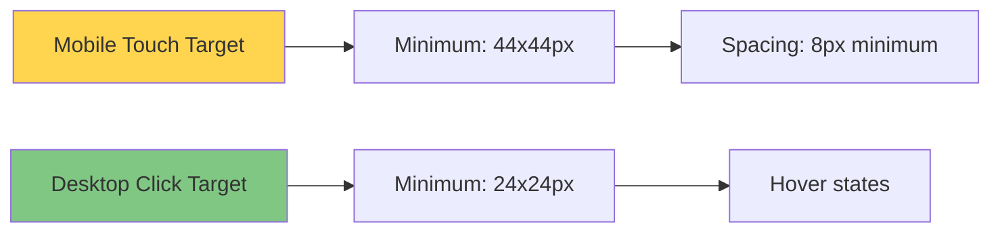

| Element | Mobile | Desktop | Reasoning |
|---------|--------|---------|-----------|
| **Button** | 48px height | 40px height | Thumb-friendly vs. cursor precision |
| **Card X button** | 44x44px | 32x32px | Easy to tap vs. visual weight |
| **Swipe area** | Full card width | Not applicable | Gesture-based |
| **Form inputs** | 48px height | 40px height | Touch typing vs. keyboard |

---

### Gestures

**Mobile Gestures:**

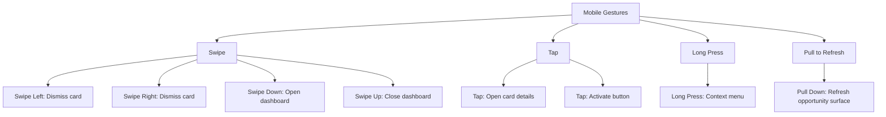

**Desktop Alternatives:**

| Mobile Gesture | Desktop Equivalent |
|----------------|--------------------|
| Swipe Left/Right | Click X button |
| Swipe Down | Click Dashboard button or Cmd+D |
| Swipe Up | Click Back or Escape key |
| Long Press | Right-click |
| Pull to Refresh | Refresh button |

---

## Navigation Patterns

### Mobile Navigation

**Bottom Navigation Bar:**

```
┌────────────────────────────────┐
│                                │
│  [Main Content Area]           │
│                                │
│                                │
└────────────────────────────────┘
┌────────────────────────────────┐
│  [🏠]  [💬]  [🔔]  [⚙️]       │  ← Bottom nav
└────────────────────────────────┘
```

**Rationale:** Thumb-reachable on large phones

---

### Tablet Navigation

**Side Navigation (Optional):**

```
┌──────┬─────────────────────────┐
│ Nav  │                         │
│      │                         │
│ 🏠   │  [Main Content]         │
│ 💬   │                         │
│ 🔔   │                         │
│ ⚙️   │                         │
│      │                         │
└──────┴─────────────────────────┘
```

**Or:** Top navigation bar (more screen space)

---

### Desktop Navigation

**Top Bar + Dashboard Access:**

```
┌──────────────────────────────────────────┐
│ [Fidus Logo]        [🔔] [⚙️] [👤]      │  ← Top bar
├──────────────────────────────────────────┤
│                                          │
│  [Main Content with Dashboard Button]   │
│                                          │
└──────────────────────────────────────────┘
```

**Dashboard Always Accessible:** Swipe down (mobile), click button, or Cmd/Ctrl+D

---

## Progressive Web App (PWA)

### PWA Core Features

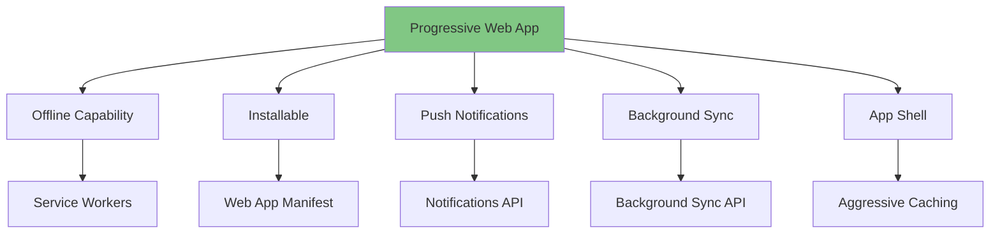

---

### Offline Capability

**Service Workers cache core functionality:**

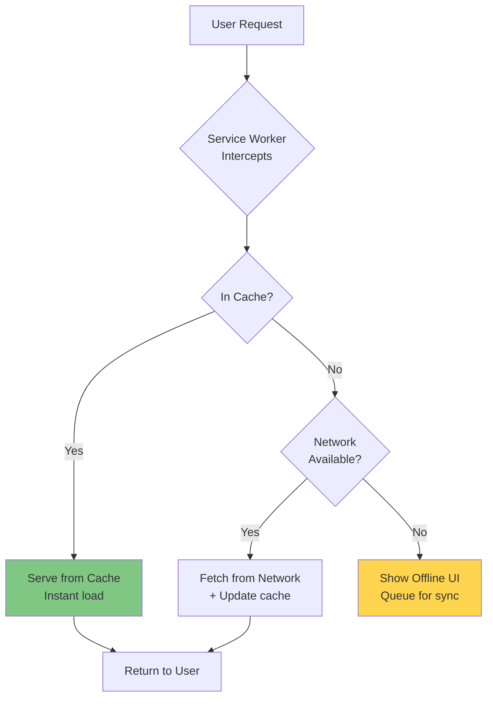

**What's Cached:**
- App shell (HTML, CSS, JS)
- Core components
- Recent opportunity cards
- User's calendar (last 7 days)
- Budget data
- UI assets (icons, images)

**What Requires Network:**
- LLM queries (if local LLM unavailable)
- External service integration (Gmail, Google Calendar)
- Plugin marketplace
- Real-time updates

---

### Offline UI Indicator

**Top Banner:**

```
┌────────────────────────────────┐
│ ⚠️ Offline Mode                │
│ Some features limited.         │
│ Changes will sync when online. │
└────────────────────────────────┘
```

**Card Indication:**

```
┌──────────────────────────────────────────┐
│ 📅 Calendar               ⚠️ Offline  ✕ │
├──────────────────────────────────────────┤
│ Showing cached events (last synced 2h ago)│
│                                          │
│ Today - October 28                       │
│ • 10:00 AM - Team Standup                │
│ • 3:00 PM - Client Review                │
│                                          │
│ 💡 New events will appear when online   │
└──────────────────────────────────────────┘
```

---

### Background Sync

**Queued Actions:**

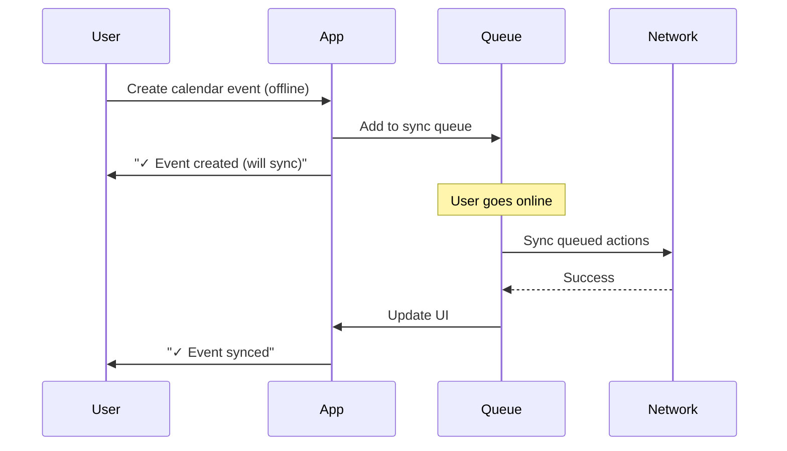

**Visual Feedback:**

```
┌────────────────────────────────┐
│ ✓ Event created                │
│ Will sync when online          │
│                                │
│ 2 pending actions              │
└────────────────────────────────┘
```

---

### Install to Home Screen

**Install Prompt:**

```
┌────────────────────────────────┐
│ 📱 Add Fidus to Home Screen    │
├────────────────────────────────┤
│ Get quick access and           │
│ work offline.                  │
│                                │
│ Benefits:                      │
│ • Faster loading               │
│ • Offline access               │
│ • Push notifications           │
│ • Native-like experience       │
│                                │
│          [Install]             │
│        Maybe Later             │
└────────────────────────────────┘
```

**Timing:** Show after 2-3 positive interactions (not immediately)

---

### Push Notifications

**Notification Types:**

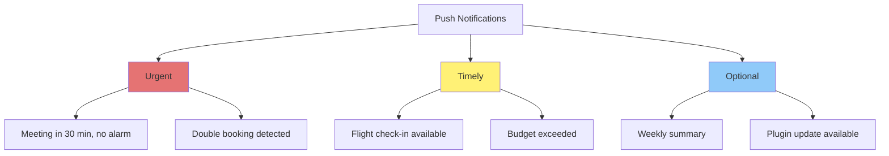

**Notification UI:**

```
┌────────────────────────────────┐
│ Fidus                   now    │
│ ⚠️ Meeting in 30 Minutes       │
│                                │
│ Client Call - 2:00 PM          │
│ No alarm set • Traffic delay   │
│                                │
│ [Set Alarm]  [View Details]    │
└────────────────────────────────┘
```

**Rich Actions:** User can act directly from notification (native capability)

---

### App Shell Architecture

**Instant Loading:**

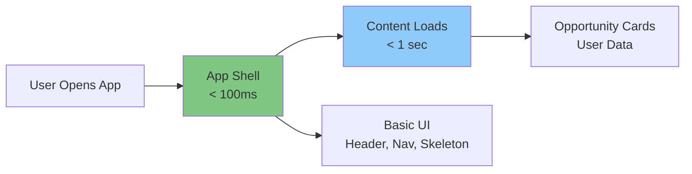

**Skeleton Screen (Loading State):**

```
┌──────────────────────────────────────────┐
│ Fidus Logo          [🔔] [⚙️] [👤]      │
├──────────────────────────────────────────┤
│                                          │
│ ┌────────────────────────────────────┐   │
│ │ ▯▯▯▯▯▯▯▯         ▯▯▯         ✕    │   │  ← Skeleton
│ ├────────────────────────────────────┤   │     card
│ │ ▯▯▯▯▯▯▯▯▯▯▯▯▯▯                    │   │
│ │ ▯▯▯▯▯▯▯▯▯▯                        │   │
│ │                                    │   │
│ │ [▯▯▯▯▯▯▯]  ▯▯▯▯▯                  │   │
│ └────────────────────────────────────┘   │
│                                          │
│ ┌────────────────────────────────────┐   │
│ │ ▯▯▯▯▯▯▯▯         ▯▯▯         ✕    │   │
│ └────────────────────────────────────┘   │
└──────────────────────────────────────────┘
```

**Real Content Replaces Skeletons:** Smooth transition (no jarring pop-in)

---

## Platform-Specific Adaptations

### iOS PWA

**Safe Areas:**

```css
/* Account for notch and home indicator */
.app-content {
  padding-top: env(safe-area-inset-top);
  padding-bottom: env(safe-area-inset-bottom);
  padding-left: env(safe-area-inset-left);
  padding-right: env(safe-area-inset-right);
}
```

**iOS-Specific Features:**
- Add to Home Screen icon (180x180px)
- Splash screen
- Status bar styling
- No browser chrome when installed

---

### Android PWA

**Android-Specific Features:**
- Maskable icon (adaptive icon support)
- Notification badges
- Share target (receive shared content)
- Shortcuts (long-press app icon)

**Shortcuts:**

```json
{
  "shortcuts": [
    {
      "name": "Check Schedule",
      "url": "/schedule",
      "icons": [{ "src": "/icons/calendar.png", "sizes": "192x192" }]
    },
    {
      "name": "View Budget",
      "url": "/budget",
      "icons": [{ "src": "/icons/finance.png", "sizes": "192x192" }]
    }
  ]
}
```

---

### Desktop PWA

**Desktop Installation:**

```
┌────────────────────────────────┐
│ Install Fidus                  │
├────────────────────────────────┤
│ Install this app for:          │
│                                │
│ ✅ Faster performance          │
│ ✅ Native-like experience      │
│ ✅ Desktop notifications       │
│ ✅ Offline access              │
│                                │
│          [Install]             │
│        No Thanks               │
└────────────────────────────────┘
```

**Desktop Features:**
- Window controls (minimize, maximize, close)
- File handling (open .fidus files)
- Keyboard shortcuts (Cmd/Ctrl+D for dashboard)
- System tray integration (optional)

---

## Performance Optimization

### Lazy Loading

**Strategy:**

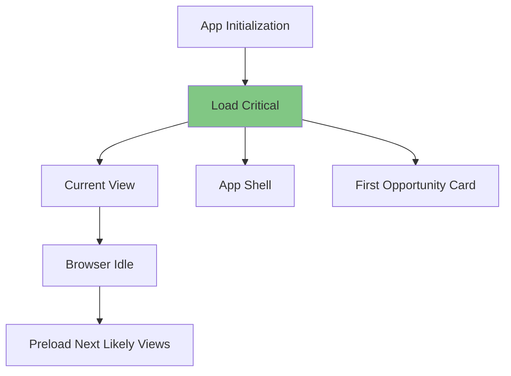

**What Loads When:**

| Priority | Resources | Timing |
|----------|-----------|--------|
| **Critical** | App shell, fonts, first card | < 100ms |
| **High** | Visible cards, core JS | < 500ms |
| **Medium** | Below-fold content | < 1s |
| **Low** | Prefetch next views | When idle |

---

### Code Splitting

**By Route:**

```javascript
// Lazy load route components
const Settings = lazy(() => import('./Settings'));
const Calendar = lazy(() => import('./Calendar'));
const Finance = lazy(() => import('./Finance'));
```

**By Component Type:**

```javascript
// Load chart library only when needed
const BudgetChart = lazy(() => import('./BudgetChart'));
```

---

## Responsive Images

### Image Strategy

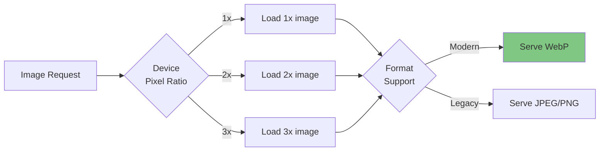

**Markup:**

```html
<picture>
  <source
    srcset="image-320w.webp 320w, image-768w.webp 768w, image-1024w.webp 1024w"
    type="image/webp"
  />
  
</picture>
```

---

## Deployment Editions

### Community Edition (Self-Hosted)

**PWA Focus:**
- Offline-first priority
- No cloud dependencies by default
- Install encouraged (no app store needed)
- Local sync only

---

### Cloud Edition

**Hybrid Approach:**
- Online/offline hybrid
- Cloud sync when available
- Optional native mobile apps (iOS, Android)
- PWA still primary

---

### Enterprise Edition

**Intranet PWA:**
- Custom PWA deployment on intranet
- Air-gapped mode support
- Custom service worker for enterprise proxy
- SSO integration

---

## Testing Strategy

### Device Testing Matrix

| Device Category | Test Devices | Key Tests |
|-----------------|--------------|-----------|
| **Mobile** | iPhone 12, Pixel 5 | Touch targets, gestures, offline |
| **Tablet** | iPad Air, Samsung Tab | Layout adaptation, keyboard |
| **Desktop** | Chrome, Firefox, Safari | Keyboard nav, PWA install |

---

### Responsive Testing

**Tools:**
- Browser DevTools (device emulation)
- Real device testing (BrowserStack)
- Lighthouse (PWA audit)
- WebPageTest (performance)

---

## Next Steps

Read next:
1. [08-privacy-trust-ux.md](08-privacy-trust-ux.md) - Privacy-transparent UI
2. [09-ai-llm-ux.md](09-ai-llm-ux.md) - AI-specific UX patterns
3. [11-accessibility.md](11-accessibility.md) - Accessibility guidelines

---

**End of Document**
