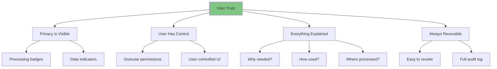
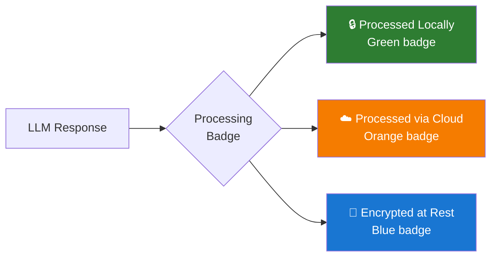
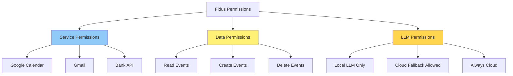

# Privacy & Trust UX

**Version:** 1.0
**Date:** 2025-10-28
**Status:** Draft (Awaiting Human Review)
**Part of:** Fidus UX/UI Design
**Author:** AI-Generated

---

## Overview

This document defines how privacy and trust manifest in Fidus's user experience. Privacy is NOT hidden in settings - it's an active, visible part of every interaction.

**Foundation:** [AI-Driven UI Paradigm](00-ai-driven-ui-paradigm.md) | [Design Principles](01-design-philosophy-principles.md)

---

## Privacy Principles

### Trust Through Transparency



---

## Privacy Indicators

### Processing Location Badges

**Every LLM response shows WHERE it was processed:**



---

### Badge Variants

**Local Processing (Default):**

```
+--------------------------------+
| Fidus              🔒 Local    |
|                                |
| You have 2 meetings today:     |
| • 10:00 AM - Team Standup      |
| • 3:00 PM - Client Review      |
+--------------------------------+

🔒 Local = Ollama LLM on your device
```

---

**Cloud Processing (Fallback):**

```
+--------------------------------+
| Fidus              ☁️ OpenAI   |
| [Why?]                         |  ← Tap to see explanation
|                                |
| Your budgets are on track:     |
| • Food: 60% (300/500 EUR)      |
| • Transport: 45% (135/300)     |
+--------------------------------+

☁️ OpenAI = Processed via cloud LLM
```

**Tap "Why?" → Explanation Modal:**

```
+------------------------------------------+
| Why Cloud Processing?        🔒 Local ✕  |
+------------------------------------------+
| Your query was processed via OpenAI      |
| instead of locally.                      |
|                                          |
| Reason:                                  |
| • Local LLM (Ollama) is offline          |
| • You allowed cloud fallback in Settings |
|                                          |
| Data Sent:                               |
| • Your query: "How's my budget?"         |
| • Anonymized budget summary              |
| • NO raw transaction data                |
| • NO personally identifiable information |
|                                          |
| Privacy Protection:                      |
| • Privacy Proxy filtered PII             |
| • Data NOT stored by OpenAI              |
| • Connection encrypted (HTTPS)           |
|                                          |
| 💡 To always use local processing:      |
|    Settings → LLM → Disable cloud fallback|
+------------------------------------------+
|                [Got It]                  |
+------------------------------------------+
```

---

### Privacy Proxy Visualization

**When PII is filtered before cloud LLM:**

```
+--------------------------------+
| Fidus            ☁️ OpenAI     |
| (PII Filtered)   [Why?]        |  ← Shows PII was filtered
|                                |
| Your expense at Store Name     |
| was 45.99 EUR.                 |
+--------------------------------+
```

**Explanation:**

```
+------------------------------------------+
| Privacy Proxy Active         🔒 Local ✕  |
+------------------------------------------+
| Personal information was filtered        |
| before sending to cloud.                 |
|                                          |
| Original Query:                          |
| "How much did I spend at Whole Foods?"   |
|                                          |
| Sent to OpenAI:                          |
| "How much did I spend at [STORE]?"       |
|                                          |
| Filtered Information:                    |
| • Store name: Whole Foods → [STORE]      |
| • Your name: [REDACTED]                  |
| • Location: [REDACTED]                   |
|                                          |
| Sent to Cloud:                           |
| • Transaction amount: 45.99 EUR ✓        |
| • Category: Food ✓                       |
| • Date: Oct 28 ✓                         |
|                                          |
| 💡 Privacy Proxy protects your identity |
|    while still getting accurate responses|
+------------------------------------------+
|                [Got It]                  |
+------------------------------------------+
```

---

## Permission System

### Permission Types



---

### Just-in-Time Permission Requests

**NEVER ask for permissions upfront. Ask when needed.**

**Example: Calendar Access**

**Context:**
- User: "Do I have meetings tomorrow?"
- Calendar supervisor needs Google Calendar access
- User has never granted this permission

**LLM Renders: Permission Request Modal**

```
+------------------------------------------+
| 🔐 Permission Needed       🔒 Local      |
+------------------------------------------+
| Calendar Access Required                 |
|                                          |
| Fidus needs permission to:               |
|                                          |
| ✅ Read your calendar events             |
| ✅ Create new events                     |
| ✅ Update existing events                |
| ❌ Delete events (not requested)         |
|                                          |
| Why Now?                                 |
| You asked: "Do I have meetings tomorrow?"|
| I need to check your calendar.           |
|                                          |
| Data Handling:                           |
| • Processed locally (Ollama)             |
| • Never sent to cloud                    |
| • Revocable anytime in Settings          |
|                                          |
| Service: Google Calendar                 |
| Account: your.email@gmail.com            |
|                                          |
| 💡 This permission is granted once and  |
|    remains active until you revoke it.   |
+------------------------------------------+
| [Allow]  [Deny]  [Learn More]            |
+------------------------------------------+
```

---

### Permission Granted Confirmation

```
+--------------------------------+
| ✅ Permission Granted          |
|                                |
| Fidus can now access your      |
| Google Calendar.               |
|                                |
| Revoke anytime in:             |
| Settings → Privacy → Permissions|
+--------------------------------+
     ↓ (2 seconds)
+--------------------------------+
| Fidus              🔒 Local    |
|                                |
| Yes, you have 2 meetings       |
| tomorrow:                      |
| • 10:00 AM - Team Standup      |
| • 3:00 PM - Client Review      |
+--------------------------------+
```

---

### Permission Management

**Settings → Privacy → Permissions:**

```
+------------------------------------------+
| 🔐 Permissions             🔒 Local    ✕ |
+------------------------------------------+
| Service Permissions                      |
|                                          |
| ✅ Google Calendar                       |
|    Granted: Oct 28, 10:15 AM             |
|    Access: Read, Create, Update          |
|    [Revoke]                              |
|                                          |
| ✅ Gmail                                 |
|    Granted: Oct 27, 9:00 AM              |
|    Access: Read emails                   |
|    [Revoke]                              |
|                                          |
| ❌ Bank Account (Plaid)                  |
|    Status: Not connected                 |
|    [Connect]                             |
+------------------------------------------+
| Data Permissions                         |
|                                          |
| Calendar Domain:                         |
| • Read events: ✅                        |
| • Create events: ✅                      |
| • Update events: ✅                      |
| • Delete events: ❌                      |
|                                          |
| Finance Domain:                          |
| • Read budgets: ✅                       |
| • Create budgets: ✅                     |
| • Read transactions: ✅                  |
| • Delete transactions: ❌                |
+------------------------------------------+
| LLM Permissions                          |
|                                          |
| Default LLM: Local (Ollama)              |
| Cloud Fallback: [✓] Allowed              |
|                                          |
| 💡 When local LLM fails, use cloud LLM  |
|    with Privacy Proxy protection.        |
|                                          |
| [Change LLM Settings]                    |
+------------------------------------------+
```

---

## Audit Log

### Purpose

**Users can see EVERYTHING Fidus does with their data.**

---

### Audit Log UI

**Settings → Privacy → Audit Log:**

```
+------------------------------------------+
| 📋 Audit Log               🔒 Local    ✕ |
+------------------------------------------+
| Filters                                  |
| Date: [Today ▼]  Domain: [All ▼]         |
| Action: [All ▼]  Processing: [All ▼]     |
|                                          |
| [Apply Filters]  [Clear]                 |
+------------------------------------------+
| Today - October 28, 2024                 |
|                                          |
| +------------------------------------+   |
| | 10:15 AM - 📅 Calendar             |   |
| | Action: Read events                |   |
| | Reason: User query "meetings       |   |
| |         tomorrow"                  |   |
| | Data Accessed: Tomorrow's events   |   |
| |                (2 events)          |   |
| | Processing: 🔒 Local (Ollama)      |   |
| | [View Details]                     |   |
| +------------------------------------+   |
|                                          |
| +------------------------------------+   |
| | 10:10 AM - 💰 Finance              |   |
| | Action: Read budget                |   |
| | Reason: Proactive opportunity      |   |
| |         detection (month-end)      |   |
| | Data Accessed: Food budget only    |   |
| | Processing: 🔒 Local (Ollama)      |   |
| | [View Details]                     |   |
| +------------------------------------+   |
|                                          |
| +------------------------------------+   |
| | 08:30 AM - ☁️ Cloud LLM            |   |
| | Action: Query sent to OpenAI       |   |
| | Reason: Local LLM offline          |   |
| | Data Sent: Anonymized query        |   |
| |            "budget status"         |   |
| | PII Filtered: Yes (Privacy Proxy)  |   |
| | Processing: ☁️ Cloud (OpenAI)      |   |
| | [View Details]                     |   |
| +------------------------------------+   |
+------------------------------------------+
| [Export as JSON]  [Delete All Logs]      |
+------------------------------------------+
```

---

### Audit Log Detail View

**User taps "View Details" on cloud LLM entry:**

```
+------------------------------------------+
| Audit Log Entry            🔒 Local    ✕ |
+------------------------------------------+
| Timestamp: Oct 28, 2024 08:30:15 AM      |
| Domain: Cloud LLM                        |
| Action: Query sent to OpenAI             |
|                                          |
| Context:                                 |
| • User query: "How's my budget?"         |
| • Local LLM: Offline (maintenance)       |
| • Cloud fallback: Enabled in Settings    |
|                                          |
| Data Sent to Cloud:                      |
| • Query: "Provide budget summary"        |
| • Budget amounts: 300 EUR, 135 EUR, 60 EUR|
| • Categories: Food, Transport, Shopping  |
|                                          |
| PII Filtering (Privacy Proxy):           |
| • User name: [REDACTED]                  |
| • Account numbers: [REDACTED]            |
| • Merchant names: [REDACTED]             |
| • Location data: [REDACTED]              |
|                                          |
| Response Received:                       |
| • "Your budgets are on track. Food 60%,  |
|   Transport 45%, Shopping 30%."          |
|                                          |
| Processing:                              |
| • Model: OpenAI GPT-4                    |
| • Connection: Encrypted (HTTPS)          |
| • Data retention: Not stored by OpenAI   |
|                                          |
| 💡 This query used cloud processing      |
|    because local LLM was unavailable.    |
+------------------------------------------+
|                [Close]                   |
+------------------------------------------+
```

---

## Data Transparency

### Data Dashboard

**Settings → Privacy → My Data:**

```
+------------------------------------------+
| 📊 My Data                 🔒 Local    ✕ |
+------------------------------------------+
| What Data Does Fidus Have?               |
|                                          |
| 📅 Calendar                              |
| • Events: 127                            |
| • Storage: 2.3 MB                        |
| • Last updated: 1 hour ago               |
| [View] [Export] [Delete]                 |
|                                          |
| 💰 Finance                               |
| • Budgets: 5                             |
| • Transactions: 234                      |
| • Storage: 0.8 MB                        |
| • Last updated: 30 min ago               |
| [View] [Export] [Delete]                 |
|                                          |
| ✉️ Communication                         |
| • Email metadata: 512 items              |
| • Storage: 1.2 MB                        |
| • Last updated: 15 min ago               |
| [View] [Export] [Delete]                 |
|                                          |
| 👤 Profile                               |
| • Name, preferences, settings            |
| • Storage: 0.1 MB                        |
| [View] [Export] [Delete]                 |
+------------------------------------------+
| Total Storage: 4.4 MB                    |
|                                          |
| [Export All Data (GDPR)]                 |
| [Delete All My Data]                     |
+------------------------------------------+
```

---

### Export Data (GDPR Compliance)

**User taps "Export All Data":**

```
+------------------------------------------+
| Export Your Data           🔒 Local    ✕ |
+------------------------------------------+
| Select data to export:                   |
|                                          |
| [✓] Calendar events                      |
| [✓] Finance data (budgets, transactions) |
| [✓] Email metadata                       |
| [✓] Profile and preferences              |
| [✓] Audit log                            |
| [✓] Permission history                   |
|                                          |
| Format:                                  |
| (● JSON  ○ CSV)                          |
|                                          |
| 💡 Exported data includes everything     |
|    Fidus knows about you.                |
|                                          |
| Estimated file size: 4.5 MB              |
+------------------------------------------+
|              [Export]                    |
|                 Cancel                   |
+------------------------------------------+
```

**Result:**

```
✓ Data exported: fidus-export-2024-10-28.json

Download started automatically.
```

---

### Delete Data

**User taps "Delete All My Data":**

```
+------------------------------------------+
| ⚠️ Delete All Data         🔒 Local      |
+------------------------------------------+
| Are you sure?                            |
|                                          |
| This will permanently delete:            |
| • All calendar events                    |
| • All finance data                       |
| • All email metadata                     |
| • Your profile and settings              |
| • Audit logs                             |
| • Permission history                     |
|                                          |
| ⚠️ This action cannot be undone.         |
|                                          |
| Type "DELETE" to confirm:                |
| [                                     ]  |
|                                          |
| 💡 Consider exporting your data first.  |
+------------------------------------------+
| [Confirm Deletion]  [Cancel]             |
+------------------------------------------+
```

---

## Encryption Indicators

### Data at Rest

**All user data encrypted at rest:**

```
+--------------------------------+
| 🔐 Your Data is Encrypted      |
+--------------------------------+
| All data stored on your device |
| is encrypted using AES-256.    |
|                                |
| Encryption Key:                |
| • Stored in secure keychain    |
| • Never leaves your device     |
| • Automatically managed        |
|                                |
| 💡 Even if someone accesses    |
|    your device files, data is  |
|    unreadable without key.     |
+--------------------------------+
```

---

### Data in Transit

**All network requests encrypted:**

```
+--------------------------------+
| 🔐 Encrypted Connection        |
+--------------------------------+
| All data sent to external      |
| services uses HTTPS encryption.|
|                                |
| Active Connections:            |
| • Google Calendar: TLS 1.3 ✓   |
| • Gmail: TLS 1.3 ✓             |
| • OpenAI: TLS 1.3 ✓            |
|                                |
| 💡 Your data is protected in   |
|    transit with industry-       |
|    standard encryption.        |
+--------------------------------+
```

---

## Trust-Building Onboarding

### Privacy-First Onboarding

**Step 2 of onboarding (after Welcome):**

```
+--------------------------------+
| 🔒 Privacy First               |
+--------------------------------+
| Your data belongs to YOU.      |
|                                |
| ✅ Processed locally by default|
|    (Your device, not cloud)    |
|                                |
| ✅ Encrypted at rest           |
|    (AES-256 encryption)        |
|                                |
| ✅ Never sold to third parties |
|    (You're not the product)    |
|                                |
| ✅ Fully transparent logging   |
|    (See everything Fidus does) |
|                                |
| ✅ Granular permissions        |
|    (You control what's shared) |
|                                |
| ✅ GDPR compliant              |
|    (Export/delete anytime)     |
|                                |
| 💡 Fidus is your faithful      |
|    companion, not a spy.       |
|                                |
|         [Next: Set Up Profile] |
|                                |
|         1/4                    |
+--------------------------------+
```

---

## Privacy Settings Quick Access

**Always visible in header:**

```
+------------------------------------------+
| [Fidus Logo]        [🔔] [🔐] [⚙️] [👤] |
|                           ↑              |
|                    Privacy Settings      |
+------------------------------------------+
```

**Tap Privacy Icon (🔐):**

```
+--------------------------------+
| 🔐 Privacy Quick Access        |
+--------------------------------+
| [📋 Audit Log]                 |
|    See what Fidus accessed     |
|                                |
| [🔐 Permissions]               |
|    Manage service access       |
|                                |
| [📊 My Data]                   |
|    View and export data        |
|                                |
| [⚙️ Privacy Settings]          |
|    Configure privacy options   |
+--------------------------------+
```

---

## Next Steps

Privacy and trust are not afterthoughts - they're core to every interaction.

Read next:
1. [09-ai-llm-ux.md](09-ai-llm-ux.md) - How LLM decisions are transparent
2. [10-multi-tenancy-ux.md](10-multi-tenancy-ux.md) - Privacy boundaries in shared contexts
3. [11-accessibility.md](11-accessibility.md) - Ensuring privacy controls are accessible

---

**End of Document**
