# Privacy & Trust UX

**Version:** 1.0
**Date:** 2025-10-28
**Status:** Draft (Awaiting Human Review)
**Part of:** Fidus UX/UI Design
**Author:** AI-Generated

---

## Overview

This document defines how privacy and trust manifest in Fidus's user experience. Privacy is NOT hidden in settings - it's an active, visible part of every interaction.

**Foundation:** [AI-Driven UI Paradigm](00-ai-driven-ui-paradigm.md) | [Design Principles](01-design-philosophy-principles.md)

---

## Privacy Principles

### Trust Through Transparency


---

## Privacy Indicators

### Processing Location Badges

**Every LLM response shows WHERE it was processed:**

```mermaid
graph LR
    Response[LLM Response] --> Badge{Processing<br/>Badge}

    Badge --> Local[🔒 Processed Locally<br/>Green badge]
    Badge --> Cloud[☁️ Processed via Cloud<br/>Orange badge]
    Badge --> Encrypted[🔐 Encrypted at Rest<br/>Blue badge]

    style Local fill:#2E7D32,color:#ffffff
    style Cloud fill:#F57C00,color:#fff
    style Encrypted fill:#1976D2,color:#fff
```



---

### Badge Variants

**Local Processing (Default):**

```
┌────────────────────────────────┐
│ Fidus              🔒 Local    │
│                                │
│ You have 2 meetings today:     │
│ • 10:00 AM - Team Standup      │
│ • 3:00 PM - Client Review      │
└────────────────────────────────┘

🔒 Local = Ollama LLM on your device
```

---

**Cloud Processing (Fallback):**

```
┌────────────────────────────────┐
│ Fidus              ☁️ OpenAI   │
│ [Why?]                         │  ← Tap to see explanation
│                                │
│ Your budgets are on track:     │
│ • Food: 60% (300/500 EUR)      │
│ • Transport: 45% (135/300)     │
└────────────────────────────────┘

☁️ OpenAI = Processed via cloud LLM
```

**Tap "Why?" → Explanation Modal:**

```
┌──────────────────────────────────────────┐
│ Why Cloud Processing?        🔒 Local ✕  │
├──────────────────────────────────────────┤
│ Your query was processed via OpenAI      │
│ instead of locally.                      │
│                                          │
│ Reason:                                  │
│ • Local LLM (Ollama) is offline          │
│ • You allowed cloud fallback in Settings │
│                                          │
│ Data Sent:                               │
│ • Your query: "How's my budget?"         │
│ • Anonymized budget summary              │
│ • NO raw transaction data                │
│ • NO personally identifiable information │
│                                          │
│ Privacy Protection:                      │
│ • Privacy Proxy filtered PII             │
│ • Data NOT stored by OpenAI              │
│ • Connection encrypted (HTTPS)           │
│                                          │
│ 💡 To always use local processing:      │
│    Settings → LLM → Disable cloud fallback│
├──────────────────────────────────────────┤
│                [Got It]                  │
└──────────────────────────────────────────┘
```

---

### Privacy Proxy Visualization

**When PII is filtered before cloud LLM:**

```
┌────────────────────────────────┐
│ Fidus            ☁️ OpenAI     │
│ (PII Filtered)   [Why?]        │  ← Shows PII was filtered
│                                │
│ Your expense at Store Name     │
│ was 45.99 EUR.                 │
└────────────────────────────────┘
```

**Explanation:**

```
┌──────────────────────────────────────────┐
│ Privacy Proxy Active         🔒 Local ✕  │
├──────────────────────────────────────────┤
│ Personal information was filtered        │
│ before sending to cloud.                 │
│                                          │
│ Original Query:                          │
│ "How much did I spend at Whole Foods?"   │
│                                          │
│ Sent to OpenAI:                          │
│ "How much did I spend at [STORE]?"       │
│                                          │
│ Filtered Information:                    │
│ • Store name: Whole Foods → [STORE]      │
│ • Your name: [REDACTED]                  │
│ • Location: [REDACTED]                   │
│                                          │
│ Sent to Cloud:                           │
│ • Transaction amount: 45.99 EUR ✓        │
│ • Category: Food ✓                       │
│ • Date: Oct 28 ✓                         │
│                                          │
│ 💡 Privacy Proxy protects your identity │
│    while still getting accurate responses│
├──────────────────────────────────────────┤
│                [Got It]                  │
└──────────────────────────────────────────┘
```

---

## Permission System

### Permission Types


---

### Just-in-Time Permission Requests

**NEVER ask for permissions upfront. Ask when needed.**

**Example: Calendar Access**

**Context:**
- User: "Do I have meetings tomorrow?"
- Calendar supervisor needs Google Calendar access
- User has never granted this permission

**LLM Renders: Permission Request Modal**

```
┌──────────────────────────────────────────┐
│ 🔐 Permission Needed       🔒 Local      │
├──────────────────────────────────────────┤
│ Calendar Access Required                 │
│                                          │
│ Fidus needs permission to:               │
│                                          │
│ ✅ Read your calendar events             │
│ ✅ Create new events                     │
│ ✅ Update existing events                │
│ ❌ Delete events (not requested)         │
│                                          │
│ Why Now?                                 │
│ You asked: "Do I have meetings tomorrow?"│
│ I need to check your calendar.           │
│                                          │
│ Data Handling:                           │
│ • Processed locally (Ollama)             │
│ • Never sent to cloud                    │
│ • Revocable anytime in Settings          │
│                                          │
│ Service: Google Calendar                 │
│ Account: your.email@gmail.com            │
│                                          │
│ 💡 This permission is granted once and  │
│    remains active until you revoke it.   │
├──────────────────────────────────────────┤
│ [Allow]  [Deny]  [Learn More]            │
└──────────────────────────────────────────┘
```

---

### Permission Granted Confirmation

```
┌────────────────────────────────┐
│ ✅ Permission Granted          │
│                                │
│ Fidus can now access your      │
│ Google Calendar.               │
│                                │
│ Revoke anytime in:             │
│ Settings → Privacy → Permissions│
└────────────────────────────────┘
     ↓ (2 seconds)
┌────────────────────────────────┐
│ Fidus              🔒 Local    │
│                                │
│ Yes, you have 2 meetings       │
│ tomorrow:                      │
│ • 10:00 AM - Team Standup      │
│ • 3:00 PM - Client Review      │
└────────────────────────────────┘
```

---

### Permission Management

**Settings → Privacy → Permissions:**

```
┌──────────────────────────────────────────┐
│ 🔐 Permissions             🔒 Local    ✕ │
├──────────────────────────────────────────┤
│ Service Permissions                      │
│                                          │
│ ✅ Google Calendar                       │
│    Granted: Oct 28, 10:15 AM             │
│    Access: Read, Create, Update          │
│    [Revoke]                              │
│                                          │
│ ✅ Gmail                                 │
│    Granted: Oct 27, 9:00 AM              │
│    Access: Read emails                   │
│    [Revoke]                              │
│                                          │
│ ❌ Bank Account (Plaid)                  │
│    Status: Not connected                 │
│    [Connect]                             │
├──────────────────────────────────────────┤
│ Data Permissions                         │
│                                          │
│ Calendar Domain:                         │
│ • Read events: ✅                        │
│ • Create events: ✅                      │
│ • Update events: ✅                      │
│ • Delete events: ❌                      │
│                                          │
│ Finance Domain:                          │
│ • Read budgets: ✅                       │
│ • Create budgets: ✅                     │
│ • Read transactions: ✅                  │
│ • Delete transactions: ❌                │
├──────────────────────────────────────────┤
│ LLM Permissions                          │
│                                          │
│ Default LLM: Local (Ollama)              │
│ Cloud Fallback: [✓] Allowed              │
│                                          │
│ 💡 When local LLM fails, use cloud LLM  │
│    with Privacy Proxy protection.        │
│                                          │
│ [Change LLM Settings]                    │
└──────────────────────────────────────────┘
```

---

## Audit Log

### Purpose

**Users can see EVERYTHING Fidus does with their data.**

---

### Audit Log UI

**Settings → Privacy → Audit Log:**

```
┌──────────────────────────────────────────┐
│ 📋 Audit Log               🔒 Local    ✕ │
├──────────────────────────────────────────┤
│ Filters                                  │
│ Date: [Today ▼]  Domain: [All ▼]         │
│ Action: [All ▼]  Processing: [All ▼]     │
│                                          │
│ [Apply Filters]  [Clear]                 │
├──────────────────────────────────────────┤
│ Today - October 28, 2024                 │
│                                          │
│ ┌────────────────────────────────────┐   │
│ │ 10:15 AM - 📅 Calendar             │   │
│ │ Action: Read events                │   │
│ │ Reason: User query "meetings       │   │
│ │         tomorrow"                  │   │
│ │ Data Accessed: Tomorrow's events   │   │
│ │                (2 events)          │   │
│ │ Processing: 🔒 Local (Ollama)      │   │
│ │ [View Details]                     │   │
│ └────────────────────────────────────┘   │
│                                          │
│ ┌────────────────────────────────────┐   │
│ │ 10:10 AM - 💰 Finance              │   │
│ │ Action: Read budget                │   │
│ │ Reason: Proactive opportunity      │   │
│ │         detection (month-end)      │   │
│ │ Data Accessed: Food budget only    │   │
│ │ Processing: 🔒 Local (Ollama)      │   │
│ │ [View Details]                     │   │
│ └────────────────────────────────────┘   │
│                                          │
│ ┌────────────────────────────────────┐   │
│ │ 08:30 AM - ☁️ Cloud LLM            │   │
│ │ Action: Query sent to OpenAI       │   │
│ │ Reason: Local LLM offline          │   │
│ │ Data Sent: Anonymized query        │   │
│ │            "budget status"         │   │
│ │ PII Filtered: Yes (Privacy Proxy)  │   │
│ │ Processing: ☁️ Cloud (OpenAI)      │   │
│ │ [View Details]                     │   │
│ └────────────────────────────────────┘   │
├──────────────────────────────────────────┤
│ [Export as JSON]  [Delete All Logs]      │
└──────────────────────────────────────────┘
```

---

### Audit Log Detail View

**User taps "View Details" on cloud LLM entry:**

```
┌──────────────────────────────────────────┐
│ Audit Log Entry            🔒 Local    ✕ │
├──────────────────────────────────────────┤
│ Timestamp: Oct 28, 2024 08:30:15 AM      │
│ Domain: Cloud LLM                        │
│ Action: Query sent to OpenAI             │
│                                          │
│ Context:                                 │
│ • User query: "How's my budget?"         │
│ • Local LLM: Offline (maintenance)       │
│ • Cloud fallback: Enabled in Settings    │
│                                          │
│ Data Sent to Cloud:                      │
│ • Query: "Provide budget summary"        │
│ • Budget amounts: 300 EUR, 135 EUR, 60 EUR│
│ • Categories: Food, Transport, Shopping  │
│                                          │
│ PII Filtering (Privacy Proxy):           │
│ • User name: [REDACTED]                  │
│ • Account numbers: [REDACTED]            │
│ • Merchant names: [REDACTED]             │
│ • Location data: [REDACTED]              │
│                                          │
│ Response Received:                       │
│ • "Your budgets are on track. Food 60%,  │
│   Transport 45%, Shopping 30%."          │
│                                          │
│ Processing:                              │
│ • Model: OpenAI GPT-4                    │
│ • Connection: Encrypted (HTTPS)          │
│ • Data retention: Not stored by OpenAI   │
│                                          │
│ 💡 This query used cloud processing      │
│    because local LLM was unavailable.    │
├──────────────────────────────────────────┤
│                [Close]                   │
└──────────────────────────────────────────┘
```

---

## Data Transparency

### Data Dashboard

**Settings → Privacy → My Data:**

```
┌──────────────────────────────────────────┐
│ 📊 My Data                 🔒 Local    ✕ │
├──────────────────────────────────────────┤
│ What Data Does Fidus Have?               │
│                                          │
│ 📅 Calendar                              │
│ • Events: 127                            │
│ • Storage: 2.3 MB                        │
│ • Last updated: 1 hour ago               │
│ [View] [Export] [Delete]                 │
│                                          │
│ 💰 Finance                               │
│ • Budgets: 5                             │
│ • Transactions: 234                      │
│ • Storage: 0.8 MB                        │
│ • Last updated: 30 min ago               │
│ [View] [Export] [Delete]                 │
│                                          │
│ ✉️ Communication                         │
│ • Email metadata: 512 items              │
│ • Storage: 1.2 MB                        │
│ • Last updated: 15 min ago               │
│ [View] [Export] [Delete]                 │
│                                          │
│ 👤 Profile                               │
│ • Name, preferences, settings            │
│ • Storage: 0.1 MB                        │
│ [View] [Export] [Delete]                 │
├──────────────────────────────────────────┤
│ Total Storage: 4.4 MB                    │
│                                          │
│ [Export All Data (GDPR)]                 │
│ [Delete All My Data]                     │
└──────────────────────────────────────────┘
```

---

### Export Data (GDPR Compliance)

**User taps "Export All Data":**

```
┌──────────────────────────────────────────┐
│ Export Your Data           🔒 Local    ✕ │
├──────────────────────────────────────────┤
│ Select data to export:                   │
│                                          │
│ [✓] Calendar events                      │
│ [✓] Finance data (budgets, transactions) │
│ [✓] Email metadata                       │
│ [✓] Profile and preferences              │
│ [✓] Audit log                            │
│ [✓] Permission history                   │
│                                          │
│ Format:                                  │
│ (● JSON  ○ CSV)                          │
│                                          │
│ 💡 Exported data includes everything     │
│    Fidus knows about you.                │
│                                          │
│ Estimated file size: 4.5 MB              │
├──────────────────────────────────────────┤
│              [Export]                    │
│                 Cancel                   │
└──────────────────────────────────────────┘
```

**Result:**

```
✓ Data exported: fidus-export-2024-10-28.json

Download started automatically.
```

---

### Delete Data

**User taps "Delete All My Data":**

```
┌──────────────────────────────────────────┐
│ ⚠️ Delete All Data         🔒 Local      │
├──────────────────────────────────────────┤
│ Are you sure?                            │
│                                          │
│ This will permanently delete:            │
│ • All calendar events                    │
│ • All finance data                       │
│ • All email metadata                     │
│ • Your profile and settings              │
│ • Audit logs                             │
│ • Permission history                     │
│                                          │
│ ⚠️ This action cannot be undone.         │
│                                          │
│ Type "DELETE" to confirm:                │
│ [                                     ]  │
│                                          │
│ 💡 Consider exporting your data first.  │
├──────────────────────────────────────────┤
│ [Confirm Deletion]  [Cancel]             │
└──────────────────────────────────────────┘
```

---

## Encryption Indicators

### Data at Rest

**All user data encrypted at rest:**

```
┌────────────────────────────────┐
│ 🔐 Your Data is Encrypted      │
├────────────────────────────────┤
│ All data stored on your device │
│ is encrypted using AES-256.    │
│                                │
│ Encryption Key:                │
│ • Stored in secure keychain    │
│ • Never leaves your device     │
│ • Automatically managed        │
│                                │
│ 💡 Even if someone accesses    │
│    your device files, data is  │
│    unreadable without key.     │
└────────────────────────────────┘
```

---

### Data in Transit

**All network requests encrypted:**

```
┌────────────────────────────────┐
│ 🔐 Encrypted Connection        │
├────────────────────────────────┤
│ All data sent to external      │
│ services uses HTTPS encryption.│
│                                │
│ Active Connections:            │
│ • Google Calendar: TLS 1.3 ✓   │
│ • Gmail: TLS 1.3 ✓             │
│ • OpenAI: TLS 1.3 ✓            │
│                                │
│ 💡 Your data is protected in   │
│    transit with industry-       │
│    standard encryption.        │
└────────────────────────────────┘
```

---

## Trust-Building Onboarding

### Privacy-First Onboarding

**Step 2 of onboarding (after Welcome):**

```
┌────────────────────────────────┐
│ 🔒 Privacy First               │
├────────────────────────────────┤
│ Your data belongs to YOU.      │
│                                │
│ ✅ Processed locally by default│
│    (Your device, not cloud)    │
│                                │
│ ✅ Encrypted at rest           │
│    (AES-256 encryption)        │
│                                │
│ ✅ Never sold to third parties │
│    (You're not the product)    │
│                                │
│ ✅ Fully transparent logging   │
│    (See everything Fidus does) │
│                                │
│ ✅ Granular permissions        │
│    (You control what's shared) │
│                                │
│ ✅ GDPR compliant              │
│    (Export/delete anytime)     │
│                                │
│ 💡 Fidus is your faithful      │
│    companion, not a spy.       │
│                                │
│         [Next: Set Up Profile] │
│                                │
│         1/4                    │
└────────────────────────────────┘
```

---

## Privacy Settings Quick Access

**Always visible in header:**

```
┌──────────────────────────────────────────┐
│ [Fidus Logo]        [🔔] [🔐] [⚙️] [👤] │
│                           ↑              │
│                    Privacy Settings      │
└──────────────────────────────────────────┘
```

**Tap Privacy Icon (🔐):**

```
┌────────────────────────────────┐
│ 🔐 Privacy Quick Access        │
├────────────────────────────────┤
│ [📋 Audit Log]                 │
│    See what Fidus accessed     │
│                                │
│ [🔐 Permissions]               │
│    Manage service access       │
│                                │
│ [📊 My Data]                   │
│    View and export data        │
│                                │
│ [⚙️ Privacy Settings]          │
│    Configure privacy options   │
└────────────────────────────────┘
```

---

## Next Steps

Privacy and trust are not afterthoughts - they're core to every interaction.

Read next:
1. [09-ai-llm-ux.md](09-ai-llm-ux.md) - How LLM decisions are transparent
2. [10-multi-tenancy-ux.md](10-multi-tenancy-ux.md) - Privacy boundaries in shared contexts
3. [11-accessibility.md](11-accessibility.md) - Ensuring privacy controls are accessible

---

**End of Document**
