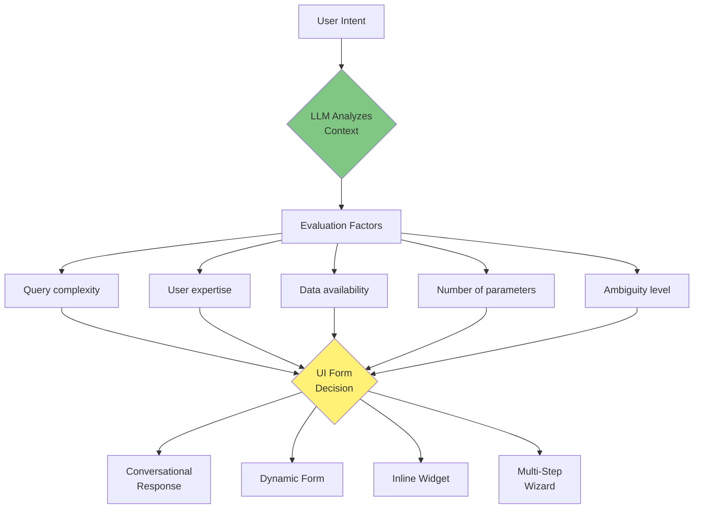
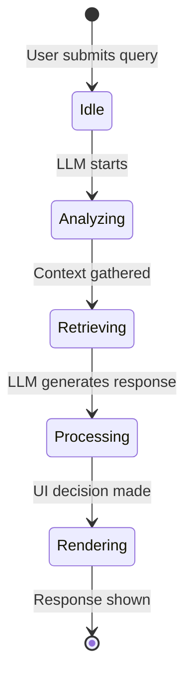
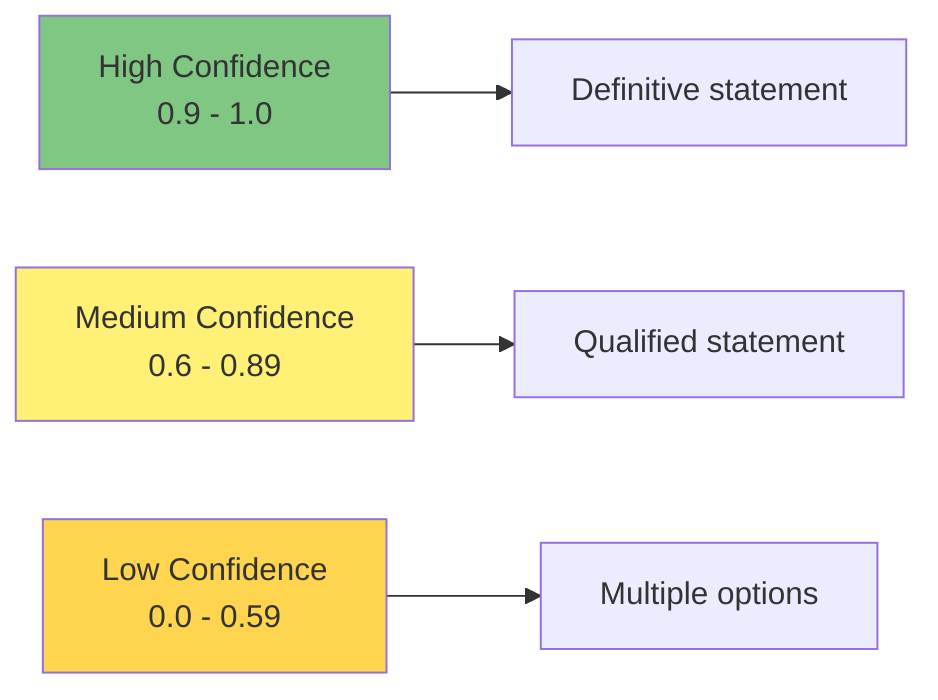
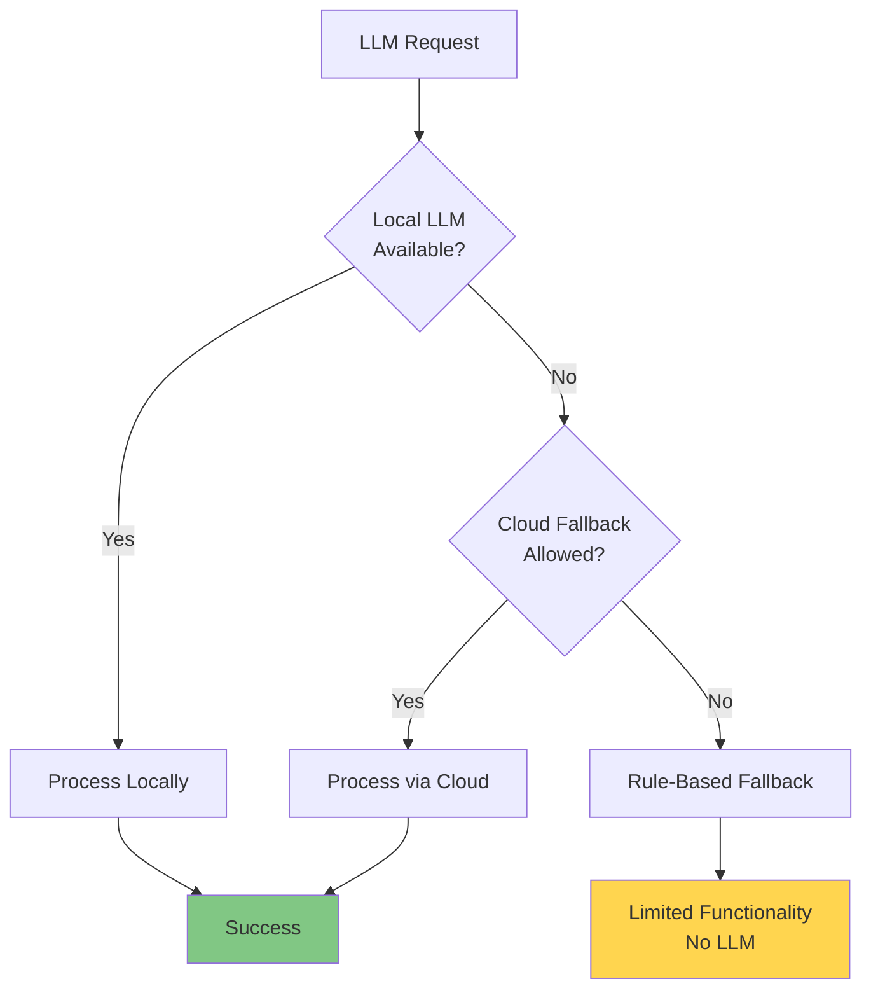
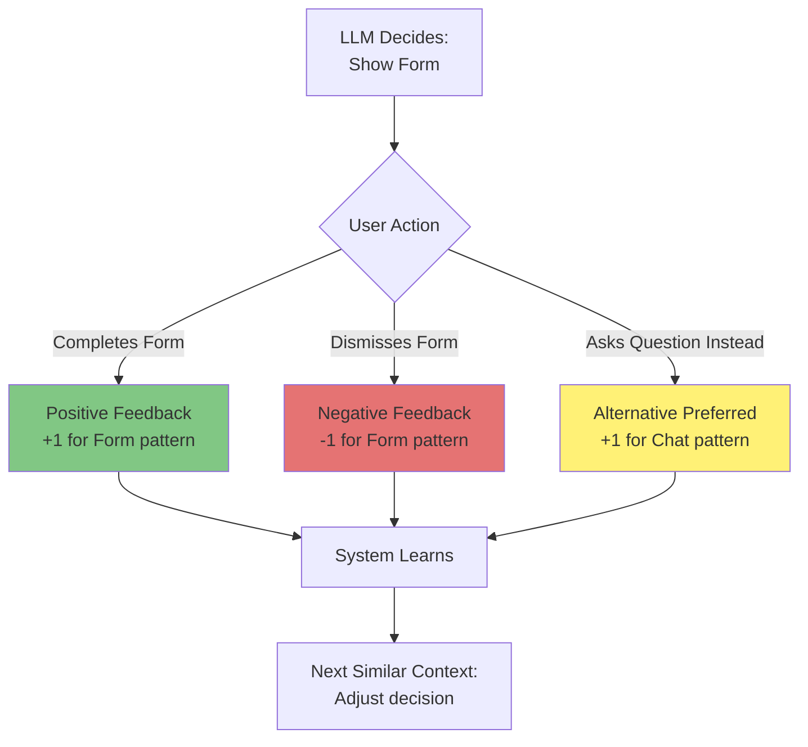

# AI & LLM-Specific UX

**Version:** 1.0
**Date:** 2025-10-28
**Status:** Draft (Awaiting Human Review)
**Part of:** Fidus UX/UI Design
**Author:** AI-Generated

---

## Overview

This document defines UX patterns specific to AI/LLM interaction. The LLM is not just a backend service - it's the **UI orchestrator** that decides what interface to render.

**Foundation:** [AI-Driven UI Paradigm](00-ai-driven-ui-paradigm.md)

---

## LLM as UI Decision Engine

### Core Concept



**Key Insight:** LLM decides UI form at runtime, not hardcoded rules.

---

## Thinking Indicators

### Purpose

**Show users that Fidus is processing**, especially for longer operations.

---

### Thinking States



---

### Visual Indicators

**Simple Thinking (< 2 seconds):**

```
┌────────────────────────────────┐
│ User                           │
│ What's my schedule today?      │
└────────────────────────────────┘

┌────────────────────────────────┐
│ Fidus is thinking...           │  ← Animated dots
│ ● ● ●                          │
└────────────────────────────────┘
```

**Animation:** Dots pulse (fade in/out)

---

**Detailed Thinking (> 2 seconds):**

```
┌────────────────────────────────┐
│ Fidus is thinking...           │
│                                │
│ ⏳ Analyzing your calendar...  │  ← Specific feedback
│                                │
│ Estimated time: 3 seconds      │
└────────────────────────────────┘
```

---

**Complex Processing (> 5 seconds):**

```
┌────────────────────────────────┐
│ Planning your trip...          │
│                                │
│ ✓ Checked calendar (3 conflicts)│  ← Progress steps
│ ⏳ Finding flights...           │
│ ○ Searching hotels...          │
│                                │
│ [Cancel]                       │  ← Allow cancellation
└────────────────────────────────┘
```

---

### Thinking Indicator Patterns

| Duration | Indicator | Cancelable | Details Shown |
|----------|-----------|------------|---------------|
| < 2s | Dots | No | Generic "Thinking..." |
| 2-5s | Dots + Step | No | Specific action |
| 5-10s | Progress steps | Yes | Multiple steps |
| > 10s | Progress bar | Yes | % complete |

---

## Confidence Visualization

### Purpose

**LLM responses have varying confidence levels.** Users should see this.

---

### Confidence Levels



---

### High Confidence (0.9+)

**Definitive statement, no hedging:**

```
┌────────────────────────────────┐
│ Fidus              🔒 Local    │
│                                │
│ You have 2 meetings today:     │
│ • 10:00 AM - Team Standup      │
│ • 3:00 PM - Client Review      │
│                                │
│ Free time: 11 AM - 2 PM        │
└────────────────────────────────┘
```

**No confidence indicator needed (default = confident)**

---

### Medium Confidence (0.6-0.89)

**Qualified language, suggestion rather than certainty:**

```
┌────────────────────────────────┐
│ Fidus              🔒 Local    │
│ Confidence: Medium             │  ← Shown explicitly
│                                │
│ Based on your spending pattern,│
│ you MIGHT exceed your food     │
│ budget in 2-3 days.            │
│                                │
│ Current: 475 EUR / 500 EUR     │
│ Average daily spend: 15 EUR    │
│                                │
│ 💡 Consider adjusting budget   │
│    or reducing spending.       │
│                                │
│ [View Details]                 │
└────────────────────────────────┘
```

**Language:** "might", "possibly", "likely", "based on"

---

### Low Confidence (< 0.6)

**Multiple options presented, user chooses:**

```
┌────────────────────────────────┐
│ Fidus              🔒 Local    │
│ Confidence: Low                │
│                                │
│ I'm not certain what you meant.│
│ Did you mean:                  │
│                                │
│ 1. Schedule a meeting with     │
│    John Smith (colleague)?     │
│                                │
│ 2. Schedule a meeting with     │
│    John Doe (client)?          │
│                                │
│ 3. Something else?             │
│                                │
│ [Option 1] [Option 2] [Other]  │
└────────────────────────────────┘
```

**Language:** "I'm not certain", "Did you mean", "Which one?"

---

### Confidence in Opportunity Cards

**High-confidence opportunities shown proactively:**

```
┌──────────────────────────────────────────┐
│ ⚠️ Meeting Conflict        🔒 Local    ✕ │
│ Confidence: High (0.95)                  │
├──────────────────────────────────────────┤
│ Double booking detected:                 │
│ • Team Meeting: 2:00 PM - 3:00 PM        │
│ • Client Call: 2:30 PM - 3:30 PM         │
│                                          │
│ 💡 Definite conflict, action needed     │
├──────────────────────────────────────────┤
│ [Reschedule One]  View Calendar          │
└──────────────────────────────────────────┘
```

**Low-confidence suggestions NOT shown proactively** (appear in chat only if user asks)

---

## Explanation UI ("Why?")

### Purpose

**Users should understand WHY Fidus suggested something.**

---

### Explanation Trigger

**Every proactive card has "Why?" button:**

```
┌──────────────────────────────────────────┐
│ 💰 Budget Alert            🔒 Local    ✕ │
│ [Why?]                                   │  ← Tap to see reasoning
├──────────────────────────────────────────┤
│ Food: 95% spent                          │
│ 475 EUR / 500 EUR                        │
│                                          │
│ 💡 3 days left in month                 │
├──────────────────────────────────────────┤
│ [View Details]  [Adjust Budget]          │
└──────────────────────────────────────────┘
```

---

### Explanation Modal

**User taps "Why?" → Modal opens:**

```
┌──────────────────────────────────────────┐
│ Why This Alert?            🔒 Local    ✕ │
├──────────────────────────────────────────┤
│ Fidus showed this budget alert because:  │
│                                          │
│ Context Factors:                         │
│ • Budget: 95% spent (475/500 EUR)        │
│ • Time: 3 days left in month             │
│ • History: Exceeded budget 2 of 3 months │
│ • Recent: Transaction 1h ago (groceries) │
│                                          │
│ Relevance Calculation:                   │
│ • Budget threshold: 0.3 (30% weight)     │
│ • Time remaining: 0.25 (25% weight)      │
│ • User history: 0.2 (20% weight)         │
│ • Recent activity: 0.15 (15% weight)     │
│                                          │
│ Total Relevance: 0.88 (High)             │
│                                          │
│ Decision:                                │
│ Show proactive card because relevance    │
│ > 0.75 threshold.                        │
│                                          │
│ 💡 This alert helps you avoid exceeding │
│    your budget again this month.         │
│                                          │
│ EU AI Act Transparency:                  │
│ System decision based on rules and data  │
│ analysis. No bias or discrimination.     │
├──────────────────────────────────────────┤
│                [Got It]                  │
└──────────────────────────────────────────┘
```

**EU AI Act Compliance:** Explain algorithmic decisions

---

## Fallback UI

### Purpose

**When LLM fails, system gracefully degrades.**

---

### Fallback Scenarios



---

### Fallback Mode Indicator

**When system switches to rule-based routing:**

```
┌────────────────────────────────┐
│ Fidus              ⚠️ Limited  │
│                                │
│ LLM temporarily unavailable.   │
│ Using rule-based mode.         │
│                                │
│ Limited features:              │
│ • Basic calendar queries       │
│ • Simple budget summaries      │
│ • No complex planning          │
│                                │
│ 💡 Full functionality returns │
│    when LLM is back online.    │
│                                │
│ [Retry LLM]  [Continue Anyway] │
└────────────────────────────────┘
```

---

### Rule-Based Response Example

**User: "Plan a trip to Paris"**

**LLM Mode (Normal):**
→ Multi-step wizard with smart suggestions

**Fallback Mode (Rule-Based):**

```
┌────────────────────────────────┐
│ Fidus              ⚠️ Limited  │
│                                │
│ Trip planning requires LLM     │
│ for best results.              │
│                                │
│ In fallback mode, I can:       │
│ • Check calendar conflicts     │
│ • Show saved trips             │
│                                │
│ But I cannot:                  │
│ • Suggest optimal dates        │
│ • Find flights/hotels          │
│ • Create smart itinerary       │
│                                │
│ [Check Calendar]  [Saved Trips]│
│                                │
│ Or: [Retry with LLM]           │
└────────────────────────────────┘
```

---

## Model Selection UI

### Purpose

**Users choose between local (Ollama) and cloud LLMs.**

---

### LLM Settings

**Settings → LLM:**

```
┌──────────────────────────────────────────┐
│ 🤖 LLM Settings            🔒 Local    ✕ │
├──────────────────────────────────────────┤
│ Default LLM Model                        │
│                                          │
│ ● Local (Ollama)          Recommended    │
│   Privacy-first, offline capable         │
│   Model: Llama 3.1 8B                    │
│   Status: ✅ Running                     │
│                                          │
│ ○ Cloud (OpenAI)                         │
│   Faster, more capable                   │
│   Model: GPT-4                           │
│   Status: ⚠️ Requires internet           │
│   Privacy: PII filtered via Privacy Proxy│
│                                          │
│ ○ Cloud (Anthropic Claude)               │
│   Advanced reasoning                     │
│   Model: Claude 3.5 Sonnet               │
│   Status: ⚠️ Requires internet           │
│                                          │
├──────────────────────────────────────────┤
│ Fallback Settings                        │
│                                          │
│ If local LLM fails:                      │
│ [✓] Try cloud LLM (OpenAI)               │
│ [ ] Use rule-based mode only             │
│                                          │
│ 💡 Cloud fallback uses Privacy Proxy    │
│    to filter personally identifiable info│
├──────────────────────────────────────────┤
│ Advanced                                 │
│                                          │
│ [Configure Ollama]                       │
│ [Test LLM Performance]                   │
│ [View Model Info]                        │
│                                          │
│              [Save Changes]              │
└──────────────────────────────────────────┘
```

---

### Model Performance Comparison

**User taps "Test LLM Performance":**

```
┌──────────────────────────────────────────┐
│ LLM Performance Test       🔒 Local    ✕ │
├──────────────────────────────────────────┤
│ Testing query: "Summarize my budget      │
│                 status for this month"   │
│                                          │
│ Local (Ollama - Llama 3.1 8B):           │
│ • Response time: 1.2 seconds             │
│ • Accuracy: High                         │
│ • Privacy: ✅ 100% local                 │
│ • Cost: Free                             │
│                                          │
│ Cloud (OpenAI GPT-4):                    │
│ • Response time: 0.8 seconds             │
│ • Accuracy: Very High                    │
│ • Privacy: ⚠️ Query sent to cloud        │
│ • Cost: $0.03 per request (approx)       │
│                                          │
│ Recommendation:                          │
│ Use Local (Ollama) for privacy.          │
│ Use Cloud (OpenAI) for complex reasoning.│
│                                          │
│ 💡 Most queries work well with local LLM│
├──────────────────────────────────────────┤
│               [Close]                    │
└──────────────────────────────────────────┘
```

---

## LLM-Driven vs Rule-Based Indicator

### Purpose

**Show users when LLM made a decision vs rule-based logic.**

---

### Indicator in Responses

**LLM-Driven:**

```
┌────────────────────────────────┐
│ Fidus              🔒 Local    │
│ (AI-Driven Decision)           │  ← LLM decided
│                                │
│ Based on your spending pattern,│
│ you might exceed your food     │
│ budget in 2-3 days.            │
│                                │
│ [Why?] ← Tap to see LLM reasoning│
└────────────────────────────────┘
```

---

**Rule-Based:**

```
┌────────────────────────────────┐
│ Fidus              🔒 Local    │
│ (Rule-Based)                   │  ← Hardcoded rule
│                                │
│ Budget exceeded: Food          │
│ 550 EUR / 500 EUR (110%)       │
│                                │
│ This is a simple threshold     │
│ check (spent > limit).         │
└────────────────────────────────┘
```

---

## Prompt Transparency (Advanced)

### For Power Users

**Settings → Advanced → LLM Prompts:**

```
┌──────────────────────────────────────────┐
│ 🔍 LLM Prompt Transparency  🔒 Local  ✕  │
├──────────────────────────────────────────┤
│ ⚠️ Advanced Feature                      │
│                                          │
│ See the actual prompts sent to LLM.      │
│                                          │
│ [✓] Show prompts in audit log            │
│ [ ] Show prompts in UI (debug mode)      │
│                                          │
│ Example Prompt (last query):             │
│                                          │
│ ┌────────────────────────────────────┐   │
│ │ System: You are Fidus, a privacy- │   │
│ │ first AI assistant. Analyze user  │   │
│ │ calendar and detect conflicts.    │   │
│ │                                   │   │
│ │ User Query: "Do I have meetings   │   │
│ │ tomorrow?"                        │   │
│ │                                   │   │
│ │ Context:                          │   │
│ │ - Tomorrow: Oct 29, 2024          │   │
│ │ - Events: 2 found                 │   │
│ │ - Event 1: 10 AM - Team Standup  │   │
│ │ - Event 2: 3 PM - Client Review   │   │
│ │                                   │   │
│ │ Task: Provide concise summary.    │   │
│ └────────────────────────────────────┘   │
│                                          │
│ 💡 This helps you understand how Fidus │
│    generates responses.                  │
├──────────────────────────────────────────┤
│              [Close]                     │
└──────────────────────────────────────────┘
```

---

## Learning Feedback Loop

### Purpose

**System learns from user interactions to improve UI decisions.**

---

### Feedback Mechanism



---

### Feedback UI

**Subtle, non-intrusive:**

```
┌────────────────────────────────┐
│ [User just completed form]     │
└────────────────────────────────┘

┌────────────────────────────────┐
│ ✓ Event created                │
│                                │
│ Was this form helpful?         │
│ [👍 Yes]  [👎 No]              │  ← Quick feedback
└────────────────────────────────┘
```

**User taps 👎:**

```
┌────────────────────────────────┐
│ Thanks for the feedback!       │
│                                │
│ What would you prefer?         │
│ [ ] Conversational wizard      │
│ [ ] Chat-based instead         │
│ [ ] Other (tell us)            │
│                                │
│ [Submit]  [Skip]               │
└────────────────────────────────┘
```

---

## Next Steps

The LLM is the brain of Fidus, orchestrating UI and making decisions.

Read next:
1. [10-multi-tenancy-ux.md](10-multi-tenancy-ux.md) - How LLM adapts to tenant contexts
2. [11-accessibility.md](11-accessibility.md) - Making LLM-driven UI accessible
3. [08-privacy-trust-ux.md](08-privacy-trust-ux.md) - Privacy in LLM processing

---

**End of Document**
