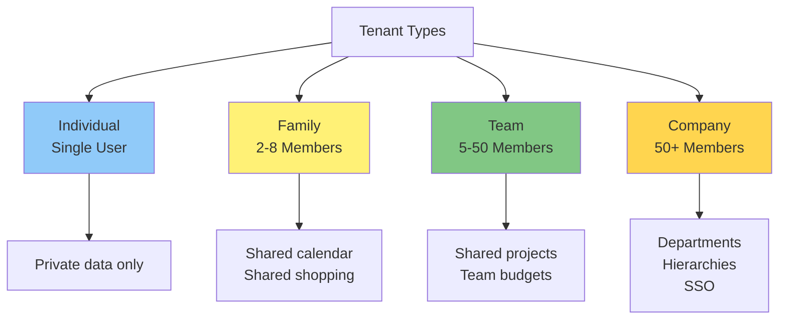
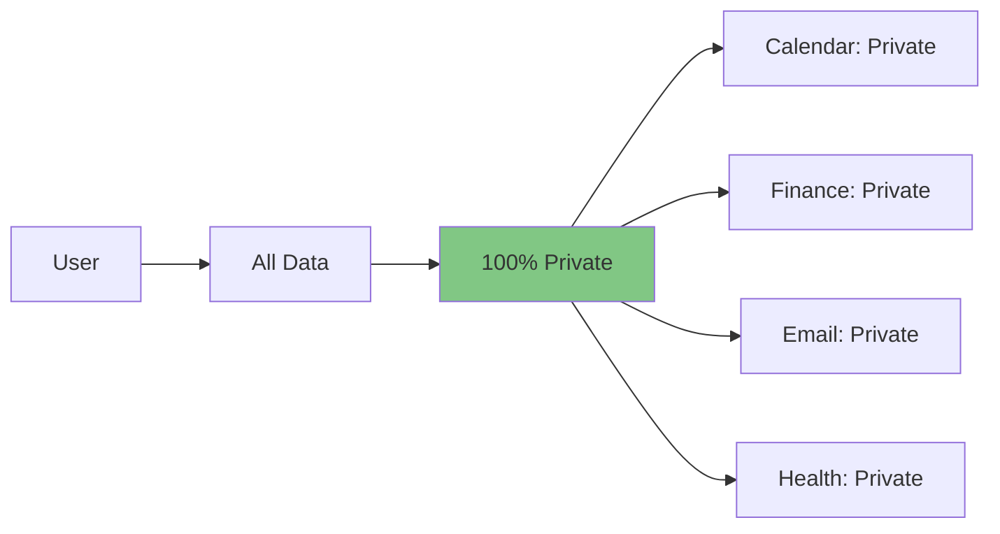
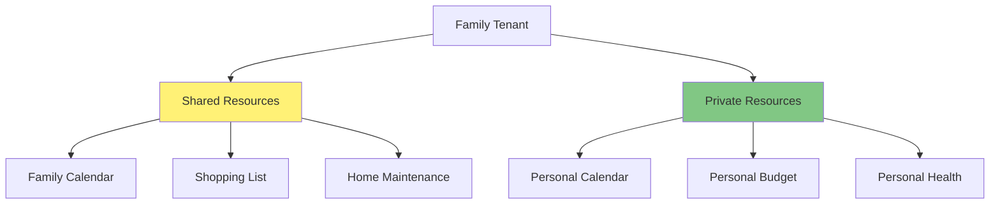
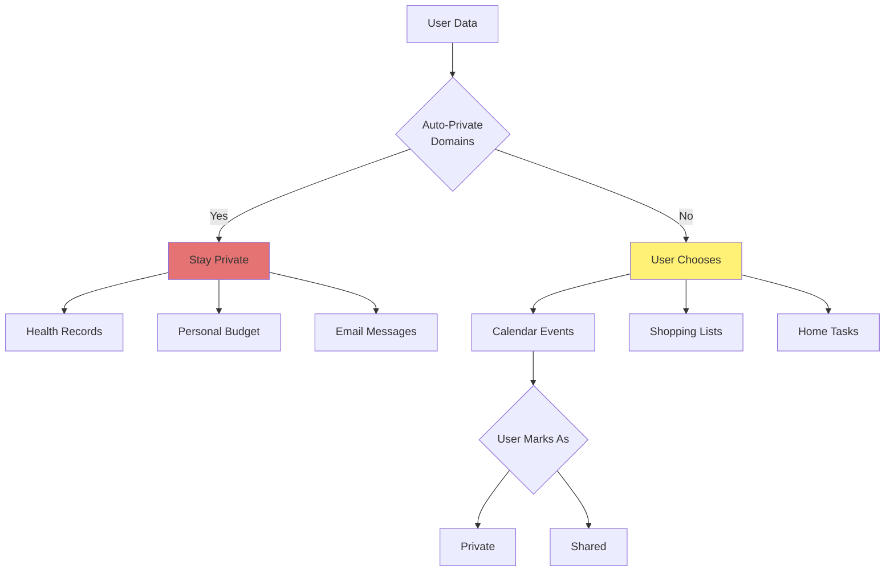
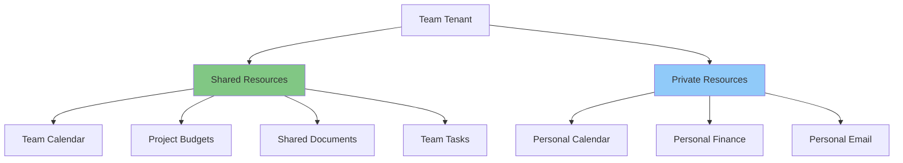
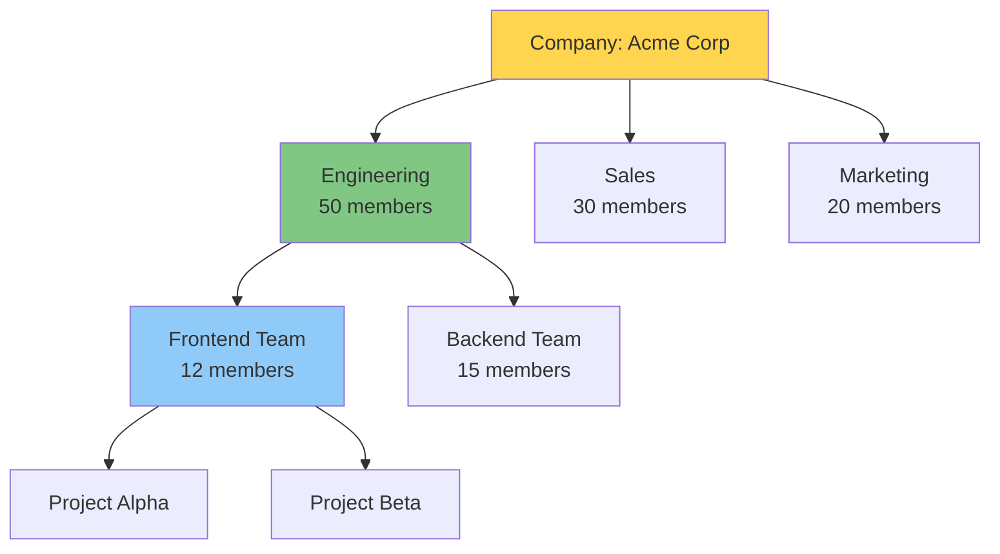

# Multi-Tenancy UX

**Version:** 1.0
**Date:** 2025-10-28
**Status:** Draft (Awaiting Human Review)
**Part of:** Fidus UX/UI Design
**Author:** AI-Generated

---

## Overview

This document defines UX patterns for multi-user, family, team, and company contexts. Fidus supports **multiple tenant types** with different privacy boundaries and sharing models.

**Foundation:** [AI-Driven UI Paradigm](00-ai-driven-ui-paradigm.md) | [Privacy & Trust UX](08-privacy-trust-ux.md)

---

## Tenant Types

### Hierarchy



| Tenant Type | Members | Key Features | Use Case |
|-------------|---------|--------------|----------|
| **Individual** | 1 | Private only | Personal use |
| **Family** | 2-8 | Shared calendars, shopping lists | Household management |
| **Team** | 5-50 | Shared projects, team budgets | Small business, projects |
| **Company** | 50+ | Departments, roles, SSO | Enterprise use |

---

## Tenant Switcher

### UI Location

**Top-right corner, always visible:**

```
┌──────────────────────────────────────────┐
│ [Fidus Logo]        [🔔] [⚙️] [👤▾]     │
│                                    ↑     │
│                          Tenant Switcher │
└──────────────────────────────────────────┘
```

---

### Switcher Menu

**User taps profile icon (👤▾):**

```
┌────────────────────────────────┐
│ Switch Context                 │
├────────────────────────────────┤
│ ● Personal                     │  ← Currently active
│   You                          │
│                                │
│ ○ Family                       │
│   The Herdens (4 members)      │
│                                │
│ ○ Work Team                    │
│   Engineering (12 members)     │
│                                │
│ ○ Company                      │
│   Acme Corp (256 members)      │
│                                │
├────────────────────────────────┤
│ [+ Create New Tenant]          │
│                                │
│ [Manage Tenants]               │
└────────────────────────────────┘
```

---

### Context Switch Confirmation

**User switches to Family context:**

```
┌────────────────────────────────┐
│ Switched to Family             │
├────────────────────────────────┤
│ Now viewing:                   │
│ • Shared family calendar       │
│ • Shared shopping lists        │
│ • Family budget (if shared)    │
│                                │
│ Your personal data remains     │
│ private in Personal context.   │
│                                │
│ [Got It]                       │
└────────────────────────────────┘
```

---

## Individual Tenant

### Characteristics

**Single user, all data private:**



**No sharing, no permissions needed.**

---

## Family Tenant

### Shared Resources



---

### Family Calendar

**Shows merged view: shared + personal events:**

```
┌──────────────────────────────────────────┐
│ Family Calendar            🏠 Family   ✕ │
├──────────────────────────────────────────┤
│ Today - October 28                       │
│                                          │
│ 🏠 School Drop-off (9:00 AM)             │
│    Shared • Sarah                        │
│                                          │
│ 👤 Your: Team Meeting (10:00 AM)         │
│    Private                               │
│                                          │
│ 🏠 Soccer Practice (4:00 PM)             │
│    Shared • Kids                         │
│                                          │
│ 👤 Your: Client Call (5:00 PM)           │
│    Private                               │
│                                          │
│ 🏠 Family Dinner (7:00 PM)               │
│    Shared • Everyone                     │
│                                          │
├──────────────────────────────────────────┤
│ Legend:                                  │
│ 🏠 Shared events (visible to family)     │
│ 👤 Your private events (only you)        │
│                                          │
│ [Add Family Event] [Add Private Event]   │
└──────────────────────────────────────────┘
```

**Key:** Private events show as "Busy" to family, no details shared

---

### Shared Shopping List

```
┌──────────────────────────────────────────┐
│ Family Shopping List       🏠 Family   ✕ │
├──────────────────────────────────────────┤
│ Groceries                                │
│ ☑ Milk (2L) • Added by Sarah             │
│ □ Bread • Added by You                   │
│ □ Eggs (dozen) • Added by John           │
│                                          │
│ Household                                │
│ □ Dish soap • Added by Sarah             │
│ □ Laundry detergent • Added by You       │
│                                          │
│ Last Updated: 10 minutes ago by Sarah    │
│                                          │
├──────────────────────────────────────────┤
│ [+ Add Item]  [Share List]  [Clear Done] │
└──────────────────────────────────────────┘
```

**Real-time Sync:** Changes visible to all family members instantly

---

### Privacy Boundaries in Family

**Automatic Privacy Rules:**



**Always Private (Cannot Share):**
- Health records
- Personal email
- Personal finance (unless explicitly shared)

**User Chooses:**
- Calendar events (mark private or shared)
- Shopping lists
- Home maintenance tasks

---

### Family Member Roles

**Settings → Family → Members:**

```
┌──────────────────────────────────────────┐
│ Family Members             🏠 Family   ✕ │
├──────────────────────────────────────────┤
│ Sarah Herden (You)                       │
│ Role: Owner                              │
│ Access: Full access                      │
│                                          │
│ John Herden                              │
│ Role: Admin                              │
│ Access: Can manage family settings       │
│ [Edit Role] [Remove]                     │
│                                          │
│ Emma Herden (12)                         │
│ Role: Child                              │
│ Access: Limited (parent-controlled)      │
│ Restrictions: Cannot delete shared events│
│ [Edit Role] [Remove]                     │
│                                          │
│ Max Herden (9)                           │
│ Role: Child                              │
│ Access: Limited (parent-controlled)      │
│ [Edit Role] [Remove]                     │
│                                          │
├──────────────────────────────────────────┤
│ [+ Invite Family Member]                 │
└──────────────────────────────────────────┘
```

**Roles:**
- **Owner:** Full control, can delete tenant
- **Admin:** Can manage settings and members
- **Member:** Standard access
- **Child:** Restricted access (parent-controlled)

---

## Team Tenant

### Shared Resources



---

### Team Calendar

**Shows team events + projects:**

```
┌──────────────────────────────────────────┐
│ Team Calendar              👥 Team     ✕ │
├──────────────────────────────────────────┤
│ This Week - Nov 4-8                      │
│                                          │
│ Monday, Nov 4                            │
│ 👥 Sprint Planning (9:00 AM - 11:00 AM) │
│    All Team • Zoom                       │
│                                          │
│ 👤 Your: Client Call (2:00 PM)           │
│    Private                               │
│                                          │
│ Tuesday, Nov 5                           │
│ 👥 Design Review (10:00 AM)              │
│    Design Team • Office                  │
│                                          │
│ 👤 Your: Busy (2:00 PM - 3:00 PM)        │
│    Details hidden                        │
│                                          │
│ Friday, Nov 8                            │
│ 👥 Demo Day (3:00 PM)                    │
│    All Team • Auditorium                 │
│                                          │
├──────────────────────────────────────────┤
│ Legend:                                  │
│ 👥 Team events (visible to team)         │
│ 👤 Your events (private or "Busy")       │
│                                          │
│ [Add Team Event] [Add Private Event]     │
└──────────────────────────────────────────┘
```

---

### Shared Project Budget

```
┌──────────────────────────────────────────┐
│ Project Budget             👥 Team     ✕ │
├──────────────────────────────────────────┤
│ Project: Website Redesign                │
│                                          │
│ Budget: 50,000 EUR                       │
│ Spent: 32,500 EUR (65%)                  │
│ Remaining: 17,500 EUR                    │
│                                          │
│ Breakdown:                               │
│ • Design: 15,000 EUR (100% used)         │
│ • Development: 12,500 EUR (50% used)     │
│ • Marketing: 5,000 EUR (0% used)         │
│                                          │
│ Recent Expenses:                         │
│ • Oct 27: Freelancer payment - 2,500 EUR │
│   Added by Sarah                         │
│ • Oct 25: Software license - 500 EUR     │
│   Added by John                          │
│                                          │
│ 💡 Team members can view, only admins   │
│    can edit budget.                      │
│                                          │
├──────────────────────────────────────────┤
│ [View Transactions] [Add Expense]        │
└──────────────────────────────────────────┘
```

---

### Team Permissions

**Role-Based Access Control (RBAC):**

```
┌──────────────────────────────────────────┐
│ Team Roles                 👥 Team     ✕ │
├──────────────────────────────────────────┤
│ Sarah Herden (You)                       │
│ Role: Owner                              │
│ Permissions: Full access                 │
│                                          │
│ John Smith                               │
│ Role: Admin                              │
│ Permissions:                             │
│ • View team calendar ✅                  │
│ • Edit team calendar ✅                  │
│ • View budgets ✅                        │
│ • Edit budgets ✅                        │
│ • Manage members ✅                      │
│ [Edit Role]                              │
│                                          │
│ Emma Johnson                             │
│ Role: Member                             │
│ Permissions:                             │
│ • View team calendar ✅                  │
│ • Edit team calendar ❌                  │
│ • View budgets ✅                        │
│ • Edit budgets ❌                        │
│ [Edit Role]                              │
│                                          │
│ Max Lee                                  │
│ Role: Viewer                             │
│ Permissions:                             │
│ • View team calendar ✅                  │
│ • Edit team calendar ❌                  │
│ • View budgets ❌                        │
│ [Edit Role]                              │
│                                          │
├──────────────────────────────────────────┤
│ [+ Invite Team Member]                   │
└──────────────────────────────────────────┘
```

---

## Company Tenant

### Hierarchical Structure



---

### Department Switcher

**In Company context:**

```
┌────────────────────────────────┐
│ Switch Department              │
├────────────────────────────────┤
│ ● Engineering                  │  ← Current
│   Your department (50 members) │
│                                │
│ ○ Sales                        │
│   View-only (30 members)       │
│                                │
│ ○ Marketing                    │
│   View-only (20 members)       │
│                                │
│ ○ Company-Wide                 │
│   All departments (256 members)│
└────────────────────────────────┘
```

---

### SSO Integration

**Company Edition uses Single Sign-On:**

```
┌────────────────────────────────┐
│ Sign In to Acme Corp           │
├────────────────────────────────┤
│ [Sign In with Okta]            │
│                                │
│ [Sign In with Azure AD]        │
│                                │
│ [Sign In with Google Workspace]│
│                                │
│ ─────────── or ────────────    │
│                                │
│ Email                          │
│ [your.email@acmecorp.com    ]  │
│                                │
│ [Continue]                     │
└────────────────────────────────┘
```

---

### Company-Wide Calendar

**Hierarchical view:**

```
┌──────────────────────────────────────────┐
│ Company Calendar           🏢 Acme     ✕ │
├──────────────────────────────────────────┤
│ View: [Engineering ▼]                    │
│                                          │
│ This Week - Nov 4-8                      │
│                                          │
│ 🏢 All-Hands Meeting (Mon 9:00 AM)       │
│    Company-wide • Main Auditorium        │
│                                          │
│ 🔧 Engineering Sync (Mon 10:00 AM)       │
│    Engineering Dept • Zoom               │
│                                          │
│ 👥 Frontend Sprint Planning (Tue 9:00 AM)│
│    Your team • Room 301                  │
│                                          │
│ 👤 Your: Busy (Tue 2:00 PM)              │
│    Details hidden                        │
│                                          │
│ 🏢 Q4 Review (Fri 3:00 PM)               │
│    Company-wide • Auditorium             │
│                                          │
├──────────────────────────────────────────┤
│ Legend:                                  │
│ 🏢 Company-wide (all employees)          │
│ 🔧 Department (Engineering)              │
│ 👥 Team (Frontend Team)                  │
│ 👤 Personal (private)                    │
└──────────────────────────────────────────┘
```

---

## Inviting Members

### Family Invitation

**Settings → Family → Invite Member:**

```
┌──────────────────────────────────────────┐
│ Invite Family Member       🏠 Family   ✕ │
├──────────────────────────────────────────┤
│ Email or Phone                           │
│ [john@example.com                     ]  │
│                                          │
│ Role                                     │
│ (● Adult  ○ Child)                       │
│                                          │
│ Permissions                              │
│ [✓] Can view shared calendar             │
│ [✓] Can edit shared calendar             │
│ [✓] Can add to shopping list             │
│ [ ] Can manage family settings (Admin)   │
│                                          │
│ 💡 Invited member will receive email    │
│    and must accept to join.              │
│                                          │
│ Privacy Notice:                          │
│ Family members can see:                  │
│ • Shared calendar events                 │
│ • Shared shopping lists                  │
│ • Shared home tasks                      │
│                                          │
│ They CANNOT see:                         │
│ • Your private calendar events           │
│ • Your personal finance                  │
│ • Your health records                    │
│ • Your personal email                    │
│                                          │
│              [Send Invitation]           │
│                 Cancel                   │
└──────────────────────────────────────────┘
```

---

### Invitation Acceptance

**Invitee receives email → clicks link:**

```
┌────────────────────────────────┐
│ Join Family                    │
├────────────────────────────────┤
│ Sarah Herden invited you to    │
│ join "The Herdens" family.     │
│                                │
│ You'll be able to:             │
│ • View and edit family calendar│
│ • Access shared shopping list  │
│ • Collaborate on home tasks    │
│                                │
│ Your Privacy:                  │
│ ✅ Your personal data stays    │
│    private in your Personal    │
│    context.                    │
│                                │
│ ✅ You control what to share   │
│    with family.                │
│                                │
│ ✅ You can leave family anytime│
│                                │
│        [Accept Invitation]     │
│              Decline           │
└────────────────────────────────┘
```

---

## Shared Resource Notifications

### Who Did What?

**Notification when family member modifies shared resource:**

```
┌──────────────────────────────────────────┐
│ 🏠 Family Calendar Update                │
├──────────────────────────────────────────┤
│ John added a new event:                  │
│                                          │
│ "Family Dinner"                          │
│ Nov 10, 7:00 PM - 9:00 PM                │
│ Location: Home                           │
│                                          │
│ [View Event]  [Dismiss]                  │
└──────────────────────────────────────────┘
```

**Transparency: Users always see WHO made changes.**

---

## Context Indicator

### Always Visible

**Top-left corner shows current context:**

```
┌──────────────────────────────────────────┐
│ [🏠 Family] [Fidus Logo] [🔔] [⚙️] [👤▾]│
│    ↑                                     │
│  Context indicator                       │
└──────────────────────────────────────────┘
```

**Changes color based on context:**
- **Personal:** Blue
- **Family:** Yellow
- **Team:** Green
- **Company:** Orange

---

## Privacy Boundaries Visualization

### Clear Visual Separation

```
┌────────────────────────────────┐
│ Personal Context (Blue)        │
├────────────────────────────────┤
│ • Your calendar                │
│ • Your budget                  │
│ • Your health                  │
│ • Your email                   │
│                                │
│ 🔒 100% Private                │
└────────────────────────────────┘

┌────────────────────────────────┐
│ Family Context (Yellow)        │
├────────────────────────────────┤
│ • Shared calendar              │
│ • Shared shopping list         │
│ • Shared home tasks            │
│                                │
│ 🔓 Shared with 4 family members│
└────────────────────────────────┘
```

---

## Next Steps

Multi-tenancy enables collaboration while preserving privacy.

Read next:
1. [11-accessibility.md](11-accessibility.md) - Accessible multi-tenant UI
2. [08-privacy-trust-ux.md](08-privacy-trust-ux.md) - Privacy in shared contexts
3. [06-contextual-ui-patterns.md](06-contextual-ui-patterns.md) - How domains adapt to tenant type

---

**End of Document**
