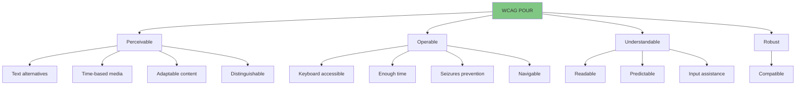
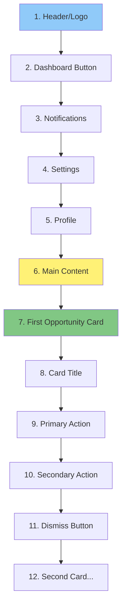
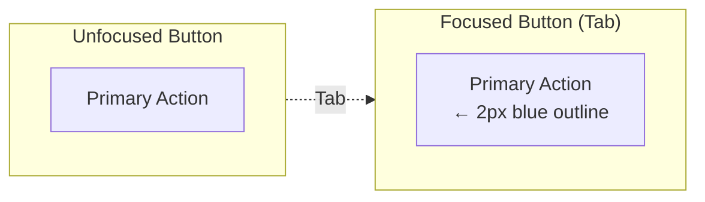
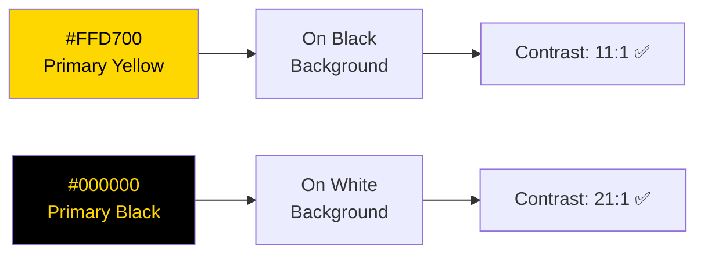

# Accessibility Guidelines

**Version:** 1.0
**Date:** 2025-10-28
**Status:** Draft (Awaiting Human Review)
**Part of:** Fidus UX/UI Design
**Author:** AI-Generated

---

## Overview

This document defines accessibility guidelines for Fidus. **Accessibility is not a feature - it's a requirement.** Every component must be usable by everyone, regardless of ability.

**Standard:** WCAG 2.1 AA (minimum) | **Goal:** AAA where possible

**Foundation:** [Design System](05-design-system-components.md) | [Interaction Patterns](04-interaction-patterns.md)

---

## WCAG 2.1 AA Compliance

### Four Principles (POUR)



---

## Keyboard Navigation

### Core Requirement

**ALL functionality must be keyboard-accessible.**

---

### Navigation Keys

| Key | Function | Usage |
|-----|----------|-------|
| **Tab** | Move focus forward | Navigate between interactive elements |
| **Shift+Tab** | Move focus backward | Navigate backwards |
| **Enter** | Activate element | Click buttons, open cards |
| **Space** | Activate button/checkbox | Activate currently focused element |
| **Escape** | Dismiss/Close | Close modals, dismiss cards |
| **Arrow Keys** | Navigate within | Navigate lists, menus, date pickers |
| **Cmd/Ctrl+D** | Dashboard shortcut | Open opportunity surface |

---

### Focus Order

**Logical, predictable focus order:**



---

### Focus Indicators

**All interactive elements MUST show focus state:**



**CSS:**

```css
/* ❌ NEVER do this */
:focus {
  outline: none;
}

/* ✅ CORRECT */
:focus {
  outline: 2px solid var(--info-blue);
  outline-offset: 2px;
}

/* ✅ ALTERNATIVE (custom) */
:focus {
  box-shadow: 0 0 0 3px rgba(25, 118, 210, 0.4);
}
```

**Contrast:** Focus indicator MUST have 3:1 contrast ratio with background

---

### Keyboard Shortcuts

**Global Shortcuts:**

| Shortcut | Action | Context |
|----------|--------|---------|
| **Cmd/Ctrl+D** | Open Dashboard | Any view |
| **Cmd/Ctrl+K** | Open Command Palette | Any view |
| **Cmd/Ctrl+,** | Open Settings | Any view |
| **Escape** | Dismiss topmost element | Cards, modals |

**Dashboard Shortcuts:**

| Shortcut | Action |
|----------|--------|
| **Tab** | Focus next card |
| **Shift+Tab** | Focus previous card |
| **Enter** | Open focused card |
| **Escape** | Dismiss focused card |
| **Space** | Activate focused button |

---

### Skip Links

**Allow skipping repetitive content:**

```
[Skip to Main Content] ← Visible on focus
```

**Implementation:**

```html
<a href="#main-content" class="skip-link">
  Skip to Main Content
</a>

<!-- Later in DOM -->
<main id="main-content">
  <!-- Main content -->
</main>
```

**CSS:**

```css
.skip-link {
  position: absolute;
  top: -40px;
  left: 0;
  background: var(--color-primary-yellow);
  color: var(--color-primary-black);
  padding: 8px;
  text-decoration: none;
  z-index: 100;
}

.skip-link:focus {
  top: 0;
}
```

---

## Screen Reader Support

### Semantic HTML

**Always use semantic elements:**

```html
<!-- ❌ WRONG -->
<div class="button" onclick="...">Click me</div>

<!-- ✅ CORRECT -->
<button type="button">Click me</button>

<!-- ❌ WRONG -->
<div class="card">Card content</div>

<!-- ✅ CORRECT -->
<article role="article" aria-label="Budget alert card">
  Card content
</article>
```

---

### ARIA Labels

**Provide context for screen readers:**

**Opportunity Card:**

```html
<article
  role="article"
  aria-labelledby="card-title-1"
  aria-describedby="card-description-1"
  tabindex="0"
>
  <header>
    <h3 id="card-title-1">Budget Alert</h3>
    <button aria-label="Dismiss budget alert card">✕</button>
  </header>

  <div id="card-description-1">
    <p>Food budget 95% spent. 475 EUR of 500 EUR used.</p>
  </div>

  <footer>
    <button>View Transactions</button>
    <a href="/budget/adjust">Adjust Budget</a>
  </footer>
</article>
```

**Screen Reader Announces:**
> "Article. Budget Alert. Food budget 95% spent. 475 EUR of 500 EUR used. Button: View Transactions. Link: Adjust Budget. Button: Dismiss budget alert card."

---

### Live Regions

**Announce dynamic content changes:**

```html
<!-- Opportunity card appears -->
<div role="alert" aria-live="assertive" aria-atomic="true">
  New budget alert: Food budget 95% spent
</div>

<!-- Less urgent update -->
<div role="status" aria-live="polite" aria-atomic="true">
  Budget data refreshed
</div>
```

**Levels:**
- `aria-live="assertive"` - Interrupt user (urgent alerts)
- `aria-live="polite"` - Announce when user pauses (status updates)
- `aria-live="off"` - Don't announce (default)

---

### Dismissal Accessibility

**Swipe gesture MUST have keyboard alternative:**

```html
<article class="opportunity-card">
  <!-- Card content -->

  <button
    class="dismiss-button"
    aria-label="Dismiss budget alert card"
    data-shortcut="Escape"
  >
    ✕
  </button>
</article>
```

**Keyboard:** Tab to card → Press Escape to dismiss

**Screen Reader:** "Button. Dismiss budget alert card. Press Escape."

---

## Color Contrast

### WCAG AA Requirements

| Element | Contrast Ratio | Fidus Compliance |
|---------|----------------|------------------|
| **Normal Text** (< 18pt) | 4.5:1 | ✅ Black on White: 21:1 |
| **Large Text** (≥ 18pt) | 3:1 | ✅ Yellow on Black: 11:1 |
| **UI Components** | 3:1 | ✅ Borders, icons |
| **Focus Indicators** | 3:1 | ✅ Blue outline: 5.4:1 |

---

### Brand Colors Contrast

**From [Brand Identity](../branding/fidus-brand-identity-en.md):**



**All brand colors meet WCAG AA!**

---

### Semantic Colors Contrast

**From [Design System](05-design-system-components.md):**

| Color | Usage | Contrast on White | WCAG |
|-------|-------|-------------------|------|
| **Success Green** | #4CAF50 | 4.5:1 | ✅ AA |
| **Warning Orange** | #FF9800 | 4.5:1 | ✅ AA |
| **Error Red** | #F44336 | 5.2:1 | ✅ AA |
| **Info Blue** | #2196F3 | 4.6:1 | ✅ AA |

---

### Don't Rely Solely on Color

**Use multiple indicators:**

```
❌ BAD (Color only):
Success: Green text "Budget saved"
Error: Red text "Budget failed"

✅ GOOD (Color + Icon + Text):
Success: [✓] Green text "Budget saved"
Error: [✕] Red text "Budget failed"
```

---

## Text & Typography

### Font Sizes

**Minimum sizes:**

| Element | Size | Purpose |
|---------|------|---------|
| **Body Text** | 16px | Primary content (NEVER smaller) |
| **Secondary Text** | 14px | Helper text, captions |
| **Small Text** | 12px | Timestamps, metadata (sparingly) |

**❌ NEVER use text smaller than 12px** (except legal disclaimers)

---

### Line Height

**Readable line spacing:**

```css
body {
  line-height: 1.5; /* WCAG AA: minimum 1.5 for body text */
}

p {
  line-height: 1.5;
}

h1, h2, h3 {
  line-height: 1.2; /* Headings can be tighter */
}
```

---

### Text Spacing

**Users must be able to increase spacing without breaking layout:**

**WCAG AA requirements:**
- Line height: At least 1.5× font size
- Paragraph spacing: At least 2× font size
- Letter spacing: At least 0.12× font size
- Word spacing: At least 0.16× font size

**Implementation:** Use relative units (em, rem), not absolute (px)

---

## Alternative Text

### Images

**All images MUST have alt text:**

```html
<!-- ❌ WRONG -->


<!-- ✅ CORRECT -->

```

**Decorative images:**

```html

```

---

### Icons

**Icon-only buttons MUST have labels:**

```html
<!-- ❌ WRONG -->
<button>✕</button>

<!-- ✅ CORRECT (aria-label) -->
<button aria-label="Dismiss budget alert card">✕</button>

<!-- ✅ CORRECT (visually hidden text) -->
<button>
  <span class="sr-only">Dismiss budget alert card</span>
  <span aria-hidden="true">✕</span>
</button>
```

---

## Forms

### Labels

**All inputs MUST have associated labels:**

```html
<!-- ❌ WRONG (no label) -->
<input type="text" placeholder="Category" />

<!-- ✅ CORRECT (explicit label) -->
<label for="budget-category">Category *</label>
<input type="text" id="budget-category" required />

<!-- ✅ ALTERNATIVE (implicit label) -->
<label>
  Category *
  <input type="text" required />
</label>
```

---

### Error Messages

**Associate errors with inputs:**

```html
<label for="budget-amount">Amount *</label>
<input
  type="number"
  id="budget-amount"
  aria-describedby="amount-error"
  aria-invalid="true"
  required
/>
<span id="amount-error" role="alert">
  Amount must be greater than 0
</span>
```

**Screen Reader Announces:**
> "Amount. Required. Edit text. Invalid. Amount must be greater than 0."

---

### Required Fields

**Mark clearly:**

```html
<!-- Visual indicator -->
<label for="category">
  Category <span aria-label="required">*</span>
</label>
<input type="text" id="category" required />

<!-- OR explicit text -->
<label for="category">
  Category (required)
</label>
<input type="text" id="category" required />
```

---

## Motion & Animation

### Respect Reduced Motion

**Respect user's motion preferences:**

```css
/* Default: Animations enabled */
.opportunity-card {
  transition: transform 0.3s ease-out;
}

.opportunity-card:hover {
  transform: translateY(-2px);
}

/* Reduced motion: No animations */
@media (prefers-reduced-motion: reduce) {
  .opportunity-card {
    transition: none;
  }

  .opportunity-card:hover {
    transform: none;
  }
}
```

**Apply to:**
- Card animations (fade in/out)
- Hover effects (lift on hover)
- Page transitions
- Loading spinners (replace with static indicator)

---

### No Auto-Play

**NEVER auto-play videos or audio:**

```html
<!-- ❌ WRONG -->
<video autoplay>...</video>

<!-- ✅ CORRECT -->
<video controls>
  <track kind="captions" src="captions.vtt" srclang="en" label="English" />
</video>
```

**User MUST control media playback.**

---

## Time Limits

### No Timeouts on User Actions

**Critical:** Fidus NEVER auto-dismisses cards on timeout.

**WCAG Compliance:**
- User can extend time limit before it expires
- User can turn off time limit
- OR: Time limit > 20 hours (essentially no limit)

**Fidus Approach:** **No time limits.** User controls dismissal.

---

## Voice & Screen Reader Testing

### Test with Real Tools

**Test on:**
- **macOS:** VoiceOver (Cmd+F5)
- **Windows:** NVDA (free) or JAWS
- **iOS:** VoiceOver (Settings → Accessibility)
- **Android:** TalkBack (Settings → Accessibility)

---

### VoiceOver Example

**Opportunity Card announced:**

```
VoiceOver: "Article. Budget Alert. Food budget 95% spent. 475 EUR of 500 EUR used. 3 days left in month. Button: View Transactions. Button: Adjust Budget. Button: Dismiss."

User: [Tab]

VoiceOver: "View Transactions button. To activate, press Control-Option-Space."

User: [Control-Option-Space]

VoiceOver: "View Transactions activated. Loading transactions..."
```

---

## Accessibility Checklist

### For Every Component

- [ ] **Keyboard navigable** (Tab, Enter, Escape, Arrows)
- [ ] **Screen reader compatible** (semantic HTML, ARIA labels)
- [ ] **Color contrast WCAG AA** (4.5:1 for text, 3:1 for UI)
- [ ] **Focus indicators visible** (2px outline, 3:1 contrast)
- [ ] **Alt text for images/icons**
- [ ] **No time-based auto-hide** (user controls dismissal)
- [ ] **Error messages announced** (aria-live or role="alert")
- [ ] **Form labels associated** (for or implicit label)
- [ ] **Motion respects preferences** (prefers-reduced-motion)
- [ ] **No color-only indicators** (use icon + color + text)

---

### For Opportunity Cards

- [ ] `role="article"` or `role="alert"` (urgent)
- [ ] `aria-labelledby` pointing to card title
- [ ] `aria-describedby` pointing to card content
- [ ] Dismiss button has `aria-label="Dismiss [card type] card"`
- [ ] Escape key dismisses card
- [ ] Tab navigates through card actions
- [ ] Screen reader announces card appearance (if urgent)

---

### For Forms

- [ ] All inputs have `<label>` (explicit or implicit)
- [ ] Required fields marked with `required` attribute
- [ ] Error messages use `aria-describedby` and `aria-invalid`
- [ ] Error messages announced immediately (role="alert")
- [ ] Field help text associated with `aria-describedby`
- [ ] Form validation on submit, not on change (user controls pace)

---

### For Modals/Dialogs

- [ ] Focus trapped within modal (can't Tab out)
- [ ] Escape key closes modal
- [ ] Focus returns to trigger element after close
- [ ] `role="dialog"` and `aria-modal="true"`
- [ ] `aria-labelledby` points to dialog title
- [ ] Screen reader announces dialog opening

---

## Accessibility Testing Tools

### Automated Tools

**Use these tools, but DON'T rely solely on them:**

- **axe DevTools** (Browser extension) - Catches 30-40% of issues
- **WAVE** (Web Accessibility Evaluation Tool) - Visual feedback
- **Lighthouse** (Chrome DevTools) - Accessibility audit
- **Pa11y** (CLI tool) - Automated testing in CI/CD

---

### Manual Testing Required

**Automated tools catch ~40% of issues. Manual testing is essential.**

**Manual Tests:**
1. **Keyboard-only navigation** (unplug mouse)
2. **Screen reader testing** (VoiceOver, NVDA, JAWS)
3. **Zoom to 200%** (text must remain readable)
4. **High contrast mode** (Windows High Contrast)
5. **Reduced motion** (System Settings)
6. **Real users** (include people with disabilities)

---

## Common Pitfalls

### Avoid These

**❌ Keyboard Traps:**
```html
<!-- User can Tab in but can't Tab out -->
<div tabindex="0">Trap</div>
```

**❌ Missing Alt Text:**
```html

```

**❌ Placeholder as Label:**
```html
<input type="text" placeholder="Email" />
<!-- Placeholder disappears on focus! Use <label> -->
```

**❌ Color-Only Indicators:**
```html
<span style="color: red;">Error</span>
<!-- Use icon + color + text -->
```

**❌ No Focus Indicator:**
```css
:focus { outline: none; }
<!-- NEVER remove outline without replacement -->
```

---

## Next Steps

Accessibility is ongoing. Test early, test often.

Related documents:
1. [05-design-system-components.md](05-design-system-components.md) - Accessible component design
2. [04-interaction-patterns.md](04-interaction-patterns.md) - Keyboard-accessible patterns
3. [07-responsive-pwa.md](07-responsive-pwa.md) - Touch target sizes

---

## Resources

**Learn More:**
- [WCAG 2.1 Guidelines](https://www.w3.org/WAI/WCAG21/quickref/)
- [WebAIM](https://webaim.org/) - Practical accessibility resources
- [A11y Project](https://www.a11yproject.com/) - Community-driven checklist
- [Inclusive Components](https://inclusive-components.design/) - Accessible patterns

**Tools:**
- [axe DevTools](https://www.deque.com/axe/devtools/)
- [WAVE](https://wave.webaim.org/)
- [Pa11y](https://pa11y.org/)
- [Contrast Checker](https://webaim.org/resources/contrastchecker/)

---

**End of Document**
