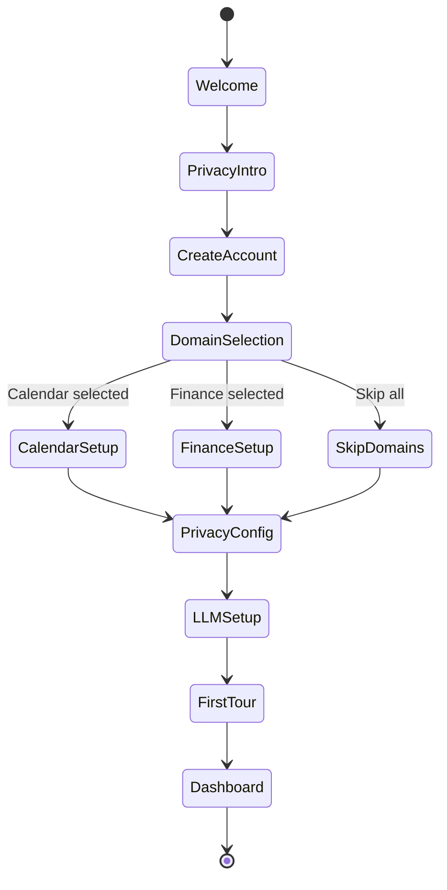

# Onboarding UX

**Status:** ✅ Complete
**Last Updated:** 2025-01-28
**Owner:** UX/UI Team

---

## Table of Contents

1. [Overview](#overview)
2. [Onboarding Philosophy](#onboarding-philosophy)
3. [Onboarding Flow](#onboarding-flow)
4. [Step-by-Step Wizard](#step-by-step-wizard)
5. [Domain Configuration](#domain-configuration)
6. [Privacy Setup](#privacy-setup)
7. [First Experience](#first-experience)
8. [Progressive Disclosure](#progressive-disclosure)
9. [Accessibility](#accessibility)
10. [Best Practices](#best-practices)

---

## 1. Overview

Fidus onboarding is designed to be **fast, privacy-focused, and progressive**. Users should get value within 5 minutes while understanding Fidus's privacy-first approach.

### Design Goals

1. **Fast to Value** - First opportunity within 5 minutes
2. **Privacy-First** - Clear privacy guarantees upfront
3. **Progressive** - Don't overwhelm, reveal features over time
4. **Flexible** - Skip optional steps, customize later
5. **Educational** - Teach AI-driven UI paradigm

### Onboarding Metrics

| Metric | Target | Measurement |
|--------|--------|-------------|
| Time to First Opportunity | < 5 minutes | From signup to first Opportunity Card shown |
| Setup Completion Rate | > 80% | Users who complete core setup (steps 1-3) |
| Domain Activation | > 3 domains | Average domains enabled per user |
| Privacy Understanding | > 90% | Users who correctly answer privacy quiz question |

---

## 2. Onboarding Philosophy

### Privacy-First Onboarding

**Core Principle:** Users must understand and trust Fidus's privacy model before providing any data.

```
Traditional Onboarding:        Fidus Onboarding:
┌─────────────────┐           ┌─────────────────┐
│ 1. Sign up      │           │ 1. Privacy      │
│ 2. Add data     │           │ 2. Sign up      │
│ 3. Privacy (?)  │           │ 3. Add data     │
└─────────────────┘           └─────────────────┘
       ❌ Privacy last              ✅ Privacy first
```

### Progressive Disclosure

Don't show everything at once. Reveal features as users need them:

**Week 1:** Core domains (Calendar, Finance)
**Week 2:** Proactive suggestions introduction
**Week 3:** Advanced domains (Travel, Health)
**Week 4+:** Power user features (multi-tenancy, voice)

### Value-First Approach

Show value before asking for data:

```
❌ BAD: "Connect your calendar"
✅ GOOD: "Let me help you avoid double-bookings. Connect your calendar?"
```

---

## 3. Onboarding Flow

### Flow Diagram



### Flow Steps

| Step | Required | Duration | Goal |
|------|----------|----------|------|
| 1. Welcome | ✅ Required | 30s | Introduce AI-driven paradigm |
| 2. Privacy Intro | ✅ Required | 60s | Build trust, explain privacy |
| 3. Create Account | ✅ Required | 60s | Account creation |
| 4. Domain Selection | ✅ Required | 90s | Choose 2-3 domains to start |
| 5. Domain Setup | ⚠️ Optional | 2-3 min | Configure selected domains |
| 6. Privacy Config | ✅ Required | 60s | Set privacy preferences |
| 7. LLM Setup | ✅ Required | 30s | Choose LLM provider |
| 8. First Tour | ⚠️ Optional | 90s | Quick tour of Opportunity Surface |
| **Total** | | **5-8 min** | Ready to use |

---

## 4. Step-by-Step Wizard

### Step 1: Welcome Screen

**Goal:** Introduce Fidus and AI-driven UI paradigm in 30 seconds.

```
┌────────────────────────────────────────────────────────┐
│                                                        │
│              ✨ Welcome to Fidus                       │
│                                                        │
│         Your Privacy-First AI Personal Assistant      │
│                                                        │
│  ┌────────────────────────────────────────────────┐   │
│  │                                                │   │
│  │   Instead of you searching through apps,      │   │
│  │   Fidus brings opportunities to you.          │   │
│  │                                                │   │
│  │   🤖 AI finds patterns in your data           │   │
│  │   📊 Shows relevant cards on your dashboard   │   │
│  │   🔒 All processing stays on your device      │   │
│  │                                                │   │
│  └────────────────────────────────────────────────┘   │
│                                                        │
│              [Get Started] →                           │
│                                                        │
│              ────────────────────                      │
│              1 ● ○ ○ ○ ○ ○ ○ ○                        │
└────────────────────────────────────────────────────────┘
```

**Key Messages:**
- AI-driven dashboard (not app switching)
- Privacy-first (processing on device)
- Value proposition (save time, avoid mistakes)

**Interaction:**
- Auto-advances after 15s OR user clicks "Get Started"
- Progress indicator shows 8 total steps

---

### Step 2: Privacy Introduction

**Goal:** Build trust by explaining privacy model BEFORE asking for account.

```
┌────────────────────────────────────────────────────────┐
│                                                        │
│           🔒 Your Privacy, Your Control                │
│                                                        │
│  Fidus is different from other AI assistants:         │
│                                                        │
│  ✅ All AI runs locally on your device                │
│     No data sent to our servers                       │
│                                                        │
│  ✅ You own your data                                 │
│     Export or delete anytime                          │
│                                                        │
│  ✅ Open source & auditable                           │
│     See exactly what we do with your data             │
│                                                        │
│  ✅ No tracking or profiling                          │
│     We don't know what you do in Fidus                │
│                                                        │
│  ┌────────────────────────────────────────────────┐   │
│  │ 💡 Quiz: Where is your data processed?        │   │
│  │                                                │   │
│  │ ( ) On Fidus servers                           │   │
│  │ (•) On my device only                          │   │
│  │ ( ) On Google servers                          │   │
│  └────────────────────────────────────────────────┘   │
│                                                        │
│  [← Back]               [Continue] →                   │
│                                                        │
│              ────────────────────                      │
│              1 2 ● ○ ○ ○ ○ ○ ○                        │
└────────────────────────────────────────────────────────┘
```

**Interactive Quiz:**
- Forces engagement with privacy model
- Must answer correctly to continue
- Incorrect answer shows explanation

**Privacy Badge:**
```
┌──────────────────────────────┐
│ 🔒 Privacy Guarantee         │
│                              │
│ ✓ Local AI processing        │
│ ✓ No data sent to cloud      │
│ ✓ You own your data          │
│                              │
│ [Read Full Privacy Policy]   │
└──────────────────────────────┘
```

---

### Step 3: Create Account

**Goal:** Minimal friction account creation (email + password only).

```
┌────────────────────────────────────────────────────────┐
│                                                        │
│              Create Your Fidus Account                 │
│                                                        │
│  ┌─────────────────────────────────────────────────┐  │
│  │ Email *                                         │  │
│  │ ┌─────────────────────────────────────────────┐ │  │
│  │ │ you@example.com                             │ │  │
│  │ └─────────────────────────────────────────────┘ │  │
│  └─────────────────────────────────────────────────┘  │
│                                                        │
│  ┌─────────────────────────────────────────────────┐  │
│  │ Password *                                      │  │
│  │ ┌─────────────────────────────────────────────┐ │  │
│  │ │ ••••••••••••                                │ │  │
│  │ └─────────────────────────────────────────────┘ │  │
│  │                                                 │  │
│  │ Password Strength: Strong ✅                   │  │
│  │ ✓ At least 8 characters                        │  │
│  │ ✓ Includes numbers                             │  │
│  │ ✓ Includes special characters                  │  │
│  └─────────────────────────────────────────────────┘  │
│                                                        │
│  ☑ I agree to the [Terms of Service] and              │
│     [Privacy Policy]                                   │
│                                                        │
│  [← Back]               [Create Account] →             │
│                                                        │
│              ────────────────────                      │
│              1 2 3 ● ○ ○ ○ ○ ○                        │
└────────────────────────────────────────────────────────┘
```

**Validation Rules:**
- Email: Must be valid format
- Password: Min 8 chars, 1 number, 1 special char
- Real-time validation (see [04-interaction-patterns.md](04-interaction-patterns.md#8-form-validation-patterns))

**No Required:**
- Name (asked later, optional)
- Phone number (never required)
- Payment info (free tier)
- Social login (privacy risk)

---

### Step 4: Domain Selection

**Goal:** Let users choose 2-3 domains to start (avoid overwhelming).

```
┌────────────────────────────────────────────────────────┐
│                                                        │
│          Which areas should Fidus help with?           │
│                                                        │
│  Choose 2-3 to start. You can add more later.         │
│                                                        │
│  ┌──────────────────┐  ┌──────────────────┐           │
│  │ 📅 Calendar      │  │ 💰 Finance       │           │
│  │                  │  │                  │           │
│  │ Avoid double-    │  │ Track spending,  │           │
│  │ bookings, get    │  │ budget alerts    │           │
│  │ prep reminders   │  │                  │           │
│  │                  │  │                  │           │
│  │ [✓ Selected]     │  │ [✓ Selected]     │           │
│  └──────────────────┘  └──────────────────┘           │
│                                                        │
│  ┌──────────────────┐  ┌──────────────────┐           │
│  │ ✈️ Travel        │  │ 💬 Communication │           │
│  │                  │  │                  │           │
│  │ Coordinate trips,│  │ Smart email      │           │
│  │ book flights     │  │ management       │           │
│  │                  │  │                  │           │
│  │ [  Add  ]        │  │ [  Add  ]        │           │
│  └──────────────────┘  └──────────────────┘           │
│                                                        │
│  ┌──────────────────┐  ┌──────────────────┐           │
│  │ 🏥 Health        │  │ 🏠 Home          │           │
│  │                  │  │                  │           │
│  │ Track medical    │  │ Maintenance      │           │
│  │ appointments     │  │ reminders        │           │
│  │                  │  │                  │           │
│  │ [  Add  ]        │  │ [  Add  ]        │           │
│  └──────────────────┘  └──────────────────┘           │
│                                                        │
│  Selected: 2/8 domains                                 │
│                                                        │
│  [← Back]          [Skip]      [Continue] →            │
│                                                        │
│              ────────────────────                      │
│              1 2 3 4 ● ○ ○ ○ ○                        │
└────────────────────────────────────────────────────────┘
```

**Recommended Defaults:**
- **Pre-select Calendar + Finance** (most universally useful)
- Allow deselection
- Show value proposition for each domain

**Domain Cards Include:**
- Icon + Name
- One-sentence value prop
- Selection state (✓ Selected or [ Add ])

**Validation:**
- Minimum 1 domain required
- Can skip and add later

---

### Step 5: Domain Setup (Example: Calendar)

**Goal:** Quick configuration of selected domains (1-2 min per domain).

**Calendar Setup:**

```
┌────────────────────────────────────────────────────────┐
│                                                        │
│           📅 Set Up Calendar                           │
│                                                        │
│  Connect your calendars to let Fidus:                  │
│  • Detect scheduling conflicts                         │
│  • Suggest meeting prep time                           │
│  • Remind you of upcoming events                       │
│                                                        │
│  ┌─────────────────────────────────────────────────┐  │
│  │ Calendar Provider                               │  │
│  │ ┌─────────────────────────────────────────────┐ │  │
│  │ │ Select provider...                ▼         │ │  │
│  │ └─────────────────────────────────────────────┘ │  │
│  │                                                 │  │
│  │ Options:                                        │  │
│  │ • Google Calendar                               │  │
│  │ • Microsoft Outlook                             │  │
│  │ • iCloud Calendar                               │  │
│  │ • CalDAV (self-hosted)                          │  │
│  └─────────────────────────────────────────────────┘  │
│                                                        │
│  ┌─────────────────────────────────────────────────┐  │
│  │ 🔒 Privacy Note                                 │  │
│  │                                                 │  │
│  │ Calendar data stays on your device.             │  │
│  │ We only read events to detect conflicts.        │  │
│  │ We NEVER share or upload your calendar.         │  │
│  └─────────────────────────────────────────────────┘  │
│                                                        │
│  [← Back]       [Skip Calendar]      [Connect] →       │
│                                                        │
│              ────────────────────                      │
│              1 2 3 4 5 ● ○ ○ ○                        │
└────────────────────────────────────────────────────────┘
```

**After Connection:**

```
┌────────────────────────────────────────────────────────┐
│                                                        │
│           ✅ Calendar Connected                        │
│                                                        │
│  Found 3 calendars:                                    │
│                                                        │
│  ☑ Work Calendar (primary)                            │
│  ☑ Personal Calendar                                  │
│  ☐ US Holidays (read-only)                            │
│                                                        │
│  ┌─────────────────────────────────────────────────┐  │
│  │ Notification Preferences                        │  │
│  │                                                 │  │
│  │ ☑ Remind me 15 min before events                │  │
│  │ ☑ Suggest prep time for meetings                │  │
│  │ ☑ Alert me of double bookings                   │  │
│  └─────────────────────────────────────────────────┘  │
│                                                        │
│  [← Back]                            [Continue] →      │
│                                                        │
│              ────────────────────                      │
│              1 2 3 4 5 6 ● ○ ○                        │
└────────────────────────────────────────────────────────┘
```

**Finance Setup:**

```
┌────────────────────────────────────────────────────────┐
│                                                        │
│           💰 Set Up Finance Tracking                   │
│                                                        │
│  Connect your bank to let Fidus:                       │
│  • Track spending by category                          │
│  • Alert you when budgets are exceeded                 │
│  • Suggest cost-saving opportunities                   │
│                                                        │
│  ┌─────────────────────────────────────────────────┐  │
│  │ Connection Method                               │  │
│  │                                                 │  │
│  │ ( ) Automatic bank sync (via Plaid)             │  │
│  │     Connect securely to 10,000+ banks           │  │
│  │                                                 │  │
│  │ (•) Manual CSV import                           │  │
│  │     Import transactions from CSV files          │  │
│  │                                                 │  │
│  │ ( ) Manual entry                                │  │
│  │     Add transactions manually                   │  │
│  └─────────────────────────────────────────────────┘  │
│                                                        │
│  ┌─────────────────────────────────────────────────┐  │
│  │ 🔒 Privacy Note                                 │  │
│  │                                                 │  │
│  │ All financial data encrypted and stored locally.│  │
│  │ We NEVER send transaction data to our servers.  │  │
│  │ Bank sync uses Plaid (SOC 2 certified).         │  │
│  └─────────────────────────────────────────────────┘  │
│                                                        │
│  [← Back]       [Skip Finance]       [Continue] →      │
│                                                        │
│              ────────────────────                      │
│              1 2 3 4 5 6 ● ○ ○                        │
└────────────────────────────────────────────────────────┘
```

**Domain Setup Pattern:**
1. Explain value (3 bullet points)
2. Choose connection method
3. Privacy reassurance
4. Configure preferences
5. Skip option always available

---

### Step 6: Privacy Configuration

**Goal:** Set privacy preferences (data retention, telemetry, sharing).

```
┌────────────────────────────────────────────────────────┐
│                                                        │
│           🔒 Privacy Preferences                       │
│                                                        │
│  ┌─────────────────────────────────────────────────┐  │
│  │ Data Retention                                  │  │
│  │                                                 │  │
│  │ How long should Fidus keep your data?          │  │
│  │                                                 │  │
│  │ ( ) 30 days (minimal)                           │  │
│  │ (•) 1 year (recommended)                        │  │
│  │ ( ) Forever (until I delete)                    │  │
│  │                                                 │  │
│  │ ℹ️ Longer retention = better predictions        │  │
│  └─────────────────────────────────────────────────┘  │
│                                                        │
│  ┌─────────────────────────────────────────────────┐  │
│  │ Anonymous Telemetry                             │  │
│  │                                                 │  │
│  │ ☐ Send anonymous usage data to improve Fidus   │  │
│  │                                                 │  │
│  │ ℹ️ We collect: feature usage, crash reports     │  │
│  │ We DON'T collect: personal data, content        │  │
│  │                                                 │  │
│  │ [See Exactly What We Collect]                   │  │
│  └─────────────────────────────────────────────────┘  │
│                                                        │
│  ┌─────────────────────────────────────────────────┐  │
│  │ Data Export                                     │  │
│  │                                                 │  │
│  │ Your data belongs to you.                       │  │
│  │ Export anytime: Settings → Data & Privacy       │  │
│  └─────────────────────────────────────────────────┘  │
│                                                        │
│  [← Back]                            [Continue] →      │
│                                                        │
│              ────────────────────                      │
│              1 2 3 4 5 6 7 ● ○                        │
└────────────────────────────────────────────────────────┘
```

**Privacy Options:**
- **Data Retention:** 30 days / 1 year / Forever
- **Telemetry:** Opt-in only (default OFF)
- **Data Sharing:** Always OFF (Fidus never shares data)

**Transparency:**
- Link to full privacy policy
- "See exactly what we collect" shows telemetry spec
- Remind users they can change settings anytime

---

### Step 7: LLM Setup

**Goal:** Choose LLM provider (local vs cloud, with privacy tradeoffs).

```
┌────────────────────────────────────────────────────────┐
│                                                        │
│           🤖 Choose Your AI Model                      │
│                                                        │
│  Fidus uses large language models (LLMs) to understand │
│  your requests. Choose your preferred provider:        │
│                                                        │
│  ┌─────────────────────────────────────────────────┐  │
│  │ (•) Local AI (Ollama) - RECOMMENDED             │  │
│  │                                                 │  │
│  │ ✅ Best privacy - runs entirely on your device  │  │
│  │ ✅ No internet required                         │  │
│  │ ⚠️ Requires ~4GB disk space                     │  │
│  │ ⚠️ Slower on older devices                      │  │
│  │                                                 │  │
│  │ Model: Llama 3 (8B)                             │  │
│  └─────────────────────────────────────────────────┘  │
│                                                        │
│  ┌─────────────────────────────────────────────────┐  │
│  │ ( ) Cloud AI (OpenAI)                           │  │
│  │                                                 │  │
│  │ ✅ Faster responses                             │  │
│  │ ✅ More powerful reasoning                      │  │
│  │ ⚠️ Requires internet connection                 │  │
│  │ ⚠️ OpenAI sees your prompts (not your data)     │  │
│  │                                                 │  │
│  │ Requires API key (bring your own)               │  │
│  └─────────────────────────────────────────────────┘  │
│                                                        │
│  ℹ️ You can change this later in Settings → LLM       │
│                                                        │
│  [← Back]                            [Continue] →      │
│                                                        │
│              ────────────────────                      │
│              1 2 3 4 5 6 7 8 ●                        │
└────────────────────────────────────────────────────────┘
```

**LLM Options:**
1. **Local AI (Ollama)** - Default, best privacy
2. **Cloud AI (OpenAI, Anthropic, etc.)** - Requires API key

**Privacy Tradeoffs Table:**

| Provider | Data Sent to Cloud | Speed | Privacy | Cost |
|----------|-------------------|-------|---------|------|
| **Ollama (Local)** | None | Medium | ⭐⭐⭐⭐⭐ | Free |
| **OpenAI** | Prompts only | Fast | ⭐⭐⭐ | Pay per use |
| **Anthropic** | Prompts only | Fast | ⭐⭐⭐⭐ | Pay per use |

**Ollama Setup (if selected):**

```
┌────────────────────────────────────────────────────────┐
│                                                        │
│           Downloading Llama 3...                       │
│                                                        │
│  ████████████████████░░░░░░░░░░  60% (2.4 GB / 4.0 GB)│
│                                                        │
│  Estimated time remaining: 2 minutes                   │
│                                                        │
│  ℹ️ This is a one-time download. The model will be     │
│     stored on your device for offline use.             │
│                                                        │
│  [Cancel]                                              │
│                                                        │
└────────────────────────────────────────────────────────┘
```

---

### Step 8: First Tour (Optional)

**Goal:** Quick interactive tour of Opportunity Surface (90 seconds).

**Tour Screen 1: Opportunity Surface**

```
┌────────────────────────────────────────────────────────┐
│  Dashboard                            🔍  ⚙️  👤       │
├────────────────────────────────────────────────────────┤
│                                                        │
│  ┏━━━━━━━━━━━━━━━━━━━━━━━━━━━━━━━━━━━━━━━━━━━━━━━━┓  │
│  ┃ 💡 This is your Opportunity Surface              ┃  │
│  ┃                                                  ┃  │
│  ┃ Instead of searching through apps, AI analyzes  ┃  │
│  ┃ your data and shows relevant opportunities here.┃  │
│  ┃                                                  ┃  │
│  ┃ [Next] →                                         ┃  │
│  ┗━━━━━━━━━━━━━━━━━━━━━━━━━━━━━━━━━━━━━━━━━━━━━━━━┛  │
│                                                        │
│  ┌──────────────────────────────────────────────────┐ │
│  │ 🔴 URGENT: Double booking detected               │ │
│  │                                                  │ │
│  │ You have two meetings at 2pm today:              │ │
│  │ • "Team Sync" with Sarah                         │ │
│  │ • "Client Call" with Acme Corp                   │ │
│  │                                                  │ │
│  │ [Reschedule Team Sync] [Cancel Client Call]      │ │
│  └──────────────────────────────────────────────────┘ │
│                                                        │
│  ┌──────────────────────────────────────────────────┐ │
│  │ 💰 WARNING: Food budget 90% used                 │ │
│  │ [View Details]                                   │ │
│  └──────────────────────────────────────────────────┘ │
│                                                        │
└────────────────────────────────────────────────────────┘
```

**Tour Screen 2: Opportunity Cards**

```
┌────────────────────────────────────────────────────────┐
│  Dashboard                            🔍  ⚙️  👤       │
├────────────────────────────────────────────────────────┤
│                                                        │
│  ┌──────────────────────────────────────────────────┐ │
│  │ 🔴 URGENT: Double booking detected               │ │
│  │                                                  │ │
│  │ ┏━━━━━━━━━━━━━━━━━━━━━━━━━━━━━━━━━━━━━━━━━━━━┓ │ │
│  │ ┃ 💡 These are Opportunity Cards                ┃ │ │
│  │ ┃                                              ┃ │ │
│  │ ┃ Each card represents something Fidus found  ┃ │ │
│  │ ┃ that needs your attention.                   ┃ │ │
│  │ ┃                                              ┃ │ │
│  │ ┃ Urgency levels:                              ┃ │ │
│  │ ┃ 🔴 Urgent - Act within 24 hours              ┃ │ │
│  │ ┃ 🟡 Medium - Act within 3 days                ┃ │ │
│  │ ┃ 🟢 Low - When you have time                  ┃ │ │
│  │ ┃                                              ┃ │ │
│  │ ┃ [Next] →                                     ┃ │ │
│  │ ┗━━━━━━━━━━━━━━━━━━━━━━━━━━━━━━━━━━━━━━━━━━━━┛ │ │
│  │                                                  │ │
│  │ You have two meetings at 2pm today:              │ │
│  └──────────────────────────────────────────────────┘ │
│                                                        │
└────────────────────────────────────────────────────────┘
```

**Tour Screen 3: Actions**

```
┌────────────────────────────────────────────────────────┐
│  Dashboard                            🔍  ⚙️  👤       │
├────────────────────────────────────────────────────────┤
│                                                        │
│  ┌──────────────────────────────────────────────────┐ │
│  │ 🔴 URGENT: Double booking detected               │ │
│  │                                                  │ │
│  │ You have two meetings at 2pm today:              │ │
│  │ • "Team Sync" with Sarah                         │ │
│  │ • "Client Call" with Acme Corp                   │ │
│  │                                                  │ │
│  │ ┏━━━━━━━━━━━━━━━━━━━━━━━━━━━━━━━━━━━━━━━━━━━┓ │ │
│  │ ┃ 💡 Click these buttons to take action        ┃ │ │
│  │ ┃                                             ┃ │ │
│  │ ┃ Most actions are just one click.            ┃ │ │
│  │ ┃ Fidus handles the rest.                     ┃ │ │
│  │ ┃                                             ┃ │ │
│  │ ┃ [Got it!] →                                 ┃ │ │
│  │ ┗━━━━━━━━━━━━━━━━━━━━━━━━━━━━━━━━━━━━━━━━━━━┛ │ │
│  │                                                  │ │
│  │ [Reschedule Team Sync] [Cancel Client Call]      │ │
│  └──────────────────────────────────────────────────┘ │
│                                                        │
└────────────────────────────────────────────────────────┘
```

**Tour Controls:**
- [Skip Tour] button always visible
- [Next] advances to next screen
- [Back] returns to previous screen
- Auto-dismisses after 90 seconds of inactivity

---

### Step 9: Complete - First Dashboard

**Goal:** Show user their dashboard with first opportunities.

```
┌────────────────────────────────────────────────────────┐
│  Dashboard                            🔍  ⚙️  👤       │
├────────────────────────────────────────────────────────┤
│                                                        │
│  ┌──────────────────────────────────────────────────┐ │
│  │ 🎉 Welcome to Fidus!                             │ │
│  │                                                  │ │
│  │ Your account is set up. Fidus is now monitoring │ │
│  │ your Calendar and Finance for opportunities.     │ │
│  │                                                  │ │
│  │ ✅ Calendar connected (3 calendars)              │ │
│  │ ✅ Finance tracking active (CSV import)          │ │
│  │ ✅ Local AI ready (Llama 3)                      │ │
│  │                                                  │ │
│  │ First opportunities will appear here within      │ │
│  │ a few minutes as Fidus analyzes your data.       │ │
│  │                                                  │ │
│  │ [Dismiss]                                        │ │
│  └──────────────────────────────────────────────────┘ │
│                                                        │
│  ┌──────────────────────────────────────────────────┐ │
│  │ 📊 Analyzing your calendar...                    │ │
│  │ ▓▓▓▓▓▓▓▓▓▓▓▓░░░░░░░░ 60%                        │ │
│  └──────────────────────────────────────────────────┘ │
│                                                        │
│  Need help? [Watch Tutorial] [Read Docs] [Get Support]│
│                                                        │
└────────────────────────────────────────────────────────┘
```

**Post-Onboarding:**
- Show initial data analysis progress
- Provide links to help resources
- First opportunity typically appears within 5 minutes

---

## 5. Domain Configuration

### Domain Configuration Patterns

Each domain has unique setup requirements. Follow this pattern:

#### Configuration Template

```markdown
### [Domain Name] Setup

**Goal:** [One sentence value proposition]

**Setup Steps:**
1. Choose connection method
2. Authenticate/import data
3. Configure preferences
4. Privacy confirmation

**Connection Methods:**
- Method 1 (recommended): [Description]
- Method 2 (alternative): [Description]
- Method 3 (manual): [Description]

**Privacy Notes:**
- What data is accessed
- Where data is stored (always local)
- What data is never shared
```

#### Domain-Specific Setups

**Calendar Domain:**
```
Connection Methods:
1. Google Calendar (OAuth)
2. Microsoft Outlook (OAuth)
3. iCloud Calendar (OAuth)
4. CalDAV (self-hosted)

Preferences:
- Reminder timing (15 min, 30 min, 1 hour)
- Working hours (for conflict detection)
- Event categories to monitor
```

**Finance Domain:**
```
Connection Methods:
1. Automatic bank sync (Plaid)
2. CSV import
3. Manual entry

Preferences:
- Budget categories
- Budget amounts per category
- Alert thresholds (50%, 80%, 100%)
- Currency
```

**Travel Domain:**
```
Connection Methods:
1. Email integration (scan confirmations)
2. Manual trip entry
3. Calendar import (extract travel events)

Preferences:
- Preferred airlines/hotels
- Loyalty program numbers
- Travel preferences (window/aisle, meal preferences)
```

**Communication Domain:**
```
Connection Methods:
1. Gmail (OAuth)
2. Outlook (OAuth)
3. IMAP/SMTP (custom)

Preferences:
- Priority contacts (VIP senders)
- Auto-reply settings
- Email categorization rules
```

**Health Domain:**
```
Connection Methods:
1. Apple Health sync
2. Google Fit sync
3. Manual entry

Preferences:
- Medication reminders
- Appointment reminders
- Health metric tracking (weight, sleep, etc.)
```

**Home Domain:**
```
Connection Methods:
1. Smart home integration (Home Assistant, SmartThings)
2. Manual device entry

Preferences:
- Maintenance schedules
- Bill payment reminders
- Home automation rules
```

---

## 6. Privacy Setup

### Privacy Configuration Screen

Accessible anytime at: Settings → Privacy & Security

```
┌────────────────────────────────────────────────────────┐
│  Settings > Privacy & Security                         │
├────────────────────────────────────────────────────────┤
│                                                        │
│  ┌─────────────────────────────────────────────────┐  │
│  │ ⭐ Privacy Status: Excellent                    │  │
│  │ 🔒 Local AI: Active                             │  │
│  │ 🔒 All data stored locally                      │  │
│  │ [View Privacy Report]                           │  │
│  └─────────────────────────────────────────────────┘  │
│                                                        │
│  ┌─────────────────────────────────────────────────┐  │
│  │ Data Retention                                  │  │
│  │                                                 │  │
│  │ Keep my data for: [1 year ▼]                    │  │
│  │                                                 │  │
│  │ ℹ️ Older data is automatically deleted           │  │
│  └─────────────────────────────────────────────────┘  │
│                                                        │
│  ┌─────────────────────────────────────────────────┐  │
│  │ Telemetry                                       │  │
│  │                                                 │  │
│  │ ☐ Send anonymous usage data                    │  │
│  │                                                 │  │
│  │ [See What We Collect]                           │  │
│  └─────────────────────────────────────────────────┘  │
│                                                        │
│  ┌─────────────────────────────────────────────────┐  │
│  │ Data Export & Deletion                          │  │
│  │                                                 │  │
│  │ [Export All My Data] (ZIP file)                 │  │
│  │ [Delete My Account] (irreversible)              │  │
│  └─────────────────────────────────────────────────┘  │
│                                                        │
│  ┌─────────────────────────────────────────────────┐  │
│  │ LLM Provider                                    │  │
│  │                                                 │  │
│  │ Current: Ollama (Local) ✅                      │  │
│  │ Privacy: ⭐⭐⭐⭐⭐ (best)                         │  │
│  │                                                 │  │
│  │ [Change LLM Provider]                           │  │
│  └─────────────────────────────────────────────────┘  │
│                                                        │
└────────────────────────────────────────────────────────┘
```

### Privacy Report Modal

```
┌────────────────────────────────────────────────────────┐
│  Privacy Report                                   [✕]  │
├────────────────────────────────────────────────────────┤
│                                                        │
│  Your Fidus Privacy Summary:                           │
│                                                        │
│  ┌─────────────────────────────────────────────────┐  │
│  │ Data Storage                                    │  │
│  │                                                 │  │
│  │ 📊 Total data: 234 MB                           │  │
│  │ 📍 Location: Your device only                   │  │
│  │ 🔒 Encryption: AES-256                          │  │
│  │                                                 │  │
│  │ Breakdown:                                      │  │
│  │ • Calendar: 45 MB (2,341 events)                │  │
│  │ • Finance: 189 MB (8,723 transactions)          │  │
│  └─────────────────────────────────────────────────┘  │
│                                                        │
│  ┌─────────────────────────────────────────────────┐  │
│  │ Data Sharing                                    │  │
│  │                                                 │  │
│  │ 🚫 Zero data sent to Fidus servers              │  │
│  │ 🚫 Zero data sent to third parties              │  │
│  │ 🚫 Zero tracking or analytics                   │  │
│  └─────────────────────────────────────────────────┘  │
│                                                        │
│  ┌─────────────────────────────────────────────────┐  │
│  │ LLM Processing                                  │  │
│  │                                                 │  │
│  │ Provider: Ollama (Local)                        │  │
│  │ ✅ All AI runs on your device                   │  │
│  │ ✅ No prompts sent to cloud                     │  │
│  └─────────────────────────────────────────────────┘  │
│                                                        │
│  [Export Full Privacy Report (PDF)]                    │
│                                                        │
│  [Close]                                               │
│                                                        │
└────────────────────────────────────────────────────────┘
```

---

## 7. First Experience

### First 5 Minutes

**User Timeline:**

| Time | Event | User Sees |
|------|-------|-----------|
| 0:00 | Open Fidus | Welcome screen |
| 0:30 | Privacy intro | Privacy quiz |
| 1:30 | Account creation | Email + password form |
| 2:30 | Domain selection | Choose Calendar + Finance |
| 3:30 | Calendar setup | Connect Google Calendar |
| 4:00 | Finance setup | Choose CSV import |
| 4:30 | LLM setup | Select Ollama (local) |
| 5:00 | First dashboard | Analysis in progress... |
| 5:30 | **First opportunity!** | 🟡 Meeting prep suggestion |

### First Opportunity Examples

**Example 1: Calendar (Meeting Prep)**
```
┌──────────────────────────────────────────────────┐
│ 🟡 MEDIUM: Prepare for client meeting           │
│                                                  │
│ You have "Q4 Strategy Review" with Acme Corp    │
│ tomorrow at 10am.                                │
│                                                  │
│ Suggested prep:                                  │
│ • Review Q3 performance (15 min)                 │
│ • Draft Q4 proposal outline (30 min)             │
│ • Email agenda to attendees                      │
│                                                  │
│ [Schedule Prep Time] [Dismiss] [Snooze]          │
└──────────────────────────────────────────────────┘
```

**Example 2: Finance (Budget Alert)**
```
┌──────────────────────────────────────────────────┐
│ 🟢 INFO: Monthly budget summary ready            │
│                                                  │
│ January spending:                                │
│ • Food: $520 / $600 (87%) ✅                     │
│ • Transport: $180 / $200 (90%) ⚠️                │
│ • Entertainment: $95 / $100 (95%) ⚠️             │
│                                                  │
│ You're on track for this month!                  │
│                                                  │
│ [View Details] [Adjust Budgets] [Dismiss]        │
└──────────────────────────────────────────────────┘
```

### Empty State (Before First Opportunity)

```
┌────────────────────────────────────────────────────────┐
│  Dashboard                            🔍  ⚙️  👤       │
├────────────────────────────────────────────────────────┤
│                                                        │
│              ✨ Fidus is learning...                   │
│                                                        │
│  ┌────────────────────────────────────────────────┐   │
│  │         📊                                     │   │
│  │                                                │   │
│  │   Analyzing your calendar and finance data...  │   │
│  │                                                │   │
│  │   Your first opportunities will appear here    │   │
│  │   within a few minutes.                        │   │
│  │                                                │   │
│  │   ▓▓▓▓▓▓▓▓▓▓▓▓░░░░░░░░ 60%                    │   │
│  │                                                │   │
│  └────────────────────────────────────────────────┘   │
│                                                        │
│  While you wait:                                       │
│  • [Add more domains] to get more opportunities        │
│  • [Watch tutorial] to learn how Fidus works           │
│  • [Read docs] for detailed guides                     │
│                                                        │
└────────────────────────────────────────────────────────┘
```

---

## 8. Progressive Disclosure

### Week-by-Week Feature Introduction

**Week 1: Core Basics**
- Opportunity Surface
- Basic Calendar sync
- Basic Finance tracking
- Manual actions (click buttons on cards)

**Week 2: Proactive Suggestions**
```
┌──────────────────────────────────────────────────┐
│ 💡 New Feature: Proactive Suggestions            │
│                                                  │
│ Fidus has learned your patterns over the past   │
│ week. Now it can make proactive suggestions:     │
│                                                  │
│ • Suggest meeting prep time                      │
│ • Alert you of budget risks                      │
│ • Recommend task prioritization                  │
│                                                  │
│ [Enable Proactive Suggestions] [Learn More]      │
└──────────────────────────────────────────────────┘
```

**Week 3: Additional Domains**
```
┌──────────────────────────────────────────────────┐
│ 💡 Add More Domains                              │
│                                                  │
│ You're getting value from Calendar and Finance.  │
│ Want to add more?                                │
│                                                  │
│ Recommended for you:                             │
│ • ✈️ Travel - 2 upcoming trips detected          │
│ • 💬 Communication - 47 unread emails            │
│                                                  │
│ [Add Travel] [Add Communication] [Maybe Later]   │
└──────────────────────────────────────────────────┘
```

**Week 4: Power User Features**
```
┌──────────────────────────────────────────────────┐
│ 💡 Power User Features Available                 │
│                                                  │
│ You've mastered the basics! Ready for advanced   │
│ features?                                        │
│                                                  │
│ • 👥 Multi-tenancy (separate work/personal)      │
│ • 🗣️ Voice commands ("Hey Fidus...")             │
│ • ⚡ Custom automations                          │
│                                                  │
│ [Explore Features] [Remind Me Later]             │
└──────────────────────────────────────────────────┘
```

### Progressive Privacy Education

**Week 1:** Basic privacy reassurance (local storage)
**Week 2:** Data retention details
**Week 3:** Privacy report introduction
**Week 4:** Advanced privacy controls (data export, deletion)

---

## 9. Accessibility

### Keyboard Navigation

**Onboarding Wizard Navigation:**
- `Tab` / `Shift+Tab` - Navigate between fields/buttons
- `Enter` - Submit form or advance to next step
- `Escape` - Go back to previous step
- `Alt+S` - Skip current step (if skippable)

### Screen Reader Support

**ARIA Labels for Onboarding Steps:**

```html
<div
  role="region"
  aria-label="Onboarding Step 1 of 8: Welcome"
  aria-live="polite"
>
  <!-- Step content -->
</div>

<button
  aria-label="Continue to Privacy Introduction"
  aria-describedby="step-progress"
>
  Continue
</button>

<div
  id="step-progress"
  role="status"
  aria-live="polite"
>
  Step 1 of 8
</div>
```

**Screen Reader Announcements:**
- "Step 1 of 8: Welcome to Fidus"
- "Required field: Email address"
- "Password strength: Strong"
- "Privacy quiz: Question 1 of 1"
- "Onboarding complete. Welcome to your dashboard."

### Reduced Motion

For users with `prefers-reduced-motion`:
- Disable progress bar animations
- Replace slide transitions with instant navigation
- Disable confetti/celebration animations

---

## 10. Best Practices

### DO ✅

**Privacy:**
- ✅ Explain privacy BEFORE collecting data
- ✅ Make privacy guarantees visible on every screen
- ✅ Offer local-only LLM option as default
- ✅ Show exactly what data is being accessed

**Onboarding Flow:**
- ✅ Keep required steps minimal (< 5 minutes)
- ✅ Allow skipping optional setup
- ✅ Show value before asking for data
- ✅ Progressive disclosure (reveal features over time)
- ✅ Provide clear progress indicators

**Domain Setup:**
- ✅ Explain value proposition for each domain
- ✅ Offer multiple connection methods
- ✅ Show privacy notes on every setup screen
- ✅ Allow users to add domains later

**Education:**
- ✅ Use interactive elements (quiz, tour)
- ✅ Show examples of opportunities
- ✅ Provide links to help resources
- ✅ Teach AI-driven paradigm explicitly

### DON'T ❌

**Privacy:**
- ❌ Collect data before explaining privacy
- ❌ Hide privacy settings in obscure menus
- ❌ Default to cloud LLM without explanation
- ❌ Use vague language ("we value privacy")

**Onboarding Flow:**
- ❌ Require 10+ steps to get started
- ❌ Force users to set up all domains
- ❌ Ask for data without showing value
- ❌ Overwhelm with all features at once
- ❌ Hide progress indicators

**Domain Setup:**
- ❌ Make domain setup mandatory
- ❌ Offer only one connection method
- ❌ Skip privacy explanations
- ❌ Lock features behind domain connections

**Education:**
- ❌ Force users to watch long tutorials
- ❌ Use technical jargon without explanation
- ❌ Assume users understand AI-driven UI
- ❌ Skip onboarding entirely (bad first experience)

---

## Examples

### Complete Onboarding Flow (Fast Path)

**User: New user, chooses minimal setup**

| Time | Action | Screen |
|------|--------|--------|
| 0:00 | Lands on welcome | Welcome screen (auto-advances 15s) |
| 0:30 | Reads privacy intro | Privacy quiz (must answer correctly) |
| 1:00 | Creates account | Email + password form |
| 1:30 | Selects domains | Chooses Calendar + Finance |
| 2:00 | Skips domain setup | "I'll set up later" |
| 2:30 | Sets privacy prefs | 1 year retention, no telemetry |
| 3:00 | Chooses LLM | Ollama (local) - downloads in background |
| 3:30 | Skips tour | "Skip tour" button |
| 4:00 | Sees dashboard | Empty state with "analyzing..." |
| 5:00 | **First opportunity!** | Meeting prep suggestion |

**Total time: 5 minutes**

### Complete Onboarding Flow (Full Path)

**User: Power user, wants full setup**

| Time | Action | Screen |
|------|--------|--------|
| 0:00 | Lands on welcome | Welcome screen (clicks "Get Started" immediately) |
| 0:15 | Reads privacy intro | Privacy quiz |
| 0:45 | Creates account | Email + password form |
| 1:15 | Selects domains | Chooses Calendar, Finance, Travel |
| 1:45 | Connects calendar | Google Calendar OAuth |
| 2:30 | Sets up finance | Bank sync via Plaid |
| 3:30 | Sets up travel | Email integration |
| 4:30 | Sets privacy prefs | 1 year retention, opts in to telemetry |
| 5:00 | Chooses LLM | Ollama (local) |
| 5:30 | Watches tour | All 3 tour screens |
| 6:30 | Sees dashboard | Empty state with "analyzing..." |
| 7:30 | **First opportunity!** | Travel booking suggestion |

**Total time: 8 minutes**

---

## Related Documentation

- [01-ai-driven-ui-paradigm.md](01-ai-driven-ui-paradigm.md) - AI-driven UI philosophy
- [03-privacy-trust-ux.md](03-privacy-trust-ux.md) - Privacy UX patterns
- [04-interaction-patterns.md](04-interaction-patterns.md) - Form validation, loading states
- [05-design-system-components.md](05-design-system-components.md) - Button, form, card components
- [14-error-edge-states.md](14-error-edge-states.md) - Error handling during onboarding
- [17-settings-ui.md](17-settings-ui.md) - Privacy settings after onboarding

---

**Document Status:** ✅ Complete
**Last Review:** 2025-01-28
**Next Review:** 2025-02-28 (quarterly review)
