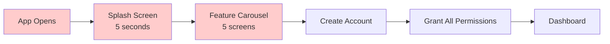
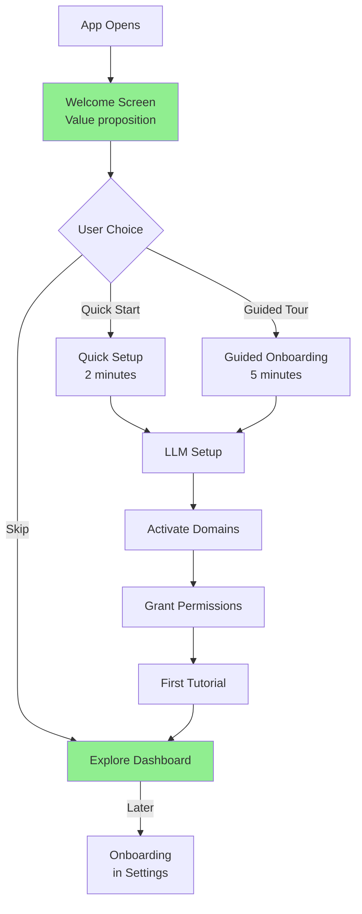
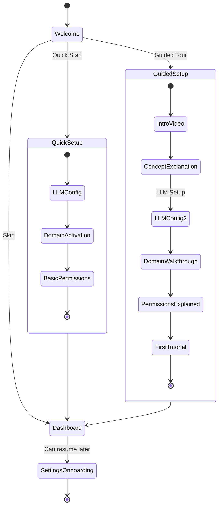
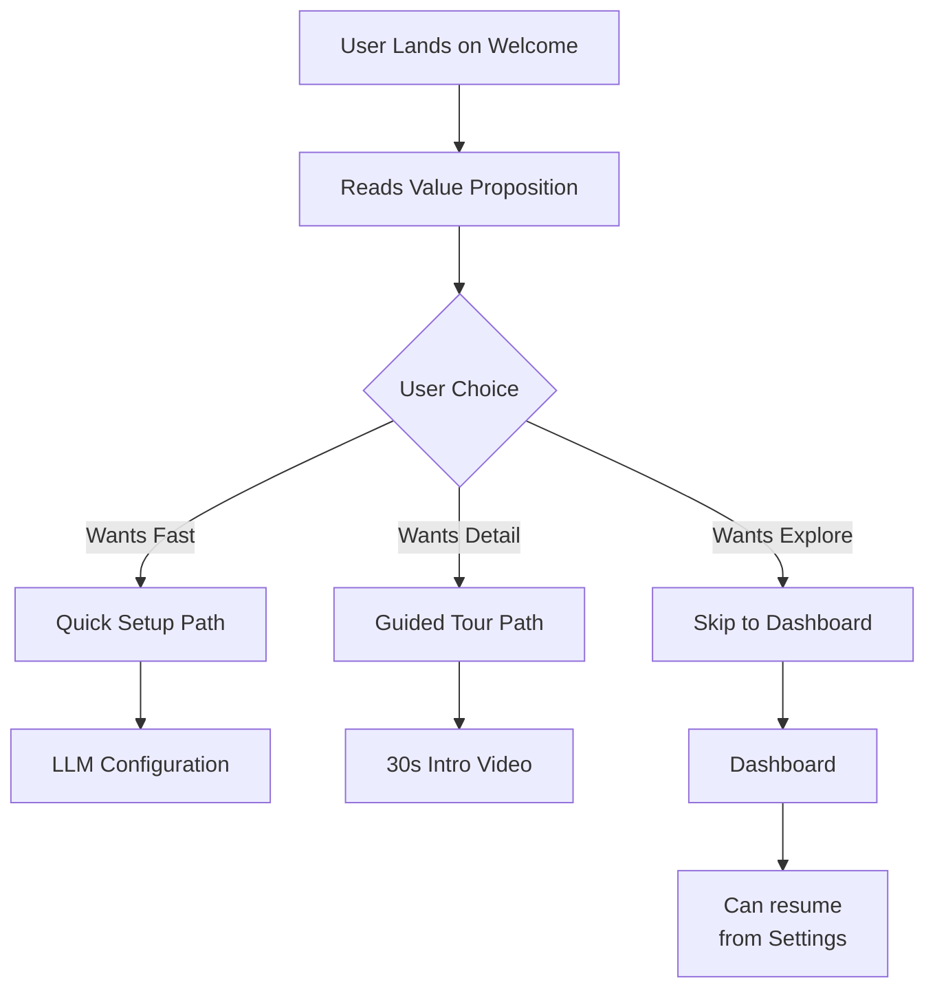
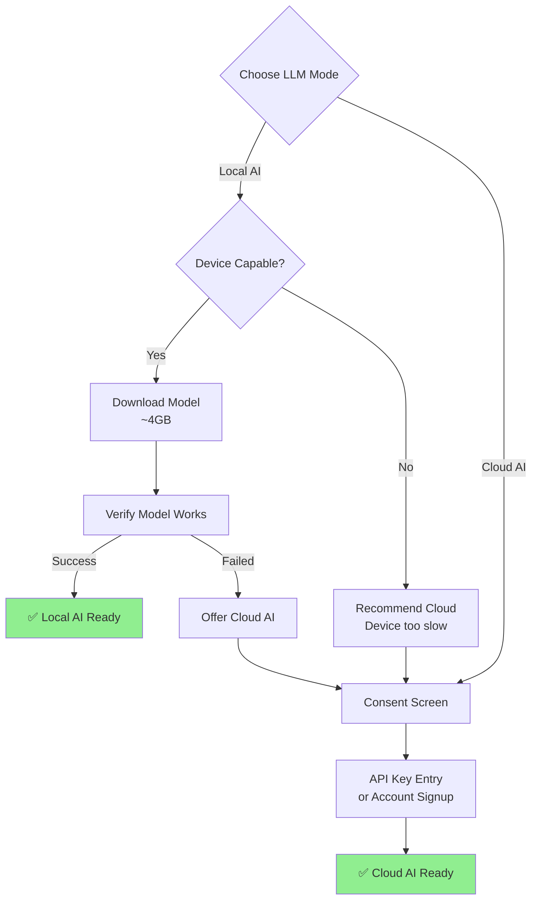
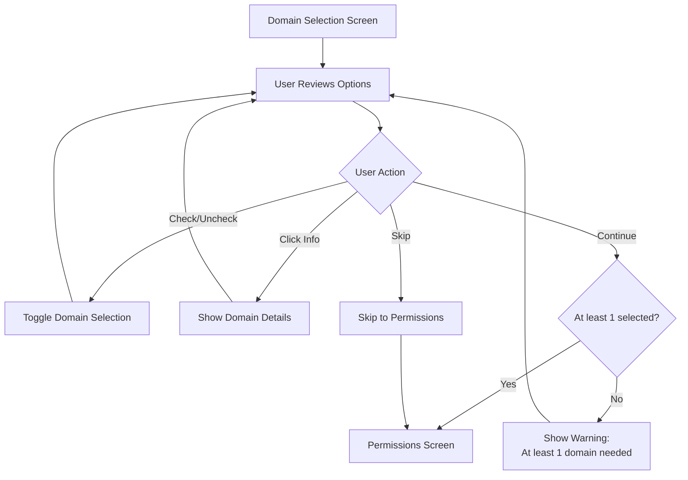
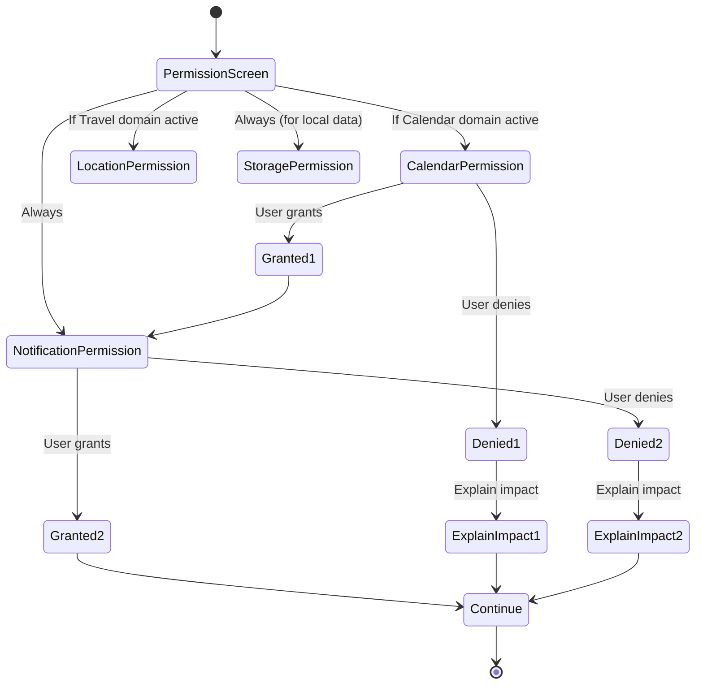
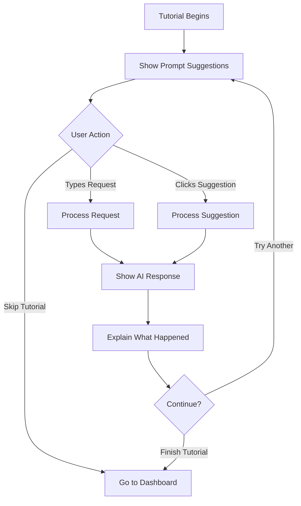
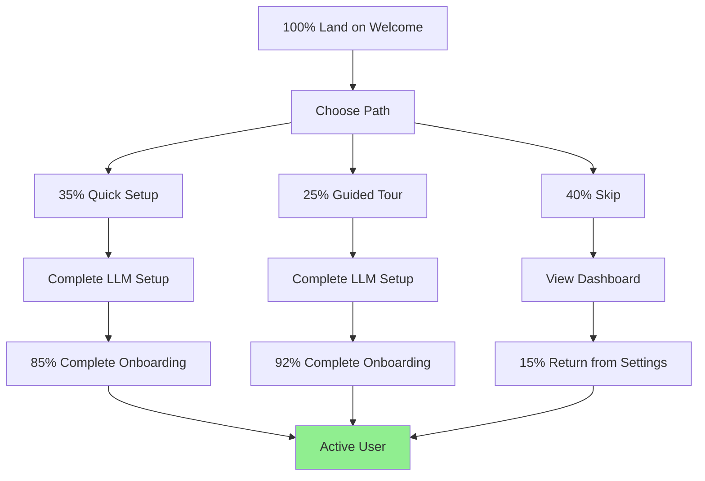

# Onboarding User Experience

**Version:** 1.0
**Date:** 2025-10-28
**Status:** Draft (Awaiting Human Review)
**Part of:** Fidus UX/UI Design
**Author:** AI-Generated

---

## Table of Contents

- [Overview](#overview)
- [Onboarding Philosophy](#onboarding-philosophy)
- [User Flow](#user-flow)
- [Welcome Screen](#welcome-screen)
- [LLM Setup](#llm-setup)
- [Domain Activation](#domain-activation)
- [Permissions & Privacy](#permissions--privacy)
- [First Tutorial](#first-tutorial)
- [Skip & Resume](#skip--resume)
- [Accessibility](#accessibility)
- [Metrics](#metrics)

---

## Overview

Fidus onboarding introduces users to the **AI-Driven UI Paradigm** and helps them configure their personal assistant. The onboarding experience is designed to be:

- **Trust-building**: Emphasizes privacy and user control from the start
- **Educational**: Explains unique concepts (Opportunity Surface, LLM-driven UI)
- **Flexible**: Users can skip steps and come back later
- **Accessible**: WCAG 2.1 AA compliant
- **Quick**: Core setup in under 5 minutes

### Design Principles

1. **Privacy First**: Explain data privacy before asking for any data
2. **Progressive Disclosure**: Don't overwhelm users with everything at once
3. **Value Before Commitment**: Show value before asking for permissions
4. **User Control**: Allow skipping non-essential steps
5. **Trust Building**: Transparent about what Fidus does and doesn't do

---

## Onboarding Philosophy

### Traditional Onboarding (What We DON'T Do)



**Problems:**
- Forces user to read 5 screens before using app
- Asks for permissions without explaining why
- No way to skip and explore
- User doesn't understand value yet

### Fidus Onboarding (What We DO)



**Advantages:**
- User chooses path (quick vs. guided vs. skip)
- Can explore dashboard immediately if they want
- Explains value before asking for data
- All steps can be completed later from Settings

---

## User Flow

### Complete Onboarding Flow



### Step Breakdown

| Step | Time | Skippable? | Purpose |
|------|------|------------|---------|
| **Welcome Screen** | 10 seconds | No | Value proposition, choose path |
| **LLM Setup** | 1-2 minutes | No | Configure AI model (local/cloud) |
| **Domain Activation** | 30 seconds | Yes | Choose which life domains to activate |
| **Permissions** | 1 minute | Yes | Grant calendar, notification permissions |
| **First Tutorial** | 2 minutes | Yes | Try first interaction |

**Total Time:**
- Quick Setup: ~3 minutes (minimal)
- Guided Setup: ~5-7 minutes (comprehensive)
- Skip: 0 minutes (explore dashboard, come back later)

---

## Welcome Screen

### Visual Design

```
┌─────────────────────────────────────────────┐
│                                             │
│              ┌──────────┐                   │
│              │  Fidus   │                   │
│              │   Logo   │                   │
│              └──────────┘                   │
│                                             │
│        Your Faithful Companion              │
│                                             │
│   An AI assistant that learns your         │
│   routines and helps proactively           │
│                                             │
│   🔒 Privacy-First                          │
│   • Your data stays on your device          │
│   • You control what's shared               │
│   • No tracking, no ads                     │
│                                             │
│   ┌─────────────────────────────────────┐  │
│   │     Quick Setup (2 min)             │  │
│   └─────────────────────────────────────┘  │
│                                             │
│   ┌─────────────────────────────────────┐  │
│   │     Guided Tour (5 min)             │  │
│   └─────────────────────────────────────┘  │
│                                             │
│   Skip for now - Explore on your own  →    │
│                                             │
└─────────────────────────────────────────────┘
```

### Content

**Headline:** "Your Faithful Companion"

**Subheadline:** "An AI assistant that learns your routines and helps proactively — without compromising your privacy."

**Key Points:**
- 🔒 **Privacy-First**: Your data stays on your device
- 🎯 **Context-Aware**: Surfaces relevant information when you need it
- ⚡ **Proactive**: Detects opportunities and suggests actions

**Call-to-Actions:**
1. **Quick Setup (2 min)** - Primary button
2. **Guided Tour (5 min)** - Secondary button
3. **Skip for now - Explore on your own** - Text link

### Interaction



---

## LLM Setup

This is the ONLY required step — users must choose how Fidus's AI will run.

### Step: Choose LLM Mode

```
┌─────────────────────────────────────────────────┐
│  Step 1 of 4: Choose Your AI Mode               │
├─────────────────────────────────────────────────┤
│                                                  │
│  Fidus uses AI to understand your requests      │
│  and make decisions. Choose where the AI runs:  │
│                                                  │
│  ┌────────────────────────────────────────┐    │
│  │ 🔒 Local AI (Recommended)              │    │
│  │                                         │    │
│  │ • Runs entirely on your device         │    │
│  │ • Maximum privacy (no data leaves)     │    │
│  │ • Requires powerful device              │    │
│  │ • Free forever                          │    │
│  │                                         │    │
│  │ [ Select Local AI ]                    │    │
│  └────────────────────────────────────────┘    │
│                                                  │
│  ┌────────────────────────────────────────┐    │
│  │ ☁️ Cloud AI                             │    │
│  │                                         │    │
│  │ • Uses cloud servers (encrypted)       │    │
│  │ • Works on any device                  │    │
│  │ • Faster responses                     │    │
│  │ • €5/month after 100 free requests     │    │
│  │                                         │    │
│  │ [ Select Cloud AI ]                    │    │
│  └────────────────────────────────────────┘    │
│                                                  │
│  ℹ️ You can change this later in Settings      │
│                                                  │
│  [Back]                       [Continue →]      │
│                                                  │
└─────────────────────────────────────────────────┘
```

### Decision Flow



### Local AI Setup

If user chooses **Local AI**:

1. **Device Capability Check**
   - Check RAM (min 8GB)
   - Check disk space (need ~4GB)
   - Check CPU/GPU
   - If insufficient, recommend Cloud AI

2. **Model Download**
   ```
   ┌─────────────────────────────────────────┐
   │  Downloading Local AI Model...          │
   │                                          │
   │  [████████████░░░░░░░░░░] 60%           │
   │                                          │
   │  Downloaded: 2.4 GB / 4.0 GB            │
   │  Time remaining: ~3 minutes             │
   │                                          │
   │  This happens once. The model stays     │
   │  on your device forever.                │
   │                                          │
   └─────────────────────────────────────────┘
   ```

3. **Verification**
   - Load model
   - Test inference with "Hello"
   - If successful → proceed
   - If failed → offer Cloud AI fallback

### Cloud AI Setup

If user chooses **Cloud AI**:

1. **Consent Screen**
   ```
   ┌─────────────────────────────────────────────┐
   │  Cloud AI Privacy Notice                    │
   ├─────────────────────────────────────────────┤
   │                                              │
   │  With Cloud AI:                              │
   │                                              │
   │  ✅ Your requests are encrypted in transit  │
   │  ✅ Cloud provider (e.g., OpenAI) processes │
   │     your messages to generate responses      │
   │  ✅ We do NOT store your requests           │
   │  ✅ You can delete data anytime             │
   │                                              │
   │  ❌ Your requests leave your device         │
   │                                              │
   │  Learn more: fidus.ai/privacy               │
   │                                              │
   │  [ ] I understand and consent               │
   │                                              │
   │  [Cancel]                   [Continue]       │
   │                                              │
   └─────────────────────────────────────────────┘
   ```

2. **API Key Entry** (if self-hosting)
   ```
   ┌─────────────────────────────────────────┐
   │  Enter Your Cloud AI Provider           │
   ├─────────────────────────────────────────┤
   │                                          │
   │  Provider:  [OpenAI ▼]                  │
   │                                          │
   │  API Key:   [sk-.....................] │
   │                                          │
   │  Test Connection                         │
   │  Status: ✅ Connected                   │
   │                                          │
   │  [Back]              [Continue →]        │
   │                                          │
   └─────────────────────────────────────────┘
   ```

3. **OR Account Signup** (if using Fidus Cloud)
   ```
   ┌─────────────────────────────────────────┐
   │  Create Fidus Account                    │
   ├─────────────────────────────────────────┤
   │                                          │
   │  Email:     [......................]    │
   │                                          │
   │  Password:  [......................]    │
   │                                          │
   │  [ ] I agree to Terms of Service        │
   │                                          │
   │  Your first 100 AI requests are free    │
   │  After that: €5/month                   │
   │                                          │
   │  [Cancel]            [Sign Up]           │
   │                                          │
   └─────────────────────────────────────────┘
   ```

---

## Domain Activation

Users choose which life domains to activate. This is **optional** (can skip or do later).

### Visual Design

```
┌─────────────────────────────────────────────────────┐
│  Step 2 of 4: Activate Life Domains (Optional)      │
├─────────────────────────────────────────────────────┤
│                                                      │
│  Choose which areas of your life Fidus should help  │
│  with. You can always add more later.               │
│                                                      │
│  Core Domains:                                       │
│                                                      │
│  ☑️ 📅 Calendar & Scheduling                        │
│     Manage appointments, detect conflicts           │
│                                                      │
│  ☑️ 💰 Finance & Budgets                            │
│     Track spending, budget alerts                   │
│                                                      │
│  ☐ ✈️ Travel & Transportation                       │
│     Plan trips, commute optimization                │
│                                                      │
│  ☐ 📧 Communication                                 │
│     Email management, message prioritization        │
│                                                      │
│  ☐ 🏋️ Health & Wellness                            │
│     Track workouts, medication reminders            │
│                                                      │
│  ☐ 🏠 Home & Maintenance                            │
│     Chore tracking, bill reminders                  │
│                                                      │
│  ☐ 🛒 Shopping & Groceries                          │
│     Shopping lists, price tracking                  │
│                                                      │
│  ☐ 📚 Learning & Education                          │
│     Course tracking, study reminders                │
│                                                      │
│  [Skip]                      [Continue →]            │
│                                                      │
└─────────────────────────────────────────────────────┘
```

### Default Selection

By default, **Calendar** and **Finance** are pre-selected (most common use cases).

### Interaction



### Domain Details Modal

Clicking on a domain shows more information:

```
┌─────────────────────────────────────────────────────┐
│  📅 Calendar & Scheduling                           │
├─────────────────────────────────────────────────────┤
│                                                      │
│  What Fidus will do:                                │
│  • Detect double-bookings and conflicts             │
│  • Suggest optimal meeting times                    │
│  • Remind you of upcoming appointments              │
│  • Proactively suggest rescheduling when conflicts  │
│                                                      │
│  Required Permissions:                               │
│  • Read calendar events (local only)                │
│  • Send notifications                               │
│                                                      │
│  Privacy:                                            │
│  🔒 All calendar data stays on your device          │
│  • Never sent to cloud (even with Cloud AI)         │
│  • No sharing with third parties                    │
│                                                      │
│  [Close]                [Activate Domain]            │
│                                                      │
└─────────────────────────────────────────────────────┘
```

---

## Permissions & Privacy

### Philosophy

**Progressive Permission Requests:**
- Only ask for permissions when needed
- Explain WHY each permission is needed
- Allow using app without granting all permissions
- Be transparent about what happens with denied permissions

### Permission Flow



### Permission Screen

```
┌─────────────────────────────────────────────────────┐
│  Step 3 of 4: Grant Permissions                     │
├─────────────────────────────────────────────────────┤
│                                                      │
│  Fidus needs a few permissions to help you:         │
│                                                      │
│  📅 Calendar Access                    [Grant]      │
│     Needed to: Detect conflicts, suggest times      │
│     Privacy: Read-only, stays on device             │
│                                                      │
│  🔔 Notifications                      [Grant]      │
│     Needed to: Alert you of opportunities           │
│     Privacy: No tracking, dismiss anytime           │
│                                                      │
│  💾 Local Storage                      [Grant]      │
│     Needed to: Save your preferences                │
│     Privacy: All data encrypted locally             │
│                                                      │
│  ────────────────────────────────────────           │
│                                                      │
│  ⚠️ Optional Permissions (Skip if you want):        │
│                                                      │
│  📍 Location (for Travel domain)       [Grant]      │
│     Needed to: Suggest routes, detect travel        │
│     Privacy: Only when app is open                  │
│                                                      │
│  [Skip All]              [Grant Selected →]         │
│                                                      │
└─────────────────────────────────────────────────────┘
```

### Permission Denied Handling

If user denies a permission:

```
┌─────────────────────────────────────────────────────┐
│  Calendar Permission Denied                          │
├─────────────────────────────────────────────────────┤
│                                                      │
│  Without calendar access, Fidus cannot:             │
│  • Detect double-bookings                           │
│  • Suggest optimal meeting times                    │
│  • Remind you of appointments                       │
│                                                      │
│  You can still:                                      │
│  • Use Finance, Travel, and other domains           │
│  • Grant permission later in Settings               │
│  • Manually enter appointments via chat             │
│                                                      │
│  [Grant Permission]  [Continue Without Calendar]    │
│                                                      │
└─────────────────────────────────────────────────────┘
```

---

## First Tutorial

After setup, users try their first interaction to see Fidus in action.

### Tutorial Flow



### Tutorial Screen

```
┌─────────────────────────────────────────────────────┐
│  Step 4 of 4: Try Your First Request                │
├─────────────────────────────────────────────────────┤
│                                                      │
│  Let's try Fidus! Type a request or tap one below:  │
│                                                      │
│  💬 Chat Input:                                     │
│  ┌─────────────────────────────────────────────┐   │
│  │ What's on my calendar today?                │   │
│  └─────────────────────────────────────────────┘   │
│                                                      │
│  Or try these suggestions:                          │
│                                                      │
│  🔘 "What's on my calendar today?"                  │
│  🔘 "How much did I spend on food this month?"      │
│  🔘 "Remind me to call John tomorrow at 2pm"        │
│  🔘 "Show me my upcoming bills"                     │
│                                                      │
│  [Skip Tutorial]                                     │
│                                                      │
└─────────────────────────────────────────────────────┘
```

### After First Request

```
┌─────────────────────────────────────────────────────┐
│  Great! Here's What Happened:                        │
├─────────────────────────────────────────────────────┤
│                                                      │
│  1️⃣ Fidus analyzed your request                    │
│     Detected: Calendar query                        │
│                                                      │
│  2️⃣ Checked your calendar                          │
│     Found: 3 appointments today                     │
│                                                      │
│  3️⃣ Decided how to show it                         │
│     Chose: Chat response (simple query)             │
│                                                      │
│  ────────────────────────────────────────           │
│                                                      │
│  📊 Your Response:                                  │
│                                                      │
│  You have 3 appointments today:                     │
│  • 9:00 AM - Team standup (30 min)                 │
│  • 2:00 PM - Client call (1 hour)                  │
│  • 5:30 PM - Dentist (45 min)                      │
│                                                      │
│  [Try Another Request]    [Finish Tutorial →]       │
│                                                      │
└─────────────────────────────────────────────────────┘
```

### Tutorial Complete

```
┌─────────────────────────────────────────────────────┐
│  🎉 You're All Set!                                 │
├─────────────────────────────────────────────────────┤
│                                                      │
│  Fidus is ready to help. Here's what to know:       │
│                                                      │
│  💬 Chat Anytime                                    │
│     Type natural requests, like talking to a person │
│                                                      │
│  🎯 Check the Dashboard                             │
│     See proactive suggestions and opportunities     │
│                                                      │
│  🔒 Control Your Privacy                            │
│     Settings → Privacy to see what data is stored   │
│                                                      │
│  ⚙️ Customize Domains                               │
│     Settings → Domains to add/remove areas          │
│                                                      │
│  Need help? Type "Help" or visit fidus.ai/docs      │
│                                                      │
│  [Go to Dashboard →]                                │
│                                                      │
└─────────────────────────────────────────────────────┘
```

---

## Skip & Resume

### Skip Anytime

Users can skip onboarding at any step (except LLM setup) and come back later.

**Skip Button Behavior:**
- **Welcome Screen**: Skip → Dashboard (but mark onboarding incomplete)
- **Domain Activation**: Skip → Permissions (still need to grant some permissions)
- **Permissions**: Skip → Tutorial (but explain what won't work)
- **Tutorial**: Skip → Dashboard

### Resume from Settings

```
┌─────────────────────────────────────────────────────┐
│  ⚙️ Settings → Onboarding                           │
├─────────────────────────────────────────────────────┤
│                                                      │
│  Onboarding Status: ⚠️ Incomplete                   │
│                                                      │
│  ✅ LLM Setup                          Completed     │
│  ⚠️ Domain Activation                  Skipped      │
│  ⚠️ Permissions                        Partial      │
│  ✅ First Tutorial                     Completed     │
│                                                      │
│  [Resume Onboarding]                                │
│  [Start Over]                                        │
│                                                      │
│  ────────────────────────────────────────           │
│                                                      │
│  Missing Permissions:                                │
│  • Calendar Access (needed for Calendar domain)     │
│  • Location (needed for Travel domain)              │
│                                                      │
│  [Grant Permissions]                                │
│                                                      │
└─────────────────────────────────────────────────────┘
```

---

## Accessibility

### WCAG 2.1 AA Compliance

**Visual:**
- ✅ Text contrast ratio ≥ 4.5:1 (normal text)
- ✅ Interactive elements ≥ 44×44 CSS pixels (touch targets)
- ✅ Focus indicators on all interactive elements
- ✅ No color-only communication (icons + text)

**Keyboard Navigation:**
- ✅ Tab through all interactive elements
- ✅ Enter/Space to activate buttons
- ✅ Escape to close modals
- ✅ Arrow keys for radio buttons

**Screen Reader Support:**
- ✅ All images have alt text
- ✅ Form fields have labels
- ✅ Progress indicators announced
- ✅ Error messages associated with fields

**Timing:**
- ✅ No time limits on completing onboarding
- ✅ Can pause/resume at any step
- ✅ No auto-advancing slides

### Screen Reader Experience

```
// Welcome Screen
[Screen Reader]: "Heading level 1: Your Faithful Companion.
Paragraph: An AI assistant that learns your routines and helps proactively.
List: Privacy-First, Context-Aware, Proactive.
Button: Quick Setup, 2 minutes.
Button: Guided Tour, 5 minutes.
Link: Skip for now, explore on your own."

// LLM Setup
[Screen Reader]: "Step 1 of 4: Choose Your AI Mode.
Radio group: LLM Mode Selection.
Radio button, checked: Local AI (Recommended).
Description: Runs entirely on your device, maximum privacy.
Radio button: Cloud AI.
Description: Uses cloud servers, works on any device.
Button: Continue."

// Progress
[Screen Reader]: "Progress: Step 2 of 4 completed."
```

### Reduced Motion

For users with `prefers-reduced-motion`:
- ✅ Disable slide-in animations
- ✅ Disable progress bar animations
- ✅ Use fade transitions instead of slides

---

## Metrics

### Key Metrics to Track

**Completion Rates:**
- % of users who complete onboarding
- % who skip and never return
- % who skip and return later from Settings
- Average time to complete

**Funnel Analysis:**


**Key Drop-off Points:**
- LLM Setup (model download too slow?)
- Permissions Screen (too many permissions?)
- Tutorial (too complex?)

**Success Criteria:**
- ≥70% completion rate for Quick Setup
- ≥80% completion rate for Guided Tour
- ≥90% of users grant at least 1 permission
- <5 minutes average completion time

---

## Conclusion

Fidus onboarding is designed to:

1. **Build Trust**: Privacy-first messaging from the start
2. **Show Value**: Users see value before committing
3. **Respect Time**: Quick path for busy users
4. **Empower Users**: Skip and resume anytime
5. **Be Accessible**: WCAG 2.1 AA compliant

### Next Steps

1. Implement welcome screen with path selection
2. Build LLM setup wizard (local + cloud flows)
3. Create domain activation screen
4. Implement permission request flow
5. Build interactive tutorial
6. Add resume from Settings
7. Track metrics and iterate

---

**Document Version:** 1.0
**Authors:** UX/UI Team
**Review Status:** Draft - Pending Review
**Related Documents:**
- [AI-Driven UI Paradigm](00-ai-driven-ui-paradigm.md)
- [Design Philosophy](01-design-philosophy-principles.md)
- [Interaction Patterns](04-interaction-patterns.md)
- [Accessibility](11-accessibility.md)
