# Onboarding UX

**Status:** ✅ Complete
**Last Updated:** 2025-01-28
**Owner:** UX/UI Team

---

## Table of Contents

1. [Overview](#overview)
2. [Onboarding Philosophy](#onboarding-philosophy)
3. [Onboarding Flow](#onboarding-flow)
4. [Step-by-Step Wizard](#step-by-step-wizard)
5. [Domain Configuration](#domain-configuration)
6. [Privacy Setup](#privacy-setup)
7. [First Experience](#first-experience)
8. [Progressive Disclosure](#progressive-disclosure)
9. [Accessibility](#accessibility)
10. [Best Practices](#best-practices)

---

## 1. Overview

Fidus onboarding is designed to be **fast, privacy-focused, and progressive**. Users should get value within 5 minutes while understanding Fidus's privacy-first approach.

### Design Goals

1. **Fast to Value** - First opportunity within 5 minutes
2. **Privacy-First** - Clear privacy guarantees upfront
3. **Progressive** - Don't overwhelm, reveal features over time
4. **Flexible** - Skip optional steps, customize later
5. **Educational** - Teach AI-driven UI paradigm

### Onboarding Metrics

| Metric | Target | Measurement |
|--------|--------|-------------|
| Time to First Opportunity | < 5 minutes | From signup to first Opportunity Card shown |
| Setup Completion Rate | > 80% | Users who complete core setup (steps 1-3) |
| Domain Activation | > 3 domains | Average domains enabled per user |
| Privacy Understanding | > 90% | Users who correctly answer privacy quiz question |

---

## 2. Onboarding Philosophy

### Privacy-First Onboarding

**Core Principle:** Users must understand and trust Fidus's privacy model before providing any data.

```mermaid
graph LR
    subgraph TRAD["Traditional Onboarding ❌ Privacy last"]
        T1["1. Sign up"] --> T2["2. Add data"] --> T3["3. Privacy (?)"]
    end

    subgraph FIDUS["Fidus Onboarding ✅ Privacy first"]
        F1["1. Privacy"] --> F2["2. Sign up"] --> F3["3. Add data"]
    end
```



### Progressive Disclosure

Don't show everything at once. Reveal features as users need them:

**Week 1:** Core domains (Calendar, Finance)
**Week 2:** Proactive suggestions introduction
**Week 3:** Advanced domains (Travel, Health)
**Week 4+:** Power user features (multi-tenancy, voice)

### Value-First Approach

Show value before asking for data:

```
❌ BAD: "Connect your calendar"
✅ GOOD: "Let me help you avoid double-bookings. Connect your calendar?"
```

---

## 3. Onboarding Flow

### Flow Diagram


### Flow Steps

| Step | Required | Duration | Goal |
|------|----------|----------|------|
| 1. Welcome | ✅ Required | 30s | Introduce AI-driven paradigm |
| 2. Privacy Intro | ✅ Required | 60s | Build trust, explain privacy |
| 3. Create Account | ✅ Required | 60s | Account creation |
| 4. Domain Selection | ✅ Required | 90s | Choose 2-3 domains to start |
| 5. Domain Setup | ⚠️ Optional | 2-3 min | Configure selected domains |
| 6. Privacy Config | ✅ Required | 60s | Set privacy preferences |
| 7. LLM Setup | ✅ Required | 30s | Choose LLM provider |
| 8. First Tour | ⚠️ Optional | 90s | Quick tour of Opportunity Surface |
| **Total** | | **5-8 min** | Ready to use |

---

## 4. Step-by-Step Wizard

### Step 1: Welcome Screen

**Goal:** Introduce Fidus and AI-driven UI paradigm in 30 seconds.

```
+--------------------------------------------------------+
|                                                        |
|              ✨ Welcome to Fidus                       |
|                                                        |
|         Your Privacy-First AI Personal Assistant      |
|                                                        |
|  +------------------------------------------------+   |
|  |                                                |   |
|  |   Instead of you searching through apps,      |   |
|  |   Fidus brings opportunities to you.          |   |
|  |                                                |   |
|  |   🤖 AI finds patterns in your data           |   |
|  |   📊 Shows relevant cards on your dashboard   |   |
|  |   🔒 All processing stays on your device      |   |
|  |                                                |   |
|  +------------------------------------------------+   |
|                                                        |
|              [Get Started] →                           |
|                                                        |
|              --------------------                      |
|              1 ● ○ ○ ○ ○ ○ ○ ○                        |
+--------------------------------------------------------+
```

**Key Messages:**
- AI-driven dashboard (not app switching)
- Privacy-first (processing on device)
- Value proposition (save time, avoid mistakes)

**Interaction:**
- Auto-advances after 15s OR user clicks "Get Started"
- Progress indicator shows 8 total steps

---

### Step 2: Privacy Introduction

**Goal:** Build trust by explaining privacy model BEFORE asking for account.

```
+--------------------------------------------------------+
|                                                        |
|           🔒 Your Privacy, Your Control                |
|                                                        |
|  Fidus is different from other AI assistants:         |
|                                                        |
|  ✅ All AI runs locally on your device                |
|     No data sent to our servers                       |
|                                                        |
|  ✅ You own your data                                 |
|     Export or delete anytime                          |
|                                                        |
|  ✅ Open source & auditable                           |
|     See exactly what we do with your data             |
|                                                        |
|  ✅ No tracking or profiling                          |
|     We don't know what you do in Fidus                |
|                                                        |
|  +------------------------------------------------+   |
|  | 💡 Quiz: Where is your data processed?        |   |
|  |                                                |   |
|  | ( ) On Fidus servers                           |   |
|  | (•) On my device only                          |   |
|  | ( ) On Google servers                          |   |
|  +------------------------------------------------+   |
|                                                        |
|  [← Back]               [Continue] →                   |
|                                                        |
|              --------------------                      |
|              1 2 ● ○ ○ ○ ○ ○ ○                        |
+--------------------------------------------------------+
```

**Interactive Quiz:**
- Forces engagement with privacy model
- Must answer correctly to continue
- Incorrect answer shows explanation

**Privacy Badge:**
```
+------------------------------+
| 🔒 Privacy Guarantee         |
|                              |
| ✓ Local AI processing        |
| ✓ No data sent to cloud      |
| ✓ You own your data          |
|                              |
| [Read Full Privacy Policy]   |
+------------------------------+
```

---

### Step 3: Create Account

**Goal:** Minimal friction account creation (email + password only).

```
+--------------------------------------------------------+
|                                                        |
|              Create Your Fidus Account                 |
|                                                        |
|  +-------------------------------------------------+  |
|  | Email *                                         |  |
|  | +---------------------------------------------+ |  |
|  | | you@example.com                             | |  |
|  | +---------------------------------------------+ |  |
|  +-------------------------------------------------+  |
|                                                        |
|  +-------------------------------------------------+  |
|  | Password *                                      |  |
|  | +---------------------------------------------+ |  |
|  | | ••••••••••••                                | |  |
|  | +---------------------------------------------+ |  |
|  |                                                 |  |
|  | Password Strength: Strong ✅                   |  |
|  | ✓ At least 8 characters                        |  |
|  | ✓ Includes numbers                             |  |
|  | ✓ Includes special characters                  |  |
|  +-------------------------------------------------+  |
|                                                        |
|  ☑ I agree to the [Terms of Service] and              |
|     [Privacy Policy]                                   |
|                                                        |
|  [← Back]               [Create Account] →             |
|                                                        |
|              --------------------                      |
|              1 2 3 ● ○ ○ ○ ○ ○                        |
+--------------------------------------------------------+
```

**Validation Rules:**
- Email: Must be valid format
- Password: Min 8 chars, 1 number, 1 special char
- Real-time validation (see [04-interaction-patterns.md](04-interaction-patterns.md#8-form-validation-patterns))

**No Required:**
- Name (asked later, optional)
- Phone number (never required)
- Payment info (free tier)
- Social login (privacy risk)

---

### Step 4: Domain Selection

**Goal:** Let users choose 2-3 domains to start (avoid overwhelming).

```
+--------------------------------------------------------+
|                                                        |
|          Which areas should Fidus help with?           |
|                                                        |
|  Choose 2-3 to start. You can add more later.         |
|                                                        |
|  +------------------+  +------------------+           |
|  | 📅 Calendar      |  | 💰 Finance       |           |
|  |                  |  |                  |           |
|  | Avoid double-    |  | Track spending,  |           |
|  | bookings, get    |  | budget alerts    |           |
|  | prep reminders   |  |                  |           |
|  |                  |  |                  |           |
|  | [✓ Selected]     |  | [✓ Selected]     |           |
|  +------------------+  +------------------+           |
|                                                        |
|  +------------------+  +------------------+           |
|  | ✈️ Travel        |  | 💬 Communication |           |
|  |                  |  |                  |           |
|  | Coordinate trips,|  | Smart email      |           |
|  | book flights     |  | management       |           |
|  |                  |  |                  |           |
|  | [  Add  ]        |  | [  Add  ]        |           |
|  +------------------+  +------------------+           |
|                                                        |
|  +------------------+  +------------------+           |
|  | 🏥 Health        |  | 🏠 Home          |           |
|  |                  |  |                  |           |
|  | Track medical    |  | Maintenance      |           |
|  | appointments     |  | reminders        |           |
|  |                  |  |                  |           |
|  | [  Add  ]        |  | [  Add  ]        |           |
|  +------------------+  +------------------+           |
|                                                        |
|  Selected: 2/8 domains                                 |
|                                                        |
|  [← Back]          [Skip]      [Continue] →            |
|                                                        |
|              --------------------                      |
|              1 2 3 4 ● ○ ○ ○ ○                        |
+--------------------------------------------------------+
```

**Recommended Defaults:**
- **Pre-select Calendar + Finance** (most universally useful)
- Allow deselection
- Show value proposition for each domain

**Domain Cards Include:**
- Icon + Name
- One-sentence value prop
- Selection state (✓ Selected or [ Add ])

**Validation:**
- Minimum 1 domain required
- Can skip and add later

---

### Step 5: Domain Setup (Example: Calendar)

**Goal:** Quick configuration of selected domains (1-2 min per domain).

**Calendar Setup:**

```
+--------------------------------------------------------+
|                                                        |
|           📅 Set Up Calendar                           |
|                                                        |
|  Connect your calendars to let Fidus:                  |
|  • Detect scheduling conflicts                         |
|  • Suggest meeting prep time                           |
|  • Remind you of upcoming events                       |
|                                                        |
|  +-------------------------------------------------+  |
|  | Calendar Provider                               |  |
|  | +---------------------------------------------+ |  |
|  | | Select provider...                ▼         | |  |
|  | +---------------------------------------------+ |  |
|  |                                                 |  |
|  | Options:                                        |  |
|  | • Google Calendar                               |  |
|  | • Microsoft Outlook                             |  |
|  | • iCloud Calendar                               |  |
|  | • CalDAV (self-hosted)                          |  |
|  +-------------------------------------------------+  |
|                                                        |
|  +-------------------------------------------------+  |
|  | 🔒 Privacy Note                                 |  |
|  |                                                 |  |
|  | Calendar data stays on your device.             |  |
|  | We only read events to detect conflicts.        |  |
|  | We NEVER share or upload your calendar.         |  |
|  +-------------------------------------------------+  |
|                                                        |
|  [← Back]       [Skip Calendar]      [Connect] →       |
|                                                        |
|              --------------------                      |
|              1 2 3 4 5 ● ○ ○ ○                        |
+--------------------------------------------------------+
```

**After Connection:**

```
+--------------------------------------------------------+
|                                                        |
|           ✅ Calendar Connected                        |
|                                                        |
|  Found 3 calendars:                                    |
|                                                        |
|  ☑ Work Calendar (primary)                            |
|  ☑ Personal Calendar                                  |
|  ☐ US Holidays (read-only)                            |
|                                                        |
|  +-------------------------------------------------+  |
|  | Notification Preferences                        |  |
|  |                                                 |  |
|  | ☑ Remind me 15 min before events                |  |
|  | ☑ Suggest prep time for meetings                |  |
|  | ☑ Alert me of double bookings                   |  |
|  +-------------------------------------------------+  |
|                                                        |
|  [← Back]                            [Continue] →      |
|                                                        |
|              --------------------                      |
|              1 2 3 4 5 6 ● ○ ○                        |
+--------------------------------------------------------+
```

**Finance Setup:**

```
+--------------------------------------------------------+
|                                                        |
|           💰 Set Up Finance Tracking                   |
|                                                        |
|  Connect your bank to let Fidus:                       |
|  • Track spending by category                          |
|  • Alert you when budgets are exceeded                 |
|  • Suggest cost-saving opportunities                   |
|                                                        |
|  +-------------------------------------------------+  |
|  | Connection Method                               |  |
|  |                                                 |  |
|  | ( ) Automatic bank sync (via Plaid)             |  |
|  |     Connect securely to 10,000+ banks           |  |
|  |                                                 |  |
|  | (•) Manual CSV import                           |  |
|  |     Import transactions from CSV files          |  |
|  |                                                 |  |
|  | ( ) Manual entry                                |  |
|  |     Add transactions manually                   |  |
|  +-------------------------------------------------+  |
|                                                        |
|  +-------------------------------------------------+  |
|  | 🔒 Privacy Note                                 |  |
|  |                                                 |  |
|  | All financial data encrypted and stored locally.|  |
|  | We NEVER send transaction data to our servers.  |  |
|  | Bank sync uses Plaid (SOC 2 certified).         |  |
|  +-------------------------------------------------+  |
|                                                        |
|  [← Back]       [Skip Finance]       [Continue] →      |
|                                                        |
|              --------------------                      |
|              1 2 3 4 5 6 ● ○ ○                        |
+--------------------------------------------------------+
```

**Domain Setup Pattern:**
1. Explain value (3 bullet points)
2. Choose connection method
3. Privacy reassurance
4. Configure preferences
5. Skip option always available

---

### Step 6: Privacy Configuration

**Goal:** Set privacy preferences (data retention, telemetry, sharing).

```
+--------------------------------------------------------+
|                                                        |
|           🔒 Privacy Preferences                       |
|                                                        |
|  +-------------------------------------------------+  |
|  | Data Retention                                  |  |
|  |                                                 |  |
|  | How long should Fidus keep your data?          |  |
|  |                                                 |  |
|  | ( ) 30 days (minimal)                           |  |
|  | (•) 1 year (recommended)                        |  |
|  | ( ) Forever (until I delete)                    |  |
|  |                                                 |  |
|  | ℹ️ Longer retention = better predictions        |  |
|  +-------------------------------------------------+  |
|                                                        |
|  +-------------------------------------------------+  |
|  | Anonymous Telemetry                             |  |
|  |                                                 |  |
|  | ☐ Send anonymous usage data to improve Fidus   |  |
|  |                                                 |  |
|  | ℹ️ We collect: feature usage, crash reports     |  |
|  | We DON'T collect: personal data, content        |  |
|  |                                                 |  |
|  | [See Exactly What We Collect]                   |  |
|  +-------------------------------------------------+  |
|                                                        |
|  +-------------------------------------------------+  |
|  | Data Export                                     |  |
|  |                                                 |  |
|  | Your data belongs to you.                       |  |
|  | Export anytime: Settings → Data & Privacy       |  |
|  +-------------------------------------------------+  |
|                                                        |
|  [← Back]                            [Continue] →      |
|                                                        |
|              --------------------                      |
|              1 2 3 4 5 6 7 ● ○                        |
+--------------------------------------------------------+
```

**Privacy Options:**
- **Data Retention:** 30 days / 1 year / Forever
- **Telemetry:** Opt-in only (default OFF)
- **Data Sharing:** Always OFF (Fidus never shares data)

**Transparency:**
- Link to full privacy policy
- "See exactly what we collect" shows telemetry spec
- Remind users they can change settings anytime

---

### Step 7: LLM Setup

**Goal:** Choose LLM provider (local vs cloud, with privacy tradeoffs).

```
+--------------------------------------------------------+
|                                                        |
|           🤖 Choose Your AI Model                      |
|                                                        |
|  Fidus uses large language models (LLMs) to understand |
|  your requests. Choose your preferred provider:        |
|                                                        |
|  +-------------------------------------------------+  |
|  | (•) Local AI (Ollama) - RECOMMENDED             |  |
|  |                                                 |  |
|  | ✅ Best privacy - runs entirely on your device  |  |
|  | ✅ No internet required                         |  |
|  | ⚠️ Requires ~4GB disk space                     |  |
|  | ⚠️ Slower on older devices                      |  |
|  |                                                 |  |
|  | Model: Llama 3 (8B)                             |  |
|  +-------------------------------------------------+  |
|                                                        |
|  +-------------------------------------------------+  |
|  | ( ) Cloud AI (OpenAI)                           |  |
|  |                                                 |  |
|  | ✅ Faster responses                             |  |
|  | ✅ More powerful reasoning                      |  |
|  | ⚠️ Requires internet connection                 |  |
|  | ⚠️ OpenAI sees your prompts (not your data)     |  |
|  |                                                 |  |
|  | Requires API key (bring your own)               |  |
|  +-------------------------------------------------+  |
|                                                        |
|  ℹ️ You can change this later in Settings → LLM       |
|                                                        |
|  [← Back]                            [Continue] →      |
|                                                        |
|              --------------------                      |
|              1 2 3 4 5 6 7 8 ●                        |
+--------------------------------------------------------+
```

**LLM Options:**
1. **Local AI (Ollama)** - Default, best privacy
2. **Cloud AI (OpenAI, Anthropic, etc.)** - Requires API key

**Privacy Tradeoffs Table:**

| Provider | Data Sent to Cloud | Speed | Privacy | Cost |
|----------|-------------------|-------|---------|------|
| **Ollama (Local)** | None | Medium | ⭐⭐⭐⭐⭐ | Free |
| **OpenAI** | Prompts only | Fast | ⭐⭐⭐ | Pay per use |
| **Anthropic** | Prompts only | Fast | ⭐⭐⭐⭐ | Pay per use |

**Ollama Setup (if selected):**

```
+--------------------------------------------------------+
|                                                        |
|           Downloading Llama 3...                       |
|                                                        |
|  ████████████████████░░░░░░░░░░  60% (2.4 GB / 4.0 GB)|
|                                                        |
|  Estimated time remaining: 2 minutes                   |
|                                                        |
|  ℹ️ This is a one-time download. The model will be     |
|     stored on your device for offline use.             |
|                                                        |
|  [Cancel]                                              |
|                                                        |
+--------------------------------------------------------+
```

---

### Step 8: First Tour (Optional)

**Goal:** Quick interactive tour of Opportunity Surface (90 seconds).

**Tour Screen 1: Opportunity Surface**

```
+--------------------------------------------------------+
|  Dashboard                            🔍  ⚙️  👤       |
+--------------------------------------------------------+
|                                                        |
|  ┏━━━━━━━━━━━━━━━━━━━━━━━━━━━━━━━━━━━━━━━━━━━━━━━━┓  |
|  ┃ 💡 This is your Opportunity Surface              ┃  |
|  ┃                                                  ┃  |
|  ┃ Instead of searching through apps, AI analyzes  ┃  |
|  ┃ your data and shows relevant opportunities here.┃  |
|  ┃                                                  ┃  |
|  ┃ [Next] →                                         ┃  |
|  ┗━━━━━━━━━━━━━━━━━━━━━━━━━━━━━━━━━━━━━━━━━━━━━━━━┛  |
|                                                        |
|  +--------------------------------------------------+ |
|  | 🔴 URGENT: Double booking detected               | |
|  |                                                  | |
|  | You have two meetings at 2pm today:              | |
|  | • "Team Sync" with Sarah                         | |
|  | • "Client Call" with Acme Corp                   | |
|  |                                                  | |
|  | [Reschedule Team Sync] [Cancel Client Call]      | |
|  +--------------------------------------------------+ |
|                                                        |
|  +--------------------------------------------------+ |
|  | 💰 WARNING: Food budget 90% used                 | |
|  | [View Details]                                   | |
|  +--------------------------------------------------+ |
|                                                        |
+--------------------------------------------------------+
```

**Tour Screen 2: Opportunity Cards**

```
+--------------------------------------------------------+
|  Dashboard                            🔍  ⚙️  👤       |
+--------------------------------------------------------+
|                                                        |
|  +--------------------------------------------------+ |
|  | 🔴 URGENT: Double booking detected               | |
|  |                                                  | |
|  | ┏━━━━━━━━━━━━━━━━━━━━━━━━━━━━━━━━━━━━━━━━━━━━┓ | |
|  | ┃ 💡 These are Opportunity Cards                ┃ | |
|  | ┃                                              ┃ | |
|  | ┃ Each card represents something Fidus found  ┃ | |
|  | ┃ that needs your attention.                   ┃ | |
|  | ┃                                              ┃ | |
|  | ┃ Urgency levels:                              ┃ | |
|  | ┃ 🔴 Urgent - Act within 24 hours              ┃ | |
|  | ┃ 🟡 Medium - Act within 3 days                ┃ | |
|  | ┃ 🟢 Low - When you have time                  ┃ | |
|  | ┃                                              ┃ | |
|  | ┃ [Next] →                                     ┃ | |
|  | ┗━━━━━━━━━━━━━━━━━━━━━━━━━━━━━━━━━━━━━━━━━━━━┛ | |
|  |                                                  | |
|  | You have two meetings at 2pm today:              | |
|  +--------------------------------------------------+ |
|                                                        |
+--------------------------------------------------------+
```

**Tour Screen 3: Actions**

```
+--------------------------------------------------------+
|  Dashboard                            🔍  ⚙️  👤       |
+--------------------------------------------------------+
|                                                        |
|  +--------------------------------------------------+ |
|  | 🔴 URGENT: Double booking detected               | |
|  |                                                  | |
|  | You have two meetings at 2pm today:              | |
|  | • "Team Sync" with Sarah                         | |
|  | • "Client Call" with Acme Corp                   | |
|  |                                                  | |
|  | ┏━━━━━━━━━━━━━━━━━━━━━━━━━━━━━━━━━━━━━━━━━━━┓ | |
|  | ┃ 💡 Click these buttons to take action        ┃ | |
|  | ┃                                             ┃ | |
|  | ┃ Most actions are just one click.            ┃ | |
|  | ┃ Fidus handles the rest.                     ┃ | |
|  | ┃                                             ┃ | |
|  | ┃ [Got it!] →                                 ┃ | |
|  | ┗━━━━━━━━━━━━━━━━━━━━━━━━━━━━━━━━━━━━━━━━━━━┛ | |
|  |                                                  | |
|  | [Reschedule Team Sync] [Cancel Client Call]      | |
|  +--------------------------------------------------+ |
|                                                        |
+--------------------------------------------------------+
```

**Tour Controls:**
- [Skip Tour] button always visible
- [Next] advances to next screen
- [Back] returns to previous screen
- Auto-dismisses after 90 seconds of inactivity

---

### Step 9: Complete - First Dashboard

**Goal:** Show user their dashboard with first opportunities.

```
+--------------------------------------------------------+
|  Dashboard                            🔍  ⚙️  👤       |
+--------------------------------------------------------+
|                                                        |
|  +--------------------------------------------------+ |
|  | 🎉 Welcome to Fidus!                             | |
|  |                                                  | |
|  | Your account is set up. Fidus is now monitoring | |
|  | your Calendar and Finance for opportunities.     | |
|  |                                                  | |
|  | ✅ Calendar connected (3 calendars)              | |
|  | ✅ Finance tracking active (CSV import)          | |
|  | ✅ Local AI ready (Llama 3)                      | |
|  |                                                  | |
|  | First opportunities will appear here within      | |
|  | a few minutes as Fidus analyzes your data.       | |
|  |                                                  | |
|  | [Dismiss]                                        | |
|  +--------------------------------------------------+ |
|                                                        |
|  +--------------------------------------------------+ |
|  | 📊 Analyzing your calendar...                    | |
|  | ▓▓▓▓▓▓▓▓▓▓▓▓░░░░░░░░ 60%                        | |
|  +--------------------------------------------------+ |
|                                                        |
|  Need help? [Watch Tutorial] [Read Docs] [Get Support]|
|                                                        |
+--------------------------------------------------------+
```

**Post-Onboarding:**
- Show initial data analysis progress
- Provide links to help resources
- First opportunity typically appears within 5 minutes

---

## 5. Domain Configuration

### Domain Configuration Patterns

Each domain has unique setup requirements. Follow this pattern:

#### Configuration Template

```markdown
### [Domain Name] Setup

**Goal:** [One sentence value proposition]

**Setup Steps:**
1. Choose connection method
2. Authenticate/import data
3. Configure preferences
4. Privacy confirmation

**Connection Methods:**
- Method 1 (recommended): [Description]
- Method 2 (alternative): [Description]
- Method 3 (manual): [Description]

**Privacy Notes:**
- What data is accessed
- Where data is stored (always local)
- What data is never shared
```

#### Domain-Specific Setups

**Calendar Domain:**
```
Connection Methods:
1. Google Calendar (OAuth)
2. Microsoft Outlook (OAuth)
3. iCloud Calendar (OAuth)
4. CalDAV (self-hosted)

Preferences:
- Reminder timing (15 min, 30 min, 1 hour)
- Working hours (for conflict detection)
- Event categories to monitor
```

**Finance Domain:**
```
Connection Methods:
1. Automatic bank sync (Plaid)
2. CSV import
3. Manual entry

Preferences:
- Budget categories
- Budget amounts per category
- Alert thresholds (50%, 80%, 100%)
- Currency
```

**Travel Domain:**
```
Connection Methods:
1. Email integration (scan confirmations)
2. Manual trip entry
3. Calendar import (extract travel events)

Preferences:
- Preferred airlines/hotels
- Loyalty program numbers
- Travel preferences (window/aisle, meal preferences)
```

**Communication Domain:**
```
Connection Methods:
1. Gmail (OAuth)
2. Outlook (OAuth)
3. IMAP/SMTP (custom)

Preferences:
- Priority contacts (VIP senders)
- Auto-reply settings
- Email categorization rules
```

**Health Domain:**
```
Connection Methods:
1. Apple Health sync
2. Google Fit sync
3. Manual entry

Preferences:
- Medication reminders
- Appointment reminders
- Health metric tracking (weight, sleep, etc.)
```

**Home Domain:**
```
Connection Methods:
1. Smart home integration (Home Assistant, SmartThings)
2. Manual device entry

Preferences:
- Maintenance schedules
- Bill payment reminders
- Home automation rules
```

---

## 6. Privacy Setup

### Privacy Configuration Screen

Accessible anytime at: Settings → Privacy & Security

```
+--------------------------------------------------------+
|  Settings > Privacy & Security                         |
+--------------------------------------------------------+
|                                                        |
|  +-------------------------------------------------+  |
|  | ⭐ Privacy Status: Excellent                    |  |
|  | 🔒 Local AI: Active                             |  |
|  | 🔒 All data stored locally                      |  |
|  | [View Privacy Report]                           |  |
|  +-------------------------------------------------+  |
|                                                        |
|  +-------------------------------------------------+  |
|  | Data Retention                                  |  |
|  |                                                 |  |
|  | Keep my data for: [1 year ▼]                    |  |
|  |                                                 |  |
|  | ℹ️ Older data is automatically deleted           |  |
|  +-------------------------------------------------+  |
|                                                        |
|  +-------------------------------------------------+  |
|  | Telemetry                                       |  |
|  |                                                 |  |
|  | ☐ Send anonymous usage data                    |  |
|  |                                                 |  |
|  | [See What We Collect]                           |  |
|  +-------------------------------------------------+  |
|                                                        |
|  +-------------------------------------------------+  |
|  | Data Export & Deletion                          |  |
|  |                                                 |  |
|  | [Export All My Data] (ZIP file)                 |  |
|  | [Delete My Account] (irreversible)              |  |
|  +-------------------------------------------------+  |
|                                                        |
|  +-------------------------------------------------+  |
|  | LLM Provider                                    |  |
|  |                                                 |  |
|  | Current: Ollama (Local) ✅                      |  |
|  | Privacy: ⭐⭐⭐⭐⭐ (best)                         |  |
|  |                                                 |  |
|  | [Change LLM Provider]                           |  |
|  +-------------------------------------------------+  |
|                                                        |
+--------------------------------------------------------+
```

### Privacy Report Modal

```
+--------------------------------------------------------+
|  Privacy Report                                   [✕]  |
+--------------------------------------------------------+
|                                                        |
|  Your Fidus Privacy Summary:                           |
|                                                        |
|  +-------------------------------------------------+  |
|  | Data Storage                                    |  |
|  |                                                 |  |
|  | 📊 Total data: 234 MB                           |  |
|  | 📍 Location: Your device only                   |  |
|  | 🔒 Encryption: AES-256                          |  |
|  |                                                 |  |
|  | Breakdown:                                      |  |
|  | • Calendar: 45 MB (2,341 events)                |  |
|  | • Finance: 189 MB (8,723 transactions)          |  |
|  +-------------------------------------------------+  |
|                                                        |
|  +-------------------------------------------------+  |
|  | Data Sharing                                    |  |
|  |                                                 |  |
|  | 🚫 Zero data sent to Fidus servers              |  |
|  | 🚫 Zero data sent to third parties              |  |
|  | 🚫 Zero tracking or analytics                   |  |
|  +-------------------------------------------------+  |
|                                                        |
|  +-------------------------------------------------+  |
|  | LLM Processing                                  |  |
|  |                                                 |  |
|  | Provider: Ollama (Local)                        |  |
|  | ✅ All AI runs on your device                   |  |
|  | ✅ No prompts sent to cloud                     |  |
|  +-------------------------------------------------+  |
|                                                        |
|  [Export Full Privacy Report (PDF)]                    |
|                                                        |
|  [Close]                                               |
|                                                        |
+--------------------------------------------------------+
```

---

## 7. First Experience

### First 5 Minutes

**User Timeline:**

| Time | Event | User Sees |
|------|-------|-----------|
| 0:00 | Open Fidus | Welcome screen |
| 0:30 | Privacy intro | Privacy quiz |
| 1:30 | Account creation | Email + password form |
| 2:30 | Domain selection | Choose Calendar + Finance |
| 3:30 | Calendar setup | Connect Google Calendar |
| 4:00 | Finance setup | Choose CSV import |
| 4:30 | LLM setup | Select Ollama (local) |
| 5:00 | First dashboard | Analysis in progress... |
| 5:30 | **First opportunity!** | 🟡 Meeting prep suggestion |

### First Opportunity Examples

**Example 1: Calendar (Meeting Prep)**
```
+--------------------------------------------------+
| 🟡 MEDIUM: Prepare for client meeting           |
|                                                  |
| You have "Q4 Strategy Review" with Acme Corp    |
| tomorrow at 10am.                                |
|                                                  |
| Suggested prep:                                  |
| • Review Q3 performance (15 min)                 |
| • Draft Q4 proposal outline (30 min)             |
| • Email agenda to attendees                      |
|                                                  |
| [Schedule Prep Time] [Dismiss] [Snooze]          |
+--------------------------------------------------+
```

**Example 2: Finance (Budget Alert)**
```
+--------------------------------------------------+
| 🟢 INFO: Monthly budget summary ready            |
|                                                  |
| January spending:                                |
| • Food: $520 / $600 (87%) ✅                     |
| • Transport: $180 / $200 (90%) ⚠️                |
| • Entertainment: $95 / $100 (95%) ⚠️             |
|                                                  |
| You're on track for this month!                  |
|                                                  |
| [View Details] [Adjust Budgets] [Dismiss]        |
+--------------------------------------------------+
```

### Empty State (Before First Opportunity)

```
+--------------------------------------------------------+
|  Dashboard                            🔍  ⚙️  👤       |
+--------------------------------------------------------+
|                                                        |
|              ✨ Fidus is learning...                   |
|                                                        |
|  +------------------------------------------------+   |
|  |         📊                                     |   |
|  |                                                |   |
|  |   Analyzing your calendar and finance data...  |   |
|  |                                                |   |
|  |   Your first opportunities will appear here    |   |
|  |   within a few minutes.                        |   |
|  |                                                |   |
|  |   ▓▓▓▓▓▓▓▓▓▓▓▓░░░░░░░░ 60%                    |   |
|  |                                                |   |
|  +------------------------------------------------+   |
|                                                        |
|  While you wait:                                       |
|  • [Add more domains] to get more opportunities        |
|  • [Watch tutorial] to learn how Fidus works           |
|  • [Read docs] for detailed guides                     |
|                                                        |
+--------------------------------------------------------+
```

---

## 8. Progressive Disclosure

### Week-by-Week Feature Introduction

**Week 1: Core Basics**
- Opportunity Surface
- Basic Calendar sync
- Basic Finance tracking
- Manual actions (click buttons on cards)

**Week 2: Proactive Suggestions**
```
+--------------------------------------------------+
| 💡 New Feature: Proactive Suggestions            |
|                                                  |
| Fidus has learned your patterns over the past   |
| week. Now it can make proactive suggestions:     |
|                                                  |
| • Suggest meeting prep time                      |
| • Alert you of budget risks                      |
| • Recommend task prioritization                  |
|                                                  |
| [Enable Proactive Suggestions] [Learn More]      |
+--------------------------------------------------+
```

**Week 3: Additional Domains**
```
+--------------------------------------------------+
| 💡 Add More Domains                              |
|                                                  |
| You're getting value from Calendar and Finance.  |
| Want to add more?                                |
|                                                  |
| Recommended for you:                             |
| • ✈️ Travel - 2 upcoming trips detected          |
| • 💬 Communication - 47 unread emails            |
|                                                  |
| [Add Travel] [Add Communication] [Maybe Later]   |
+--------------------------------------------------+
```

**Week 4: Power User Features**
```
+--------------------------------------------------+
| 💡 Power User Features Available                 |
|                                                  |
| You've mastered the basics! Ready for advanced   |
| features?                                        |
|                                                  |
| • 👥 Multi-tenancy (separate work/personal)      |
| • 🗣️ Voice commands ("Hey Fidus...")             |
| • ⚡ Custom automations                          |
|                                                  |
| [Explore Features] [Remind Me Later]             |
+--------------------------------------------------+
```

### Progressive Privacy Education

**Week 1:** Basic privacy reassurance (local storage)
**Week 2:** Data retention details
**Week 3:** Privacy report introduction
**Week 4:** Advanced privacy controls (data export, deletion)

---

## 9. Accessibility

### Keyboard Navigation

**Onboarding Wizard Navigation:**
- `Tab` / `Shift+Tab` - Navigate between fields/buttons
- `Enter` - Submit form or advance to next step
- `Escape` - Go back to previous step
- `Alt+S` - Skip current step (if skippable)

### Screen Reader Support

**ARIA Labels for Onboarding Steps:**

```html
<div
  role="region"
  aria-label="Onboarding Step 1 of 8: Welcome"
  aria-live="polite"
>
  <!-- Step content -->
</div>

<button
  aria-label="Continue to Privacy Introduction"
  aria-describedby="step-progress"
>
  Continue
</button>

<div
  id="step-progress"
  role="status"
  aria-live="polite"
>
  Step 1 of 8
</div>
```

**Screen Reader Announcements:**
- "Step 1 of 8: Welcome to Fidus"
- "Required field: Email address"
- "Password strength: Strong"
- "Privacy quiz: Question 1 of 1"
- "Onboarding complete. Welcome to your dashboard."

### Reduced Motion

For users with `prefers-reduced-motion`:
- Disable progress bar animations
- Replace slide transitions with instant navigation
- Disable confetti/celebration animations

---

## 10. Best Practices

### DO ✅

**Privacy:**
- ✅ Explain privacy BEFORE collecting data
- ✅ Make privacy guarantees visible on every screen
- ✅ Offer local-only LLM option as default
- ✅ Show exactly what data is being accessed

**Onboarding Flow:**
- ✅ Keep required steps minimal (< 5 minutes)
- ✅ Allow skipping optional setup
- ✅ Show value before asking for data
- ✅ Progressive disclosure (reveal features over time)
- ✅ Provide clear progress indicators

**Domain Setup:**
- ✅ Explain value proposition for each domain
- ✅ Offer multiple connection methods
- ✅ Show privacy notes on every setup screen
- ✅ Allow users to add domains later

**Education:**
- ✅ Use interactive elements (quiz, tour)
- ✅ Show examples of opportunities
- ✅ Provide links to help resources
- ✅ Teach AI-driven paradigm explicitly

### DON'T ❌

**Privacy:**
- ❌ Collect data before explaining privacy
- ❌ Hide privacy settings in obscure menus
- ❌ Default to cloud LLM without explanation
- ❌ Use vague language ("we value privacy")

**Onboarding Flow:**
- ❌ Require 10+ steps to get started
- ❌ Force users to set up all domains
- ❌ Ask for data without showing value
- ❌ Overwhelm with all features at once
- ❌ Hide progress indicators

**Domain Setup:**
- ❌ Make domain setup mandatory
- ❌ Offer only one connection method
- ❌ Skip privacy explanations
- ❌ Lock features behind domain connections

**Education:**
- ❌ Force users to watch long tutorials
- ❌ Use technical jargon without explanation
- ❌ Assume users understand AI-driven UI
- ❌ Skip onboarding entirely (bad first experience)

---

## Examples

### Complete Onboarding Flow (Fast Path)

**User: New user, chooses minimal setup**

| Time | Action | Screen |
|------|--------|--------|
| 0:00 | Lands on welcome | Welcome screen (auto-advances 15s) |
| 0:30 | Reads privacy intro | Privacy quiz (must answer correctly) |
| 1:00 | Creates account | Email + password form |
| 1:30 | Selects domains | Chooses Calendar + Finance |
| 2:00 | Skips domain setup | "I'll set up later" |
| 2:30 | Sets privacy prefs | 1 year retention, no telemetry |
| 3:00 | Chooses LLM | Ollama (local) - downloads in background |
| 3:30 | Skips tour | "Skip tour" button |
| 4:00 | Sees dashboard | Empty state with "analyzing..." |
| 5:00 | **First opportunity!** | Meeting prep suggestion |

**Total time: 5 minutes**

### Complete Onboarding Flow (Full Path)

**User: Power user, wants full setup**

| Time | Action | Screen |
|------|--------|--------|
| 0:00 | Lands on welcome | Welcome screen (clicks "Get Started" immediately) |
| 0:15 | Reads privacy intro | Privacy quiz |
| 0:45 | Creates account | Email + password form |
| 1:15 | Selects domains | Chooses Calendar, Finance, Travel |
| 1:45 | Connects calendar | Google Calendar OAuth |
| 2:30 | Sets up finance | Bank sync via Plaid |
| 3:30 | Sets up travel | Email integration |
| 4:30 | Sets privacy prefs | 1 year retention, opts in to telemetry |
| 5:00 | Chooses LLM | Ollama (local) |
| 5:30 | Watches tour | All 3 tour screens |
| 6:30 | Sees dashboard | Empty state with "analyzing..." |
| 7:30 | **First opportunity!** | Travel booking suggestion |

**Total time: 8 minutes**

---

## Related Documentation

- [01-ai-driven-ui-paradigm.md](01-ai-driven-ui-paradigm.md) - AI-driven UI philosophy
- [03-privacy-trust-ux.md](03-privacy-trust-ux.md) - Privacy UX patterns
- [04-interaction-patterns.md](04-interaction-patterns.md) - Form validation, loading states
- [05-design-system-components.md](05-design-system-components.md) - Button, form, card components
- [14-error-edge-states.md](14-error-edge-states.md) - Error handling during onboarding
- [17-settings-ui.md](17-settings-ui.md) - Privacy settings after onboarding

---

**Document Status:** ✅ Complete
**Last Review:** 2025-01-28
**Next Review:** 2025-02-28 (quarterly review)
