```mermaid
graph LR
    Info[ℹ️ Info<br/>Blue] --> Warning[⚠️ Warning<br/>Yellow]
    Warning --> Error[❌ Error<br/>Orange]
    Error --> Critical[🔴 Critical<br/>Red]

    style Info fill:#bbdefb,color:#000000
    style Warning fill:#fff9c4,color:#000000
    style Error fill:#ffccbc,color:#000000
    style Critical fill:#ffcdd2,color:#000000
```

# Error & Edge States

**Version:** 1.0
**Date:** 2025-10-28
**Status:** Draft (Awaiting Human Review)
**Part of:** Fidus UX/UI Design
**Author:** AI-Generated

---

## Table of Contents

- [Overview](#overview)
- [Error Handling Philosophy](#error-handling-philosophy)
- [Error Categories](#error-categories)
- [Empty States](#empty-states)
- [Loading States](#loading-states)
- [Error States](#error-states)
- [Network & Connectivity](#network--connectivity)
- [Permission Errors](#permission-errors)
- [Data Conflicts](#data-conflicts)
- [Service Failures](#service-failures)
- [User Input Errors](#user-input-errors)
- [Recovery Patterns](#recovery-patterns)
- [Accessibility](#accessibility)

---

## Overview

This document defines how Fidus handles **errors** and **edge states** — the situations that fall outside the "happy path." In an AI-driven system, error handling is especially critical because users don't always have predictable flows.

### Key Principles

1. **Never Blame the User**: Errors are system failures, not user failures
2. **Explain What Happened**: Clear, jargon-free explanations
3. **Offer Recovery**: Always provide next steps
4. **Preserve Context**: Don't lose user's work during errors
5. **Be Honest**: If something is broken, say so

---

## Error Handling Philosophy

### Traditional Error Handling (What We DON'T Do)


**Problems:**
- Generic error messages ("Error 500")
- No explanation of what went wrong
- No guidance on how to fix
- User's work may be lost

### Fidus Error Handling (What We DO)


**Advantages:**
- Errors explained in plain language
- Clear next steps provided
- User's work preserved
- Alternatives suggested when possible

---

## Error Categories

### Error Severity Levels

| Severity | Impact | User Action | Example |
|----------|--------|-------------|---------|
| **Info** | None, just FYI | Optional | "Calendar synced successfully" |
| **Warning** | Minor, non-blocking | Can ignore or address | "Calendar permission denied - some features unavailable" |
| **Error** | Blocking, needs attention | Must address | "Cannot save appointment - calendar service unavailable" |
| **Critical** | System failure | Contact support | "Local AI model corrupted - please reinstall" |

### Visual Indicators



---

## Empty States

Empty states occur when there's no data to display. They should be **helpful**, not just empty.

### Pattern: Dashboard with No Opportunities

**Anti-Pattern:**
```
+-----------------------------------------+
|  Dashboard                              |
+-----------------------------------------+
|                                          |
|                                          |
|         No opportunities                |
|                                          |
|                                          |
+-----------------------------------------+
```

**Fidus Pattern:**
```
+-----------------------------------------------------+
|  Dashboard                                          |
+-----------------------------------------------------+
|                                                      |
|              +----------+                           |
|              | ✨ All   |                           |
|              |  Clear!  |                           |
|              +----------+                           |
|                                                      |
|     You're all caught up — no urgent items!        |
|                                                      |
|  🎯 What you can do:                                |
|  • Ask me about your calendar                       |
|  • Check your budget status                         |
|  • Add a new appointment                            |
|                                                      |
|  💡 Tip: Fidus will show opportunities here when    |
|     it detects something that needs your attention. |
|                                                      |
|  [Chat with Fidus]                                  |
|                                                      |
+-----------------------------------------------------+
```

### Pattern: Domain with No Data

**Example: Calendar Domain (No Events)**

```
+-----------------------------------------------------+
|  Calendar                                           |
+-----------------------------------------------------+
|                                                      |
|              +----------+                           |
|              | 📅 Empty |                           |
|              | Calendar |                           |
|              +----------+                           |
|                                                      |
|        No appointments scheduled yet                |
|                                                      |
|  Get started:                                        |
|  • "Schedule a meeting with John tomorrow at 2pm"   |
|  • "Add dentist appointment Friday at 5pm"          |
|  • "Show me free time this week"                    |
|                                                      |
|  [Add First Appointment]                            |
|                                                      |
+-----------------------------------------------------+
```

### Empty State Guidelines

**Structure:**
1. **Icon/Illustration**: Visual representation of the empty state
2. **Headline**: Clear, friendly message ("All Clear!" not "No Data")
3. **Description**: Brief explanation (why is this empty?)
4. **Call-to-Action**: Suggestions for what to do next
5. **Primary Action**: Button to take action

**Tone:**
- ✅ "You're all caught up!"
- ✅ "No appointments yet — let's add one!"
- ❌ "No data"
- ❌ "Empty"

---

## Loading States

Loading states keep users informed while content loads.

### Pattern: Initial Load

```
+-----------------------------------------+
|  Dashboard                              |
+-----------------------------------------+
|                                          |
|        +----------------+               |
|        |  Loading...    |               |
|        |  [████░░░░░]  |               |
|        +----------------+               |
|                                          |
|  Analyzing your calendar and budgets... |
|                                          |
+-----------------------------------------+
```

### Pattern: Inline Loading (Chat Response)


**Chat Loading Indicator:**
```
+-----------------------------------------+
|  Chat                                    |
+-----------------------------------------+
|                                          |
|  You: What's on my calendar today?      |
|                                          |
|  Fidus:                                 |
|  ● ● ●                                  |
|  Checking your calendar...              |
|                                          |
+-----------------------------------------+
```

### Pattern: Skeleton Screens

For dashboard cards, use **skeleton screens** instead of spinners:

```
+-----------------------------------------+
|  Dashboard                              |
+-----------------------------------------+
|                                          |
|  +----------------------------------+   |
|  | ████████░░░░░░░░░░░░░░░░░░░░░░░ |   |
|  | ████░░░░░░░░░░░░░░░░░░░░░░░░░░░ |   |
|  |                                  |   |
|  | [██████] [██████]                |   |
|  +----------------------------------+   |
|                                          |
|  +----------------------------------+   |
|  | ████████████░░░░░░░░░░░░░░░░░░░ |   |
|  | ████░░░░░░░░░░░░░░░░░░░░░░░░░░░ |   |
|  |                                  |   |
|  | [██████] [██████]                |   |
|  +----------------------------------+   |
|                                          |
+-----------------------------------------+
```

### Loading State Guidelines

**When to show:**
- Requests taking >300ms
- Initial page load
- Domain activation
- Permission requests

**What to show:**
- Progress indicator (spinner, progress bar, skeleton)
- Status message ("Checking calendar...", "Analyzing...")
- Estimated time if >5 seconds

**Accessibility:**
- Announce loading state to screen readers
- Use `aria-live="polite"` for status updates
- Don't trap focus in loading overlays

---

## Error States

### Pattern: Recoverable Error (User-Fixable)

**Example: Invalid Date Input**

```
+-----------------------------------------------------+
|  Schedule Appointment                                |
+-----------------------------------------------------+
|                                                      |
|  Title:       [Team Meeting              ]          |
|                                                      |
|  Start Time:  [2025-02-30 10:00 AM       ]          |
|               ⚠️ February only has 28 days in 2025  |
|               Try: 2025-02-28 or 2025-03-01         |
|                                                      |
|  Duration:    [1 hour                    ▼]         |
|                                                      |
|  [Cancel]                     [Schedule]             |
|                                                      |
+-----------------------------------------------------+
```

**Chat Version:**

```
User: "Schedule a meeting on February 30th"

Fidus:
⚠️ I can't schedule that — February only has 28 days
(or 29 in leap years).

Did you mean:
• February 28, 2025
• March 1, 2025
• March 2, 2025

Which date works for you?
```

### Pattern: Non-Recoverable Error (System Issue)

**Example: Calendar Service Down**

```
+-----------------------------------------------------+
|  ❌ Calendar Unavailable                            |
+-----------------------------------------------------+
|                                                      |
|  The calendar service isn't responding right now.   |
|  Your calendar data is safe, but I can't check it.  |
|                                                      |
|  What you can do:                                    |
|  • Try again in a few minutes                       |
|  • Check your Finance or Travel domains instead     |
|  • View cached calendar data (may be outdated)      |
|                                                      |
|  Technical details (for support):                   |
|  Error: CALENDAR_SERVICE_TIMEOUT                    |
|  Code: CAL-503                                       |
|  Time: 2025-10-28 14:32:15 UTC                      |
|                                                      |
|  [Try Again]  [View Cached Data]  [Report Issue]    |
|                                                      |
+-----------------------------------------------------+
```

### Error State Guidelines

**Structure:**
1. **Icon**: Visual indicator of error severity (⚠️ ❌ 🔴)
2. **Headline**: What went wrong (user-friendly)
3. **Explanation**: Why it happened (if known)
4. **Next Steps**: What user can do
5. **Technical Details**: Collapsible section for support
6. **Actions**: Buttons to recover (Retry, Cancel, Report)

**Tone:**
- ✅ "I couldn't save your appointment because the calendar service is down."
- ✅ "That date doesn't exist — did you mean...?"
- ❌ "Error 503: Service Unavailable"
- ❌ "Invalid input"

---

## Network & Connectivity

### Pattern: Offline Mode

```
+-----------------------------------------------------+
|  📵 Offline Mode                                    |
+-----------------------------------------------------+
|                                                      |
|  You're offline, but Fidus still works!             |
|                                                      |
|  ✅ You can:                                        |
|  • View cached calendar and budgets                 |
|  • Add appointments (synced when back online)       |
|  • Use Local AI (if configured)                     |
|                                                      |
|  ❌ You can't:                                      |
|  • Use Cloud AI                                     |
|  • Sync with external calendars                     |
|  • Get real-time updates                            |
|                                                      |
|  💡 Changes will sync automatically when you're     |
|     back online.                                     |
|                                                      |
|  [Dismiss]                                          |
|                                                      |
+-----------------------------------------------------+
```

### Pattern: Connection Lost During Action


**UI During Connection Loss:**

```
+-----------------------------------------------------+
|  ⚠️ Connection Lost                                 |
+-----------------------------------------------------+
|                                                      |
|  I couldn't reach the server to schedule your       |
|  meeting, but don't worry — your request is saved.  |
|                                                      |
|  I'll try again automatically when you're back      |
|  online, or you can retry now.                      |
|                                                      |
|  Your request:                                       |
|  "Schedule meeting tomorrow at 2pm"                 |
|                                                      |
|  [Retry Now]  [Cancel]  [Save to Draft]             |
|                                                      |
+-----------------------------------------------------+
```

### Network Error Guidelines

**Offline Detection:**
- Detect offline mode on app start
- Show persistent banner at top (dismissible)
- Allow offline work with Local AI
- Queue actions for sync

**Connection Loss:**
- Show error immediately (don't wait for timeout)
- Preserve user's input (don't lose work)
- Queue action for automatic retry
- Allow manual retry

---

## Permission Errors

### Pattern: Missing Permission

**Example: Calendar Permission Denied**

```
+-----------------------------------------------------+
|  📅 Calendar Permission Needed                      |
+-----------------------------------------------------+
|                                                      |
|  I can't check your calendar because you haven't    |
|  granted permission yet.                            |
|                                                      |
|  Why I need this:                                    |
|  • Detect double-bookings                           |
|  • Suggest optimal meeting times                    |
|  • Remind you of appointments                       |
|                                                      |
|  🔒 Privacy: Your calendar data stays on your       |
|     device. I only read it when you ask.            |
|                                                      |
|  [Grant Permission]  [Not Now]  [Learn More]        |
|                                                      |
+-----------------------------------------------------+
```

### Pattern: Permission Revoked

**Example: User Revoked Calendar Permission**

```
+-----------------------------------------------------+
|  ⚠️ Calendar Access Revoked                         |
+-----------------------------------------------------+
|                                                      |
|  You revoked calendar access in your device         |
|  settings. I can no longer:                         |
|  • Check for conflicts                              |
|  • Suggest meeting times                            |
|  • Show upcoming appointments                       |
|                                                      |
|  Would you like to:                                  |
|  • Re-enable calendar access                        |
|  • Disable the Calendar domain                      |
|  • Continue without calendar features               |
|                                                      |
|  [Re-enable Access]  [Disable Domain]  [Continue]   |
|                                                      |
+-----------------------------------------------------+
```

### Permission Error Guidelines

**When to show:**
- User tries action requiring missing permission
- User revokes permission after granting
- Permission expires (e.g., location after 1 hour)

**What to include:**
- Clear explanation of why permission is needed
- Privacy reassurance
- Easy path to grant permission
- Option to continue without permission

---

## Data Conflicts

### Pattern: Calendar Conflict

**Example: Double-Booking Detected**


**UI for Conflict:**

```
+-----------------------------------------------------+
|  ⚠️ Scheduling Conflict                             |
+-----------------------------------------------------+
|                                                      |
|  You already have a meeting at that time:           |
|                                                      |
|  📅 Tomorrow, 2:00 PM - 3:00 PM                     |
|  "Client Call with Sarah"                           |
|                                                      |
|  Would you like to:                                  |
|                                                      |
|  🔄 Reschedule to a free slot:                      |
|  • Tomorrow, 3:30 PM - 4:30 PM  ← Recommended       |
|  • Tomorrow, 11:00 AM - 12:00 PM                    |
|  • Friday, 2:00 PM - 3:00 PM                        |
|                                                      |
|  ⚠️ Or schedule anyway (double-booking)             |
|                                                      |
|  [Select Time]  [Find More Times]  [Cancel]         |
|                                                      |
+-----------------------------------------------------+
```

### Pattern: Budget Conflict

**Example: Budget Would Be Exceeded**

```
+-----------------------------------------------------+
|  ⚠️ Budget Limit Would Be Exceeded                  |
+-----------------------------------------------------+
|                                                      |
|  Adding this expense would exceed your Food budget: |
|                                                      |
|  Current:   €950 / €1,000                           |
|  Expense:   +€120 (Grocery shopping)                |
|  New Total: €1,070 / €1,000  ❌ Over by €70         |
|                                                      |
|  Options:                                            |
|                                                      |
|  1️⃣ Increase budget to €1,100                      |
|     (Adjusts limit for this month)                  |
|                                                      |
|  2️⃣ Add expense anyway                             |
|     (Budget will show as exceeded)                  |
|                                                      |
|  3️⃣ Reduce expense to €50                          |
|     (Stays within budget)                           |
|                                                      |
|  [Option 1]  [Option 2]  [Option 3]  [Cancel]       |
|                                                      |
+-----------------------------------------------------+
```

### Data Conflict Guidelines

**When conflicts occur:**
- Show conflict immediately (don't silently fail)
- Explain what's conflicting
- Suggest alternatives
- Allow user to override if reasonable
- Warn about consequences of override

**Conflict Resolution:**
1. **Detect**: Check for conflicts before committing
2. **Explain**: Show what conflicts and why
3. **Suggest**: Offer alternatives
4. **Confirm**: Ask user to choose path
5. **Commit**: Apply user's choice

---

## Service Failures

### Pattern: LLM Service Down

**Example: Cloud AI Unavailable**

```
+-----------------------------------------------------+
|  ☁️ Cloud AI Unavailable                            |
+-----------------------------------------------------+
|                                                      |
|  The Cloud AI service isn't responding. This might  |
|  be a temporary issue with the provider (OpenAI).   |
|                                                      |
|  What you can do:                                    |
|                                                      |
|  1️⃣ Try again in a few minutes                     |
|     The service might be back soon.                 |
|                                                      |
|  2️⃣ Switch to Local AI (if available)              |
|     Process requests on your device instead.        |
|                                                      |
|  3️⃣ Check status: status.openai.com                |
|     See if there's a known outage.                  |
|                                                      |
|  Your data is safe — nothing was lost.             |
|                                                      |
|  [Try Again]  [Switch to Local AI]  [Check Status]  |
|                                                      |
+-----------------------------------------------------+
```

### Pattern: Domain Supervisor Failure

**Example: Calendar Supervisor Crashed**

```
+-----------------------------------------------------+
|  🔴 Calendar Service Error                          |
+-----------------------------------------------------+
|                                                      |
|  Something went wrong with the Calendar service.    |
|  I've automatically reported this error.            |
|                                                      |
|  What you can try:                                   |
|  • Restart Fidus                                    |
|  • Check other domains (Finance, Travel)            |
|  • Contact support if this keeps happening          |
|                                                      |
|  Your calendar data is safe and hasn't been         |
|  affected. This is just a temporary issue.          |
|                                                      |
|  Technical details (for support):                   |
|  ▼ Error: SUPERVISOR_CRASH                         |
|    Domain: Calendar                                 |
|    Code: CAL-FATAL-001                              |
|    Time: 2025-10-28 14:45:32 UTC                    |
|    Stack trace: [View Full Log]                     |
|                                                      |
|  [Restart Fidus]  [Report Issue]  [Contact Support] |
|                                                      |
+-----------------------------------------------------+
```

### Service Failure Guidelines

**When services fail:**
- Apologize and explain what happened
- Reassure user their data is safe
- Offer alternatives (other domains, retry, switch LLM)
- Provide technical details for support (collapsible)
- Auto-report errors to monitoring

**Graceful Degradation:**
- If Calendar fails, other domains still work
- If Cloud AI fails, offer Local AI fallback
- If sync fails, allow offline work
- Never make entire app unusable

---

## User Input Errors

### Pattern: Invalid Chat Input

**Example: Ambiguous Request**

```
User: "Schedule it"

Fidus:
⚠️ I'm not sure what to schedule. Could you provide
more details?

For example:
• "Schedule a meeting with John tomorrow at 2pm"
• "Schedule dentist appointment Friday at 5pm"
• "Schedule a reminder to call Mom on Sunday"

What would you like to schedule?
```

### Pattern: Out-of-Scope Request

**Example: Request Outside Fidus's Domains**

```
User: "What's the weather in Paris?"

Fidus:
🌤️ I don't have access to weather data (yet!), but
I can help you with:

• Calendar & appointments
• Budget & finance tracking
• Travel planning
• Communication management

If you're planning a trip to Paris, I can help with
that! Just say:
"Plan a trip to Paris next month"
```

### User Input Error Guidelines

**When user input is unclear:**
- Ask clarifying questions
- Provide examples of valid requests
- Don't blame the user ("Invalid input" ❌)
- Suggest similar requests that would work

**When user asks something out-of-scope:**
- Politely explain what you can't do
- Suggest what you CAN do instead
- Offer to help with related tasks
- Consider if this is a feature request

---

## Recovery Patterns

### Pattern: Automatic Retry


**Retryable Errors:**
- Network timeouts
- Service temporarily unavailable (503)
- Rate limit exceeded (429)

**Non-Retryable Errors:**
- Invalid input (400)
- Permission denied (403)
- Not found (404)
- Server error (500)

### Pattern: Undo

**Example: Delete Appointment with Undo**

```
+-----------------------------------------------------+
|  ✅ Appointment Deleted                             |
+-----------------------------------------------------+
|                                                      |
|  "Team Meeting" on 2025-10-29 at 10:00 AM          |
|  has been deleted.                                  |
|                                                      |
|  [Undo]  (available for 30 seconds)                 |
|                                                      |
+-----------------------------------------------------+
```

**Undo Guidelines:**
- Undo available for 30 seconds
- After 30 seconds, show "Too late to undo"
- Allow recovery via "Recently Deleted" if applicable
- Clear visual countdown if possible

### Pattern: Draft Mode

**Example: Save Draft on Error**

```
User: [Starts typing long message, network fails]

Fidus:
⚠️ Connection lost while typing. Your message has
been saved as a draft.

Draft saved:
"Schedule a meeting with John tomorrow at..."

[Resume Draft]  [Discard Draft]
```

### Recovery Pattern Guidelines

**Automatic Recovery:**
- Retry network errors automatically (up to 3 times)
- Queue offline actions for sync
- Save drafts on connection loss
- Preserve state across crashes

**Manual Recovery:**
- Undo for destructive actions (30 seconds)
- Recently Deleted folder (7 days)
- Export data before risky operations
- Manual retry button for failed actions

---

## Accessibility

### Screen Reader Support

**Error Announcements:**
```
// Error occurs
[Screen Reader]: "Error: Calendar service unavailable.
The calendar service isn't responding right now.
You can try again in a few minutes.
Button: Try Again.
Button: Check Other Domains.
Button: Contact Support."
```

**Loading States:**
```
[Screen Reader]: "Loading. Checking your calendar.
Please wait."

// After load
[Screen Reader]: "Loaded. You have 3 appointments today."
```

### Keyboard Navigation

**Error Dialog:**
- Tab to focus buttons
- Enter to activate
- Escape to dismiss (if dismissible)
- Focus returns to trigger element after close

### Visual Indicators

**Error States:**
- ⚠️ Yellow for warnings
- ❌ Orange for errors
- 🔴 Red for critical
- Always include icon + text (no color-only)

---

## Conclusion

Error and edge states are **not edge cases** — they're a core part of the user experience. Fidus handles errors with:

1. **Clear Communication**: No jargon, explain what happened
2. **Recovery Options**: Always offer next steps
3. **Preservation**: Never lose user's work
4. **Honesty**: If something is broken, say so
5. **Accessibility**: Errors are announced to screen readers

### Next Steps

1. Implement error boundary components (React)
2. Create error handling middleware (API)
3. Add retry logic with exponential backoff
4. Implement offline queue for actions
5. Add error monitoring (Sentry, DataDog)
6. Create error message library (i18n)
7. Test all error paths

---

**Document Version:** 1.0
**Authors:** UX/UI Team
**Review Status:** Draft - Pending Review
**Related Documents:**
- [Interaction Patterns](04-interaction-patterns.md)
- [Accessibility](11-accessibility.md)
- [Onboarding UX](12-onboarding-ux.md)
- [Frontend Architecture](../solution-architecture/13-frontend-architecture.md)
