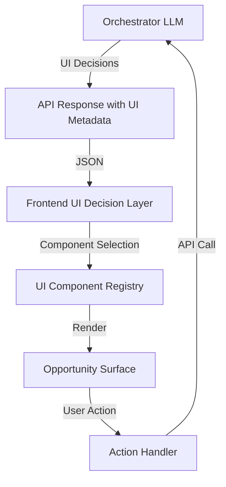
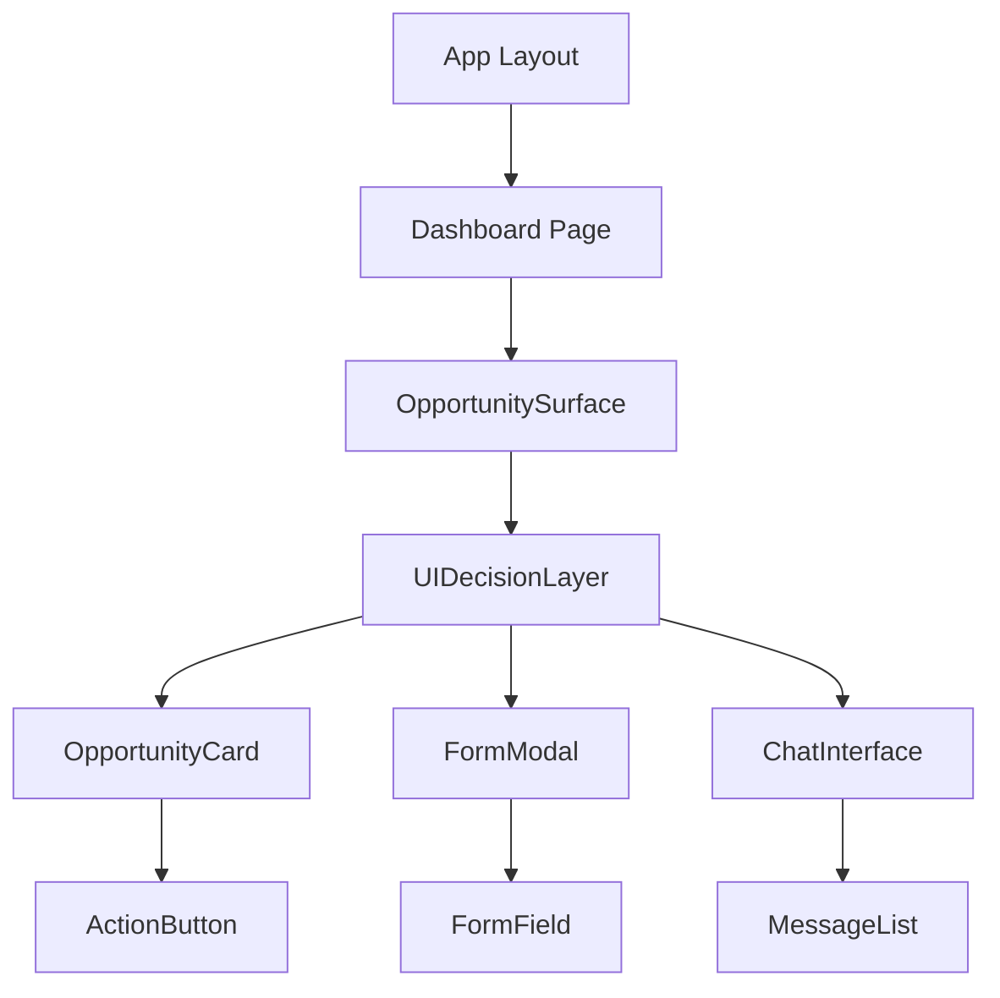
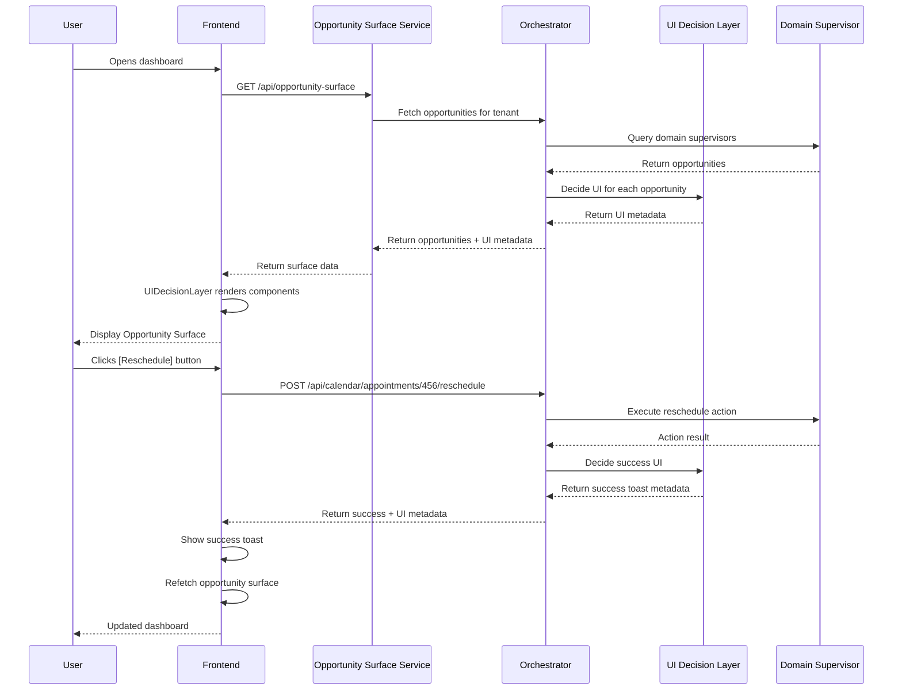

# Frontend Architecture

**Status:** ✅ Complete
**Last Updated:** 2025-01-28
**Owner:** Architecture Team

---

## Table of Contents

1. [Overview](#overview)
2. [Architecture Philosophy](#architecture-philosophy)
3. [UI Component Registry](#ui-component-registry)
4. [UI Decision Layer](#ui-decision-layer)
5. [Opportunity Surface Service](#opportunity-surface-service)
6. [State Management](#state-management)
7. [API Response Schema](#api-response-schema)
8. [Component Hierarchy](#component-hierarchy)
9. [Data Flow](#data-flow)
10. [Best Practices](#best-practices)

---

## 1. Overview

Fidus frontend is built on **AI-driven UI** principles, where the LLM decides which UI components to show based on user context and opportunities.

### Key Concepts

| Concept | Definition | Example |
|---------|------------|---------|
| **UI Component Registry** | Catalog of available UI components the LLM can select | `OpportunityCard`, `FormModal`, `ChatInterface` |
| **UI Decision Layer** | LLM-powered layer that chooses UI components | "Show FormModal for appointment creation" |
| **Opportunity Surface** | Dynamic dashboard that displays AI-selected opportunities | Main dashboard with cards |
| **UI Metadata** | Backend instructions for frontend rendering | `{ component: "OpportunityCard", urgency: "high" }` |

### Tech Stack

**Frontend (Web):**
- **Framework:** Next.js 14 (App Router)
- **UI Library:** React 18
- **State Management:** Zustand + React Query
- **Styling:** Tailwind CSS + CSS Variables
- **Type Safety:** TypeScript 5.3
- **Testing:** Vitest + React Testing Library
- **Build:** Turbopack

**Backend Communication:**
- **Protocol:** REST + WebSockets (for real-time updates)
- **Data Format:** JSON with UI metadata
- **Error Handling:** Zod schema validation

---

## 2. Architecture Philosophy

### AI-Driven UI Paradigm

**Traditional UI:**
```
User clicks "Add Appointment"
  → Frontend shows form
    → User fills form
      → Frontend sends to backend
```

**Fidus AI-Driven UI:**
```
Backend detects opportunity (double-booking)
  → LLM decides UI: "Show OpportunityCard with quick actions"
    → Frontend renders card with [Reschedule] buttons
      → User clicks button
        → Backend executes action
          → Frontend updates state
```

**Key Principle:** Backend controls **what** to show, frontend controls **how** to show it.

### Separation of Concerns



---

## 3. UI Component Registry

### Component Registry Concept

The **UI Component Registry** is a catalog of all available UI components that the LLM can choose from.

**Registry Structure:**

```typescript
// packages/web/src/registry/ui-component-registry.ts

export interface UIComponent {
  id: string;
  name: string;
  category: 'card' | 'modal' | 'form' | 'chat' | 'widget';
  description: string;
  props: Record<string, PropDefinition>;
  supports: {
    urgencyLevels: UrgencyLevel[];
    domains: DomainType[];
    actions: ActionType[];
  };
}

export const UI_COMPONENT_REGISTRY: Record<string, UIComponent> = {
  'opportunity-card': {
    id: 'opportunity-card',
    name: 'OpportunityCard',
    category: 'card',
    description: 'Standard opportunity card for dashboard',
    props: {
      title: { type: 'string', required: true },
      description: { type: 'string', required: true },
      urgency: { type: 'UrgencyLevel', required: true },
      actions: { type: 'Action[]', required: true },
      domain: { type: 'DomainType', required: true },
    },
    supports: {
      urgencyLevels: ['urgent', 'medium', 'low'],
      domains: ['calendar', 'finance', 'travel', 'communication'],
      actions: ['reschedule', 'dismiss', 'snooze', 'view_details'],
    },
  },

  'form-modal': {
    id: 'form-modal',
    name: 'FormModal',
    category: 'modal',
    description: 'Modal dialog with form for data entry',
    props: {
      title: { type: 'string', required: true },
      fields: { type: 'FormField[]', required: true },
      submitLabel: { type: 'string', required: false },
      cancelLabel: { type: 'string', required: false },
    },
    supports: {
      urgencyLevels: ['medium', 'low'],
      domains: ['all'],
      actions: ['create', 'update', 'delete'],
    },
  },

  'chat-interface': {
    id: 'chat-interface',
    name: 'ChatInterface',
    category: 'chat',
    description: 'Conversational UI for complex interactions',
    props: {
      initialMessage: { type: 'string', required: true },
      context: { type: 'ConversationContext', required: true },
    },
    supports: {
      urgencyLevels: ['medium', 'low'],
      domains: ['all'],
      actions: ['conversational'],
    },
  },

  'detail-panel': {
    id: 'detail-panel',
    name: 'DetailPanel',
    category: 'widget',
    description: 'Side panel for detailed information',
    props: {
      title: { type: 'string', required: true },
      content: { type: 'ReactNode', required: true },
      actions: { type: 'Action[]', required: false },
    },
    supports: {
      urgencyLevels: ['low'],
      domains: ['all'],
      actions: ['view_details', 'edit', 'delete'],
    },
  },

  'quick-action-toast': {
    id: 'quick-action-toast',
    name: 'QuickActionToast',
    category: 'widget',
    description: 'Temporary notification with quick actions',
    props: {
      message: { type: 'string', required: true },
      actions: { type: 'Action[]', required: true },
      duration: { type: 'number', required: false },
    },
    supports: {
      urgencyLevels: ['urgent'],
      domains: ['all'],
      actions: ['quick_action'],
    },
  },
};
```

### LLM Prompt for Component Selection

When the Orchestrator LLM needs to decide which UI to show, it receives the component registry as context:

```typescript
// packages/api/fidus/domain/orchestration/ui_decision_layer.py

UI_DECISION_PROMPT = """
You are the UI Decision Layer for Fidus. Given an opportunity, select the best UI component from the registry.

Available Components:
{component_registry_json}

Opportunity:
{opportunity_json}

Selection Criteria:
1. Match urgency level (urgent → toast/card, medium → card, low → detail panel)
2. Match domain compatibility
3. Match required actions
4. Consider user context (mobile vs desktop, current screen)

Respond with JSON:
{{
  "component_id": "opportunity-card",
  "props": {{
    "title": "Double booking detected",
    "urgency": "urgent",
    ...
  }},
  "reasoning": "OpportunityCard is best because..."
}}
"""
```

### Registering New Components

**Step 1: Create Component**

```typescript
// packages/web/src/components/opportunities/NewComponent.tsx

export interface NewComponentProps {
  title: string;
  customProp: string;
}

export function NewComponent({ title, customProp }: NewComponentProps) {
  return (
    <div>
      <h2>{title}</h2>
      <p>{customProp}</p>
    </div>
  );
}
```

**Step 2: Register in Registry**

```typescript
// packages/web/src/registry/ui-component-registry.ts

export const UI_COMPONENT_REGISTRY = {
  ...
  'new-component': {
    id: 'new-component',
    name: 'NewComponent',
    category: 'widget',
    description: 'Custom component for specific use case',
    props: {
      title: { type: 'string', required: true },
      customProp: { type: 'string', required: true },
    },
    supports: {
      urgencyLevels: ['medium'],
      domains: ['calendar'],
      actions: ['custom_action'],
    },
  },
};
```

**Step 3: Add to Component Map**

```typescript
// packages/web/src/registry/component-map.tsx

import { NewComponent } from '@/components/opportunities/NewComponent';

export const COMPONENT_MAP = {
  'opportunity-card': OpportunityCard,
  'form-modal': FormModal,
  'new-component': NewComponent, // ← Add here
  ...
};
```

---

## 4. UI Decision Layer

### Frontend UI Decision Layer

The **UI Decision Layer** receives UI metadata from the backend and renders the appropriate component.

**Implementation:**

```typescript
// packages/web/src/services/ui-decision-layer.ts

import { COMPONENT_MAP } from '@/registry/component-map';
import { UIComponentMetadata } from '@fidus/shared/types';

export interface UIDecisionLayerProps {
  metadata: UIComponentMetadata;
}

export function UIDecisionLayer({ metadata }: UIDecisionLayerProps) {
  const { component_id, props, fallback } = metadata;

  // Look up component in registry
  const Component = COMPONENT_MAP[component_id];

  if (!Component) {
    console.error(`Component ${component_id} not found in registry`);

    // Fallback to default component
    if (fallback) {
      const FallbackComponent = COMPONENT_MAP[fallback.component_id];
      if (FallbackComponent) {
        return <FallbackComponent {...fallback.props} />;
      }
    }

    // Last resort: show error state
    return <ErrorFallback message="UI component unavailable" />;
  }

  // Validate props against component schema
  const validationResult = validateProps(component_id, props);
  if (!validationResult.success) {
    console.error('Props validation failed:', validationResult.errors);
    return <ErrorFallback message="Invalid component props" />;
  }

  // Render component with props
  return <Component {...props} />;
}
```

### Backend UI Decision Layer

The **Backend UI Decision Layer** is part of the Orchestrator and uses the LLM to decide which UI component to show.

**Implementation:**

```python
# packages/api/fidus/domain/orchestration/ui_decision_layer.py

from typing import Dict, Any, Optional
from fidus.domain.orchestration.ui_component_registry import UI_COMPONENT_REGISTRY
from fidus.infrastructure.llm import LLMService

class UIDecisionLayer:
    """Decides which UI component to show for an opportunity."""

    def __init__(self, llm_service: LLMService):
        self.llm = llm_service
        self.registry = UI_COMPONENT_REGISTRY

    async def decide_ui(
        self,
        opportunity: Dict[str, Any],
        user_context: Dict[str, Any],
    ) -> Dict[str, Any]:
        """
        Use LLM to decide which UI component to show.

        Args:
            opportunity: Opportunity details (title, urgency, domain, etc.)
            user_context: User context (device, screen, preferences)

        Returns:
            UI metadata with component_id, props, and fallback
        """
        prompt = self._build_prompt(opportunity, user_context)

        response = await self.llm.complete(
            prompt=prompt,
            response_format="json",
            max_tokens=500,
        )

        ui_decision = self._parse_response(response)

        # Validate component exists in registry
        if ui_decision['component_id'] not in self.registry:
            # Fallback to default
            ui_decision = self._get_default_component(opportunity)

        # Add fallback component
        ui_decision['fallback'] = self._get_fallback_component(opportunity)

        return ui_decision

    def _build_prompt(
        self,
        opportunity: Dict[str, Any],
        user_context: Dict[str, Any],
    ) -> str:
        """Build LLM prompt for UI decision."""
        return f"""
You are the UI Decision Layer for Fidus. Select the best UI component.

Available Components:
{self._format_registry()}

Opportunity:
- Title: {opportunity['title']}
- Urgency: {opportunity['urgency']}
- Domain: {opportunity['domain']}
- Actions: {opportunity['actions']}

User Context:
- Device: {user_context.get('device', 'desktop')}
- Screen: {user_context.get('screen', 'dashboard')}
- Preferences: {user_context.get('preferences', {{}})}

Select component and provide props. Respond with JSON:
{{
  "component_id": "opportunity-card",
  "props": {{ ... }},
  "reasoning": "..."
}}
"""

    def _get_default_component(self, opportunity: Dict[str, Any]) -> Dict[str, Any]:
        """Get default component for opportunity."""
        urgency = opportunity.get('urgency', 'medium')

        # Default component based on urgency
        if urgency == 'urgent':
            component_id = 'quick-action-toast'
        elif urgency == 'medium':
            component_id = 'opportunity-card'
        else:
            component_id = 'detail-panel'

        return {
            'component_id': component_id,
            'props': {
                'title': opportunity.get('title', 'Untitled'),
                'description': opportunity.get('description', ''),
                'urgency': urgency,
                'actions': opportunity.get('actions', []),
            },
        }
```

---

## 5. Opportunity Surface Service

### Concept

The **Opportunity Surface Service** manages the dynamic dashboard, deciding which opportunities to show and in what order.

### Backend Implementation

```python
# packages/api/fidus/domain/proactivity/opportunity_surface_service.py

from typing import List, Dict, Any
from fidus.domain.proactivity.opportunity import Opportunity
from fidus.domain.orchestration.ui_decision_layer import UIDecisionLayer

class OpportunitySurfaceService:
    """
    Manages the Opportunity Surface (dashboard).

    Responsibilities:
    - Rank opportunities by urgency and relevance
    - Decide UI component for each opportunity
    - Deduplicate similar opportunities
    - Apply user preferences (filters, limits)
    """

    def __init__(self, ui_decision_layer: UIDecisionLayer):
        self.ui_decision = ui_decision_layer

    async def get_surface(
        self,
        tenant_id: str,
        user_context: Dict[str, Any],
        filters: Optional[Dict[str, Any]] = None,
    ) -> List[Dict[str, Any]]:
        """
        Get opportunities for Opportunity Surface.

        Args:
            tenant_id: Tenant ID
            user_context: User context (device, preferences)
            filters: Optional filters (domains, urgency levels)

        Returns:
            List of opportunities with UI metadata
        """
        # 1. Fetch all opportunities for tenant
        opportunities = await self._fetch_opportunities(tenant_id)

        # 2. Apply filters
        if filters:
            opportunities = self._apply_filters(opportunities, filters)

        # 3. Rank by urgency and relevance
        ranked = self._rank_opportunities(opportunities, user_context)

        # 4. Deduplicate similar opportunities
        deduplicated = self._deduplicate(ranked)

        # 5. Apply user limits (max cards)
        limited = deduplicated[:user_context.get('max_cards', 20)]

        # 6. Decide UI component for each opportunity
        surface = []
        for opp in limited:
            ui_metadata = await self.ui_decision.decide_ui(opp, user_context)
            surface.append({
                'opportunity_id': opp['id'],
                'ui_metadata': ui_metadata,
                'data': opp,
            })

        return surface

    def _rank_opportunities(
        self,
        opportunities: List[Dict[str, Any]],
        user_context: Dict[str, Any],
    ) -> List[Dict[str, Any]]:
        """Rank opportunities by urgency and relevance."""
        urgency_score = {'urgent': 3, 'medium': 2, 'low': 1}

        def score(opp):
            # Base score from urgency
            score = urgency_score.get(opp['urgency'], 0)

            # Boost score for preferred domains
            preferred_domains = user_context.get('preferred_domains', [])
            if opp['domain'] in preferred_domains:
                score += 1

            # Boost score for recent opportunities
            if opp.get('created_at'):
                age_hours = (datetime.utcnow() - opp['created_at']).total_seconds() / 3600
                if age_hours < 1:
                    score += 0.5

            return score

        return sorted(opportunities, key=score, reverse=True)

    def _deduplicate(
        self,
        opportunities: List[Dict[str, Any]],
    ) -> List[Dict[str, Any]]:
        """Deduplicate similar opportunities."""
        seen = set()
        unique = []

        for opp in opportunities:
            # Create fingerprint (title + domain + action)
            fingerprint = (
                opp['title'],
                opp['domain'],
                tuple(sorted(opp.get('actions', [])))
            )

            if fingerprint not in seen:
                seen.add(fingerprint)
                unique.append(opp)

        return unique
```

### Frontend Implementation

```typescript
// packages/web/src/services/opportunity-surface-service.ts

import { useQuery } from '@tanstack/react-query';
import { OpportunitySurface } from '@fidus/shared/types';

export function useOpportunitySurface() {
  return useQuery({
    queryKey: ['opportunity-surface'],
    queryFn: async (): Promise<OpportunitySurface> => {
      const response = await fetch('/api/opportunity-surface', {
        headers: {
          'Content-Type': 'application/json',
        },
      });

      if (!response.ok) {
        throw new Error('Failed to fetch opportunity surface');
      }

      return response.json();
    },
    refetchInterval: 30000, // Refetch every 30 seconds
    staleTime: 10000, // Consider stale after 10 seconds
  });
}

// Component
export function OpportunitySurface() {
  const { data, isLoading, error } = useOpportunitySurface();

  if (isLoading) return <SurfaceLoader />;
  if (error) return <SurfaceError error={error} />;
  if (!data?.opportunities.length) return <EmptySurface />;

  return (
    <div className="opportunity-surface">
      {data.opportunities.map((item) => (
        <UIDecisionLayer
          key={item.opportunity_id}
          metadata={item.ui_metadata}
        />
      ))}
    </div>
  );
}
```

---

## 6. State Management

### State Architecture

Fidus uses **Zustand** for global state and **React Query** for server state.

**State Categories:**

| Category | Storage | Library | Example |
|----------|---------|---------|---------|
| **Server State** | Cache | React Query | Opportunities, calendar events |
| **UI State** | Zustand | Zustand | Sidebar open/closed, filters |
| **Form State** | Local | React useState | Form inputs, validation |
| **Auth State** | Zustand + LocalStorage | Zustand | User session, tokens |

### Zustand Store Structure

```typescript
// packages/web/src/stores/app-store.ts

import { create } from 'zustand';
import { persist } from 'zustand/middleware';

interface AppState {
  // UI State
  sidebarOpen: boolean;
  theme: 'light' | 'dark' | 'system';

  // Filters
  filters: {
    domains: string[];
    urgencyLevels: string[];
    dateRange: { start: Date; end: Date } | null;
  };

  // User Preferences
  preferences: {
    maxCards: number;
    autoRefresh: boolean;
    notificationsEnabled: boolean;
  };

  // Actions
  toggleSidebar: () => void;
  setTheme: (theme: 'light' | 'dark' | 'system') => void;
  setFilters: (filters: Partial<AppState['filters']>) => void;
  setPreferences: (prefs: Partial<AppState['preferences']>) => void;
}

export const useAppStore = create<AppState>()(
  persist(
    (set) => ({
      // Initial state
      sidebarOpen: true,
      theme: 'system',
      filters: {
        domains: [],
        urgencyLevels: [],
        dateRange: null,
      },
      preferences: {
        maxCards: 20,
        autoRefresh: true,
        notificationsEnabled: true,
      },

      // Actions
      toggleSidebar: () => set((state) => ({ sidebarOpen: !state.sidebarOpen })),
      setTheme: (theme) => set({ theme }),
      setFilters: (filters) =>
        set((state) => ({
          filters: { ...state.filters, ...filters },
        })),
      setPreferences: (prefs) =>
        set((state) => ({
          preferences: { ...state.preferences, ...prefs },
        })),
    }),
    {
      name: 'fidus-app-storage',
      partialize: (state) => ({
        theme: state.theme,
        preferences: state.preferences,
        // Don't persist filters (reset on reload)
      }),
    }
  )
);
```

### React Query Setup

```typescript
// packages/web/src/lib/react-query.ts

import { QueryClient } from '@tanstack/react-query';

export const queryClient = new QueryClient({
  defaultOptions: {
    queries: {
      staleTime: 1000 * 60, // 1 minute
      cacheTime: 1000 * 60 * 5, // 5 minutes
      refetchOnWindowFocus: true,
      refetchOnReconnect: true,
      retry: 3,
      retryDelay: (attemptIndex) => Math.min(1000 * 2 ** attemptIndex, 30000),
    },
    mutations: {
      retry: false,
    },
  },
});
```

---

## 7. API Response Schema

### UI Metadata Schema

**Backend sends UI metadata with every response:**

```typescript
// packages/shared/src/types/api.ts

export interface APIResponse<T = unknown> {
  // Data
  data: T;

  // UI Metadata
  ui_metadata?: UIComponentMetadata;

  // Pagination (if applicable)
  pagination?: {
    page: number;
    page_size: number;
    total: number;
  };

  // Errors
  errors?: APIError[];
}

export interface UIComponentMetadata {
  // Component to render
  component_id: string;

  // Props for component
  props: Record<string, unknown>;

  // Fallback component (if primary fails)
  fallback?: {
    component_id: string;
    props: Record<string, unknown>;
  };

  // UI hints
  hints?: {
    auto_focus?: boolean;
    auto_dismiss_ms?: number;
    position?: 'top' | 'center' | 'bottom';
  };
}

export interface APIError {
  code: string;
  message: string;
  field?: string;
  details?: Record<string, unknown>;
}
```

### Example API Response

**Opportunity Surface Response:**

```json
{
  "data": {
    "opportunities": [
      {
        "opportunity_id": "opp-123",
        "ui_metadata": {
          "component_id": "opportunity-card",
          "props": {
            "title": "Double booking detected",
            "description": "You have two meetings at 2pm today",
            "urgency": "urgent",
            "domain": "calendar",
            "actions": [
              {
                "id": "reschedule-team-sync",
                "label": "Reschedule Team Sync",
                "type": "primary",
                "endpoint": "/api/calendar/appointments/456/reschedule"
              },
              {
                "id": "cancel-client-call",
                "label": "Cancel Client Call",
                "type": "secondary",
                "endpoint": "/api/calendar/appointments/457/cancel"
              }
            ]
          },
          "fallback": {
            "component_id": "simple-card",
            "props": {
              "title": "Double booking detected",
              "message": "View details in Calendar"
            }
          }
        },
        "data": {
          "appointments": [
            { "id": "456", "title": "Team Sync", "start": "2025-01-28T14:00:00Z" },
            { "id": "457", "title": "Client Call", "start": "2025-01-28T14:00:00Z" }
          ]
        }
      }
    ]
  }
}
```

---

## 8. Component Hierarchy

### Folder Structure

```
packages/web/src/
+-- app/                      # Next.js App Router
|   +-- (dashboard)/
|   |   +-- page.tsx          # Dashboard (Opportunity Surface)
|   |   +-- calendar/
|   |   +-- finance/
|   |   +-- settings/
|   +-- api/                  # API routes (proxy to backend)
|   +-- layout.tsx
+-- components/
|   +-- opportunities/        # Opportunity components
|   |   +-- OpportunityCard.tsx
|   |   +-- QuickActionToast.tsx
|   |   +-- DetailPanel.tsx
|   +-- forms/                # Form components
|   |   +-- FormModal.tsx
|   |   +-- FormField.tsx
|   |   +-- FormValidation.tsx
|   +-- layout/               # Layout components
|   |   +-- Sidebar.tsx
|   |   +-- Header.tsx
|   |   +-- Footer.tsx
|   +-- ui/                   # Design system components
|       +-- Button.tsx
|       +-- Card.tsx
|       +-- Input.tsx
+-- services/                 # Business logic
|   +-- api-client.ts
|   +-- ui-decision-layer.ts
|   +-- opportunity-surface-service.ts
+-- stores/                   # Zustand stores
|   +-- app-store.ts
|   +-- auth-store.ts
|   +-- user-store.ts
+-- registry/                 # UI Component Registry
|   +-- ui-component-registry.ts
|   +-- component-map.tsx
+-- hooks/                    # Custom hooks
|   +-- useOpportunities.ts
|   +-- useAuth.ts
|   +-- useMediaQuery.ts
+-- lib/                      # Utilities
    +-- utils.ts
    +-- react-query.ts
    +-- validation.ts
```

### Component Composition



---

## 9. Data Flow

### Complete Flow Diagram



### Real-Time Updates (WebSockets)

```typescript
// packages/web/src/services/websocket-client.ts

import { io, Socket } from 'socket.io-client';
import { queryClient } from '@/lib/react-query';

class WebSocketClient {
  private socket: Socket | null = null;

  connect(tenantId: string) {
    this.socket = io(`${process.env.NEXT_PUBLIC_WS_URL}`, {
      auth: {
        tenant_id: tenantId,
      },
    });

    // Listen for opportunity updates
    this.socket.on('opportunity:created', (data) => {
      queryClient.invalidateQueries(['opportunity-surface']);
    });

    this.socket.on('opportunity:updated', (data) => {
      queryClient.setQueryData(['opportunity-surface'], (old: any) => {
        // Update specific opportunity in cache
        return {
          ...old,
          opportunities: old.opportunities.map((opp: any) =>
            opp.opportunity_id === data.opportunity_id
              ? { ...opp, ...data }
              : opp
          ),
        };
      });
    });

    this.socket.on('opportunity:dismissed', (data) => {
      queryClient.setQueryData(['opportunity-surface'], (old: any) => {
        return {
          ...old,
          opportunities: old.opportunities.filter(
            (opp: any) => opp.opportunity_id !== data.opportunity_id
          ),
        };
      });
    });
  }

  disconnect() {
    this.socket?.disconnect();
    this.socket = null;
  }
}

export const wsClient = new WebSocketClient();
```

---

## 10. Best Practices

### DO ✅

**Architecture:**
- ✅ Keep UI Component Registry up to date
- ✅ Use UI Decision Layer for all dynamic UI
- ✅ Validate UI metadata with Zod schemas
- ✅ Provide fallback components
- ✅ Use TypeScript for type safety

**State Management:**
- ✅ Use React Query for server state
- ✅ Use Zustand for UI state
- ✅ Keep local state for forms
- ✅ Persist user preferences
- ✅ Invalidate cache on mutations

**Components:**
- ✅ Build reusable, composable components
- ✅ Follow design system patterns
- ✅ Use CSS variables for theming
- ✅ Test components with Vitest
- ✅ Document props with JSDoc

**Performance:**
- ✅ Code split routes with Next.js
- ✅ Lazy load heavy components
- ✅ Memoize expensive computations
- ✅ Use React Query caching
- ✅ Optimize bundle size

### DON'T ❌

**Architecture:**
- ❌ Hardcode UI decisions in frontend
- ❌ Bypass UI Decision Layer
- ❌ Ignore UI metadata from backend
- ❌ Forget fallback components
- ❌ Skip Zod validation

**State Management:**
- ❌ Use Zustand for server state
- ❌ Duplicate data across stores
- ❌ Forget to invalidate cache
- ❌ Persist sensitive data
- ❌ Mutate state directly

**Components:**
- ❌ Build monolithic components
- ❌ Hardcode styles (use variables)
- ❌ Skip accessibility
- ❌ Forget error boundaries
- ❌ Skip testing

**Performance:**
- ❌ Load all components eagerly
- ❌ Re-render entire tree
- ❌ Fetch data without caching
- ❌ Bundle entire lodash
- ❌ Skip performance profiling

---

## Related Documentation

- [01-ai-driven-ui-paradigm.md](01-ai-driven-ui-paradigm.md) - AI-driven UI philosophy
- [05-design-system-components.md](05-design-system-components.md) - Component specifications
- [06-opportunity-cards-layouts.md](06-opportunity-cards-layouts.md) - Opportunity card patterns
- [docs/architecture/README.md](../architecture/README.md) - System architecture
- [docs/domain-model/03-orchestration-domain.md](../domain-model/03-orchestration-domain.md) - Orchestrator design

---

**Document Status:** ✅ Complete
**Last Review:** 2025-01-28
**Next Review:** 2025-02-28 (quarterly review)
