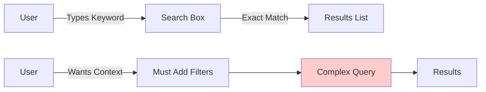
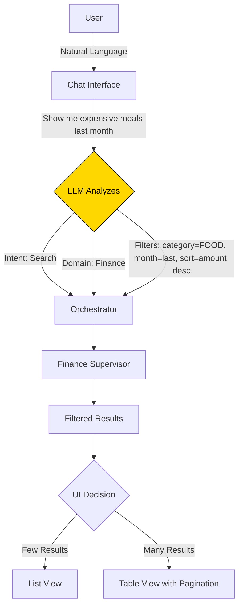
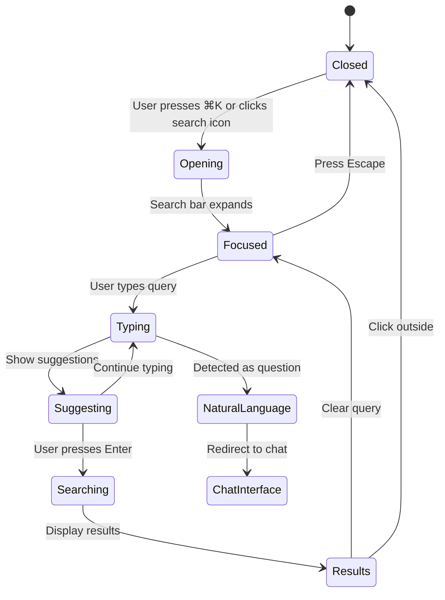
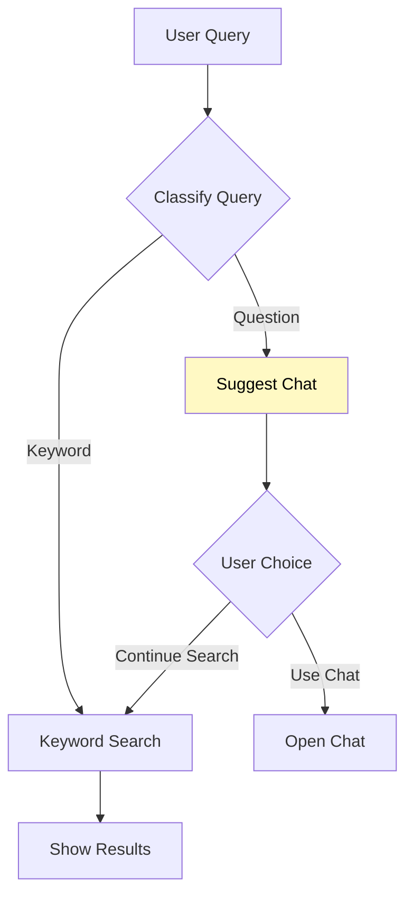
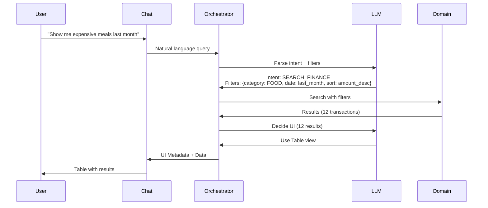
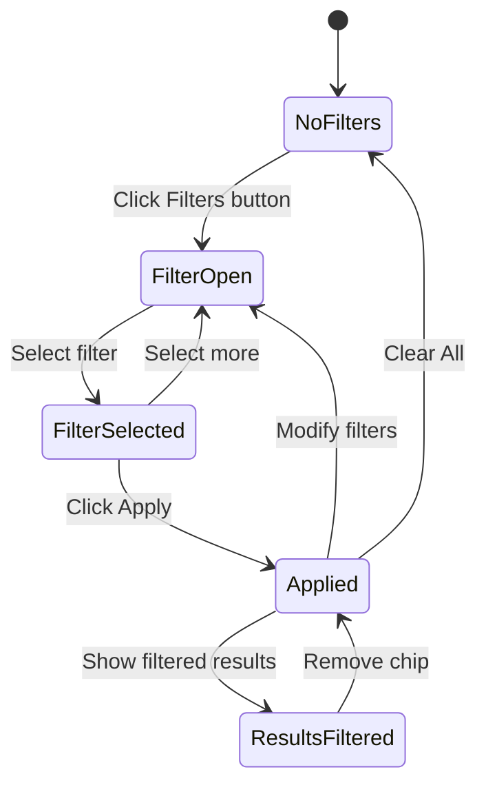

# Search & Filtering Patterns

**Version:** 1.0
**Date:** 2025-10-28
**Status:** Draft (Awaiting Human Review)
**Part of:** Fidus UX/UI Design
**Author:** AI-Generated

---

## Table of Contents

- [Overview](#overview)
- [Search Philosophy](#search-philosophy)
- [Global Search](#global-search)
- [Domain-Specific Search](#domain-specific-search)
- [Natural Language Search](#natural-language-search)
- [Filtering & Sorting](#filtering--sorting)
- [Search Results](#search-results)
- [Advanced Search](#advanced-search)
- [Search History](#search-history)
- [Accessibility](#accessibility)

---

## Overview

Fidus combines **traditional search** (keyword-based) with **AI-powered natural language search**. Users can search in two ways:

1. **Chat-based Search**: Natural language queries via chat interface (primary)
2. **Traditional Search**: Keyword search with filters (secondary, for power users)

### Key Principles

1. **AI-First**: Natural language search is the primary method
2. **Context-Aware**: Search understands current domain and user history
3. **Multi-Domain**: Search across Calendar, Finance, Travel, etc.
4. **Privacy-Preserving**: Local search for sensitive data
5. **Fast**: Results within 300ms for local search

---

## Search Philosophy

### Traditional Search (What We DON'T Prioritize)



**Problems:**
- User must know exact keywords
- No understanding of context or intent
- Requires manual filtering
- No semantic understanding

### Fidus Search (AI-Powered)



**Advantages:**
- Natural language ("expensive meals" → category=FOOD, sort by amount)
- Automatic filtering and sorting
- Context-aware (understands "last month")
- Optimal result rendering (list vs table)

---

## Global Search

### Access Points

**Primary: Chat Interface**
```
User types: "Find my dentist appointment"
→ Handled as natural language query
→ LLM searches Calendar domain
→ Returns result in chat
```

**Secondary: Search Bar** (optional, for power users)
```
+---------------------------------------------+
|  🔍 Search Fidus...                    ⌘K  |
+---------------------------------------------+
```

### Search Bar Behavior



### Search Bar UI

**Closed State:**
```
+----------------------------------------+
|  Dashboard                  🔍  ⚙️  👤 |
+----------------------------------------+
```

**Open State (⌘K pressed):**
```
+--------------------------------------------------+
|  Dashboard                                       |
+--------------------------------------------------+
|                                                   |
|  +--------------------------------------------+  |
|  | 🔍 Search Fidus...                    ⌘K  |  |
|  +--------------------------------------------+  |
|                                                   |
|  Recent Searches:                                |
|  • Dentist appointment                           |
|  • Food budget last month                        |
|  • Flights to Barcelona                          |
|                                                   |
|  Quick Actions:                                  |
|  • 📅 Add appointment                            |
|  • 💰 Add expense                                |
|  • ✈️ Plan trip                                  |
|                                                   |
+--------------------------------------------------+
```

**Typing State:**
```
+--------------------------------------------------+
|  +--------------------------------------------+  |
|  | 🔍 dentist                            ⌘K  |  |
|  +--------------------------------------------+  |
|                                                   |
|  💡 Did you mean a question? Try:                |
|  "When is my dentist appointment?"               |
|                                                   |
|  Suggestions:                                     |
|  📅 Dentist - Tomorrow at 5:30 PM                |
|  📅 Dentist - Last visit: Jan 15, 2025           |
|  💰 Dentist payment - €120 (Jan 15)              |
|                                                   |
|  Search in:                                       |
|  📅 Calendar  💰 Finance  ✈️ Travel  All         |
|                                                   |
+--------------------------------------------------+
```

### Natural Language Detection

If search query looks like a question, suggest using chat:



**Examples:**

| Query | Type | Handling |
|-------|------|----------|
| `dentist` | Keyword | Show search results |
| `When is my dentist appointment?` | Question | Suggest chat |
| `food budget` | Keyword | Show search results |
| `How much did I spend on food?` | Question | Suggest chat |
| `Barcelona` | Keyword | Show search results |
| `Plan a trip to Barcelona` | Request | Redirect to chat |

---

## Domain-Specific Search

Each domain has specialized search:

### Calendar Search

```
+--------------------------------------------------+
|  📅 Calendar Search                              |
+--------------------------------------------------+
|                                                   |
|  🔍 Search appointments...                       |
|                                                   |
|  Filters:                                         |
|  Date Range:  [This Week     ▼]                 |
|  Type:        [All           ▼]                 |
|  Sort By:     [Date (newest) ▼]                 |
|                                                   |
|  Results (3):                                    |
|                                                   |
|  +--------------------------------------------+  |
|  | Team Meeting                               |  |
|  | Tomorrow at 10:00 AM (1 hour)              |  |
|  | Conference Room A                          |  |
|  +--------------------------------------------+  |
|                                                   |
|  +--------------------------------------------+  |
|  | Client Call                                |  |
|  | Friday at 2:00 PM (30 min)                 |  |
|  | Video call                                 |  |
|  +--------------------------------------------+  |
|                                                   |
+--------------------------------------------------+
```

**Calendar-Specific Filters:**
- Date range (Today, This Week, This Month, Custom)
- Appointment type (Meeting, Reminder, All)
- Status (Upcoming, Past, Cancelled)
- Location (In-person, Remote, All)

### Finance Search

```
+--------------------------------------------------+
|  💰 Finance Search                               |
+--------------------------------------------------+
|                                                   |
|  🔍 Search transactions...                       |
|                                                   |
|  Filters:                                         |
|  Date Range:  [Last Month    ▼]                 |
|  Category:    [Food          ▼]                 |
|  Min Amount:  [              ]                   |
|  Max Amount:  [              ]                   |
|  Sort By:     [Amount (high) ▼]                 |
|                                                   |
|  Results (12):                                   |
|                                                   |
|  +--------------------------------------------+  |
|  | Grocery Shopping           -€85.50         |  |
|  | Oct 27 • FOOD • Supermarket               |  |
|  +--------------------------------------------+  |
|                                                   |
|  +--------------------------------------------+  |
|  | Restaurant Dinner          -€67.80         |  |
|  | Oct 25 • FOOD • Restaurant XYZ            |  |
|  +--------------------------------------------+  |
|                                                   |
|  [Load More]                                     |
|                                                   |
+--------------------------------------------------+
```

**Finance-Specific Filters:**
- Date range (This Week, This Month, Last Month, Custom)
- Category (FOOD, TRANSPORT, ENTERTAINMENT, etc.)
- Amount range (Min-Max)
- Transaction type (Expense, Income, All)
- Payment method (Cash, Card, Transfer)

### Travel Search

```
+--------------------------------------------------+
|  ✈️ Travel Search                                |
+--------------------------------------------------+
|                                                   |
|  🔍 Search trips...                              |
|                                                   |
|  Filters:                                         |
|  Status:      [Upcoming      ▼]                 |
|  Type:        [All           ▼]                 |
|  Destination: [              ]                   |
|                                                   |
|  Results (2):                                    |
|                                                   |
|  +--------------------------------------------+  |
|  | Barcelona Weekend                          |  |
|  | Nov 15-17, 2025                            |  |
|  | Flight + Hotel booked                      |  |
|  +--------------------------------------------+  |
|                                                   |
|  +--------------------------------------------+  |
|  | Berlin Conference                          |  |
|  | Dec 5-8, 2025                              |  |
|  | Planning in progress                       |  |
|  +--------------------------------------------+  |
|                                                   |
+--------------------------------------------------+
```

**Travel-Specific Filters:**
- Status (Planning, Booked, Ongoing, Completed)
- Type (Business, Personal, All)
- Destination (Free text)
- Date range

---

## Natural Language Search

Primary search method in Fidus. Handled by chat interface.

### How It Works



### Natural Language Examples

**Calendar Queries:**
```
"When is my dentist appointment?"
→ Search Calendar for "dentist"
→ Return next upcoming appointment

"Show me meetings this week"
→ Filter Calendar: type=meeting, date_range=this_week
→ Return list view

"Do I have anything on Friday?"
→ Filter Calendar: date=next_friday
→ Return day view
```

**Finance Queries:**
```
"How much did I spend on food last month?"
→ Search Finance: category=FOOD, date=last_month
→ Return sum + breakdown

"Show me my most expensive transactions"
→ Search Finance: sort=amount_desc, limit=10
→ Return table view

"What's my biggest budget category?"
→ Analyze Finance: group_by=category, sort=spent_desc
→ Return chart view
```

**Travel Queries:**
```
"When is my Barcelona trip?"
→ Search Travel: destination=Barcelona, status=upcoming
→ Return trip details

"Show me past trips this year"
→ Filter Travel: status=completed, date_range=this_year
→ Return list view

"Do I have any trips next month?"
→ Filter Travel: date_range=next_month
→ Return list or "No trips"
```

### Handling Ambiguity

If query is ambiguous, ask for clarification:

```
User: "Show me John"

Fidus: I found multiple results for "John":

📅 Calendar:
• Meeting with John - Tomorrow at 2pm
• John's Birthday - Dec 15

💰 Finance:
• Payment to John - €50 (Oct 20)

📧 Communication:
• 3 emails from John Smith

Which one did you mean?
```

---

## Filtering & Sorting

### Filter Panel

**Collapsed State:**
```
+--------------------------------------------------+
|  Finance Transactions                            |
+--------------------------------------------------+
|                                                   |
|  🔍 Search...          [Filters (2) ▼] [Sort ▼] |
|                                                   |
|  Active Filters:                                 |
|  • Category: Food ✕                              |
|  • Last Month ✕                                  |
|                                                   |
|  [Clear All Filters]                             |
|                                                   |
+--------------------------------------------------+
```

**Expanded State:**
```
+--------------------------------------------------+
|  Filters                                         |
+--------------------------------------------------+
|                                                   |
|  Date Range:                                     |
|  ◉ Last Month                                    |
|  ○ This Month                                    |
|  ○ Last 3 Months                                 |
|  ○ Custom Range                                  |
|                                                   |
|  Category:                                       |
|  ☑️ Food                                         |
|  ☐ Transport                                     |
|  ☐ Entertainment                                 |
|  ☐ Shopping                                      |
|  ☐ Health                                        |
|  ☐ Other                                         |
|                                                   |
|  Amount Range:                                   |
|  Min: [     ] Max: [     ]                       |
|                                                   |
|  [Apply Filters]  [Reset]                        |
|                                                   |
+--------------------------------------------------+
```

### Sort Options

```
+--------------------------------------------------+
|  Sort By:                                        |
+--------------------------------------------------+
|  ◉ Date (newest first)                           |
|  ○ Date (oldest first)                           |
|  ○ Amount (highest first)                        |
|  ○ Amount (lowest first)                         |
|  ○ Category (A-Z)                                |
|  ○ Relevance                                     |
+--------------------------------------------------+
```

### Filter Chips

Active filters shown as dismissible chips:

```
+--------------------------------------------------+
|  Active Filters:                                 |
|  +----------+ +----------+ +----------------+  |
|  | Food  ✕  | | Oct 2025 ✕| | > €50        ✕|  |
|  +----------+ +----------+ +----------------+  |
|                                                   |
|  [Clear All]                                     |
+--------------------------------------------------+
```

### Filter Interactions



---

## Search Results

### Result Types

**List View** (default for <20 results):
```
+--------------------------------------------------+
|  Results (3)                          [≡] [⊞]   |
+--------------------------------------------------+
|                                                   |
|  +--------------------------------------------+  |
|  | 📅 Team Meeting                            |  |
|  | Tomorrow at 10:00 AM (1 hour)              |  |
|  | Conference Room A                          |  |
|  | [View] [Edit]                              |  |
|  +--------------------------------------------+  |
|                                                   |
|  +--------------------------------------------+  |
|  | 💰 Grocery Shopping - €85.50               |  |
|  | Oct 27 • FOOD • Supermarket               |  |
|  | [View] [Categorize]                        |  |
|  +--------------------------------------------+  |
|                                                   |
+--------------------------------------------------+
```

**Table View** (for >20 results):
```
+------------------------------------------------------------+
|  Results (47)                            [≡] [⊞] Export ↓  |
+------------------------------------------------------------+
|                                                             |
|  Date       | Description          | Category | Amount     |
|  -----------+----------------------+----------+----------  |
|  Oct 27     | Grocery Shopping     | FOOD     | -€85.50   |
|  Oct 25     | Restaurant Dinner    | FOOD     | -€67.80   |
|  Oct 23     | Coffee Shop          | FOOD     | -€12.50   |
|  Oct 20     | Supermarket          | FOOD     | -€103.20  |
|  Oct 18     | Lunch Meeting        | FOOD     | -€45.00   |
|                                                             |
|  Showing 1-10 of 47        [◀] [1] [2] [3] [4] [5] [▶]    |
|                                                             |
+------------------------------------------------------------+
```

**Grid View** (for visual content like trips):
```
+--------------------------------------------------+
|  Results (6)                          [≡] [⊞]   |
+--------------------------------------------------+
|                                                   |
|  +-------------+  +-------------+               |
|  | Barcelona   |  | Berlin      |               |
|  | Nov 15-17   |  | Dec 5-8     |               |
|  | 🏖️ Weekend  |  | 💼 Business |               |
|  +-------------+  +-------------+               |
|                                                   |
|  +-------------+  +-------------+               |
|  | Paris       |  | Amsterdam   |               |
|  | Jan 10-14   |  | Feb 2-4     |               |
|  | 🏖️ Vacation |  | 🏖️ Weekend  |               |
|  +-------------+  +-------------+               |
|                                                   |
+--------------------------------------------------+
```

### Empty Results

```
+--------------------------------------------------+
|  No Results Found                                |
+--------------------------------------------------+
|                                                   |
|              +----------+                         |
|              | 🔍 No    |                         |
|              | Results  |                         |
|              +----------+                         |
|                                                   |
|  No transactions found matching your search.     |
|                                                   |
|  Try:                                             |
|  • Removing some filters                         |
|  • Checking your spelling                        |
|  • Using different keywords                      |
|  • Searching in a different domain               |
|                                                   |
|  Or ask me in natural language:                  |
|  "Show me all food expenses"                     |
|                                                   |
|  [Clear Filters]  [Try Chat]                     |
|                                                   |
+--------------------------------------------------+
```

### Result Actions

Each result has contextual actions:

| Domain | Actions |
|--------|---------|
| Calendar | View Details, Edit, Reschedule, Cancel |
| Finance | View Details, Edit Category, Add Note, Delete |
| Travel | View Trip, Edit, Cancel Booking |
| Communication | Reply, Archive, Mark as Read |

---

## Advanced Search

For power users who need complex queries:

### Advanced Search Panel

```
+--------------------------------------------------+
|  Advanced Search                                 |
+--------------------------------------------------+
|                                                   |
|  Domain:      [Finance           ▼]              |
|                                                   |
|  Conditions:                                     |
|  +--------------------------------------------+  |
|  | Category    [is]      [Food          ▼]   |  |
|  +--------------------------------------------+  |
|  +--------------------------------------------+  |
|  | Amount      [greater than]  [50]          |  |
|  +--------------------------------------------+  |
|  +--------------------------------------------+  |
|  | Date        [in range]  [Oct 1 - Oct 31]  |  |
|  +--------------------------------------------+  |
|                                                   |
|  [+ Add Condition]                               |
|                                                   |
|  Match:  ◉ All conditions  ○ Any condition       |
|                                                   |
|  [Search]  [Save as Preset]  [Reset]             |
|                                                   |
+--------------------------------------------------+
```

### Saved Search Presets

```
+--------------------------------------------------+
|  Saved Searches                                  |
+--------------------------------------------------+
|                                                   |
|  ⭐ Expensive Food Purchases                     |
|     Category: Food, Amount > €50                 |
|     [Load] [Edit] [Delete]                       |
|                                                   |
|  ⭐ Upcoming Work Meetings                       |
|     Type: Meeting, Status: Upcoming              |
|     [Load] [Edit] [Delete]                       |
|                                                   |
|  ⭐ Weekend Trips                                |
|     Type: Personal, Duration: 2-3 days           |
|     [Load] [Edit] [Delete]                       |
|                                                   |
|  [+ New Saved Search]                            |
|                                                   |
+--------------------------------------------------+
```

---

## Search History

Fidus remembers recent searches for quick access:

### Search History Panel

```
+--------------------------------------------------+
|  Recent Searches                                 |
+--------------------------------------------------+
|                                                   |
|  Today:                                          |
|  🔍 dentist appointment                          |
|  🔍 food expenses last month                     |
|  🔍 Barcelona trip                               |
|                                                   |
|  Yesterday:                                      |
|  🔍 team meetings this week                      |
|  🔍 budget status                                |
|                                                   |
|  This Week:                                      |
|  🔍 flights to Paris                             |
|  🔍 grocery receipts                             |
|                                                   |
|  [Clear History]                                 |
|                                                   |
+--------------------------------------------------+
```

### Privacy

**Important:** Search history is stored **locally only** and can be cleared anytime.

```
+--------------------------------------------------+
|  🔒 Privacy: Search History                      |
+--------------------------------------------------+
|                                                   |
|  Your search history is stored locally on your   |
|  device and never sent to the cloud.             |
|                                                   |
|  Current storage: 47 KB (128 searches)           |
|                                                   |
|  Options:                                         |
|  ☑️ Save search history                          |
|  ☑️ Show recent searches in search bar           |
|  ☐ Sync search history across devices (cloud)   |
|                                                   |
|  [Clear All History]                             |
|                                                   |
+--------------------------------------------------+
```

---

## Accessibility

### Keyboard Shortcuts

| Shortcut | Action |
|----------|--------|
| `⌘K` or `Ctrl+K` | Open global search |
| `Escape` | Close search |
| `↓` / `↑` | Navigate results |
| `Enter` | Open selected result |
| `⌘F` or `Ctrl+F` | Open filter panel |
| `/` | Focus search box (quick search) |

### Screen Reader Support

**Search Bar:**
```
[Screen Reader]: "Search Fidus. Combobox. Type to search.
Recent searches: Dentist appointment, Food budget last month.
Quick actions: Add appointment, Add expense, Plan trip."
```

**Search Results:**
```
[Screen Reader]: "Search results. 3 items found.
Result 1 of 3: Team Meeting. Tomorrow at 10:00 AM.
Conference Room A. Buttons: View, Edit."
```

**Filters:**
```
[Screen Reader]: "Filters. 2 filters active.
Category: Food. Remove filter button.
Date: Last Month. Remove filter button.
Button: Clear all filters."
```

### Visual Indicators

**Search State:**
- Loading: Spinner + "Searching..."
- Results found: Count + results
- No results: Empty state with suggestions
- Error: Error message with retry option

**Filter State:**
- Active filters: Yellow badge count
- Applied filter: Yellow chip with X
- Modified filter: Unsaved indicator

---

## Conclusion

Fidus search combines the best of both worlds:

1. **AI-Powered Natural Language Search** (Primary)
   - Conversational queries
   - Automatic filtering and sorting
   - Context-aware results
   - Optimal UI rendering

2. **Traditional Keyword Search** (Secondary)
   - Power user features
   - Advanced filtering
   - Saved search presets
   - Bulk operations

### Design Principles Applied

✅ **AI-First**: Natural language is the primary method
✅ **Privacy-Preserving**: Search history stays local
✅ **Fast**: <300ms for local search
✅ **Accessible**: WCAG 2.1 AA compliant
✅ **Context-Aware**: Understands user intent and domain

### Next Steps

1. Implement global search bar with ⌘K shortcut
2. Add natural language query parsing to Orchestrator
3. Create domain-specific search interfaces
4. Implement filter panels with chip UI
5. Add search history storage (local)
6. Create advanced search builder
7. Test with screen readers

---

**Document Version:** 1.0
**Authors:** UX/UI Team
**Review Status:** Draft - Pending Review
**Related Documents:**
- [AI-Driven UI Paradigm](00-ai-driven-ui-paradigm.md)
- [Interaction Patterns](04-interaction-patterns.md)
- [Design System Components](05-design-system-components.md)
- [Frontend Architecture](../solution-architecture/13-frontend-architecture.md)
