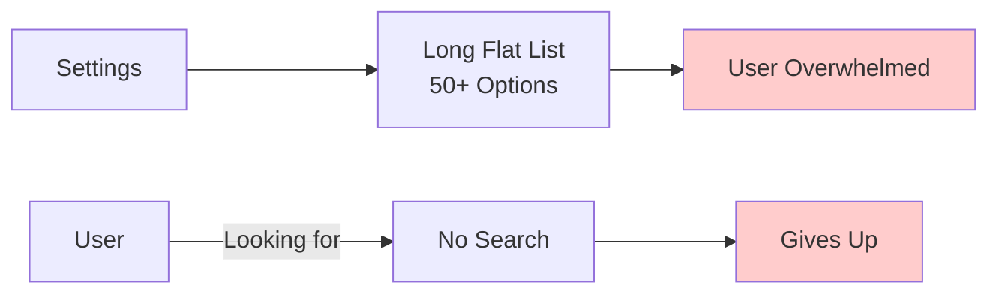
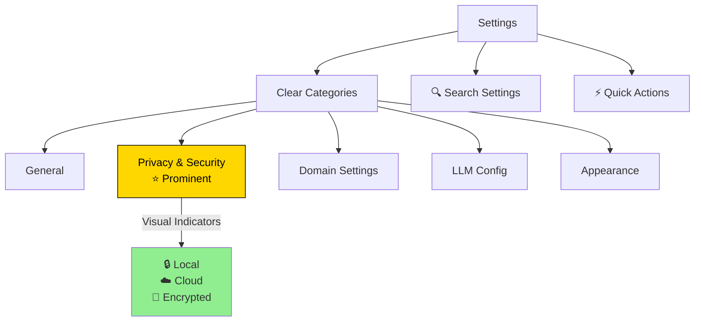

# Settings UI

**Version:** 1.0
**Date:** 2025-10-28
**Status:** Draft (Awaiting Human Review)
**Part of:** Fidus UX/UI Design
**Author:** AI-Generated

---

## Table of Contents

- [Overview](#overview)
- [Settings Philosophy](#settings-philosophy)
- [Settings Structure](#settings-structure)
- [General Settings](#general-settings)
- [Privacy & Security](#privacy--security)
- [Domain Settings](#domain-settings)
- [LLM Configuration](#llm-configuration)
- [Appearance](#appearance)
- [Notifications](#notifications)
- [Data & Storage](#data--storage)
- [Account & Profile](#account--profile)
- [Advanced Settings](#advanced-settings)
- [Accessibility](#accessibility)

---

## Overview

Fidus Settings provide comprehensive control over all aspects of the application. Settings are organized into logical categories with clear descriptions and immediate feedback.

### Key Principles

1. **Transparent**: Show what each setting does and why it exists
2. **Safe**: Warn before destructive actions, allow undo
3. **Discoverable**: Clear labels, search, and contextual help
4. **Privacy-First**: Privacy settings are prominent and clear
5. **Responsive**: Changes apply immediately with clear confirmation

---

## Settings Philosophy

### Traditional Settings (What We DON'T Do)



**Problems:**
- Flat list of dozens of options
- No clear organization
- No search functionality
- Unclear what settings do
- No guidance on privacy implications

### Fidus Settings (What We DO)



**Advantages:**
- Organized into logical categories
- Search functionality
- Privacy settings prominent
- Clear explanations for each setting
- Visual privacy indicators

---

## Settings Structure

### Settings Screen Layout

```
+--------------------------------------------------+
|  ← Settings                            🔍  ✕     |
+--------------------------------------------------+
|                                                   |
|  +-----------------+---------------------------+ |
|  |                 |                            | |
|  | General         |  🔍 Search settings...     | |
|  | Privacy         |                            | |
|  | Domains         |  Quick Actions:            | |
|  | LLM Config      |  • Resume Onboarding       | |
|  | Appearance      |  • Export Data             | |
|  | Notifications   |  • Clear Cache             | |
|  | Data & Storage  |                            | |
|  | Account         |  General                   | |
|  | Advanced        |  ---------------------     | |
|  |                 |                            | |
|  | -----------     |  Language:                 | |
|  |                 |  [English          ▼]     | |
|  | About           |                            | |
|  | Help & Support  |  Timezone:                 | |
|  |                 |  [Europe/Berlin    ▼]     | |
|  |                 |                            | |
|  +-----------------+---------------------------+ |
|                                                   |
+--------------------------------------------------+
```

### Mobile Layout (Responsive)

```
+----------------------------+
|  ← Settings          🔍  ✕ |
+----------------------------+
|                             |
|  🔍 Search settings...      |
|                             |
|  ⚙️  General                |
|  🔒 Privacy & Security      |
|  🎯 Domain Settings         |
|  🤖 LLM Configuration        |
|  🎨 Appearance              |
|  🔔 Notifications           |
|  💾 Data & Storage          |
|  👤 Account & Profile       |
|  🔧 Advanced                |
|                             |
|  ---------------------      |
|                             |
|  ℹ️  About Fidus            |
|  ❓ Help & Support          |
|                             |
+----------------------------+
```

---

## General Settings

```
+--------------------------------------------------+
|  General Settings                                |
+--------------------------------------------------+
|                                                   |
|  Language                                        |
|  [English                               ▼]      |
|  Choose your preferred language                  |
|                                                   |
|  Timezone                                        |
|  [Europe/Berlin (GMT+1)                 ▼]      |
|  Used for scheduling and time displays           |
|                                                   |
|  Date Format                                     |
|  ○ DD/MM/YYYY (28/10/2025)                       |
|  ◉ MM/DD/YYYY (10/28/2025)                       |
|  ○ YYYY-MM-DD (2025-10-28)                       |
|                                                   |
|  Time Format                                     |
|  ◉ 24-hour (14:30)                               |
|  ○ 12-hour (2:30 PM)                             |
|                                                   |
|  Currency                                        |
|  [EUR (€)                               ▼]      |
|  Default currency for finance tracking           |
|                                                   |
|  Week Starts On                                  |
|  [Monday                                ▼]      |
|  First day of the week in calendar               |
|                                                   |
+--------------------------------------------------+
```

---

## Privacy & Security

**⚠️ Most important settings - highlighted prominently**

```
+--------------------------------------------------+
|  🔒 Privacy & Security                           |
+--------------------------------------------------+
|                                                   |
|  +--------------------------------------------+  |
|  | ⭐ Privacy Status: Excellent              |  |
|  |                                            |  |
|  | 🔒 Local AI: Active                       |  |
|  | 🔒 All data stored locally                |  |
|  | 🔒 No tracking or analytics               |  |
|  |                                            |  |
|  | [View Privacy Report]                     |  |
|  +--------------------------------------------+  |
|                                                   |
|  Data Storage                                    |
|  -----------------                               |
|                                                   |
|  ◉ Local Only (Recommended)                      |
|    All data stays on your device                 |
|    🔒 Maximum privacy                            |
|                                                   |
|  ○ Local + Cloud Sync                            |
|    Encrypted sync across devices                 |
|    🔐 End-to-end encrypted                       |
|                                                   |
|  LLM Privacy                                     |
|  -----------------                               |
|                                                   |
|  Current Mode: Local AI                          |
|  🔒 Requests never leave your device             |
|                                                   |
|  [Change LLM Mode]                               |
|                                                   |
|  ---------------------------------------         |
|                                                   |
|  Search History                                  |
|  ☑️ Save search history (local only)            |
|     Used for quick access to recent searches     |
|                                                   |
|  [Clear Search History]                          |
|                                                   |
|  Conversation History                            |
|  ☑️ Save chat history (local only)              |
|     Used for context in future conversations     |
|                                                   |
|  Retention: [30 days                   ▼]       |
|                                                   |
|  [Clear Chat History]                            |
|                                                   |
|  ---------------------------------------         |
|                                                   |
|  Permissions                                     |
|  -----------------                               |
|                                                   |
|  Calendar Access         ✅ Granted              |
|  Notifications           ✅ Granted              |
|  Local Storage           ✅ Granted              |
|  Location (Travel)       ❌ Not granted          |
|                                                   |
|  [Manage Permissions]                            |
|                                                   |
|  ---------------------------------------         |
|                                                   |
|  Security                                        |
|  -----------------                               |
|                                                   |
|  ☑️ Require authentication on startup           |
|  ☑️ Auto-lock after 15 minutes of inactivity    |
|  ☐ Use biometric authentication (Face ID)       |
|                                                   |
|  [Change Password]                               |
|                                                   |
|  ---------------------------------------         |
|                                                   |
|  Data Export & Deletion                          |
|  -----------------                               |
|                                                   |
|  [Export All Data (ZIP)]                         |
|  Download all your data in JSON format           |
|                                                   |
|  [Delete All Data]                               |
|  ⚠️ Permanently delete all local data            |
|                                                   |
+--------------------------------------------------+
```

### Privacy Report Modal

```
+--------------------------------------------------+
|  🔒 Privacy Report                               |
+--------------------------------------------------+
|                                                   |
|  Your Privacy Status: ✅ Excellent               |
|                                                   |
|  Data Storage:                                   |
|  🔒 Local Only                                   |
|  • Calendar: 47 appointments (local)             |
|  • Finance: 234 transactions (local)             |
|  • Travel: 5 trips (local)                       |
|  • Total: 1.2 MB (local storage)                 |
|                                                   |
|  LLM Usage:                                      |
|  🔒 Local AI (Llama 3.1 8B)                      |
|  • 142 requests this month                       |
|  • 0 requests sent to cloud                      |
|  • 100% privacy maintained                       |
|                                                   |
|  Third-Party Services:                           |
|  ✅ None                                         |
|  • No tracking                                   |
|  • No analytics                                  |
|  • No advertising                                |
|                                                   |
|  Permissions:                                    |
|  ✅ Calendar (read-only)                         |
|  ✅ Notifications (local)                        |
|  ✅ Local Storage                                |
|  ❌ Location (not granted)                       |
|  ❌ Camera (not requested)                       |
|  ❌ Microphone (not requested)                   |
|                                                   |
|  Last Updated: Oct 28, 2025 at 2:45 PM          |
|                                                   |
|  [Close]                                         |
|                                                   |
+--------------------------------------------------+
```

---

## Domain Settings

```
+--------------------------------------------------+
|  🎯 Domain Settings                              |
+--------------------------------------------------+
|                                                   |
|  Active Domains                                  |
|  -----------------                               |
|                                                   |
|  ☑️ 📅 Calendar & Scheduling                     |
|     Manage appointments and detect conflicts     |
|     [Configure]                                  |
|                                                   |
|  ☑️ 💰 Finance & Budgets                         |
|     Track spending and budget alerts             |
|     [Configure]                                  |
|                                                   |
|  ☐ ✈️ Travel & Transportation                    |
|     Plan trips and optimize commutes             |
|     [Activate]                                   |
|                                                   |
|  ☐ 📧 Communication                              |
|     Email and message management                 |
|     [Activate]                                   |
|                                                   |
|  ☐ 🏋️ Health & Wellness                         |
|     Track workouts and medications               |
|     [Activate]                                   |
|                                                   |
|  ☐ 🏠 Home & Maintenance                         |
|     Chore tracking and bill reminders            |
|     [Activate]                                   |
|                                                   |
|  ☐ 🛒 Shopping & Groceries                       |
|     Shopping lists and price tracking            |
|     [Activate]                                   |
|                                                   |
|  ☐ 📚 Learning & Education                       |
|     Course tracking and study reminders          |
|     [Activate]                                   |
|                                                   |
+--------------------------------------------------+
```

### Domain Configuration Modal (Calendar Example)

```
+--------------------------------------------------+
|  📅 Calendar Domain Settings                     |
+--------------------------------------------------+
|                                                   |
|  Status: ✅ Active                               |
|                                                   |
|  Permissions:                                    |
|  ✅ Calendar Access (granted)                    |
|  ✅ Notifications (granted)                      |
|                                                   |
|  Features:                                       |
|  ☑️ Conflict detection                           |
|  ☑️ Proactive scheduling suggestions             |
|  ☑️ Meeting reminders                            |
|  ☐ Automatic travel time calculation             |
|                                                   |
|  Default Settings:                               |
|  Default duration:    [1 hour            ▼]     |
|  Reminder before:     [15 minutes        ▼]     |
|  Working hours:       [9:00 AM - 6:00 PM]       |
|                                                   |
|  Privacy:                                        |
|  🔒 All calendar data stored locally             |
|  • Read-only access to system calendar           |
|  • No data sent to cloud                         |
|                                                   |
|  [Save]  [Deactivate Domain]  [Cancel]           |
|                                                   |
+--------------------------------------------------+
```

---

## LLM Configuration

```
+--------------------------------------------------+
|  🤖 LLM Configuration                            |
+--------------------------------------------------+
|                                                   |
|  Current Mode                                    |
|  -----------------                               |
|                                                   |
|  ◉ Local AI (Llama 3.1 8B)                       |
|    🔒 Runs entirely on your device               |
|    • Maximum privacy                             |
|    • No internet required                        |
|    • Free forever                                |
|                                                   |
|    Model Status: ✅ Active                       |
|    Model Size: 4.7 GB                            |
|    Last Updated: Oct 1, 2025                     |
|                                                   |
|    [Update Model]  [Test Model]                  |
|                                                   |
|  ○ Cloud AI (OpenAI GPT-4)                       |
|    ☁️ Uses cloud servers (encrypted)             |
|    • Works on any device                         |
|    • Faster responses                            |
|    • €5/month after 100 free requests            |
|                                                   |
|    Status: ❌ Not configured                     |
|                                                   |
|    [Setup Cloud AI]                              |
|                                                   |
|  ---------------------------------------         |
|                                                   |
|  Performance Settings (Local AI)                 |
|  -----------------                               |
|                                                   |
|  Model Quality:                                  |
|  [●-------------] Balanced                       |
|  ← Faster                       Higher Quality → |
|                                                   |
|  Max Context Length:                             |
|  [4096 tokens                           ▼]      |
|  Longer context = more memory usage              |
|                                                   |
|  ☑️ Use GPU acceleration (if available)         |
|  ☐ Allow background processing                  |
|                                                   |
|  ---------------------------------------         |
|                                                   |
|  Usage Statistics (This Month)                   |
|  -----------------                               |
|                                                   |
|  Total Requests: 142                             |
|  Avg Response Time: 1.2s                         |
|  Cache Hit Rate: 34%                             |
|  Total Tokens: 45,329                            |
|                                                   |
|  [View Detailed Stats]                           |
|                                                   |
+--------------------------------------------------+
```

---

## Appearance

```
+--------------------------------------------------+
|  🎨 Appearance                                   |
+--------------------------------------------------+
|                                                   |
|  Theme                                           |
|  -----------------                               |
|                                                   |
|  ◉ Auto (matches system)                         |
|  ○ Light                                         |
|  ○ Dark                                          |
|  ○ High Contrast                                 |
|                                                   |
|  Preview:                                        |
|  +--------------------------------------------+  |
|  | Dashboard              🔍  ⚙️  👤          |  |
|  | ----------------------------------------   |  |
|  |                                            |  |
|  | +------------------+                       |  |
|  | | Budget Alert     |                       |  |
|  | | Food: €1,250     |                       |  |
|  | +------------------+                       |  |
|  +--------------------------------------------+  |
|                                                   |
|  ---------------------------------------         |
|                                                   |
|  Brand Colors                                    |
|  -----------------                               |
|                                                   |
|  Primary: [██] #FFD700 (Fidus Yellow)            |
|  Secondary: [██] #000000 (Black)                 |
|                                                   |
|  ☐ Use custom brand colors                      |
|                                                   |
|  ---------------------------------------         |
|                                                   |
|  Display                                         |
|  -----------------                               |
|                                                   |
|  Font Size:                                      |
|  [●-------------] Medium                         |
|  ← Small                                Large → |
|                                                   |
|  Density:                                        |
|  ○ Compact    ◉ Comfortable    ○ Spacious       |
|                                                   |
|  ☑️ Use animations                               |
|  ☐ Reduce motion (accessibility)                |
|                                                   |
|  ---------------------------------------         |
|                                                   |
|  Dashboard Layout                                |
|  -----------------                               |
|                                                   |
|  Default View:                                   |
|  ◉ Opportunity Surface (cards)                   |
|  ○ Domain Navigation                             |
|  ○ Calendar View                                 |
|                                                   |
|  Card Layout:                                    |
|  ◉ Grid    ○ List                               |
|                                                   |
+--------------------------------------------------+
```

---

## Notifications

```
+--------------------------------------------------+
|  🔔 Notifications                                |
+--------------------------------------------------+
|                                                   |
|  Notification Permissions: ✅ Granted            |
|                                                   |
|  ---------------------------------------         |
|                                                   |
|  Opportunity Notifications                       |
|  -----------------                               |
|                                                   |
|  ☑️ Enable opportunity notifications             |
|     Show desktop/mobile notifications            |
|                                                   |
|  Notification Types:                             |
|  ☑️ Urgent opportunities                         |
|  ☑️ Important opportunities                      |
|  ☐ Suggestions                                   |
|  ☐ Informational                                 |
|                                                   |
|  Quiet Hours:                                    |
|  ☑️ Enable quiet hours                           |
|  From: [10:00 PM]  To: [8:00 AM]                |
|  No notifications during these hours             |
|                                                   |
|  ---------------------------------------         |
|                                                   |
|  Domain-Specific Notifications                   |
|  -----------------                               |
|                                                   |
|  📅 Calendar:                                    |
|  ☑️ Appointment reminders                        |
|  ☑️ Conflict alerts                              |
|  ☐ Daily schedule summary                        |
|     Reminder before: [15 minutes        ▼]      |
|                                                   |
|  💰 Finance:                                     |
|  ☑️ Budget exceeded alerts                       |
|  ☑️ Large transaction alerts                     |
|  ☐ Weekly spending summary                       |
|     Alert threshold: [€100              ]       |
|                                                   |
|  ✈️ Travel:                                      |
|  ☑️ Departure reminders                          |
|  ☑️ Booking confirmations                        |
|  ☐ Travel deal alerts                            |
|                                                   |
|  ---------------------------------------         |
|                                                   |
|  Notification Style                              |
|  -----------------                               |
|                                                   |
|  ◉ OS Notifications (native)                     |
|    System notifications (recommended)            |
|                                                   |
|  ○ In-App Only                                   |
|    Only show within Fidus                        |
|                                                   |
|  Sound:                                          |
|  ☑️ Play notification sound                     |
|  [Default                               ▼]      |
|                                                   |
|  Badge:                                          |
|  ☑️ Show badge count on app icon                |
|                                                   |
+--------------------------------------------------+
```

---

## Data & Storage

```
+--------------------------------------------------+
|  💾 Data & Storage                               |
+--------------------------------------------------+
|                                                   |
|  Storage Usage                                   |
|  -----------------                               |
|                                                   |
|  Local Storage:                                  |
|  [████████░░░░░░░░░░░░] 1.2 MB / 100 MB         |
|                                                   |
|  Breakdown:                                      |
|  • Calendar: 347 KB (47 appointments)            |
|  • Finance: 523 KB (234 transactions)            |
|  • Travel: 89 KB (5 trips)                       |
|  • LLM Model: 4.7 GB (cached separately)         |
|  • Chat History: 156 KB (128 messages)           |
|  • Search History: 47 KB (89 searches)           |
|  • Settings: 12 KB                               |
|                                                   |
|  [View Detailed Breakdown]                       |
|                                                   |
|  ---------------------------------------         |
|                                                   |
|  Data Management                                 |
|  -----------------                               |
|                                                   |
|  [Export All Data]                               |
|  Download all data as JSON (ZIP)                 |
|                                                   |
|  [Import Data]                                   |
|  Restore from previous export                    |
|                                                   |
|  [Clear Cache]                                   |
|  Remove temporary files (frees 45 MB)            |
|                                                   |
|  ---------------------------------------         |
|                                                   |
|  Backup & Sync                                   |
|  -----------------                               |
|                                                   |
|  Local Backups:                                  |
|  ☑️ Auto-backup daily                            |
|     Keep last: [7 backups            ▼]         |
|     Location: Documents/Fidus/Backups            |
|                                                   |
|  Last Backup: Oct 28, 2025 at 3:00 AM           |
|                                                   |
|  [Create Backup Now]                             |
|  [Restore from Backup]                           |
|                                                   |
|  Cloud Sync: ❌ Disabled                         |
|  (Enable in Privacy & Security settings)         |
|                                                   |
|  ---------------------------------------         |
|                                                   |
|  Data Retention                                  |
|  -----------------                               |
|                                                   |
|  Chat History:                                   |
|  Keep for: [30 days                     ▼]      |
|  ☐ Keep forever                                  |
|                                                   |
|  Search History:                                 |
|  Keep for: [30 days                     ▼]      |
|  ☐ Keep forever                                  |
|                                                   |
|  Deleted Items:                                  |
|  Keep in trash for: [7 days            ▼]      |
|  Auto-delete after this period                   |
|                                                   |
+--------------------------------------------------+
```

---

## Account & Profile

```
+--------------------------------------------------+
|  👤 Account & Profile                            |
+--------------------------------------------------+
|                                                   |
|  Profile                                         |
|  -----------------                               |
|                                                   |
|  +------------+                                  |
|  |            |  Name:                           |
|  |     👤     |  [Sarah Miller          ]        |
|  |            |                                   |
|  +------------+  Email:                          |
|                  sarah@example.com               |
|                                                   |
|  [Upload Photo]  [Edit Profile]                  |
|                                                   |
|  ---------------------------------------         |
|                                                   |
|  Account Type                                    |
|  -----------------                               |
|                                                   |
|  Current Plan: Free (Local AI)                   |
|                                                   |
|  Features:                                       |
|  ✅ Unlimited local AI requests                  |
|  ✅ All domains unlocked                         |
|  ✅ Local data storage                           |
|  ❌ Cloud sync (upgrade to Pro)                  |
|  ❌ Multi-device sync (upgrade to Pro)           |
|                                                   |
|  [Upgrade to Pro - €5/month]                     |
|                                                   |
|  ---------------------------------------         |
|                                                   |
|  Multi-Tenancy                                   |
|  -----------------                               |
|                                                   |
|  Current Tenant: Personal                        |
|                                                   |
|  Available Tenants:                              |
|  ◉ 👤 Personal                                   |
|  ○ 💼 Work (ACME Corp)                          |
|  ○ 👨‍👩‍👧 Family                                  |
|                                                   |
|  [Switch Tenant]  [Manage Tenants]               |
|                                                   |
|  ---------------------------------------         |
|                                                   |
|  Account Actions                                 |
|  -----------------                               |
|                                                   |
|  [Change Password]                               |
|  [Change Email]                                  |
|  [Download Account Data]                         |
|  [Delete Account]                                |
|                                                   |
+--------------------------------------------------+
```

---

## Advanced Settings

```
+--------------------------------------------------+
|  🔧 Advanced Settings                            |
+--------------------------------------------------+
|                                                   |
|  ⚠️ For advanced users only                      |
|                                                   |
|  -------------------------------------------     |
|                                                   |
|  Developer Mode                                  |
|  -----------------                               |
|                                                   |
|  ☐ Enable developer mode                        |
|    Shows debug info and advanced features        |
|                                                   |
|  ☐ Show LLM prompts in chat                     |
|  ☐ Enable performance monitoring                |
|  ☐ Show API request logs                        |
|                                                   |
|  ---------------------------------------         |
|                                                   |
|  Experimental Features                           |
|  -----------------                               |
|                                                   |
|  ☐ Voice input (beta)                           |
|    Speak requests instead of typing              |
|                                                   |
|  ☐ Keyboard shortcuts (beta)                    |
|    Advanced keyboard navigation                  |
|                                                   |
|  ☐ Multi-window support (beta)                  |
|    Open multiple Fidus windows                   |
|                                                   |
|  ---------------------------------------         |
|                                                   |
|  API & Integrations                              |
|  -----------------                               |
|                                                   |
|  API Access: ❌ Disabled                         |
|                                                   |
|  [Enable API Access]                             |
|  Generate API key for third-party integrations   |
|                                                   |
|  Webhooks: ❌ Not configured                     |
|                                                   |
|  [Configure Webhooks]                            |
|  Receive events from Fidus                       |
|                                                   |
|  ---------------------------------------         |
|                                                   |
|  Database                                        |
|  -----------------                               |
|                                                   |
|  Database Size: 1.2 MB                           |
|  Database Location: ~/Library/Fidus/             |
|                                                   |
|  [Compact Database]                              |
|  Optimize and reduce database size               |
|                                                   |
|  [Reset Database]                                |
|  ⚠️ Deletes all data (cannot be undone)          |
|                                                   |
|  ---------------------------------------         |
|                                                   |
|  Diagnostics                                     |
|  -----------------                               |
|                                                   |
|  [Run System Check]                              |
|  Test all systems and features                   |
|                                                   |
|  [View Logs]                                     |
|  See application logs for debugging              |
|                                                   |
|  [Report Issue]                                  |
|  Submit bug report with diagnostic data          |
|                                                   |
+--------------------------------------------------+
```

---

## Accessibility

All settings screens follow accessibility best practices:

### Keyboard Navigation

| Shortcut | Action |
|----------|--------|
| `Tab` | Navigate between settings |
| `Space` / `Enter` | Toggle checkbox / Open dropdown |
| `Arrow Keys` | Navigate dropdowns / Radio buttons |
| `⌘S` / `Ctrl+S` | Save changes |
| `Escape` | Close modals / Cancel |

### Screen Reader Support

```
[Screen Reader]: "Settings. Button: General, Privacy, Domains, LLM Configuration.
Currently showing: General Settings.
Language. Combobox. Currently: English.
Timezone. Combobox. Currently: Europe/Berlin, GMT+1."
```

### Visual Accessibility

- ✅ High contrast mode available
- ✅ Focus indicators on all interactive elements
- ✅ Color-blind friendly (no color-only indicators)
- ✅ Text scalability (125%, 150%, 200%)
- ✅ Reduced motion option

---

## Conclusion

Fidus Settings provide:

1. **Comprehensive Control**: Every aspect customizable
2. **Clear Organization**: Logical categories with search
3. **Privacy-First**: Privacy settings prominent and clear
4. **Safe**: Warnings before destructive actions
5. **Accessible**: WCAG 2.1 AA compliant

### Design Principles Applied

✅ **Transparent**: Clear descriptions for every setting
✅ **Safe**: Confirmations for destructive actions
✅ **Discoverable**: Search, categories, contextual help
✅ **Privacy-First**: Privacy status and controls prominent
✅ **Responsive**: Immediate feedback on changes

### Next Steps

1. Implement settings screen with sidebar navigation
2. Add search functionality for settings
3. Create domain configuration modals
4. Implement privacy report
5. Add backup/restore functionality
6. Create account management flows
7. Test with screen readers

---

**Document Version:** 1.0
**Authors:** UX/UI Team
**Review Status:** Draft - Pending Review
**Related Documents:**
- [Onboarding UX](12-onboarding-ux.md)
- [Privacy & Trust](03-trust-transparency.md)
- [Design System Components](05-design-system-components.md)
- [Accessibility](11-accessibility.md)
