# Settings UI

**Version:** 1.0
**Date:** 2025-10-28
**Status:** Draft (Awaiting Human Review)
**Part of:** Fidus UX/UI Design
**Author:** AI-Generated

---

## Table of Contents

- [Overview](#overview)
- [Settings Philosophy](#settings-philosophy)
- [Settings Structure](#settings-structure)
- [General Settings](#general-settings)
- [Privacy & Security](#privacy--security)
- [Domain Settings](#domain-settings)
- [LLM Configuration](#llm-configuration)
- [Appearance](#appearance)
- [Notifications](#notifications)
- [Data & Storage](#data--storage)
- [Account & Profile](#account--profile)
- [Advanced Settings](#advanced-settings)
- [Accessibility](#accessibility)

---

## Overview

Fidus Settings provide comprehensive control over all aspects of the application. Settings are organized into logical categories with clear descriptions and immediate feedback.

### Key Principles

1. **Transparent**: Show what each setting does and why it exists
2. **Safe**: Warn before destructive actions, allow undo
3. **Discoverable**: Clear labels, search, and contextual help
4. **Privacy-First**: Privacy settings are prominent and clear
5. **Responsive**: Changes apply immediately with clear confirmation

---

## Settings Philosophy

### Traditional Settings (What We DON'T Do)


**Problems:**
- Flat list of dozens of options
- No clear organization
- No search functionality
- Unclear what settings do
- No guidance on privacy implications

### Fidus Settings (What We DO)

```mermaid
graph TB
    Settings[Settings] --> Categories[Clear Categories]

    Categories --> General[General]
    Categories --> Privacy[Privacy & Security<br/>⭐ Prominent]
    Categories --> Domains[Domain Settings]
    Categories --> LLM[LLM Config]
    Categories --> Appearance[Appearance]

    Settings --> Search[🔍 Search Settings]
    Settings --> QuickActions[⚡ Quick Actions]

    Privacy -->|Visual Indicators| PrivacyBadges[🔒 Local<br/>☁️ Cloud<br/>🔐 Encrypted]

    style Privacy fill:#FFD700,stroke:#000000,color:#000000
    style PrivacyBadges fill:#90ee90
```



**Advantages:**
- Organized into logical categories
- Search functionality
- Privacy settings prominent
- Clear explanations for each setting
- Visual privacy indicators

---

## Settings Structure

### Settings Screen Layout

```
┌──────────────────────────────────────────────────┐
│  ← Settings                            🔍  ✕     │
├──────────────────────────────────────────────────┤
│                                                   │
│  ┌─────────────────┬───────────────────────────┐ │
│  │                 │                            │ │
│  │ General         │  🔍 Search settings...     │ │
│  │ Privacy         │                            │ │
│  │ Domains         │  Quick Actions:            │ │
│  │ LLM Config      │  • Resume Onboarding       │ │
│  │ Appearance      │  • Export Data             │ │
│  │ Notifications   │  • Clear Cache             │ │
│  │ Data & Storage  │                            │ │
│  │ Account         │  General                   │ │
│  │ Advanced        │  ─────────────────────     │ │
│  │                 │                            │ │
│  │ ───────────     │  Language:                 │ │
│  │                 │  [English          ▼]     │ │
│  │ About           │                            │ │
│  │ Help & Support  │  Timezone:                 │ │
│  │                 │  [Europe/Berlin    ▼]     │ │
│  │                 │                            │ │
│  └─────────────────┴───────────────────────────┘ │
│                                                   │
└──────────────────────────────────────────────────┘
```

### Mobile Layout (Responsive)

```
┌────────────────────────────┐
│  ← Settings          🔍  ✕ │
├────────────────────────────┤
│                             │
│  🔍 Search settings...      │
│                             │
│  ⚙️  General                │
│  🔒 Privacy & Security      │
│  🎯 Domain Settings         │
│  🤖 LLM Configuration        │
│  🎨 Appearance              │
│  🔔 Notifications           │
│  💾 Data & Storage          │
│  👤 Account & Profile       │
│  🔧 Advanced                │
│                             │
│  ─────────────────────      │
│                             │
│  ℹ️  About Fidus            │
│  ❓ Help & Support          │
│                             │
└────────────────────────────┘
```

---

## General Settings

```
┌──────────────────────────────────────────────────┐
│  General Settings                                │
├──────────────────────────────────────────────────┤
│                                                   │
│  Language                                        │
│  [English                               ▼]      │
│  Choose your preferred language                  │
│                                                   │
│  Timezone                                        │
│  [Europe/Berlin (GMT+1)                 ▼]      │
│  Used for scheduling and time displays           │
│                                                   │
│  Date Format                                     │
│  ○ DD/MM/YYYY (28/10/2025)                       │
│  ◉ MM/DD/YYYY (10/28/2025)                       │
│  ○ YYYY-MM-DD (2025-10-28)                       │
│                                                   │
│  Time Format                                     │
│  ◉ 24-hour (14:30)                               │
│  ○ 12-hour (2:30 PM)                             │
│                                                   │
│  Currency                                        │
│  [EUR (€)                               ▼]      │
│  Default currency for finance tracking           │
│                                                   │
│  Week Starts On                                  │
│  [Monday                                ▼]      │
│  First day of the week in calendar               │
│                                                   │
└──────────────────────────────────────────────────┘
```

---

## Privacy & Security

**⚠️ Most important settings - highlighted prominently**

```
┌──────────────────────────────────────────────────┐
│  🔒 Privacy & Security                           │
├──────────────────────────────────────────────────┤
│                                                   │
│  ┌────────────────────────────────────────────┐  │
│  │ ⭐ Privacy Status: Excellent              │  │
│  │                                            │  │
│  │ 🔒 Local AI: Active                       │  │
│  │ 🔒 All data stored locally                │  │
│  │ 🔒 No tracking or analytics               │  │
│  │                                            │  │
│  │ [View Privacy Report]                     │  │
│  └────────────────────────────────────────────┘  │
│                                                   │
│  Data Storage                                    │
│  ─────────────────                               │
│                                                   │
│  ◉ Local Only (Recommended)                      │
│    All data stays on your device                 │
│    🔒 Maximum privacy                            │
│                                                   │
│  ○ Local + Cloud Sync                            │
│    Encrypted sync across devices                 │
│    🔐 End-to-end encrypted                       │
│                                                   │
│  LLM Privacy                                     │
│  ─────────────────                               │
│                                                   │
│  Current Mode: Local AI                          │
│  🔒 Requests never leave your device             │
│                                                   │
│  [Change LLM Mode]                               │
│                                                   │
│  ───────────────────────────────────────         │
│                                                   │
│  Search History                                  │
│  ☑️ Save search history (local only)            │
│     Used for quick access to recent searches     │
│                                                   │
│  [Clear Search History]                          │
│                                                   │
│  Conversation History                            │
│  ☑️ Save chat history (local only)              │
│     Used for context in future conversations     │
│                                                   │
│  Retention: [30 days                   ▼]       │
│                                                   │
│  [Clear Chat History]                            │
│                                                   │
│  ───────────────────────────────────────         │
│                                                   │
│  Permissions                                     │
│  ─────────────────                               │
│                                                   │
│  Calendar Access         ✅ Granted              │
│  Notifications           ✅ Granted              │
│  Local Storage           ✅ Granted              │
│  Location (Travel)       ❌ Not granted          │
│                                                   │
│  [Manage Permissions]                            │
│                                                   │
│  ───────────────────────────────────────         │
│                                                   │
│  Security                                        │
│  ─────────────────                               │
│                                                   │
│  ☑️ Require authentication on startup           │
│  ☑️ Auto-lock after 15 minutes of inactivity    │
│  ☐ Use biometric authentication (Face ID)       │
│                                                   │
│  [Change Password]                               │
│                                                   │
│  ───────────────────────────────────────         │
│                                                   │
│  Data Export & Deletion                          │
│  ─────────────────                               │
│                                                   │
│  [Export All Data (ZIP)]                         │
│  Download all your data in JSON format           │
│                                                   │
│  [Delete All Data]                               │
│  ⚠️ Permanently delete all local data            │
│                                                   │
└──────────────────────────────────────────────────┘
```

### Privacy Report Modal

```
┌──────────────────────────────────────────────────┐
│  🔒 Privacy Report                               │
├──────────────────────────────────────────────────┤
│                                                   │
│  Your Privacy Status: ✅ Excellent               │
│                                                   │
│  Data Storage:                                   │
│  🔒 Local Only                                   │
│  • Calendar: 47 appointments (local)             │
│  • Finance: 234 transactions (local)             │
│  • Travel: 5 trips (local)                       │
│  • Total: 1.2 MB (local storage)                 │
│                                                   │
│  LLM Usage:                                      │
│  🔒 Local AI (Llama 3.1 8B)                      │
│  • 142 requests this month                       │
│  • 0 requests sent to cloud                      │
│  • 100% privacy maintained                       │
│                                                   │
│  Third-Party Services:                           │
│  ✅ None                                         │
│  • No tracking                                   │
│  • No analytics                                  │
│  • No advertising                                │
│                                                   │
│  Permissions:                                    │
│  ✅ Calendar (read-only)                         │
│  ✅ Notifications (local)                        │
│  ✅ Local Storage                                │
│  ❌ Location (not granted)                       │
│  ❌ Camera (not requested)                       │
│  ❌ Microphone (not requested)                   │
│                                                   │
│  Last Updated: Oct 28, 2025 at 2:45 PM          │
│                                                   │
│  [Close]                                         │
│                                                   │
└──────────────────────────────────────────────────┘
```

---

## Domain Settings

```
┌──────────────────────────────────────────────────┐
│  🎯 Domain Settings                              │
├──────────────────────────────────────────────────┤
│                                                   │
│  Active Domains                                  │
│  ─────────────────                               │
│                                                   │
│  ☑️ 📅 Calendar & Scheduling                     │
│     Manage appointments and detect conflicts     │
│     [Configure]                                  │
│                                                   │
│  ☑️ 💰 Finance & Budgets                         │
│     Track spending and budget alerts             │
│     [Configure]                                  │
│                                                   │
│  ☐ ✈️ Travel & Transportation                    │
│     Plan trips and optimize commutes             │
│     [Activate]                                   │
│                                                   │
│  ☐ 📧 Communication                              │
│     Email and message management                 │
│     [Activate]                                   │
│                                                   │
│  ☐ 🏋️ Health & Wellness                         │
│     Track workouts and medications               │
│     [Activate]                                   │
│                                                   │
│  ☐ 🏠 Home & Maintenance                         │
│     Chore tracking and bill reminders            │
│     [Activate]                                   │
│                                                   │
│  ☐ 🛒 Shopping & Groceries                       │
│     Shopping lists and price tracking            │
│     [Activate]                                   │
│                                                   │
│  ☐ 📚 Learning & Education                       │
│     Course tracking and study reminders          │
│     [Activate]                                   │
│                                                   │
└──────────────────────────────────────────────────┘
```

### Domain Configuration Modal (Calendar Example)

```
┌──────────────────────────────────────────────────┐
│  📅 Calendar Domain Settings                     │
├──────────────────────────────────────────────────┤
│                                                   │
│  Status: ✅ Active                               │
│                                                   │
│  Permissions:                                    │
│  ✅ Calendar Access (granted)                    │
│  ✅ Notifications (granted)                      │
│                                                   │
│  Features:                                       │
│  ☑️ Conflict detection                           │
│  ☑️ Proactive scheduling suggestions             │
│  ☑️ Meeting reminders                            │
│  ☐ Automatic travel time calculation             │
│                                                   │
│  Default Settings:                               │
│  Default duration:    [1 hour            ▼]     │
│  Reminder before:     [15 minutes        ▼]     │
│  Working hours:       [9:00 AM - 6:00 PM]       │
│                                                   │
│  Privacy:                                        │
│  🔒 All calendar data stored locally             │
│  • Read-only access to system calendar           │
│  • No data sent to cloud                         │
│                                                   │
│  [Save]  [Deactivate Domain]  [Cancel]           │
│                                                   │
└──────────────────────────────────────────────────┘
```

---

## LLM Configuration

```
┌──────────────────────────────────────────────────┐
│  🤖 LLM Configuration                            │
├──────────────────────────────────────────────────┤
│                                                   │
│  Current Mode                                    │
│  ─────────────────                               │
│                                                   │
│  ◉ Local AI (Llama 3.1 8B)                       │
│    🔒 Runs entirely on your device               │
│    • Maximum privacy                             │
│    • No internet required                        │
│    • Free forever                                │
│                                                   │
│    Model Status: ✅ Active                       │
│    Model Size: 4.7 GB                            │
│    Last Updated: Oct 1, 2025                     │
│                                                   │
│    [Update Model]  [Test Model]                  │
│                                                   │
│  ○ Cloud AI (OpenAI GPT-4)                       │
│    ☁️ Uses cloud servers (encrypted)             │
│    • Works on any device                         │
│    • Faster responses                            │
│    • €5/month after 100 free requests            │
│                                                   │
│    Status: ❌ Not configured                     │
│                                                   │
│    [Setup Cloud AI]                              │
│                                                   │
│  ───────────────────────────────────────         │
│                                                   │
│  Performance Settings (Local AI)                 │
│  ─────────────────                               │
│                                                   │
│  Model Quality:                                  │
│  [●─────────────] Balanced                       │
│  ← Faster                       Higher Quality → │
│                                                   │
│  Max Context Length:                             │
│  [4096 tokens                           ▼]      │
│  Longer context = more memory usage              │
│                                                   │
│  ☑️ Use GPU acceleration (if available)         │
│  ☐ Allow background processing                  │
│                                                   │
│  ───────────────────────────────────────         │
│                                                   │
│  Usage Statistics (This Month)                   │
│  ─────────────────                               │
│                                                   │
│  Total Requests: 142                             │
│  Avg Response Time: 1.2s                         │
│  Cache Hit Rate: 34%                             │
│  Total Tokens: 45,329                            │
│                                                   │
│  [View Detailed Stats]                           │
│                                                   │
└──────────────────────────────────────────────────┘
```

---

## Appearance

```
┌──────────────────────────────────────────────────┐
│  🎨 Appearance                                   │
├──────────────────────────────────────────────────┤
│                                                   │
│  Theme                                           │
│  ─────────────────                               │
│                                                   │
│  ◉ Auto (matches system)                         │
│  ○ Light                                         │
│  ○ Dark                                          │
│  ○ High Contrast                                 │
│                                                   │
│  Preview:                                        │
│  ┌────────────────────────────────────────────┐  │
│  │ Dashboard              🔍  ⚙️  👤          │  │
│  │ ────────────────────────────────────────   │  │
│  │                                            │  │
│  │ ┌──────────────────┐                       │  │
│  │ │ Budget Alert     │                       │  │
│  │ │ Food: €1,250     │                       │  │
│  │ └──────────────────┘                       │  │
│  └────────────────────────────────────────────┘  │
│                                                   │
│  ───────────────────────────────────────         │
│                                                   │
│  Brand Colors                                    │
│  ─────────────────                               │
│                                                   │
│  Primary: [██] #FFD700 (Fidus Yellow)            │
│  Secondary: [██] #000000 (Black)                 │
│                                                   │
│  ☐ Use custom brand colors                      │
│                                                   │
│  ───────────────────────────────────────         │
│                                                   │
│  Display                                         │
│  ─────────────────                               │
│                                                   │
│  Font Size:                                      │
│  [●─────────────] Medium                         │
│  ← Small                                Large → │
│                                                   │
│  Density:                                        │
│  ○ Compact    ◉ Comfortable    ○ Spacious       │
│                                                   │
│  ☑️ Use animations                               │
│  ☐ Reduce motion (accessibility)                │
│                                                   │
│  ───────────────────────────────────────         │
│                                                   │
│  Dashboard Layout                                │
│  ─────────────────                               │
│                                                   │
│  Default View:                                   │
│  ◉ Opportunity Surface (cards)                   │
│  ○ Domain Navigation                             │
│  ○ Calendar View                                 │
│                                                   │
│  Card Layout:                                    │
│  ◉ Grid    ○ List                               │
│                                                   │
└──────────────────────────────────────────────────┘
```

---

## Notifications

```
┌──────────────────────────────────────────────────┐
│  🔔 Notifications                                │
├──────────────────────────────────────────────────┤
│                                                   │
│  Notification Permissions: ✅ Granted            │
│                                                   │
│  ───────────────────────────────────────         │
│                                                   │
│  Opportunity Notifications                       │
│  ─────────────────                               │
│                                                   │
│  ☑️ Enable opportunity notifications             │
│     Show desktop/mobile notifications            │
│                                                   │
│  Notification Types:                             │
│  ☑️ Urgent opportunities                         │
│  ☑️ Important opportunities                      │
│  ☐ Suggestions                                   │
│  ☐ Informational                                 │
│                                                   │
│  Quiet Hours:                                    │
│  ☑️ Enable quiet hours                           │
│  From: [10:00 PM]  To: [8:00 AM]                │
│  No notifications during these hours             │
│                                                   │
│  ───────────────────────────────────────         │
│                                                   │
│  Domain-Specific Notifications                   │
│  ─────────────────                               │
│                                                   │
│  📅 Calendar:                                    │
│  ☑️ Appointment reminders                        │
│  ☑️ Conflict alerts                              │
│  ☐ Daily schedule summary                        │
│     Reminder before: [15 minutes        ▼]      │
│                                                   │
│  💰 Finance:                                     │
│  ☑️ Budget exceeded alerts                       │
│  ☑️ Large transaction alerts                     │
│  ☐ Weekly spending summary                       │
│     Alert threshold: [€100              ]       │
│                                                   │
│  ✈️ Travel:                                      │
│  ☑️ Departure reminders                          │
│  ☑️ Booking confirmations                        │
│  ☐ Travel deal alerts                            │
│                                                   │
│  ───────────────────────────────────────         │
│                                                   │
│  Notification Style                              │
│  ─────────────────                               │
│                                                   │
│  ◉ OS Notifications (native)                     │
│    System notifications (recommended)            │
│                                                   │
│  ○ In-App Only                                   │
│    Only show within Fidus                        │
│                                                   │
│  Sound:                                          │
│  ☑️ Play notification sound                     │
│  [Default                               ▼]      │
│                                                   │
│  Badge:                                          │
│  ☑️ Show badge count on app icon                │
│                                                   │
└──────────────────────────────────────────────────┘
```

---

## Data & Storage

```
┌──────────────────────────────────────────────────┐
│  💾 Data & Storage                               │
├──────────────────────────────────────────────────┤
│                                                   │
│  Storage Usage                                   │
│  ─────────────────                               │
│                                                   │
│  Local Storage:                                  │
│  [████████░░░░░░░░░░░░] 1.2 MB / 100 MB         │
│                                                   │
│  Breakdown:                                      │
│  • Calendar: 347 KB (47 appointments)            │
│  • Finance: 523 KB (234 transactions)            │
│  • Travel: 89 KB (5 trips)                       │
│  • LLM Model: 4.7 GB (cached separately)         │
│  • Chat History: 156 KB (128 messages)           │
│  • Search History: 47 KB (89 searches)           │
│  • Settings: 12 KB                               │
│                                                   │
│  [View Detailed Breakdown]                       │
│                                                   │
│  ───────────────────────────────────────         │
│                                                   │
│  Data Management                                 │
│  ─────────────────                               │
│                                                   │
│  [Export All Data]                               │
│  Download all data as JSON (ZIP)                 │
│                                                   │
│  [Import Data]                                   │
│  Restore from previous export                    │
│                                                   │
│  [Clear Cache]                                   │
│  Remove temporary files (frees 45 MB)            │
│                                                   │
│  ───────────────────────────────────────         │
│                                                   │
│  Backup & Sync                                   │
│  ─────────────────                               │
│                                                   │
│  Local Backups:                                  │
│  ☑️ Auto-backup daily                            │
│     Keep last: [7 backups            ▼]         │
│     Location: Documents/Fidus/Backups            │
│                                                   │
│  Last Backup: Oct 28, 2025 at 3:00 AM           │
│                                                   │
│  [Create Backup Now]                             │
│  [Restore from Backup]                           │
│                                                   │
│  Cloud Sync: ❌ Disabled                         │
│  (Enable in Privacy & Security settings)         │
│                                                   │
│  ───────────────────────────────────────         │
│                                                   │
│  Data Retention                                  │
│  ─────────────────                               │
│                                                   │
│  Chat History:                                   │
│  Keep for: [30 days                     ▼]      │
│  ☐ Keep forever                                  │
│                                                   │
│  Search History:                                 │
│  Keep for: [30 days                     ▼]      │
│  ☐ Keep forever                                  │
│                                                   │
│  Deleted Items:                                  │
│  Keep in trash for: [7 days            ▼]      │
│  Auto-delete after this period                   │
│                                                   │
└──────────────────────────────────────────────────┘
```

---

## Account & Profile

```
┌──────────────────────────────────────────────────┐
│  👤 Account & Profile                            │
├──────────────────────────────────────────────────┤
│                                                   │
│  Profile                                         │
│  ─────────────────                               │
│                                                   │
│  ┌────────────┐                                  │
│  │            │  Name:                           │
│  │     👤     │  [Sarah Miller          ]        │
│  │            │                                   │
│  └────────────┘  Email:                          │
│                  sarah@example.com               │
│                                                   │
│  [Upload Photo]  [Edit Profile]                  │
│                                                   │
│  ───────────────────────────────────────         │
│                                                   │
│  Account Type                                    │
│  ─────────────────                               │
│                                                   │
│  Current Plan: Free (Local AI)                   │
│                                                   │
│  Features:                                       │
│  ✅ Unlimited local AI requests                  │
│  ✅ All domains unlocked                         │
│  ✅ Local data storage                           │
│  ❌ Cloud sync (upgrade to Pro)                  │
│  ❌ Multi-device sync (upgrade to Pro)           │
│                                                   │
│  [Upgrade to Pro - €5/month]                     │
│                                                   │
│  ───────────────────────────────────────         │
│                                                   │
│  Multi-Tenancy                                   │
│  ─────────────────                               │
│                                                   │
│  Current Tenant: Personal                        │
│                                                   │
│  Available Tenants:                              │
│  ◉ 👤 Personal                                   │
│  ○ 💼 Work (ACME Corp)                          │
│  ○ 👨‍👩‍👧 Family                                  │
│                                                   │
│  [Switch Tenant]  [Manage Tenants]               │
│                                                   │
│  ───────────────────────────────────────         │
│                                                   │
│  Account Actions                                 │
│  ─────────────────                               │
│                                                   │
│  [Change Password]                               │
│  [Change Email]                                  │
│  [Download Account Data]                         │
│  [Delete Account]                                │
│                                                   │
└──────────────────────────────────────────────────┘
```

---

## Advanced Settings

```
┌──────────────────────────────────────────────────┐
│  🔧 Advanced Settings                            │
├──────────────────────────────────────────────────┤
│                                                   │
│  ⚠️ For advanced users only                      │
│                                                   │
│  ───────────────────────────────────────────     │
│                                                   │
│  Developer Mode                                  │
│  ─────────────────                               │
│                                                   │
│  ☐ Enable developer mode                        │
│    Shows debug info and advanced features        │
│                                                   │
│  ☐ Show LLM prompts in chat                     │
│  ☐ Enable performance monitoring                │
│  ☐ Show API request logs                        │
│                                                   │
│  ───────────────────────────────────────         │
│                                                   │
│  Experimental Features                           │
│  ─────────────────                               │
│                                                   │
│  ☐ Voice input (beta)                           │
│    Speak requests instead of typing              │
│                                                   │
│  ☐ Keyboard shortcuts (beta)                    │
│    Advanced keyboard navigation                  │
│                                                   │
│  ☐ Multi-window support (beta)                  │
│    Open multiple Fidus windows                   │
│                                                   │
│  ───────────────────────────────────────         │
│                                                   │
│  API & Integrations                              │
│  ─────────────────                               │
│                                                   │
│  API Access: ❌ Disabled                         │
│                                                   │
│  [Enable API Access]                             │
│  Generate API key for third-party integrations   │
│                                                   │
│  Webhooks: ❌ Not configured                     │
│                                                   │
│  [Configure Webhooks]                            │
│  Receive events from Fidus                       │
│                                                   │
│  ───────────────────────────────────────         │
│                                                   │
│  Database                                        │
│  ─────────────────                               │
│                                                   │
│  Database Size: 1.2 MB                           │
│  Database Location: ~/Library/Fidus/             │
│                                                   │
│  [Compact Database]                              │
│  Optimize and reduce database size               │
│                                                   │
│  [Reset Database]                                │
│  ⚠️ Deletes all data (cannot be undone)          │
│                                                   │
│  ───────────────────────────────────────         │
│                                                   │
│  Diagnostics                                     │
│  ─────────────────                               │
│                                                   │
│  [Run System Check]                              │
│  Test all systems and features                   │
│                                                   │
│  [View Logs]                                     │
│  See application logs for debugging              │
│                                                   │
│  [Report Issue]                                  │
│  Submit bug report with diagnostic data          │
│                                                   │
└──────────────────────────────────────────────────┘
```

---

## Accessibility

All settings screens follow accessibility best practices:

### Keyboard Navigation

| Shortcut | Action |
|----------|--------|
| `Tab` | Navigate between settings |
| `Space` / `Enter` | Toggle checkbox / Open dropdown |
| `Arrow Keys` | Navigate dropdowns / Radio buttons |
| `⌘S` / `Ctrl+S` | Save changes |
| `Escape` | Close modals / Cancel |

### Screen Reader Support

```
[Screen Reader]: "Settings. Button: General, Privacy, Domains, LLM Configuration.
Currently showing: General Settings.
Language. Combobox. Currently: English.
Timezone. Combobox. Currently: Europe/Berlin, GMT+1."
```

### Visual Accessibility

- ✅ High contrast mode available
- ✅ Focus indicators on all interactive elements
- ✅ Color-blind friendly (no color-only indicators)
- ✅ Text scalability (125%, 150%, 200%)
- ✅ Reduced motion option

---

## Conclusion

Fidus Settings provide:

1. **Comprehensive Control**: Every aspect customizable
2. **Clear Organization**: Logical categories with search
3. **Privacy-First**: Privacy settings prominent and clear
4. **Safe**: Warnings before destructive actions
5. **Accessible**: WCAG 2.1 AA compliant

### Design Principles Applied

✅ **Transparent**: Clear descriptions for every setting
✅ **Safe**: Confirmations for destructive actions
✅ **Discoverable**: Search, categories, contextual help
✅ **Privacy-First**: Privacy status and controls prominent
✅ **Responsive**: Immediate feedback on changes

### Next Steps

1. Implement settings screen with sidebar navigation
2. Add search functionality for settings
3. Create domain configuration modals
4. Implement privacy report
5. Add backup/restore functionality
6. Create account management flows
7. Test with screen readers

---

**Document Version:** 1.0
**Authors:** UX/UI Team
**Review Status:** Draft - Pending Review
**Related Documents:**
- [Onboarding UX](12-onboarding-ux.md)
- [Privacy & Trust](03-trust-transparency.md)
- [Design System Components](05-design-system-components.md)
- [Accessibility](11-accessibility.md)
