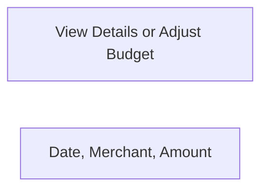
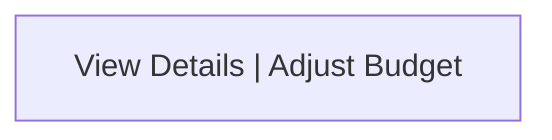
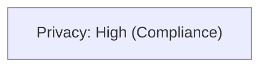
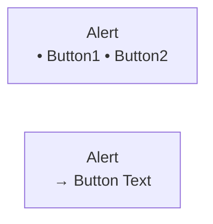

# Fidus Development Scripts

This directory contains utility scripts for the Fidus project.

## check-mermaid.js

Comprehensive Mermaid diagram validation tool that checks for:
- **PIPE character errors** (`|` in node labels causes parse errors)
- **Nested bracket errors** (e.g., `[Text [Button]]`)
- **Syntax errors** (unmatched brackets, parentheses, braces)
- **Color contrast issues** (WCAG AA compliance)
- **Performance issues** (too many nodes, too-long lines)

### Usage

```bash
# Check all documentation
node scripts/check-mermaid.js docs/**/*.md

# Check specific directory
node scripts/check-mermaid.js docs/ux-ui-design/*.md

# Syntax errors only
node scripts/check-mermaid.js --syntax-only docs/**/*.md

# Contrast checks only
node scripts/check-mermaid.js --contrast-only docs/**/*.md
```

### Common Errors and Fixes

#### 1. PIPE Character in Node Labels

**❌ Error:**
```mermaid
graph LR
    Actions[View Details | Adjust Budget]
```

**✅ Fix:**


**Alternative: Use Quotes**


**Note:** PIPE characters are allowed in arrow labels: `A -->|Label| B`

#### 2. Parentheses in Unquoted Labels

**❌ Error:**
```mermaid
graph LR
    Privacy[Privacy: High (Compliance)]
```

**✅ Fix - Use Quotes:**


**Note:** Cylinder shapes `[(DatabaseName)]` are special Mermaid syntax and don't need quotes.

#### 3. Nested Brackets

**❌ Error:**
```mermaid
graph LR
    Card[Alert<br/>[Button1] [Button2]]
```

**✅ Fix:**


#### 3. Low Color Contrast

**❌ Error:**
```mermaid
graph LR
    A[Node]
    style A fill:#000000  %% Black background, black text = 1:1 contrast
```

**✅ Fix:**
```mermaid
graph LR
    A[Node]
    style A fill:#000000,color:#ffffff  %% White text on black = 21:1 contrast
```

### Automated Checks

This check runs automatically in two places:

#### 1. Git Pre-Push Hook (Local)

Runs before every `git push` via Husky (`.husky/pre-push`).

If errors are found:
1. Fix the issues in the Mermaid diagrams
2. Run `node scripts/check-mermaid.js docs/**/*.md` to verify
3. Commit your fixes
4. Push again

You can bypass the check (not recommended) with:
```bash
git push --no-verify
```

#### 2. GitHub Actions CI (Remote)

Runs on every push and pull request via `.github/workflows/ci.yml`.

**Job:** `mermaid-check`
- Runs independently (no dependencies needed)
- Fails the PR if errors are found
- Prevents merging until diagrams are fixed
- Shows detailed error messages in PR checks

**Benefits:**
- ✅ Catches errors even if developers bypass pre-push hook
- ✅ Validates diagrams in PR review process
- ✅ Prevents broken diagrams from reaching main branch
- ✅ Works for all contributors (no local setup needed)

### Exit Codes

- `0` - All checks passed (or only warnings)
- `1` - Critical errors found (must be fixed before pushing)

### Output Format

The script provides a detailed report:
- ✅ Files with no issues
- ❌ Files with errors (shows line numbers and suggestions)
- ⚠️ Files with warnings (non-critical issues)

Example output:
```
╔════════════════════════════════════════════════════════════╗
║       Comprehensive Mermaid Diagram Check Report          ║
╚════════════════════════════════════════════════════════════╝

✅ 00-ai-driven-ui-paradigm.md - 18 diagrams, all clean
❌ 02-user-personas-journeys.md
   13 diagrams, 2 errors, 0 warnings

   📊 Diagram #5 (line 219) - graph TB
      🔴 ERROR (line 220): PIPE character found in node label
         Code: Card[View | Adjust]
         Fix:  Replace '|' with 'or' or ',' depending on context

────────────────────────────────────────────────────────────
SUMMARY:
  📁 Files checked: 13
  📊 Total diagrams: 128
  🔴 Total errors: 2
  ⚠️  Total warnings: 0
────────────────────────────────────────────────────────────

❌ Found 2 critical errors in 1 files
   Please fix these before committing!
```

## Development

The check-mermaid.js script is self-contained and has no external dependencies beyond Node.js built-ins.

To modify or extend:
1. Edit `scripts/check-mermaid.js`
2. Test with `node scripts/check-mermaid.js scripts/test-file.md`
3. Update this README if adding new features
