# Fidus Development Scripts

This directory contains utility scripts for the Fidus project.

## check-mermaid.js

Comprehensive Mermaid diagram validation tool that checks for:
- **PIPE character errors** (`|` in node labels causes parse errors)
- **Nested bracket errors** (e.g., `[Text [Button]]`)
- **Syntax errors** (unmatched brackets, parentheses, braces)
- **Color contrast issues** (WCAG AA compliance)
- **Performance issues** (too many nodes, too-long lines)

### Usage

```bash
# Check all documentation
node scripts/check-mermaid.js docs/**/*.md

# Check specific directory
node scripts/check-mermaid.js docs/ux-ui-design/*.md

# Syntax errors only
node scripts/check-mermaid.js --syntax-only docs/**/*.md

# Contrast checks only
node scripts/check-mermaid.js --contrast-only docs/**/*.md
```

### Common Errors and Fixes

#### 1. PIPE Character in Node Labels

**❌ Error:**
```mermaid
graph LR
    Actions[View Details | Adjust Budget]
```

**✅ Fix:**


**Alternative: Use Quotes**


**Note:** PIPE characters are allowed in arrow labels: `A -->|Label| B`

#### 2. Parentheses in Unquoted Labels

**❌ Error:**
```mermaid
graph LR
    Privacy[Privacy: High (Compliance)]
```

**✅ Fix - Use Quotes:**


**Note:** Cylinder shapes `[(DatabaseName)]` are special Mermaid syntax and don't need quotes.

#### 3. Nested Brackets

**❌ Error:**
```mermaid
graph LR
    Card[Alert<br/>[Button1] [Button2]]
```

**✅ Fix:**


```mermaid
graph LR
    Card[Alert<br/>• Button1 • Button2]
    %% Or use arrows:
    Card2[Alert<br/>→ Button Text]
```

#### 3. Low Color Contrast

**❌ Error:**
```mermaid
graph LR
    A[Node]
    style A fill:#000000  %% Black background, black text = 1:1 contrast
```

**✅ Fix:**
```mermaid
graph LR
    A[Node]
    style A fill:#000000,color:#ffffff  %% White text on black = 21:1 contrast
```

### Automated Checks

This check runs automatically in two places:

#### 1. Git Pre-Push Hook (Local)

Runs before every `git push` via Husky (`.husky/pre-push`).

If errors are found:
1. Fix the issues in the Mermaid diagrams
2. Run `node scripts/check-mermaid.js docs/**/*.md` to verify
3. Commit your fixes
4. Push again

You can bypass the check (not recommended) with:
```bash
git push --no-verify
```

#### 2. GitHub Actions CI (Remote)

Runs on every push and pull request via `.github/workflows/ci.yml`.

**Job:** `mermaid-check`
- Runs independently (no dependencies needed)
- Fails the PR if errors are found
- Prevents merging until diagrams are fixed
- Shows detailed error messages in PR checks

**Benefits:**
- ✅ Catches errors even if developers bypass pre-push hook
- ✅ Validates diagrams in PR review process
- ✅ Prevents broken diagrams from reaching main branch
- ✅ Works for all contributors (no local setup needed)

### Exit Codes

- `0` - All checks passed (or only warnings)
- `1` - Critical errors found (must be fixed before pushing)

### Output Format

The script provides a detailed report:
- ✅ Files with no issues
- ❌ Files with errors (shows line numbers and suggestions)
- ⚠️ Files with warnings (non-critical issues)

Example output:
```
╔════════════════════════════════════════════════════════════╗
║       Comprehensive Mermaid Diagram Check Report          ║
╚════════════════════════════════════════════════════════════╝

✅ 00-ai-driven-ui-paradigm.md - 18 diagrams, all clean
❌ 02-user-personas-journeys.md
   13 diagrams, 2 errors, 0 warnings

   📊 Diagram #5 (line 219) - graph TB
      🔴 ERROR (line 220): PIPE character found in node label
         Code: Card[View | Adjust]
         Fix:  Replace '|' with 'or' or ',' depending on context

────────────────────────────────────────────────────────────
SUMMARY:
  📁 Files checked: 13
  📊 Total diagrams: 128
  🔴 Total errors: 2
  ⚠️  Total warnings: 0
────────────────────────────────────────────────────────────

❌ Found 2 critical errors in 1 files
   Please fix these before committing!
```

## sync-user-id.js

Synchronizes user_id between Web UI and Claude Desktop configuration.

### Purpose

When testing Fidus Memory integration with Claude Desktop, you want the same user_id across both interfaces so memory learning is shared. This script automates updating your Claude Desktop config with the user_id from your Web UI session.

### Usage

**Interactive mode (recommended):**
```bash
node scripts/sync-user-id.js
```

**Direct mode:**
```bash
node scripts/sync-user-id.js <your-user-id>
```

### Step-by-Step Example

1. **Start Fidus Memory services:**
   ```bash
   docker-compose up -d
   ```

2. **Open Web UI and get your user_id:**
   - Open http://localhost:3001
   - Open DevTools Console (F12 or Cmd+Option+I)
   - Run: `localStorage.getItem('fidus_user_id')`
   - Copy the UUID (e.g., `d3f72106-1fe0-48a8-9d75-ac5f1bb3ddab`)

3. **Run the sync script:**
   ```bash
   node scripts/sync-user-id.js
   ```

   When prompted, paste the user_id you copied.

4. **Restart Claude Desktop**

### What It Does

The script:
1. ✅ Validates the user_id format (must be UUID)
2. ✅ Locates your Claude Desktop config file (OS-specific)
3. ✅ Updates or creates the `fidus-memory` MCP server configuration
4. ✅ Sets the `X_USER_ID` environment variable
5. ✅ Adds global instructions for automatic memory usage
6. ✅ Updates the project template config for reference

### Config Locations

- **macOS:** `~/Library/Application Support/Claude/claude_desktop_config.json`
- **Windows:** `%APPDATA%/Claude/config.json`
- **Linux:** `~/.config/Claude/claude_desktop_config.json`

### Example Output

```bash
$ node scripts/sync-user-id.js

📋 To get your user_id from the Web UI:
   1. Open http://localhost:3001 in your browser
   2. Open DevTools Console (F12 or Cmd+Option+I)
   3. Run: localStorage.getItem("fidus_user_id")
   4. Copy the user_id (without quotes)

Paste your user_id here: d3f72106-1fe0-48a8-9d75-ac5f1bb3ddab

🔧 Updating Claude Desktop configuration...
   Platform: darwin
   Config path: /Users/you/Library/Application Support/Claude/claude_desktop_config.json

✅ Successfully updated Claude Desktop config at:
   /Users/you/Library/Application Support/Claude/claude_desktop_config.json

📝 X-USER-ID set to: d3f72106-1fe0-48a8-9d75-ac5f1bb3ddab

🔄 Please restart Claude Desktop for changes to take effect.

✅ Also updated project config: claude-desktop-config.json
```

### Troubleshooting

**Error: "Invalid user_id format"**

Make sure you copied the UUID correctly without quotes or extra whitespace:
```bash
# ❌ Wrong (has quotes)
"d3f72106-1fe0-48a8-9d75-ac5f1bb3ddab"

# ✅ Right
d3f72106-1fe0-48a8-9d75-ac5f1bb3ddab
```

**Error: "Permission denied" or "ENOENT"**

The script needs to create/modify your Claude Desktop config. Make sure:
1. Claude Desktop is installed
2. The config directory exists (run Claude Desktop once to create it)
3. You have write permissions

### See Also

- [Claude Desktop Setup Guide](../docs/prototypes/fidus-memory/claude-desktop-setup.md) - Complete setup instructions
- [MCP Server Implementation](../packages/api/fidus/memory/mcp_server.py) - Server code
- [Architecture Overview](../docs/prototypes/fidus-memory/architecture-overview.md) - System design

## sync-design-system-version.js

Synchronizes the `@fidus/design-system` version to match the `@fidus/ui` version.

### Purpose

The design system showcases @fidus/ui components, so its version should always match the UI library version for consistency and clarity. This script ensures both packages stay in sync.

### Usage

**Manual sync:**
```bash
pnpm sync-versions
```

**Automatic sync (after version bump):**
```bash
pnpm version-packages
```

### How It Works

1. Reads the version from `packages/ui/package.json`
2. Updates `packages/design-system/package.json` to match
3. Skips update if versions are already in sync

### Integration

This script runs automatically:
- After `pnpm version-packages` (via changeset)
- The design system is in the changeset ignore list to prevent double versioning

### Example Output

```bash
$ pnpm sync-versions

> fidus@0.1.0 sync-versions
> node scripts/sync-design-system-version.js

📦 @fidus/ui version: 1.7.2
📦 @fidus/design-system current version: 1.7.1
✅ Updated @fidus/design-system to version 1.7.2
```

## Development

The scripts in this directory are self-contained and have no external dependencies beyond Node.js built-ins.

To modify or extend:
1. Edit the relevant script
2. Test your changes
3. Update this README if adding new features
